# adi_flex — escalation log

Id spaces per guide §2: `S{n}` = schedule, ordering coverage at a `cases` or
`design-axes` split · `P{n}` = priority, ordering competitors at an
`escalations` split · `A{n}` frontier agenda · `#E{n}` ledger · `F{n}` IR
reversal. `sc{n}`/`g{n}`/`a{n}`/`h{n}` are configuration ids from
[§CONFIG-REGISTRY](#CONFIG-REGISTRY), a **local extension** (guide §12,
upstream #60) — guidance under evaluation, not format.

**Kind names match guide §3.1 as of the v0.9.26 pin.** `design-axes` and
`escalations` began here as a recorded deviation (F50) — renamed because "a
designs split on a design axis" named two unrelated things with one word —
and were adopted upstream the same day (#65, shipped v0.9.26), so against
pins ≤ v0.9.24 this log deviates and against the current pin it conforms.
The semantics: design axes are determined by the research questions and
**fix their knobs write-once** (no escalation below may overwrite them);
escalations are the exploratory iterations below that boundary, and the L1
origin is the boundary itself.

<a id="MAP"></a>
## MAP  (as of 2026-09-04)

### Design tree

```mermaid
%%{init: {"flowchart": {"useMaxWidth": false, "nodeSpacing": 60, "rankSpacing": 80}}}%%
graph TD

    ROOT ==>|"cases · scenario · S1 · required ★"| HOM["scenario=homog_L0_T2<br/>8192 CRN · bar dp 685.24 · #E1<br/>sc0"]
    ROOT ==>|"cases · scenario · S2 · required ✓"| TDL1["scenario=homog_L0_Tdl1<br/>8192 CRN · bar dp 828.91 · #E7<br/>sc1"]
    ROOT ==>|"cases · scenario · S3 · required ▶"| HET["scenario=het_exp4<br/>8192 CRN · bar rule/plsigma 341.26 · #E1<br/>sc3 · head adopted #E25, still above the bar: vec 342.48 ±0.26"]
    ROOT -->|"cases · scenario · S4 · required ⏸"| GEN["scenario=het_mix / homog_grid<br/>return: both specialists landed"]
    ROOT ==>|"cases · scenario · S5 · required ★ first bar beaten"| HET3["scenario=het3_exp2<br/>8192 CRN · bar rule/plsigma 347.17 · #E15<br/>sc4 · ★ 337.74 ±0.19 (6 seeds), 97.28% of bar · best artifact 337.17 · #E24"]

    ROOT["<b>IR adi_flex v0.4</b><br/>mdp 65cc43ca9f0d · model ddfcc21dec00"]
    HOM ==>|"design-axes · solver · S1 · role=exact · tier=1"| DP["method=dp<br/>685.33 ±0.34 · #E1"]
    HOM -->|"design-axes · solver · S2 · role=feasible · tier=1"| HOMRULE["method=rule/myopic<br/>2162.82 · #E1"]
    HOM ==>|"design-axes · solver · S3 · role=feasible · tier=1 ★"| HOMPPO["method=ppo<br/>691.78 ±0.15 · #E23 · crowned #E25<br/>sc0/g6/a1/h6 (vec_mip 690.87 ±0.73 · sc0/g7/a1/h3, a tie) · was 694.89 · #E8"]
    HOMPPO ==>|"design-axes · gym.observation_mode · S1 · required ★"| OV["observation_mode=vec<br/>691.78 ±0.15 · #E23<br/>sc0/g6/a1/h6 · was 694.89 ±0.67 · #E8 · sc0/g2/a0/h2"]
    HOMPPO ==>|"design-axes · gym.observation_mode · S2 · required ✓ (~ −0.02 ±1.12 crowned · #E8; under the head −0.91 ±0.77 best-vs-best, −2.23 ±0.60 at the crowned hp · #E23)"| OM["observation_mode=vec_mip<br/>690.87 ±0.73 · #E23<br/>sc0/g7/a1/h3 · was 694.86 ±0.67 · #E8 · sc0/g3/a0/h3"]
    HOMPPO -->|"escalations · gym.observation_mode · P1 · tier=3 ⏸"| OM2["observation_mode=vec_mip2<br/>795.68 ±3.06 · #E6<br/>unregistered cell (F44)"]
    HOMPPO -->|"escalations · gym.observation_mode · P2 · tier=3 ⏸"| OA["observation_mode=vec_mip_plus_a<br/>707.44 ±2.87 · #E6, #E7<br/>unregistered cell (F44)"]
    HOMPPO -->|"escalations · gym.observation_mode · P3 · tier=3 ⏸"| OB["observation_mode=vec_mip_plus_b<br/>721.32 ±0.15 · #E6<br/>unregistered cell (F44)"]
    OV -->|"chain · level · L0 floor, §8.6 reporting-only ✓"| VL0["level=L0<br/>3161.90 ±377.79 · #E5<br/>sc0/L0"]
    OV -->|"escalations · gym.norm_obs · P2 · tier=3 ✗ (round 1)"| VT["norm_obs=true<br/>698.41 ±0.31 · #E5<br/>sc0/g0/a0/h1"]
    OV ==>|"escalations · gym.norm_obs · P1 · tier=3 ★ (round 2)"| VF["norm_obs=false<br/>691.78 ±0.15 · #E23<br/>sc0/g6/a1/h6 · was 694.89 ±0.67 · #E8 · sc0/g2/a0/h2"]
    VT -->|"escalations · hp.rung · P1 · tier=3 ✓"| VTL1["hp=derived<br/>L1 · 720.79 ±0.45 · #E5<br/>sc0/g0/a0/h0"]
    VTL1 -->|"escalations · hp.rung · P1 · tier=3 ✓ (Δ −22.38)"| VTL2["hp=tuned<br/>L2(hp) · 698.41 ±0.31 · #E5<br/>sc0/g0/a0/h1"]
    VF ==>|"escalations · hp.rung · P1 · tier=3 ✓"| VFL1["hp=derived<br/>L2(gym) · 710.23 ±2.01 · #E7<br/>sc0/g2/a0/h0"]
    VFL1 ==>|"escalations · hp.rung · P1 · tier=3 ★ (Δ −15.34)"| VFL2["hp=tuned<br/>L3(hp+gym) · 694.89 ±0.67 · #E8 · sc0/g2/a0/h2<br/>691.78 ±0.15 under the head · #E23 · sc0/g6/a1/h6"]
    VFL1 -->|"escalations · hp.normalize_advantage · P2 · tier=3 ✗ (Δ +126.62)"| ADVF["normalize_advantage=false<br/>836.85 ±21.69 · #E7<br/>sc0/g2/a0/h0 + advnorm=false"]
    OM -->|"chain · level · L0 floor, §8.6 reporting-only ✓"| ML0["level=L0<br/>4463.27 ±1099.84 · #E5<br/>sc0/L0"]
    OM -->|"escalations · gym.norm_obs · P2 · tier=3 ✗ (round 1)"| MT["norm_obs=true<br/>795.42 ±3.88 · #E5<br/>sc0/g1/a0/h0"]
    OM ==>|"escalations · gym.norm_obs · P1 · tier=3 ★ (round 2)"| MF["norm_obs=false<br/>690.87 ±0.73 · #E23<br/>sc0/g7/a1/h3 · was 694.86 ±0.67 · #E8 · sc0/g3/a0/h3"]
    MT -->|"escalations · hp.rung · P1 · tier=3 ✓"| MTL1["hp=derived<br/>L1 · 795.42 ±3.88 · #E5<br/>sc0/g1/a0/h0"]
    MTL1 -->|"escalations · hp.rung · P1 · tier=3 ✗ (Δ +399.90)"| MTL2["hp=tuned<br/>L2(hp) · 1195.32 ±362.18 · #E5<br/>id withdrawn (F44)"]
    MF ==>|"escalations · hp.rung · P1 · tier=3 ✓"| MFL1["hp=derived<br/>L2(gym) · 712.77 ±5.08 · #E7<br/>sc0/g3/a0/h0"]
    MFL1 ==>|"escalations · hp.rung · P1 · tier=3 ★ (Δ −17.91)"| MFL2["hp=tuned<br/>L3(hp+gym) · 694.86 ±0.67 · #E8 · sc0/g3/a0/h3<br/>690.87 ±0.73 under the head · #E23 · sc0/g7/a1/h3"]
    VFL2 ==>|"escalations · arch.order_head · P1 · tier=3 ★ (Δ −3.40 ±0.54 paired at the same hp)"| HORDV["order_head=ordinal<br/>693.10 ±0.22 · #E23<br/>sc0/g6/a1/h2 (g6 = order_protection, ≡ seq_mask on this branch)"]
    HORDV ==>|"escalations · hp.rung · P1 · tier=3 ★ (Δ −1.33 ±0.34 paired; trial order held)"| HORDVT["hp=tuned for the head<br/>L4(hp+gym+arch) · 691.78 ±0.15 (t87) · #E23<br/>sc0/g6/a1/h6 ★ crowned #E25 · best seed 691.39"]
    MFL2 ==>|"escalations · arch.order_head · P1 · tier=3 ★ (Δ −3.56 ±0.96 paired at the same hp)"| HORDM["order_head=ordinal<br/>690.87 ±0.73 · #E23<br/>sc0/g7/a1/h3 · reference arm · best single artifact 688.74"]
    HORDM -->|"escalations · hp.rung · P2 · tier=3 ✓ (Δ +1.09 ±0.86, a tie; trial order inverts on confirm)"| HORDMT["hp=tuned for the head<br/>L4(hp+gym+arch) · 691.96 ±0.33 (m85) · #E23<br/>no h id — does not beat h3 (F44)"]
    OM2 -->|"chain · level · L0 floor ✓"| M2L0["level=L0<br/>3882.43 ±1420.54 · #E6<br/>sc0/L0"]
    OM2 -->|"escalations · gym.norm_obs · P2 · tier=3 ⏸ round 2 never run"| M2T["norm_obs=true<br/>795.68 ±3.06 · #E6<br/>unregistered cell (F44)"]
    M2T -->|"escalations · hp.rung · P1 · tier=3 ✓"| M2TL1["hp=derived<br/>L1 · 795.68 ±3.06 · #E6<br/>unregistered cell (F44)"]
    OA -->|"escalations · gym.norm_obs · P2 · tier=3 ✗ (round 1)"| AT["norm_obs=true<br/>795.69 ±3.67 · #E6<br/>unregistered cell (F44)"]
    OA -->|"escalations · gym.norm_obs · P1 · tier=3 ⏸ (round 2, L1 only)"| AF["norm_obs=false<br/>707.44 ±2.87 · #E7<br/>unregistered cell (F44)"]
    AT -->|"escalations · hp.rung · P1 · tier=3 ✓ (L0 never run: A12)"| ATL1["hp=derived<br/>L1 · 795.69 ±3.67 · #E6<br/>unregistered cell (F44)"]
    AF -->|"escalations · hp.rung · P1 · tier=3 ✓"| AFL1["hp=derived<br/>L2(gym) · 707.44 ±2.87 · #E7<br/>unregistered cell (F44)"]
    OB -->|"escalations · gym.norm_obs · P2 · tier=3 ⏸ round 2 never run"| BT["norm_obs=true<br/>721.32 ±0.15 · #E6<br/>unregistered cell (F44)"]
    BT -->|"escalations · hp.rung · P1 · tier=3 ✓ (L0 never run: A12)"| BTL1["hp=derived<br/>L1 · 721.32 ±0.15 · #E6<br/>unregistered cell (F44)"]

    HET3 -->|"design-axes · solver · S1 · role=relaxed · tier=1"| H3AP["method=ap<br/>332.823188 · #E15"]
    HET3 ==>|"design-axes · solver · S2 · role=feasible · tier=1"| H3PL["method=rule/plsigma<br/>347.174927 · #E15"]
    HET3 -->|"design-axes · solver · S3 · role=feasible · tier=1"| H3PLM["method=rule/plmax<br/>350.883301 · #E15"]
    HET3 -->|"design-axes · solver · S4 · role=feasible · tier=1"| H3PL0["method=rule/pl0<br/>364.782959 · #E15"]
    HET3 ==>|"design-axes · solver · S5 · role=feasible · tier=1 ★ under the bar"| H3PPO["method=ppo<br/>337.74 ±0.19 · #E24<br/>sc4/g6/a1/h4"]
    H3PPO ==>|"design-axes · gym.action_mode · S1 · required ★"| H3PROT["action_mode=order_protection<br/>337.74 ±0.19 · #E24<br/>sc4/g6/a1/h4"]
    H3PPO -->|"design-axes · gym.action_mode · S2 · required ✗ DROPPED (Δ +1.87, F53)"| H3SEQ["action_mode=seq_mask<br/>347.78 ±0.12 · #E17<br/>sc4/g2/a0/h0"]
    H3PROT ==>|"design-axes · gym.observation_mode · S1 · required ★"| H3PV["observation_mode=vec<br/>337.74 ±0.19 · #E24<br/>sc4/g6/a1/h4"]
    H3PROT ==>|"design-axes · gym.observation_mode · S2 · required ✓ (~ +0.58 ±0.62 at a0; +0.01 ±0.23 under the head · #E24)"| H3PM["observation_mode=vec_mip<br/>337.75 ±0.16 · #E24<br/>sc4/g7/a1/h5"]
    H3PV -->|"chain · level · L0 floor, §8.6 reporting-only ✓"| H3PVL0["level=L0<br/>351.10 ±1.30 · #E17<br/>sc4/L0"]
    H3PV -->|"escalations · gym.norm_obs · P2 · tier=3 ✗ (round 1)"| H3PVT["norm_obs=true<br/>347.92 ±0.93 · #E17<br/>sc4/g4/a0/h0"]
    H3PV ==>|"escalations · gym.norm_obs · P1 · tier=3 ★ (round 2, Δ −2.01)"| H3PVF["norm_obs=false<br/>337.74 ±0.19 · #E24<br/>sc4/g6/a1/h4"]
    H3PM -->|"chain · level · L0 floor, §8.6 reporting-only ✓"| H3PML0["level=L0<br/>360.58 ±1.86 · #E17<br/>sc4/L0"]
    H3PM -->|"escalations · gym.norm_obs · P2 · tier=3 ✗ (round 1)"| H3PMT["norm_obs=true<br/>353.52 ±3.20 · #E17<br/>sc4/g5/a0/h0"]
    H3PM ==>|"escalations · gym.norm_obs · P1 · tier=3 ★ (round 2, Δ −7.04)"| H3PMF["norm_obs=false<br/>337.75 ±0.16 · #E24<br/>sc4/g7/a1/h5"]
    H3PVF ==>|"escalations · hp.rung · P1 · tier=3 ★ (Δ −8.50)"| H3PVT2["hp=tuned<br/>L2(hp) · 337.74 ±0.19 · #E24<br/>sc4/g6/a1/h4"]
    H3PMF ==>|"escalations · hp.rung · P1 · tier=3 ★ (Δ −8.86)"| H3PMT2["hp=tuned<br/>L2(hp) · 337.75 ±0.16 · #E24<br/>sc4/g7/a1/h5"]
    H3PVT2 ==>|"escalations · arch.order_head · P1 · tier=3 ★ (Δ −1.13 ±0.36 paired at h4; crowned #E25)"| H3ORDV["order_head=ordinal<br/>337.74 ±0.19 · #E24<br/>sc4/g6/a1/h4 · best artifact 337.166 (seed 21)"]
    H3PMT2 ==>|"escalations · arch.order_head · P1 · tier=3 ★ (Δ −1.85 ±0.37 paired at h5)"| H3ORDM["order_head=ordinal<br/>337.75 ±0.16 · #E24<br/>sc4/g7/a1/h5 · reference arm"]
    H3SEQ -->|"design-axes · gym.observation_mode · S1 · required ✗ rungs not drawn"| H3SV["observation_mode=vec<br/>347.78 ±0.12 · #E17<br/>sc4/g2/a0/h0"]
    H3SEQ -->|"design-axes · gym.observation_mode · S2 · required ✗ 2/3 seeds collapsed"| H3SM["observation_mode=vec_mip<br/>934.80 ±293.12 · #E17<br/>sc4/g3/a0/h0"]

    TDL1 ==>|"design-axes · solver · S1 · role=exact · tier=1"| T1DP["method=dp<br/>829.11 ±0.41 · #E7"]
    TDL1 -->|"design-axes · solver · S2 · role=feasible · tier=1"| T1RULE["method=rule/myopic<br/>2240.26 · #E7"]
    TDL1 ==>|"design-axes · solver · S3 · role=feasible · tier=1"| TDL1PPO["method=ppo<br/>851.22 ±0.47 · #E7<br/>sc1/g3/a0/h0"]
    TDL1PPO ==>|"design-axes · gym.observation_mode · S1 · required ★"| T1V["observation_mode=vec<br/>853.75 ±4.80 · #E7<br/>sc1/g2/a0/h0"]
    TDL1PPO ==>|"design-axes · gym.observation_mode · S2 · required ✓ (~ −2.53 ±4.47)"| T1M["observation_mode=vec_mip<br/>851.22 ±0.47 · #E7<br/>sc1/g3/a0/h0"]
    T1V -->|"chain · level · L0 floor ✓"| T1VL0["level=L0<br/>4014.27 ±1469.39 · #E6<br/>sc1/L0"]
    T1V -->|"escalations · gym.norm_obs · P2 · tier=3 ✗ (round 1, at L1)"| T1VT["norm_obs=true<br/>861.14 ±1.37 · #E6<br/>sc1/g0/a0/h0"]
    T1V ==>|"escalations · gym.norm_obs · P1 · tier=3 ★ (round 2, at L2(gym); Δ −7.39)"| T1VF["norm_obs=false<br/>853.75 ±4.80 · #E7<br/>sc1/g2/a0/h0"]
    T1M -->|"chain · level · L0 floor ✓"| T1ML0["level=L0<br/>4210.29 ±901.28 · #E6<br/>sc1/L0"]
    T1M -->|"escalations · gym.norm_obs · P2 · tier=3 ✗ (round 1, at L1)"| T1MT["norm_obs=true<br/>885.84 ±14.60 · #E6<br/>sc1/g1/a0/h0"]
    T1M ==>|"escalations · gym.norm_obs · P1 · tier=3 ★ (round 2, at L2(gym); Δ −34.62)"| T1MF["norm_obs=false<br/>851.22 ±0.47 · #E7<br/>sc1/g3/a0/h0"]

    HET ==>|"design-axes · solver · S1 · role=relaxed · tier=1"| AP["method=ap<br/>336.19 · #E1"]
    HET ==>|"design-axes · solver · S2 · role=feasible · tier=1 ★"| PLS["method=rule/plsigma<br/>341.26 ±0.33 · #E1"]
    HET -->|"design-axes · solver · S2 · role=feasible · tier=1"| PLREST["method=rule/plmax,pl0,myopic<br/>344.60 / 352.40 / 736.24 · #E1"]
    HET ==>|"design-axes · solver · S3 · role=feasible · tier=1 ✓ (loses to the bar)"| HETPPO["method=ppo<br/>342.48 ±0.26 (vec, ships) · #E25 · vec_mip 342.12 ±0.27 · #E22<br/>no id — the cell loses to the bar (F44)"]
    HETPPO ==>|"design-axes · gym.action_mode · S1 · required ✓"| AMSEQ["action_mode=seq_mask<br/>354.13 ±0.47 · #E9<br/>sc3/g3/a0/h0"]
    HETPPO ==>|"design-axes · gym.action_mode · S2 · required ★ (Δ −4.65 at the derived rung)"| AMPROT["action_mode=order_protection<br/>342.48 ±0.26 (vec, ships) · #E25 · vec_mip 342.12 ±0.27 · #E22<br/>no id — the cell loses to the bar (F44)"]
    HETPPO -->|"design-axes · gym.action_mode · S3 · required ✓ (~ −0.36 / +1.92)"| AMTGT["action_mode=target_ip / target_mip<br/>356.05 ±2.24 · #E11<br/>no g id (F44)"]
    HETPPO -->|"design-axes · gym.action_mode · S4 · required ✓ (~ +2.90 / +1.56)"| AMTGP["action_mode=target_*_protection<br/>355.22 ±1.34 · #E11<br/>no g id (F44)"]
    AMSEQ ==>|"design-axes · gym.observation_mode · S1 · required ★"| HV["observation_mode=vec<br/>357.13 ±5.70 · #E9<br/>sc3/g2/a0/h0"]
    AMSEQ ==>|"design-axes · gym.observation_mode · S2 · required ✓ (~ −2.99 ±5.34)"| HM["observation_mode=vec_mip<br/>354.13 ±0.47 · #E9<br/>sc3/g3/a0/h0"]
    HV -->|"chain · level · L0 floor ✓"| HVL0["level=L0<br/>387.20 ±16.79 · #E9<br/>sc3/L0"]
    HV -->|"escalations · gym.norm_obs · P2 · tier=3 ✗ (round 1, at L1)"| HVT["norm_obs=true<br/>363.80 ±5.52 · #E9<br/>sc3/g0/a0/h0 · n=2, 1 run failed"]
    HV ==>|"escalations · gym.norm_obs · P1 · tier=3 ★ (round 2, at L2(gym); Δ −6.67)"| HVF["norm_obs=false<br/>357.13 ±5.70 · #E9<br/>sc3/g2/a0/h0"]
    HM -->|"chain · level · L0 floor ✓"| HML0["level=L0<br/>373.56 ±6.28 · #E9<br/>sc3/L0"]
    HM -->|"escalations · gym.norm_obs · P2 · tier=3 ✗ (round 1, at L1)"| HMT["norm_obs=true<br/>389.05 ±15.84 · #E9<br/>sc3/g1/a0/h0"]
    HM ==>|"escalations · gym.norm_obs · P1 · tier=3 ★ (round 2, at L2(gym); Δ −34.92)"| HMF["norm_obs=false<br/>354.13 ±0.47 · #E9<br/>sc3/g3/a0/h0"]

    AMPROT ==>|"escalations · hp.rung · P1 · tier=3 ✓ (Δ −11.78, trial layer)"| APTUNE["hp=tuned<br/>342.90 ±0.25 · #E16<br/>no h id — loses to the bar"]
    AMPROT ==>|"escalations · arch.order_head · P1 · tier=3 ★ (Δ −0.85 paired best-vs-best; −8..−9 at fixed hp)"| ORDH["order_head=ordinal<br/>342.12 ±0.27 · #E22 · adopted #E25<br/>no id — the cell loses to the bar (F44) · shipped arm vec 342.48 ±0.26"]
    ORDH -->|"escalations · hp.rung · P2 · tier=3 ✓ (a ~342.13 plateau; trial order inverts on confirm)"| ORDHT["hp=tuned for the head<br/>342.12 ±0.27 (t28) · #E22<br/>no h id — loses to the bar (F44)"]
    AMSEQ -->|"escalations · hp.rung · P1 · tier=3 ✓ trial layer only"| HP["hp=tuned<br/>343.40 (unconfirmed) · #E12<br/>no h id — no stage 2 run"]

```



The root carries `mdp` + `model`; the guide's template says `structural`,
which v0.9.0 renamed — the rendering hash is `mdp` here and `model` is the
theory hash it split out (see §FRAME-CHANGELOG 2026-08-17).

**An UNCONFIRMED number never scores its parent.** A parent shows the best in
its subtree, but "best" ranges only over *comparable* measurements. A tuning
study's winner is a maximum over hundreds of draws at the 2048-seed trial
layer; a screened artifact is a 6-seed mean at the 8192-seed protocol. Those are
different estimators on different seed blocks, and A16 measured the gap between
them at +2.2 to +3.8 (A21 at +0.93/+1.01). So `hp=tuned` under `seq_mask` draws
**343.40 (unconfirmed)** and leaves `action_mode=seq_mask` at its confirmed
354.13, while `order_protection`'s tuned rung — which HAS a stage 2 — scores its
parents at 342.90. Mixing the two layers in one column is the same seed-block
conflation that briefly made a tuning panel announce a discovery today; the
tree states the rule instead of relying on the reader.

**A node's LAST row is its §CONFIG-REGISTRY address** (a local extension of
the guide's two-line node format, F50): the citation of the configuration whose
score the node displays — a parent shows best-in-subtree, so its citation says
*which descendant that number belongs to*. It sits **below** the score because
it describes under which knobs that score was obtained. Scenario nodes carry
their `sc` id; L0 floors carry `{sc}/L0`; a probe cell carries
`unregistered cell (F44)` (ledger-addressed, no `g` id was ever promoted); and
the one failed tuned arm carries `id withdrawn (F44)`. Analytic references
(`dp`/`ap`/`rule`) carry no row — they are addressed by method and hold no
`g`/`a`/`h`.

### Layers and node readings   (one table — kind, attributes, tier, reading, entry)

| node | kind · attributes · tier | reading | entry |
|---|---|---|---|
| `scenario=het_exp4` | cases · tier=1 | the campaign's headline branch: demand crossover exists, so the allocation is a live decision and no exact solver exists — the bracket is `relaxed` + `feasible` | [#E1](#E1) |
| `scenario=homog_L0_T2` | cases · tier=1 | the branch with a **verified-exact** reference (Prop 2 makes the relaxation tight); "% of optimal" means it here and nowhere else | [#E1](#E1) |
| `scenario=homog_L0_Tdl1` | cases · required ✓ · tier=1 | **RQ4's declared design axis, not a diagnostic**: the IR's own instrument reads "the design axis is the paper's own case boundary — 12 registry instances are Case 1 by the declared width (T_dl ≤ L + 1) … and 17 are Case 2". This is the **Case-1 board** (F26), where `mip_tail_slots` is 0 and `vec_mip` is Prop. 1's bare scalar, against S1's Case 2 where `V~` is one component wide. RQ4 reads the pair: a tie on Case 1 is the strong reading, a gap on Case 2 with a tie on Case 1 would locate the loss exactly where eq. (11) predicts it. Its L1 numbers (`vec` 861.14, `vec_mip` 885.84) were the ladder's middle rung, and F40 retired that rung — paired, +24.70 is ±15.71, t = 1.6, straddling zero | [#E6](#E6), [#E7](#E7) |
| `method=dp` @ `homog_L0_Tdl1` | design-axes · role=exact · tier=1 | **829.11 ±0.41 at eval against a DP value of 828.9100** — 0.50 SE above the table, the same protocol-agrees-with-solver reading S1 gives at 0.3 SE. This is what makes `role=exact` mean something on the Case-1 board too: the generalized `solve_dp` reads the near/far split off the rate vector rather than asserting `T_dl == 2`, and Prop. 3's structural checks pass here (S independent of vhat, s decreasing). The floor arm beside it is `rule/myopic` **2240.26**. Run and verified 2026-08-18 with S1's bars, which re-solved unmoved in the same wave | [#E7](#E7) |
| `method=ppo` @ `homog_L0_Tdl1` | design-axes · role=feasible · tier=1 ✓ | **the `norm_obs` contrast replicated on a second board**, which is half of why this board is on the tree — cost against its own dp bar 829.11, and no score crosses to S1:<br/>  `norm_obs=true`  (round 1, at L1) `vec` **861.14 ±1.37**, `vec_mip` **885.84 ±14.60**<br/>  `norm_obs=false` (round 2, at L2(gym)) `vec` **853.75 ±4.80**, `vec_mip` **851.22 ±0.47**<br/>Turning it off is worth −7.39 on `vec` and **−34.62** on `vec_mip`, the same arm-dependent asymmetry S1 shows at a different magnitude — and it collapses the encoding gap from +24.70 to **−2.53 ±4.47**. `vec_mip`'s seed sd falls 25.29 → 0.81 with the switch: the artifact was a variance blow-up as much as a mean shift. **On the rungs**: the on-branch cells are `L1` and the off-branch cells `L2(gym)`, and the knob values are identical across the pair — only `norm_obs` moves, which is exactly what the off-branch label now names. Under the old `L2(hp)` tag this needed a caveat explaining that the hp layer had not moved; naming the layer that did retires it (F42) | [#E6](#E6), [#E7](#E7) |
| `observation_mode=vec` / `vec_mip` @ `homog_L0_Tdl1` | design-axes · gym.observation_mode · S1/S2 · required | the Case-1 reading RQ4 asks for: at `norm_obs=false` the arms tie (−2.53 ±4.47, t = −0.9), so the ★ goes to `vec` here exactly as at S1 — a nominal 2.53 in `vec_mip`'s favour is not a crown, and letting it flip one would make two boards look like they disagree about the encoding when both say the same thing, and at `norm_obs=true` the +24.70 that looked like a gap **was never significant either** — ±15.71 paired, t = 1.6. F40's retirement of the ladder's middle rung is this cell | [#E6](#E6), [#E7](#E7) |
| `level=L0` @ `homog_L0_Tdl1` | chain parent · §8.6 floor · tier=3 ✓ | 4014.27 / 4210.29, 484–508% of dp, outside the `norm_obs` axis as everywhere (§8.6 defines L0 normalization-free). Seed sd 2545 and 1561 — the same noise floor that made S1's L0 useless as evidence | [#E6](#E6) |
| `method=ap` | design-axes · role=relaxed · tier=1 | 336.19, seed-free. A **lower bound, unattainable by construction** — the §4.1 allocation-postponement relaxation. `mdp_gates` refuses it as a `--baseline` | [#E1](#E1) |
| `method=rule/plsigma` | design-axes · role=feasible · tier=1 ★ | **341.26 ±0.33, +1.51% over the bound — the standing bar**, unmoved by F11. Reproduces the paper's §4.3 ordering (PL(σ) ≺ PL(Σ) ≺ PL(0)) | [#E1](#E1) |
| `method=dp` @ `homog_L0_T2` | design-axes · role=exact · tier=1 | 685.33 ±0.34 at eval against a DP value of 685.2363 — the eval sits 0.3 SE above the table, which is the protocol agreeing with the solver | [#E1](#E1) |
| `scenario=het3_exp2` | cases · required ★ · tier=1 | **un-parked, then delivered.** `sc4`, minted by A23 ([#E17](#E17)) once its 36 runs existed. It has a bracket: AP **332.823188** below, PL(σ) **347.174927** above — **+4.31%**, against `het_exp4`'s +1.51%, so the heuristic's optimality gap widens materially at T=3 and this board carries ~3× the headroom the campaign has worked in. It is also where the general machinery is first exercised: `n_sigma = 2` (the cascade stops being a scalar) and `L = 1` (inventory position stops equalling on-hand, which is why `target_ip` was defined against IP). Still a THIRD leaderboard — two axes move against `het_*`, so no number crosses. No floor arm: `myopic` asserts L=0 and refuses | [#E15](#E15), [#E17](#E17), [#E24](#E24), [#E25](#E25) |
| `method=ppo` @ het3 | design-axes · solver · tier=1 ★ | **345.90 ±0.56 — the first RL number in this campaign to beat a published bar** (99.63% of PL(σ) 347.17, −1.27, 2.28 SE on 3 seeds). Read it with [#E14](#E14) beside it: the terminal-zero variant of the same heuristic family scores 345.995 on this board, so RL **ties the better heuristic** (Δ −0.09, 0.16 SE) rather than out-reaching the family. Still +3.93% off the AP bound against the published bar's +4.31% — it closes 9% of the headroom. **Under the ordinal head ([#E24](#E24)): 337.74 ±0.19 (`vec`, 6 seeds, best artifact 337.166) / 337.75 ±0.16 (`vec_mip`) — −1.13/−1.85 paired against the categorical head at the same h4/h5; crowned `sc4/g6/a1/h4` ([#E25](#E25)), the single-artifact 337.4015 retired as the crown** | [#E17](#E17), [#E24](#E24) |
| `action_mode=order_protection` @ het3 | design-axes · required ★ | best at **every** rung on this board, as on `sc3` — L0 351.10, L1 347.92, L2(gym) 345.90. The encoding result of [#E11](#E11) generalizes to a second board, which is what het3 existed to test Under the ordinal head the cell is **337.74 ±0.19**, crowned `sc4/g6/a1/h4` ([#E24](#E24), [#E25](#E25)) | [#E17](#E17), [#E24](#E24), [#E25](#E25) |
| `action_mode=seq_mask` @ het3 | design-axes · required ✗ | **dropped after measurement** (operator). Best 347.78 ±0.12, +1.87 behind, and 2 of its 6 cells collapsed to a constant policy (L0/`vec` 834.86, L2(gym)/`vec_mip` 934.80) where `order_protection` collapsed in none. Its rungs are not drawn: the arm is closed, and its numbers are here so that dropping it rests on this board rather than on a transfer from `sc3`. Dropping it also removes F53's λ asymmetry, since T̄ becomes a board constant | [#E17](#E17), F53 |
| `observation_mode=vec` @ het3/order_protection | design-axes · required ★ | 345.90 ±0.56. The `vec`/`vec_mip` gap narrows to **0.58 ±0.62** here from 1.19 on `sc3` — RQ4's pair stays `coverage=required` and stays a tie Under the head the arms tie at +0.01 ±0.23 and the cell is 337.74 ±0.19 ([#E24](#E24)) | [#E17](#E17), [#E24](#E24) |
| `norm_obs=false` @ het3 | escalations · tier=3 ★ | round 2 wins on both obs arms and by very different margins — Δ −2.01 on `vec`, Δ −7.04 on `vec_mip`. Same arm-dependent asymmetry `g2`/`g3` showed on `sc0`; the asymmetry is the finding, not the level | [#E17](#E17) |
| `order_head=ordinal` @ het3/order_protection | escalations · arch.order_head · P1 · tier=3 ★ | **the head stacks on the crowned tuned rung**: −1.13 ±0.36 (`vec`, t = −3.1) / −1.85 ±0.37 (`vec_mip`, t = −5.0) paired against the categorical head at the same h4/h5 hp, seeds 21–26, 666,672 steps. Cells **337.74 ±0.19 / 337.75 ±0.16 = 97.28% of the bar**, +1.48% over the AP bound; best artifact 337.166 (`vec`, seed 21) = 97.12%. The registered single-artifact crown 337.4015 was a favourable draw — its own config's 6-seed control is 338.87 ±0.20 — which is why the new crown's MEAN reads nominally above the number it replaces while the in-frame contrast is −1.13. The obs arms tie under the head (+0.01 ±0.23). Third board, sixth paired contrast, all negative. **Readback ([#E26](#E26))**: order-side structure sharper (`s` = AP's at every V̂, `S` ≈ 5 below, 90% of the order gap in two integers), protection-side value gone in isolation (−0.06; loses to the best constant by 0.42) | [#E24](#E24), [#E26](#E26) |
| `scenario=het3_exp1,3..6` | cases · required ⏸ · tier=1 | the T_dl = 3 board: six mixes at L=1, total arrival rate held at 6. Outside the paper's numerics (§3.3 stops at T=2) but inside its model (§4). **A third leaderboard** — two axes move at once against `het_*`, so no het3 number may be read against a het one. Carries **no reference bracket**: the DP/AP reduction and the PL σ ladder are T=2 derivations and both now refuse a wider instance | F10 |
| `method=ppo` @ `homog_L0_T2` | design-axes · role=feasible · tier=1 ★ | **694.86 ±0.67 — 101.4% of the exact DP** at the 8192-seed protocol, from 6 fresh seeds at the tuned `norm_obs=False` configuration. The campaign's first RL artifact, and the crowned path on this branch. **Crowned under the ordinal order head ([#E25](#E25)): `sc0/g6/a1/h6` 691.78 ±0.15 = 100.95%** (`vec`, ships; best seed 691.39), `sc0/g7/a1/h3` 690.87 ±0.73 = 100.82% (`vec_mip`, reference, a tie −0.91 ±0.77; best single artifact 688.74 = 100.51%). The categorical-head numbers above are the record it replaced | [#E5](#E5), [#E8](#E8), [#E23](#E23), [#E25](#E25) |
| `method=ppo` @ `het_exp4` | design-axes · role=feasible · tier=1 ✓ | **the campaign's actual point, and RL loses it at the derived rung.** Best cell **354.13 ±0.47** (`vec_mip`, `norm_obs=false`) = **103.77% of the PL(σ) bar 341.26**, 105.34% of the AP bound; best single run 351.36, 102.96%. Nothing in the 18-run wave beats the heuristic. That is a **reading at `h0`, not a verdict on the branch**: 3 seeds at the derivation, against S1's crowned number which took 6 seeds and 463 trials, and the same rung on S1 was worth −25.90 (A2 tests it). The bracket is unchanged: AP 336.19 below, PL(σ) 341.26 above, and the RL artifact now sits **outside it, above the bar** | [#E9](#E9) |
| `observation_mode=vec` / `vec_mip` @ `het_exp4` | design-axes · gym.observation_mode · S1/S2 · required | **RQ4 answers the same way a third time**: at `norm_obs=false` the arms tie, −2.99 ±5.34 paired (t = −0.56, per seed −13.66 / +2.78 / +1.90). The ★ goes to `vec` on the same reasoning the Case-1 board used — a nominal 2.99 in `vec_mip`'s favour is not a crown, and letting it flip one would make three boards look like they disagree when all three say the same thing. Measured across S1 (−0.02 ±1.12), Tdl1 (−2.53 ±4.47) and here, on **two boards where the allocation is inert and one where it is live** | [#E9](#E9) |
| `action_mode` @ `het_exp4` | design-axes · gym.action_mode · S1–S4 · required | **a complete 2×2, and the two factors answer differently.** The ALLOCATION encoding helps in all four estimates (−4.65 / −1.40 on `vec`, −0.47 / −0.83 on `vec_mip`); the ORDER encoding does not (three of four positive). That is F30's surviving objection measured rather than argued: `K = 100` makes the optimum (s,S), so a target fixes the magnitude while the trigger stays state-dependent, and here that half is worth nothing — where the protection cascade's clip absorbs the whole state dependence. **The sharpest reading is what configuration buys**: L0 → best rung is **+1.76/+1.33** under `order_protection` against +19 to +76 everywhere else, so untuned PPO nearly matches the configured version — the encoding doing the work hyperparameters were doing. Seed spread collapses 20× (0.88 against 17.17). Best cell **352.47, 103.3% of the bar** — narrowed from 12.87 to 11.21, not closed | [#E11](#E11) |
| `action_mode=order_protection` @ `het_exp4` | design-axes · gym.action_mode · S2 · required ★ | the crowned mode on this axis and the campaign's best RL cell, **still losing to PL(σ)**. One-shot: both decisions at the pre-demand information set, so T̄ = 12 against `seq_mask`'s 36, and the within-period block is not rendered (4 features against 10). Carries three declared restrictions the entry that scores it must repeat — σ committed pre-demand (a strictly smaller policy class), σ₀ ≡ 0, and the cascade's fixed nearer-first priority — so it is **not** a pure action-encoding contrast | [#E10](#E10), [#E11](#E11) |
| `action_mode=target_*` / `target_*_protection` @ `het_exp4` | design-axes · gym.action_mode · S3/S4 · required ✓ | the order-up-to encodings, and a null-to-negative result at every level of the other factor. `target_mip` is the one arm in eight where `norm_obs=false` **loses** — −60.56 against it, consistently across seeds — which an absolute target read off a normalized scalar would explain and which nothing here tests. Kept and reported rather than pruned: they are `design-axes` siblings with `coverage=required`, and the null IS the finding that isolates the allocation encoding as the one that matters | [#E11](#E11) |
| `order_head=ordinal` @ `het_exp4`/order_protection | escalations · arch.order_head · P1 · tier=3 ★ | **the largest single lever measured on this board, and it does not fall to a confound**: −8.3/−9.4 vs the categorical head at identical L1 hp + `norm_obs=false` (344.20/344.22 vs 352.47/353.66), replicated in the norm_obs=true column (−7.4/−6.3) — the completed 2×2 shows head and `norm_obs` **additive**, so neither explains the other. At tuned hp it sets the new best confirmed artifact, **342.124 ±0.271 = 100.26%** (paired best-vs-best −0.85 ±0.15 vs [#E16](#E16)). Mechanism per [#E21](#E21)'s prescription: order ∣d∣ 1.13→0.30 (bias gone), a 95.7% replica of y*, order effect +1.18→+0.42. Tuning FOR the head finds a **~342.13 plateau** whose trial-layer order inverts on confirm — the top-3 confirm discipline is what caught it. Still above the bar (+0.86; best seed +0.44; +[#E14](#E14) terminal-σ → 341.30, a tie). Adopted [#E25](#E25); no id — the cell loses to the bar (F44); the shipped arm is `vec` at 342.48 ±0.26 | [#E22](#E22) |
| `order_head=ordinal` @ `homog_L0_T2`/{`vec`,`vec_mip`} | escalations · arch.order_head · P1 · tier=3 ★ | **the head replicates on the exact-reference board, and it is the largest lever there since A16**: −3.40 ±0.54 (`vec`) / −3.56 ±0.96 (`vec_mip`) paired against the categorical head at the crowned A16 hp (693.10 / **690.87** vs 696.50 / 694.43, seeds 21–26). Tuning FOR the head (228 trials) buys another −1.33 ±0.34 on `vec` (**691.78 ±0.15**, the tightest cell measured on S1) and nothing on `vec_mip` (+1.09 ±0.86); the `vec_mip` trial order inverts on confirm, as [#E22](#E22)'s did. Best cell mean **690.87 ±0.73 = 100.82% of the exact DP**, best single artifact **688.74 = 100.51%**, from 694.86 = 101.40% and 691.18 at [#E8](#E8) — the gap to exact roughly halves. Within R7 the `vec`/`vec_mip` contrast is confounded with `net_arch` (256×4 vs 64×2). Adopted and crowned [#E25](#E25): `sc0/g6/a1/h6` ships, `sc0/g7/a1/h3` is the reference arm (g6/g7: the runs were trained under `order_protection`, behaviourally `seq_mask` on this branch) | [#E23](#E23) |
| **the order gap, dissected** | off-tree instrument · not a cell | **magnitude, not trigger; diffuse, not concentrated; noise floor, not representation.** Trigger disagreement with y* is 0.20%; the +1.18 order slack is ±1-unit magnitude scatter costing most in periods 5–7 (+0.67 of it), with no heavy tail per seed and episode variance equal to the heuristics'. Sampling the policy costs +3.65 (the record eval is argmax); entropy persists at ent_coef ≈ 0 because ±1 unit is ≲1 cost against per-step advantage noise ≈ 4. The [#E14](#E14) terminal-σ correction is additive on the shipped artifact (−0.45) and unlearnable at 0.1σ per sample. Every remaining effect sits below the unpaired gradient's resolution — which the CRN-paired evaluator resolves at SE 0.14 | [#E21](#E21) |
| `hp=tuned` @ `het_exp4` | escalations · hp.rung · P1 · tier=3 ✓ | **[#E11](#E11)'s ranking survives tuning, on a quarter of the search.** `order_protection`/`vec_mip` **341.88 on 150 trials** against `seq_mask`/`vec` 343.40 on **670** — and not on the maximum alone: its **p10 (342.50) beats `seq_mask`'s best of 670**, so the whole distribution is shifted. Its trials are also cheaper (9.3 min median against 47.8). **No number here is shippable**: the trial layer is optimistic by +2.2 to +3.8 (A16) and no stage-2 retrain has been run — the step F41 faulted A9 for taking **Superseded**: stage 2 ran ([#E16](#E16), 342.90 ±0.25) and the head's tuned cells are 342.48 / 342.12 ([#E22](#E22)) — still above the bar, so no id ([#E25](#E25)) | [#E12](#E12), [#E16](#E16), [#E22](#E22), [#E25](#E25) |
| **RQ2 `discover` — is there a better protection policy?** | off-tree instrument · not a cell | **No, within what is learnable.** With the order held at the AP policy and σ the only thing the agent chooses, PPO converges to **341.2645 ±0.0066** against PL(σ)'s **341.260010** — three seeds inside 0.013, a ladder monotone across rungs, and +0.0045 from the constant-σ heuristic. **This decomposes the campaign's headline gap**: RL choosing order *and* protection reaches 352.47, RL choosing protection *only* reaches 341.26, so **the entire ~11-point gap is in the ORDERING**. It reframes [#E11](#E11) — what the protection encoding buys is *learnability*, not a better allocation rule — and explains why re-encoding the order helped nothing | [#E13](#E13) |
| `norm_obs=false` @ `het_exp4` | escalations · gym.norm_obs · P1 · tier=3 ★ | **the third-board replication, and the closest match yet.** Turning it off is worth **−34.92 on `vec_mip`** against Tdl1's −34.62, and `vec_mip`'s seed sd falls **27.43 → 0.82** against Tdl1's 25.29 → 0.81. All three seeds agree in direction (−64.85 / −12.62 / −27.27). On `vec` it is worth only −6.67, the same arm-dependent asymmetry all three boards show. **A second, independent route to the same conclusion appears here and nowhere else**: §8.6 defines L0 as normalization-free, and L0/`vec_mip` **373.56 beats L1/`vec_mip` 389.05** — the derived config loses to faithful defaults, but only in the cell where normalization is on | [#E9](#E9) |
| `level=L0` @ `het_exp4` | chain parent · §8.6 floor · tier=3 ✓ | 387.20 / 373.56 — **112–116% of the bar, and the only board where L0 is not catastrophic.** On S1 and Tdl1 it ran 461–651% of exact with seed sd in the thousands; here it is competitive with L1 and beats it on `vec_mip`. Two candidate reasons, neither tested: the horizon is 12 periods against 30, and L0 is normalization-free where L1 is not. Reporting-only as everywhere, and never crown-eligible | [#E9](#E9) |
| `level=L0` (one per encoding) | chain parent · §8.6 floor · tier=3 ✓ | faithful defaults, reporting-only and never crown-eligible — **a floor control inside each encoding branch, not one node above the split**: it was run per observation mode (3161.90 `vec` / 4463.27 `vec_mip` / 3882.43 `vec_mip2`), and drawn once it hid the second number. It sits outside the `norm_obs` axis in every branch, because §8.6 defines L0 as `--no_norm_obs --no_norm_reward` — normalization-free by construction. All of it is 461–651% of exact, worse than the myopic floor, and Δ to the best L1 is −2441.11. **The arm gap here is +1301 ± 1163, t = 1.12** — F36 read this row for its power and found the campaign's only unnormalized evidence was 16× too noisy to resolve the effect it spent four experiments on. Nobody had asked. `_plus_a`/`_plus_b` have no L0 at all: A12 declined it because no arm learns anything there | [#E5](#E5), [#E6](#E6) |
| `observation_mode=vec` | **design-axes** · gym.observation_mode · S1 · required · tier=2 ★ | the incumbent raw state, from which the MIP is **not** recoverable — `inv` and `adv0` survive only as their sum. **Crowned by tie-break, not by a win**: at the tuned rung it leads `vec_mip` by 0.02 ± 1.12 (paired, n = 6). It takes the crown because it needs no transform — and as a **`design-axes` sibling it cannot prune `vec_mip`**: RQ4's declared instrument is "paired PPO arms at obs_mode in {vec, vec_mip}, same seeds and protocol, on both branches", so running both IS the experiment and the ★ marks the shipped artifact, not a win **Under the ordinal head** ([#E23](#E23)): ships as `sc0/g6/a1/h6` 691.78 ±0.15; −0.91 ±0.77 best-vs-best against `vec_mip` (a tie) with a third of its seed spread ([#E25](#E25)) | [#E5](#E5), [#E7](#E7), [#E8](#E8), [#E23](#E23), [#E25](#E25) |
| `observation_mode=vec_mip` | **design-axes** · gym.observation_mode · S2 · required · tier=2 ✓ | RQ4's claim arm (stance re-declared `bypass`, F58: the tie IS the success): Wang & Toktay's sufficient statistic, eq. (7) + (11). **Its whole story is under it, not in it** — it loses by 74.63 at `norm_obs=true` and cannot be tuned there at all (1195.32, sd 887), then ties `vec` to 0.02 at `norm_obs=false` with each arm tuned to its own configuration. RQ4's answer is that the encoding never mattered; a gym-layer knob nobody had varied decided the tier-2 comparison for four experiments. **Never prunable**: the guide's litmus is redundancy at crowning, and a `confirm` stance on a tie makes this arm's number the deliverable whichever way it lands **Under the ordinal head** ([#E23](#E23)): the reference arm `sc0/g7/a1/h3` 690.87 ±0.73 — −2.23 ±0.60 vs `vec` at the crowned hp with the arch fixed per arm, a tie best-vs-best; on `sc4` the arms tie at +0.01 ±0.23 ([#E24](#E24)) | [#E5](#E5), [#E6](#E6), [#E7](#E7), [#E8](#E8), [#E23](#E23), [#E24](#E24) |
| `observation_mode=vec_mip2` | escalations · gym.observation_mode · P1 · tier=3 ⏸ | Gallego & Özer's `w = IP − sum(adv[0..L])`: the same information as `u` in a different basis, and **the only pair in the campaign that isolates coordinate from information**. 795.68, 0.26 off `vec_mip` — the basis is not the mechanism (F33/F34). Parked, and never re-run in round 2: the gap it was built to isolate turned out not to exist. Tripwire — an encoding gap reappearing at `norm_obs=false` | [#E6](#E6) |
| `observation_mode=vec_mip_plus_a` | escalations · gym.observation_mode · P2 · tier=3 ⏸ | `(u, V~, inv, ttg)`: `vec`'s information at `vec`'s width, differing from `_plus_b` only in which mutually-recoverable component is handed over. **The one probe that carries both branches**, because A13 needed it as the confirming arm of a falsifiable prediction: 795.69 → **707.44** at `norm_obs=false`, exactly as predicted, while the same wave's `vec_mip` did *not* stay at ~795 — and that failure retracted F35. Its 707.44 is the best L1 cell anywhere in round 2. Also carries the capacity test: a (128,128,128) net at `norm_obs=true` bought 25 points (795.69 → 770.54), so depth eases optimization even where it cannot help representability | [#E6](#E6), [#E7](#E7) |
| `observation_mode=vec_mip_plus_b` | escalations · gym.observation_mode · P3 · tier=3 ⏸ | `(u, V~, adv[0], ttg)`: the `_a` twin, 721.32 ±0.15, inheriting `vec`'s seed sd. The five arms split cleanly on whether `adv[0]` was an explicit input — the observation F35 built its retracted mechanism on. Round 1 only | [#E6](#E6) |
| `norm_obs=true` (repeats under each encoding) | escalations · gym.norm_obs · P2 · tier=3 ✗ | bases [g0](#g0)/[g1](#g1); the three probe encodings were closed here and never labelled. **Round 1: the whole first campaign, and all of it inside the artifact cell.** VecNormalize's divisor for every inventory-derived feature settles at ~216 against a true sd of 8–11, so the compressed arms read their decision off a feature crushed to ~4% of unit scale. That produced the 74-point encoding gap, the five-arm split, four falsified mechanisms and one retracted account (F33–F36). Closed as a branch — `vec_mip` is closed *with* it, not on its own merits | [#E2](#E2), [#E5](#E5), [#E6](#E6) |
| `norm_obs=false` (repeats under each encoding) | escalations · gym.norm_obs · P1 · tier=3 ★ | bases [g2](#g2)/[g3](#g3) — promoted here and still the current base. **Round 2: the same ladder and the same encoding question, re-run.** The margin is strongly arm-dependent, which is the finding: −10.56 with hp at its derivation (L1 → L2(gym)) and −3.52 with hp tuned (L2(hp) → L3(hp+gym)) on `vec`, against **−82.65** and **−500.46** on `vec_mip`. **F38 rules this an escalation, not a corrected L1** — the deciding quantity needs the solve, so no derivation could reach it. The IR still declares `obs_normalization.enabled: true` deliberately: `examples/mab` derived it off where on won by +71.9, so the §8.6 row is a prior falsified in both directions. Coverage is asymmetric by design — `vec_mip2` and `_plus_b` were never re-run, having nothing left to isolate | [#E7](#E7), [#E8](#E8) |
| `hp=derived` (repeats per cell) | escalations · hp.rung · P1 · tier=3 ✓ | base [h0](#h0) throughout — the derivation itself, which is why this rung needs no id of its own. **The hp layer held at the derivation** — the cell's own level is whatever the branch above it opened: `L1` under `norm_obs=true`, `L2(gym)` under `norm_obs=false`, and the numbers below are the same numbers either way. The derived backbone. Its cells are 720.79 / 795.42 in round 1 and 710.23 / 712.77 / 707.44 in round 2 — **the spread across encodings collapses 74.90 → 5.33** when the branch changes, inside the per-mean SEs, which is the measurement that retracted F35. Correctly derived on what a derivation can know, then beaten by an escalation using information L1 could not have (F38) | [#E5](#E5), [#E6](#E6), [#E7](#E7) |
| `hp=tuned` (repeats per cell) | escalations · hp.rung · P1 · tier=3 ★ | bases [h1](#h1) (round 1 `vec`) and [h2](#h2)/[h3](#h3) (round 2). Round 1's `vec_mip` winner is `✗` and unlabelled — a failed arm earns no id however fully it was replicated. **The hp layer searched** — `L2(hp)` under `norm_obs=true` and `L3(hp+gym)` under `norm_obs=false`, because a study that moves a gym knob does not become an hp escalation by having been a study (F42). The tuned rung, and the clearest picture of what the branch above it decides. Round 1: `vec` 698.41 ±0.31, `vec_mip` **1195.32 sd 887** — a rung that tunes one arm and destroys the other. Round 2: **694.89 / 694.86 ±0.67, 101.4% of exact**, from 463 trials and 24 replication runs, with trial-layer optimism of +2.2 to +3.8 against round 1's +492.85. Best single run 691.18, 100.9% **Under the head** ([#E23](#E23), [#E25](#E25)): base [h6](#h6) (`vec`, tuned for the head, `L4(hp+gym+arch)`) **691.78 ±0.15 = 100.95%**, the current crown; the `vec_mip` arm stays at [h3](#h3) (690.87 ±0.73; best artifact 688.74 = 100.51%) because the head-specific study did not beat it | [#E5](#E5), [#E8](#E8), [#E23](#E23), [#E25](#E25) |
| `hp=tuned for the head` @ `homog_L0_T2` / `het_exp4` / `het3_exp2` | escalations · hp.rung under `a1` · tier=3 | **`L4(hp+gym+arch)`, the rung the head opened.** `sc0`: the `vec` study (95 trials, top-3 confirmed on 6 seeds) buys −1.33 ±0.34 over [h2](#h2) under the head → [h6](#h6) ★; the `vec_mip` study (133 trials) does not beat [h3](#h3) (+1.09 ±0.86) and its trial order inverts on confirm ✓ — h3 itself ranks 30/129 at that study's trial layer, so the two layers disagree inside seed noise. `sc3`: the head's 40-trial study finds a ~342.13 plateau (t28 = [#E16](#E16)'s hp under the head, Δ 0.01) ✓. `sc4`: no head-specific tuning; the crowned h4/h5 are borrowed from [#E18](#E18) | [#E22](#E22), [#E23](#E23), [#E24](#E24) |
| `normalize_advantage=false` | escalations · hp.normalize_advantage · P2 · tier=3 ✗ | the contrastive control that keeps `norm_obs=false` honest: with obs normalization already off, turning advantage normalization off too costs **+126.62** (710.23 → 836.85) and inflates seed sd ~10×. Largest single effect in F37's 2×2×2, pointing **opposite** to the hypothesis that raised it. Closed: keep it on | [#E7](#E7) |

### Frontier   (as of #E25; A5–A8 registered retroactively — see the note)

1. **A4 — the MIP question @ ROOT/homog_L0_T2/ppo, the `observation_mode` design axis** ✓ **DONE** — 12
   runs (L0/L1 × vec/vec_mip × 3 seeds) on S1. Subsumed the old A2 ("train the
   homog specialist"): the specialist IS the L1/`vec` arm. Its §9.7 screen was
   started and killed twice and stayed owed for a day; A9 ran it, so the L0/L1
   rows are protocol numbers now. See [#E2](#E2), [#E5](#E5).
2. **A5 — the same suite @ ROOT/homog_L0_Tdl1** ✓ **COMPLETE** — the Case-1
   board added at F26, where `vec_mip` is Prop. 1's bare scalar. 12 runs
   trained and all 12 screened at the 8192-seed protocol. `vec` 858.5–863.1
   (spread 4.6), `vec_mip` 862.7–912.8 (spread 50) — the arms OVERLAP, against
   T2 where they are disjoint, and F40 later reads that spread as the reason
   the T=1 rung was never significant. Recorded in [#E6](#E6)'s ladder.
3. **A6 — the T=0 null control** ✓ **COMPLETE, and moved off-tree** — added at
   F27, where `vec` and `vec_mip` render the SAME observation, so any difference
   is a plumbing defect rather than a finding. Trained 2026-08-19, **screened
   only on 2026-08-21**: its launcher had no screen step and printed DONE anyway
   ([#E6](#E6)). The arms came back bit-identical, which is the whole of what a
   degenerate board can say — it is a fixture, and it now sits in the off-tree
   register rather than claiming a `cases` coverage slot.
4. **A8 — L2(hp) tuning @ ROOT/homog_L0_T2/ppo/vec/norm_obs=true/hp=derived** ✓ **DONE,
   and owed a re-run** — `mdp_tuning`, `breadth` tier, 60 trials per
   observation arm, 2 studies × 4 staggered workers = the 8-core budget. Both
   arms tuned rather than one, so the tier-2 comparison is not biased toward
   the incumbent. Stages 2 (6-seed confirm) and 3 (§9.7 screen) ran as part of
   the item, and stage 2 earned its keep: `vec` replicated at **698.41 ±0.31**
   (101.9% of exact, the campaign's best artifact) while `vec_mip`'s winner
   came back at **1195.32, sd 887** — worse than untuned L1. Both studies ran
   at `norm_obs=on`, which [#E7](#E7) shows is the artifact cell, so **L2(hp)
   proper — the hp layer alone — has never been contested outside it**: A16
   re-tuned with the gym knob already moved, which makes it L3(hp+gym), not a
   second reading of the same rung (F42). See [#E5](#E5).

*Done and recorded, not frontier items:* **A9** (stages 2–3 + A4's screen,
[#E5](#E5)); **A10/A11/A12** (the mechanism hunt — `vec_mip2`, the diagnostics,
the `plus_a`/`plus_b` probe, [#E6](#E6)); **A13/A14/A15** (the normalization
artifact, the 2×2×2, the re-run ladder, [#E7](#E7)).
5. **A16 — the L3(hp+gym) re-tune OUTSIDE the artifact cell @
   ROOT/homog_L0_T2/ppo/{vec,vec_mip}/norm_obs=false/hp=derived** ✓ **DONE** (2026-08-21 23:07 →
   2026-08-24 04:46; 4 cores, 47.5 h search + 24 confirm runs) — both arms
   re-tuned with `norm_obs` pinned False, on the 8-knob space A8 actually
   searched. **463 trials, zero crashes**, and the two arms land **0.02 apart**
   after 6-seed replication: `vec` 694.89 ±0.67, `vec_mip` 694.86 ±0.67, both
   **101.4% of the exact DP**. The winners replicate (trial-layer optimism
   +2.2 to +3.8, against A8's +492.85 inside the cell). Discharges the debt
   [#E5](#E5) left. See [#E8](#E8), F41.

6. **A1 — train the het_exp4 specialist @ ROOT/het_exp4/ppo** ✓ **DONE**
   (2026-08-24 16:25 → 17:40; 18 runs, 12 concurrent, 75 min end to end
   including the screen) — `{L1, L2(gym), L0} × {vec, vec_mip} × 3 seeds` at
   **2M agent steps**. The budget is the operator's call and is **above** the
   §8.6 band: T̄ = 36 here (a het period is `1 + n_alloc` = 3 since F11), so 2M
   is 55.6k episodes against the band's 20k–50k. The queue entry's old "parity
   with the old 3M-step run is 9M" was a pre-IR step-unit argument and was not
   used. `_L1_DERIVED` did **not** move — every T̄-dependent row was re-checked
   and survives (rollout 2048 still clears the ≥10-episode floor at 56.9,
   λ = 0.95's horizon 20 is still inside 36) — so this minted no L1 generation.
   **Verdict: RL does not beat PL(σ) at the derived rung.** See [#E9](#E9).
7. **A4b–A4e — the action-encoding factorial** ✓ **DONE** (2026-08-25, 54 runs
   + A1's 18, all screened) — the allocation encoding helps, the order encoding
   does not, and nothing beats the bar. See [#E11](#E11).
8. **A17 — tuning `order_protection`, both arms** ✓ **DONE** (2026-08-26
   01:12) — reported once A2b lands, not before: A2b is still
   running, and scoring a finished study against a running one is the
   trial-count confound [#E9](#E9) already paid for.
9. **A19 — the RQ2 isolation @ off-tree** ✓ **DONE** — 18 runs, ladder complete,
   and the campaign's clearest negative result ([#E13](#E13)).
10. **A18 / A20 — tuning the combined modes and the isolation instrument** ⏸
   **status unrecorded** — the studies ended 2026-08-27 and no ledger entry closes
   them (flagged in the 2026-09-04 audit; results, if any, are in `results/tuning/`). A20 exists to try to
   overturn [#E13](#E13)'s null before it is relied on.
11. **A21 — stage 2** ✓ **DONE** — both A17 winners retrained on 6 fresh seeds
   and screened at 8192. 341.88 → **342.90**, +1.64 over the bar
   ([#E16](#E16)). `het_exp4` is fully cleared: 102 runs, all screened.
12. **A24/A25 — the tuned rung on het3** ★ **DONE, CROWNED** ([#E18](#E18)) —
   747 trials, top 3 per arm re-scored on the 8192 protocol block. `sc4/g6/a0/h4`
   = **337.4015** (97.18% of the bar, −8.59 vs [#E14](#E14)) and `sc4/g7/a0/h5`
   = 337.6259. **No stage-2 retrain**: §9.7 requires one for a claim about the
   tuning *procedure*, not about a shipped artifact.
12b. **A23 — train het3_exp2 @ ROOT/het3_exp2/ppo** ★ **DONE** ([#E17](#E17)) —
   36 runs, all screened. **345.90 ±0.56 = 99.63% of the bar**, the campaign's
   first RL number under a published bar; a tie with [#E14](#E14)'s better
   heuristic (Δ −0.09) rather than a win over the family. `seq_mask` dropped
   after measurement (F53). `sc4`, `g4`–`g7` minted. The IR's
   `benchmarks[].basis` prose was corrected before launch. **What it opens**:
   an L2(hp) rung here has ~3× the headroom `sc3` gave, and a stage-2 retrain
   of the L2(gym) winner on 6 fresh seeds is owed before 99.63% is quoted as
   confirmed rather than ladder-grade.
13. **UNPAD the protection cap and drop the bounds workaround** ✓ **DONE**
   (F54, 2026-08-28) — both landed in one commit; gates re-run clean, fingerprint
   unmoved, probe 10/10. Retained below for the record of what was removed. — this campaign's #69 and #70 both shipped in v0.9.30 and the
   pin was at v0.9.33 (v0.10.4 now), so two workarounds in this folder are now removable. They
   are recorded here because the proposal drafts that described them were deleted
   once processed, and the code still carries both.
   **#69** — `order_protection`'s protection cap is declared as
   `max(1, <derivation>)`. The floor was a concession to a validator that read
   `lo >= hi` without knowing the bound was discrete, and the derivation is
   correct *including* where it returns **0**: on `homog_L0_T1`,
   `homog_L0_Tdl1`, `het_exp6`, `het_exp7` and every `het3_*` instance with
   `lambda_0 = 0` (it is 8/12/14/16 elsewhere). Removing the floor is a
   **rendering change** — a declared action-space width moves — so it owes an
   §IR-CHANGELOG entry, and the mirrored `max(1, ·)` in the gym must come out in
   the same commit or the two diverge. It also lets
   `adi_flex_action_mode_probe.py` stop pinning `sigma = 0` by hand: the
   degenerate instances become the correctness fixture they were meant to be,
   where the mode must reduce to forced maximal fill.
   **#70** — `adi_flex_test.py::test_the_declared_protection_cap_is_the_derived_one`
   carries an eight-line re-implementation of the bounds namespace rule that
   reaches past `load_ir` into the raw document for the constants pool. v0.9.30
   added the reader, so it collapses to the one-liner its `order_max` sibling
   already uses. Do both together: the test is the two-sided fixture for the cap,
   so unpadding without it leaves the derivation unchecked.
   **Blocked by F31** — the IR is read by `adi_flex_configs.py` at import and the
   train script imports that at every trial launch, so this cannot land while A24
   is running.
13b. **A2 — the L2(hp) tuning @ ROOT/het_exp4/ppo/vec_mip/norm_obs=false/hp** ✓
   **DONE as A17/A21** ([#E12](#E12), [#E16](#E16)); superseded by the head's tuned
   cells ([#E22](#E22)). Kept as written when it was the frontier — `mdp_tuning`, `breadth`, in `(g3, a0)` and `(g2, a0)`
   separately per guide §7 rule 10. The case for it is quantitative: the gap to
   the bar is **12.87 (3.77%)** and the same rung on S1 was worth **−25.90**.
   It would also be the first study here to run under upstream **#64**
   (v0.9.25, inside the pin): every trial now carries the §8.6 derivation on its
   command line, `--fix` holds at the derived value, and a `None` reports as a
   divergence — so unlike all 583 prior trials it will not silently search at
   `target_kl=None` / `clip_final=None`.
8b. **A4b — score the new action modes @ ROOT/het_exp4/ppo/action_mode** ✓ **DONE**
   as item 7 ([#E11](#E11)); kept as written when queued —
   `order_protection` and `target_ip`/`target_mip` are built, gated and verified
   ([#E10](#E10)) and have never been trained. The comparison owes two scope
   conditions stated before it runs, not after: `order_protection` commits σ
   pre-demand (a strictly smaller policy class) and renders four fewer
   observation features, so it is not a pure action-encoding contrast; and the
   target modes pair to an observation arm by a cross-axis constraint, so RQ4
   read across them compares (observation, action) PAIRS. Budget basis is
   unsettled: `order_protection` runs 12 agent steps per episode against
   `seq_mask`'s 36, and #E9's convergence check showed 12/12 of A1's runs still
   improving at 2M, so "equal episodes" and "equal steps" are both wrong and the
   bar should be a flat screen ladder.
9b. **A3 — the §14 readback @ ROOT/het_exp4/ppo** ✓ **DONE** on `het3_exp2`'s crowns
   ([#E19](#E19), [#E20](#E20), `INTERPRET.md`); kept as written when queued —
   `adi_flex_policy_probe.py` + `INTERPRET.md`, owed by the declared
   `confirm`/`discover` stances and currently the one conformance FAIL. A1
   produced the policy it needs. Worth doing **before** A2 rather than after:
   the interesting question this wave raises is what the losing policy actually
   does with the allocation, and a readback answers it at zero training cost.

14. **A42 — the order-gap dissection @ het_exp4, off-tree** ✓ **DONE**
   ([#E21](#E21), 2026-08-28, on the since-merged branch `adi_flex_ordinal`) — per-period /
   per-seed decomposition of [#E16](#E16)'s +1.64 with
   `adi_flex_order_gap_probe.py`. Order +1.18 (magnitude, diffuse, periods
   5–7), σ +0.10, trigger learned; the residual is below the training
   signal's resolution. Prices further hp/budget escalation on this board's
   existing cells as dead.
15. **A43 — the ordinal order head @ het_exp4/order_protection, arch layer** ✓
   **DONE** ([#E22](#E22), 2026-08-28, on the since-merged branch `adi_flex_ordinal`) — 42 runs
   + a 40-trial study, all screened. New best confirmed **342.124 ±0.271**
   (100.26%), −0.85 paired vs [#E16](#E16); the bar stands. **Operator decisions it left** — (a) and (b) TAKEN
   2026-09-04 ([#E24](#E24), [#E25](#E25)), (c) open: (a) adopt the head — crown `order_head=ordinal`,
   mint ids, merge the branch archive; (b) take the head to `het3_exp2`,
   where the sub-bar margin is 3× this board's residual; (c) the two
   supported sub-bar routes on this board remain [#E14](#E14)'s terminal-σ
   (heuristic) and a CRN-paired polish.
16. **A44 — the ordinal order head @ homog_L0_T2, both obs arms, arch layer** ✓
   **DONE** ([#E23](#E23), 2026-09-04, on the since-merged branch `adi_flex_ordinal`) — 24 runs
   at the crowned A16 hp + 228 tuning trials + 36 confirm runs, all through the
   three-layer select. Head −3.4/−3.6 paired at fixed hp on both obs arms;
   tuning for the head −1.33 more on `vec`, nothing on `vec_mip`. New best on
   S1: **690.87 ±0.73** (`vec_mip`, borrowed hp) / **691.78 ±0.15** (`vec`,
   t87) — a tie — **100.8–100.95% of the exact DP** from 101.4%; best single
   artifact 688.74 = 100.51%. **Adopted 2026-09-04**: `sc0/g6/a1/h6` crowned,
   `sc0/g7/a1/h3` the reference arm ([#E25](#E25)).
17. **A45 — the ordinal head @ het3_exp2, both obs arms, at the crowned h4/h5**
   ✓ **DONE** ([#E24](#E24); run 2026-08-31/09-01, logged 2026-09-04) — 24 runs
   (12 head, 12 categorical control at identical hp and seeds), all through the
   three-layer select. Head −1.13/−1.85 paired; **337.74 ±0.19 / 337.75 ±0.16 =
   97.28% of the bar**, best artifact 337.166. The third board, and the sixth
   paired contrast, all negative.
18. **A46 — adoption: crown `order_head=ordinal` on every board** ★ **DONE**
   ([#E25](#E25), 2026-09-04, operator) — `a1` and `h6` minted; crowns
   `sc0/g6/a1/h6` and `sc4/g6/a1/h4`, reference arms `sc0/g7/a1/h3` and
   `sc4/g7/a1/h5`; `sc3` stays unpromoted (its best head cell loses to the
   bar, F44). The branch archive moved into the campaign archive. The
   adoption smoke found `adi_flex_policy.py`'s decode was `seq_mask`-only (a
   gap since [#E18](#E18)); **closed the same day** — both spaces decoded,
   replay = eval script on seeds 0–4 for every crowned artifact — and F57
   records the pre-F54 `sigma` width the `homog_L0_T2` head artifacts carry.
19. **A47 — the §14 readback re-run on the crowned artifacts** ✓ **DONE**
   ([#E26](#E26), 2026-09-04) — probe, 8192-seed scoring, four figures and
   `INTERPRET.md` on `sc4/g6/a1/h4` / `sc4/g7/a1/h5`. RQ3 stronger (`s` = AP's,
   the +1 trigger bias gone), RQ2 **negative on the crown** (the 0.63 was the
   categorical artifact's), RQ4 `bypass` succeeds, RQ1 by construction. F59.

**A7 was withdrawn before running** (F30): an order-up-to action mode, refused
because (s,S) needs a trigger a target cannot express, and because computing
the MIP in the action decode would have answered RQ4 by fiat for every arm.

*Registration note (2026-08-19).* A5, A6, A7 and A8 existed for a day as
`scratch/` script names and were never registered here — the id space the guide
makes global and dated was being minted in filenames nobody reads. Registered
retroactively rather than renumbered, since the scripts, logs and run
directories already carry those ids and renaming them would break the join the
ids exist to provide.

- parked: **generalists** (`het_mix`, `homog_grid`) ⏸ — tripwire: both
  specialists landed and their gaps attributed.
- parked: **the L sweep** (`homog_L{1..4}_*`) ⏸ — declared instances, never run;
  tripwire: a question that needs L > 0, since the DP/AP solvers are L=0-only.

### Off-tree register   (budget-consuming, *not* solution-touching)

- **Bar calibration — declined, deliberately.** PL(σ) sits 1.51% above the AP
  bound and an unknown share of that gap is relaxation slack rather than real
  suboptimality. A small-instance exact DP would separate them; the operator
  declined it (2026-08-17) in favour of going straight at PL(σ). Consequence
  accepted and standing: the certifiable claim is **"beats PL(σ) at the shared
  protocol"**, never "near-optimal".
- **The T = 0 null control (`homog_L0_Tdl0`) — done, and deliberately off-tree.**
  With `T_dl = 0` there is no advance demand, so `vec` and `vec_mip` render
  **byte-identical** observations and every arm pair returns bit-identical —
  all 21 screen checkpoints and the shipped value, at L0, L1 and L2(gym) alike
  (3494.6 / 3431.6 / 6107.2 at L0; 1082.4 / 1066.6 / 1067.9 at L1). That is an
  end-to-end check on train→screen, passed, and it is **all** it can be: the
  board is degenerate by construction, so its `+0.00` encoding gap is
  structural and can never carry a claim. Drawn as a `cases` child it asserted
  a coverage obligation it does not have; it belongs here, beside the other
  fixtures. Trained by A6 on 2026-08-19 and screened only on 2026-08-21 —
  A6's launcher had no screen step and printed DONE anyway ([#E6](#E6),
  [#E7](#E7)). Its 1054.76 ±1.74 against dp 1026.73 stands as a reported
  number, never a selected one.
- **The RQ2 isolation instrument — built, run, and answering.**
  `adi_flex_fixed_order.py` takes the order from the AP `y*` table and leaves
  only the protection levels to the agent, so it is PL(σ) with one function
  replaced rather than an arm on the leaderboard — which is why it sits here and
  not on the tree. It reproduces all three PL arms to the float, which is what
  makes the isolation real. Verdict in [#E13](#E13): the learned protection
  policy converges to the constant-σ heuristic (+0.0045), so the campaign's gap
  is entirely in the ordering. A20 is tuning it to try to overturn that null.
- **The order-gap probe — built, gated, answering ([#E21](#E21)).**
  `adi_flex_order_gap_probe.py` composes each period's (order, σ) from either
  the policy or the y* table, on the protocol CRN block, returning per-seed
  costs — [#E13](#E13)'s instrument at per-period resolution. Reproduces the
  bar, the shipped artifacts and the #E13 512-seed check to the last digit
  before any hybrid is read. Verdict: the residual gap is order-magnitude
  noise below the gradient's resolution; the trigger is learned.
- **Early stopping — checked, none found.** `game2048`'s #63 (the harvest gate,
  shipped v0.9.24, past this repo's pin) asks whether a scored number came from
  a run that stopped short of its budget. Applied by hand across the archive on
  2026-08-24: **126 of 126 non-tuning runs reached ≥98% of their declared
  budget**, measured as summed monitor rows against `total_timesteps`. The 21
  runs holding no checkpoints are all `L0`, which §8.6 defines that way
  (`--checkpoint-every-frac 0`). The failure mode #63 exists for does not occur
  here; the automated gate arrives when the pin moves.
- **Protocol construction — done.** 8192 seeds, `benchmark_{method}_eval`
  filenames (the marker `mdp_gates --ir` parses to resolve a role — rename an
  output and the roles go inert), role enforcement verified in both directions
  (#E1).
- **Upstream — nine proposals, eight accepted and shipped, one open.** #55 → v0.9.13, #56 → v0.9.14 (F31). #49
  (`independent` family, v0.9.9) and #52 (stage-level `of` validation,
  v0.9.10) were prerequisites for F8. **#53** (`derived_state_bounds`, filed
  out of F12) was **accepted and shipped in v0.9.11**, which is what let F16
  delete 16 restatements of the order cap. **#54** (`bound_construction`) was
  held behind #53, filed once it landed, and **accepted and shipped in
  v0.9.12** the same day: it argues that an action bound and an observation
  bound are different numbers (opposite cost profiles, different exposure),
  that the spec's single `max()` conflates them, and that an action cap must
  never be justified from solved runs — which is what F12/F14/F15 kept walking
  into. Upstream reframed its item 3 (`families.sd` in the read API rather
  than a generator-side `max_total`) and corrected its breach table by ~7x
  (F17). **#55** (`restatement_drift`) was filed out of F21/F22 and is
  **awaiting disposition**: the round-trip trajectory is a required artifact
  that no gate reads, and this campaign is its second occurrence with the
  spec's own instruction already in place. **#56** (`script_cli_contract`)
  followed on 2026-08-19, also **awaiting disposition**: the train/eval CLI has
  no checked contract, and four flags this campaign coined against existing
  conventions are its evidence — including `--log-episodes` for a flag §8.4
  already names `--gym-log`. None is a solution-touching spend. Two more landed with F39 — **#58**
  (`norm_obs`/`normalize_advantage` join `breadth`) and **#59** — both shipped
  v0.9.20. **#64 is open**, filed 2026-08-24 out of F41/F45:
  [auto-mdp-solver#64](https://github.com/tong-wang/auto-mdp-solver/issues/64) —
  `mdp_tuning` fills every out-of-tier knob from the train script's argparse
  default, which #61 made distinct from the derivation, so all **583 trials
  here ran at `target_kl=None` / `clip_final=None`** against a derived 0.02 /
  0.05, and `promoted_knobs()`'s `default is not None` guard skips exactly the
  case that produces it.

### Current best bundle

**S1 has an artifact; the headline branch does not.** *(This paragraph is the
categorical-head record of [#E8](#E8), replaced 2026-09-04 — the next one is the
crown.)* On `homog_L0_T2`:
`vec` **694.89 ±0.67** and `vec_mip` **694.86 ±0.67** at the 8192-seed
protocol — **101.4% of the exact DP 685.33**, 6 seeds each, at
**`L3(hp+gym)`** = `norm_obs=False` (the gym layer) + the A16 retune (the hp
layer) ([#E8](#E8)). Two layers are open under the shipped number, which the
old `L2(hp)` tag did not say (F42). The configurations are
[`sc0/g2/a0/h2`](#h2) and [`sc0/g3/a0/h3`](#h3) — the §CONFIG-REGISTRY
CURRENT-BASE until [#E25](#E25), which is where an arm's base lives at launch time, when the map
by definition does not hold it yet. Best single run 691.18,
100.9%. The two encodings are a dead heat (−0.02 ±1.12 paired), so the crown
on that split is a tie-break and RQ4's answer is "no effect", not "vec wins".

**S1's crown moved on 2026-09-04 ([#E25](#E25)): `sc0/g6/a1/h6` — `vec`,
`order_head=ordinal`, tuned for the head — 691.78 ±0.15 = 100.95% of the exact
DP**, 6 seeds, best seed 691.39 (seed 24, `homog_L0_T2_ppo_1425000_steps.zip`);
reference arm `sc0/g7/a1/h3` 690.87 ±0.73 = 100.82%, a tie (−0.91 ±0.77), whose
best single artifact 688.74 = 100.51% is the closest any run has come to the
optimum ([#E23](#E23)). The gap to exact goes 9.6 → 6.5 (crowned) / 5.6
(reference). The paragraph above is the record it replaced. `g6`/`g7` because
the head runs were trained under `order_protection`, which on this single-phase
branch is behaviourally `seq_mask`.

On `het_exp4` — the campaign's actual point — **an RL artifact now exists and
it loses to the bar.** *(The derived-rung record; the tuned and head cells
follow two paragraphs down.)* Best cell **354.13 ±0.47** (`vec_mip` at
`norm_obs=false`), **103.77% of PL(σ) 341.26**; best single run 351.36,
102.96%. The configurations are [`sc3/g3/a0/h0`](#h0) (`vec_mip`) and
[`sc3/g2/a0/h0`](#h0) (`vec`, 357.13 ±5.70) — both **`L2(gym)`**, the gym layer
moved and the hp layer at its derivation, so **two layers are open under this
number** where S1's has none left at `L3(hp+gym)`. That is the whole of A2's
case, and it is why this is a reading rather than a verdict on the branch.
The reference bracket is unchanged — AP **336.19** below, PL(σ) **341.26**
above — and the RL artifact sits **outside it, above the bar**: the standing
claim on this branch remains "PL(σ) is the best feasible policy measured", and
the campaign has not yet produced a policy that beats the heuristic it set out
to beat.

**On `het_exp4` the best CONFIRMED cell is 342.124 ±0.271**
(`order_protection`/`vec_mip` + **`order_head=ordinal`**, `L4(hp+gym+arch)`,
6 seeds, [#E22](#E22)) — **100.26% of PL(σ) 341.260010**, best seed 341.700 =
100.13%, from 342.8966 = 100.48% at [#E16](#E16). The head is adopted
([#E25](#E25)); the shipped arm is `vec` at 342.48 ±0.26 (100.36%), and the
cell carries no id because it loses to the bar (F44). The
readings under it are now three deep and consistent: hand RL both decisions
and it lands +0.86 over the bar; hand it only the protection and it lands
+0.004 ON it ([#E13](#E13)); dissect the ordering and the residual is
magnitude noise below the training signal's resolution, with the trigger
learned and the [#E14](#E14) terminal-σ correction additive on top (best seed
+ correction = 341.299, a statistical tie with the bar) ([#E21](#E21)). The
standing claim is unchanged — **no pure-RL artifact has beaten PL(σ) on this
board** — and [#E21](#E21) prices the remaining routes: terminal-σ
(heuristic), CRN-paired polish, or `het3_exp2`.

`homog_L0_Tdl1` — RQ4's Case-1 board — carries its own leaderboard and no
score crosses to S1: **851.22 ±0.47 against dp 829.11**, 102.7% ([#E7](#E7)).
The configurations are [`sc1/g2/a0/h0`](#h0) (`vec`, 853.75 ±4.80) and
[`sc1/g3/a0/h0`](#h0) (`vec_mip`, 851.22 ±0.47) — both at **`L2(gym)`**, the
gym layer moved and the hp layer held at its derivation, which is why they
cite [h0](#h0) where S1's pair cites [h2](#h2)/[h3](#h3): this board was never
tuned, so one layer is open under its number against S1's two (F42).
The T = 0 null control's 1054.76 is in the off-tree register, where a
structurally degenerate board belongs.

**On `het3_exp2` the crown is `sc4/g6/a1/h4` — `vec`, `order_head=ordinal` at
the [#E18](#E18) tuned hp — 337.74 ±0.19 = 97.28% of the bar, +1.48% over the AP
bound** ([#E24](#E24), [#E25](#E25)), 6 seeds, best artifact 337.166 (seed 21,
`het3_exp2_ppo_final.zip`); reference arm `sc4/g7/a1/h5` 337.75 ±0.16. It
replaces the single-artifact crown 337.4015 ([#E18](#E18)), which the paired
control on the same seeds (categorical 338.87 ±0.20) shows was a favourable
draw: in-frame the head is −1.13/−1.85. The gap to the AP bound is 4.9 (mean)
/ 4.3 (best artifact), from 4.6 for the retired single artifact. Read back
([#E26](#E26)): 93% of the crown's edge is the ordering — `(s(V̂), S)` with AP's
own trigger and `S` ≈ 5 lower — and its protection is the paper's ladder plus
noise in isolation; the −1.84 horizon rule remains hand-written.

## FRAME-CHANGELOG

```
2026-09-14  PIN v0.10.4 -> v0.10.7 (conformance stamp v0.10.5 -> v0.10.7), re-gated same
            day from the repo root: IR OK, `mdp 65cc43ca9f0d` unmoved; conformance 24/30,
            no FAIL; laws 7/9; differential MATCH ×31; 63 tests; head gate G1–G5;
            action-mode probe 10/10 exact. No number re-measured. What the releases
            bring here: v0.10.6 (#81) makes the README's **TL;DR** block a spec rule —
            two to five bullets of one or two sentences, tier 1–2 only, no `§`, no
            config id, no file cite, a scenario id only in parentheses — and names this
            case's block as the one that fails it (a nine-line bullet citing `§3`,
            `INTERPRET.md` and `het3_exp2` as a subject). Rewritten to four bullets,
            every number re-derived from the boards, checklist question 7 passed; no
            board, verdict or symbol changed below it. v0.10.7 (#77) derives a slot's
            law (`slot.probs` / `support`) and folds feature exprs at load; no feature
            here reads a slot law, so nothing moves. Upstream diff against
            `cases/adi_flex` at v0.10.7: six files differ, all accounted for by the
            three deliberate staging differences logged at PR #79 (the PDF, the local
            spec pointers, the private project's name at seven sites) plus the PR #80
            review entry above them — nothing to adopt
2026-09-04  PR #80 REVIEWED: the five #79 fixes verified (Poisson helpers against a
            60-digit reference; DP/AP re-solved scipy-free; 840-test repo suite green);
            one new blocker — the action-mode probe read `results/het_exp7/dp/`, a
            file nothing in the folder can produce since the #E15 guard, so it could
            not run from a clean checkout (it ran here only because the file predates
            the guard). Repointed at `ap/` (same value 258.852305), gate block names
            the probe's four solved tables, stamps to v0.10.5. Follow-up commit on the
            same branch; nothing withheld this time
2026-09-04  PR #79 REVIEWED AND SUPERSEDED BY PR #80, same day. Five findings: scipy had
            become an undeclared hard dependency (12 of 24 modules failed to import
            under the documented install) — replaced by local Poisson helpers, DP and
            AP tables re-solved bitwise identical; the cases index still said the case
            had no campaign record; spec §5.0's two worked examples cited symbols the IR
            no longer has (re-framed as the first revision, citing F3/F13; plugin
            0.10.5); the het3 table's sort key; the workspace/worktree names in this
            log (reworded here too, F52-era text). Fresh single-commit branch, #79
            closed with a pointer
2026-09-04  CONTRIBUTED UPSTREAM — auto-mdp-solver PR #79 re-contributes the case whole
            (tier 1: IR, domain chain, benchmarks, train/eval/select/policy, configs,
            ESCALATION #E1–#E26 / F1–F59, PLAYBOOK, INTERPRET + figures, tests),
            replacing the 2026-07-23 Phase-A folder. Staged copy differs from this
            tree in three deliberate ways: the paper PDF is excluded, CLAUDE.md's
            pointers name the skill directory instead of a local checkout, and one
            private project's name is scrubbed from seven sites (substance kept;
            fingerprints unmoved). Gates green at v0.10.4 in the staged tree.
            Promotion is done when the PR merges, not now (repo rule)
2026-09-04  THE READBACK RE-RUN ON THE CROWNED ARTIFACTS, AND THE DISCOVER EVIDENCE WAS
            THE OLD ARTIFACT'S. Same board, encoding, hp, seeds; only the order head
            differs. Order side: Prop 3 holds and the trigger bias is gone — s equals
            AP's at every V-hat (was +1), S stays ~5 below, two integers recover 90%
            of a −9.31 order gap, 20 of holding traded for 13 of backorder. Protection
            side: the crown's own sigma is worth −0.06 in isolation (was −1.11) and
            loses to the best constant by 0.42 — RQ2 closes NEGATIVE on the shipped
            policy; the −1.84 horizon rule stays hand-written. 93% of the edge is the
            ordering, with a −0.64 interaction (sigma pays only with the net's own
            order). F59: a §14 verdict is one artifact's until re-measured (#E26)
2026-09-04  CORRECTION to the entry below, same day: the role gate's sense was NOT
            wrong. Every eval TSV here reports `reward_mean` = the NEGATED cost, so
            the metric is maximized and mdp_gates' default was right; the audit read
            "cost domain" and prescribed `--sense minimize`, which on the first real
            run declared the shipped artifact beat the AP lower bound by 5.96 — the
            harness's own [BUG] line caught it. CLAUDE.md now says `--sense maximize
            --metric reward_mean` and why. First honest role-gate runs on the shipped
            artifacts: het3_exp2 PASS vs PL(σ) (z = +21.4) and under the AP bound;
            het_exp4 FAIL vs PL(σ) (−0.887, z = −1.9) as the leaderboard says
2026-09-04  PIN v0.9.35 -> v0.10.4, RE-GATED, AND THE MOVE LOGGED LATE. The stable
            worktree had been moved by the repo-wide pin on `main` without this folder
            re-gating or recording it; the contribute-readiness audit (#E25 clean-up)
            found CLAUDE.md still saying v0.9.35. Under v0.10.4: mdp_ir OK, conformance
            24/30 zero FAILs, laws 7/9, differential 31 MATCH (all instances, 40
            episodes), 63 tests, head gate G1-G5 PASS; fingerprint unmoved. CLAUDE.md's
            version lines re-based. Two defects found in the same pass: the §9.9
            role-gate command lacked `--sense minimize` (mdp_gates defaults to maximize
            and does not read the IR's objective sense, so every verdict it would have
            produced on this cost domain is inverted), and ESCALATION_LOG_GUIDE.md was
            cited at the repo root instead of the skill directory. Both fixed in
            CLAUDE.md
2026-09-01  PIN v0.9.33 -> v0.9.35, and BOTH campaign documents restructured to the
            shapes it ships. auto-mdp-solver#72 (this campaign's proposal) was accepted
            and landed in v0.9.35: spec §1.3 now fixes README's four sections and
            CLAUDE.md's five, states the direction that makes the pointer rule
            checkable ("CLAUDE.md points up; README.md points across"), and adds the
            six-question Stage-6 checklist. Docs-only — the harness hashes
            byte-identical across the move, so the pin was safe with another session's
            training live. Re-gated: conformance 24/30 zero FAILs, laws 7/9,
            fingerprint `65cc43ca9f0d` unmoved, 63 tests
2026-09-01  THE RECORD-EVAL STANCE HAD NO HOME AND WAS NOT STATED. §9.1 makes both
            eval modes reachable and names neither the default, so the choice qualifies
            every leaderboard number — and this folder's stance lived only in a
            CLAUDE.md traps entry that v0.9.35 deletes by design. It is now the first
            line of README §3's Protocol block: 8192 seeds from 0, CRN across arms,
            record eval = deterministic argmax, because the deployment mode is a masked
            argmax and no exploration lives in this policy's entropy (#72)
2026-08-31  THE PAPER'S STRUCTURES ALL HOLD; ONLY THE CONSTANTS MOVE. The order
            readback recovers Wang & Toktay Prop 3 from the network unprompted — S
            flat in V-hat, s decreasing at slope -1 — and the allocation is a
            protection-level rule by construction. The learned policy differs in
            three constants (S about 4.7 lower, s about 1 higher, sigma about 1
            deeper) and in one boundary condition each way (#E20)
2026-08-31  BOTH ANALYTIC POLICIES ARE STATIONARY APPROXIMATIONS OF A FINITE-HORIZON
            PROBLEM. AP orders in the last periods where L=1 means the stock arrives
            too late — 9.1% of decisions and 1926 units against the net's 0.9% and
            239 — and the paper's sigma ladder has no terminal rule (#E14). RL finds
            the ordering boundary (worth ~8) and misses the protection one (worth
            1.18). Two integers fix AP's: no order in the last 2-3 periods plus
            y*-4 recovers 94% of the order gap (#E20)
2026-08-31  THE RELAXATION OVER-VALUES INVENTORY, proposed as the single cause. AP
            holds 111.47 against the net's 92.52 and backorders 31.65 against 43.72
            at the SAME order count — it carries a buffer that is almost never
            needed. The AP bound relaxes the constraint that makes stock hard to
            move between classes, so a unit is more fungible, and therefore worth
            more, in the relaxed problem than in the real one. Consistent with the
            cost decomposition, not proved by it (#E20)
2026-08-31  THE PROTECTION STORY ENDS WITH RL BEHIND A TWO-LINE HEURISTIC. The §14
            readback decomposes everything available in the protection dimension:
            a level correction (sigma_2 from 1 to 2) worth -0.48, and zeroing the
            LAST period worth -1.18. The crowned policy takes the first and misses
            the second entirely — sigma_1 stays at 4.00 through the final period —
            leaving -1.36 unclaimed. Not a subtle rule the heuristic lacks; the
            smaller of two improvements, with the larger one a boundary condition
            read off the horizon in one line (#E19)
2026-08-31  `discover` ANSWERED, NEGATIVELY: what beats PL(sigma) is a BETTER
            CONSTANT, not a richer policy class. A constant (4,2) matches the fitted
            state-dependent rule to 0.0005. The declared bar is cleared by the
            opposite mechanism to the one predicted, and the first two versions of
            the readback claimed the predicted one before the identification audit
            withdrew them (#E19, F55)
2026-08-31  AN ENCODING THAT DISSOLVES A CONSTRAINT MOVES IT INTO THE ACTION'S
            IDENTIFICATION. F51's levels/targets/protection-levels buy
            feasibility-by-construction with interpretability-per-action, and the
            bill arrives at the readback: sigma is BINDING in 25.7%/8.7% of events
            and PINNED in 6.7%/3.1%. F51 is not retracted — the price is now named
            (F55, PLAYBOOK P1)
2026-08-28  THE HEURISTIC FAMILY IS BEATEN, not tied. #E17 had to be qualified — RL beat
            the PUBLISHED bar by 1.27 but only tied #E14's terminal-zero variant (-0.09,
            0.17 SE). The tuned rung clears both: 337.4015 = 97.18% of the bar and -8.59
            against #E14, with all six re-scored artifacts beating it by 8.0-8.7, so it
            does not rest on one draw. 68% of the bar's headroom over the AP bound is
            closed, against 9% at the derived rung (#E18)
2026-08-28  A TRIAL VALUE RANKS BUT DOES NOT SCORE, demonstrated rather than quoted: the
            §9.7 re-score REORDERED vec_mip — trial 191 won the trial layer and came
            third on the protocol block, trial 321 won the re-score and is the shipped
            artifact. Quoting the trial value would have shipped the wrong network. The
            block shift was +0.86..+1.70, matching #E16's +0.93/+1.01 on this encoding,
            so the trial layer was a faithful RANKING instrument with unquotable
            absolute scores — exactly what the spec says it is (#E18)
2026-08-28  PIN v0.9.26 -> v0.9.33, and FOUR of those releases had already arrived
            unnoticed. `mdp_solver-stable` is ONE worktree shared by every domain in
            this repo, so another campaign's upgrade re-points this one's harness with
            no record on either side: v0.9.27/29/30/31 landed 24-26 Aug while this log
            said v0.9.26. A23 and A24 therefore ran on v0.9.31 — the last move (26 Aug
            18:17) predates both launches, so neither straddles a change, but #E17's
            numbers are v0.9.31 numbers and were recorded as if v0.9.26. Re-gated at
            the real pin: conformance 23/30 (denominator 29 -> 30, one FAIL still
            `research.deliverables` by design), laws 7/9 no FAIL, differential 31 MATCH,
            63 tests, fingerprint `65cc43ca9f0d` unmoved. The move to v0.9.33 was then
            deliberate and safe with two studies live, because v0.9.32/33 are docs-only:
            the harness tree hashes BYTE-IDENTICAL across v0.9.31->v0.9.33, checked
            before and after the checkout
2026-08-28  THREE OF THIS CAMPAIGN'S PROPOSALS SHIPPED, and nobody told the log:
            **#66 -> v0.9.27** (a design-tree node states the configuration it was
            scored under — F50's local extension is upstream text now, so it stops
            being a deviation); **#69 AND #70 -> v0.9.30**, both accepted. Two
            workarounds this folder carries are therefore retired-in-principle and
            still present in code: the `max(1, ·)` floor padding the protection cap so
            a correct derivation would validate, and `adi_flex_test.py`'s eight-line
            re-implementation of the bounds namespace rule. Removing them edits the IR,
            which every A24 trial reads (F31) — deferred to the study's end, then owed
            an §IR-CHANGELOG entry as a rendering change
2026-08-28  #71 CHECKED BY HAND AND CLEAN: v0.9.32/33 require the IR to declare every
            feature the gym renders, name the time feature as the one usually missing
            (upstream surveyed three domains, two rendered undeclared time), and
            recommend absolute-backward `T - t`. No gate exists for either half, so it
            is a review item. adi_flex declares `time_to_go` in ALL FIVE observation
            modes, `expr = 'N - period'` — the recommended convention, visible in the
            expr as the spec requires — and the gym computes `N - s.period` exactly.
            Nothing owed
2026-08-27  A BAR FALLS, FOR THE FIRST TIME IN THE CAMPAIGN: RL 345.90 ±0.56 against
            het3_exp2's PL(sigma) 347.17 — 99.63%, where every prior board's artifact sat
            1.5-3.8% ABOVE its bar. Scope it twice before quoting it: 2.28 SE on 3 seeds
            (ladder-grade, not stage-2), and #E14's terminal-zero variant of the SAME
            heuristic family scores 345.995 here, so RL ties the family's better member
            rather than out-reaching it. The bar does not move — benchmarks stay the
            paper's, #E14 stays held for §14 (#E17)
2026-08-27  het3 NARROWED TO ONE ENCODING: `seq_mask` dropped from the het3 ladder
            (operator). The action-encoding question was answered at het_exp4 (#E11,
            #E12); het3 generalizes the solution rather than re-asking it. Halves every
            future het3 wave, and — unplanned — removes the F53 λ asymmetry from the
            board, since a single encoding leaves T̄ at one value (12) with no cross-arm
            contrast to contaminate (F53)
2026-08-27  λ IS NOT HELD CONSTANT WHERE IT LOOKS CONSTANT: `gae_lambda = 0.95` is fixed
            in AGENT STEPS, and the action mode is what sets agent steps per period. Two
            arms at zero deviations from the same origin see 5 periods and 20 periods of
            credit respectively. Present at het_exp4 too, at 3x, unexamined since A1 —
            a caveat on #E11's encoding result, not on #E13's decomposition (F53)
2026-08-27  THE QUARANTINE ENDED: F31's second worktree merged back (`0e17e9b`, 16 files,
            +1804/−69) after the config audit was found reporting green over 144 runs
            while 120 in the sibling tree had never been checked. The registry could not
            be correct against two divergent train scripts; the split-brain in the module
            was a symptom of a split-brain in the code (F52)
2026-08-27  het3 UN-PARKED: the AP relaxation extended to L > 0 — what binds is
            dim(V-hat) = T-L-1 <= 1 (eq. 11), not L, so (T=3,L=1) is the SAME shape as
            (T=2,L=0) and only the protection-window aggregates and alpha^L move.
            F10's tripwire ("a T=3 reference exists") is satisfied (#E15)
2026-08-27  "the PL heuristic is ~1.5% off the bound" NARROWED to T=2: at T=3 the same
            heuristic sits +4.31% off it. The gap widens with the demand lead time,
            so het3 offers ~3x the headroom het_exp4 does (#E15)
2026-08-26  RQ2 `discover` ANSWERED, in the negative: with the ordering held at the AP
            policy, a learned state-dependent protection policy converges to the
            constant-sigma heuristic (341.2645 against 341.260010, 3 seeds inside
            0.013). There is no better protection rule to find here (#E13)
2026-08-26  THE GAP DECOMPOSES, and not where the campaign was looking: order+protection
            reaches 352.47, protection-only reaches 341.26, so the whole ~11-point
            gap to PL(sigma) is in the ORDERING decision. #E11's protection-encoding
            result is therefore about LEARNABILITY, not about a better allocation
            rule existing (#E13)
2026-08-26  "the ENCODING is why RL loses to PL(sigma)" CONFIRMED IN ONE FACTOR AND
            REFUTED IN THE OTHER: over a complete 2x2 at three rungs, the protection
            ALLOCATION encoding helps in all four estimates and the order-up-to
            encoding in none. F30's surviving objection (K=100 makes the optimum
            (s,S), so a target fixes the magnitude but not the trigger) is now
            measured, not argued (#E11)
2026-08-26  "hyperparameters are what stand between RL and the bar" NARROWED: under
            order_protection the gap from faithful defaults to the configured
            version is +1.76, against +19..+76 for every other encoding — the
            parametrization does the work configuration was doing. Best cell is
            still 103.3% of the bar, so the branch's headline is unchanged (#E11)
2026-08-25  action_mode FORKED, the first time this campaign moved that axis: three
            modes replacing a state-bounded quantity with an unbounded target the env
            clips — order_protection (pre-demand protection levels, the paper's own
            structure) and target_ip/target_mip (order-up-to on the arm's OWN
            sufficient statistic). The het observation subtree is now S1 beneath it,
            since the guide ranks the action interface above the observation. Built,
            gated, 6/6 exact on acceptance; NOT RUN, so no claim rests on it (F51, #E10)
2026-08-25  F30's target mode UN-WITHDRAWN in part: its fatal reason (the decode
            computed the MIP for every arm, answering RQ4 by fiat) is repaired by
            pairing the reference to the arm. Its OTHER reason stands unreversed —
            K=100 makes the optimum (s,S), so a target fixes the magnitude while the
            trigger stays state-dependent (F51)
2026-08-24  "RL beats the PL(σ) heuristic on the headline branch" NOT ESTABLISHED:
            A1's 18 runs put the best cell at 103.77% of the bar, outside the
            reference bracket on the wrong side. Scoped to the DERIVED rung — hp
            untouched, 3 seeds — so it bounds nothing about the branch; A2 is the
            test that would (#E9)
2026-08-24  norm_obs=false CONFIRMED on a third board, and on the first board where
            the allocation is LIVE: −34.92 on vec_mip against Tdl1's −34.62, seed sd
            27.43 → 0.82 against 25.29 → 0.81. The arm-dependent asymmetry now holds
            on every board measured (#E9)
2026-08-24  RQ4 "the network rebuilds the MIP" CONFIRMED a third time: −2.99 ±5.34
            paired, t = −0.56, joining −0.02 ±1.12 (S1) and −2.53 ±4.47 (Tdl1). Two
            boards with the allocation inert, one with it live — the encoding has
            never mattered anywhere (#E9)
2026-08-24  "L0 is always catastrophic here" REFUTED: on het_exp4 the floor runs
            112–116% of the bar and BEATS the L1 derivation on vec_mip, against
            461–651% of exact on the two homogeneous boards. Unexplained; two
            candidates named and neither tested (#E9)
2026-08-17  model/rendering SPLIT: v0.9.0's model layer separates the theory hash
            (model) from the rendering hash (mdp); the tree root now carries both (F1)
2026-08-17  "the pipeline register is a design cap" REFUTED: the paper's W_i is L wide,
            and the L+1 was an artifact of insert-before-shift (F6)
2026-08-17  DECISION REFUTED: the second control is §4's allocation, not §4.2's
            protection level σ — σ is the heuristics' parameter (F7)
2026-08-17  two decisions SPLIT across information sets (order pre-demand, allocation
            post-demand) → two-step domain, two-phase env, one policy (F7)
2026-08-17  solution stage RESET: every simulated artifact deleted (6.8 GB) — three
            re-seeds and a decision redefinition left no comparable arm standing
2026-08-17  RQ2 stance INTRODUCED: `discover` alongside `confirm` on the protection
            rule, both primary; homogeneous (s,S) `confirm` demoted to secondary
2026-08-18  "the re-seeds moved the comparisons" REFUTED: every arm within 1 SE of its
            pre-F3 value at 8192 seeds (#E1)
2026-08-18  T_dl UNFROZEN and a THIRD case board ADDED: the rendering honours the
            declared demand lead time at any width, and het3_exp1..6 (T_dl=3, L=1)
            join the tree as a board with no reference bracket (F10)
2026-08-18  PIN v0.9.10 -> v0.9.11: #53 accepted, so the order cap's derivation moves
            into the IR and 16 restatements are deleted (F16). No fingerprint moved
            for any other domain; this folder now requires >= v0.9.11 to load
2026-08-18  PIN v0.9.11 -> v0.9.12: #54 accepted; `families.sd` lets a bounds site
            state its own multiple, and `schema.bound_rationale` WARNs on caps
            justified by measurement. Nothing here adopts either — the aggregate our
            cap already writes is the form the refusal message recommends (F17)
2026-08-18  RQ4 ADDED (tier 2, secondary) and the mode it tests REDEFINED: `vec_mip`
            carries the paper's sufficient statistic (mip + V~ = adv[L+1:]), not
            mip + the whole profile, so vec-vs-vec_mip now asks whether the network
            rebuilds Wang & Toktay's transform. The case boundary T <= L+1 is the
            design axis: 12 registry instances Case 1, 17 Case 2 by DECLARED width (F18)
2026-08-18  "the allocation is fully observed" REFUTED for L >= 1: the phase observed
            the period-opening state, so the order just placed was invisible on all
            six het3 instances (F19)
2026-08-18  info field ADDED: `fills` (realized allocation per class) separates the
            request from the realization; the homogeneous branch's `allocate` is
            inert and was the only thing the record showed (F20). mdp fingerprint
            6d57eb261f89 -> b9a30bc7caee
2026-08-18  UPSTREAM #55 FILED (`restatement_drift`): the Phase-A trajectory is required,
            called "worse than none" when stale, and read by no gate. Three occurrences,
            one live in upstream's own cases/. Tier-B (re-render + compare the column
            set) recommended over the cheap fingerprint check, which this campaign's own
            git history shows would have PASSED throughout the drift (F21/F22)
2026-08-18  ACTION ENCODING REFUTED before running: an order-up-to-level mode was
            built, declared and withdrawn — (s,S) needs a trigger a target cannot
            express, and computing the MIP in the action decode would answer RQ4 by
            fiat for every arm including `vec` (F30)
2026-08-19  PIN v0.9.12 -> v0.9.17: #55 and #56 both ACCEPTED and shipped, plus three
            upstream follow-ons (tier retiering, scripts.schedule_pairs, off-grid warm
            start). Docs adopted; three train-script changes deferred behind the running
            study, which re-execs them per trial (F31)
2026-08-19  UPSTREAM #56 FILED (`script_cli_contract`): a TIERED knob standard —
            tier 1 invariant surface named in §8.2/§9.1 and conformance-checked, tier 2
            owned by the family's tuning space with a fatal unmatched-knob lint, tier 3
            free. Includes the three flags no section names though §8.6 L0 and §9.7
            require the capability (obs-norm toggle, checkpoint fraction, eval seed
            offset). Audit: 19 downstream scripts + 6 upstream, `--tag` adopted 1 of 16
2026-08-18  TREE REDRAWN to the guide's drawing contract, and S1/S2 SWAPPED:
            homog_L0_T2 is S1 (the starting point — single-phase, exactly solvable).
            Four defects fixed, three of them mine from the same day: the L0/L1 pair
            was drawn as a `designs` split, which spec §8.6 forbids (L0 is
            reporting-only, never crown-eligible) and which the guide names as
            `cases/fnv`'s own mis-ranking — it is a `chain` now, L0 the chain parent
            with Δ(L1−L0) on the edge; the obs edge said `gym.obs` while its node said
            `observation=…`, exactly the axis disagreement the mis-attachment check
            exists to catch (both now read the gym kwarg `observation_mode`);
            `coverage=required` rode a `designs` edge, where only crown-forks edges
            take it; and `blocked` / `role=?` / `not yet opened` were used as marks,
            none of which is one (now `⏸` with a return condition, and `∅` for the
            T=3 reference that cannot be derived)
2026-08-21  MECHANISM RETRACTED: the vec/vec_mip gap is VecNormalize, not the encoding.
            F35's account (adv[0], a 5:1 cancellation) is withdrawn — the divisor for every
            inventory-derived feature is ~216 against a true sd of 8-11, so the compressed
            arms read their decision off a feature crushed to ~4% of unit scale. F34's four
            falsifications stand; every positive account built on them does not (F36)
2026-08-21  ENCODING PENALTY REFUTED at every width: the {vec, vec_mip} ladder re-run
            at norm_obs=False reads +0.00 / -2.53 / +2.54 for T_dl 0/1/2 against L1's
            +0.00 / +24.70 / +74.64 — and L1's T=1 rung was never significant (paired
            t=1.6). The slope rested on ONE point, measured in the one normalization
            cell where the artifact lives. RQ4 has no encoding effect to explain (F40)
2026-08-24  RE-ROOTED: the diagram's root fingerprint was stale — `mdp b9a30bc7caee`
            -> **`65cc43ca9f0d`**, moved somewhere in the F23-F30 range and never
            carried into the label; `model ddfcc21dec00` unmoved. The frame it names
            is unchanged; the index into it was wrong
2026-08-24  TREE EXPANDED and REPRIORITIZED: the two `T_dl` boards, opened at F26/F27
            and never drawn, join the scenario layer as S3/S4 with their own bars and
            leaderboards, pushing `het_mix`/`homog_grid` to S5 and `het3_*` to S6. The
            probe family (`vec_mip2`, `_plus_a`, `_plus_b`) is drawn as P3-P5, parked,
            with the tripwire that parks it. The level chain gains `level=L2(hp)`. Three
            edges also gained the axis half of their `{locus}.{axis}` split id — `hp` ->
            `hp.level` twice and `arch+hp` -> `arch+hp.tuning` — without which §3.1's
            mis-attachment check has nothing to disagree with
2026-08-24  SHATTERED into the campaign's real shape, after three drawings the same day.
            The ppo subtree is `gym.observation_mode` (tier 2, the declared research
            question) -> `gym.norm_obs` (the two rounds) -> `hp.level` (L1 -> L2(hp)),
            with the ladder drawn in EVERY cell. Round 1 (`norm_obs=true`, #E2/#E5/#E6)
            ran L0/L1/L2(hp) and five encodings; round 2 (`norm_obs=false`, #E7/#E8)
            re-ran the ladder and the encoding question for three of them.
            Three corrections behind it, each from the operator and each checkable:
            (i) `norm_obs` first appeared as a LEAF under L2(hp) — it read as a detail of
            the last rung; then as the TOP split above the encodings, on the argument that
            changing it invalidated everything below. §3.1 refuses that: "HP is last
            because nothing conditions on it, not because it moves results least ... a
            covariate of every comparison above it, not a parent". A tier-3 knob deciding
            a tier-2 comparison is a finding to report (F37/F41), not a re-ranking.
            (ii) Its locus is **`gym`, not `hp`** — spec §8.3 puts `norm_obs` in the
            SB3 env-wrapper stack and §8.2's CLI table lists it under "env / wrapper
            stack". `mdp_tuning` searching it at `breadth` is a tuning scope, not an
            escalation layer. `normalize_advantage` stays `hp`: it is a PPO argument.
            (iii) `level=L0` is a floor control **per encoding**, not one node above the
            split. It was run per observation mode (3161.90 / 4463.27 / 3882.43) and
            drawing it once hid the second number — the very +1301 ±1163 arm gap F36 later
            read for its power.
2026-08-24  REPRIORITIZED: the two homogeneous boards are drawn adjacent and S ranks
            follow — `homog_L0_T2` S1, `homog_L0_Tdl1` S2, `het_exp4` S3, and the parked
            pair S4/S5. They are the pair RQ4 is read across (Case 2 against Case 1), so
            separating them by the heterogeneous branch made the tier-2 comparison a
            reading a reader had to assemble. The new order is also the true schedule:
            Tdl1 ran and closed while `het_exp4`'s A1 has not started. `het_exp4` is
            still the campaign's headline and its `▶` and the frontier say so — S rank is
            schedule, not importance
2026-08-24  EXPANDED: `homog_L0_Tdl1` gains the full `observation_mode` x `norm_obs`
            subtree its S1 sibling has — the on/off contrast was measured on this board
            too and only its `norm_obs=false` half was drawn, which made a replication
            look like a single reading. Both halves now sit side by side: −7.39 on `vec`
            and −34.62 on `vec_mip`, collapsing the encoding gap +24.70 -> −2.53. The
            rung labels differ across the two halves (L1 vs L2(hp)) while the knob values
            do not; the edges say so
2026-08-24  MOVED OFF-TREE: `homog_L0_Tdl0`, the T = 0 null control, leaves the scenario
            layer for the off-tree register, and S ranks close up (het_mix S4, het3 S5).
            It is degenerate by construction — no advance demand means the two encodings
            render byte-identical observations — so it can verify the pipeline and can
            never carry a claim, and a `cases` child asserts a coverage obligation it does
            not have. **`homog_L0_Tdl1` stays**, and the distinction is the IR's, not a
            judgement: RQ4's instrument names "the paper's own case boundary" as the
            design axis, making Tdl1 the Case-1 board read against S1's Case 2. One of the
            two was diagnosis; the other is the axis the tier-2 question is read along
2026-08-24  RE-TYPED: `observation_mode` `vec | vec_mip` is a **`means` split with
            `coverage=required`**, not a `designs` one, so its siblings carry S ranks and
            `✗` is illegal on their edges. The IR's RQ4 declares the instrument as "paired
            PPO arms at obs_mode in {vec, vec_mip}, same seeds and protocol, on both
            branches" with stance `confirm`: running both IS the experiment, so crowning
            one never makes the other redundant — the guide's own litmus, and its own
            example (`echelon` vs `raw`). The three probe encodings stay `designs` and
            prunable, on a SECOND split from the same parent at the same axis: they are
            tier-3 controls built to decompose a gap, and one kind per split forces the
            two apart. That second split is a deliberate deviation from "one axis, one
            split", recorded here as §3.1 requires
2026-08-24  PIN v0.9.20 -> v0.9.23: #61 (the run name diffs the derivation, not the
            defaults — the gap F39 filed as open), #62 (the derivation is CHECKED at
            launch) and #60 (guide §12, local extensions; `§CONFIG-REGISTRY` is under
            evaluation and deliberately NOT adopted here). Three new conformance checks,
            19/29 -> 22/29, no number re-measured (F42)
2026-08-24  RE-LEVELLED: the hp axis is drawn as a RUNG — `hp=derived` / `hp=tuned` —
            and each cell's LEVEL is read off the knobs that moved: `L2(gym)` where only
            `norm_obs` did, `L3(hp+gym)` where a study moved it and the hp knobs both.
            v0.9.21 rules that a tuning tier crosses layer lines, so a study is not
            automatically `L2(hp)`. The tree has typed the axis `gym.norm_obs` since
            2026-08-21 while every node under it still said `L2(hp)`, and the EXPANDED
            entry above ("the rung labels differ ... L1 vs L2(hp)") is superseded: the
            pair is L1 vs `L2(gym)`, and naming the layer that moved retires the caveat
            that entry needed. The shipped artifact is `L3(hp+gym)`, which is two open
            layers where the log claimed one. **No number moves** — 649 of 709 archived
            runs carry an authored `solve_level` their own knobs contradict, and none is
            renamed (F42)
2026-08-24  SECTION ADDED (local extension): `§CONFIG-REGISTRY`, guide §12's shape taken
            verbatim — `sc`/`g`/`a`/`h`, dense append-only ids from the L1 origin at 0,
            parent + delta per row, budget and seed excluded, one CURRENT-BASE line that
            changes in place. It is a LIVING section among three append-only ones, and it
            is **guidance under evaluation, not format** — labelled as such in its header,
            the doc preamble and F43. Adopted because the problem is this campaign's three
            times over: a declared base that had never been run (A9, found by F41), six
            knobs nobody chose (A8, found by F39), and two arms one address apart. 4 `sc`,
            11 `g`, 1 `a`, 10 `h` minted from the 126 non-tuning args logs — the `a` axis
            has one row and has never moved (F43)
2026-08-24  RE-MINTED, same day: an id is a **promotion**, not a record that something
            ran, so a one-time probe that answered its question is closed in the §LEDGER
            and never labelled (F44, operator). The first mint labelled every distinct
            configuration in the archive — an inventory, and §MAP and §LEDGER are that
            already, with verdicts attached. **3 `sc` · 4 `g` · 1 `a` · 6 `h`**, down
            from 4/11/1/10; withdrawn are the three probe encodings, the L0 wrapper
            states, the depth probe, the advantage-normalization control, `sc3` (an id
            for a board nothing has run — guide §12's own motivating incident, which I
            reproduced while adopting the fix for it) and **A9's `vec_mip` winner**,
            fully replicated at the 8192-seed protocol and still unlabelled because it
            failed. L0 is referenced, never minted: §8.6 defines it, so nobody chose it
2026-08-24  `h` axis 6 -> 4: A16's two stage-2 waves are one configuration, not two
            (F45, operator). The trial rows carried `target_kl=None` / `clip_final=None`,
            which §8.6 puts in NO tier — `mdp_tuning` renders an out-of-tier knob at the
            script default, so those two `None`s are a driver artifact and not a choice.
            The shipped rows now hang off `h0` directly and their delta is exactly what
            `breadth` searched. The repl-vs-sched contrast is a RESULT and stays in
            [#E8](#E8) where it was measured
2026-08-24  DATA HALF BUILT: `adi_flex_configs.py` implements R1-R6 of `game2048`'s
            §CONFIG-REGISTRY proposal (#60), which is deferred partly BECAUSE the module
            "is built in no worktree". 12 ids as data, R1a/R1b enforced at import, R1c's
            two cross-axis constraints declared (`seq_mask` requires MaskablePPO; every
            `sc` forces γ = β), R1d checked by `adi_flex_level_audit.py`, and
            `--config sc0/g2/a0/h2` citing a base at launch with deviations recorded —
            #62's deferred check 4. R1a's import check caught the §8.6 derivation
            spanning two axes on its first run. All five minted tuples resolve
            knob-for-knob to the 24 runs they claim (F46)
2026-08-24  ORIGINS COMPLETED: an origin must name every knob its axis owns, which
            `_L1_DERIVED` alone does not give — `vf_coef` is derived by no §8.6 row, so
            `h0` omitted it and `sc0/g0/a0/h0` resolved to a config two runs could share
            while differing on it. Origins are now computed (derived value where §8.6
            speaks, parser default where it does not), axis OWNERSHIP is declared and
            asserted at import, and **all 709 runs are verified expressible as
            `sc+g+a+h+deviations+seed`** — 60 at zero deviations, 43 at one or two, the
            rest trials and L0. Corrects this log's earlier claim that non-base runs had
            a base "never recorded": every knob is in the args log, so the nearest base
            is computable, not guessed (F47)
2026-08-24  MERGED: `adi_flex_level_audit.py` folds into `adi_flex_configs.py` behind
            `__main__` — one file, four reports, one pass over the args logs instead of
            four. All four read the knob partition the registry module declares
            (`G_OWNS`/`H_OWNS`, and the train script's `_GYM_KNOBS` which is now asserted
            to be a subset), so a separate file was a second place to keep one boundary
            in step. The module import stays torch-free and acyclic — the train script
            imports it at launch — because the audit's train-script import sits inside
            the report that needs it. F42/F44/F46/F47 name the old path; they were true
            when written
2026-08-24  RESCOPED: the archive audit counts **training runs**, not runs. 583 of the
            709 args logs are tuning trials — sampled points whose parameters live in
            four Optuna studies — and F44 had already ruled them out of the registry
            while the audit still counted them. Levels read 66 of 126, not 649 of 709;
            R2 reads 21 L0 plus 105 tuple-cited, of which 99 sit within two deviations
            of a base and the 6 that do not are the arm F44 withdrew. Trials are
            excluded from the figures, not ignored: their args logs are the only record
            of a trial's RESOLVED config, which is what #64 was found in (F48)
2026-08-24  LADDER ATTACHED: `{sc}/L1` is the canonical spelling of `{sc}/g0/a0/h0`,
            `{sc}/L0` is refused with its reason, and the level a citation implies is
            cross-checked against the level its run's knobs imply — 0 disagreements
            across 105 tuple-cited runs. The proposal's "L2+ = a non-origin id on any
            axis" is too strong and the first implementation of it produced 33 clashes:
            `g` carries the DESIGN axes, which name a cell rather than a level, so
            `{sc}/g1/a0/h0` is the `vec_mip` arm at L1 and not an L2(gym) move. Also
            fixes R1b's density check, which would have refused the first
            re-derivation's `g0b` (F49)
2026-08-24  FILED UPSTREAM: auto-mdp-solver **#64**, out of F41/F45 — a trial's
            rendering of a knob its tier never opened is not that knob's value.
            `mdp_tuning`'s `objective()` fills every other dest from the argparse
            default, which #61 deliberately made distinct from `_L1_DERIVED`; the one
            banner that reports the divergence guards on `default is not None`, which
            skips the null default a script writes exactly when the derived value
            cannot be the default. Evidence: 583 trials at `target_kl=None` /
            `clip_final=None` against a derived 0.02 / 0.05, one stage 2 that was not a
            replication, and 24 protocol runs spent recovering the fact
2026-08-24  RENAMED (local deviation from guide §3.1, declared in the preamble): the tree's
            kinds `means` -> `design-axes` and `designs` -> `escalations` — 42 edge/table
            tokens, a pure swap, no mark, rank, tier or number moved. "A designs split on
            a design axis" named two unrelated things with one word; both new names
            already exist upstream for these referents (§8.4 "experiment design axes",
            §8.6 "escalations"). The root region (`cases` × `design-axes`) is the
            question space fixed by the IR; the leaf region (`escalations`) is the
            search; the L1 origin is the boundary (F50)
2026-08-24  BOUNDARY HARDENED: design axes are write-once — no escalation below a cell may
            overwrite them. A `--config` deviation touching one is refused at launch (the
            `-s` contradiction check generalized: address-forming coordinates are never
            deviations); `DESIGN_AXES` is read from the train script and every cell value
            a `g` delta sets is validated against the IR's gym block at import; each
            registered cell's L1 gains a citation (`sc0/vec_mip/L1` ≡ `sc0/g1/a0/h0`);
            the level filter becomes the complete origin minus the design axes in both
            implementations, closing the lone-`vf_coef` hole; and R2 reads as three
            address forms — 21 `{sc}/L0`, 15 probe runs in unregistered cells
            (ledger-addressed), 90 tuple-cited with the search restricted to the run's
            cell. 0 inexpressible, 0 level clashes, 66/126 unchanged (F50)
2026-08-24  NODE FORMAT EXTENDED (local extension of §3.1's two-line node contract): every
            run-backed tree node gains a middle row carrying its §CONFIG-REGISTRY
            address — the citation whose score the node displays, so a parent's
            best-in-subtree number names the descendant it belongs to. `sc` ids on the
            scenario nodes, `{sc}/L0` on the floors, `unregistered cell (F44)` on the
            probe cells, `id withdrawn (F44)` on A9's failed arm; analytic references
            carry no row. 43 nodes labelled; the tree now answers *what was this
            configured from* at the node, which is #60's opening question asked of the
            diagram (F50)
2026-08-24  MOVED, same day (operator): the node's config address goes from row 2 to the
            LAST row — it describes under which knobs the score was obtained, so it
            reads below the score, not between the node's name and its number. 43
            nodes, order swap only
2026-08-24  FILED UPSTREAM: auto-mdp-solver **#65** (`design_axes_escalations`, out of
            F49/F50) — rename §3.1's kinds to the spec's own words, the design-axes-
            must-cite-the-IR lint, the write-once boundary, and the correction to #60's
            ladder clause (33/105 runs mislevelled by it as written). And the
            second-campaign report POSTED ON #60: tripwire met, both sharpening asks
            answered (origin minted mechanically from `_L1_DERIVED`; module contents as
            evidence, R1a firing on its first execution as the headline datum), all four
            open points carrying data, honestly scoped — the module has not yet
            launched a new study
2026-08-24  ALL THREE DISPOSED, same day: **#64 ACCEPTED, shipped v0.9.25** (a trial is
            the derivation plus the delta the study searched; plus a fourth item — an
            inexpressible derivation is a launch fatal); **#65 ACCEPTED and #60
            GRADUATED, shipped together in v0.9.26** — the kinds are `design-axes` /
            `escalations` upstream now, so this log's F50 rename is a deviation only
            against pins ≤ v0.9.24; §CONFIG-REGISTRY is guide **§13** (not §6 — no
            renumbering, shipped citations in append-only logs survive); F44 and F45
            are guide rules verbatim; the token grammar settled into the args log on
            this archive's evidence. This repo's pin is still v0.9.23: adopting
            v0.9.25/v0.9.26 is an upgrade decision (re-gate before trusting results),
            not a bookkeeping edit
2026-08-24  PIN v0.9.23 -> v0.9.26, re-gated same day from a neutral CWD: IR OK,
            fingerprint `65cc43ca9f0d` unmoved; conformance 22/29 with the one standing
            FAIL still the §14 readback (A3); laws 7/9, zero FAILs; differential MATCH
            ×31; 56 domain tests; configs audit unchanged (66/126, 12 ids, 0
            inexpressible). No number re-measured. What the three releases bring here:
            v0.9.25 makes every `mdp_tuning` trial carry the derivation — `--show-space`
            now reports `clip_final`/`lr_final`/`target_kl` "held at the derivation in
            every trial", closing at the source the defect that cost this campaign a
            second stage 2 (#64/F41/F45); v0.9.24 adds `mdp_gates` completion (the
            harvest gate — this archive already checked by hand, 126/126 at budget);
            v0.9.26 is the guide — the F50 kind names and §13 are upstream text now, so
            this log's two §3.1 deviation notes become history rather than deviations
```

## IR-CHANGELOG

Fifty reversals landed 2026-08-17/24, in the guide's entry schema. F1–F8
moved here from `README.md` on 2026-08-18; F9 was written here directly.
Every entry is an IR-shape reversal except **F9** and **F10**, where the IR
was already right and the *rendering* had drifted from it; **F42**–**F50**,
which reverse how this log *labels* work rather than anything the IR declares;
and **F17**, which moved nothing at all — the entry records a feature this campaign asked for and
then declined to adopt, and why. **F11 is the only one to move the model
fingerprint** — the rest were rendering.

### F1  2026-08-17 — the v0.9.5 declaration surface
decision:  `gym.action_modes`, and the absence of a model layer
initial:   four half-modes (`order_d`/`protect_d`/`order_c`/`protect_c`) each
           naming one decision, composition left to prose — natural when a
           period's two decisions are read as two independent encodings
signal:    upstream-change (v0.9.5 pin bump)
symptom:   the IR did **not load at all**; four conformance checks had been
           silently SKIPping rather than passing
fix:       two multi-decision modes matching what the gym always built;
           `mdp.model`, root `benchmarks`, `research_questions` declared
rule:      if a period consumes two decisions, an action mode that drives one
           cannot step the env — check that `encodes` covers every decision
           the mdp layer reads, not merely that each decision is encoded
           somewhere

### F2  2026-08-17 — the hardcoding F1 left behind
decision:  width and bound sites across the rendering
initial:   `narrowed` prose *describing* the magic numbers, which reads as
           documentation of a choice rather than a substitute for declaring it
signal:    gate:model.boundary
symptom:   `period` bounds `[0, 30]` were the union-over-instances case —
           correct for homogeneous (N=30), wrong for every heterogeneous one
fix:       every upper bound and width names a constant; only the lower `0`s
           remain literal, and those are model facts
rule:      if a bound differs across instances, a literal at that site is
           correct for none of them — a union-over-instances literal drags the
           fingerprint on every widen and is the tell

### F3  2026-08-17 — enumeration, and the re-seed it forced
decision:  the demand source, and the rate constants
initial:   `demand0`/`demand1`/`demand2` and `lambda0/1/2` — one source per
           due-offset reads as three demand streams, which is what the
           rendering does
signal:    gate:schema.no_enumeration
symptom:   the enumeration propagated *upward*, forcing the model layer to
           declare three theory quantities where the paper has one process
           indexed by due date
fix:       one `demand` source keyed by τ; `lambda_seg` as one vector;
           `discount` moved to the objective's `discount_factor`
rule:      if siblings differ only by an index, they are one quantity — and
           check whether the enumeration has already propagated into the model
           layer, which is where it stops being a rendering choice

### F4  2026-08-17 — σ is a vector of dimension T − 1
decision:  `protect.dim`
initial:   the literal `1` — the right number at this campaign's T_dl = 2,
           which is exactly why nothing caught it
signal:    human-veto (re-reading §4.2 against the schema)
symptom:   widening the demand-lead-time window would have widened the demand
           vector and the advance profile while leaving the allocation a scalar
fix:       `dim` names `n_protect` = T_dl − 1
rule:      if a dimension resolves to 1 at the current design point, it is
           untested by construction — derive it from what it counts, never
           freeze the value

### F5  2026-08-17 — the model layer was missing two of three state components
decision:  `mdp.model.quantities`
initial:   the scalars, the decisions and `inventory` were declared; the two
           state *vectors* were rendered with widths and felt already-described
           by those widths
signal:    gate:model.boundary
symptom:   "unpaired caps ['adv_bound','inv_bound','inv_min','pipe_len'] — named
           for no declared quantity, so coverage is unchecked" — reported for
           rounds as a **PASS**, so nothing escalated it
fix:       `pipe` and `adv` declared with the paper's index ranges (12 → 14
           quantities); `initial_state`'s `zeros(5)`/`zeros(2)` named constants
rule:      if the source states the system state as a tuple, every component
           is a model quantity — count them against the model block before
           trusting any width. And `state_variables.length` is metadata: the
           width that *sizes* the vector is the `initial_state` expression

### F6  2026-08-17 — the pipeline is L wide, because the paper says so
decision:  `pipe` width
initial:   `pipe_len = max(L) + 1 = 5`, derived from the rendering's own event
           order (insert at slot L, *then* shift) — internally consistent, and
           the L+1 looked like a modelling fact
signal:    human-veto, then differential (verified at L=2 and L=4)
symptom:   slot L was always zero; at L=0 — **every instance the campaign has
           run** — all five slots were dead observation features
fix:       `length: "L"`, `zeros(L)`, eq. (1)'s shift-then-append; `pipe_len`
           deleted; observation padding moved to the gym, where a sampler
           spanning several L needs it
rule:      if a width is one more than a design axis, ask which *event order*
           produced the extra slot — a buffer needed between two events inside
           a transition is not state, and the source's own evolution equation
           settles it

### F7  2026-08-17 — the decision is the allocation, not the protection level
decision:  the period's second decision
initial:   σ, the protection level — the paper's §4.2 gives it a symbol, a
           formula (eq. 20) and three heuristics built on it, so it reads as
           *the* control of early delivery
signal:    human-veto (reading §4 against the schema)
symptom:   every expressible policy was a PL policy: the `confirm` stance was
           vacuous, the `discover` stance unreachable **by construction**, and
           `protect_max=20` silently forbade withholding stock whenever surplus
           exceeded 20
fix:       `allocate` (dim T_dl − 1), the quantity itself; PL(0)/PL(σ)/PL(Σ)
           become feasible *policies over* it. The two decisions sit at
           different information sets (order pre-demand, allocation
           post-demand), so the domain is two-step and the gym two-phase under
           one masked policy
rule:      if the source names a decision and *also* names a parameter of a
           heuristic for that decision, check which one the IR declares — a
           heuristic's knob as the action space makes the action space the
           hypothesis under test, and no gate can see it. Tell: a §-number for
           the decision (here §4) that differs from the §-number for the symbol
           (§4.2, titled "…Heuristics")

### F8  2026-08-18 — one vector draw, and the law it gives back
decision:  the demand draw
initial:   one draw statement per due-offset, stage keyed on `tau` — forced,
           because no family expressed independent-but-not-identically-
           distributed components, and it looked like a rendering detail
signal:    gate:laws (path_independence PASS → SKIP at F3)
symptom:   keying on a dynamics local stops the checker proving a property that
           holds; a `tau` info field existed only to smuggle the loop index
           into the seed key
fix:       upstream `independent` family (auto-mdp-solver **#49**, v0.9.9),
           then **#52** (v0.9.10) to make it usable at stage level; one
           statement `d ~ demand.sample`. `path_independence` back to **PASS**
rule:      if a gate downgrades from PASS to SKIP after a refactor, treat the
           SKIP as a finding — the checker is saying it can no longer *see* the
           property, which usually means the rendering acquired a dependency
           the model does not have. And if a draw needs a loop index in its
           seed key, ask whether the family should be drawing the vector

### F9  2026-08-18 — the simulator was enforcing a rendering cap
decision:  where the decision caps `order_max` / `alloc_max` live in the code
initial:   both as module constants of `adi_flex_mdp.py` (`Z_MAX`,
           `ALLOC_MAX`), with `advance1` asserting `0 <= order <= Z_MAX` —
           natural, because the mdp layer is the lowest one every consumer
           already imports, so it doubles as the obvious home for a constant
signal:    review (user, reading the mdp file)
symptom:   the simulator asserted a bound the IR's own `mdp.model` puts
           **out of scope** ("supply is uncapacitated, so any upper bound on an
           order is a rendering choice and never a physical one"): the theory
           says `order >= 0`, the code said `0 <= order <= 100`. `ALLOC_MAX`
           was worse — defined in the mdp layer and never read there, present
           only so the gym and the benchmarks could import it from a module
           that has no use for it. No gate can see either: conformance reads
           the IR, `model.boundary` checks the IR against itself, and the
           differential only ever drives declared bounds, so nothing proposes
           an order of 165
fix:       `ORDER_MAX` / `ALLOC_MAX` (IR names) now live in `adi_flex_gym.py`,
           which owns the action and observation spaces; the mdp layer keeps
           only the model-true guard `order >= 0` and the state-dependent
           `valid_allocation`. The five non-gym consumers (policy, the three
           benchmark modules, the test) import from the gym — a DP order grid
           mirrors the *action space* it is benchmarked against, not the
           simulator. IR untouched: `mdp b56a0fbf7a8d`, `model 1ccea5442318`,
           41 tests, conformance 15/22, laws 7/9, differential MATCH ×23; DP
           685.236303 and AP 336.186706 re-solved unchanged; both record eval
           arms re-run byte-identical
rule:      the same defect as F7 one layer down — a design artifact asserting
           itself as model structure. When `out_of_scope` names a quantity, no
           layer below the rendering may bound it: grep the simulator for every
           cap the model declares out of scope. A constant defined in a module
           that never reads it is the second tell, and needs no domain
           knowledge to spot

### F10  2026-08-18 — the IR declared T_dl; the rendering was frozen at 2
decision:  the widths of `adv`, `d` and the allocation vector in the code
initial:   a module constant `T_DL = 2` in `adi_flex_scenarios.py`, with
           `AdiFlexState.adv` typed `tuple[int, int]`, `d[2]` indexed by
           literal as "the far class", one allocation micro-step in the gym,
           and `int(acts["allocate"])` in the differential adapter — natural,
           because every instance the campaign ships has T_dl = 2, so the
           general case never executed
signal:    review (user, reading the mdp file), ahead of a planned T = 3 run
symptom:   the IR declares `adv` `length: "T_dl"`, `d` `size: "T_dl + 1"`,
           `allocate` `dim: "n_alloc"`, and puts `T_dl`/`n_alloc` on the
           **`demand` axis** — i.e. per-instance. The rendering honoured none
           of it. F7 had even shipped a test asserting `n_alloc == T_dl - 1`,
           which passed all campaign against the *schema* while the code it
           was protecting could not represent T_dl != 2. A T = 3 instance was
           not merely unrun; it was inexpressible
fix:       `T_dl` and `n_alloc` derive from the scenario's own `lambda_seg`
           (the rate vector IS the declaration of the width, so no second
           source of truth); the forced cascade serves offsets 0 and 1 at any
           T_dl and the crossover-eligible classes 2..T_dl become the
           allocation vector; `valid_allocation(scenario, inter, index, taken)`
           masks ONE component against the shared surplus; the gym asks the
           `n_alloc` components in turn (a period is `1 + n_alloc` agent
           steps); `ObsView` computes every offset. **The intermediate state stores the
           paper's post-demand pair** `(x_i + w_i, V_i + D_i)` and nothing
           else — carrying it in the SAME notation AND the same shape as the
           period-boundary state, `inv` and `adv`, one event later (the profile
           summed ELEMENTWISE BY DUE DATE, with the due-now class netted into
           `inv`: the transition only ever reads that difference, so keeping
           both was one number more than the model needs — verified by
           perturbing the pair at fixed difference over 2880 transitions with
           zero outcome change). Three things came off it: the collapsed forced-fill scalars, which froze "exactly two
           stages are forced" into the state schema when it is a *consequence*
           of due dates; and `d`/`received`, which the transition never reads —
           they are spec §6.4's own examples of info. `advance1` now returns
           `(inter, info)` like `advance2`, so each half of the split
           transition reports what it realized and the period's record is
           `{**info1, **info2}`. `order` STAYS: it is a decision the next
           transition needs, which is §6.4's own definition of what state is
           for. It is exactly `pipe[-1]` at L > 0, but at **L = 0** —
           `het_exp4`, the headline instance — the pipeline is empty and the
           order lands straight in `inv`, where nothing distinguishes an order
           of 0 from one that matched consumption exactly. Its *cost* is never
           carried: per-step economic quantities are info-only, and briefly
           swapping `order` for `order_fixed` put a per-step cost on a state
           object — the one thing §6.4 names outright. Reverted same day. Two info-field
           descriptions moved, because F10 changed what they hold —
           `early_fill` is now a sum over eligible classes, `outstanding` the
           class being asked. **The IR's own D-event dynamics were the same
           defect one layer up** (`s2 = d[2]`, a scalar `fill2`,
           `adv = [unmet1, s2 - fill2]`) and are now quantified over
           `n_alloc`, the per-class clips resolved as a prefix-sum against the
           shared surplus — algebraically the sequential greedy fill, but
           expressible without a fold. `mdp b56a0fbf7a8d` →
           **`f41cbfc3000a`**; **`model 1ccea5442318` did not move** through
           any of it, the correct reading: `mdp.model` already said "forall
           tau in 0..T_dl" and "forall tau >= 2". Only the rendering lagged
instances: six T_dl = 3 cases added the same day at the operator's direction —
           `het3_exp1..6`, mixes (3,1,1,1) (2,1,1,2) (1,1,1,3) (0,1,1,4)
           (0,0,1,5) (0,0,0,6) at L=1, N=12, with costs and total arrival rate
           at the het_* values. A THIRD board, not het_* cells: T_dl and L
           both move, and no reference bracket exists at T=3
verified:  48 tests (two new: a real T_dl = 3 scenario driven through both
           layers, and a het3 covering-set count), conformance 15/22, laws
           7/9, differential **MATCH ×30** — including all six T_dl=3
           instances driving 2-component allocations — and **all eight
           leaderboard arms re-run byte-identical**; DP 685.236303 and AP
           336.186706 re-solved unchanged. T_dl = 2 is a fixed point of the
           generalization, as it must be
rule:      a width the IR declares and no instance exercises is **untested by
           construction** — the differential, conformance and the domain tests
           all only ever see the shipped instances, so they cannot tell a
           general rendering from one that happens to be right at the single
           value in play. Test the *declaration* at a second value, not the
           value in use. The tell is cheap to grep: a module-level constant
           whose IR counterpart carries an `axis`. Second tell, from the same
           round: the negative control `_break_allocation` mutated a statement
           the generalization had renamed, so it silently became a no-op — a
           mutation control must assert that it *found something to mutate*

### F11  2026-08-18 — only one fill is forced, and §4.2 is not a dynamic
decision:  which fulfillments the model compels, and which the agent chooses
initial:   demand due NOW and demand due NEXT both served automatically, with
           the allocation deciding only the crossover-eligible classes
           (`n_alloc = T_dl - 1`) — natural, and the model layer said so in
           as many words: *"then demand due next period; these fills are forced
           moves (sec 4.2: 'neither of these will be crossed over by future
           demands'), not choices"*
signal:    review (operator, walking the event sequence step by step)
symptom:   **the citation does not support the claim.** §4.2 is the
           *protection-level heuristic's allocation policy* — it describes what
           a good policy does, and even says why (nothing arriving later can
           carry an earlier due date, so shipping due-next now saves a period
           of holding and loses nothing). That is a dominance result about
           policies, not a constraint the system imposes. Writing it into the
           dynamics removed a legal action from the agent, which is **F7's
           defect exactly**: F7 caught the protection *level* baked into the
           action space, and this was §4.2's *cascade* baked into the
           transition, cited to the same section
fix:       one fill is forced — demand due this period can be served from
           nothing but stock on hand, so it settles against `inv` before the
           decision. Every class still ahead is a component:
           **`n_alloc = T_dl - 1` → `T_dl`** (2 at T_dl=2, 3 on the het3
           board), and a heterogeneous period is `1 + n_alloc` agent steps —
           **3, not 2**, at the campaign's T_dl=2, so a step budget written
           before this is 2/3 of what it reads. The dynamics also collapse:
           `new_inv = inv - taken`, `new_adv = adv - fills`, with no separate
           forced-fill stage
model:     **`model 1ccea5442318` → `ddfcc21dec00` — the first model move of
           the campaign.** Everything from F9 through F10 was rendering
           catching up to a theory that was already right; this changes the
           theory, because which actions exist is a model fact. `mdp` →
           `4c1bf5ea7fde`
verified:  48 tests, conformance 15/22, laws 7/9, differential MATCH ×30. The
           optimum is untouched, and the numbers show it: **PL(σ) 341.26,
           PL(Σ) 344.60, PL(0) 352.40, myopic 736.24 all reproduce to the last
           float**, DP 685.236303 and AP 336.186706 re-solve unchanged, and
           the whole homogeneous branch is byte-identical (forcing the maximal
           fill on every class is what `alloc_enabled=false` always did). The
           PL arms now fill the due-next component themselves — §4.2's rule
           moved from the simulator into the policy that claims it, which is
           where it belonged
moved:     `random` on het_exp4, **4640.12 → 4655.60**: the only arm that
           changes, because it is the only one that now randomizes a fill it
           used to get for free. A floor moving when the action space widens is
           the reading, not a regression
rule:      when a rendering forces a move, check what the citation behind it is
           *about*. A paper's §-on-heuristics tells you what good policies do;
           only the model section tells you what the system permits. Dominated
           actions belong in the action space — deleting them is how a campaign
           quietly answers its own `discover` question

### F12  2026-08-18 — the observation envelope was three literals
decision:  the observation Box's extents
initial:   `_INV_BOUND = 30 * ORDER_MAX`, `_ADV_BOUND = 400`,
           `_D_BOUND = max(60.0, _INV_BOUND)` — module constants in the gym,
           with the IR carrying a matching `inv_bound` / `inv_min` /
           `adv_bound` trio that nothing read
signal:    review (operator: "can we make the bounds functions of the scenario
           parameters?")
symptom:   every extent was a magnitude invented in the rendering layer, and
           two of the three were wrong in opposite directions. `_D_BOUND`'s
           `max(60.0, 3000)` could never select its first argument — 3000 as a
           bound on a Poisson(6) *component*. The IR's `inv_bound = 400` was
           violated by reachable states: `homog_L0_T2` reaches **inv = 2855**
           under a max-order policy, 7x the declared cap, and no gate could
           see it — `model.boundary` reported all three as "unpaired caps,
           named for no declared quantity, so coverage is unchecked".
           **Spec §4.1 had specified the mechanism all along**: a generator's
           `max()` is "a practical upper bound ... used by the gym wrapper to
           set action/observation space bounds". `DemandVector.max()` existed
           and was never called
fix:       `adi_flex_gym.obs_envelope(scenario)`. The only *magnitude* is the
           generator's `max()`; everything else multiplies it by a structural
           count — `inv_hi = N * order_max` (certain: at most N orders land and
           nothing else adds stock), `inv_lo = N * d_hi`, `adv_hi = T_dl * d_hi`
           (a class accrues draws only while it is ahead). A sampler answers
           with the family maximum, §5.2's mirroring rule. The three IR
           constants are deleted and both state variables drop their bounds:
           the model leaves `inv` unbounded and `adv` bounded only below, and
           `narrowed` now records the derivation instead of a frozen pair
schema:    **the derivation is not expressible at a bounds site.** An entry may
           be a literal or the bare NAME of a constant; every arithmetic form
           is rejected — including the schema's own documented example,
           `"20 * demand.mean"`, which its comment advertises two lines above
           the validator that refuses it. Upstream gap, evidence attached
verified:  48 tests, differential MATCH ×30, laws 7/9, conformance 15/22 with
           `model.boundary` unpaired caps **['adv_bound','alloc_max','inv_bound','inv_min'] → ['alloc_max']**.
           Containment re-checked directly: 7 instances × 2 obs modes × 3
           policies (random / max-order / zero) × 120 seeds, **zero
           out-of-box**, with the tightest headroom 2855 against 3000. Every
           leaderboard arm byte-identical — the observation *values* never
           moved, only the declared Box. `mdp 4c1bf5ea7fde` →
           **`2e7ce70c2838`**; `model ddfcc21dec00` unmoved
rule:      an observation extent is a *magnitude*, and a rendering layer should
           not be inventing one. Ask which declared quantity it follows from —
           a generator's own bound, a horizon, a width — and if the answer is
           "nothing", the number is a guess wearing a constant's name. The tell
           that it has gone stale is a `max()` or `min()` whose one argument
           can never win

### F13  2026-08-18 — a constant defined where nothing reads it, twice
decision:  where the Python `ALLOC_MAX` lives
initial:   F9 found it in `adi_flex_mdp.py`, defined and never read there, and
           moved it to `adi_flex_gym.py` on the rule that "decision caps live
           in the gym" — which is right about ownership and says nothing about
           use
signal:    review (operator: "ALLOC_MAX is not used in gym?")
symptom:   it was not. Line 47 was its only occurrence in the file: both phases
           share ONE `Discrete(ORDER_MAX + 1)`, and the allocation's live range
           is the state-dependent mask, so the gym has no use for it either.
           Its only consumers were two `min(s, ALLOC_MAX)` calls in
           `benchmark_rule.protection_level`, and **both are no-ops**: the
           largest protection level over all 14 designed instances is 15
           against a cap of 20. **F9's own rule caught this and F9's own fix
           broke it** — "a constant defined in a module that never reads it is
           the second tell, and needs no domain knowledge to spot"
fix:       the Python constant and both no-op caps are gone; a protection level
           is bounded by its own definition (a newsvendor quantile, a 0.999
           tail quantile), which is a property of the heuristic and needs no
           rendering cap on top. **The IR's `alloc_max` stays** — same name,
           different thing, and that one IS read: `allocate.bounds =
           [0, alloc_max]` is the declared action space the differential
           samples from. IR untouched, `mdp 2e7ce70c2838` unmoved
verified:  48 tests, differential MATCH ×30, conformance 15/22, laws 7/9; PL(σ),
           PL(Σ) and PL(0) byte-identical, as a no-op cap's removal must be
rule:      "which layer owns this?" and "who reads this?" are different
           questions, and answering only the first relocates dead code instead
           of deleting it. Before moving a constant, grep its name: if the
           destination does not already reference it, the move is not a fix.
           Where two layers share a name for different things — a Python
           `ALLOC_MAX` and an IR `alloc_max` — check them separately, because
           one being live is not evidence for the other

### F14  2026-08-18 — a cap justified by what the solved policies happened to need
decision:  the value of `order_max`, the action-space cap
initial:   the literal 100, with a `human_confirmed` rationale reading ">=2x
           headroom over the largest optimal order (order-up-to S <= 36 at
           lambda = 6 plus deep backlog)"
signal:    review (operator: "should order_max also be a function of
           demand_max?")
symptom:   the rationale is **empirical**, and empirical caps are only valid
           for the scenarios already solved. Asked to justify it, this campaign
           measured the DP tables and found the largest order at reachable
           states is 54 (homog) / 58 (het) — comfortable against 100, and
           entirely beside the point: the number says nothing about an instance
           nobody has solved yet. The operator's correction is the rule —
           **bounds come from the dynamics, not from measurement**, because you
           never know what scenario the next round adds
fix:       `order_max = demand.max_total(N, sigmas=4)`, on `AdiFlexScenario` —
           a bound on the horizon's TOTAL demand, which is the most an order
           could ever be useful for, since an order can only serve demand that
           still arrives. **107** on the het branch, **235** on the homogeneous
           one. Every consumer reads `scenario.order_max`; the gym module
           declares no magnitude at all.

           Two corrections landed inside this entry, both from the operator.
           First, `N * demand_max` was wrong in KIND: a sum of independent
           Poissons is Poisson at the summed rate, so multiplying a per-period
           6-sigma bound by N inflates the tail term by sqrt(N) — 264/660
           against a correct aggregate of 124/262. Second, the sigma multiple
           is a per-SITE choice, not a global one: **an observation Box costs
           nothing when loose and nothing at runtime reads it, while a discrete
           action space is explored and pays for slack in sample efficiency.**
           So the obs envelope keeps six and the action cap takes four (spec
           §4.1's own example), which still clears the largest order any solved
           policy places by ~2x
schema:    the IR must **restate** the resolved value per instance —
           `Decision.bounds` is required and a bounds entry may only be a
           literal or a constant NAME, never an expression (auto-mdp-solver#53,
           filed the same day). Base 264, the 15 N=30 instances override to 660,
           and `test_the_declared_order_cap_is_the_derived_one` asserts the
           restatement equals the derivation for all 29 — so widening a horizon
           or a rate vector without re-resolving the cap fails a test instead of
           shipping an action space that binds. The overrides disappear if #53
           is accepted
verified:  49 tests, differential MATCH ×30, conformance 15/22, laws 7/9,
           containment re-checked (7 instances × 2 modes × 3 policies × 120
           seeds, zero out-of-box). **DP 685.236303 and AP 336.186706
           unchanged** — checked before committing
           to the change, since the DP mirrors this cap: `U_MAX = 100` is its
           own grid ceiling, so a wider order cap cannot move it. PL(σ) 341.26,
           PL(Σ) 344.60, PL(0) 352.40, myopic 736.24 / 2162.82 and the DP eval
           685.33 all byte-identical. `mdp 2e7ce70c2838` → **`fade883ab044`**;
           `model ddfcc21dec00` unmoved — an action-space cap is rendering
moved:     **`random` only**: het 4655.60 → 4930.77, homog 23414.25 → 54794.98
           — and that is what **retired it**. An arm that draws uniformly over
           the action space reports the size of that space, not the quality of
           a policy, and it moved twice in one day (F11 widened the allocation,
           F14 derived the cap) for reasons unrelated to either. Dropped from
           both leaderboards, from `benchmarks[rule].policies`, and its TSVs
           deleted; `--policy random` stays runnable as a diagnostic, because
           an env a uniform policy cannot step is broken and that is worth
           being able to check. The het bracket is now AP (relaxed) below and
           PL(σ) (feasible) above, with `myopic` the only floor
cost:      the action space goes `Discrete(101)` → `Discrete(108)` /
           `Discrete(236)`. Essentially free on the het branch; the
           homogeneous one doubles, which is the price of a cap that is
           argued rather than measured
rule:      a cap's justification has to be a *statement about the dynamics*,
           not a *measurement of solved policies* — the second is only true for
           the instances already run, and its failure mode is silent on the
           first instance that outgrows it. Prefer crude and universal to tight
           and empirical: "the most this could ever be useful for" is a
           sentence you can always write, and it never needs revisiting. Two
           riders, both learned the hard way here: aggregate a tail at the
           level it is consumed (sum the rate, do not multiply the bound), and
           pick the safety multiple per SITE — ask what a loose value costs
           there. An observation Box costs nothing; an action space costs
           exploration

### F15  2026-08-18 — an observation bound and an action bound are different kinds of thing
decision:  what the observation Box declares
initial:   F12's derived envelope — every extent a function of `N`, `T_dl`,
           `order_max` and the demand generator's own bound. Correct, checked
           for containment, and still the wrong *kind* of answer
signal:    review (operator: "obs_space is not important at all, just an
           indication. action space is important, especially in the discrete
           case")
symptom:   the two spaces were being treated as one problem because spec §4.1
           treats them as one — a single `max()` "used by the gym wrapper to
           set **action/observation** space bounds". They are not one problem.
           Verified against the installed SB3 2.6.0 rather than assumed:
           `preprocess_obs` is the identity for a non-image Box (`is_image_space`
           needs uint8; ours is float32), `VecNormalize` reads only the shape,
           and a policy given the same observation under a 7x wider Box picks
           the same action. **Nothing numeric reads an observation bound.**
           An action bound is the opposite: `Discrete(n)` cardinality is what
           the policy explores. So a derived observation envelope bought
           nothing and cost something — SB3's `check_for_correct_spaces`
           compares `low`/`high` on load, making the envelope part of every
           saved artifact's compatibility key, so retuning a derivation later
           would invalidate every trained model
fix:       the Box is now **the model's own domain and nothing else**:
           `[0, inf)` where `mdp.model` says "integer >= 0" (`pipe`, `adv`,
           `d`, `surplus`, `outstanding`), `(-inf, inf)` for `inv`, `[0, 1]`
           for the `phase` encoding. `obs_envelope()`, `demand_max` and
           `demand_total_max` are deleted. The **action** cap keeps F14's
           treatment untouched — derived from the dynamics, as tight as that
           argument supports
kept:      **`[0, inf)` is not vacuous.** A negative `adv`, `surplus` or `d`
           still fails `contains()` — exactly the sign violations a mis-indexed
           observation slot produces — while `inv = 1e12` passes, because the
           model genuinely does not bound it. The tripwire narrows from
           magnitude to sign, which is the half the theory actually asserts
free:      the cross-instance artifact guard survives, and I checked rather
           than hoped: over **all 465 scenario pairs**, the number distinguished
           *only* by observation bounds — same shape, same action space — is
           **zero**. `het -> homog` was refused on the observation space before
           and is refused on the action space now, because F14 moved the
           instance's identity into `Discrete(order_max + 1)`
verified:  49 tests, differential MATCH ×30, conformance 15/22 with
           `behavior.gym_contract` PASS, laws 7/9, benchmark arms
           byte-identical. The Box is now invariant to a 10x rate change
           (the action space moves, 108 -> 830, which is where a rate change
           belongs). The gym change left the IR untouched; one further edit
           did move it, `mdp fade883ab044` → **`fd9cd0353099`** — the `order`
           decision's `bounds.rationale` and `narrowed.by` were still carrying
           F14's retired justification, ">=2x headroom over the largest optimal
           order (S<=36 at lambda=6)", and the retired value 100. Every
           quantity in that sentence is a measurement of instances already
           solved: the exact anti-pattern the held `bound_construction`
           proposal names, sitting in this domain's own IR three hours after
           the value it justified was replaced. Rewritten to cite the
           derivation. `model ddfcc21dec00` unmoved
rule:      before deriving a bound, ask what reads it. An observation Box is
           consumed by nothing at runtime and by `load()`'s equality check, so
           it should state the model's domain and stay still; an action space
           is consumed by exploration, so it should be argued from the dynamics
           and kept tight. Deriving the first is work that buys a compatibility
           liability; leaving the second undecided is the actual risk. This
           supersedes F12's envelope while keeping its finding — the literals
           F12 removed were still wrong

### F16  2026-08-18 — the pin moves to v0.9.11 and the cap stops being restated
decision:  how the derived order cap is carried in the IR
initial:   the resolved value, restated on 16 sites — base 107 plus an override
           on each of the 15 N=30 instances — with a test pinning the
           restatement to `AdiFlexScenario.order_max` so it could not drift.
           Forced, not chosen: a bounds entry could only be a literal or a bare
           constant name (F14)
signal:    upstream-change — **auto-mdp-solver#53 ACCEPTED, shipped v0.9.11**
           (`d227dc6`), the proposal this campaign filed out of F12
fix:       pin moved v0.9.10 → v0.9.11 and the IR now states the derivation:
           `ceil(N * sum(lambda_seg) + 4 * sqrt(N * sum(lambda_seg)) + 1)`, at
           `order.bounds`, `pipe.element_bounds` and the action mode. The
           `order_max` constant and all 15 overrides are **deleted**; the
           pinning test now drives the IR's own resolver against the scenario
           on all 29 instances and additionally asserts the *form* — a literal
           or a bare name there would be a restatement again
upstream:  two things landed that the proposal did not ask for and one
           correction to it. Deferral is **conditional**, so it is a strict
           no-move change rather than the "hash the base-resolved pair" this
           campaign recommended; and `mdp_conformance._axis_tiers` was a
           required companion — it matched bound entries as exact constant
           names, so a surviving expression became a bogus key that
           `check_model_boundary` silently skipped. That fix is visible here:
           `model.boundary` now classifies **`N` and `lambda_seg`** — the
           constants the derivation *reads* — where it used to classify
           `order_max`. **The correction:** this campaign's impact sketch said
           the fingerprint hashes the resolved value, measured from
           `mdp_fingerprint` being identical either way. True of that hash,
           false of the other — `structural_fingerprint` runs on the raw
           document, so the bound string hashes directly. The measurement was
           sound; generalizing from one hash to "the fingerprint" was not
verified:  gates re-run at the new pin **before** the IR change and diffed
           against the v0.9.10 capture: byte-identical apart from pytest's
           wall clock. Then after it: 49 tests, differential MATCH ×30,
           conformance 15/22, laws 7/9, DP 685.236303 and AP 336.186706
           re-solved, PL(σ) byte-identical. Every other domain in this worktree
           hashes the same at both tags (`clark_scarf`, `fnv`, `mab`,
           `game2048`, `inv_single`), so the release's no-move claim holds;
           one sibling domain fails IR validation at both, a documented
           pre-existing defect of its own. `mdp fd9cd0353099` → **`6d57eb261f89`**;
           `model ddfcc21dec00` unmoved
cost:      **this folder is now pinned forward.** The IR does not load on
           v0.9.10 or earlier — an expression bound is rejected outright — so
           the minimum version is recorded in the domain brief. That is the
           price of stating a derivation instead of restating a number, and it
           is worth it: the restatement was 16 places one edit could
           desynchronize
rule:      an accepted proposal is not finished at the release tag. Adopting it
           is what turns it from a diff upstream into a deletion downstream —
           here, 16 hand-maintained numbers and the test guarding them collapse
           to one expression. Re-gate before AND after the adoption, so a pin
           move and a schema change are never diagnosed together

### F17  2026-08-18 — the pin moves to v0.9.12 and the new check fires on us
decision:  whether the v0.9.12 features this campaign asked for change anything
           in this folder
initial:   two follow-ons looked owed after #54 was accepted — adopt
           `families.sd` at the order cap (`N*demand.mean + 4*sqrt(N)*demand.sd`,
           the form the release note advertises), and clean whatever the new
           `schema.bound_rationale` check flagged
signal:    upstream-change — **auto-mdp-solver#54 ACCEPTED, shipped v0.9.12**
           (`4b50abc`), filed 05:37 and dispositioned 06:45 the same day
fix:       **nothing adopted, deliberately.** `demand` is an `independent`
           vector, and `sd` refuses there by design — measured directly:
           *"independent has no scalar sd — its components are not identically
           distributed. Write the aggregate you mean over the settings vector
           (e.g. sqrt(sum(rate)) for a sum of independent Poissons)"*. That
           aggregate is what this IR already writes:
           `ceil(N*sum(lambda_seg) + 4*sqrt(N*sum(lambda_seg)) + 1)`. The
           feature closes the gap for scalar-family domains; here the gap was
           already closed by hand in the only form available, and it is the
           form the refusal recommends. `mean`/`max` refuse identically, so
           there is no `demand.sd` door to walk through and no reason to want one
upstream:  the disposition made two calls worth carrying. **Item 3 was
           reframed** — the proposal asked for `{Source}Generator.max_total(n)`
           and got `families.sd` in the read API instead, which is the better
           place: `families.py` hardcoded `_SIGMAS = 4.0` for every unbounded
           family and `layering.READ_API` carried no spread at all, so an IR
           could not state its own multiple *whatever* §4.1 said. The prose gap
           this campaign reported was the visible half of a data-layer one.
           **And the breach table was corrected by ~7x against us**: it was
           tabulated for `ceil(mean + k*sd) + 1` — this domain's own `+1` — but
           labelled as plain `mean + k*sd`. Recomputed, the observation site
           breaches ~1.5e3 times at k=4, not ~170, and the claim that §4.1's
           example "is fine" for an action cap does not survive either (~4
           breaches per campaign at k=4, so the criterion the proposal asked
           upstream to write down would want k≈5 there). The "2.5x too loose"
           aggregation figure is λ-specific (2.03 at λ=6/n=30/k=4); the
           structural `sqrt(n)` claim is what shipped
verified:  gates re-run at the new pin and diffed against the v0.9.11 capture.
           **Four lines differ, all expected**: the pin string, one new
           `[WARN] schema.bound_rationale`, the denominator 22 → 23, and
           pytest's wall clock. 49 tests, differential MATCH ×30, conformance
           **15/23** (the same single deliberate FAIL, `research.deliverables`),
           laws 7/9. `mdp 6d57eb261f89` and `model ddfcc21dec00` both unmoved,
           and all eight schemas in this worktree hash identically at both tags
           — the release's no-move claim holds
cost:      **the new check WARNs on this domain, and both hits are the false
           positive its own docstring predicts.** `order` is flagged for
           `['measured', 'headroom over']` — words that appear only inside the
           sentence quoting the anti-pattern it *replaced*, and after the
           rationale opens "DERIVED FROM THE DYNAMICS, NOT MEASURED". `allocate`
           is flagged for `['never bind']`, describing a mask-enforced
           state-dependent limit. The check is a flat lowercased substring
           match over `_MEASURED` with no notion of quotation or negation
rule:      do not launder the wording to clear a WARN. The check is WARN and not
           FAIL precisely so a rationale that quotes a benchmark to *illustrate*
           a derivation can be read and kept; deleting the sentence that
           explains why this cap is not a measurement would clear the flag and
           destroy the evidence, which is the failure mode upstream named when
           it refused to flag the word "optimal". Read it, judge it, leave it

### F18  2026-08-18 — the MIP mode was carrying the profile the MIP deducts
decision:  what `vec_mip` observes beside the scalar
initial:   `[mip, *adv, ...]` — the modified inventory position followed by the
           WHOLE advance-demand profile. Generated that way and never
           questioned, including by me one turn earlier: I verified `mip`
           against eq. (7), found it right, and stopped without asking whether
           the rest of the layout was
signal:    operator, reading the paper against the rendering while scoping a
           Tier-2 research question on this very mode
fix:       the profile beside `mip` is `adv[L+1:]` and nothing else. Eq. (7)'s
           MIP already deducts ALL advance demands, so re-appending every
           component restates what the scalar contains; eq. (11) says exactly
           what does NOT survive the summary — `V~_i = (v_i^{i+L+1}, ...,
           v_i^{i+T-1})`, dimension `T - L - 1`. New `mip_tail_slots()` helper,
           width taken against the DECLARED `T_dl` (a zero rate must not narrow
           an observation — the F10 trap), sampler padding to the family
           maximum, which for this quantity is the SMALLEST L among members.
           IR: `vec_mip`'s second feature `{"ref": "adv"}` becomes
           `{"derived": "adv_tail", "expr": "adv[L + 1:T_dl]"}`
readback:  **the mode is now the Case boundary.** By the DECLARED width — the
           one the observation must use — **12** instances are Case 1
           (`T_dl <= L + 1`: exactly the `homog_L1..L4` grid), where the tail is
           EMPTY and the observation is the scalar `u_i` plus the within-period
           block, Prop. 1 rendered literally; **17** are Case 2 (every `L = 0`
           instance and all six `het3_*`), tail width 1 throughout. Both primary
           boards are Case 2. Obs widths: `homog_L4_T2` 14 -> 8, `het_exp4`
           10 -> 9
correction: this entry first said 16/13 with a different membership, taken from
           the EFFECTIVE lead time (the largest offset with a positive rate)
           after the entry had already established that the declared width is
           what the rendering may use. Both numbers are real and they answer
           different questions: 12/17 is where the *observation* collapses,
           16/13 is where the *paper's theory* says the MIP suffices for the
           actual demand process. They differ on the 4 one-hot L=0 instances
           whose mass sits at offset 0 or 1 — there the rendering carries a
           tail the theory does not need, and that tail is identically zero.
           The rendering is therefore conservative and never insufficient,
           which is the property worth having; the numbers were simply crossed
correction: the classification must use the DECLARED `T_dl`, not the largest
           offset with a positive rate. My first pass used the effective lead
           time and reported 16 Case-1 / 13 Case-2 with a completely different
           membership — `homog_L1_T0` is Case 1 either way, but for the wrong
           reason. The effective lead time is a property of the rate vector,
           which instances override; the observation's width is not allowed to
           depend on it
cost:      none measurable. No RL artifact exists on either mode, and no
           benchmark imports the gym — DP/AP/rule drive the MDP directly, and
           PL(sigma) re-ran to -341.260010, byte-identical. Neither fingerprint
           moved: `mdp 6d57eb261f89` and `model ddfcc21dec00` are both blind to
           the gym block, which I had wrongly predicted would move
rule:      a derived observation feature has TWO halves to check and the second
           is the one that rots: the expression, and what is carried beside it.
           `mip` was right for a whole campaign while the layout around it made
           the mode something other than the paper's state. Checking the
           formula is not checking the mode

### F19  2026-08-18 — the allocation was observing the period it had already left
decision:  which state the allocation phase observes
initial:   `_get_obs` opened with `s = self._state` unconditionally, and
           `self._state` is only reassigned when the period CLOSES — so at the
           allocation phase the observation described the period-opening state
           while the decision was being made on the interstate. Only
           `surplus`/`outstanding` were read from `self._mid`
signal:    operator — "why is this blind? in advance1() it logs the order into
           the pipe, and pipe can be seen from the interstate." Correct about
           the MDP, which is what made it a gym bug: `advance1` does put the
           order in the pipeline, and the gym was reading a different object
fix:       `s = self._mid` at `PHASE_ALLOC`. The allocation now observes what
           it decides on: the order in the pipeline, the arrival in `inv`, this
           period's demand joined into `adv`. In `vec_mip` the allocation-phase
           `mip` becomes the post-order `y_i = u_i + z_i`, which is the
           quantity Prop. 1 is stated about
readback:  the staleness was invisible at `L = 0` — the order lands straight in
           `inv` and leaks through `surplus` — so it showed ONLY on the six
           `het3_*` instances, the newest board, added at F10. Measured before
           the fix, seed 7, `order=0` vs `order=40`: `het_exp4` (L=0) differed
           at `surplus`; `het3_exp1` (L=1) was byte-identical across the whole
           13-wide observation. A memoryless policy cannot recall its own
           action, so this contradicted `rl.requires_memory = False` outright
cost:      none realized — het3 has no artifact and no reference bracket. Had
           A1 targeted het3 instead of `het_exp4`, it would have trained a
           policy allocating blind to its own order and the arm would have
           looked like an algorithm problem
rule:      when a period is several agent steps, every read of "the state" has
           to name WHICH state, and the test has to use an instance where the
           two differ. 49 tests, a conformance suite and a 30-instance
           differential all passed with this in place, because the differential
           drives the MDP and never looks at an observation, and every earlier
           allocating instance had `L = 0` — where the bug is unobservable. The
           board that exposed it was three days old

### F20  2026-08-18 — the record showed a decision that caused nothing
decision:  what the period record says the allocation was
initial:   the gym's homogeneous branch called `advance2(scenario, mid, 0)`
           under a comment reading "maximal fill forced", and `info["allocate"]`
           reported whatever was passed. Both halves misleading in the same
           direction: the literal reads as though 0 *causes* the maximal fill,
           when 0 means "fill nothing" everywhere else in the file, and the
           record then showed `allocate=(0,0)` beside `early_fill=8`
signal:    operator, reading the call site — "is this 0 for maximal fill?"
fix:       (i) the argument is not passed at all; `advance2` ignores it when
           `alloc_enabled` is False (`want = a_req[k] if alloc_enabled else
           cap`) and the comment now says *ignores* rather than *forced*.
           (ii) `info` gains **`fills`**, the realized allocation PER CLASS, so
           the request and the realization are separate entries: `allocate` as
           driven, `fills` as it happened, `early_fill` their sum. Declared in
           the IR's `info_fields`, and — the part that is not automatic —
           emitted by `adi_flex_ir_adapter.py`, since the differential compares
           the rows the adapter builds, not the fields the IR declares
readback:  measured before the fix on `homog_L0_T2`: `advance2(mid, 0)`,
           `(mid, 1)` and `(mid, 99)` all give `early_fill=8, inv=22,
           adv=(0,0)` — identical state — while `allocate` recorded `(0,0)`,
           `(1,1)`, `(99,99)`. The argument is genuinely inert and the record
           was genuinely free. On `het_exp4` the same three give fills 0 / 2 / 4
verified:  the IR already modelled the forcing — `want = [... if alloc_enabled
           else adv[k] ...]` in the D event — so `fills` needed no new IR
           dynamics, only a declaration. All 30 differential runs MATCH with
           `fills` in the compared field set, which is what turns "the forcing
           is right" from a claim into a check: the interpreter computes the
           per-class forced fill independently and agrees. `mdp
           6d57eb261f89` -> **`b9a30bc7caee`** (a new info field is a rendering
           change); `model ddfcc21dec00` unmoved. PL(sigma) -341.260010 and
           myopic -736.239990 both byte-identical, 52 tests, conformance 15/23,
           laws 7/9
cost:      a fingerprint move, paid deliberately. No artifact exists to
           invalidate, and the alternative — leaving the record ambiguous on
           the branch that carries the exact DP reference — is worse than a
           token change nobody is pinned to
rule:      **declaring an info field does not gate it.** The IR listed `fills`
           and the differential still compared 15 fields, because the adapter
           builds its rows by hand; the field was verified only after the
           adapter emitted it. Any new info field needs both edits, and the
           field list printed by the differential is where you check that it
           got them — it is the one place the two declarations are reconciled

### F21  2026-08-18 — the round-trip artifact has been stale since F10
decision:  whether `adi_flex.restatement.md` still states the model
initial:   assumed current. It is the Phase-A round-trip artifact — the
           document a human reads back to check the formalization — and it had
           been edited through F14, so nothing suggested otherwise
signal:    re-rendering the step-7b trajectory after F20 added a column.
           The re-render did not add a column; it produced a **different
           trajectory**: `allocate` renders as `[2.00,2.00]` where the recorded
           one shows a scalar `2.00`, and `episode total = 1375.00` against the
           recorded `1362.00`. `--decision allocate=2` broadcasts to the
           resolved width (v0.9.5 #39), and that width is `n_alloc` — which
           **F10 changed from `T_dl - 1` to `T_dl`**, because only the due-now
           class is forced and every class ahead is a decision
fix:       flagged in place, not rewritten. A banner at the head lists what is
           known wrong and what is still current, so the document cannot be
           read back as the model while the rewrite is scoped. Two one-line
           consequences of the same F10 drift WERE fixed, since they sit in
           files this round already touches: the gym module docstring said a
           period is "2 agent steps at T_dl = 2" (measured: **3**, and 4 at
           T_dl = 3), and the IR's action-mode `desc` said the sequence
           "degenerates to a single allocation step"
readback:  the drift is wider than the trajectory and spans four findings.
           Allocation width — three places say "dimension T − 1" (F10). The
           narrowings table's `order`, `inv` and `adv` rows describe the
           pre-#53 world: "restated per instance because a bounds entry cannot
           be an expression" and "derived in `adi_flex_gym.obs_envelope()`",
           where F16 moved the cap's derivation into the IR and deleted the 15
           restatements, and F15 replaced the derived envelope with the model's
           own domain — `obs_envelope()` does not exist (0 occurrences in the
           gym, 1 in the restatement, 2 in the IR's own `narrowed.by` text).
           And a `protect` row survives for a decision F7 removed
cost:      none realized — nothing consumes the restatement programmatically —
           but this is the artifact whose entire purpose is to be believed by a
           human, and it has been wrong for eleven findings
rule:      **an artifact nothing gates drifts silently, and re-rendering is the
           only way to find out.** Upstream learned this at v0.9.5 (its own
           step-7b trajectory had shown pre-F1 numbers for a whole campaign)
           and recorded a re-render-and-diff check as an open idea. This is the
           same failure in the same artifact one release later, which is
           evidence the idea should be a release. Until it is: re-render the
           trajectory whenever the IR moves, and treat a changed COLUMN SET as
           a prompt to re-read the prose, not just to paste a new table

### F22  2026-08-18 — the restatement rewritten, and the drift measured
decision:  whether F21's banner was enough
initial:   a banner listing four known-wrong claims, on the theory that the
           rewrite was a separable piece of work
signal:    operator — "update the restatement"
fix:       rewritten section by section against the live IR, and the drift is
           **wider than the banner said**. Beyond the four it listed: §The
           problem still described TWO forced fills ("then demand due next
           period — both FORCED moves"), which is the pre-F11 model and the
           single most load-bearing sentence in the document; §Randomness
           opened with the pre-F8 seed key `[τ, stream_id, period, ...]` and
           then contradicted itself nine lines later; the constants paragraph
           still listed `order_max` as a live untagged constant (deleted at
           F16) and described the F12 envelope derivation that F15 replaced;
           §Scenario set claimed 6 heterogeneous instances (there are 8) and
           omitted the entire `het3_*` board (6 more, added at F10); the
           baselines table still listed `random` as a reported arm; and
           §Assumptions carried "z ≤ 100 (never-binding cap)", a *measurement*,
           two findings after F14 replaced it with a derivation. Ten sections
           touched; the trajectory re-rendered and every annotation rewritten
           against the actual rows
verified:  16 checkable claims driven against the loaded IR and the live
           scenario registry — fingerprints, constant count, the untagged set,
           instance counts and split, the order cap at both horizons (107 /
           235), agent steps per period at both widths (3 / 4), the info-field
           list, the rule policy list, and the MIP tail widths. All pass
correction: **the Case-1/Case-2 counts I published at F18 were crossed.** 16/13
           is the split by EFFECTIVE lead time; by the DECLARED width — the one
           the observation is obliged to use, as F18 itself argued — it is
           **12/17**, and the Case-1 membership is exactly the `homog_L1..L4`
           grid. Corrected in F18, in the FRAME-CHANGELOG and in the research
           question. The two differ on 4 one-hot L=0 instances where the
           rendering carries an identically-zero tail; conservative, never
           insufficient
cost:      none — nothing consumes this document programmatically. Which is
           precisely the problem it demonstrates
rule:      **a stale-artifact banner is a promise, not a fix, and it will
           under-report.** The banner listed what re-rendering the trajectory
           happened to expose; the rewrite found the same rot in six more
           sections, including the one sentence that states the fulfillment
           rule. When an artifact is found stale, re-derive the whole thing
           against the source — do not enumerate the damage from the symptom
           that surfaced it

### F23  2026-08-18 — a period with no interior has no within-period block
decision:  whether the observation's tail is rendered on the single-phase branch
initial:   always rendered. `phase`, `d`, `surplus`, `outstanding` went into
           every observation of every instance, including the 15 homogeneous
           ones where `alloc_enabled = False` makes a period exactly one agent
           step
signal:    operator, mid-launch — "in gym obs, can you cut off the tail part if
           alloc_enabled=False?" — arriving 7 minutes into A4's first fleet
fix:       the block is rendered only when the period HAS an interior. Each of
           its four features is dead for a different reason and all four
           reasons are structural, not instance-specific: `phase` never leaves
           PHASE_ORDER; `surplus` and `outstanding` are the allocation's own
           feasible-set coordinates and there is no allocation; `d` is the
           PREVIOUS period's draw, already folded into `adv` — it is new
           information only at an allocation phase, which is the whole reason
           it earns a slot on the heterogeneous branch. In the IR the four
           become conditional derived features (`d if alloc_enabled else []`
           and its three siblings), so the layout states its own condition
           rather than the gym deciding it silently
readback:  `homog_L0_T2` **10 -> 4** features (`vec`) and **9 -> 3**
           (`vec_mip`), and the branch now carries **zero** constant features
           where it carried five. Across the homogeneous grid: `homog_L2_T1`
           12 -> 6, `homog_L4_T0` 14 -> 8. The heterogeneous instances are
           untouched (het_exp4 10, het3_exp1 13) — the block is live there.
           What remains constant on `L2_T1`/`L4_T0` is `adv` components zeroed
           by a one-hot RATE vector, which is a property of the instance and
           not of the rendering; narrowing the observation for those would be
           the F10 trap
cost:      **A4's first fleet was killed 7 minutes in and relaunched.** Twelve
           runs at 15-21 min each had started against a 10/9-wide observation.
           Cheap here and only because it was caught before any artifact was
           scored — a trained model is pinned to its Box by
           `check_for_correct_spaces`, so the same change after a leaderboard
           exists invalidates every model on it
rule:      a constant observation feature is not free. It is a weight the
           network has to learn to ignore, it inflates the input layer, and —
           the part that bit here — it **hides real dead features behind
           expected ones**: five constants were sitting in plain sight in a
           measurement taken for a different purpose, and were read as "the
           block, as designed" rather than as five wasted inputs. When a
           rendering decision is conditional on a scenario constant, say so in
           the IR; a layout that varies silently is a layout nobody audits

### F24  2026-08-18 — F23 threw away the coordinate the exact solver indexes on
decision:  which parts of the within-period block are dead when there is no
           allocation
initial:   **all four**, per F23 that morning — `phase`, `d`, `surplus`,
           `outstanding` dropped together when `alloc_enabled=False`
signal:    operator, reading a printed observation sample: *"i think there must
           be something wrong, the gap is too big"* — the A4 arms had come back
           `vec` 722 against `vec_mip` 805, an 11% spread between two encodings
           of what should have been the same information
fix:       `d` is rendered unconditionally. Only `phase`, `surplus` and
           `outstanding` are conditional — those three describe the
           allocation's own feasible set and are structurally dead without one.
           `d` is not, and **F23's argument for dropping it was false**. It ran:
           *"`d` is the PREVIOUS period's draw, already folded into `adv`"*. The
           forced maximal fill can discharge a class the same period it
           appears, after which `adv` is 0 and `d` is the only surviving record
readback:  three measurements, none of which F23 took:
           - `d[2]` is **not a function of `(inv, adv, period)`** in **50%** of
             visited states (1090 of 2180). `inv=0, adv=(0,0), period=2` occurs
             with `d[2]` anywhere in 1..13
           - the exact DP's table is `ystar[period, u, vhat]` with **`vhat =
             d[2]`**, and its own eval loop reads `v.d[2]` off the observation
           - `y*` **varies along that axis in 13.7% of its cells**, by up to 68
             units, so the coordinate is load-bearing and not decorative
cost:      **F23 broke the exact arm outright** — `adi_flex_benchmark_dp_eval.py`
           died with `IndexError: index 4 is out of bounds for axis 0 with size
           4`, and it stayed broken across two commits because the F23 round
           re-ran only the *rule* benchmarks. Those do not touch the gym; the DP
           arm does. And **all 12 A4 runs are void** — they trained on an
           observation missing a coordinate the optimal policy uses, which is
           most of what the `vec_mip` deficit was measuring
verified:  bars re-measured at the full 8192-seed protocol after the fix: `dp`
           **685.326782** against the recorded 685.33, `rule/plsigma`
           **341.260010** byte-identical. 53 tests, differential MATCH x30,
           conformance 16/23, laws 7/9; neither fingerprint moved
rule:      **"already derivable" is a measurement, not an argument.** F23
           deleted a feature on a plausible redundancy claim and checked only
           that the *other* five were constant — the one that varied was
           dismissed in prose. The test is cheap and decisive: is the candidate
           a function of the state over visited states? Two more, both free and
           both skipped: does any *reference solver* read it, and does that
           solver's policy vary along it? A second rule falls out of the same
           round — **re-run every arm that touches the gym after a gym change**,
           not the ones that came to mind. The check is `grep -l AdiFlexEnv
           *.py`, and running it from the wrong directory returns nothing at
           all, which is how the claim "no benchmark imports the gym" survived

### F25  2026-08-18 — history is not state, and substitution is the test
decision:  whether the observation carries `d`, last period's realized demand
initial:   yes, restored that afternoon by **F24**, which had reversed F23
signal:    operator — *"I don't think the d's should be in the state. does it
           matter here?"*
fix:       **F24 reverted.** The within-period block — `d`, `phase`, `surplus`,
           `outstanding` — is rendered only when the period has an interior,
           which is F23's original shape, now standing on a measurement instead
           of an argument. `ObsView` gains `adv` and a state-derived `vhat`, and
           both eval arms read that instead of `d[2]`, so no benchmark depends
           on history being rendered
readback:  the decisive test is **substitution**, and neither F23 nor F24 ran
           it. Playing the SAME exact `y*` table with `vhat` taken from three
           sources, 2048 CRN seeds:

           | vhat source | cost | ± |
           |---|---|---|
           | `d[2]` — history, as shipped | 685.263 | 0.693 |
           | `adv[1]` — state-derived | **685.263** | 0.693 |
           | `0` — coordinate dropped | 791.486 | 1.092 |

           The coordinate **matters** — dropping it costs 106, ~15% — and
           `adv[1]` carries all of it, identical to the last digit across
           61440 decisions. The DP reads `d[2]` only because its own
           `u = inv − adv0 − adv1` discarded the split that `adv[1]` keeps
correction: **F24's two measurements were true and neither was decisive**, and
           I built a reversal on them. `d[2]` is not a function of the state in
           50% of visited states — true, and irrelevant, because the part that
           is not in the state does not change the optimal action. `y*` varies
           along `vhat` in 13.7% of cells — true of the table's grid, not of
           the visited states. F23 was right to drop `d`; it was right for a
           wrong reason (*"already folded into adv"*, which is false), and F24
           replaced a wrong reason with a wrong conclusion
verified:  all three bars re-measured at the full 8192-seed protocol and
           byte-identical — `dp` **685.326782**, `rule/plsigma` **341.260010**,
           `rule/myopic` **2162.824219**. 53 tests, differential MATCH x30,
           conformance 16/23, laws 7/9; neither fingerprint moved
readback2: **this restores RQ4.** With history out, `homog_L0_T2` renders
           `vec` = `(inv, adv0, adv1, ttg)` and `vec_mip` = `(u, adv1, ttg)` —
           3 free state numbers against 2, which is the compression the
           research question was posed about. Under F24 the two arms differed
           by a single coordinate and the question had quietly become a much
           smaller one
cost:      **the A4 fleet is void for the third time** and relaunched. Three
           observation definitions in one afternoon, each killed by the next:
           block present (pre-F23), block absent (F23), `d` restored (F24),
           block absent again (F25). Every kill was before any number was
           quoted, which is the only reason the cost is compute
rule:      **"does the optimal policy need it?" is answered by substitution,
           not by information arguments.** Both failed rounds reasoned about
           what is derivable from what — one concluding redundant, one
           concluding necessary — and both were wrong. The test is one function
           swap and one eval: replace the candidate with a state-derived
           quantity and re-measure the reference policy. It costs two minutes
           and it is exact. Ask it of a *reference solver* whose value is
           known, so a null result means something

### F26  2026-08-18 — a Case-1 board, and the eval layer's enumerated rate vector
decision:  which instance RQ4 is asked on
initial:   `homog_L0_T2` (S1) alone — `T_dl = 2`, `L = 0`, so **Case 2**, where
           `vec_mip` carries `mip` plus a one-wide `V~` tail
signal:    operator — *"add a new scenario with demand_rate = (0, 6), basically
           L=0, T=1, and run the same suite"*
fix:       **`homog_L0_Tdl1`** added: `lambda_seg = (0, 6)`, so `T_dl = 1`,
           `n_alloc = 1`, `L = 0`, `N = 30`, homogeneous costs. `T <= L + 1`
           makes it the paper's **Case 1**, where Prop. 1 collapses the state
           to the scalar MIP — `mip_tail_slots = 0`, so `vec_mip` renders
           `(u, time_to_go)` with **no tail at all** and `vec` renders
           `(inv, adv0, time_to_go)`. **Two free state numbers against one**,
           with the paper claiming the one suffices: the sharpest form of RQ4
           this domain admits, and sharper than S1's 3-against-2
readback:  `homog_L0_T1` already carries the same demand PROCESS (all due one
           period out) but declares `T_dl = 2`, so it renders a constant-zero
           `adv1` in both modes and its `vec_mip` is not the bare scalar. The
           new instance carries no dead slot. It is a **separate board**, not a
           `homog_grid` cell — a sampler's members must agree on `T_dl`
           (`adv_obs_slots`)
also:      two reductions had to be generalized, both asserting `T_dl == 2`.
           `solve_dp` and `myopic_policy_table` now take
           `dim(V-hat) = T_dl − L − 1 ∈ {0, 1}`, reading the near/far split off
           the rate vector instead of `lambda0/1/2`, with a single vhat level
           pinned at 0 in the Case-1 branch. Each returns the TABLE's last vhat
           index as `d_max` rather than the draw's support, so the eval's clip
           cannot walk off a one-level axis
verified:  **the new board's exact arm agrees with its own table** —
           `C_1(u=0) = 828.9100` against a simulated `829.1138 ± 0.4099`, 0.50
           SE, which is what makes the `exact` role mean something here as it
           does on S1. Prop. 3's structural checks pass (S independent of vhat,
           s decreasing). Floor arm `myopic` **2240.2640**. And the
           generalization moved nothing: `homog_L0_T2` re-solves to
           **685.2363** and every recorded bar reproduces exactly — `dp`
           685.3268, `myopic` 2162.8242, `ap` 336.1867, `plsigma` 341.2600,
           `plmax` 344.6028, `pl0` 352.4049. 54 tests, differential **MATCH
           ×31**, conformance 16/23, laws 7/9
regression: **F25 broke `pl0` and I did not catch it**, because I re-checked
           only `plsigma` after that change. F25 pointed `rule.py` at the
           state-derived `vhat`, which is exact on the homogeneous branch and
           **invalid on the allocating one**: there the policy may withhold a
           reserve, so `v < vhat` no longer implies `adv[0] == 0` — measured
           **37.1%** violations on `het_exp4` against **0%** on
           `homog_L0_T2`. `pl0` read 352.35 instead of 352.4049. `ObsView.vhat`
           now takes the gross draw where history is rendered and the verified
           substitute only where it is not
cost:      the eval layer's rate columns were `lambda0\tlambda1\tlambda2`,
           hardcoded in **four** arms — F10's enumerated-vector defect one
           layer outside the IR, with both failure modes live at once:
           `T_dl = 1` raised `IndexError` on `scenario.lambda2`, and `T_dl = 3`
           had been **silently dropping its fourth rate**, so every het3 row on
           disk described a mix it was not run on. Replaced by one declared
           `lambda_seg` column from a single shared `eval_row()`
rule:      **a verified substitution is verified on the branch it was measured
           on.** F25 proved `adv[1] ≡ vhat` under a forced maximal fill and I
           applied it to a branch where the fill is a decision. The property
           was one measurement away, and the arm that broke was the one I did
           not re-run. Re-run **every** arm a shared decoder feeds, not the one
           that comes to mind

### F27  2026-08-18 — T_dl = 0, the null control, and a decision that vanishes
decision:  whether the domain admits a zero-width demand profile
initial:   refused. `AdiFlexScenario.__post_init__` asserted
           `len(lambda_seg) >= 2`, i.e. `T_dl >= 1`
signal:    operator — *"also replicate the set of experiment to T=0, L=0, this
           reduces to inv_single"*
fix:       the assert's own rationale was **stale**: *"T_dl >= 1 is structural:
           the forced cascade serves due-now and due-next"* is the PRE-F11
           model. F11 established that only the due-now class is forced and
           every class ahead is the allocation, which makes `T_dl = 0`
           coherent — nothing is ahead, so `adv` is empty and `n_alloc` is 0.
           It is the paper's own T = 0 (§3.3 runs numerics at T ∈ {0,1,2}) and
           it reduces this domain to a plain periodic-review (s,S) system with
           no advance demand at all. Relaxed to `>= 1` rate; `advance1` no
           longer indexes `adv[0]` on an empty profile
readback:  **it is the null control for RQ4.** With `adv` empty and `L = 0`,
           `mip = inv + sum(pipe) − sum(adv) = inv` exactly, so `vec` and
           `vec_mip` render the SAME two numbers `(inv, time_to_go)` —
           verified identical over a full episode. Any difference between the
           arms there is a plumbing defect, not a finding, which is exactly
           what a null control is for. Together with F26 the boards now ladder
           the declared width: `T_dl = 0` null, `T_dl = 1` Case 1 (`vec_mip`
           is Prop. 1's bare scalar), `T_dl = 2` Case 2
verified:  the exact arm agrees with its own table to **0.05 SE** —
           `C_1(u=0) = 1026.7621` against a simulated `1026.7317 ± 0.5634` —
           and Prop. 3's structural checks pass (S = 36, s = 2). Floor
           `myopic` **2072.09**. **Optimal cost is monotone in the demand lead
           time across the three boards — 1026.76 (T=0) > 828.91 (T=1) >
           685.24 (T=2)** — which is a consistency check on the whole model
           that no single board could give: more advance information is worth
           less cost, in the right order and with no crossing. Both existing
           DP tables re-solve unmoved (685.2363, 828.9100), 54 tests,
           differential MATCH ×31, conformance 16/23, laws 7/9
cost:      **the T=0 board is a scenario, not an IR instance.** `Decision.dim`
           must resolve to >= 1 upstream (`mdp_ir/schema.py:1270`,
           `decision 'allocate' dim 'n_alloc' resolved to 0 < 1`), and at
           `T_dl = 0` the allocation genuinely has zero components. Declaring
           it took laws to 6/9 and the differential to 18 MATCH, so the
           instance is withheld: the board is runnable and gate-covered through
           the gym, and **not differentially verified**. The covering-set guard
           asserts the asymmetry explicitly rather than letting it be silent.
           The guard is validation-only — whether the machinery tolerates a
           vanishing decision is untested, because the guard prevents finding
           out. **Upstream proposal candidate**: a decision whose `dim`
           resolves to 0 for an instance is a decision that does not exist
           there, which is a real modelling shape and not obviously an error
rule:      **a stale rationale outlives the model it described.** This assert
           encoded the two-forced-classes reading that F11 refuted seven
           findings earlier, and it silently bounded the instance space the
           whole time. When a finding overturns a model, grep for the asserts
           that were justified by it — they do not announce themselves

### F28  2026-08-18 — the per-step log was four workers deep
decision:  which env instance writes the gym's per-step log
initial:   worker 0 only — or so the code said. `_make(rank)` passed
           `logger_filename` for rank 0 and `None` for the rest, commented
           *"only worker 0 writes the per-step log: n_envs copies of it would
           interleave into nonsense"*
signal:    operator — *"oh, I have gym logs"* — pointing out I had hand-rolled
           an episode trace when the gym already writes one
fix:       the guard did **nothing**. `logging.getLogger("step_logger")`
           returns ONE object per process, so all four envs held the same
           logger; rank 0 attached the file handler and ranks 1–3 skipped
           handler setup but still called `.info()` on the shared object, so
           their records went to rank 0's file. Loggers are now keyed on the
           output filename (`adi_flex.step.{path}`), with `propagate = False`,
           which makes the existing guard real
readback:  measured on the shipped runs — **121 MB** of step log per run, with
           four distinct `episode_seed` values at every step index. Verified
           after the fix on the exact vec-env shape (one logging env, three
           silent): one seed in the file, and no stray files. At 24 runs the
           defect cost ~2.9 GB of interleaved log for ~30 MB of signal
cost:      none to any result — the log is written, never read back by the
           simulator, and no number in this campaign came from it. It cost
           *legibility*: the artifact whose purpose is to let a human watch an
           episode could not be read without filtering on a seed first, which
           is why I had reached for a hand-rolled trace instead
readback2: the log, once filtered, shows the trained L1/`vec` policy ordering
           **36, 36, 36, 36, 32** at t = 2, 8, 13, 19, 25, against the exact
           DP's **37, 40, 38, 43** at t = 2, 10, 16, 22 on the same board. The
           learned rule is a near-constant order quantity fired more often;
           the DP's varies with the state. That is the "3–4 distinct order
           values" measurement seen directly rather than aggregated
rule:      **a guard that suppresses a side effect must be tested against the
           side effect, not against its own logic.** The rank guard read
           correctly and did nothing, because the thing it guarded was global
           state reached by name. One `ls -la` on a run directory would have
           shown a 121 MB file where ~30 MB was expected, and that check was
           never run — the logs were written for a human and no human had
           opened one

### F29  2026-08-18 — the step log is state, action, result — and off by default
decision:  what the gym's per-period log records, and when it records it
initial:   `seed, step, period, order, allocate, d, received, early_fill, inv,
           reward, cum` — written on every training run, always
signal:    operator, reading one: *"first period adv(0, 0, 3), no order, no
           fulfillment; second period adv(0, 0, 7)? it should be (0, 3, 4)"* —
           then *"turn both logger off by default, especially during training"*
fix:       three things, and the first is the one that mattered.

           **The layout was action-first and state-last.** The only state
           printed was the CLOSING one, so a reader could not see what the
           decision was made on. The row is now
           `state (inv, pipe, adv) | action (order, allocate) | realized (d,
           received, fills, early_fill) | state' | cost (K, holding, backorder,
           total) | reward, cum`, with a header line so the file explains
           itself, and `_state_in` held across the period to make the opening
           state available at write time.

           **Three columns were missing.** `adv` — without it the profile's
           evolution is invisible and `d` reads as the profile, which is
           exactly the misreading above: `d` is the DRAW, always `(0,0,X)` on
           this board, while `adv` went `(0,3) -> (3,7)`, the shift the
           operator expected and could not see. `fills` per class — `early_fill`
           alone conflates a unit shipped one period early with one shipped two.
           `pipe` — absent entirely, and it is the whole state at L > 0.

           **Both loggers are OFF by default.** The gym already defaulted to
           `None`; the train script forced them on for every run. Now
           `--log-episodes`, opt-in
readback:  the operator's reading was correct about the mechanism and wrong
           only about the column: `d = (0,0,3)` then `(0,0,7)` are two
           independent Poisson draws, and the profile did shift as expected.
           A log that invites that misreading is the defect. Verified on
           `het3_exp1` (L=1, T_dl=3, allocation live) that `pipe` and a
           non-trivial `allocate`/`fills` both render: order 7 lands as
           `pipe' = (7,)` with `received = 0` against an empty pipe
cost:      measured on the smoke: default OFF writes **0 files**;
           `--log-episodes` writes 2 files, 146 KB for 4096 steps — which
           extrapolates to ~30 MB per 1.5M-step run, and that is AFTER F28
           stopped four workers sharing one file. The 24 shipped runs each
           carry a 121 MB log nothing has read
rule:      **a log is an artifact with a reader, and its column order is part
           of its contract.** This one recorded the right quantities in an
           order that made the causal story unreadable, then omitted the three
           that carried it. The test is not "does it contain the fields" but
           "can someone reconstruct the period from a row" — and the answer was
           no for the whole campaign, which is why every trace in this log was
           hand-rolled instead

### F30  2026-08-18 — the target action mode, built and withdrawn unrun
decision:  whether the order phase encodes a quantity or an order-up-to level
initial:   quantity (`seq_mask`). Proposed and implemented `seq_mask_target`,
           where the action is the level `y` and the order is
           `clip(y - u, 0, cap)`, on the evidence that both trained arms held
           the order almost fixed (sd 0.59 / 1.26) where the exact DP swings it
           (sd 5.70) — i.e. they learned "order up to ~36 ON HAND" and never
           netted the profile out. `clark_scarf` had found an inventory-target
           encoding slightly better
signal:    operator, before a single run: *"this is s,S policy, not a
           base-stock target. it does not make sense. also the real target is
           defined on MIP, which is cheating here"*
fix:       **withdrawn entirely** — gym mode, `_decode_order`, the IR
           declaration and the train/eval choices all reverted. Two reasons,
           and the second is fatal to the idea rather than to the
           implementation:

           **(1) (s,S) is not base-stock.** With `K = 100` the optimum needs a
           trigger `s` strictly below the target `S`: hold while `s < u < S`,
           jump to `S` below it. A target encoding fixes the *magnitude* but
           the agent must still emit a state-dependent action to express "hold"
           across that band, so the sliding argmax is relocated, not removed.
           **My own measurement said so and I read past it**: the best CONSTANT
           target cost 2893 against the DP's 685, because a constant target
           orders every period and pays `30 x K = 3000` in setup alone. I
           reported that number, called the test "wrong", and kept the design.

           **(2) It computes the MIP inside the env, which decides RQ4 by
           fiat.** `_decode_order` evaluates `u = inv + sum(pipe) - sum(adv)`
           for EVERY arm, `vec` included. The tier-2 question is whether the
           network *rebuilds* that transform from the raw state; handing it
           over in the action decode answers it for free, and worse, would make
           `vec` and `vec_mip` artificially equivalent — the exact confound the
           experiment exists to isolate. The `clark_scarf` precedent does not
           transfer for this reason: there the transform was not the claim
cost:      one action mode written, declared, gated and deleted; six queued
           runs killed before they started. Nothing measured, nothing to
           retract. Two harness limitations surfaced on the way and are worth
           keeping: a multi-decision action mode may not carry a
           per-component `transform` ("not in v1"), so the IR could only
           under-state the decode; and exactly one mode must be `default`
rule:      **an encoding that computes the research question's own transform is
           not an encoding choice, it is the answer.** The check is one
           question asked before implementing: does this hand any arm a
           quantity the tier-2 claim is about? Here it handed `u` to the arm
           whose whole job was to reconstruct `u`. And separately: when a test
           I designed returns a number that contradicts the design, the first
           move is to doubt the design, not the test

### F31  2026-08-19 — the pin moves to v0.9.17, and both proposals ship
decision:  what to adopt at the new pin while a tuning study is in flight
initial:   pinned v0.9.12; #55 and #56 open
signal:    operator — the pin had already moved to **v0.9.17**, five releases
fix:       full re-gate at the new pin, then **docs only**. `mdp_tuning`
           launches `{domain}_ppo_train.py` and `_ppo_eval.py` as a SUBPROCESS
           per trial, so the train/eval scripts, the gym, the mdp layer and the
           IR are all live inputs to A8 — every one is off limits until it
           lands. The eight workers themselves are safe: they imported
           `mdp_tuning` at 08:46 and the pin moved at 13:13, so they hold
           v0.9.12 in memory
readback:  **both of this campaign's open proposals shipped**, with three
           follow-ons upstream derived from them:
           - **#55 → v0.9.13** `docs.restatement_current`: a ```step7b fence
             declares the render command, conformance re-runs it and diffs.
             The release also fixed `cases/adi_flex`'s own stale token and
             `examples/mab`'s mis-attributed block
           - **#56 → v0.9.14** the three-tier CLI contract, §8.2's table
           - v0.9.15 retiered on the principle *a knob is `core` when the L1
             derivation produces a real guess*; `gae_lambda` moved core ←
             breadth
           - v0.9.16 `scripts.schedule_pairs`: a script exposing an init with
             no final makes `mdp_tuning`'s derivation a silent no-op — the run
             trains FLAT while the args log records a tuned init
           - v0.9.17 an off-grid L1 default is **rounded onto the grid**
             rather than dropped, so trial 0 is L1-rounded instead of random
             in that knob
verified:  conformance denominator **23 → 26** (the three new checks), 17/26
           with the same single deliberate FAIL. `docs.restatement_current`
           **PASSes** — one declared render reproducing verbatim — after the
           restatement gained the fence, the two boards F26/F27 added, and a
           fingerprint line that had gone stale at F26 (`b9a30bc7caee` against
           a live `65cc43ca9f0d`). 54 tests, differential MATCH ×31, laws 7/9
a8:        **not exposed.** `scripts.schedule_pairs` fires on
           `--clip_final without --clip_init`, but clip is out-of-tier for
           `breadth` (`tier reach: core ok | breadth ok | all
           BLOCKED(clip_init, max_grad_norm)`), so the study never tunes it and
           the flat-schedule defect cannot bite. Its 62 completed trials stand.
           **One caveat that does apply**: the workers hold v0.9.12, so their
           warm start DROPPED an off-grid default rather than rounding it —
           `ent_coef`'s 0.0 was sampled freely instead of pinned near L1. Trial
           0 is therefore not the L1 centre in either study, which is exactly
           what v0.9.17 fixes, and Δ(L2−L1) from this study must be read with
           that stated
deferred:  three train-script changes, all blocked on A8:
           `scripts.cli_contract` wants `gym_log`, `norm_obs`, `tag`;
           `scripts.schedule_pairs` wants `clip_range` → `clip_init`
correction: I recorded at F29 that four flags I coined went against existing
           conventions. **Two of the four became the standard**: §8.2's shipped
           table names `first_seed` and `checkpoint_every_frac`, both mine, and
           the fraction argument — §9.7 specifies "every ~5% of budget", so an
           absolute count stops meaning ~20 checkpoints when the budget moves —
           is the reason upstream took the minority spelling. The other two
           were simply wrong: `log_episodes` where §8.4 already said `gym_log`,
           `no_vecnorm` where the spec now says `--no_norm_obs`
rule:      **a pin that moves under a running study is a provenance question
           before it is an upgrade question.** The workers were safe by
           accident of import time; the domain scripts were not, because a
           tuning trial re-execs them. Establish which artifacts a running job
           re-reads BEFORE deciding what an upgrade may touch — the answer is
           not "the harness" but "everything the harness shells out to"

### F32  2026-08-19 — the eval script never got #E3's fix, and it cost five trials
decision:  where the `Simplex()` tolerance fix belongs
initial:   `adi_flex_ppo_train.py` only. #E3 diagnosed torch's fixed `1e-6`
           tolerance against a float32 softmax over `Discrete(order_max + 1)` =
           236 categories, disabled argument validation there, and stopped
signal:    A8 finished 55/60 in one arm and 60/60 in the other. The five
           failures are `RuntimeError: command failed (exit 1)` from
           **`adi_flex_ppo_eval.py`**, and the underlying exception is the same
           `Simplex()` violation #E3 already explained
fix:       `torch.distributions.Distribution.set_default_validate_args(False)`
           in the eval script too, with the measurement beside it
readback:  **the loss was biased, not random.** Training survives the defect and
           SCORING crashes, so it fires exactly when a policy has converged —
           5 of 60 in `s1_vec_breadth`, **0 of 60** in `s1_vecmip_breadth`, i.e.
           entirely in the arm that converges harder. A study that drops its
           best-converging candidates understates that arm, and the
           `vec`/`vec_mip` comparison was skewed against `vec`
verified:  all five re-scored after the fix — **710.78, 697.13, 726.84, 703.90,
           3000.32** against the study's top three of 694.86 / 695.07 / 696.62.
           **None displaces the winner**; the best recovered would rank fourth.
           So the sample bias is now quantified rather than unknown and it did
           not change the outcome. What the failures did cost is search PATH: a
           failed trial carries no signal, so TPE kept exploring where it might
           have exploited — which is precisely why `mdp_tuning`'s README
           penalizes crashed trials to the worst completed value instead of
           failing them. That penalty did not apply here because the crash was
           in the eval subprocess, not the training one
also:      the pending v0.9.14/v0.9.16 conformance fixes landed with it, now
           that A8 no longer re-execs these scripts per trial:
           `log_episodes` → **`gym_log`**, `no_vecnorm` → **`norm_obs`**
           (`--no_norm_obs`, `store_false`, matching `--no_norm_reward`),
           `clip_range` → **`clip_init`**, and **`--tag`** added. L0 is now the
           spec's own form, `--no_norm_obs --no_norm_reward --n-envs 1
           --checkpoint-every-frac 0`, which is behaviourally identical to
           omitting the wrapper — with `norm_obs=False` SB3 returns the
           observation untouched, so `clip_obs` never applies either, and A5's
           recorded L0 numbers stay valid
verified2: `scripts.cli_contract` **PASS** (2 scripts expose the tier-1
           surface), `scripts.schedule_pairs` **PASS**. Conformance 17/26 →
           **19/26**, 54 tests, differential MATCH ×31, laws 7/9. Smoke-tested
           both levels end to end plus an eval on a converged artifact
rule:      **a fix belongs everywhere the failing construct is built, not where
           it was first seen.** `MaskableCategorical` is constructed in both
           scripts; #E3 read as a training-stability story and got a
           training-only fix. The cheap check is one grep for the construct at
           the time of the fix — and the tell that it was missed is a failure
           rate that differs across arms, because a bug that fires on
           CONVERGENCE is a bug that fires on the arm you most want to measure

### F33  2026-08-21 — a second MIP coordinate, carrying identical information
decision:  which modified-inventory-position coordinate `vec_mip` renders
initial:   Wang & Toktay's, eq. (7): `u = IP − sum(adv)`, the inventory
           position less ALL advance demands
signal:    operator, reading A9's ladder — `vec_mip` had survived neither
           tuning nor replication (L2(hp) mean 1195.32, seed sd 887, one seed
           at 3002 against `vec`'s 698.41 ± 0.77) — *"the vec_mip obs seems
           problematic. one quick test is to revert back to the alternative
           formulation of MIP: IP - adv[0...L], and leave adv[L+1, ... T]"*
fix:       `vec_mip2` added: **Gallego & Özer's** coordinate,
           `w = IP − sum(adv[0..L])`, which W&T name and explicitly distinguish
           themselves from. The tail `V~ = adv[L+1:]` is **unchanged**
readback:  **the two are the same state in a different basis.** `u = w −
           sum(V~)` recovers one from the other exactly, so neither knows
           anything the other does not, and both render the same width — 3 at
           S1, 2 at the Case-1 board. That is what makes this the sharpest
           experiment in the campaign: **no other pair isolates the coordinate
           from the information.** `vec` vs `vec_mip` confounds the two (`vec`
           carries a third free number); `vec_mip` vs `vec_mip2` does not.
           Verified as a test that refuses to pass unless some visited state
           has a non-empty tail, so the equivalence is exercised rather than
           vacuous
measured:  over 200 episodes under the exact policy at S1 the coordinates
           differ in **38.3%** of visited states, and their dispersions differ:
           `u` sd **11.33**, `w` sd **9.15**, ranges [−24, 33] and [−16, 33].
           Both anti-correlate with the tail — `corr(u, V~) = −0.784`,
           `corr(w, V~) = −0.639` — so the prediction that G&O's coordinate
           would be near-independent of its own tail is **wrong**; it is less
           coupled, not uncoupled
verified:  55 tests, differential MATCH ×31, conformance 19/26, laws 7/9.
           `obs_modes` 2 → 3; neither fingerprint moved, the gym block feeding
           neither
runs:      A10 — the L0/L1 set replicated at `vec_mip2`, 3 seeds each, then the
           §9.7 screen, against A9's already-shipped `vec` and `vec_mip` numbers
           on the same protocol block
rule:      **when an arm underperforms, ask whether the coordinate or the
           information is on trial.** RQ4 was posed about information — does the
           network rebuild the transform — and A9 answered a mixture, because
           the compressed arm also changed basis. A pair that holds information
           fixed and varies only the basis separates them, and it was available
           from the first day: the paper names both coordinates on the same page

### F34  2026-08-21 — four mechanisms falsified, and a probe for the fifth
decision:  what the vec-vs-vec_mip gap actually is
initial:   RQ4 read it as INFORMATION — does the network rebuild Wang & Toktay's
           transform when handed the raw state instead of the statistic
signal:    operator, on the A9 ladder: *"anyway to check the high stdev?"* and
           then the objection that settled it — *"K was never a difficulty
           anywhere. Why only the MIP encoding suffers from K? the vec model is
           facing the same problem... it should be easy to read, high cost
           associated to action directly"*
measured:  the ladder is monotone in advance-demand width and paired-consistent,
           so there IS something to explain:
             T_dl=0  tail 0   vec 1072.28  mip 1072.28   +0.00   (identical)
             T_dl=1  tail 0   vec  861.14  mip  885.84  +24.70
             T_dl=2  tail 1   vec  720.79  mip  795.42  +74.64
           at T_dl=2 the paired per-seed deltas are +77.0/+66.5/+80.4
falsified: four candidate mechanisms, each by its own measurement —
           1. COORDINATE/CONDITIONING. `vec_mip2` (F33) restored the input
              conditioning: cond(corr) 8.33 -> 4.62, against `vec`'s 5.68, the
              near-collinear direction back from 0.214 to 0.356. It scored
              795.68 against `vec_mip`'s 795.42 — a 0.26 gap on a seed sd of
              5-7. **The basis is not the mechanism.**
           2. THE FIXED COST. Both arms pay K at the same rate: order frequency
              16.3-16.6% vs `vec`'s 16.8% and the DP's 15.1%, and `vec_mip`'s
              K-bill is SMALLER (489 vs 505). The whole 74 is holding **+64**
              and backorder **+25**. **The operator's objection was right.**
           3. COST NOT MEASURABLE IN MIP COORDINATES. Tempting, since
              (mip, V~) cannot split `inv` from `adv[0]` while the cost is a
              function of `inv` alone. But the residual variance of the
              immediate cost given (period, mip, V~, action) is **2.82**
              against **2.70** given the raw state — 3.5% vs 3.3% unexplained.
              **No gap. The argument is clean and false.**
           4. A SHIFTED REORDER POINT. `vec_mip` triggers at u=-9.26 where
              `vec` and the DP trigger at -12.08/-12.05, with identical
              sharpness (sd 3.5, overlap ~4%) and order sizes (37 vs 36 vs
              37.4). But mapping the (s,Q) surface: as a STATIC rule `vec_mip`'s
              -9 scores **746.29** and `vec`'s -12 scores **778.72**. Its
              threshold is the BETTER one. **Summary statistics misled; the
              surface caught it.**
readback:  what the surface actually shows is the finding. Against the best
           fixed rule anywhere on the grid (743.92 at (-9,36)) and the DP
           (687.28): **`vec` beats a fixed rule at its own operating point by 58
           points; `vec_mip` loses to one by 48.** The compressed arm holds the
           DP's exact inputs (period, u, V~) and still fails to MODULATE on
           them. So the deficit is not in the threshold, the quantity, the cost
           structure, the conditioning, or the information — it is in fitting a
           state-dependent policy at all
probe:     `vec_mip_plus_a` = (mip, V~, inv, ttg) and `vec_mip_plus_b` =
           (mip, V~, adv[0], ttg). At L=0 both carry EXACTLY `vec`'s information
           at EXACTLY `vec`'s width — mip = inv - adv[0] - sum(V~) turns either
           extra into the other — so the family varies **redundancy, not
           knowledge**, and _a vs _b separates that from "which raw component
           happens to matter". Scoped in the test: with a pipeline the slots
           stay unrecoverable, so equivalence is asserted at L=0 and strict
           narrowness everywhere else
verified:  56 tests, differential MATCH x31, conformance 19/26 (its one FAIL is
           the standing §14 readback debt), laws 7/9. obs_modes 3 -> 5; neither
           fingerprint moved, the gym block feeding neither
also:      T=0's two arms came back **bit-identical seed for seed** (3494.6 /
           3431.6 / 6107.2 at L0; 1082.4 / 1066.6 / 1067.9 at L1), which is what
           byte-identical observations must produce — a free end-to-end check on
           train->screen, passed. A6 had trained those 12 models on 2026-08-19
           and never scored them: its launcher had no screen step, and "A6 DONE"
           was printed anyway
rule:      **a mechanism that explains the number is not thereby the mechanism.**
           Three of the four above were argued from the model and each sounded
           decisive; two survived one measurement and died on the next. Cheap
           falsification beat careful reasoning every time here, and the
           (s,Q) surface — twenty minutes of hand-coded policies — overturned a
           conclusion drawn from means that were all individually correct

### F35  2026-08-21 — RQ4 answered: it is `adv[0]`, and it is a cancellation
decision:  what the vec-vs-vec_mip gap is, after F34 falsified four accounts
signal:    operator's design, in full — *"maybe do two versions: (a)
           vec_mip_plus_a = (u, vhat, inv, time-to-go); (b) vec_mip_plus_b =
           (u, vhat, adv[0], time-to-go)"*. The pair is the experiment: same
           width, same information, differing only in WHICH mutually-recoverable
           component is handed over
measured:  A12, L1 x 3 seeds each, on A9's protocol block —
             vec              inv, adv[0], adv[1], ttg    720.79   sd 0.78
             vec_mip_plus_b   u, adv[1], ADV[0], ttg      721.32   sd 0.25
             ---------------------------------------------------------------
             vec_mip          u, adv[1], ttg              795.42   sd 6.72
             vec_mip2         w, adv[1], ttg              795.68   sd 5.31
             vec_mip_plus_a   u, adv[1], INV, ttg         795.69   sd 6.36
readback:  **every arm is one binary: is `adv[0]` an explicit input?** The three
           without it cluster within **0.27**; the two with it within **0.53**;
           the groups are 74 apart. `plus_b` even inherits `vec`'s seed sd
           (0.25) and `plus_a` inherits `vec_mip`'s (6.36). Not redundancy, not
           dimension, not basis — `plus_a` and `plus_b` are the same width and
           the same information, and `plus_a` holds `adv[0] = inv - u - adv[1]`
           computable by ONE LINEAR LAYER from three of its own inputs. It never
           computes it
mechanism: the asymmetry is numerical, and it is measured. To recover `adv[0]`
           inside `plus_a` the network must cancel `inv` (sd 8.08) against `u`
           (sd 11.31) — **94% correlated** — down to a residual of sd 2.22:
           **15.6% of the RMS survives**. To recover `inv` inside `plus_b` is a
           plain sum: **67.8% survives**. One reconstruction is a 5:1
           cancellation between near-collinear inputs, the other is addition.
           That asymmetry predicts the split, and the split is what happened
retracts:  F34's surviving hypothesis (redundancy aids optimization) is **dead**
           — `plus_a` is exactly as redundant as `plus_b` and behaves like the
           compressed arm. F33's conditioning test measured the wrong quantity:
           cond(corr) of the whole observation, 8.33 vs 5.68, a 1.5x difference
           that could never carry 74 points. The right quantity is the
           cancellation ratio for the SPECIFIC feature the policy needs —
           15.6% vs 67.8%, 4.3x. The instinct was right and the metric was wrong
explains:  the whole ladder, with nothing left over. T_dl=0 has no `adv`, so
           every mode is byte-identical and the penalty is exactly **+0.00**;
           T_dl=1 buries `adv[0]` in `u` and costs **+24.70**; T_dl=2 buries it
           and costs **+74.64**. Also `vec_mip`'s reorder point sitting at
           u=-9.26 against the DP's -12.05: without the due-now obligation the
           policy cannot tell how much of its position is already committed
RQ4:       answered, and inverted from how it was posed. The question was
           whether the network REBUILDS Wang & Toktay's transform. The live
           direction is the reverse: handed the sufficient statistic, it cannot
           recover the raw component it needs. Sufficiency for CONTROL is not
           sufficiency for LEARNING, and the gap between them is arithmetic
rule:      **when an encoding underperforms, ask which single feature it makes
           un-computable, not how much information it drops.** Four mechanisms
           died on measurements before this one; each was framed at the level of
           the whole observation. The answer was one feature, and the operator's
           two-variant design is what isolated it — neither variant alone would
           have, since only the CONTRAST separates "a component matters" from
           "redundancy matters"

### F36  2026-08-21 — RETRACTS F35: it was VecNormalize, not the encoding
decision:  whether the vec-vs-vec_mip gap is a property of the OBSERVATION or of
           the observation NORMALIZATION
signal:    operator, twice. First *"is that possible that... insufficient
           tuning? a deeper network may find this out?"* — which forced the
           capacity question and turned up the +-216 weights. Then, decisively:
           *"frankly I do not think norm_obs is necessary in this problem. the
           state are inventory and well behaved."* The scales agree: inv sd
           8.08, adv 2-3, ttg 8.66 — nothing spans orders of magnitude, so obs
           normalization buys no scale-equalization at all here
measured:  A13, L1 x 3 seeds, protocol block, against the SAME arms normalized —
             vec            --no_norm_obs   710.23  sd 3.47   (was 720.79)
             vec_mip        --no_norm_obs   712.77  sd 8.79   (was 795.42)
             plus_a         --no_norm_obs   707.44  sd 4.97   (was 795.69)
             plus_a  [128x128x128], norm on 770.54  sd 2.51   (was 795.69)
           **the spread across three encodings goes 74.90 -> 5.33**, inside the
           per-mean SEs (2-5 at n=3). Every arm improves; the best L1 result any
           arm has produced is now plus_a at 707.44
retracts:  **F35 is wrong.** `adv[0]` is not the mechanism and never was. It was
           a PROXY for a correctly-scaled divisor: VecNormalize accumulates over
           all of training, `order_max` is 235 so a near-uniform initial policy
           orders ~117/period and `inv` climbs into the hundreds, and every
           inventory-derived feature (`inv`, `u`, `w`) ends up with a stored sd
           of ~216 against a true sd of 8-11. `adv[0]` alone is demand-derived,
           so its divisor (2.20) matches its true sd (2.22). `vec` and `plus_b`
           escaped by carrying it; `vec_mip`, `vec_mip2` and `plus_a` had to
           read the decision off a feature crushed to ~4% of unit scale. The
           five-arm split F35 explained is explained better by this, which also
           explains the fact F35 could not: **`vec_mip` cannot compute `adv[0]`
           at all, and without normalization it reaches `vec`'s number anyway**
stands:    F34's four falsifications survive as falsifications — basis (F33),
           the fixed cost, cost-measurability, and the reorder point are all
           still ruled out. What does not survive is every POSITIVE account
           built on top of them, F35's included. F33's instinct was right in
           kind — a scale problem — and wrong in level: it measured cond(corr)
           of the whole observation (8.33 vs 5.68) when the operative quantity
           was the divisor on one feature (216 vs 2.20)
also:      the capacity question is answered and my analytic answer was
           OVERSTATED. `adv[0]` is affine in plus_a's inputs (linear probe
           R^2 = 1.0000000000), so one layer represents it and depth cannot help
           REPRESENTABILITY — but depth still bought **25 points**, because it
           eases OPTIMIZATION. "Cannot be the binding constraint" did not
           license "cannot help", and I said the latter
owed:      every L1 number in the ladder — T_dl 0/1/2 x five encodings — was
           trained under this divisor, so those penalties are substantially
           artifact and the ladder needs re-running with `--no_norm_obs` before
           the §14 readback cites any of it. A9's tuning studies inherit the
           same problem, so L2(hp) is not a fair contest either. The IR's `rl`
           block declares `obs_norm=true`, which is now wrong for this domain
asked:     operator, on reading F36 — *"we did not have norm_obs in L0, how come
           we did not find the differences there?"* The disconfirming condition
           was in the data from the start: L0 runs `--no_norm_obs`, so under
           F35's account its arms should have separated and they did not. Three
           reasons it could not settle anything, and only the first was ever
           checked: (i) **no power** — vec_mip - vec = +1301 +- 1163, t = 1.12,
           against an effect of ~75; (ii) **nothing to compare** — every L0 arm
           scores 461-651% of optimal, all WORSE than the myopic floor of
           2162.82, so the contrast is between three barely-trained policies;
           (iii) **not a clean contrast** — L0 moves ~8 knobs at once (reward
           normalization, n_envs, n_steps, lr schedule, ent_coef, target_kl, the
           checkpoint ladder, the budget) where A13 moved one. But the campaign
           never ASKED. A12's own header says "at L0 no arm learns anything, so
           an L0 wave would buy noise" — written while building an experiment
           whose conclusion L0 was positioned to test. Asking at F33 what L0
           predicted under the hypothesis would have reached "check the
           normalization" in one step instead of four experiments
rule:      **ask what the rungs you dismissed as uninformative would predict.**
           A control that cannot resolve the effect is not the same as a control
           that was consulted and came back silent, and only the second is
           evidence. L0 was written off as noise so consistently that nobody
           computed its power — which would have taken one line and shown the
           noise floor was 16x the effect, i.e. that the campaign had NO
           unnormalized evidence at all. That absence was the finding
rule:      **a knob every arm shares can still be the whole effect.** K was
           dismissed correctly for exactly this reason — same rate in both arms
           — and that reasoning was then over-generalized: obs normalization was
           also common to every arm, and it was the cause, because it did not
           act on every arm EQUALLY. Shared does not mean neutral; check whether
           a shared mechanism has an arm-dependent MAGNITUDE before clearing it

### F37  2026-08-21 — the gap lives in ONE cell of four, and it is the default
decision:  whether the encoding effect survives once normalization is varied
signal:    operator — *"what about take a 2x2? normalize_advantage and norm_obs.
           frankly I do not think norm_obs is necessary in this problem."*
design:    {vec, vec_mip} x norm_obs x normalize_advantage, L1, 3 seeds/cell.
           Half the cells already existed (A9 obsT/advT, A13 obsF/advT), so A14
           ran only the 12 advF runs and completed a 2x2x2 rather than redoing
           work
measured:               obsT advT      obsF advT      obsT advF      obsF advF
             vec       720.79 +-0.5   710.23 +-2.0  856.90 +-18.7  836.85 +-21.7
             vec_mip   795.42 +-3.9   712.77 +-5.1  832.88 +-6.2   844.79 +-25.2
readback:  **the encoding gap exists in exactly one cell of four, and it is the
           SB3 DEFAULT.** vec_mip - vec is +74.63 +- 3.91 (t = +19.10) at
           obsT/advT and statistically absent everywhere else: +2.54 (t=0.47),
           **-24.02** (t=-1.22, sign REVERSED), +7.94 (t=0.24). RQ4 as posed —
           "does the network rebuild Wang & Toktay's transform" — is answered
           **the question was malformed**: there is no encoding effect to
           explain, only an interaction with one normalization setting
effects:   averaged over the other factors —
           - `normalize_advantage` ON is worth **+108.05**, the largest effect
             in the design, and it points OPPOSITE to the hypothesis that
             raised it. It also cuts seed sd ~6x (SEs 0.5-5 vs 6-25). **Keep it
             on.** The operator's instinct to test it was right and the answer
             is that it is load-bearing
           - `norm_obs` OFF is worth **+25.33**; at advT specifically, +10.56
             for vec (t=5.1) and +82.65 for vec_mip (t=12.9)
           - encoding: vec 781.19 vs vec_mip 796.47, and that 15 is one cell
best:      **norm_obs=False, normalize_advantage=True** at **710.23** (103.6% of
           optimal) — better than any L1 number the campaign produced under
           defaults, and reached WITHOUT tuning
owed:      unchanged from F36 and now unavoidable: the T_dl 0/1/2 ladder and
           A9's tuning studies were all run in the one cell where the artifact
           lives, so none of it supports the §14 readback. Re-run the ladder at
           obsF/advT. The IR's `rl` block declares `obs_norm=true`, which this
           design refutes for this domain
rule:      **vary the harness settings before explaining an effect measured
           under one.** Five mechanisms were proposed for a difference that only
           exists at one point in a 2x2 — a factorial costing 12 runs, less than
           any single one of the explanatory experiments. When an effect is
           surprising, the cheapest first move is not to explain it but to check
           whether it is robust to the settings nobody chose deliberately

### F38  2026-08-21 — norm_obs=False is L2, not a corrected L1
decision:  which rung the `--no_norm_obs` result belongs to
proposed:  I argued it was a **corrected L1**: the §8.6 derivation table makes
           `norm_obs` a forced move keyed on a signal — "heterogeneous
           stationary scales -> on; drifting/accumulator obs -> off" — and the
           IR's rationale reads heterogeneity off the declared ENVELOPES
           (inv [-400,400], pipe [0,100], adv [0,400], ttg [0,30]) when the
           actual feature sds are 8.08 / ~0 / 2-3 / 8.66, i.e. homogeneous. On
           that reading L1 was misderived and the fix was still L1
overruled: operator, and correctly — *"in other previous projects, we did have
           inv goes explosion and messed up the initial training process. Here
           it does not, the reason of which might be somehow related to the nice
           discrete demand structure. if you replace it with a gaussian, it is
           very hard to say... this is a special case, and through diagnosis we
           found the opposite. this is a standard L2."*
why:       two reasons, the first fatal to my argument —
           1. **the actual sds are not available at L1 time.** `inv` sd 8.08 is
              a property of the DP-policy state distribution and requires
              SOLVING the problem to obtain. What a derivation has in hand is
              the IR's declared bounds, so citing the envelope was not measuring
              the wrong thing, it was measuring the only thing there was. A
              forced move cannot key on a quantity that needs diagnosis; the
              moment it does, it is judgment. §L2+ says as much outright:
              "anything conditioned on observed training results"
           2. **the generalization runs the other way.** Inventory DOES explode
              in other domains here — that is the case FOR normalizing. Whether
              it bites at all depends on fine structure (discrete Poisson
              demand, the order_max cap) that would not survive swapping in
              Gaussian demand. Operator's judgement: turning norm_obs OFF is the
              more dangerous default error of the two
notIR:     **the IR is NOT amended.** `rl.obs_normalization.enabled` stays
           `true` with its original rationale. Writing `false` there would state
           as the domain's settled answer a finding that is special-case and
           diagnosis-dependent, and would teach the more dangerous default by
           example — the same laundering the rung discipline exists to prevent,
           pointed the other way
record:    L1 stands as run, at norm_obs=on. It is not "L1 that failed" and not
           "L1 misderived" — it is L1, correctly derived on the information a
           derivation has, and then beaten by an escalation that used
           information L1 could not have. That is what the ladder is FOR
defect:    A13's and A14's runs carry `solve_level: L1` in their args logs and
           are L2(hp) escalations by this reading — **mislabelled provenance**,
           introduced when I passed `--level L1` to a run conditioned on
           observed results. They stand as the DIAGNOSIS that motivated the
           branch; the reported L2(hp) numbers come from the properly-labelled
           re-run, not from them
rule:      **a forced move cannot depend on a measurement only the solve
           produces.** That is the test for L1-vs-L2 when a derivation row looks
           like it was misapplied: ask what was knowable before any run. If the
           corrected reading needs a trained policy, the correction is an
           escalation, however obvious it looks afterwards

### F39  2026-08-21 — the pin at v0.9.20, and a warm start that was never L1
decision:  adopt v0.9.20; and what the new `--show-space` says about this repo
upstream:  **#58 and #59 both ACCEPTED, shipped v0.9.20 (`f748801`)** — the two
           proposals filed hours earlier. `norm_obs` and `normalize_advantage`
           join `PPO_TIER_BREADTH`, `norm_reward` joins the frozen `all` scope
corrob:    the disposition carried evidence this campaign did not have.
           `examples/mab` had already run the same experiment BY HAND and got
           the **opposite** answer from the same §8.6 row: its signal read
           climbing counts as the accumulator case -> derived **off**, and the
           probe measured `norm_obs=True` 927.63 ± 6.88 vs `False` 855.73 ±
           7.18 (**+71.9**, z≈7.2). **The row is now falsified in both
           directions** — mab derived off where on won, adi_flex derived on
           where off won. That is a stronger case for "prior, not verdict" than
           either campaign alone, and it **vindicates F38**: the operator
           refused to write `enabled: false` into this IR on the grounds that
           norm_obs=on is the right general default and this was a special
           case. mab is the proof. Had the IR been amended we would have
           shipped exactly the over-generalization that call prevented
myerror:   #59's proposed change 1 was **corrected, not accepted**. It asked to
           enumerate the dest in §8.2's tier-2 surface and predicted a
           `scripts.cli_contract` failure for non-exposing scripts. Tier 2 is
           deliberately NOT enumerated (a second source of truth that goes
           stale on the first off-policy family), and `cli_contract` checks
           tier 1 only — enforcement is `mdp_tuning`'s launch fatal. The
           evidence was in hand and unread: the conformance line printed
           earlier the same day says `2 script(s) expose the **tier-1**
           surface`. Migration is cheaper than the proposal claimed
found:     `--show-space`, new at this pin, reported
           `warm start : trial 0 = L1 ROUNDED to the grid — ent_coef 0.0->1e-08`
           — and behind that, **6 of 11 tunable dests had argparse defaults
           that were not the L1 derivation.** `mdp_tuning` warm-starts trial 0
           from the DEFAULTS, so trial 0 has never been the L1 centre. A8's
           trial 0 confirms it directly: `lr 3e-4 / n_steps 2048 / batch 512 /
           ent 6.4e-05` where L1 derives `1e-4 / 512 / 128 / 0.005`. A8 passed
           only `--train-arg n_envs=4` and the obs mode, so the L1 values were
           never communicated and **A9's whole tuning study warm-started from
           roughly the L0 centre**
fix:       the L1 derivation is now written AS the defaults, with each row's
           basis in the comment block §8.6 asks for. `--show-space` now reads
           `trial 0 = the L1 centre (12 knobs encoded)`
notmoved:  `target_kl`, `lr_final`, `clip_final` stay at `None`. None means "no
           KL valve / constant schedule", which is what **L0 requires** and what
           its launcher relies on — moving them would have given every L0 run a
           schedule silently. None of the three is warm-start-relevant anyway:
           target_kl is never tuned and schedule finals are driver-derived
cost:      the run-name join key moves. The L1 config's directory name loses
           `lr/nenvs/nsteps/bs/ent` — they are defaults now, and a knob at its
           default is invisible in the name (upstream #61, open, is exactly
           this). Old directories are NOT renamed; the durable join key is the
           `tag` field in args.txt, which every launcher sets
also:      the run-name token for `normalize_advantage` aligned to upstream's
           `advnorm` (was `normadv`). A14's directories keep the old token
gates:     re-run at the new pin, all unchanged — IR OK (fingerprint
           `65cc43ca9f0d` unmoved), 56 tests, differential MATCH x31,
           conformance 19/26 with its one standing FAIL (the §14 readback
           debt), laws 7/9. `--knobs all` is BLOCKED: this script does not
           expose `--max-grad-norm`, which is the scope `norm_reward` now lives
           in
rule:      **a tuning study inherits the train script's defaults, not the
           config you launch with.** Passing the L1 values on every command
           line looks equivalent and is not: the study reads the parser, so a
           script whose defaults are the library's makes trial 0 the L0 centre
           for every knob it opens. Write the derivation where the machine
           reads it

### F40  2026-08-21 — the ladder re-run: the penalty was the artifact, at every width
decision:  whether the MIP encoding penalty grows with advance-demand width
           once the normalization artifact is out of the cell — F37's owed item
design:    A15 — {vec, vec_mip} x T_dl {0,1,2} x 3 seeds at norm_obs=False with
           `normalize_advantage` ON (F37: worth +108, the largest effect in the
           2x2x2, and load-bearing). 18 runs, 1.5M steps, 21 checkpoints each,
           §9.7 select at 2048-seed screen / 8192-seed confirm. Labelled
           **L2(hp)** from the start, per F38. Trained 16:30-17:11, shipped
           19:44. `tag: A15/#E7` in every args log
measured:  cost, mean ± SE over 3 seeds (%OPT against the DP bar) —

             T_dl        L2(hp), norm_obs=False        L1, norm_obs=on (F37)
                          vec          vec_mip          vec         vec_mip
              0      1054.76±1.7   1054.76±1.7     1072.28±5.1  1072.28±5.1
              1       853.75±4.8    851.22±0.5      861.14±1.4   885.84±14.6
              2       710.23±2.0    712.77±5.1      720.79±0.5   795.42±3.9

           penalty (vec_mip − vec, PAIRED by seed, df=2) —

              0        +0.00 degenerate              +0.00 degenerate
              1        −2.53 ±4.47  t=−0.6         +24.70 ±15.71  t=+1.6
              2        +2.54 ±3.71  t=+0.7         +74.64 ±4.20   t=+17.8

readback:  **the penalty is flat at zero across the whole ladder.** Both L1
           magnitudes are excluded from the re-run: +24.70 sits **6.1** paired
           SEs from the measured −2.53, +74.64 sits **19.4** from +2.54. F37's
           one-cell result was not a fact about T=2 — there is no encoding
           effect at any declared width, and the ladder that motivated five
           mechanism hypotheses (F34) was measuring one normalization setting
           three times
null:      T=0 is the null control F27 built, and it did its job: the arms are
           **bit-identical**, all 21 screen checkpoints and the shipped value,
           in the L0, L1 and L2(hp) rows alike. Its `+0.00` confirms plumbing,
           never the hypothesis, and must not be quoted as a third point
alsoL1:    **the L1 ladder's middle rung was never significant.** Paired,
           T=1 is +24.70 ± 15.71 (t=1.6, 95% CI [−42.9, +92.3]) — it straddles
           zero, because vec_mip's seed sd there is **25.29** against vec's
           2.38. So "the penalty grows with advance-demand width" was a
           three-point claim in which one point was structurally degenerate
           (T=0), one was noise (T=1), and only T=2 carried signal. The spread
           was on the record from 2026-08-18 — the A5 frontier note says
           "`vec_mip` 862.7-912.8 (spread 50), the arms OVERLAP" — and was read
           as an overlap to be explained rather than a slope that was never there
repro:     A15's T=2 cell reproduces A13's obsF/advT cell **bit-identically,
           run for run** (vec s1 −712.799194, vec_mip s1 −722.704468, all six
           matching to the last float, in separate directories trained five
           hours apart). So F38's mislabelled-provenance defect cost **nothing
           numerically** — the properly-labelled L2(hp) re-run and the
           diagnosis run are the same policy, and 6 of A15's 18 runs were
           re-derivations of numbers already held. It also makes the seed
           discipline auditable: this domain's training is deterministic to the
           last float given (config, seed)
variance:  the artifact was a mean shift **and** a variance blow-up on the mip
           arm. At norm_obs=on, vec_mip's seed sd is 25.29 (T=1) and 6.72 (T=2)
           against vec's 2.38 and 0.78. Off, neither arm is systematically
           noisier (0.81 vs 8.31 at T=1; 8.79 vs 3.47 at T=2). That is why 3
           seeds could see the effect at T=2 and not at T=1 — the same
           corruption, differently distributed
corrob:    **norm_obs=off improves every cell of the ladder**, not just the one
           F37 measured: −17.52 at T=0, −7.39 / −34.62 at T=1, −10.56 / −82.65
           at T=2 (vec / vec_mip). F37's +25.33 main effect was read from T=2
           alone; it now replicates at three widths, which is the stronger form
           of the claim the IR's `obs_normalization` rationale is up against
power:     at 3 seeds the paired 95% CI half-width is ±16 to ±19 per cell. The
           ladder **excludes the L1 magnitudes; it does not establish zero.** A
           true penalty of ~8 would be invisible here. The defensible sentence
           is "no penalty of the size L1 reported, at any width" — not "the
           encodings are equivalent"
RQ4:       with F24 (the contrast is one degree of freedom, the inv/adv0 split,
           live in 20.6% of states) and F37 (the question was malformed), the
           ladder closes the measurement: `vec` and `vec_mip` score the same at
           every declared width, within ±17. What it does **not** license is
           "the network rebuilt Wang & Toktay's transform" — equal scores are
           equally consistent with two routes to the same policy. That claim
           needs the §14 readback (A3), not another arm
discharges: F37's `owed` — "re-run the ladder at obsF/advT" — is **done**.
           Still owed from the same line and NOT addressed here: **A9's tuning
           studies** (60 trials x 2 arms) were also run in the artifact cell,
           so every conclusion drawn from their tuned bests still sits in it
record:    **#E5, #E6 and #E7 did not exist in this file** when F40 was
           written — A8 through A15 all carry those ids in their args logs and
           scratch scripts, and nothing here said what they were. The 2026-08-19
           registration-note defect one rung up: the ids had moved from
           filenames nobody reads into the run record, where they are joinable
           and undocumented. **Written the same day** ([#E5](#E5), [#E6](#E6),
           [#E7](#E7)) off the args logs, launchers and screen logs, all of
           which survived — so the debt was recoverable this time. It is only
           recoverable while `scratch/` survives, and `scratch/` is untracked
nochange:  no code, no IR, no pin. The IR's `rl.obs_normalization.enabled`
           stays `true` on F38's reasoning, now against a three-width refutation
           rather than a one-cell one — which strengthens the finding and does
           not change the call
rule:      **re-measure a trend as a trend, not at its significant end.** The
           obvious move after F37 was to re-run the cell that showed the
           effect. Running all three widths cost 6 extra runs — 33% — and
           produced the two things the single cell could not: that the middle
           rung was never significant, and that the norm_obs main effect
           replicates across widths. When the claim under test is a slope, the
           unit of re-measurement is the whole ladder

### F41  2026-08-24 — the tuned rung agrees with the ladder, and stage 2 was never a replication
decision:  whether the encoding difference returns once BOTH arms are tuned
           outside the artifact cell — the debt [#E5](#E5) left and F40 named
design:    A16 — A8's search re-run with `norm_obs` **pinned False**. 4 cores,
           48 h, 2 studies × 2 workers, `--timeout` 47 h. The knob space is the
           **8 knobs A8 actually searched, read off A8's own launch banner**
           rather than assumed: v0.9.20 widened `breadth` with `norm_obs` and
           `normalize_advantage` (this campaign's own #58/#59), so both are
           taken back out, and `gamma` with them — γ = β = the IR's
           `objective.discount_factor`, a forced move, so tuning it would
           optimize a different objective than the one declared
search:    **463 trials, zero crashes** (A8's `vec` study lost 5 to NaN
           divergence). `vec` 162 trials, winner −692.13; `vec_mip` 301,
           winner −691.08. `vec_mip` drew 1.86× the trials because its trials
           run 1.86× faster, so the maxima are compared at matched budgets too:
           at 55 trials 694.21 vs **693.50**, at 162 692.13 vs **691.20**.
           `vec_mip` leads at every horizon. Warm start checked out — trial 0
           is the L1 centre at `norm_obs=False`, scoring 704.40 / 714.76
           against A15's protocol 710.23 / 712.77, so the trial layer and the
           protocol layer agree before any tuned config is quoted
waves:     stage 2 ran **twice**, because A9's stage 2 was not a replication:
           `mdp_tuning` trials run at `clip_final=None` and `target_kl=None`
           (the script defaults F39 left unmoved) and A9 added both back on top
           of the tuned knobs. Its `vec_mip` collapse therefore changed three
           things at once against the trial — seeds, a clip schedule, a KL
           valve — and was never attributable to seed variance alone.
             `repl`  = the trial config EXACTLY, only the seed moves
             `sched` = + L1's clip schedule and KL valve, i.e. what A9 ran
measured:  6 fresh seeds (11–16) per cell, 8192-seed protocol, cost —

             cell            mean     sd     SE   %exact   trial-layer drift
             repl/vec      695.32   3.77   1.54   101.5%        +3.19
             repl/vec_mip  693.26   2.67   1.09   101.2%        +2.18
             sched/vec     694.89   1.64   0.67   101.4%        +2.76
             sched/vec_mip 694.86   1.64   0.67   101.4%        +3.78

           paired by seed (CRN, n = 6, df = 5) —
             repl:  vec_mip − vec    −2.06 ±2.22  t=−0.92  CI[−7.77, +3.66]
             sched: vec_mip − vec    −0.02 ±1.12  t=−0.02  CI[−2.89, +2.84]
             vec:     sched − repl   −0.43 ±1.50  t=−0.29
             vec_mip: sched − repl   +1.60 ±1.28  t=+1.25
readback:  **the tuned rung agrees with the ladder.** Tuned independently, with
           different winning configurations, the two encodings land 0.02 apart.
           F40 showed the penalty was flat at zero across `T_dl` at a fixed
           configuration; A16 shows it stays zero when each arm is given 162–301
           trials to find its own. RQ4 is answered at every rung the campaign
           has: **there is no encoding effect to explain**
replicates: the tuned winners survive fresh seeds — optimism of +2.2 to +3.8,
           the ordinary cost of a maximum over 162–301 draws. A8's `vec_mip`
           winner drifted **+492.85** (−702.47 → 1195.32, sd 887). That
           collapse was the artifact, not the procedure: the same procedure run
           outside the cell replicates in both arms
myerror:   the two-wave design was built on my hypothesis that A9's collapse was
           caused by the knobs it silently added. **Refuted**: `sched − repl` is
           −0.43 ±1.50 and +1.60 ±1.28, neither significant. The 12 extra runs
           bought a refutation of my own account rather than a discovery, which
           is what a control is for and is the right way to spend them
variance:  what those knobs DO buy is worth keeping: the clip schedule and KL
           valve **halve seed sd in both arms** — 3.77 → 1.64 (`vec`) and 2.67
           → 1.64 (`vec_mip`) — at no cost in mean. That is the deployment
           argument for the L1 schedule: variance reduction, not a better score
best:      the S1 ladder, all at the 8192-seed protocol against the exact
           **685.33** —
             L0                                3161.90  /  4463.27
             L1, norm_obs=on                    720.79  /   795.42
             L1 centre, norm_obs=False (A15)    710.23  /   712.77
             L2(hp), norm_obs=on (A9)           698.41  /  1195.32
             L2(hp), norm_obs=False (A16)      694.89  /   694.86
           Tuning outside the cell buys **15.3 / 17.9** over the L1 centre, and
           A16's `vec` beats A9's tuned `vec` by **3.52** (unpaired SE 0.74).
           Best single run 691.18, **100.9% of optimal**
tree:      `method=ppo` at S1 is crowned and the crown on the observation split
           is a **tie-break, not a win** — `vec` takes it because it needs no
           transform, with the 0.02 ±1.12 on the edge saying why. The root was
           re-fingerprinted in the same pass: `mdp b9a30bc7caee` → **`65cc43ca9f0d`**,
           stale in the diagram since the F23–F30 range
rule:      **stage 2 must reproduce the trial's configuration, not the tier's.**
           A tuning trial runs the *train script's defaults* for every knob the
           tier does not open, and after F39 those defaults are the L1
           derivation for the tunable knobs but `None` for the schedule knobs
           the tier never opens. Re-adding them at stage 2 looks like restoring
           the derivation and is silently a different experiment — which is why
           A9's headline number has an unattributable component and A16's does
           not. The fix is mechanical and belongs upstream: `mdp_tuning` should
           emit the exact reproduction command for a trial

### F42  2026-08-24 — the level names the layers that moved, not the study that produced it
decision:  adopt v0.9.23, and audit this campaign's experiment labelling against
           what it adds
upstream:  three issues shipped between the v0.9.20 pin and this one, and one of
           them is the gap **F39 recorded as open in its own `cost:` field**.
           **#61** (v0.9.22) makes the run name's hyperparameter tier diff
           against `_L1_DERIVED` — the derivation as data — rather than against
           the parser defaults, which is what let F39 write the derivation as
           the defaults at the price of the join key. **#62** (v0.9.23) turns
           §8.6's derivation from something a script *prints* into something it
           *checks*: `assert_l1_current` refuses a stale basis, γ > β and an
           inverted schedule. **#60** (v0.9.23, guide §12) records local
           extensions and the `§CONFIG-REGISTRY` under evaluation — guidance,
           not format, and **not adopted here**: its own four open points
           include the one this entry is about
rule:      the load-bearing sentence is in §8.6 and in SKILL.md both — *"read
           the level off the knobs that actually moved, never off the fact that
           a study produced it."* `mdp_tuning`'s tiers are budget scopes ordered
           by what the derivation does not know, and that question crosses layer
           lines: `core` reaches the extractor knobs (**arch**), `breadth`
           reaches `norm_obs` and `all` reaches `norm_reward` — the §8.3 vec-env
           wrapper stack, which is **gym**. So a study is not automatically
           `L2(hp)`
found:     `--show-space` on this domain prints `tunable (11)` with `norm_obs`
           among them. **A16 searched at `breadth` with `norm_obs` pinned
           False**, so its winner opened two layers, and the whole round is
           `L3(hp+gym)` — not the `L2(hp)` this log has called it since #E8.
           The same reading demotes A13/A15: they moved `norm_obs` and nothing
           else, which is `L2(gym)`, not `L2(hp)`
audit:     `adi_flex_level_audit.py` re-derives the level of every run in
           `results/` from its own args log, using the train script's
           `derive_level` so audit and launcher cannot disagree.
           **649 of 709 disagree with their `solve_level`:**

             authored -> derived        n    what it is
             L1       -> L3(hp+gym)   469    463 A16 trials + 6 A14 cells
             L1       -> L2(hp)       129    120 A8/A9 trials + A13 deep + A14
             L2(hp)   -> L3(hp+gym)    24    A16 stage 2, both waves
             L2(hp)   -> L2(gym)       18    A15's re-run ladder, 3 boards
             L1       -> L2(gym)        9    A13's no-norm wave
             (agree)                   60    27 L1, 21 L0, 12 L2(hp)

           **583 of the 649 are tuning trials**, and they are not an operator
           error: `mdp_tuning` drives the train script with `--level` at its
           default, so every trial in every study stamps `L1` on a run that is
           a search by construction. The remaining 66 are launcher-authored,
           and F38 already caught the shape of it — *"mislabelled provenance,
           introduced when I passed `--level L1` to a run conditioned on
           observed results"* — one layer short of the diagnosis
supersedes: **F38's layer tag, not its ruling.** That `norm_obs=False` is an
           escalation and not a corrected L1 stands exactly as decided, and its
           test — a forced move cannot key on a quantity only the solve
           produces — is untouched. What was wrong is which layer the
           escalation opened: F38 wrote `L2(hp)` at a time when "escalation"
           and "tuning" were the same word here. The design tree has typed the
           axis `gym.norm_obs` since 2026-08-21, so the diagram and the level
           labels have contradicted each other for three days
nonumbers: **not one number moves.** No arm is re-run, no ranking changes, no
           artifact is re-selected. A level is a claim about how much judgment
           produced a configuration; correcting it re-reads the archive and
           re-writes nothing in it
fix:       the derivation is now data. `_L1_DERIVED` (16 rows) and `_L1_BASIS`
           (`homog_L0_T2`, T~30, β = 1.0) sit beside the L1 comment block;
           `build_run_name` diffs the derivation; `main()` calls
           `assert_l1_current` before any artifact exists; and the args log
           gains **`derived_level`** beside `solve_level`, so every future run
           directory answers "which layers did this open" without anyone having
           to trust the flag. A mismatch WARNs rather than refuses, for one
           structural reason: refusing would kill every `mdp_tuning` study at
           launch, since the driver owns the flag and a trial is a search run by
           construction
alsofixed: three knobs F39 left at `None` — `target_kl`, `lr_final`,
           `clip_final` — are **derived rows** now while their argparse defaults
           stay `None`, which §8.4 is precisely the mechanism for. Before it,
           "L0 requires a constant schedule" and "L1 derives lr/10" could not
           both be written down and the derivation lost. This is not cosmetic:
           F41 traced A9's unattributable stage-2 component to trials running at
           `clip_final=None` / `target_kl=None`, and that config now reads
           `lrfinNone_clipfinNone_klNone` in the run name and appears in the
           launch check's deviation list. The confound that cost a stage 2 is
           visible in the directory name
notrenamed: run dirs are immutable (guide §8) and **none is renamed**. 649
           directories keep an authored token their knobs contradict; the audit
           script is the map, and `tag` in the args log is the durable join key
           (F39). `checkpoint_every_frac` also moves 0.0 -> 0.05, §8.2's value,
           which closes the third new check
gates:     re-gated at v0.9.23 from a neutral CWD — IR **OK**, fingerprint
           `65cc43ca9f0d` **unmoved**; 56 tests; differential **MATCH ×30**
           instances; laws **7/9**, zero FAILs; conformance **19/29 → 22/29**,
           the three new checks (`scripts.l1_derived`, `scripts.launch_check`,
           `scripts.selection_protocol`) all WARN → PASS, with the one standing
           FAIL still the §14 readback debt (A3, blocked on A1). `mdp_tuning`
           still reports `trial 0 = the L1 centre (12 knobs encoded)` and no
           promoted knob, since the defaults and the derivation still agree
found2:    the launch check earns its keep before it has run anything: pointed
           at `het_exp4` — A1, the campaign's next run — it warns that the
           derivation was measured on `homog_L0_T2`. T̄ moves 30 → 36 agent
           steps there (a het period is `1 + n_alloc` steps), which is inside
           the 20% band, so it warns and does not refuse. That is the right
           reading, and it is one nobody would have made by hand
rule2:     **a label that only a person can check is not provenance.** The
           campaign wrote `--level` by hand for 709 runs and was wrong on 649 of
           them, in a direction the design tree had already drawn correctly.
           Where a claim is derivable from what the machine already knows,
           derive it and record both

### F43  2026-08-24 — a config registry, and the base an address cannot hold
decision:  adopt guide §12's `§CONFIG-REGISTRY`, or leave it to the campaign
           that proposed it
status:    it is **guidance, not format** — §10's graduation bar wants ≥2
           campaigns, the data half is built nowhere, and four open points are
           unsettled. The guide's own instruction is "adopt it if the problem is
           yours; do not cite it as format", and both halves of that are
           honoured here: adopted, and labelled a local extension in the section
           header, the doc preamble and this entry
ours:      the problem is this campaign's three times over, and each cost a
           result —
           1. **a declared base that had never been run.** A9's stage 2
              "replicated" its winner while adding `clip_final` and `target_kl`
              on top; the tier never opens those, so the trial ran without them
              and the config being replicated was never executed. F41 found it
              five weeks of campaign later, by re-running stage 2 twice
           2. **a knob nobody chose, six at once.** A8 warm-started from
              argparse defaults that were SB3's rather than the derivation's, so
              trial 0 sat near the L0 centre for every knob the study opened
              (F39)
           3. **two arms, one address, two knobs apart.** `stage2-repl` and
              `stage2-sched` share an address exactly and differ only in the KL
              valve and the clip schedule — invisible in the map, which holds
              only the crowned bundle, and invisible in the run name, which
              diffs the derivation and so says nothing about a knob left at it
shape:     taken verbatim, because guide §12 says ids land in immutable
           run-directory names and two spellings can never be reconciled: four
           axes `sc`/`g`/`a`/`h`, ids dense and append-only from the L1 origin
           at **0**, parent + delta per row, budget and seed excluded as
           not-config, one CURRENT-BASE line that changes in place
minted:    **4 `sc` · 11 `g` · 1 `a` · 10 `h`**, recovered from the 126
           non-tuning args logs rather than from memory — **22 distinct
           `(g,h)` configurations** across those runs, and the 11 and the 10
           are counts the archive produced, not a taxonomy imposed on it
scope:     rows are minted for **launched arms, not sampled points**. The 583
           `mdp_tuning` trials are draws from a space; minting a row each would
           make the axis an index of noise. A winner earns a row when it is
           promoted to a replication run, and it is minted **as the trial ran
           it** — which is exactly what makes the shipped row a delta over
           the trial row instead of a coincidence, and is the discipline whose
           absence caused incident 1. *(The two ids this line named were
           withdrawn by F44 and the link removed; no claim here changed.)*
found:     four things the table made visible that no other artifact states —
           - **the `a` axis has exactly one row and has never moved.** Every
             escalation this campaign has run is gym or hp; there has been no
             arch round at all. The tree implies it by having no arch node; the
             registry says it
           - **`h0` carries 8 of the 22 pairs and 54 of the 126 runs**, the
             single most-used configuration in the archive by a factor of two.
             That is the ladder working as designed — the derived backbone is
             what everything above it is a delta from, and it is the same row
             `mdp_tuning` warm-starts trial 0 from
           - **a factorial is a product of two axes.** A14's 2×2×2 is exactly
             `{g0,g1,g8,g9} × {h0,h5}` — eight cells, two rows and four rows,
             nothing enumerated. That is what having separate axes buys, and it
             is why one bundled config id would have hidden the design
           - **`sc1` and `sc2` introduce no configuration of their own.** Both
             boards were run on S1's rows entirely. That transport is legitimate
             precisely because T̄ does not move across them (30 agent steps on
             all three), which is now a checked claim rather than an assumption
             (F42's `_L1_BASIS`) — and it is exactly the check that will fire
             when `sc3` runs at T̄ = 36
           - **this archive has already survived a token-grammar change.** `g2`
             and `g3` were expressed with `--no-vecnorm`, a flag that no longer
             exists; the config survived, the directory name did not. That is
             open point 4's hazard, already realized once here, and it is why
             the ids are recorded where the config is — the args log — and not
             in a directory name
deviations: two, recorded rather than silent. **(i)** Ids do not land in run
           names: 709 directories predate them and the grammar is unsettled
           (`s3` vs `sc3`, open point 4). The durable join key stays `tag`, and
           `derived_level` now carries the level (F42). **(ii)** No
           `{domain}_configs.py` — open point 3 offers "carry the table alone"
           while no launch gate exists, and none does: **#62 shipped at v0.9.23
           and gates the §8.6 derivation, not a registry**, so guide §12's
           parenthetical "(proposed separately as #62)" is one release stale on
           what that issue became. What is here instead is a **staleness
           tripwire**: `adi_flex_level_audit.py` re-derives the partition from
           the archive and refuses to agree when a count moves. It cannot check
           a row's contents, and saying so is the point — an unchecked second
           source of truth is what the issue-#11 disposition rejected
openpoint1: **unresolved here too, and F42 is half of it.** "A tuning study is
           not one axis" — A16 moved `g` and `h` together and the registry cites
           it as two ids, which is the honest form; what F42 adds is that the
           *level* must then read `L3(hp+gym)`. The two artifacts agree, which
           is some evidence the axis test is the right one
upstream:  three contributions #60 can have, none yet filed: the origin row
           **should be minted from `_L1_DERIVED`** rather than by hand (#61
           shipped the dict, which settles open point 2 for the `h` axis
           mechanically); the ids belong in the **args log** rather than the run
           name, on the evidence of a grammar change this archive already
           survived; and a second campaign has now run the axis test without
           bending it, which is one of the three things §10 rule 3 asks for
rule:      **an address says what a run was for; it cannot say what it was
           configured from.** The two are different questions and the log had
           only ever answered the first. A campaign notices the difference at
           the moment it tries to replicate something — which is the worst
           moment to discover the base was never written down

### F44  2026-08-24 — an id is a promotion, not a record that something ran
decision:  what earns a `§CONFIG-REGISTRY` id
proposed:  I minted **every distinct configuration in the archive** — 11 `g`,
           10 `h`, one row per `(g,h)` pair the 126 non-tuning args logs
           contained — on the reading that a registry should be complete
overruled: operator, and correctly — *"a config got promoted and given a label
           only if it is considered good and to be used in the future. There are
           many configs that are just one-time probe/trial, and if it turned out
           to be bad, then close it without giving it a label."*
myerror:   the guide says it in four words I read past. Guide §12's id rule is
           "recording parent, delta, **and what promoted it**", and its problem
           statement is about **bases** — *"an arm's base is not there at launch
           time"*. A base is something later work inherits. A probe that was run
           once, answered its question and was closed inherits to nothing, so
           there is nothing for it to be the base of. What I built was an
           inventory, and an inventory of everything tried is what §MAP and
           §LEDGER already are — two artifacts that say it better, with verdicts
           attached
test:      **was it adopted?** Crowned, shipped, or made the parent of a later
           row. The tree already answers it per node: `★`/`✓` on a cell that
           later work builds on earns an id; `✗` and `⏸` do not. Four of the
           archive's 11 `g` and six of its 10 `h` pass
withdrawn: seven `g` and four `h` from the first mint — `vec_mip2` (± its L0),
           both `_plus_*` probes, `_plus_a` at `norm_obs=off`, the three L0
           wrapper states, the `(128,128,128)` depth probe, the
           `normalize_advantage=off` control, and **A9's `vec_mip` winner**.
           That last one is the sharp case: it ran 6 seeds at the full 8192-seed
           protocol and returned 1195.32 ± 362, worse than untuned L1. Fully
           replicated, fully reported, `✗` on the tree — **and unlabelled.** A
           failed arm earns no id however much protocol it consumed
kept:      `g0`/`g1` (the derivation's output, and RQ4's `coverage=required`
           second arm — permanent by declaration, not by winning), `g2`/`g3`
           (round 2's branch, still the current base), `h0` (`_L1_DERIVED`),
           `h1` (A9's `vec` winner — CURRENT-BASE from [#E5](#E5) to
           [#E8](#E8); **superseded keeps its id**, which is what append-only is
           for), `h2`/`h3` (A16's winners as the trials ran them) and
           `h4`/`h5` (those two plus the schedule — the shipped pair)
L0:        **referenced, never minted.** §8.6 *defines* L0 as the library's
           defaults plus what the problem forces, so nobody chose it and there
           is nothing to promote — the same relation `sc` has to `SCENARIOS`.
           An L0 run is addressed `{sc}/L0`. This is the one call the operator's
           list did not name, and it follows from it: dropping the L0 wrapper
           rows while keeping an L0 optimizer row would leave the floor control
           half-addressable
sc3:       **withdrawn.** I minted `sc3 = het_exp4` as "reserved for A1". An id
           for a base nothing has run is *precisely* guide §12's motivating
           incident — game2048's "a declared base that had never actually been
           run" — and I reproduced it in the act of adopting the fix for it. A1
           mints it
append:    F43 stands as written; F44 withdraws the ids it issued. Two links in
           it pointed at withdrawn anchors and were turned into plain words —
           no claim, number or argument in that entry changed, and the edit is
           declared in its own text. The renumber is legitimate because the ids
           were **mis-minted, not renamed**: they existed for one commit, were
           cited nowhere outside this file, and appear in no run directory.
           Append-only protects a historical citation of `a8`; there were none
gate:      `adi_flex_level_audit.py`'s registry check is re-aimed. It used to
           assert the table was a partition of the archive, which is now false
           by design; it now runs the **phantom-base check** — every minted row
           must match at least one run that actually executed, joined on
           `_L1_DERIVED` for the origin and on `(tag, observation_mode)` for the
           rest, so no knob value is duplicated outside the table. 22 archived
           configurations, **10 minted**, 12 closed in the ledger
rule:      **§LEDGER is what was run; §CONFIG-REGISTRY is what was kept.** A
           registry that records everything cannot distinguish a base from a
           dead end, which is the single question it exists to answer. The
           discipline costs nothing at mint time and is unrecoverable later —
           a year on, nobody can tell which of eleven `g` rows anyone ever
           built on

### F45  2026-08-24 — a knob the tier never opened is not a config choice
decision:  whether A16's two stage-2 waves are two configurations
proposed:  I minted both — `h2`/`h3` as "the winner as the trial ran it"
           (`target_kl=None`, `clip_final=None`) and `h4`/`h5` as those plus the
           schedule — and argued the parent/delta between them was the lesson of
           F41: mint what the trial ran, so the schedule cannot be mistaken for
           something the search produced
overruled: operator — *"why do we have h4 and h5?"* Four rows for two arms
why:       the two `None`s were never a choice. **§8.6 puts schedule finals in
           no tier at all** — §8.2's one-degree-of-freedom rule derives them from
           the tuned inits — and fixes `target_kl` at 0.02, "never tuned". A
           trial renders them as `None` because `mdp_tuning` fills anything
           outside the searched tier from the script's defaults, and F39 left
           those two at `None` so L0 could have its constant schedule. That is a
           **driver rendering**, not a configuration anyone selected, and giving
           it an id promotes an artifact to a base
consequence: the shipped rows now hang off `h0` directly, and their delta is
           **exactly what `breadth` searched** — the KL valve and the clip
           schedule do not appear, because they never left the derivation. That
           is the more honest statement of what the study found, and it is the
           one the old structure could not make: with `h4 = h2 + {schedule}`,
           two derived knobs appeared in a delta as though the search had
           chosen them
mycorrection: it also fixes what I wrote about [h1](#h1). A9's config sits at
           `h0`'s schedule and valve exactly as A16's does — the config was
           always sound. What F41 faulted was A9 **calling it a replication** of
           its trial, when the trial had rendered those knobs at the default.
           The defect is in a claim, not in a configuration, and my `h1` note
           had put it in the wrong place
notlost:   the contrast itself is measured and stays measured — [#E8](#E8)'s
           `repl` vs `sched` table: −0.43 ± 1.50 on `vec` and +1.60 ± 1.28 on
           `vec_mip` in the mean, neither significant, with seed sd halving
           3.77 → 1.64 and 2.67 → 1.64. That is a **result**, and results live
           in the §LEDGER. A registry row would have restated it as a lineage
           edge and duplicated it
count:     `h` falls 6 → **4** (`h0` origin, `h1` round 1, `h2`/`h3` shipped);
           4 `g`, 4 `h`, 1 `a`, 3 `sc` minted against 11 `g` and 10 `h` in the
           archive
upstream:  worth #60 and worth §8.6 both, and it is the mechanical root of
           F41's incident rather than a restatement of it: **a trial's rendering
           of an out-of-tier knob is not that knob's value.** `mdp_tuning`
           should either pass the derivation for every knob it does not search,
           or emit the trial's exact reproduction command — F41 asked for the
           second; this argues the first is the real fix, because a campaign
           that never reads the command still gets a correct config
rule:      **a delta may only contain knobs someone chose.** Anything else in it
           is provenance laundering in the other direction — it credits a search
           with a value the derivation supplied, which is how A9's stage 2 came
           to move three things while reporting one

### F46  2026-08-24 — the config registry's data half, built where it was not
decision:  build `{domain}_configs.py` here, from `game2048`'s own proposal
scope:     operator — *"look at the proposal there and apply it here at
           adi_flex. do not touch game2048."* So this entry reads
           `game2048`'s own `UPSTREAM_PROPOSAL_config_registry.md` draft as a
           specification and applies R1–R6 to this domain; nothing in that
           worktree was read for anything but its rules, and nothing in it was
           written
why:       **#60 is deferred, and one of its three deferral grounds is that this
           module "is built in no worktree, so R1a–R1d are untested".** F43
           adopted the table half from guide §12's summary; the rules live in
           the proposal, and three of them (R1a's enforcement, R1c, R1d) exist
           only there. Building it is the one thing that moves the issue
built:     `adi_flex_configs.py` — 12 ids as data (3 `sc`, 4 `g`, 1 `a`, 4 `h`),
           each with parent, delta and cross-axis constraints; `resolve()` walks
           to the origin; `parse_tuple()` reads a citation; and `_self_check()`
           runs R1a and R1b **at import**, so a registry bug is reported before
           any run starts rather than discovered in a result
found:     **R1a's import check fired on its first execution and was right.**
           `h0` was `_L1_DERIVED` wholesale, and `_L1_DERIVED` contains
           `norm_obs` and `norm_reward` — gym knobs by the same partition F42
           uses for `derive_level`. So the origin row claimed two knobs that
           `g0` also claimed, and a resolution could have depended on merge
           order. The finding underneath is worth more than the fix: **the §8.6
           derivation is not single-axis.** It emits `g0`'s normalization pair
           and `h0`'s optimizer half together, which guide §12's ladder table
           says outright — L1 "defines the origin of each axis: `g0`, `a0`,
           `h0`", plural — and which reading `_L1_DERIVED` as "the `h` origin"
           silently contradicts. The module now partitions it by the train
           script's own `_GYM_KNOBS` and asserts `g0` carries the gym half, so
           neither artifact can drift from the derivation it splits
r1c:       this domain has two real cross-axis constraints, and neither was
           written down anywhere before: `g0`'s `action_mode=seq_mask`
           **requires** `a.algo_class = MaskablePPO` (the mask is not advisory —
           one shared Discrete space serves both phases, F7), and every `sc`
           **requires** `h.gamma = 1.0` (γ = β, the IR's own
           `objective.discount_factor`). The second is R1c's sharp form, the one
           that *binds the sampler*: A16 passed `--fix gamma` by hand for
           exactly it, and had it been forgotten the study would have optimized
           a different objective than the one declared, with nothing to say so
r1d:       both artifacts, with the overlap **checked rather than trusted** —
           `adi_flex_level_audit.py` asserts every id appears in module and
           table with the same parent (12/12, and the `sc` rows compare the
           alias, since `sc` references rather than derives). Guide §12 open
           point 3 warns that an unchecked second source of truth is what the
           issue-#11 disposition rejected; this is the check that answers it
receipt:   **all five minted tuples resolve knob-for-knob to the runs they
           claim.** `sc0/g2/a0/h2` and `sc0/g3/a0/h3` against A16's shipped
           pair, `sc0/g0/a0/h1` against A9's, `sc1/g2/a0/h0` and `sc1/g3/a0/h0`
           against A15's ladder — 24 runs, every CLI dest compared, zero
           mismatches. That is the evidence upstream asked a reopened case for
           ("the module's contents pasted as evidence"), with a proof that the
           contents describe reality rather than an intention
check4:    #62's deferred **check 4 (DECLARED == RESOLVED)** is implementable
           once a module exists, and is now implemented: `--config
           sc0/g2/a0/h2` resolves the tuple onto the arguments, any flag given
           explicitly overrides it and is recorded as a **deviation**, a tuple
           whose resolution contradicts one of its own ids is **refused**, and
           the args log gains `config_ids` / `config_deviations`. Check 5
           (COMPARATOR NAMED AND MATCHED) stays parked: it needs the comparison
           to cite tuples, which is a §MAP change, not a config one
mybugs:    two defects in the wiring, both caught by one smoke run before any
           real launch. `--config` reached `build_run_name` and its **slashes
           would have split a run directory across four levels** — the exact
           class of archive damage the id grammar's immutability warning is
           about. And `_explicit_dests()` re-read `sys.argv` instead of the argv
           that produced the namespace, so a deviation was detectable only when
           the two happened to agree. Both fixed; the second is why the function
           now takes `argv`
tripwire:  **#60's reopen conditions now read as met, on both clauses.** The
           module is built and its resolution is checked against a study's
           output (clause 1 asks for "built and has run, including through a
           tuning study" — the tuples it resolves *are* A16's winners, though no
           new study has been launched through it yet); and a tuning-heavy,
           non-board-game campaign has adopted the axis test unbent (clause 2).
           Upstream's two asks for a sharpened case are both answered here:
           contents as evidence, and origin ids minted at 0
notours:   what this entry does **not** do is speak for `game2048`. Its tables
           are 1-indexed with no origin row and its train scripts have adopted
           neither #61 nor #62 — observed while reading, not fixed, and not
           this campaign's to fix
rule:      **a rule with no implementation is a rule nobody has tested.** R1a
           was a documented convention in a 470-line proposal for three days and
           was violated by the first implementation to enforce it — mine, in the
           first thirty seconds. Building the thing is what tells you whether it
           is right

### F47  2026-08-24 — an origin that omits a knob cannot express a run
decision:  whether the registry can express every run in the archive
challenged: operator — *"why there are bases that were never recorded? if we
           cannot express all the runs with config+deviation, then it is a
           failed proposal."* Both halves land
myerror:   I had written that the 649 non-base runs had a base "never recorded,
           only inferrable", and used it to argue against renaming. That is
           wrong twice over. The args log records **every knob**, so a run's
           nearest base is *computable exactly* — a citation re-encodes what is
           already there rather than adding information — and the argument
           against renaming never needed it: guide §8 makes run dirs immutable
           and R6 is explicitly separable from R1–R5
found:     the challenge was right about the substance, and the defect was real
           but one knob wide. **`vf_coef` was missing from `h0`.** §8.4's
           `_L1_DERIVED` holds only what the §8.6 table *derived*, and no row
           derives `vf_coef` — correct for a run name, which diffs the
           derivation, and wrong for a config, which must name every knob it
           governs. So `sc0/g0/a0/h0` resolved to 23 keys with no `vf_coef` in
           them, and two runs differing only there would have cited the **same
           tuple** — the collision R2 exists to forbid, live in the artifact
           built to prevent it
fix:       an origin is now **computed and complete**: the derived value where
           §8.6 speaks, the train script's parser default where it does not,
           both read from the script so neither half is a hand-copy. `h0` goes
           14 → 15 knobs, `g0` is computed the same way, and the origin resolves
           to 24 keys
enforced:  axis **ownership** is declared (`G_OWNS`, `H_OWNS`, `R3_EXCLUDED`,
           `PROTOCOL`) and asserted at import: every dest the train script
           exposes is owned by exactly one axis or excluded by name, no delta
           strays outside its axis, and each origin names every knob its axis
           owns. A knob added to the CLI and to no axis now fails the import,
           because it would make some future run inexpressible — the R2 failure
           the challenge names, caught before it can happen rather than after
proof:     **709 runs, every one expressible, zero exceptions**, checked against
           the 21 registry-owned dests and now a permanent report in
           `adi_flex_level_audit.py`:

             deviations   runs   what they are
             0             60    the minted bases, exactly
             1-2           43    probes: a base plus the knob the probe moved
             4              1    one tuning trial
             7-11         605    578 trials (a trial is the centre plus what the
                                 sampler drew, so the tier width is the floor),
                                 21 L0 (addressed `{sc}/L0`, not a tuple at all),
                                 and A9's `vec_mip` arm

reading:   **the deviation count is itself the evidence for whether something
           deserved an id.** Bases sit at 0, probes at 1–2, and A9's failed
           `vec_mip` winner sits at 7+ with the sampler's draws — because F44
           withdrew its id and nothing was ever built on it. A registry that
           minted every configuration would have put it at 0 and said nothing
renaming:  unchanged, and now resting on the right reason. Expressibility was
           never the obstacle: §8 makes run dirs immutable, upstream's own
           run-name grammar carries no config ids (#61 shipped the derivation
           diff, not ids), and R6 says it is separable. Ids go in the args log,
           where `--config` writes them
rule:      **a config must be complete; a run name must be a diff.** They are
           different artifacts with opposite obligations, and `_L1_DERIVED`
           serves the second. Reading it as the first is how an origin comes to
           omit a knob it governs — which is invisible until someone asks
           whether the scheme can express everything, and unfalsifiable until
           something checks

### F48  2026-08-24 — a tuning trial is not a training run
decision:  what counts as a run in this log's archive figures
challenged: operator — *"do we really have 709 runs? I mean training runs. we
           can safely skip all tuning runs as tuning runs are recorded in optuna
           db already."*
verified:  the premise holds. **583 trials across four Optuna studies**
           (`s1_vec_breadth` 60, `s1_vecmip_breadth` 60, `s1_vec_breadth_obsF`
           162, `s1_vecmip_breadth_obsF` 301), every one with its sampled
           parameters in the study DB. So `results/` carries **126 training
           runs**, and 709 was never the number of runs this campaign chose to
           make
myerror:   F44 already ruled the scoping question for the registry — *"rows are
           minted for launched arms, not sampled points"* — and I did not apply
           the same rule to the audit that reads it. One artifact excluded
           trials and the other counted them, which is how "649 of 709" became
           the headline of a labelling finding whose own text says 583 of those
           are a driver artifact and not an operator error
restated:  the same four reports, scoped to the 126 —

             levels     66 of 126 mislabelled (was reported as 649 of 709)
             phantom    unchanged: 8 minted rows, all run
             R1d        unchanged: 12 ids in both artifacts
             R2         21 L0 addressed `{sc}/L0`, 105 tuple-cited:
                        60 at 0 deviations (the bases, exactly)
                        39 at 1-2  (a probe is a base plus the knob it moved)
                         6 at 7    (A9's `vec_mip` arm, id withdrawn by F44)
                         0 inexpressible

reading:   **the finding was buried under its own denominator.** Of 105
           tuple-cited training runs, 99 sit within two deviations of a base and
           the only six that do not are exactly the failed arm nothing was built
           on. That is the registry working — and it was invisible while 583
           rows that could not have said anything else sat in the same table
notdeleted: trials are **excluded from campaign figures, not ignored**. The DB
           holds the sampler's coordinates (`log2_batch_size`,
           `one_minus_gae_lambda`); the *resolved* config lives only in the
           trial's args log, which is where auto-mdp-solver#64's evidence came
           from — all 583 running at `target_kl=None` / `clip_final=None` is a
           fact no Optuna study records. The audit says so where it excludes them
rule:      **an audit and the artifact it audits must count the same things.** A
           scoping rule adopted in one and not the other does not produce a
           disagreement anyone notices — it produces a number that is true of
           something nobody asked about

### F49  2026-08-24 — a non-origin id is not automatically an escalation
decision:  how the registry's ids attach to the L0/L1/L2 ladder
raised:    operator — *"in the proposal there is a section describing the
           relationship between L0 L1 L2 and the tuples: they are two levels, L0
           is fixed, L1 derive g0 a0 h0, then L2 includes all the escalations
           from there."* Correct, and implementing it found the table's edge
adopted:   the ladder attaches at exactly one point, the origin of each axis —

             L0   not configured from the registry at all   `{sc}/L0`
             L1   the derivation's output; DEFINES g0/a0/h0 `{sc}/L1` ≡ `{sc}/g0/a0/h0`
             L2+  every escalation from there                `{sc}/g2/a0/h2`, + deviations

           `{sc}/L1` is now the canonical spelling and `--config` accepts it;
           `{sc}/L0` is **refused** with its reason, since §8.6 defines L0 and
           there is nothing for a citation to resolve
found:     the proposal states L2+ as *"a non-origin id on any axis, or a
           declared deviation"*, and **that is too strong.** The `g` axis
           carries the DESIGN axes — `observation_mode`, `action_mode`,
           `reward_mode` — which the §8.6 table does not derive and which name a
           different **cell**, not a different **level**. §8.6's own ladder is
           per-cell: *"Δ(L1−L0) measures the configuration layer per case."*
           Under the rule as written, `sc0/g1/a0/h0` — this campaign's
           `vec_mip` arm — reads `L2(gym)`, which would relabel **half of RQ4's
           declared instrument as an escalation**. Both arms are L1 cells; the
           tree has drawn them as `means` siblings with `coverage=required`
           since 2026-08-24
measured:  the first implementation of the rule as written produced **33
           disagreements** against `derive_level` on 105 tuple-cited runs — 27
           `vec_mip` arms called L2(gym) when they are L1, and 6 more where a
           design-axis deviation was counted as a gym move
rule fixed: what makes a level is a move off a knob **the derivation names**,
           whether it arrives by id or by deviation. So `level_of` resolves the
           citation and diffs it against `_L1_DERIVED`, which is the same
           question `derive_level` asks of a run's arguments. Design axes are
           absent from that dict by construction, so they cannot make a level —
           and `norm_obs` is present, so it can, which is what keeps F42 intact
crosscheck: the two are separate implementations reading separate sources — one
           resolves the registry, one reads the args log — so the audit compares
           them on every tuple-cited run. **0 disagreements across 105.** A
           registry delta that drifted from what its runs actually used would
           show up here as a level clash
alsofixed: R1b's density check would have **refused the first re-derivation**.
           Ids are `{axis}{integer}` with an optional generation letter — a
           re-derivation may not reuse `g0` (R4), so it mints `g0b` under `L1b`
           — and the check demanded ids be dense across the whole axis, which
           `g0b` breaks. Density is per generation now. This domain is one A1
           away from needing it: `het_exp4` moves T̄ 30 → 36
upstream:  worth #60. The ladder table needs one clause — *a non-origin id on an
           axis the derivation does not derive is a different cell, not a
           different level* — or every campaign with an observation-mode axis
           mislabels its own arms in the direction that inflates them
rule:      **an axis is not a layer.** `g` carries both the design axes RQ4 is
           read across and the wrapper stack §8.6 derives; one names cells and
           the other names levels. A rule keyed on "which axis moved" cannot
           tell them apart, and only the derivation can

### F50  2026-08-24 — design axes fix, escalations search
decision:  the tree's kind names, and the boundary they draw — applied locally
           first, per the operator; the upstream proposal waits
raised:    operator, across one session of design review: *"the original
           categorization ... is good, as it clearly defines the root of the
           tree (scenarios, design axes) versus the branches/leaves (the
           designs and escalations). maybe just change the names to design
           axes vs escalations? ... design axes are determined by the research
           questions, and escalations are exploratory iterations to identify
           the limit"* — and the rule that makes it binding: *"design axes fix
           some of the knobs, which can never be overwritten by the
           escalations below."*
renamed:   `means` → **`design-axes`**, `designs` → **`escalations`**, on the
           tree and readings table only (append-only sections keep their
           original words). A recorded deviation from guide §3.1, declared in
           the doc preamble. The path here: I first proposed "cell axes" as a
           NEW term beside `means` (rejected — a rename of the concept that
           left the confusing word standing), then collapsing `means` into
           attributes (rejected — deletes the name of the tree's most
           load-bearing line, the root/branch boundary). The operator's version
           keeps #20's three-kind structure and fixes only the names — and both
           new names already exist upstream for exactly these referents: §8.4
           calls obs/act/reward "experiment design axes", §8.6 calls everything
           below the derivation an escalation. "A designs split on a design
           axis" — a sentence this tree actually contained — stops meaning two
           things
boundary:  the semantics behind the names, now enforced rather than described.
           The tree is two zones with different mutation rights: **above the
           boundary, knobs are written once, top-down — a design-axes edge
           fixes them; below it, escalations may only search knobs the boundary
           left free.** The L1 origin IS the boundary. F49 built the read side
           (a design-axis value cannot make a level); this builds the write
           side —
           1. **launch**: a `--config` deviation touching a design axis is
              REFUSED, not recorded — same shape as the existing `-s`
              contradiction check, because `sc` and the design axes are the
              same species: address-forming coordinates, and overwriting one
              claims one cell's address while producing another cell's number
           2. **registry**: `DESIGN_AXES` is read from the train script's
              `_DESIGN_AXES` (one definition) and every design-axis value a
              `g` delta sets is validated against the IR's gym block at import
              — cells REFERENCE the mode lists, never define, the `sc` pattern.
              `level_of` raises on a design-axis deviation
           3. **spelling**: the ladder is per-cell, so each registered cell's
              L1 gets a citation — `sc0/vec_mip/L1` ≡ `sc0/g1/a0/h0`, the cell
              named by its IR-declared name. An unregistered cell is refused
              with the reason: a probe has no g id (F44) and is
              ledger-addressed
sharpens:  **F49's level filter.** It keyed on `_L1_DERIVED`, which excluded
           the design axes correctly but also left `vf_coef` — derived by no
           row — level-invisible: a run moving only `--vf-coef 0.8` read L1 in
           both implementations. The filter is now the COMPLETE origin (F47)
           minus the design axes, in `level_of` and `derive_level` alike, so a
           knob nobody derived still makes a level when moved — §8.6's own
           invariant, "more than one training configuration was tried". No
           archived run moved such a knob alone: 66 of 126 and every per-tag
           count unchanged, cross-check still 0 disagreements
refines:   **F47/F48's expressibility statement, into three address forms.**
           The probe runs had been resolving as "nearest tuple + an
           observation_mode deviation" — which the write-once rule exposes as a
           category error: a cell move was masquerading as a deviation. The R2
           report now reads, over the 126 training runs:

             {sc}/L0                              21   §8.6 defines it
             unregistered cell, ledger-addressed  15   vec_mip2×3, _plus_a×9, _plus_b×3
             tuple-cited (search within the cell) 90   60 at 0 dev (the bases,
                                                       exactly), 24 at 1-2 (a
                                                       control's knob), 6 at 7
                                                       (the arm F44 withdrew)
             inexpressible                         0
             citation-level vs knob-level clashes  0

           This is F44, F47 and F50 agreeing: an id is a promotion, a cell
           without one is a probe, and a probe cannot borrow a citation
           through a deviation
rule:      **an address-forming coordinate is never a deviation.** The design
           axes are determined by the research questions and fixed at Phase A;
           what an escalation may move is exactly what the boundary left free,
           and the boundary has one definition, read by four artifacts

### F59  2026-09-04 — a §14 verdict is one artifact's until it is re-measured on the next crown
decision:  whether `INTERPRET.md`'s verdicts travel with the CROWN or with the
           ARTIFACT they were read off.
initial:   the readback of 2026-08-31 (#E19/#E20) was written as "the crowned
           policy"; when #E25 moved the crown to the ordinal head, the README
           carried the old verdicts with a scope caveat and the IR's instruments
           still said "on the crowned artifact".
symptom:   re-run on the crown (#E26), the `discover` verdict inverted: the
           categorical `vec` crown's protection beat the best constant by 0.63
           ±0.05 (13 SE, F56's own control); the ordinal-head crown's protection
           loses to it by 0.42 in isolation and is worth −0.06 against the
           paper's ladder. Same board, encoding, hp and seed block — the only
           change is the order head, and the protection surface it co-adapted
           to. Nothing in the earlier measurement was wrong; the claim had been
           written as the problem's when it was one artifact's.
fix:       `INTERPRET.md` rewritten on the crown with the old numbers kept as
           labelled comparisons; README RQ2 closed negative on the shipped
           policy; the probe/scorer/plotter take `--config`/`--head` and default
           to the crown, `a0` ids reproduce the earlier readback; the figures'
           `a0` set kept under `figures/a0/`; the (s,S) figure gets a committed
           generator (`--fig4`) — it had been drawn by a scratch script.
rule:      **a §14 verdict is indexed by artifact, and a crown change re-opens
           every stance that is not `bypass`.** Write the config id into every
           verdict; when the crown moves, either re-run the readback or mark
           each verdict "of `<id>`, not re-measured" in the same sentence —
           never let "the crowned policy" float. The exception is a `bypass`
           stance, whose evidence is the outcome comparison and re-measures
           itself with the leaderboard.

### F58  2026-09-04 — RQ4 is a `bypass`, not a `confirm`: the stance the measurement was already answering
decision:  `research_questions.tier2[3].stance` for "the modified inventory
           position as a sufficient statistic" — `confirm` → **`bypass`**.
initial:   `confirm`, declared at Phase A with the other three stances, and
           carried through #E5/#E7/#E8/#E17/#E23 as "RQ4 answers the same
           way": the `vec`/`vec_mip` arms tie on every board.
symptom:   the instrument RQ4 declares is an ORDERED observation split scored
           at the protocol — the paper's transform handed to one arm and
           withheld from the other — and spec §14.0 says that measurement
           reads three ways: a tie is a **success** under `bypass` (the
           structure was not needed), **inconclusive** under `confirm`. The
           README's row therefore read "confirmed, qualified" for a result
           that is, under the right stance, the cleanest positive on the
           board. Noticed by the operator while the tier-2 table was being
           re-keyed by RQ id (2026-09-04).
fix:       stance → `bypass` in the IR; claim, instrument and priority
           unchanged (the instrument was always the outcome comparison).
           Neither fingerprint moves — `mdp` 65cc43ca9f0d, `model`
           ddfcc21dec00 — because the research block is not part of the
           problem or the model layer; `mdp_ir` OK, conformance 24/30 (a
           bypass stance owes no §14 artifact; the other three still owe and
           have theirs). README §3 RQ4 row and `INTERPRET.md` §4 re-labelled;
           the readback's supply-side/demand-side qualification stays as the
           MECHANISM of the bypass (`vec` rebuilds `u` exactly on the supply
           side), not as a hedge on the verdict.
rule:      **declare the stance that the instrument can actually decide.** An
           outcome comparison between arms can only ever say "as good without
           it" — that is `bypass`; `confirm` needs a readback that recovers the
           structure. When the instrument is a `means`/design-axis split, the
           stance is `bypass` unless a probe is also declared, and the two can
           ride together (spec §14.0's own example). Re-read every tier-2
           stance against its instrument at Phase A, before the first arm runs.

<a id="CONFIG-REGISTRY"></a>
## CONFIG-REGISTRY  *(guide §13 — graduated from §12 guidance to a rule in v0.9.26, #60)*

**Living section**, edited in place like §MAP — the three sections below it are
append-only, this one is not. Adopted 2026-08-24 (F43) in the shape guide §12
prints, verbatim: four axes `sc`/`g`/`a`/`h`, ids `{axis}{integer}` dense and
append-only from the L1 origin at **0**, each row carrying its parent, its delta
from that parent and **what promoted it**, budget and seed excluded as
not-config. Adopted while this was guide-§12 *guidance*; it **graduated to
guide §13 in v0.9.26** on this campaign's second-campaign report (#60), with
F44's promotion rule and F45's chosen-knobs rule in the rule verbatim.

**An id is a promotion, not a record that something ran** (F44). A base earns a
label when it is adopted — crowned, shipped, or made the parent of a later
row — and a one-time probe is closed in the §LEDGER with the command that
produced it and never labelled. The division is the point:

> **§LEDGER: what was run.**  **§CONFIG-REGISTRY: what was kept.**

So the 264 non-tuning runs hold **29 distinct `g` and 12 distinct `h`**, in 42
`(g,h)` pairs — and **8 `g` and 4 `h` were minted** (as of 2026-08-27; `a1` and `h6` followed on 2026-09-04, [#E25](#E25)). The other 21 and 8 are the
campaign working: `vec_mip2`, both `_plus_*` probes, the depth probe, the
advantage-normalization control, the L0 floors, and both halves of A16's
schedule contrast — every one closed with a verdict, all of them addressable by
their ledger entry and their `tag`. Labelling them would make the axis an
index of everything tried, which is what the map and the ledger already are, and
would leave a reader unable to tell a base from a dead end.

Two consequences worth stating, because both were got wrong on the first mint:

- **A knob a tier never opens is not a config choice** (F45). `mdp_tuning`
  renders a trial with the script's defaults for anything outside the searched
  tier, so A16's trials ran at `target_kl=None` and `clip_final=None` — which
  §8.6 puts in *no* tier, deriving the finals from the tuned inits and fixing
  the valve at 0.02. That rendering is a driver artifact, not a configuration
  anyone selected, and it has no row. `#E8`'s `repl` wave measured its cost
  (−0.43 ± 1.50 in the mean, seed sd 3.77 → 1.64) and is closed there.
- **A failed arm gets no id even when it was fully replicated.** A9's `vec_mip`
  winner ran 6 seeds at the protocol and returned 1195.32 ± 362 — worse than
  untuned L1. It is `✗` on the tree and it is absent here. Its sibling, A9's
  `vec` winner, *is* minted, because it was CURRENT-BASE from [#E5](#E5) to
  [#E8](#E8); append-only means a superseded base keeps its id.
- **L0 is referenced, never minted.** §8.6 *defines* it — the library's defaults
  plus what the problem forces — so nobody chose it and there is nothing to
  promote, exactly as `sc` references `SCENARIOS` without defining it. An L0 run
  is addressed `{sc}/L0`.

**Why the origin is L1 and not L0.** The obvious alternative is to root the
lineage at the library's defaults, since L1 is itself a delta from them and §8.6
calls L0 "the ruler". Guide §12 reserves the slot the other way — *"the §8.6
derivation's output is `g0`/`a0`/`h0`, reserved"* — and four things here agree
with it:

- **The zero is already L1, in code, four times over.** `build_run_name` diffs
  `_L1_DERIVED`, `mdp_tuning` warm-starts trial 0 from it, `assert_l1_current`
  reports deviations from it, and `derive_level` reads the moved layers off it
  (F42). A registry zeroed on L0 would be the only artifact measuring from a
  different origin, and `h0` would stop *being* `_L1_DERIVED` — losing the one
  property that settles guide §12 open point 2 mechanically rather than by
  hand.
- **It matches how runs are actually launched.** The script's defaults are the
  derivation, so a run passing no hp flags *is* `h0`; L0 is reached by
  overriding back to the library. Rooting at L0 would render every real command
  as a delta from something no command expresses.
- **A re-derivation should be loud, and this makes it loud.** §8.6 mandates
  re-deriving when the instance, scale or measured T̄ moves, and its results are
  explicitly *not comparable* to the old generation's. With an L1 origin that is
  `h0 → h0b` and every row above re-bases, which is semantically correct — their
  deltas now mean something else. With an L0 origin the derivation would be one
  ordinary row and nothing above it would move, hiding exactly the break the
  spec wants surfaced.
- **L0 is not one config.** §8.6's L0 is a *definition* evaluated per problem —
  γ = β, the algorithm class the IR forces, the env as built. It is stable here
  only because this domain has one β and one algorithm. An origin that is
  re-evaluated per instance is a poor coordinate zero.

The cost is real and worth stating: `Δ(L1−L0)`, the quantity §8.6 says the ruler
measures, is not a walk between two registry rows here — it is a comparison
against a spec definition, recorded in the §LEDGER where it was measured.

**Both halves exist, and the redundancy is checked (R1d).**
`adi_flex_configs.py` is authoritative for *what a config is* — a run resolves
against it — and this section is authoritative for *why*: what promoted an id,
what it supersedes, what it cost. the audit built into
`adi_flex_configs.py` (`python adi_flex_configs.py`) asserts every id appears in
both with the same parent, because guide §12 open point 3 is exactly
that an unchecked second source of truth is what the issue-#11 disposition
rejected. A run cites a tuple instead of copying flags:

```bash
python adi_flex_ppo_train.py --config sc0/g2/a0/h2 --seed 11
```

Any flag given explicitly overrides the resolution and is recorded as a
**deviation** (R2: a run is `sc + g + a + h + deviations + seed`); the args log
carries `config_ids` and `config_deviations`; and a tuple that breaks a
cross-axis constraint is **refused at launch** rather than resolved silently.

**The ladder attaches at the origins (F49), and the design axes are write-once
(F50).** L0 is not configured from here at all — §8.6 defines it — and L1 *is*
the origin of each axis, so every registry row above an origin is L2
permanently. `DESIGN_AXES` (`observation_mode`, `action_mode`, `reward_mode` —
the tree's `design-axes` kind, §8.4's always-shown tier) is read from the train
script and validated against the IR's gym block at import; a deviation touching
one is **refused at launch**, because an address-forming coordinate is never a
deviation:

| level | what it is | how a run cites it |
|---|---|---|
| **L0** | faithful defaults, §8.6's own one-liner | `{sc}/L0` — the scenario and nothing else. `--config` refuses it, with the reason |
| **L1** | the derivation's output; it **defines** `g0`/`a0`/`h0` | `{sc}/L1`, canonical for `{sc}/g0/a0/h0` |
| **L2+** | an escalation from there | `{sc}/g2/a0/h2`, or an origin tuple plus deviations |

**A non-origin id is not automatically a level escalation.** `g` carries the
design axes as well as the wrapper stack, and `observation_mode` names a
different *cell*, not a different *level* — `{sc}/g1/a0/h0` is the `vec_mip`
arm at L1 (spellable `sc0/vec_mip/L1`), not an L2(gym) move. What makes a level
is a move off the **complete origin on a non-design knob** (F50, sharpening
F49: a knob no row derives, `vf_coef`, still makes a level when moved — §8.6's
"more than one configuration was tried"). The audit cross-checks `level_of`
against `derive_level` on every tuple-cited run: two implementations, two
sources, **0 disagreements across 150**. One further reading the wider archive
surfaces: **66 of 264 runs are MISLABELLED** on `solve_level` against their
knobs — every one of them A13–A16 on het_exp4, all pre-dating `derive_level`
(F42), **none from A23**.

**Cross-axis constraints (R1c).** Two, both declared on the constraining id:

| on | requires | why |
|---|---|---|
| `g0` | `a.algo_class = MaskablePPO` | the sequential mask is not advisory — one shared Discrete space serves both phases and the per-step mask selects the live range, so a policy that cannot read `action_masks` emits illegal actions (F7). The IR declares `rl.algo: maskable_ppo` for this |
| `sc0`/`sc1`/`sc2` | `h.gamma = 1.0` | γ = β, and β is the IR's `objective.discount_factor` on every instance here. **This one binds the sampler**: A16 passed `--fix gamma` by hand for exactly it, and a study that forgets optimizes a different objective than the one declared |

**The archive spans TWO worktrees and the audit enumerates them (F52).** F31's
quarantine split the campaign's code across the main tree and an
isolated reserve worktree, and an audit rooted at its own tree reported green over
144 runs while the sibling's 120 — every `order_protection`, `target_*` and
het3 run in the campaign — went unchecked. The roots now come from `git worktree
list`, deduplicated per artifact, and the report prints them; the log resolves
to its live copy and names the stale one. **264 training runs, 144 + 120.**

**Every run in the archive is expressible as a cited tuple plus deviations
(R2), and that is checked, not claimed** — by the audit inside
`adi_flex_configs.py`, which is where all four archive reports live so that
nothing but the registry module holds the knob partition they read. The unit is
the **264 training runs**; the 2888 tuning trials are sampled points recorded in
12 Optuna studies, and counting them buried the reading under rows that could
not have said anything else (F48). Every run takes exactly one of **three address
forms** (F50): **63** are `{sc}/L0`; **51** sit in unregistered cells — the
probes `vec_mip2`/`_plus_a`/`_plus_b`, the action-mode cells nothing has
promoted (F44), and the 12 INSTRUMENT runs of [#E13](#E13), checked before the
cell lookup so a control never inherits the address of what it is a control for
(F52) — all **ledger-addressed**, never tuple-cited; and **150** are tuple-cited
with the search restricted to the run's own cell — 108 at zero deviations (the
bases, exactly), 24 at one or two (a control's knob), 18 at seven. **Zero
inexpressible, zero level clashes.**

That last bucket now holds two different things and the report's one-line gloss
names only the first: 6 are the arm F44 withdrew, and **12 are [#E16](#E16)'s
tuned `order_protection` artifact** — the best number on `sc3`, cited as
`sc3/g6/a0/h0` plus its seven tuned deviations because it still loses to that
board's bar and so was never promoted to an `h` row.

**The 36 inexpressible runs recorded here on 2026-08-27 are resolved**, same
day, by minting `sc4` and `g4`–`g7` once [#E17](#E17) screened. Worth leaving
the trace rather than editing it away: the gap existed from A4b onward and only
became *visible* when F52 pointed the audit at the tree those runs were in. An
`sc` alias was the whole of what 36 of them needed, and nothing would have
reported its absence. The **origins are complete**: a
config must name every knob its axis owns, which `_L1_DERIVED` alone does not
give — it holds what §8.6 *derived*, and a knob no row derives (`vf_coef`) is
absent from it by design. So each origin is computed as *derived value where
§8.6 speaks, parser default where it does not*, both read from the train script
(F47).

**Recovered, not remembered.** Every row was reconstructed from the
non-tuning args logs in `results/` — 126 at the time, 264 now. `adi_flex_configs.py` (which absorbed `adi_flex_level_audit.py` on 2026-08-24) re-derives the
archive's partition and checks each minted row against it — a **phantom-base
check**, the one failure this registry exists to prevent: a base nothing ever
ran (guide §12's motivating incident, and this campaign's own, F41).

### `sc` — the study base *(references `SCENARIOS`, never defines)*

Minted for RL study bases only; the analytic references (`dp`, `ap`, `rule`)
carry no `g`/`a`/`h` and are addressed by method. **`sc3` was minted by A1 on
2026-08-24, after its 18 runs existed** — the second attempt at that id and the
first legitimate one. The first minted it as "reserved for A1" and it was
withdrawn (F44): an id for a base nothing executed is the exact defect this
section guards against, and "reserved" is how that defect spells itself.

| id | `SCENARIOS` key | T̄ (agent steps) | note |
|---|---|---|---|
| <a id="sc0"></a>`sc0` | `homog_L0_T2` | 30 | the `_L1_BASIS` scenario — every derived row was measured here |
| <a id="sc1"></a>`sc1` | `homog_L0_Tdl1` | 30 | RQ4's Case-1 board (F26) |
| <a id="sc2"></a>`sc2` | `homog_L0_Tdl0` | 30 | the T = 0 null control, off-tree fixture (F27) |
| <a id="sc3"></a>`sc3` | `het_exp4` | **36** | the headline branch, and the **only** `sc` where the allocation is live (`alloc_enabled`, `n_alloc` = 2, so a period is 3 agent steps — F11). The one T̄ that is not 30: every `h0` row was derived at 30, and A1 re-checked each T̄-dependent one rather than re-deriving ([#E9](#E9)) |
| <a id="sc4"></a>`sc4` | `het3_exp2` | **12** | A23 → [#E17](#E17), minted once its 36 runs existed. The **third** leaderboard: `T_dl` 2→3 and `L` 0→1 move together, so no number here reads against `sc3` (F10). First board where the machinery is general rather than degenerate — `n_sigma = 2`, so the cascade is not a scalar; `L = 1`, so IP ≠ on-hand. T̄ = 12 for **every** run, because the board carries one encoding (F53) — `seq_mask` would have been 48, and dropping it is what makes T̄ a board constant rather than a per-arm one |

### `g` — the env as presented to the algorithm

`observation_mode`, `action_mode`, `reward_mode` and the §8.3 vec-env wrapper
stack. Guide §12's first boundary call: the wrapper stack is `g`, not `h` —
the same reading F42 applied to the levels.

| id | parent | delta | promoted by | note |
|---|---|---|---|---|
| <a id="g0"></a>`g0` | — | **origin**: `obs=vec` · `act=seq_mask` · `rew=neg_cost` · `norm_obs=on` · `norm_reward=on` · `clip_obs=10.0` | the §8.3/§8.6 derivation | `norm_obs=on` is a **prior**, not a verdict (F38), and the origin is reserved for the derivation's output whatever a run later says |
| <a id="g1"></a>`g1` | `g0` | `observation_mode: vec_mip` | RQ4's declared instrument | not a candidate that won — a `means` arm with `coverage=required`, so it is run on every branch forever and is never prunable |
| <a id="g2"></a>`g2` | `g0` | `norm_obs: off` | A13 → [#E7](#E7), [#E8](#E8) | **round 2's branch, and the current base.** Reward norm stays ON — only the obs divisor moves. Promoted on a −10.56 L1 margin and never given back |
| <a id="g3"></a>`g3` | `g1` | `norm_obs: off` | A13 → [#E7](#E7), [#E8](#E8) | round 2 @ `vec_mip`, −82.65. The arm-dependent asymmetry is the finding, not the level |
| <a id="g4"></a>`g4` | `g0` | `action_mode: order_protection` | parent of `g6` | the action axis's first id. Minted as a **parent**, which is one of the three ways F44 lets a base earn a label — the L1 cell itself is not an artifact, `g6` is |
| <a id="g5"></a>`g5` | `g1` | `action_mode: order_protection` | parent of `g7` | same, on `vec_mip`. RQ4's pair is `coverage=required`, so the fork is two cells wide or it is not run at all |
| <a id="g6"></a>`g6` | `g4` | `norm_obs: off` | A4c → [#E11](#E11), confirmed A23 → [#E17](#E17) | **the campaign's best encoding, on two boards.** −4.65 against `g2` on `sc3`; on `sc4` it is 345.90 ±0.56 at a0/h0 — the **first RL number here to beat a published bar** (99.63% of PL(σ)), though it only ties [#E14](#E14)'s better heuristic — and **337.74 ±0.19 under the head** ([#E24](#E24)). On `sc0` it addresses the crown `sc0/g6/a1/h6` ([#E25](#E25)): the head runs were trained under `order_protection`, behaviourally `seq_mask` there |
| <a id="g7"></a>`g7` | `g5` | `norm_obs: off` | A4c → [#E11](#E11), confirmed A23 → [#E17](#E17) | 346.48 ±0.27 on `sc4`, also under the bar. The `vec`/`vec_mip` gap narrows to 0.58 here from 1.19 on `sc3`, and to +0.01 under the head ([#E24](#E24)). On `sc0` it addresses the head reference arm `sc0/g7/a1/h3` ([#E25](#E25)) |

**The three `target_*` modes stay unminted**, and that is the rule working
rather than an omission: they ran the same factorial as `g6`/`g7`, on the same
seeds, and lost at every rung ([#E11](#E11)). A failed arm earns no id however
fully it was replicated — they are ledger-addressed by their `tag`. So is
[#E16](#E16)'s tuned `order_protection` artifact, for the opposite reason: it
is the best number on `sc3` and it still loses to that board's bar, so it is
cited as `sc3/g6/a0/h0` plus its seven tuned deviations rather than minting an
`h` row.

### `a` — policy family, feature extractor, critic form

| id | parent | delta | promoted by | note |
|---|---|---|---|---|
| <a id="a0"></a>`a0` | — | **origin**: `MaskablePPO` · `MlpPolicy` · SB3's default extractor · one policy conditioned on the `phase` observation feature · `order_head=categorical` | the IR's `rl.algo` + F7's two-phase env | **the axis never moved until `a1` (2026-09-04)**, which was worth an id to say while true; since `a1` the tree carries arch nodes on all three boards. `net_arch` width and depth are `h`, per §8.6's own row |
| <a id="a1"></a>`a1` | `a0` | `order_head: ordinal` — the order's per-quantity logits replaced by a trigger probability and a discretized-Gaussian location/width (`adi_flex_ordinal_head.py`; gate `adi_flex_ordinal_head_probe.py` G1–G5) | A43/A44/A45 → [#E22](#E22), [#E23](#E23), [#E24](#E24); **adopted** [#E25](#E25) | **the first arch-layer id, and the largest single lever measured on every board it touched**: −8..−9 at L1 hp and −0.85 best-vs-best on `sc3`, −3.40/−3.56 at the crowned hp on `sc0`, −1.13/−1.85 at the crowned hp on `sc4` — six paired contrasts against `a0` at identical hp and seeds, all negative, t −3.1..−6.3. Same MultiDiscrete space, same cascade decode, same MaskablePPO; no IR change. Runs under it derive `L4(hp+gym+arch)`. Crowned cells `sc0/g6/a1/h6`, `sc4/g6/a1/h4`. **Action spaces** (F57): `sc0/g6/a1/h6` MultiDiscrete([236, 2]) — the pre-F54 σ width, inert on that board; `sc4/g6/a1/h4` MultiDiscrete([108, 18, 18]) |

### `h` — optimizer, schedules, rollout geometry, loss weights, epochs

Budget (`total_timesteps`) and `seed` are **not** config (guide §12); every
comparison states its budget where it is reported.

| id | parent | delta | promoted by | note |
|---|---|---|---|---|
| <a id="h0"></a>`h0` | — | **origin**: `lr 1e-4 → 1e-5` · `n_envs 4` · `n_steps 512` · `batch 128` · `n_epochs 10` · `target_kl 0.02` · `γ 1.0` · `λ 0.95` · `clip 0.2 → 0.05` · `ent 0.005` · `vf 0.5` · `net_arch (64,64)` · `advnorm on` | the §8.6 derivation | **the hp half of `adi_flex_ppo_train.py::_L1_DERIVED`**, read from it rather than copied. The derivation is **not single-axis** — the §8.6 table derives `norm_obs`/`norm_reward` too, and guide §12's ladder says L1 "defines the origin of each axis: `g0`, `a0`, `h0`", plural — so the module partitions `_L1_DERIVED` by the train script's own `_GYM_KNOBS` and asserts `g0` carries the gym half. R1a's import check found this: the first cut put the pair in both axes. Editing that dict is a re-derivation and mints a generation, never an edit |
| <a id="h1"></a>`h1` | `h0` | `lr 5.850e-4 → 5.850e-5` · `batch 256` · `λ 0.99759` · `ent 1.065e-8` · `vf 0.51723` · `net_arch (128,128,128)` | A8/A9 → [#E5](#E5), tuned in `(g0, a0)` | CURRENT-BASE from [#E5](#E5) to [#E8](#E8) — 698.41 ±0.31, the campaign's first artifact. **Superseded, not retired**: it keeps its id. Like `h2`/`h3` it sits at `h0`'s schedule and valve; what F41 faulted was A9 *calling this a replication* of its trial when the trial had rendered those two knobs at the script default. The config is sound, the claim about it was not |
| <a id="h2"></a>`h2` | `h0` | `lr 8.994e-5 → 8.994e-6` · `batch 256` · `n_epochs 20` · `λ 0.81497` · `ent 5.669e-5` · `vf 0.81838` · `net_arch (256,256,256,256)` | A16 → [#E8](#E8), tuned in `(g2, a0)` | **the shipped `vec` config until [#E25](#E25)**, 694.89 ±0.67; under the head `sc0/g6/a1/h2` = 693.10 ±0.22, superseded by [h6](#h6). Trial 158 of study `s1_vec_breadth_obsF`. The delta is exactly what `breadth` searched — the KL valve and the clip schedule are absent because they never left `h0` |
| <a id="h3"></a>`h3` | `h0` | `lr 9.434e-4 → 9.434e-5` · `n_steps 1024` · `batch 512` · `n_epochs 20` · `λ 0.94632` · `ent 1.349e-4` · `vf 0.92935` · `net_arch (64,64,64,64)` | A16 → [#E8](#E8), tuned in `(g3, a0)` | **the shipped `vec_mip` config until [#E25](#E25)**, 694.86 ±0.67; now the head's reference arm `sc0/g7/a1/h3` = 690.87 ±0.73, which the head-specific `vec_mip` study did not beat ([#E23](#E23)). Trial 294 of study `s1_vecmip_breadth_obsF`. **An `h` id carries a scope condition a `g` or `a` id does not** (R2): guide §7 rule 10 mandates per-cell tuning, so this row is not evidence for these values in `(g2, a0)` — which is why both arms were tuned separately |
| <a id="h4"></a>`h4` | `h0` | `lr 5.174e-4 → 5.174e-5` · `n_steps 2048` · `batch 256` · `n_epochs 20` · `λ 0.85017` · `ent 1.671e-3` · `vf 0.33756` · `net_arch (64,64,64,64)` | A24 → [#E18](#E18), **crowned**; carried under the head by [#E25](#E25) | **the campaign's first crowned tuned config.** `sc4/g6/a0/h4` = **337.4015** on the 8192 protocol (a single artifact, retired as the crown by [#E25](#E25): the crown is `sc4/g6/a1/h4` = 337.74 ±0.19, and this config's own 6-seed categorical mean is 338.87 ±0.20, [#E24](#E24)), 97.18% of the published bar and **−8.59 against [#E14](#E14)'s better heuristic** — the first arm anywhere here to beat the heuristic family rather than tie its best member. Artifact is the trial's own terminal model (§9.7 ships the winner; no retrain, because the claim is about the artifact and not about the tuning procedure) |
| <a id="h5"></a>`h5` | `h0` | `lr 6.574e-4 → 6.574e-5` · `n_steps 2048` · `n_epochs 20` · `λ 0.91179` · `ent 1.334e-5` · `vf 0.30885` · `net_arch (32,32,32)` | A24 → [#E18](#E18), **crowned**; carried under the head by [#E25](#E25) | `sc4/g7/a0/h5` = **337.6259** (a single artifact; under the head `sc4/g7/a1/h5` = 337.75 ±0.16 is the reference arm, [#E24](#E24)). Crowned on the PROTOCOL layer, which reordered this arm: trial 191 won the trial layer at 336.0884 and trial 321 won the re-score. That reordering is the whole reason §9.7 forbids quoting a trial value — the two layers disagreed about which artifact to ship |
| <a id="h6"></a>`h6` | `h0` | `lr 6.185e-5 → 6.185e-6` · `n_steps 4096` · `batch 256` · `n_epochs 20` · `λ 0.99534` · `ent 2.091e-5` · `vf 0.97357` · `net_arch (256,256,256,256)` · `normalize_advantage off` | A44 → [#E23](#E23) (TUNE6 `vec` trial 87, top-3 confirmed on 6 seeds), **crowned** [#E25](#E25) | `sc0/g6/a1/h6` = **691.78 ±0.15**, tuned FOR the head in `(g6, a1)`: −1.33 ±0.34 paired against h2 under the same head. Against h2 the search moved the rollout 512 → 4096, λ 0.815 → 0.995 and switched advantage normalization off; width and depth stayed. The `vec_mip` study's top-3 did not beat h3 under the head (+1.09 ±0.86; h3 itself scored 691.66 at that study's trial layer, rank 30/129), so that arm mints nothing and keeps h3. **Action space** MultiDiscrete([236, 2]) — the pre-F54 width (F57); the eval script and the wrapper size the mask from the model |

**What both crowned rows found and the derivation missed**, agreeing across two
observation arms: the rollout lengthens (`n_steps` 512 → **2048**), the passes
over it double (`n_epochs` 10 → **20**), the learning rate rises **5–7×**, and
the net goes **deeper, not wider** (4×64 and 3×32 against the derivation's
2×64). `gae_lambda` falls in both (0.95 → 0.850/0.912), which is the credit
horizon shortening once the rollout is 4× longer — the same coupling F53 names,
here moving in the direction the search chose rather than one held fixed.
*(h4/h5 only. [h6](#h6), tuned FOR the ordinal head on `sc0`, disagrees on two
of the four: 256×4 — wider, not deeper — and λ 0.995 with a 4096 rollout; the
head changes what the search wants, [#E23](#E23).)*

**CURRENT-BASE** (2026-09-04, [#E25](#E25)) — `sc0`: **`sc0/g6/a1/h6`** (`vec`,
691.78 ±0.15, ships) and **`sc0/g7/a1/h3`** (`vec_mip`, 690.87 ±0.73, the
reference arm). `sc4`: **`sc4/g6/a1/h4`** (`vec`, 337.74 ±0.19, ships) and
**`sc4/g7/a1/h5`** (`vec_mip`, 337.75 ±0.16). `sc3`: unchanged — the head's best
cells (342.48 `vec` / 342.12 `vec_mip`) lose to the bar and stay unpromoted
(F44). `sc1`: unchanged. The paragraph below is the base this one replaced.

**CURRENT-BASE (superseded 2026-09-04)** (2026-08-24, [#E8](#E8)) — `sc0`: **`sc0/g2/a0/h2`** (`vec`,
694.89 ±0.67) and **`sc0/g3/a0/h3`** (`vec_mip`, 694.86 ±0.67), the two crowned
arms. `sc1`: `sc1/g2/a0/h0` and `sc1/g3/a0/h0` — the hp layer held at its
derivation, which is what makes that board `L2(gym)` (F42). **`sc3`:
`sc3/g2/a0/h0` and `sc3/g3/a0/h0`**, also `L2(gym)` and for the same reason —
A1 ran the gym contrast and left the hp layer untouched. Note what these two
are **not**: they are the best cells on their board, not a crowned artifact.
The board's bar is a heuristic they lose to, so `sc3`'s CURRENT-BASE is where
A2 starts, not what the campaign ships.

**A1 minted `sc3` and no `g`/`a`/`h` id at all**, which is the outcome worth
recording. All 18 of its runs are expressible in ids that already existed —
`g0`/`g1` at `norm_obs=true`, `g2`/`g3` off, `a0` and `h0` throughout, plus six
`{sc}/L0`. A new board did not need a new *configuration*; it needed the same
four cells run against different dynamics, which is exactly what a `cases`
sibling is. The axes were built on `sc0` and transferred to a board with a live
allocation and a different T̄ without one deviation.

### F51  2026-08-25 — the target mode returns, with the reference paired to the arm
decision:  whether the action encodes a QUANTITY bounded by availability, or an
           unbounded TARGET the environment clips
initial:   quantity, everywhere — `seq_mask`'s order and its per-class
           allocation. F30 built a target mode and withdrew it unrun on two
           reasons, and this entry reverses only ONE of them
signal:    operator, generalizing across domains: the same move had just been
           made in `clark_scarf` (ship quantity, bounded by upstream stock, ->
           ship-up-to level, unbounded), and before that in ordering itself.
           "we have bypassed the inventory constraint ... can we do the same
           here on the original allocation decision too"
symptom:   three symptoms, only the third of which is a defect. (i) PL(σ) is a
           CONSTANT in reserve coordinates and a state-dependent function of two
           observed features in quantity coordinates, so the incumbent encoding
           makes the incumbent BENCHMARK hard to express — and RL loses to it
           by 3.77% (#E9). (ii) The allocation's feasible set is state-dependent,
           so it needs a sequential mask: measured, 3.01 of 108 actions legal at
           an allocation step, 21% of them forced. The deployed policy inherits
           that — `adi_flex_policy.py`'s contract makes the CALLER import
           `mdp.valid_allocation` to build a mask. (iii) F30's own evidence
           against the target mode was one degenerate member of the class: the
           best CONSTANT target costs 2893 because a constant target orders every
           period and pays N·K in setup, which does not test the class
fix:       three action modes, all encoding the SAME two decisions, all with the
           mdp layer untouched:
           `order_protection` — (order, σ_1..σ_{T_dl-1}) taken at the PRE-demand
           information set, one agent step per period, the allocation following
           mechanically from the cascade σ_0, adv[0], σ_1, adv[1], ... At T_dl=2
           this IS §4.2. σ_0 ≡ 0 (weakly dominated), so n_sigma = T_dl − 1 —
           the paper's own count at T=3. Cap DERIVED: σ_t protects against
           `sum_{j<t}(t−j)·D[j]`, a WEIGHTED Poisson sum, at 4σ (F14's
           action-space multiple), which reproduces the paper's own plmax to
           within 1 on every instance and exactly on `het_exp4`.
           `target_ip` / `target_mip` — order-up-to on the arm's OWN sufficient
           statistic. **This is what repairs F30's fatal reason**: F30 computed
           the MIP for every arm, handing `vec` the transform RQ4 asks whether a
           network can rebuild. Splitting the mode in two hands each arm only
           what it already observes, at the cost of making the pairing a
           cross-axis constraint rather than a free cross-product.
           **F30's OTHER reason survives and is not reversed**: K = 100, so the
           optimum is (s,S) and a target fixes the magnitude while the trigger
           stays state-dependent. The target modes buy half the simplification;
           `order_protection` buys all of it, because the clip absorbs the rest
verified:  IR validates, `mdp` fingerprint **65cc43ca9f0d unmoved** — action
           modes are rendering, so no model hash may move and none did.
           Conformance identical to the unmodified tree, laws 7/9, differential
           **31 MATCH**, pytest **62** (56 + 6). The decodes are unverifiable by
           any gate (schema v1 refuses a per-component `transform` on a
           multi-decision mode, so all three ship `transform: ""`), so they are
           pinned by reproduction instead: the cascade equals §4.2 over 200,000
           random states, and every mode replays a policy of known value to the
           float — **6/6 EXACT** at 512 and 2048 seeds ([#E10](#E10))
rule:      **a constraint is better dissolved than enforced.** Where a decision
           is a flow bounded by an availability — ship ≤ on hand, allocate ≤
           free stock, order into a cap — prefer a parametrization in which
           every action is feasible by construction (a level, "as much as
           possible up to y") over one that needs a mask, a clip or a penalty.
           Masking, clipping and penalties are repairs; the target is a choice of
           coordinates that makes the repair unnecessary, and in a STATIONARY
           problem it also turns a stationary policy into a stationary ACTION
           where the quantity form makes it a sliding one. Two conditions, both
           checkable before building: the feasible set must be an interval with a
           natural "as much as possible" direction (it gives nothing for equality
           or knapsack constraints), and the map must be ONTO the feasible set —
           if the cap is a tail bound, say so, because then it is onto only up to
           that tail. And a third, learned here the hard way: an absolute target
           on a SIGNED reference cannot express "do nothing" once the reference
           goes negative, so reserve a sentinel OUTSIDE the target range rather
           than assuming `y <= reference` covers it

### F57  2026-09-04 — a shipped artifact pins its action widths, and F54's "no trained arm" clause expired unnoticed
initial:   F54 (2026-08-28) unpadded the protection cap and recorded "no shipped
           artifact is invalidated: the widths that moved are all on instances
           with no trained arm". True on that day, on this branch.
symptom:   the same day, on branch `adi_flex_ordinal` (forked 08-27, before
           F54), R6/R7 trained 60 `order_protection` arms on `homog_L0_T2` under
           the PADDED cap — action space `MultiDiscrete([236, 2])` — and #E25
           crowned two of them. Today's gym builds `MultiDiscrete([236, 1])`
           there. The eval script crashed on the crowned artifact (`shape
           '[-1, 238]' is invalid for input of size 237`: a 237-wide env mask
           against a 238-wide model head); the deployable wrapper did not,
           because it sizes the mask from the model. Nothing measured is wrong:
           the `sigma` component is inert where the allocation is not live (the
           cascade never runs), and the training-era gym and today's wrapper
           agree to the digit on seeds 0–4 (675.80). What broke is the ability
           to re-score the crown with the campaign's own eval script.
fix:       `adi_flex_ppo_eval.evaluate_scenario` builds a protection-mode mask
           at the MODEL's width and prints the mismatch once; where the
           allocation IS live a width mismatch is refused as a real
           incompatibility. `adi_flex_policy.AdiFlexPolicy` reads the encoding
           and widths off the model's action space and decodes both spaces
           (Discrete → int, MultiDiscrete → the `[order, sigma…]` vector),
           verified against the eval script on seeds 0–4 for the crowned
           `homog_L0_T2` and `het3_exp2` artifacts and a legacy `seq_mask` model
           (675.80 / 310.60 / 739.00, both paths). Closes #E25's owed item.
rule:      **a width is pinned by every artifact trained under it, in every
           worktree.** "No trained arm on this instance" is a statement about
           the archive at one moment, and F52 already says the archive spans
           worktrees — so before moving a declared width, enumerate the trained
           arms on the instance across `git worktree list`, and when an artifact
           is crowned, record its action space beside its id. A clause with an
           implicit expiry ("until someone trains there") needs the same owner
           and tripwire F54 demanded of workarounds.

### F56  2026-08-31 — score the policy's own component, not just the rule you fitted from it
decision:  what evidence settles a `discover` stance — whether the learned
           policy has structure a reference class cannot express
initial:   fit a rule to the readback surface, score the fitted rule against the
           reference, and read the verdict off that comparison. §14.2's text
           ("structural-form fit + paired scoring of the fitted rule") invites
           exactly this, and [#E19](#E19)'s first version did it
signal:    operator, proposing the complementary cell of a factorial nobody had
           run: "what about fix the protection at 4,1 and learn order policy"
symptom:   the fitted rule scored 346.6985 and a plain constant 346.6980, so the
           readback concluded the state dependence was "worth −0.0005, i.e.
           nothing" and answered `discover` **NO**. Running the factorial put
           the POLICY'S OWN protection component under the same fixed order for
           the first time: **346.0685**. Paired at 8192 seeds the net beats the
           best constant by **0.6295 ± 0.0475 = 13.3 SE**.
           The verdict was wrong, and it was wrong in the direction that flatters
           the readback: a fitted rule that fails to capture the policy is
           indistinguishable, on the fit's own scoreboard, from a policy that has
           nothing to capture. **Two extracted rules agreeing with each other is
           not evidence about the thing they were extracted from.**
           The null class also has to be searched, not assumed: the constant here
           was defensible only after a 56-ladder grid confirmed (4,2) is the best
           one available, so the 0.63 is a gap against the null class's CEILING
           rather than against a convenient member of it
fix:       the `discover` stance now requires three numbers under the same
           harness and seed block, not two:

               reference             PL(sigma) (4,1)          347.1749
               best of the null class best constant (4,2)     346.6980   <- searched
               THE POLICY ITSELF     the net's own sigma      346.0685   <- was missing
               the fitted rule       sigma(u) step rule       346.6985

           The policy-versus-null gap answers the stance. The fitted-rule-versus-
           policy gap measures how much of it the readback managed to EXPLAIN —
           here 0 of 0.63, which is an honest open gap rather than a null result.
           [#E19](#E19) and `INTERPRET.md` §5/§7 are corrected accordingly
verified:  one process, one code path, one 8192 CRN block, paired
           (`adi_flex_readback_score.py --protection`, which reproduces every
           number in this entry); the 2048/8192 blocks agree on every paired
           difference to <0.03, after a scare that turned out to be a misread
           grid column, not a measurement
rule:      **an interpretation is a claim about the policy, so the policy must be
           in the comparison.** Score the learned component in isolation against
           the best member of the class you are testing it against — searched,
           not picked — and only then ask how much of the difference your fitted
           rule reproduces. A readback that compares its own fits to each other
           can only discover that it failed to fit, and will report that as the
           policy having no structure. The corollary is that a `discover` stance
           has two failure modes and they must be reported separately: the
           structure is absent, or the structure is there and you did not find
           it. Only the first is a finding


### F55  2026-08-31 — an action framed as a policy parameter is only partly identified
decision:  what a readback may conclude from an action whose effect the state
           sometimes nullifies
initial:   read the action surface directly — sweep the crowned policy, report
           the structural statistic, fit a rule. That is what §14.1 specifies
           and it is correct for a QUANTITY action
signal:    operator, on the §14 figures: "I can imagine in many situations when
           the onhand inventory is limited, whatever the protection level being
           set would not matter at all, therefore our policy may set something
           like 17"
symptom:   F51 promoted an encoding that dissolves constraints — a level, a
           target, a protection level, where every action is feasible by
           construction. The hazard it carries is not feasibility, it is
           OBSERVABILITY. A policy parameter acts THROUGH the constraint it
           shapes, so where the constraint does not bind the action has no
           effect on the trajectory, the gradient is flat, and the network is
           free to emit anything. A quantity action has no such region: ship 7
           and 7 units move.
           Measured on the crowned artifact, three nested tests:

               range-identified  sigma=0 OR sigma=max would differ   58.5% / 41.8%
               BINDING           the CHOSEN sigma changes the alloc  25.7% /  8.7%
               pinned            binding AND not saturated            6.7% /  3.1%

           So the protection decision is operative in a quarter of periods for
           the near class and under a tenth for the far one, and its exact value
           is determined in 3-7%. The unfiltered mean is not merely noisy, it is
           **biased upward** — `vec_mip`'s sigma_1 averages 8.22 where it does
           nothing against 4.08 where it acts, because a free parameter under an
           entropy bonus drifts off centre.
fix:       three readings of the same surface, each answering a different
           question, and the campaign needed all three before the picture was
           right (two intermediate versions were committed and retracted):
           **comparable events + nominal sigma** — binding, and BOTH the policy's
           sigma and the reference's own level fully expressed. This is the only
           view in which a constant policy plots as a constant, and it is the
           default. Dropping the reference's expression condition is what made
           PL(sigma) — a constant by construction — plot as a rising curve.
           **binding events + effective withholding** (`--effective`), with the
           reference REPLAYED on the identical states. Answers "how much was
           actually withheld"; both curves bend with available stock there, so it
           cannot judge state dependence.
           **all events** (`--all-events`), retained only to reproduce what was
           withdrawn.
verified:  `adi_flex_policy_probe.py --identified` reports the audit and runs
           before any structural reading; the probe's instrument validation
           (a constant-sigma stub reads back with zero spread) and the scoring
           harness's (the paper's ladder replays to 347.1749, to the float) both
           still pass
rule:      **an encoding that dissolves a constraint moves the constraint into
           the identification of the action.** Feasibility-by-construction is
           bought with interpretability-per-action, and the bill arrives at the
           readback, not at training. Before reading structure off any action
           that is a level, a target, a threshold, an index or a protection
           level: replay each decision with the component forced to the null
           action and ask whether the outcome moves. Report the binding share
           beside every structural statistic — a mean over non-binding events is
           not a weak measurement, it is a measurement of nothing, and it does
           not average out. And suspect the region where the parameter looks
           most interesting: the non-binding region is where the constraint is
           slack, which is usually the extreme of the state space, which is
           exactly where a readback goes looking for a "regime". This does not
           retract F51 — the encoding still wins on cost, on episode length and
           on needing no mask; it is a price now named


### F54  2026-08-28 — the protection cap is unpadded, and the degenerate case becomes the fixture
decision:  whether a discrete action bound that legitimately resolves to ZERO
           is declared as itself, or floored to keep a validator happy
initial:   `max(1, <derivation>)`, in the IR at three bound sites and mirrored
           in `adi_flex_scenarios.sigma_max` so the two could not diverge
signal:    upstream disposition — **#69 ACCEPTED, shipped v0.9.30**, and the pin
           reached v0.9.33 (F52's successor problem: it had shipped for three
           days before anyone here noticed)
symptom:   schema v1 refused a bound with `lo >= hi` without knowing whether the
           bound was discrete, so `[0, 0]` — Gymnasium's `Discrete(1)`, a
           perfectly ordinary single-action space — could not be declared. The
           derivation for `sigma_t` is exact and returns 0 wherever no reserve
           can exist, which is **16 of 30 instances**, 4 of them with a live
           protection decision (`het_exp6`, `het_exp7`, `het3_exp5`,
           `het3_exp6`). The only way through validation was to corrupt the
           derivation and then explain in `desc` that part of the bound was not
           part of the argument
fix:       floor removed from all three IR sites and from `sigma_max`, in one
           commit so the declaration and the rendering cannot diverge — the
           property the mirroring existed to protect. The `desc` prose that
           documented the concession is replaced by what the degeneracy MEANS:
           on those four instances the protection space is `Discrete(1)`, so
           the mode reduces to forced maximal fill, which the paper's §3 proves
           optimal there.
           **#70 (also accepted, also v0.9.30) lands in the same commit**, and
           it has to: `test_the_declared_protection_cap_is_the_derived_one` is
           the cap's two-sided fixture, so unpadding without it leaves the
           derivation unchecked. Eight lines re-implementing the namespace rule
           — reaching past `load_ir` into the raw document for the constants
           pool — collapse to `ir.action_bounds("order_protection", "allocate",
           name)`, the one-liner its `order_max` sibling already used.
           The test now also asserts the degeneracy rather than a probe pinning
           `sigma = 0` by hand: **the cap is 0 exactly when no crossover-eligible
           class carries rate.** The first version of that assertion was wrong —
           it tested `lambda_0 == 0`, which `het3_exp4` (0,1,1,4) falsifies with
           `lambda_0 = 0` and a cap of 5, because `sigma_t` protects against
           `sum_{j<t}(t-j)*D[j]` and a LATER class still preempts at `t >= 2`.
           The correct condition is `sum(lambda_seg[:T_dl-1]) == 0`
verified:  IR OK and **`mdp` fingerprint `65cc43ca9f0d` UNMOVED** — action-mode
           bounds are gym-block rendering, so no model or mdp hash may move and
           none did. Conformance 23/30, laws 7/9, differential **31 MATCH**,
           **63 tests**, and the action-mode acceptance probe **10/10 EXACT**,
           which is the gate that matters here since no harness check covers the
           decode. No shipped artifact is invalidated: the widths that moved are
           all on instances with no trained arm, and `het3_exp2` — the board
           carrying `h4`/`h5` — is at 17 before and after
rule:      **a workaround has an owner and an expiry, and neither is automatic.**
           This one was correct when written, was argued upstream, was accepted,
           shipped, and then sat in the code for three days while the pin that
           carried the fix was already installed — because nothing connects "the
           proposal was accepted" to "the concession can come out". What closed
           it was writing the removal into the frontier list BEFORE deleting the
           proposal drafts that described it. When a workaround is added, record
           what would retire it in a place that is read on a schedule; a comment
           next to the workaround is read only by someone already looking at it


### F52  2026-08-27 — one registry, two worktrees, and an audit that could not be wrong
decision:  where the campaign's CODE lives while a tuning study is in flight,
           and what the config audit is therefore auditing
initial:   a second, isolated worktree on branch `adi_flex_reserve`,
           created for F31: a `mdp_tuning` trial re-execs
           the train script, so editing a file A2b's live study reads would have
           changed the thing being measured mid-study. The quarantine was
           correct and it worked
signal:    operator, asked of A23's launch: "did you register the configs?"
symptom:   the honest answer was no, and the reasons went four deep.
           (i) `het3_exp2` had no `sc` alias, so all 36 A23 runs were
           inexpressible. (ii) `order_protection` carried no `g` id on ANY
           board, so 120 runs — every action-mode run in the campaign — sat in
           cells the registry could not name. (iii) `adi_flex_configs.py` had
           DIVERGED between the two trees, neither copy a superset: live carried
           `sc3`, reserve carried the action-axis minting note. (iv) the audit
           that exists to catch exactly this **crashed on import** in the
           reserve tree (`['fixed_order_ap'] are train-script arguments no axis
           owns`) and reported GREEN in the live one — over 144 runs, while the
           120 in the sibling tree had never been checked at all.
           The fourth is the one worth keeping. `RESULTS = _HERE / "results"`
           made the audit report on whichever tree it was invoked from, and
           **silence and coverage were indistinguishable**: a clean run said
           "every run is expressible" when it meant "every run I happened to be
           standing next to is expressible"
fix:       four repairs, in the order they had to happen.
           **The archive is enumerated, not assumed** — `git worktree list`,
           deduplicated PER ARTIFACT rather than per tree, because the trees
           share some artifacts and not others (one tree's `results/` is a
           symlink into main's while its `ESCALATION.md` is its own file).
           Collapsing trees by any single artifact's identity drops a tree that
           is distinct in the rest, which is not hypothetical: doing it on
           `results` hid the stale log from R1d for one iteration here.
           **`ESCALATION.md` resolves to the live copy**, prints which, and
           names the stale one it ignores — the log is a single document, not a
           union, so the sibling's copy goes stale the moment the live one is
           touched (4958 lines against 4064 when this was found).
           **An INSTRUMENT partition** for `fixed_order_ap`. A research
           instrument REPLACES a decision rule rather than configuring the
           learner, so it is neither a `g` knob nor a deviation — F50's rule is
           that an address-forming coordinate is never a deviation, and two runs
           at identical knobs differing in WHO CHOOSES THE ORDER are not the same
           run at a moved knob. Checked BEFORE the cell lookup, because #E13's
           runs sit on knobs that would otherwise match a registered cell,
           giving a control the same address as the thing it controls for.
           **The quarantine was then ended rather than managed.** No training or
           tuning process was running, so the code was committed on
           `adi_flex_reserve` and merged into `adi_flex` (`0e17e9b`, 16 files,
           +1804/−69). The retirement of the worktree itself waits on A23's
           screen, because `results/` and `scratch/` are gitignored — the merge
           does not carry them and `git worktree remove` would delete 120 runs
verified:  both trees produce byte-identical audit output; 63 domain tests pass
           from the live tree; the train CLI exposes all six action modes and
           `--fixed-order-ap`. The archive is now **264 training runs over 2
           roots** (144 + 120) against 144 before, 2888 trials in 12 studies,
           R1d 13/13 with zero disagreements, and **36 inexpressible** — the
           A23 runs awaiting `sc4`, which is the gap now VISIBLE rather than
           absent. `mdp` fingerprint `65cc43ca9f0d` unmoved throughout
rule:      **an audit rooted at `_HERE` audits its own neighbourhood, and says
           so in the voice of the whole.** When work is deliberately split
           across trees, branches, machines or accounts, the check that spans
           them must ENUMERATE the split from something authoritative (here,
           git) rather than infer it from where it happens to be running — and
           it must print what it enumerated, so a reader can tell coverage from
           silence. The corollary bit harder than the rule: a quarantine
           (F31) has a **cost that accrues after the reason expires**. A2b
           finished days before this was found; the trees kept diverging because
           nothing was watching for the end of the condition that justified the
           split. Pair every quarantine with the tripwire that retires it


### F53  2026-08-27 — T̄ is four quantities, and the treatment moves one of them
decision:  what `T` means when §8.6's launch check says it moved, and whether
           the het3 ladder runs both action encodings
initial:   both encodings on every board, `seq_mask` as the control — the shape
           het_exp4 ran, carried forward to het3 without re-asking
signal:    operator, on the launch check firing across all 36 A23 runs: "why is
           T being changed all the time"
symptom:   because four different things are called T here, and they move for
           unrelated reasons:

               T_dl   the ADI horizon, Wang & Toktay's     2 -> 3
               L      procurement lead time                0 -> 1
               N      periods per episode                 30 -> 12
               T̄      MEAN EPISODE LENGTH IN AGENT STEPS  30 / 36 / 48 / 12

           and `T̄ = N × agent_steps_per_period`, whose second factor is set by
           the **action mode** (`seq_mask` spends `1 + n_alloc` steps per period,
           `order_protection` spends 1). So T̄'s four values arose two ways.
           A real change of board: `homog_L0_T2 -> het_exp4` dropped N from 30 to
           12 yet RAISED T̄ 30 -> 36, because the allocation went live and
           multiplied every period by 3. And a change of nothing at all:
           het3_exp2 at T̄ 48 against T̄ 12 is the same board, same episode, the
           same 12 periods of decisions — only the number of times the agent is
           asked to speak differs.
           The check cannot be satisfied, and that is not a defect in it: the
           campaign's central result is an ACTION-ENCODING comparison, and the
           action encoding is precisely what sets T̄. The two arms cannot share a
           T̄ and still be the two encodings being compared.
           **What is a defect is `gae_lambda`.** λ = 0.95 is a derived row held
           constant in AGENT STEPS, and agent steps are what the treatment
           changes:

               1/(1−λ) = 20 agent steps of credit
               seq_mask @ het3          20 / 4 per period  =   5 periods
               order_protection @ het3  20 / 1 per period  =  20 periods
                                                              -> the whole 12-period episode

           Both arms are labelled L1, both sit at `_L1_DERIVED` with **zero
           deviations**, and in problem terms one sees five periods of advantage
           while the other sees the entire episode. The same asymmetry is
           present at het_exp4 at 3x rather than 4x, and has been unexamined
           since A1 — the launch check warned on every run and the warning was
           read as bookkeeping
fix:       **the het3 ladder drops `seq_mask` entirely** (operator: "for het3
           experiments, we can safely skip seq_mask. order_protection is simpler
           and as good"). The encoding question was ANSWERED at het_exp4 (#E11,
           #E12); het3 exists to generalize the solution, not to re-answer it.
           Two consequences, one intended and one better than intended: future
           het3 waves halve, and the board carries a SINGLE encoding, so T̄ is
           one value (12) for every run and the λ asymmetry has no cross-arm
           contrast to contaminate. het3 is cleaner than het_exp4 on this axis,
           not merely cheaper.
           A23's 36 runs were already trained and mid-screen when this landed;
           the screen was allowed to finish all 36 rather than be cut to 18, so
           that "we skipped `seq_mask` on het3" rests on a measured number from
           THIS board instead of a result transferred from another one
verified:  T̄ recomputed from `SCENARIOS` and `agent_steps_per_period` rather
           than from the launch check's echo — 30 / 36 / 12 / 48 / 12 across the
           five (board, mode) pairs above
rule:      **when a knob is held constant, check which units it is constant in,
           and whether the treatment moves those units.** A rollout-geometry row
           derived against a horizon (λ, `n_steps`, a budget) is only "held
           fixed" in the coordinate it was derived in; an experiment whose
           treatment changes that coordinate has silently varied it. The tell is
           available before the run: two arms at ZERO deviations from the same
           origin, whose derived rows nonetheless mean different things — which
           is exactly what a registry cannot catch, because it compares knob
           VALUES and this is a mismatch of knob UNITS. Hold constant what the
           PROBLEM sees (episodes, periods), not what the encoding sees (agent
           steps) — the campaign already did this for the budget, at 55,556
           episodes, and not for λ


## LEDGER

<a id="E1"></a>
### #E1  2026-08-18 — re-baseline: do three re-seeds move the comparisons?
address: ROOT/{homog_L0_T2,het_exp4}/means · A0 (protocol construction)
↑ [design tree](#MAP) — explains `method=ap`, `method=rule/*`, `method=dp`,
and establishes the frame A1/A2 will be scored in
hypothesis: F3, F7 and F8 each changed the seed key or the decision semantics,
so every pre-existing number was voided and deleted. If the re-seeds were
realization-only, the re-measured arms should land within noise of their
pre-F3 values; if any moved, the July comparisons were not merely
unreproducible but *wrong*.
runs: 8 simulated arms @ 8192 seeds + 1 analytic row, outputs at
`results/{scenario}/benchmark/benchmark_{method}_eval_*.tsv` (the
`benchmark_{method}_eval` marker is what resolves the role — see below).
Defaults are the protocol, so no flags beyond the arm selector:

```bash
# homogeneous branch
python adi_flex_benchmark_dp_eval.py -s homog_L0_T2 \
    --dp-solutions results/homog_L0_T2/dp/homog_L0_T2_policy.npz
python adi_flex_benchmark_rule.py -s homog_L0_T2 --policy {random,myopic}

# heterogeneous branch
python adi_flex_benchmark_ap_eval.py -s het_exp4
python adi_flex_benchmark_rule.py -s het_exp4 --policy {random,myopic,pl0,plsigma,plmax} \
    --dp-solutions results/het_exp4/ap/het_exp4_policy.npz
```

(The convenience driver lives at `scratch/rebaseline.sh`, untracked by design;
the commands above are the record.)
verdict: all arms at the 8192-seed protocol, reward = −cost reported as cost.
**One table per scenario, and deliberately so**: `homog_L0_T2` and `het_exp4`
are `cases` siblings — different horizons (N = 30 vs 12), different demand
mixes, different reference constructions — so a score from one may never be
subtracted from a score from the other. A single table invites exactly that
subtraction by putting the two columns of numbers side by side, and 685.33
sitting above 341.26 reads as "the homogeneous branch is twice as expensive"
when it is a different problem, mostly a longer one.

**S1 — `scenario=homog_L0_T2`** (N = 30, λ = (0,0,6), L = 0; bar: the exact DP)

| arm | role | mean cost | SE | pre-F3 | Δ | % of exact |
|---|---|---|---|---|---|---|
| dp | exact | 685.33 | 0.34 | 685.4 | 0.2 SE | — |
| myopic | feasible | 2162.82 | 0.92 | 2162.2 | 0.7 SE | 315.6% |
| random † | feasible | 23414.25 | 31.18 | 23413.1 | 0.04 SE | 3416.5% |

**S2 — `scenario=het_exp4`** (N = 12, λ = (2,1,3), L = 0; bracket: AP below,
PL(σ) above — no exact solver exists on this branch)

| arm | role | mean cost | SE | pre-F3 | Δ | % of AP bound |
|---|---|---|---|---|---|---|
| ap | relaxed | 336.19 | — | 336.19 | exact (analytic) | 100.0% |
| plsigma ★ | feasible | 341.26 | 0.33 | 341.2 | 0.2 SE | 101.5% |
| plmax | feasible | 344.60 | 0.33 | 344.6 | 0.0 SE | 102.5% |
| pl0 | feasible | 352.40 | 0.37 | 352.3 | 0.3 SE | 104.8% |
| myopic | feasible | 736.24 | 0.74 | 735.5 | 1.0 SE | 219.0% |
| random † | feasible | 4640.12 | 8.24 | 4625.3 | 1.8 SE ‡ | 1380.2% |

The `%` columns are per-scenario for the same reason, and they are the only
cross-scenario reading this entry supports: `myopic` costs 3.2× the optimum on
S1 and 2.2× the bound on S2 — a *ratio* comparison, labelled as a report and
never a selection.

† `random` was **retired as a reported arm at F14** — it draws over the action
space, so its value tracks `order_max` rather than policy quality. The rows
stay because they are what was measured on 2026-08-18; they are not a
leaderboard.

‡ not a pure re-seed comparison — **F7 changed what this arm does**, from
drawing a σ to drawing a feasible-uniform allocation. It is the one arm that
should not match, and it is the one that does not.

Mechanism: "same distribution, different realization" is what a seed-key change
is supposed to mean, and this is the first time this campaign measured it
rather than asserting it. The July *comparisons* were therefore sound while
their numbers were unreproducible — which is exactly the state the reset was
called on, and it means the reset cost nothing but compute.

Also established (protocol, not policy): the §9.9 role machinery is live on
these filenames — `plsigma` as candidate vs `random`/`myopic` with AP as
reference gives **GATE PASS** at 101.5% of the bound, and AP passed as a
`--baseline` gives **GATE REFUSED** ("declared role=relaxed … a relaxation is
≽ the optimum, so a deployable policy cannot beat it").
status: ✓
<a id="E2"></a>
### #E2  2026-08-18 — A4: does the network rebuild the MIP? (L0 and L1 at S1)
address: ROOT/homog_L0_T2/means/ppo/designs · A4 (RQ4, tier-2 secondary)
↑ [design tree](#MAP) — opens `observation_mode=vec | vec_mip` (P1/P2) and
the `level=L0 → L1` chain under `method=ppo` on the S1 branch
hypothesis: Wang & Toktay's central structural result is that the state
collapses onto the MIP — `u_i = x_i + sum(W_i) - sum(V_i)` (eq. 7), complete
alone when `T <= L+1` and needing only `V~ = adv[L+1:]` beside it otherwise
(eq. 11). **S1 is Case 2 with a one-wide tail**, so `vec_mip` hands the agent
exactly `(u, adv1, time_to_go)` while `vec` hands it `(inv, adv0, adv1,
time_to_go)`. That is a **strictly lossy** compression — 3 free state numbers
to 2, and `inv` is not recoverable — unlike `clark_scarf`'s raw/echelon change
of coordinates, which was invertible by construction. If the arms tie, the
network rebuilt a transform the paper needed a proposition to establish. S1 is
the only branch where the score means "% of optimal" literally.

**Why S1 and not the headline branch.** `homog_L0_T2` was relabelled from S2 to
S1 today: it is single-phase (`alloc_enabled=false`, one agent step per period),
so the RQ is asked of the *ordering* decision alone — which is what Prop. 1 is
about — with no allocation phase confounding it, and against a verified-exact
685.2363 rather than a bracket.

**Measured before deriving anything** (`homog_L0_T2`, and both numbers are
inputs to the L1 table below): `T̄ = 30` agent steps/episode; obs dim **4**
(`vec` = `inv, adv0, adv1, time_to_go`) / **3** (`vec_mip` = `mip, adv1,
time_to_go`), with **no constant features in either**.

That measurement is what produced **F23**, mid-launch. The first reading found
5 of `vec`'s 10 features identically constant — `phase`, `d[0]`, `d[1]`,
`surplus`, `outstanding` — and reported the live contrast as "4 against 3, not
10 against 9". The operator's response was to ask why the dead half was being
rendered at all, which is the better question: the within-period block exists
to describe what happens *between* a period's two decisions, and this branch
has one decision. The block is now conditional (F23), the first fleet was
killed 7 minutes in, and the arms below train on the 4/3 observation the
contrast was always about.

runs: 2 levels x 2 obs modes x 3 seeds = 12, concurrency 6 (shared box, load
~16 at launch). **Launched three times.** 16:33 against the pre-F23
observation, killed at 16:40. 16:40 against the F23 one — completed, then
voided by F24, which found that observation missing `d`. Third launch against
the F24 observation is the one that counts. Nothing from the first two fleets
is read or quoted; the only thing carried forward is [#E3](#E3)'s validator
diagnosis, which is independent of the observation. Launcher `scratch/A4_launch.sh` (untracked, per file
hygiene); logs `scratch/A4_logs/{level}_{obs}_s{seed}.log`; outputs
`results/homog_L0_T2/PPO_<ts>_{L0,L1}_obs{vec,vec_mip}_.../`, which is also
the TensorBoard dir — the level leads the run name, so the board groups by
claim. Measured throughput 1587 steps/s => L1 ~15 min, L0 ~21 min per run.

**L0 — faithful defaults** (the ruler; reporting only, never a gate):

```
MaskablePPO("MlpPolicy", env, gamma=1.0, seed=s).learn(2_000_000)
```

plus nothing: no VecNormalize, constant lr 3e-4, constant clip 0.2, `ent_coef`
0, batch 64, `n_steps` 2048, 1 env, MLP (64,64), terminal checkpoint. Only
`gamma = beta` and the IR-forced `MaskablePPO` class are problem-driven.

**L1 — the derived config.** Every row is a forced move off the IR and the
measured `T̄`, not a preference:

| knob | value | derived from |
|---|---|---|
| `gamma` | 1.0 | γ = β; `objective.discount_factor` = 1.0 over a finite N = 30 |
| `gae_lambda` | 0.95 | credit horizon `1/(1−λ)` = 20 over `T̄` = 30. An order lands immediately at L = 0 and is consumed by demand due within `T_dl` = 2, but carried stock and backlog persist and are charged **every** period after — the consequence is not local. Flagged as the predicted `L2(hp)` knob |
| `n_envs` × `n_steps` | 4 × 512 = 2048 | rollout ≥ max(2048 transitions, 10 episodes = 300 steps); 2048 governs. `n_envs` = 4 is the structural default, never tuned |
| `batch_size` | 128 | rollout/16, inside the rollout/32…rollout/8 band (64…256), power of two |
| LR | 1e-4 → 1e-5 | **exogenous noise dominates**: reward is driven by a Poisson(6) draw every period, and the benchmark arms' `reward_var` is demand variance, not policy variance |
| clip | 0.2 → 0.05 | `clip_final = clip_init/4` |
| `ent_coef` | 0.005 | the default tier — not a bandit-like exploration problem; the optimal policy is a deterministic (s,S) rule over a fully observed state |
| `n_epochs` / `target_kl` | 10 / 0.02 | fixed; `target_kl` is the safety valve, never tuned |
| `norm_obs` | on | §8.3: heterogeneous stationary magnitudes (`inv` ~ ±10², `adv` 0–20, `time_to_go` 0–30). Note `vec_mip` is itself the sufficient-statistic obs §8.3 prefers, so this arm gets the preference **and** the normalizer |
| `norm_reward` | on, `gamma=1.0` **passed** | §8.3 — and the pass is new: the script had been building `VecNormalize(norm_reward=True)` without it, so the return accumulator ran at 0.99 against a γ = 1 objective |
| `net_arch` | (64,64) | obs dim 9–10, well under the ~32 threshold |
| budget | 1.5M | 50k episodes × `T̄` 30, the top of the 20k–50k band; 732 updates at rollout 2048, over the ~300 floor |
| selection | 20 checkpoints @ 5%, post-hoc screen | §9.7 — the terminal artifact is `_ppo_final.zip` and is **not** the deliverable |

verdict: **VOID, relaunched** — every run in this entry trained on the
post-F23 observation, which was missing `d`, and `d` is the coordinate the
exact DP indexes on (**F24**). The `vec` 722 / `vec_mip` 805 spread that
prompted the recheck was largely measuring that hole, not the MIP transform:
`vec` retains the full simulator state `(inv, adv0, adv1)` and so barely
noticed, while `vec_mip` was left with neither the `inv`/`adv0` split nor
`d[2]`. No number from these runs is quoted anywhere. Runs first launched
2026-08-18T16:33+08:00, detached under
`setsid` so a session teardown cannot kill them (the failure that cost
`game2048` 3.07M of 5M steps). Reading frame fixed in advance: `dp` 685.2363 is
the `exact` bar, `rule/myopic` 2162.82 the floor. L1 ≤ myopic ⇒ suspect the
build, do not escalate; L1 < L0 ⇒ the derivation misfired; the `vec` vs
`vec_mip` contrast is read **within** a level, never across.

<a id="E3"></a>
### #E3  2026-08-18 — DIAGNOSIS: all six L1 runs died converging, and the policy was fine
address: ROOT/homog_L0_T2/means/ppo/level=L1 · A4
checkpoint: the L1 wave reported DONE 6 minutes after launch against a ~15
minute budget. All six had raised, at 10–32% of budget:

```
ValueError: Expected parameter probs (Tensor of shape (128, 236)) of
distribution MaskableCategorical(...) to satisfy the constraint Simplex()
```

reading: **the distribution was valid; the validator was not.** The last table
before each crash is healthy in every field — `approx_kl` 0.0011 against a
`target_kl` of 0.02, `clip_fraction` 0.018, `explained_variance` 0.962,
`value_loss` 3.2e-05 — and `ep_rew_mean` had reached **−734 against the DP's
−685**, i.e. within 7% of optimal. No `nan` and no `inf` appears anywhere in
any of the six logs (grepped, 0 hits each).

`torch.distributions.constraints.simplex.check` is
`(value >= 0).all() & ((value.sum(-1) - 1).abs() < 1e-6)` — a **fixed absolute
tolerance**, applied to a float32 softmax over `Discrete(order_max + 1)` =
**236 categories**. Reproduced directly at torch 2.7.0:

| peak logit | max prob | \|Σp − 1\| | simplex |
|---|---|---|---|
| 10 | 0.989443 | 5.96e-08 | ok |
| **12** | **0.998557** | **1.55e-06** | **FAILS** |
| 15 | 0.999927 | 1.37e-06 | FAILS |

The crashed runs printed `9.9974e-01` in column 0. So the trigger is
**convergence itself**: an (s,S) policy is near-deterministic, and the
accumulated float32 summation error over 236 terms crosses 1e-6 before the
policy is even fully confident. It scales the wrong way twice — a wider action
cap accumulates more error for the same policy, and a *better* policy is more
likely to trip it than a worse one. L0 never hit it only because L0 has not
learned anything (see below).

fix: `torch.distributions.Distribution.set_default_validate_args(False)` at
import in the train script, with the measurement above recorded beside it.
Verified against the exact crash condition: peak logit 15, 236 categories,
`|Σp − 1|` = 1.371e-06, constructs and samples cleanly. Argument validation is
a debug aid, not a numerical safeguard; the genuine failure it would have
caught — `nan` — is absent here and would still surface as a `nan` action.

**Incidental, and the more interesting number: L0 is catastrophic.** At ~430k
of 2M steps all six L0 runs sit at `ep_rew_mean` ≈ **−52,500**, against
`rule/myopic` −2162.82 and the DP's −685.24. That is 24× worse than the floor
arm and ~77× the optimum. It is not a bug: L0 forbids `VecNormalize`, so the
value head is regressing raw undiscounted returns of order 1e4 (`value_loss`
5.5e8 in the first tables) with a constant 3e-4 LR. This is exactly what L0
exists to measure — the faithful-defaults ruler — and it says the configuration
layer is worth a great deal on this domain. Δ(L1−L0) will be enormous and that
is a finding about the domain, not about the derivation.

runs: the six L1 runs were discarded (crashed dirs deleted, no number read) and
requeued behind the L0 wave rather than beside it — the box is shared and 12
concurrent single-threaded runs would sit exactly at its 24-core capacity.
`scratch/A4_relaunch_L1.sh` polls for the L0 processes to clear, then launches.
A live watch is mounted at tmux `adi:2 A4-watch`.

verdict: **not a domain defect and not a derivation defect** — a validator
tolerance meeting a wide discrete action space. No IR change, no L1 table
change, no re-derivation. The reading frame in [#E2](#E2) stands unaltered.


<a id="E4"></a>
### #E4  2026-08-18 — DIAGNOSIS: V~ is not the DP's vhat, and the RQ4 contrast is down to one degree of freedom
address: ROOT/homog_L0_T2/means/ppo/designs · A4
checkpoint: the operator asked for the two observation modes to be printed —
*"i think there must be something wrong, the gap is too big"* — and then, on
reading them, that `V~` looked two-dimensional against the DP's scalar `vhat`.

reading, in three parts.

**1. `V~` is one-dimensional.** `mip_tail_slots = max(0, T_dl − L − 1)` = 1 at
`T_dl` = 2, `L` = 0; `adv` has width 2 so indices run 0..1 and there is no
`adv[2]`; the IR slice `adv[L+1:T_dl]` = `adv[1:2]` yields one element.
`vec_mip` measures 6 wide = `mip(1) + V~(1) + ttg(1) + d(3)`.

**2. But `V~` and `vhat` are different quantities, and that part is real.**
`V~ = adv[1]` is the **outstanding** obligation; the DP's `vhat = d[2]` is the
**gross draw**. Measured under the exact policy, `adv[1] == d[2]` in only
**29.8%** of states. Kept as `adv[L+1:]` (operator decision): the paper's
`V_i` is the outstanding profile and eq. (11) takes a sub-vector of it, so
`adv[L+1:]` is the faithful rendering and the DP's `vhat` is simply a different
coordinate in its own reduced dynamics.

**3. The DP is sound — I over-claimed that it was not.** Its docstring opened
`vhat = TOTAL advance demand due next period = last period's demand draw`,
which reads as an identity this simulator breaks. Three lines further down it
states the actual condition: *whenever early fulfilment reduces the profile
below the total, the due-now slot is provably zero, so the backorder terms
agree*. **Tested rather than taken**: over 18000 states under the exact policy
and a random policy, `v < vhat` held in **71.8%** of them and co-occurred with
`adv[0] > 0` **zero** times. The reduction stands; the opening line was loose
shorthand and is now precise.

**The cost of F24 to the research question.** With `d` restored, the two arms
are

```
vec     = [inv, adv0, adv1, ttg, d0, d1, d2]    (7)
vec_mip = [mip, adv1,       ttg, d0, d1, d2]    (6)
```

so `vec_mip` carries `adv1` **and** the whole draw vector, and the only thing
it lacks is the `inv`/`adv0` split — **one degree of freedom**, live in the
**20.6%** of states where `adv0 > 0`. RQ4 was posed as "does the network
rebuild the paper's compression from the raw state"; what the running arms
actually contrast is one coordinate. The comparison is still valid, and it is
much weaker than the question.

correction: two of mine, both from arguing where a measurement was available.
I wrote that the MIP transform is the identity on S1 because `adv ≡ 0` — under
the exact policy `adv ≠ 0` in **38.44%** of states and `mip ≠ inv` in exactly
those, so it bites. And I wrote that the DP's stated identity is false here;
it is loose, not false, and its own docstring resolves it.

verdict: **no code change to `V~`** (operator: keep the paper-faithful
outstanding profile), one docstring made precise, and RQ4's design left open —
the arm now running answers a narrower question than the one declared, and
whether to re-pose it is the next decision, not something to settle by editing
the claim afterwards.

<a id="E5"></a>
### #E5  2026-08-19 — A8/A9: tune BOTH arms, and score the ladder A4 never scored
address: ROOT/homog_L0_T2/means/ppo/designs · A8 (tuning), A9 (stages 2–3, then
A4's owed screen)
↑ [design tree](#MAP) — the whole `norm_obs=true` branch is this entry and
[#E6](#E6): `level=L0` (which sits above the split, §8.6 making it
normalization-free), `level=L1` and `level=L2(hp)` @ `norm_obs=true`, and
`observation_mode=vec | vec_mip` beneath it. Round 1, closed with its branch
hypothesis: two things were owed and they are the same wave. [#E2](#E2)'s runs
were declared VOID by F24, relaunched against the corrected observation, and
then **never scored** — the §9.7 screen was "the one piece of A4 still owed".
And L1 is a derivation, not a claim about the best this domain can do: if the
derived backbone is leaving something on the table, the tier-2 `vec`/`vec_mip`
comparison inherits the deficit. **Both arms are tuned**, never just the
incumbent, so the comparison cannot be biased by which arm got the search.
runs: A8 — `mdp_tuning`, `breadth` tier, 2 studies × 4 workers × 15 trials,
1.5M steps per trial, trial layer scored at 2048 eval seeds. Workers are
**staggered** (20 s across studies, 160 s within): TPE has no `constant_liar`
and it is not on the CLI, so simultaneous workers querying one warm study draw
the same config. A9 — stage 2 retrains each winner on 6 **fresh** seeds
(11–16), stage 3 screens those 12, stage 4 screens A4's 12.

```bash
# A8 — one worker; 8 of these, 2 studies x 4, staggered
python -m mdp_tuning . -s homog_L0_T2 --algo ppo --knobs breadth \
    --n-trials 15 --total-timesteps 1500000 --eval-seeds 2048 \
    --beta 1.0 --episode-len 30 --min-rollout-episodes 10 --train-arg n_envs=4 \
    --train-arg observation_mode=$M --eval-arg observation_mode=$M \
    --study-name $STUDY --storage "sqlite:///results/tuning/$STUDY.db" --seed 10$i

# A9 stage 2 — each winner on 6 fresh seeds, with the winning cfg spelled out
python adi_flex_ppo_train.py -s homog_L0_T2 -o $M --level "L2(hp)" \
    --tag "A9/#E5 stage2" --seed {11..16} --total-timesteps 1500000 --n-envs 4 \
    --clip_init 0.2 --clip-final 0.05 --target-kl 0.02 --gamma 1.0 \
    --checkpoint-every-frac 0.05 "${cfg[@]}"

# A9 stages 3 and 4 — the §9.7 screen, on the 12 tuned runs and then on A4's 12
python adi_flex_ppo_select.py -s homog_L0_T2 --runs "$d" \
    --screen-seeds 2048 --screen-first 100000 --protocol-seeds 8192 \
    --protocol-first 0 --topk 3
```

(Launchers `scratch/A8_tune.sh` and `scratch/A9_confirm_and_screen.sh`; logs
`scratch/A8_logs/{study}_w{0..3}.log` and `scratch/A9_logs/`. Studies at
`results/tuning/{study}.db`.)
verdict: **the tuner found a better `vec` and could not find a better
`vec_mip`.**

| study | completed | winner | trial layer | lr → final | n_steps | batch | λ | ent_coef | vf | net_arch |
|---|---|---|---|---|---|---|---|---|---|---|
| `s1_vec_breadth` | 55 | trial 45 | −694.86 | 5.85e−4 → 5.85e−5 | 512 | 256 | 0.9976 | 1.06e−08 | 0.517 | (128,128,128) |
| `s1_vecmip_breadth` | 60 | trial 56 | −702.47 | 1.90e−3 → 1.90e−4 | 1024 | 128 | 0.9956 | 9.66e−03 | 0.884 | (128,128,128) |

Crashed trials are penalized, not dropped: the `vec` study lost **5** to NaN
divergence and `vec_mip` lost none — the arm the tuner could not improve is the
one that never destabilized. Both winners take the **deep** net over L1's
(64,64) and a λ of 0.996–0.998 against L1's 0.95 — the knob [#E2](#E2)'s L1
table flagged in advance as "the predicted `L2(hp)` knob".

**The ladder at S1**, all rows at the 8192-seed protocol, cost, `dp` = 685.33
exact and `rule/myopic` = 2162.82 the floor:

| level | `vec` | `vec_mip` | gap | n |
|---|---|---|---|---|
| L0 | 3161.90 ± 377.8 (461.4%) | 4463.27 ± 1099.8 (651.3%) | +1301 ± 1163, **t = 1.12** | 3 |
| L1 | 720.79 ± 0.45 (105.2%) | 795.42 ± 3.88 (116.1%) | **+74.63** | 3 |
| L2(hp) | **698.41 ± 0.31 (101.9%)** | 1195.32 ± 362.2 (174.4%) | +496.9 | 6 |

Three readings, and the second is why stage 2 exists:

1. **Tuning works on `vec`**: 720.79 → 698.41, 105.2% → **101.9% of the exact
   DP**, and the seed sd stays at 0.77 across six fresh seeds. That is the
   campaign's best artifact to date and the Δ the L1→L2(hp) rung is for.
2. **Tuning fails on `vec_mip`**: the winner's trial-layer score is −702.47,
   and its 6-seed replication is **1195.32 with sd 887** — *worse than untuned
   L1*, with one seed at 3002.20 and 833.95 ± 29.6 even after dropping it. A
   tuned single-seed score is a maximum over 60 trials; what survives
   replication is the result (a precedent from an earlier campaign; this is the second
   to pay for it).
3. **L0 settles nothing and was never asked to.** Both arms score 461–651% of
   exact — worse than the myopic floor — and the arm gap is +1301 ± 1163,
   t = 1.12. F36 later reads this row for its **power** and finds the noise
   floor is 16× the effect the campaign was arguing about, i.e. that there was
   no unnormalized evidence anywhere in the record.
status: ✓ as run — and **every number here was measured at `norm_obs=on`**,
which [#E7](#E7) shows is the one cell where the encoding gap exists. The `vec`
column stands. The +74.63 does not (F36, F37, F40), and neither study has been
re-run outside the artifact cell.

<a id="E6"></a>
### #E6  2026-08-21 — A10/A11/A12: five accounts of a 74-point gap, four falsified and the fifth wrong
address: ROOT/homog_L0_T2/means/ppo/designs · A10, A11 (diagnostics, no
training), A12
↑ [design tree](#MAP) — adds `observation_mode=vec_mip2`,
`vec_mip_plus_a` and `vec_mip_plus_b` (P3–P5) under `norm_obs=true`, and is
where the off-tree T = 0 null control first gets a score at all — A6 trained
that board and never screened it. `obs_modes` 2 → 5, neither fingerprint moved
hypothesis: [#E5](#E5) left **+74.63** between two observations of the same
problem at L1, and RQ4 reads a gap like that as *information*. Each experiment
here puts one account of it on trial, cheapest first, with the arms differing
in one property at a time.
runs: A10 — `vec_mip2` (F33, Gallego & Özer's `w = IP − sum(adv[0..L])`, the
same information as `u` in a different basis) replicated over the L0/L1 set,
3 seeds each, then screened. A11 — four analysis scripts, no training:
`A11_cost.py` (where each arm's cost goes: K-bill vs holding vs backorder),
`A11_diag.py` (worst vs best tuned seed against `vec` on identical CRN seeds,
in DP coordinates), `A11_slope.py` (fit the order-up-to level `y = u + a`
against `u`; the DP's slope is 0), `A11_traj.py`. A12 — `vec_mip_plus_a` =
(mip, V~, `inv`, ttg) and `vec_mip_plus_b` = (mip, V~, `adv[0]`, ttg), L1 ×
3 seeds each, then screened. Also in this window: the **T=0 screen A6 never
ran** — A6 trained 12 models on 2026-08-19 and printed "A6 DONE" with no screen
step in its launcher (`scratch/A6_screen.sh`, 09:53–10:18).

```bash
# A10 / A12 — same protocol block as A5/A6/A9; -o is the only axis that moves
python adi_flex_ppo_train.py -s homog_L0_T2 -o $M --level L1 --tag "A1{0,2}/#E6" \
    --n-envs 4 --n-steps 512 --batch-size 128 --learning_rate 1e-4 --lr-final 1e-5 \
    --clip_init 0.2 --clip-final 0.05 --gae-lambda 0.95 --ent-coef 0.005 \
    --target-kl 0.02 --n-epochs 10 --gamma 1.0 --net-arch 64 64 \
    --checkpoint-every-frac 0.05 --total-timesteps 1500000 --seed $s
python adi_flex_ppo_select.py -s homog_L0_T2 --runs "$d" --screen-seeds 2048 \
    --screen-first 100000 --protocol-seeds 8192 --protocol-first 0 --topk 3
```

(Launchers `scratch/A10_mip2.sh`, `scratch/A12_plus.sh`, `scratch/A6_screen.sh`;
analysis in `scratch/A11_*.py`; logs in the matching `scratch/A*_logs/`.)
verdict: **five arms, one binary.** At L1, 8192-seed protocol, cost:

| arm | observation | mean | sd | % exact | `adv[0]` explicit? |
|---|---|---|---|---|---|
| `vec` | `inv, adv0, adv1, ttg` | 720.79 | 0.78 | 105.2% | **yes** |
| `vec_mip_plus_b` | `u, adv1, ADV0, ttg` | 721.32 | 0.25 | 105.3% | **yes** |
| `vec_mip` | `u, adv1, ttg` | 795.42 | 6.72 | 116.1% | no |
| `vec_mip2` | `w, adv1, ttg` | 795.68 | 5.31 | 116.1% | no |
| `vec_mip_plus_a` | `u, adv1, INV, ttg` | 795.69 | 6.36 | 116.1% | no |

The three without cluster within **0.27**, the two with within **0.53**, and
the groups are **74 apart** — with `plus_a` and `plus_b` at identical width and
identical information. Four accounts died on their own measurements (F34, in
full there): the **basis** (`vec_mip2` scores 0.26 off `vec_mip`), the **fixed
cost** (`vec_mip`'s K-bill is *smaller*, 489 vs 505; the 74 is holding +64 and
backorder +25), **cost-measurability in MIP coordinates** (residual variance of
the immediate cost 2.82 vs 2.70 — no gap), and **a shifted reorder point**
(`vec_mip` triggers at u = −9.26 against the DP's −12.05, but as a *static*
rule −9 scores 746.29 against −12's 778.72 — its threshold is the better one).
What the (s,Q) surface showed instead: `vec` beats the best fixed rule at its
own operating point by 58 points while `vec_mip` **loses to one by 48** — the
compressed arm holds the DP's exact inputs and does not modulate on them.

Also settled here, and free: the **T=0 arms come back bit-identical seed for
seed** (3494.6 / 3431.6 / 6107.2 at L0; 1082.4 / 1066.6 / 1067.9 at L1), which
byte-identical observations must produce — an end-to-end check on train→screen,
passed. That screen is also what makes A5's and A6's boards joinable to this
ledger, discharging the entry the frontier says they owe: the `T_dl` ladder at
L1 reads **1072.28 / 861.14 / 885.84 / 720.79 / 795.42** across
(T=0 both arms) / (T=1 vec, mip) / (T=2 vec, mip).
status: ✓ **as measurement, ✗ as explanation.** The five-arm split is real and
reproduced; F35 assigned it to `adv[0]` and a 5:1 cancellation, and F36
retracted that 24 hours later — the split is a VecNormalize divisor, and every
number in the table above is an artifact-cell number ([#E7](#E7)). What
survives intact is the four falsifications, which are falsifications either way.

<a id="E7"></a>
### #E7  2026-08-21 — A13/A14/A15: the artifact, the 2×2×2, and the ladder re-run
address: ROOT/homog_L0_T2/means/ppo/designs + the `homog_L0_Tdl{0,1}` boards ·
A13, A14, A15
↑ [design tree](#MAP) — **opens the `norm_obs=false` branch** and fills its
`level=L1`, its `observation_mode=vec_mip_plus_a`, and the
`normalize_advantage=false` control beside it; also supplies
`scenario=homog_L0_Tdl1` with its whole solver split — `method=dp` (S1,
`role=exact`), `method=rule/myopic` (S2, the floor) and `method=ppo` (S3) —
and the off-tree T = 0 null control with its reading.
The knob it varies had no place on the tree until this entry forced one
hypothesis: A13 was launched to *confirm* F35, with a prediction sharp enough
to be wrong — from its own header: *"without obs normalization the recovery
needs weights of exactly ±1, so `plus_a --no_norm_obs` → recovers to ~721;
`vec_mip --no_norm_obs` → **STAYS ~795** (`u = inv − adv[0] − adv[1]` is one
equation in two unknowns; genuinely lossy, and no rescaling can undo that)."*
Reward normalization unchanged throughout; only the obs divisor moves.
runs: A13 (12:02–14:17) — four cells × 3 seeds: `vec`, `vec_mip`, `plus_a` at
`--no_norm_obs`, plus `plus_a` deep (128,128,128) with normalization ON, which
answers the capacity question empirically. A14 (12:58–15:55) — the twelve
`normalize_advantage=False` runs that complete a **2×2×2** without redoing the
eight cells A9 and A13 already held. A15 (16:29–19:44) — the ladder: {`vec`,
`vec_mip`} × `T_dl` {0,1,2} × 3 seeds at `norm_obs=False`, 18 runs, labelled
`L2(hp)` from the start per F38.

```bash
# the axis, everything else as #E6's block
python adi_flex_ppo_train.py -s $S -o $M --level "L2(hp)" --tag "A15/#E7" \
    --no_norm_obs [--no-normalize-advantage] --seed $s ...
```

(Launchers `scratch/A13_norm.sh`, `scratch/A14_factorial.sh`,
`scratch/A15_l2ladder.sh`, each with a read-only `*_watch.sh` beside it; logs in
the matching `scratch/A*_logs/`.)
verdict: **the prediction was half right, and the half that failed is the
finding.** `plus_a` recovered as predicted — 795.69 → 707.44. `vec_mip` was
predicted to stay at ~795 because its compression is genuinely lossy; it landed
at **712.77**, which no account built on lost information survives (F36).

A13, L1 × 3 seeds, against the same arms normalized:

| arm | | mean | sd | was |
|---|---|---|---|---|
| `vec` | `--no_norm_obs` | 710.23 | 3.47 | 720.79 |
| `vec_mip` | `--no_norm_obs` | **712.77** | 8.79 | 795.42 |
| `plus_a` | `--no_norm_obs` | 707.44 | 4.97 | 795.69 |
| `plus_a` | (128,128,128), norm ON | 770.54 | 2.51 | 795.69 |

The spread across three encodings goes **74.90 → 5.33**, inside the per-mean
SEs. A14 then varies the second normalizer and the effect localizes completely
(F37): the encoding gap is **+74.63 at `norm_obs`=on / `normalize_advantage`=on
and statistically absent in the other three cells** (+2.54, −24.02 — sign
reversed — and +7.94), while `normalize_advantage` ON is worth **+108.05**, the
largest effect in the design, pointing opposite to the hypothesis that raised
it. A15 re-runs the width ladder in the clean cell and the growth is gone
(F40): paired penalties **+0.00 / −2.53 ± 4.47 / +2.54 ± 3.71** for
`T_dl` 0/1/2 against L1's **+0.00 / +24.70 / +74.64** — and L1's T=1 rung was
never significant to begin with (t = 1.6, CI straddling zero), so the "growth"
rested on a single point.

Three things this entry is careful not to claim. The re-run **excludes the L1
magnitudes; it does not establish zero** — ±16 to ±19 per cell at 3 seeds.
T=0's `+0.00` is **structural**, not a measurement: F27 built it as the null
control and the arms are byte-identical there. And the rung is **L2, not a
corrected L1** — F38, on the operator's overrule, because a forced move cannot
key on a quantity that needs the solve to obtain.
status: ✓ — and it leaves [#E5](#E5)'s tuning studies owed. Both were run at
`norm_obs=on`, so `L2(hp)` has never been contested outside the artifact cell,
and the best artifact this campaign holds (698.41, 101.9% of exact) is a
tuned-in-the-artifact-cell number that a clean re-tune might beat or break.

<a id="E8"></a>
### #E8  2026-08-24 — A16: re-tune both arms outside the artifact cell
address: ROOT/homog_L0_T2/means/ppo/designs/level=L1→L2(hp) · A16 (RQ4 tier-2
secondary; and the tier-3 rung the artifact had invalidated)
↑ [design tree](#MAP) — crowns `method=ppo` @ `homog_L0_T2` and the
`norm_obs=false` branch under it; adds `level=L2(hp)` @ `norm_obs=false` with
the Δ −15.34 on its edge, and scores `observation_mode=vec` and
`observation_mode=vec_mip` there — the `~ −0.02 ±1.12` that makes the
observation crown a tie-break rather than a win
hypothesis: [#E5](#E5) tuned both arms at `norm_obs=on`, which [#E7](#E7)
showed is the one cell of four where the encoding gap exists. Its verdict —
`vec` tunes to 698.41, `vec_mip`'s winner replicates at 1195.32 with sd 887 —
is therefore a statement about a normalization artifact, not about the
encodings. Two questions: **does tuning still buy anything once the artifact is
out, and does `vec_mip` tune at all?** F40 predicts the arms are equivalent;
this asks it where each arm gets its own search rather than a shared config.
runs: **the search** — 4 cores, 48 h, 2 studies × 2 workers staggered 180 s,
`--timeout` 47 h, `--n-trials 200` as a non-binding cap. The space is the
**8 knobs A8 actually searched**, checked against A8's launch banner: v0.9.20
put `norm_obs` and `normalize_advantage` into `breadth` (upstream #58/#59, from
this campaign), so `norm_obs` is pinned False via `--train-arg` — which also
removes it from the space — `normalize_advantage` is `--fix`ed at True, and
`gamma` with it, since γ = β is a forced move off the IR. **Stage 2** retrains
each winner on 6 fresh seeds in **two waves** (see below), **stage 3** screens
all 24 at the §9.7 protocol.

```bash
# A16 search — one worker; 4 of these, 2 studies x 2, staggered
python -m mdp_tuning . -s homog_L0_T2 --algo ppo --knobs breadth \
    --n-trials 200 --timeout 169200 --total-timesteps 1500000 --eval-seeds 2048 \
    --beta 1.0 --episode-len 30 --min-rollout-episodes 10 --train-arg n_envs=4 \
    --train-arg norm_obs=false --fix normalize_advantage --fix gamma \
    --train-arg observation_mode=$M --eval-arg observation_mode=$M \
    --study-name $STUDY --storage "sqlite:///results/tuning/$STUDY.db" --seed 20$i

# stage 2 — 2 waves x 2 arms x seeds 11..16; `sched` adds SCHED, `repl` does not
SCHED=(--clip_init 0.2 --clip-final 0.05 --target-kl 0.02)
python adi_flex_ppo_train.py -s homog_L0_T2 -o $M --level "L2(hp)" \
    --tag "A16/#E8 stage2-$wave" --no_norm_obs --gamma 1.0 --n-envs 4 \
    --checkpoint-every-frac 0.05 --total-timesteps 1500000 --seed $s "${cfg[@]}"

# stage 3 — the same screen every other artifact here was scored by
python adi_flex_ppo_select.py -s homog_L0_T2 --runs "$d" --screen-seeds 2048 \
    --screen-first 100000 --protocol-seeds 8192 --protocol-first 0 --topk 3
```

(Launchers `scratch/A16_retune.sh` and `scratch/A16_stage23.sh`, watcher
`scratch/A16_watch.sh` — the search view is kept at `A16_watch_search.sh`. Logs
in `scratch/A16_logs/` and `scratch/A16_s23_logs/`. Studies at
`results/tuning/s1_{vec,vecmip}_breadth_obsF.db`.)
verdict: **463 trials, zero crashes**, against A8's 115 with 5 NaN divergences
in its `vec` study.

| study | trials | winner | trial layer | lr → final | n_steps / batch | λ | ent_coef | vf | net_arch |
|---|---|---|---|---|---|---|---|---|---|
| `s1_vec_breadth_obsF` | 162 | trial 158 | −692.13 | 8.99e−5 → 8.99e−6 | 512 / 256 | 0.815 | 5.67e−05 | 0.818 | (256,256,256,256) |
| `s1_vecmip_breadth_obsF` | 301 | trial 294 | −691.08 | 9.43e−4 → 9.43e−5 | 1024 / 512 | 0.946 | 1.35e−04 | 0.929 | (64,64,64,64) |

The winners agree on almost nothing — opposite net widths, a 10× ratio in
learning rate — and land 1.05 apart. Both moved `n_epochs` 10 → 20. Both
abandoned A8's λ ≈ 0.996–0.998: under `norm_obs=on` both studies drove λ to the
ceiling, and without it `vec` wants **0.815**. `vec_mip` drew 1.86× the trials
because its trials run 1.86× faster, so the maxima are also read at matched
budgets — 55 trials: 694.21 vs **693.50**; 162 trials: 692.13 vs **691.20**.
`vec_mip` leads at every horizon.

**Stage 2 ran twice, and the reason is a defect in how [#E5](#E5) ran it.**
`mdp_tuning` trials execute at `clip_final=None` and `target_kl=None` — the
train script's defaults for knobs the tier never opens — and A9 added both back
on top of the tuned knobs. Its stage 2 therefore moved three things at once
against the trial it was replicating. Wave `repl` is the trial config exactly,
only the seed moving; wave `sched` is what A9 ran. 6 fresh seeds (11–16),
8192-seed protocol, cost:

| cell | mean | sd | SE | % exact | trial-layer drift |
|---|---|---|---|---|---|
| `repl` / `vec` | 695.32 | 3.77 | 1.54 | 101.5% | +3.19 |
| `repl` / `vec_mip` | 693.26 | 2.67 | 1.09 | 101.2% | +2.18 |
| `sched` / `vec` | **694.89** | 1.64 | 0.67 | 101.4% | +2.76 |
| `sched` / `vec_mip` | **694.86** | 1.64 | 0.67 | 101.4% | +3.78 |

Paired by seed (CRN, n = 6, df = 5): `repl` `vec_mip − vec` = −2.06 ± 2.22
(t = −0.92); `sched` = **−0.02 ± 1.12** (t = −0.02); `sched − repl` = −0.43 ±
1.50 (`vec`) and +1.60 ± 1.28 (`vec_mip`).

Four readings:

1. **The arms are indistinguishable at the tuned rung.** Given 162 and 301
   trials to find their own configurations, they arrive 0.02 apart. F40 showed
   the penalty flat across `T_dl` at one configuration; this shows it flat when
   each arm is tuned separately. RQ4 has no encoding effect to explain at any
   rung the campaign has measured.
2. **The winners replicate.** Trial-layer optimism is +2.2 to +3.8 — the
   ordinary price of a maximum over hundreds of draws. A8's `vec_mip` drifted
   **+492.85**. The procedure was never broken; the cell was.
3. **The clip schedule and KL valve are not what killed A9's arm** — neither
   contrast is significant. What they buy instead is variance: seed sd halves
   in both arms, 3.77 → 1.64 and 2.67 → 1.64, at no cost in mean. That is the
   argument for keeping L1's schedule on the deliverable.
4. **The rung is worth 25.90.** L1 720.79 → L2(hp) 694.89, and tuning outside
   the cell buys 15.3 / 17.9 over the same L1 centre run at `norm_obs=False`
   (A15). A16's `vec` beats A9's tuned `vec` by 3.52 (unpaired SE 0.74). Best
   single run 691.18, **100.9% of optimal**.
status: ✓ — and it **discharges [#E5](#E5)'s standing debt**: `L2(hp)` has now
been contested outside the artifact cell, in both arms. What it does not touch
is the campaign's actual point: `het_exp4` still has no artifact (A1), and the
§14 readback (A3) is still the one conformance FAIL.

<a id="E9"></a>
### #E9  2026-08-24 — A1: the het_exp4 specialist, and does it beat PL(σ)?
address: ROOT/het_exp4/means/ppo/designs · A1 (the campaign's declared point),
mints `sc3`
↑ [design tree](#MAP) — **opens the whole `method=ppo` subtree on S3**, which
was a single `NOT RUN` node until today: `observation_mode=vec | vec_mip`
(S1/S2), the `norm_obs` axis under each, and the `level=L0` floor per encoding.
Also supplies `scenario=het_exp4` with its `sc3` id, and re-marks the solver
edge `✓` — covered, and losing to the bar.
hypothesis: everything before this entry was S1 and its Case-1 sibling being
made trustworthy. The declared question is on **this** board, where demand
crossover exists, the allocation is a live decision and **no exact solver
does**: can PPO beat **PL(σ) 341.26** at the 8192-seed protocol? AP **336.19**
is the relaxation bound and never a baseline — `mdp_gates` refuses it as one.
Secondary, and the reason `norm_obs` was run in the same wave: [#E7](#E7)'s
result is measured on two boards where `alloc_enabled=false`. If it is about
normalization it should replicate here; if it is about the homogeneous
dynamics it should not.
runs: **18** = `{L1, L2(gym), L0} × {vec, vec_mip} × 3 seeds`, at **2M agent
steps**. Launched 16:25:09, trained by 17:02:41, screened by 17:39:47 — 75
minutes end to end on the idle box, 12 concurrent in wave 1 and 6 in wave 2.
Launcher `scratch/A1_launch.sh`, screen `scratch/A1_screen.sh`, watcher
`scratch/A1_watch.sh`, logs `scratch/A1_logs/` and `scratch/A1_screen_logs/`.

Three launch decisions, each recorded because each could have gone otherwise:

- **Budget 2M, above the §8.6 band and deliberately.** T̄ = 36 here, so 2M is
  55.6k episodes against the band's 20k–50k; the operator's call, and it also
  budget-matches L0. The queue entry's standing "parity with the old 3M-step
  run is 9M" was a pre-IR step-unit argument and was **not** used — it conflicts
  with the derivation by 5×.
- **`_L1_DERIVED` did not move.** Every T̄-dependent row was re-checked rather
  than assumed: rollout 4×512 = 2048 still clears `max(2048, 10 episodes = 360)`
  at 56.9 episodes, λ = 0.95's credit horizon 20 is still inside 36, batch stays
  rollout/16, `net_arch (64,64)` for obs dim 10/9. So this minted **no L1
  generation** and re-based no Δ. The launch check fires its own T̄-drift warning
  on every L1-family run (36/30 trips its 0.2 threshold), which is correct and is
  what prompted the re-check.
- **The `norm_obs` pair ran in ONE wave, not two.** A5 ran its levels
  sequentially; here L1 and L2(gym) were dispatched together so the contrast is
  measured under identical box contention. [#E7](#E7)'s finding is as much about
  seed variance as about means, and scheduling should not be a candidate
  explanation for a variance result.

verdict: **✗ on the headline question, ✓ on both secondaries.** All 18 reached
budget; all 12 L1-family runs produced full 21-checkpoint ladders; the 6 L0 runs
scored their final model, which is what §8.6's checkpoint-free floor allows.

| cell | `vec` | `vec_mip` | % of bar (best) |
|---|---|---|---|
| **L2(gym)** `norm_obs=false` | 357.13 ±5.70 | **354.13 ±0.47** | **103.77%** |
| **L1** `norm_obs=true` | 363.80 ±5.52 † | 389.05 ±15.84 | 106.61% |
| **L0** faithful defaults | 387.20 ±16.79 | 373.56 ±6.28 | 109.46% |

† `n = 2`. The third run is a **training failure and is kept in the record**:
`sc3/g0/a0/h0` seed 3 shipped **1205.84**, and it is not an outlier score but a
run that never learned. All 21 of its checkpoints score 1206–1260 — a 53-point
spread on ~1210 — and `ep_rew_mean` flatlines at −1220 within the first logging
intervals. The screen behaved correctly and picked the best of a uniformly bad
ladder. Simulating fixed policies identifies the mode: "order ≈λ every period,
allocate maximally" costs **1268** and "never order" costs **3488**, so it
collapsed to a state-independent order quantity and stopped reading the state.
Including it makes the `vec` cell 644.48 ±280.70 and the `norm_obs` effect
+287.35 — **both of which are that one seed and neither of which is reported**.

Four readings:

1. **RL loses to the heuristic, and the bracket is unchanged.** Best cell
   354.13, best single run 351.36 (102.96%). PL(σ) stands at 341.26 and the AP
   bound at 336.19, so the RL artifact sits **outside the bracket, above the
   bar**. The campaign has not produced a policy that beats the heuristic it set
   out to beat. **Scope**: this is a reading at `h0` with 3 seeds. S1's crowned
   number needed 6 seeds and 463 trials, and the same rung there was worth
   −25.90 against a 12.87 gap here. A2 is the test; this entry does not bound
   the branch.
2. **`norm_obs=false` replicates on the third board, and most precisely on the
   arm where it always mattered most.** −34.92 on `vec_mip` against Tdl1's
   −34.62; seed sd 27.43 → 0.82 against 25.29 → 0.81; all three seeds agreeing
   in direction (−64.85 / −12.62 / −27.27). On `vec` it is worth −6.67. The
   asymmetry is now measured on **two boards with the allocation inert and one
   with it live**, which is what the secondary was for: the effect is about
   normalization, not about homogeneous dynamics.
3. **RQ4 answers the same way a third time.** −2.99 ±5.34 paired, t = −0.56
   (−13.66 / +2.78 / +1.90). The ★ goes to `vec` on the Case-1 board's own
   reasoning — a nominal 2.99 is not a crown, and flipping one would make three
   boards look like they disagree when all three say the same thing.
4. **L0 is not catastrophic here, and that is new.** 387.20 / 373.56 is
   112–116% of the bar, competitive with L1 and **beating it on `vec_mip`**
   (373.56 against 389.05) — against 461–651% of exact on both homogeneous
   boards, where L0's seed sd ran into the thousands. It is also an
   *independent* route to reading 2: §8.6 defines L0 as normalization-free, so
   the derived config losing to faithful defaults happens **only** in the cell
   where normalization is on. Two candidate explanations for the floor's
   competence — a 12-period horizon against 30, and the normalization-free
   definition — and **neither is tested**. Reporting-only either way.

status: ✗ on the declared question / ~ overall. **`sc3` is minted by this
entry** and by nothing earlier: the id was first minted as "reserved for A1",
withdrawn at F44, and is legitimate now because 18 runs exist to carry it. A1
minted **no** `g`/`a`/`h` id — every cell was expressible in axes built on
`sc0`, transferred to a board with a live allocation and a different T̄ without
a single deviation. What this entry does not touch: the §14 readback (A3) is
still the one conformance FAIL, and is now unblocked.

<a id="E10"></a>
### #E10  2026-08-25 — three action modes built, gated and verified; none run
address: ROOT/het_exp4/means/ppo/designs/action_mode · the axis this campaign
had never moved
↑ [design tree](#MAP) — **forks `action_mode` for the first time**, which
re-parents the whole `het_exp4` observation subtree under
`action_mode=seq_mask` (S1) and adds `order_protection` (S2) and
`target_ip`/`target_mip` (S3) as `required ⏸` siblings. The guide's default
level order puts the action interface **above** the observation, and the tier-2
`observation_mode` comparison is therefore a comparison *within* S1.
hypothesis: [#E9](#E9) put RL at 103.77% of PL(σ) and A2's search is flattening
without closing the gap. The standing explanation was "not enough tuning". A
different one: **the incumbent encoding makes the incumbent benchmark hard to
express.** PL(σ) is `clip(surplus − σ, 0, outstanding)` — under `seq_mask` the
agent must reconstruct that from two observed features at every allocation
step; under a protection-level encoding it is the *constant action* σ. In a
stationary problem the optimal target is near-constant, so a level encoding
turns a stationary policy into a stationary ACTION where the quantity encoding
makes the same policy a sliding value the network must track for no
informational gain. This entry does not test that — it builds the instrument
and proves the instrument correct.
runs: **none.** No training, no scores, nothing on any leaderboard. Built in an
isolated worktree (branch `adi_flex_reserve`) precisely
so it could not touch A2b: F31's rule is that a tuning trial re-execs the train
script, so an in-place gym edit would have reached 8 live workers and a study
242 trials deep.

```bash
# the decodes the IR cannot declare, pinned by reproduction instead
python adi_flex_action_mode_probe.py --n-seeds 2048
python -m pytest adi_flex_test.py -q          # 62, incl. 6 new
```

verdict: ~ — an instrument, not a result. **6/6 EXACT** on the paired
acceptance suite at both 512 and 2048 seeds: the same policy played through the
incumbent mode and the new mode must agree **to the float**, which is a
stronger bar than proximity to a recorded number and does not depend on one.

| acceptance | ref (seq_mask) | under test | Δ |
|---|---|---|---|
| `order_protection` ≡ PL(σ) @ `het_exp4` | 340.961426 | 340.961426 | 0.000000 |
| `order_protection` ≡ forced fill @ `het_exp7` | 259.253906 | 259.253906 | 0.000000 |
| `target_mip` ≡ DP policy @ `homog_L0_T2` | 685.263184 | 685.263184 | 0.000000 |
| `target_mip` ≡ DP policy @ `homog_L0_Tdl1` | 829.342285 | 829.342285 | 0.000000 |
| `target_ip` ≡ DP policy @ `homog_L0_T2` | 685.263184 | 685.263184 | 0.000000 |
| `target_mip` ≡ AP policy @ `het_exp4` | 340.961426 | 340.961426 | 0.000000 |

`685.263184` is an **independent** check nobody set up for this: it is the
number `adi_flex_benchmark_common.ObsView` already records from F25/#E4
("the same y* table played with `vhat = adv[1]` costs 685.263"). The replay
reproduces the campaign's own recorded figure to six digits, so the harness is
faithful rather than merely self-consistent.

Gates: IR valid with `mdp` fingerprint **65cc43ca9f0d unmoved** (action modes
are rendering; a moved model hash would have been the defect), conformance
**identical to the unmodified tree** — the single difference is
`run.provenance` PASS→SKIP, which is a fresh worktree having no run history —
laws 7/9, differential **31 MATCH / 0 MISMATCH**, pytest **62 passed**.

Four readings:

1. **The decodes have no gate and never will under schema v1.** A
   multi-decision action mode may not carry a per-component `transform`, so all
   three ship `transform: ""` and the decode exists only in `adi_flex_gym`. The
   differential drives the mdp layer through `mdp.decisions`, never through a
   gym mode, so it is blind to a wrong decode; conformance and laws likewise.
   That is why the acceptance suite exists and why it demands equality rather
   than a tolerance. F30 recorded this limitation for a mode that was withdrawn;
   here it ships, so the gap is load-bearing for the first time.
2. **The σ cap is derived and independently validated.** `sum_{j<t}(t−j)·D[j]`
   at 4σ gives 16/14/12/8 on `het_exp0/1/2/4` against the paper's own
   `plmax` = `min{s : P(d0 > s) < 0.001}` of 15/13/11/8 — two routes to the same
   tail agreeing within 1, exactly on the headline board. It degenerates
   correctly to 0 at `T_dl ≤ 1` and wherever `λ_0 = 0`, and there all three
   heuristics independently give σ = 0 too.
3. **Two derivations I proposed were wrong, and the tests caught both.** A
   `ceil(K/p)` bound on the target range looked principled (decline to order
   only while a period of backlog costs less than a setup) and gives 12 — the
   solver actually declines down to `u = −42`. It would have silently truncated
   the optimal policy. And the solver tables contain negative targets, which
   nearly bought a doubled action space: they occur only where `order_max`
   binds at deep backlog (`u = −150 → y = −43` **is** an order of exactly
   `order_max`), and the same order is reachable as `target = order_max`. What
   must be onto is the order QUANTITY, not the target value.
4. **The sentinel is the operator's, and it was load-bearing.** A `[0,
   order_max]` target cannot express "do not order" once the reference goes
   negative, and the optimal policy here genuinely declines to order under
   backlog (K = 100 against p = 9) — so the first build forced an order in
   exactly the (s,S) trigger region, a 2205-point error that reproduced F30's
   own "2893" signature. Reserving **−1** as the sentinel, *outside* the target
   range rather than consuming a value inside it, fixed all four target cases
   for one extra action instead of doubling the space.

status: ~ built and verified, **nothing run**. `order_protection` carries a
declared restriction the entry that scores it must repeat: σ is committed
pre-demand, so its policy class is strictly smaller than `seq_mask`'s
(PL(constant σ) ⊂ `order_protection` ⊂ `seq_mask`), the cascade fixes a
nearer-first priority order, and the mode also stops rendering four
structurally-dead observation features — so it is not a pure action-encoding
contrast and its comparison owes that scope condition. **No `g` id was minted**
(F44): an id is a promotion, not a record that a configuration exists, and the
phantom-base check would fail on bases nobody has run — the same defect that
withdrew `sc3` the first time. The ids follow the runs.

<a id="E11"></a>
### #E11  2026-08-26 — A4b–A4e: the action-encoding 2×2, every rung
address: ROOT/het_exp4/means/ppo/designs/action_mode · A4b (L0/L1), A4c
(L2(gym)), A4d (the combined modes), A4e (the bare target modes)
↑ [design tree](#MAP) — **fills the `action_mode` axis [#E10](#E10) opened and
deliberately left unrun**: `order_protection` (S2) and the target modes (S3)
now carry scores at all three rungs, and the axis is a complete 2×2 rather than
a list of modes.
hypothesis: [#E9](#E9) put RL at 103.77% of PL(σ) and A2's search was
flattening without closing the gap, so the standing explanation was "not enough
tuning". [#E10](#E10) built the alternative: **the incumbent encoding makes the
incumbent benchmark hard to express.** PL(σ) is `clip(surplus − σ, 0,
outstanding)` — a constant action under a protection encoding, a state-dependent
function of two observed features under `seq_mask`. The two encodings factor
independently, so the test is a factorial and not a comparison:

|  | quantity alloc | protection alloc |
|---|---|---|
| **quantity order** | `seq_mask` (A1) | `order_protection` (A4b/A4c) |
| **target order** | `target_*` (A4e) | `target_*_protection` (A4d) |

runs: **54 new** (A4b 12, A4c 6, A4d 18, A4e 18) against A1's 18 as the fourth
cell — 72 in the factorial, each rung 3 seeds, all screened at the §9.7
protocol. Built and gated in the isolated worktree (branch
`adi_flex_reserve`) so nothing could reach A2b's live study (F31).
**Every cell at equal EPISODES (55,556)**: 2,000,000 steps for the two-phase
modes at T̄ = 36, **666,672** for the one-shot modes at T̄ = 12. Equal *steps*
would have handed the one-shot modes 3× the experience.
The target modes take **one observation arm each**, the coherent diagonal —
the target's reference must be the arm's own sufficient statistic, and the
off-diagonal is F30's defect.

verdict: **the allocation encoding is the one that matters; the order encoding
is not.** Best cell per mode, and the bar is PL(σ) **341.26**:

| mode | obs | L0 | L1 | L2(gym) | % bar |
|---|---|---|---|---|---|
| `seq_mask` | `vec` | 387.20 ±16.79 | 363.79 ±5.53 | 357.13 ±5.70 | 104.6 |
| `seq_mask` | `vec_mip` | 373.56 ±6.28 | 389.05 ±15.84 | 354.14 ±0.47 | 103.8 |
| **`order_protection`** | **`vec`** | 354.23 ±1.05 | 361.55 ±0.10 | **352.47 ±0.27** | **103.3** |
| `order_protection` | `vec_mip` | 354.99 ±1.69 | 376.51 ±5.46 | 353.66 ±0.39 | 103.6 |
| `target_ip` | `vec` | 375.16 ±3.92 | 359.97 ±1.35 | 356.77 ±0.40 | 104.5 |
| `target_mip` | `vec_mip` | 431.68 ±12.33 | **356.05 ±2.24** | 416.62 ±3.80 | 104.3 |
| `target_ip_protection` | `vec` | 366.91 ±4.54 | 420.89 ±17.75 | 355.37 ±1.55 | 104.1 |
| `target_mip_protection` | `vec_mip` | 393.92 ±6.42 | 388.71 ±14.46 | 355.22 ±1.34 | 104.1 |

Main effects, each measured **twice** — once at each level of the other factor,
which is what the factorial buys over a comparison:

| | at qty order | at target order |
|---|---|---|
| **protection allocation**, `vec` | **−4.65** | **−1.40** |
| **protection allocation**, `vec_mip` | **−0.47** | **−0.83** |
| **target order**, `vec` | −0.36 | **+2.90** |
| **target order**, `vec_mip` | **+1.92** | **+1.56** |

Interaction: **+3.25** (`vec`), −0.35 (`vec_mip`).

Five readings:

1. **The protection allocation helps in all four estimates** (−4.65, −1.40,
   −0.47, −0.83) and the target order encoding does not (three of four
   positive). The hypothesis was directional and it survives in one factor
   only. **F30's surviving objection is now measured rather than argued**:
   `K = 100` makes the optimum (s,S), so a target fixes the *magnitude* while
   the *trigger* stays state-dependent — half the simplification, and here that
   half is worth nothing. The protection cascade buys all of it, because the
   clip absorbs the whole state dependence.
2. **The sharpest number is not the mean, it is what CONFIGURATION buys.**
   Distance from the faithful-defaults floor to that mode's own best rung:
   `order_protection` **+1.76** / **+1.33**, against `seq_mask` +30.07 / +19.43,
   `target_ip` +18.39, `target_mip` +75.63, and the combined modes +11.54 /
   +38.69. **Under `order_protection` untuned PPO is within 1.8 points of the
   configured version.** That is the encoding doing the work hyperparameters
   were doing before — which is exactly what "a stationary policy becomes a
   stationary action" predicts. It is also unique to the *pure* protection
   mode: adding the target order breaks it.
3. **Seed spread collapses.** At its best rung `order_protection`/`vec` shipped
   a spread of **0.88** against `seq_mask`/`vec`'s **17.17** — a 20× reduction,
   and `order_protection`/`vec` L1 shipped 361.48 / 361.43 / 361.74, a spread
   of 0.31. Reproducibility is the most robust effect in this entry: the mean
   deltas mostly sit inside their noise (only L0/`vec_mip` clears t = 2), while
   the variance difference does not.
4. **`target_mip` inverts the `norm_obs` result, alone among eight arms.**
   Turning normalization off is worth −60.56 *against* it (L1 356.05 →
   L2(gym) 416.62, ±3.80, so consistent rather than one bad seed), where every
   other mode gains +3.20 to +65.53 from switching it off. An absolute target
   on a normalized scalar observation is a plausible mechanism — the policy's
   input and output end up in different units, which a delta-valued action does
   not suffer — but it is a hypothesis this entry does not test.
5. **Nothing beats the bar.** Best cell 352.47 = **103.3%** of PL(σ). The
   encoding narrowed the gap from 12.87 to 11.21 and made it far more
   reproducible; it did not close it. The reference bracket stands and the
   standing claim on this branch is unchanged.

status: ~ — a real and directional finding in one factor, a null in the other,
and no change to the branch's headline. **No `g` id was minted** (F44): the
crowned cell here is still `sc3/g2/a0/h0`'s sibling in a mode that has no id,
and ids follow promotion, not existence. The tuned rung is **not in this entry** and is owed a later one — A17 finished 2026-08-26 01:12 but A2b's `seq_mask` study is
still running, and comparing a finished study against a running one is the
trial-count confound [#E9](#E9) already paid for once.

<a id="E12"></a>
### #E12  2026-08-26 — A2b/A17: the tuned rung, seq_mask against order_protection
address: ROOT/het_exp4/means/ppo/designs/action_mode/hp · A2b (`seq_mask`,
extending A2), A17 (`order_protection`)
↑ [design tree](#MAP) — puts `hp=tuned` under the two action modes that have
one, and is the tier-3 covariate of [#E11](#E11)'s tier-2 comparison: a
ranking at the derived rung is not a ranking at the tuned one, which is why
guide §7 rule 10 mandates per-cell tuning.
hypothesis: [#E11](#E11) ranked `order_protection` ahead at every derived rung.
Rule 10 exists because that need not survive tuning, and this campaign has
already seen a ranking reverse — A8's `vec_mip` was untunable *inside* the
artifact cell (1195.32, sd 887) and tuned fine outside it ([#E8](#E8)). Both
modes tuned in the **same** gym cell (`norm_obs=false`, `normalize_advantage`
and `gamma` fixed), at **equal episodes** (55,556: 2M steps at T̄ 36, 666,672
at T̄ 12), so the action mode is the only axis that moves.
runs: 4 studies, `breadth`, 2048-seed trial layer. A2 → A2b on `seq_mask`
(2026-08-25 10:36 → 2026-08-26 11:40, 8 workers); A17 on `order_protection`
(13:04 → 01:12, 4 workers). Launchers `scratch/A2b_extend.sh`,
`scratch/A17_tune.sh` in their respective trees.

verdict: **✓ the ranking survives, and it survives on a quarter of the search.**

| mode | obs | trials | best | % bar | tuning bought |
|---|---|---|---|---|---|
| `order_protection` | `vec_mip` | **150** | **341.88** | **100.18** | −11.78 |
| `order_protection` | `vec` | 177 | 342.58 | 100.39 | −9.89 |
| `seq_mask` | `vec` | **670** | 343.40 | 100.63 | −13.73 |
| `seq_mask` | `vec_mip` | 195 | 345.41 | 101.22 | −8.73 |

Three readings:

1. **The comparison does not rest on the maximum**, which matters because a
   best-of-N is biased and N differs 4.5×. `order_protection`/`vec_mip`'s **p10
   is 342.50** and its median 343.70, against `seq_mask`/`vec`'s p10 344.40 and
   median 345.67 — **its top decile beats the best of 670**. The whole
   distribution is shifted.
2. **Its trials are also cheaper**: 9.3 min median against `seq_mask`/`vec_mip`'s
   **47.8**. That arm's TPE drifted into high-`n_epochs` territory exactly as in
   A2, which is the same wall-clock-budget asymmetry F-less noted there: a
   `--timeout` budget does not buy equal search when a cost-driving knob is in
   the space.
3. **Nothing beats the bar.** Best 341.88 is +0.62 over PL(σ) at the *trial
   layer*, which A16 measured as optimistic by +2.2 to +3.8 outside the artifact
   cell. No stage-2 retrain has been run, so **no number here is a shippable
   artifact** — F41 faulted A9 for exactly the step this entry declines to take.

status: ✓ for the ranking, ~ for the branch. **Not the whole tuned rung**: A18
(`target_*_protection`) and A20 (the isolation instrument) were still running
when this was written, and are owed their own entries. No `g`/`h` id minted —
these are study winners, not promotions, and none has been replicated.

<a id="E13"></a>
### #E13  2026-08-26 — A19: order fixed at the AP policy, protection learned
address: ROOT/het_exp4/means/ppo · A19 — an **off-tree instrument**, not a cell
↑ [design tree](#MAP) — deliberately NOT drawn as a node. The order is taken
from the AP policy, so this is not an arm competing on the leaderboard; it is
PL(σ) with one function replaced, and it belongs in the off-tree register
beside the other fixtures.
hypothesis: **RQ2's `discover` stance — is there a better protection-level
policy than a constant σ?** Every arm the campaign has measured answers it only
indirectly, because the agent also chooses the order: a score below PL(σ) could
come from better protection, better ordering or both, and a score above it says
nothing about which half is at fault. [#E11](#E11) sharpened the question
without settling it. The instrument removes the confound by construction —
`adi_flex_fixed_order.py` takes the order from the AP `y*` table, which is
exactly what the PL arms play, leaving σ as the only thing the agent chooses:

```
PL(σ)   AP order  +  CONSTANT σ      -> 341.260010   (#E1)
A19     AP order  +  σ chosen by PPO -> ?
```

It is **not an action mode and cannot be one**: schema v1 requires every mode to
drive every declared decision and this drives only `allocate`, and it depends on
a *solved* artifact the IR cannot declare without breaking portability.
runs: 18 = 3 rungs × 2 observation arms × 3 seeds, 666,672 steps (55,556
episodes at T̄ 12), all screened at the §9.7 protocol. Verified before training:
the wrapper reproduces **all three PL arms to the float** — `pl0` 354.7480,
`plsigma` 343.2910, `plmax` 346.6465 at 512 seeds, identical through both paths
— so the ordering really is held and any movement is the protection rule alone.

verdict: **✗ for `discover` — the learned protection policy converges to the
constant-σ heuristic.**

| rung | obs | mean | sd | vs PL(σ) | seeds |
|---|---|---|---|---|---|
| **L2(gym)** | **`vec`** | **341.2645** | **0.0066** | **+0.0045** | 341.2588 · 341.2629 · 341.2717 |
| L2(gym) | `vec_mip` | 341.4268 | 0.1140 | +0.1668 | |
| L1 | `vec` | 341.4862 | 0.3269 | +0.2262 | |
| L1 | `vec_mip` | 341.4432 | 0.1575 | +0.1832 | |
| L0 | `vec` | 341.6334 | 0.1715 | +0.3734 | |
| L0 | `vec_mip` | 342.1545 | 1.3020 | +0.8945 | |

Four readings:

1. **Three seeds land within 0.013 of each other and 0.0045 of PL(σ)** — one
   part in 76,000 — with the ladder monotone L0 → L1 → L2(gym), so the best cell
   is not a lucky one. One seed sits 0.0012 *below* the heuristic; on a paired
   8192-seed comparison that is noise, not a win, and it is reported here rather
   than quoted as one.
2. **Stated at its true strength: PPO did not find a better protection policy;
   this does not prove none exists.** But the search is unusually well-posed for
   a null — the action space is `Discrete(9)`, the order confound is removed by
   construction, three seeds agree to four decimals, and A20 is tuning the same
   instrument specifically to try to overturn it.
3. **The campaign's headline gap decomposes, and it is not where the campaign
   has been looking.** RL choosing order *and* protection reaches 352.47
   ([#E11](#E11)); RL choosing protection *only* reaches 341.26. **The entire
   ~11-point gap is in the ORDERING decision.** Not the allocation, and not the
   encoding of the allocation.
4. **That reframes [#E11](#E11) rather than contradicting it.** The protection
   *encoding* helps at every rung — but since the protection *policy* has
   nothing left to give, what the encoding buys is **learnability**, not access
   to a better allocation rule. It also explains why the target *order* encoding
   helped nothing there: the ordering is hard for a reason no re-encoding of it
   touches.

status: ✗ on the declared stance, and a **first-class negative result** — RQ2
asked whether a better protection policy exists and the answer, within what is
learnable here, is no. **Two operator errors on the way, both recorded because
neither is visible in the numbers.** (i) An unscoped
`rm -f results/het_exp4/PPO_*/select.tsv`, meant to clear this item's screens,
deleted **54** belonging to A4b–A4e; models and ladders were untouched and
[#E11](#E11)'s numbers were already in the log, so it cost ~3h of re-screening
and no results. **The re-screen completed 2026-08-26 18:52 and reproduces all
18 of [#E11](#E11)'s cells, 0 mismatches** (residuals ±0.005, which is rounding
in that entry's 2-decimal table, not drift). So the mistake bought an
independent 54-run reproducibility check nobody would have spent three hours on
deliberately: [#E11](#E11)'s numbers are verified rather than merely recorded,
the screen is deterministic given its CRN blocks, and no result there depended
on a particular scoring pass. (ii) The tuning watcher compared a
**2048-seed** trial value against PL(σ)'s **8192-seed** protocol value and
announced `DISCOVER: YES` on one trial; at the matched block the same trials are
+0.16 and +0.03 *above* PL(σ). The panel now carries both comparators labelled
with their seed blocks. The same seed-count error had already been made once, in
the action-mode acceptance tests.

<a id="E14"></a>
### #E14  2026-08-27 — the paper's protection level is not the best one in its own family
address: off-tree · a measurement held for §14, not a bar change
↑ [design tree](#MAP) — **changes nothing on it.** No arm moves, no node is
re-scored, and PL(σ) remains the bar at its published value. Recorded here only
so a measured result does not live in a conversation.
hypothesis: raised by the operator while checking §4.2 — the campaign is not
replicating the paper, it is looking for better and more general policies, so
is the paper's protection rule the ceiling of its own family? §4.2 derives
σ from a ONE-period-ahead newsvendor, `H(σ) = h·σ + p·E[(d_{i+1}^{i+1} − σ)^+]`,
and states its own conservatism outright: `z_{i+1}` is "difficult to estimate or
predict, so we conservatively take it as zero". That argument also assumes a
next period exists — which in the terminal period it does not.
runs: no training. The PL(σ) ladder played through `adi_flex_fixed_order.py`
(order from the AP table, so only the protection rule varies), constant against
terminal-zero, CRN-paired at the 8192-seed protocol.

verdict: **a strictly better protection policy exists, and it is a boundary
condition rather than a tuned trick.**

| board | PL(σ) constant | σ = 0 in the LAST period | paired gain | t |
|---|---|---|---|---|
| `het_exp4` | 341.260010 | 340.856689 | **+0.4033 ±0.0100** | **+40.5** |
| `het3_exp2` | 347.174927 | 345.995483 | **+1.1794 ±0.0149** | **+79.0** |

The constant-σ column reproduces the recorded bar to the float, so this is
measured against the campaign's own bar and not a re-derivation of it. The shape
is the tell: zeroing ONE period helps, zeroing two hurts (343.72 on `het_exp4`)
and linear decay hurts more (350.54 on `het3_exp2`). Protection at period N−1
can never be used; protection at N−2 still can.

**The bar does NOT move — operator's call, and it is the right one.** Every
number in this log is quoted against the *published* heuristic; adopting a
better one mid-campaign would silently re-base every "% of bar" and make the
campaign illegible to a reader who knows the paper. The improvement is held for
the §14 readback, where its job is to explain WHERE an RL policy that beats the
bar found its gains — a use it serves better as an unexploited baseline than as
a moved goalpost.

status: ~ recorded, deliberately unexploited. **It does amend one sentence of
[#E13](#E13)** (append-only; the verdict there stands). That entry's status line
reads "RQ2 asked whether a better protection policy exists and the answer,
within what is learnable here, is no" — too strong, and now falsified: one
exists, it is expressible in the action space, and `time_to_go` was in the
observation the whole time. Its reading 2 hedged correctly ("PPO did not find a
better protection policy; this does not prove none exists") and that hedge is
what survives. The corrected reading is sharper than the null it replaces:
**RL converged onto the heuristic it was meant to improve on, and neither A19's
ladder nor A20's 382 tuned trials — whose modal outcome was reproducing constant
σ EXACTLY — found a boundary correction worth 0.40.** That is a finding about
the learner, not about the problem.
Two siblings left untested for the same §14 slot: `z_{i+1}` is KNOWN at L ≥ 1
(it is in the pipeline, and in the observation) where §4.2 zeroes it, and
`H(·)` ignores the inventory level. If a terminal boundary alone is worth
0.40–1.18, neither is obviously free.

<a id="E15"></a>
### #E15  2026-08-27 — the AP relaxation extended to L > 0; het3_exp2 gets a bracket
address: ROOT/het3_exp1..6 · A22 — the reference work that un-parks S5
↑ [design tree](#MAP) — **un-parks `scenario=het3_exp1..6`**, whose `⏸` carried
the tripwire "return: a T=3 reference exists · F10". It does now.
hypothesis: `het3_exp2` (λ = (2,1,1,2), L = 1, N = 12) had **no reference of any
kind** — PL refused on `T_dl == 2`, the AP/DP recursion on `L == 0`, `myopic` on
`L == 0`, and `random` was retired at F14. Every reference this campaign owned
was a T = 2, L = 0 derivation, so an RL number there would have been
uninterpretable: no bound below, no bar above, not even a floor.
runs: no training. Two derivations and a protocol sweep. Launcher
`scratch/A22_protocol.sh`; the AP arm and three PL arms at 8192 CRN seeds.

The reduction turned out **narrower than the refusal suggested**. The reduced
state is `(u, V̂)` with `dim(V̂) = T − L − 1` (eq. 11), which is **1** at
(T=3, L=1) exactly as at (T=2, L=0) — the same shape, and the gym agrees
independently (`V~ = adv[L+1:]` is one component wide there). What actually
binds is the DIMENSION, not `L`; the assertion tested the wrong thing. Three
things change and nothing else does, per eq. (14) and (12):

```
x_{i+L+1} = (y − A)⁺ − (y + v̂ − B)⁻
  A = every arrival over i..i+L                 rate (L+1)·Σλ
  B = ... of it due by i+L                      rate Σ_k (L+1−k)·λ_k
  G_i = α^L·E[L(x_{i+L+1})] + α·E f_{i+1}(…)
```

Both are plain sums of independent Poissons, so both stay Poisson — unlike the
protection ladder's quantity, which is weighted and is not. They are built by
CONVOLUTION anyway so that at L = 0 they reduce to the arrays the old path
computed; a single Poisson of the same rate would differ in the truncation tail
and move published numbers.

verdict: ✓ — the extension holds and the board has a bracket.

| arm | role | cost @8192 | % of AP |
|---|---|---|---|
| `ap` | relaxed | **332.823188** | 100.00 |
| **`plsigma`** | **feasible** | **347.174927** | **104.31** |
| `plmax` | feasible | 350.883301 | 105.43 |
| `pl0` | feasible | 364.782959 | 109.60 |

Four checks, none of them built in:

1. **L = 0 regression** — `het_exp4` 336.186706, `homog_L0_T2` 685.236303,
   `het_exp7` 258.852305 all reproduce to **4e-7** (rounding in the recorded
   6-dp values).
2. **Proposition 3 holds on the new solve.** `T − L = 2` on this board, and the
   paper states `S_i(v̂)` is independent of `v̂` and `s_i(v̂)` decreasing in it.
   The solve gives `S = 34` flat with `s = 2,1,0,−1`. Not asserted, not fitted.
3. **The bound bounds** — below all three feasible arms.
4. **§4.3's ordering reproduces** — PL(σ) ≺ PL(Σ) ≺ PL(0), on a board the
   solver had never seen.

**Two errors of mine on the way, both found by a disagreement rather than by
review**, and both worth keeping because of *where* they hid:

- **The critical ratio was wrong, and had been before today.** Eq. (20) charges
  `h·σ` DETERMINISTICALLY — §4.2 says "holding cost h·σ_i is incurred for sure"
  — so its minimizer is at `P(X ≤ σ) ≥ 1 − h/p`, not the textbook `p/(p+h)` a
  newsvendor with `h·E[(σ−X)⁺]` would use. At h=1, p=9 that is 0.8889 against
  0.9000, which lands on the same integer for every rate declared here EXCEPT
  `λ₀ = 4` (`het_exp2`, 7 → 6, never run). **No published number moves.**
- **The PL ladder's reserve is CUMULATIVE and my first port made it
  per-component.** §4.2's generalization is `σ^{i+1} + σ^{i+2}` protecting
  `D[0] + D[1]`, so the stock held back before `adv[k]` is `Σ_{j≤k} σ_j`. The
  observation's `surplus` carries previous ALLOCATIONS but not previous
  RESERVES, so subtracting only `ladder[comp−1]` protected `adv[2]` by σ₂ alone.
  Cost **14 units** — and it inverted PL(σ) above PL(Σ), which is what made it
  visible. The wrong *number* looked plausible; the wrong *ordering* did not.
  **At T_dl = 2 the two readings coincide**, so it survived a 200,000-state
  equivalence check and every published T = 2 number and appeared only at T = 3
  — F10's "a declared width no instance exercises is untested by construction",
  this time about a width in the HEURISTIC rather than in the rendering. Both
  implementations now agree on 0/256 episodes on both boards, which is a check
  that exists only because there are two of them.

status: ✓ — **S5 un-parked.** `het3_exp2`'s bracket is **+4.31%** against
`het_exp4`'s +1.51%: the heuristic's optimality gap widens materially at T = 3,
so this board offers ~3× the headroom the campaign has been working in.
`myopic` is still absent — its table asserts L = 0 and refuses — so the bracket
is AP below and the PL ladder above, with no floor arm. Two things owed and not
done: the IR's `benchmarks[].basis` prose still says "Requires L = 0" for both
`dp` and `ap`, now false in the same way the script docstring was; and no RL has
been trained on this board.

<a id="E16"></a>
### #E16  2026-08-27 — A21: stage 2 confirms the tuned winners, and they do not beat the bar
address: ROOT/het_exp4/means/ppo/designs/action_mode/hp · A21 — the debt
[#E12](#E12) declined to take
↑ [design tree](#MAP) — re-scores `hp=tuned` under `order_protection` from a
trial-layer maximum to a replicated number. No node moves branch.
hypothesis: [#E12](#E12) reported `order_protection`/`vec_mip` at **341.88**, a
maximum over 150 draws, and said outright that no number in it was a shippable
artifact — F41 is in this log because A9 called a trial a replication. This is
the retrain: both A17 winners on **6 fresh seeds** (11–16, not the ladder's 1–3
nor the studies' 500/501), screened at the 8192-seed protocol. The schedule was
carried, which under upstream #64 the trials themselves already did — so unlike
A16, one wave suffices and it is known which configuration is being replicated.

verdict: ✓ **confirmed, and the ranking survives — but the bar does not fall.**

| obs | n | confirmed | sd | trial layer | optimism | vs bar |
|---|---|---|---|---|---|---|
| `vec_mip` | 6 | **342.8966** | 0.6029 | 341.8818 | **+1.0148** | **+1.64** |
| `vec` | 6 | 343.5131 | 0.4361 | 342.5825 | +0.9306 | +2.25 |

Three readings:

1. **[#E12](#E12)'s headline does not survive, exactly as it said it would not.**
   341.88 lands at **342.90**. The campaign's best *confirmed* RL artifact on
   this branch is 342.8966 = **100.48% of PL(σ)** — the closest it has come, and
   still above the bar. The discipline paid: the claim available without stage 2
   was wrong by a point.
2. **Trial-layer optimism is +0.93/+1.01, well under A16's +2.2 to +3.8.** That
   is [#E11](#E11)'s variance finding showing up in the *search* rather than in
   the policy: `order_protection`'s seed spread is 20–35× tighter, so a
   best-of-N over its trials is a far less biased estimator. A cleaner encoding
   makes the search more honest, not only the artifact better.
3. **[#E13](#E13)'s decomposition holds under confirmed numbers.** Hand RL the
   ordering and it lands **+1.64** over the bar; hand it only the protection and
   it lands **+0.004** on it. The gap is in the ordering, measured twice.

status: ✓ — frontier item 11 discharged. `het_exp4` is now **fully cleared**:
102 runs across both trees, all 102 screened, one degenerate (A1's `L1/vec`
seed 3, [#E9](#E9)), six tuning studies complete and none running. **No `h` id
minted**: guide §13's rule is that an id marks a promotion, and nothing here was
promoted — the artifact still loses to a heuristic.

<a id="E17"></a>
### #E17  2026-08-27 — A23: het3_exp2 lands, and RL goes under a published bar for the first time
address: ROOT/het3_exp2/ppo · A23 — frontier item 12
↑ [design tree](#MAP) — builds the whole `het3_exp2` subtree, which was a leaf
until now: five solver children, the `action_mode` fork, and the `vec`/`vec_mip`
pair with their `norm_obs` rungs. Mints `sc4` and `g4`–`g7`.
hypothesis: [#E15](#E15) gave this board a bracket — AP **332.823188** below,
PL(σ) **347.174927** above, **+4.31%** against `het_exp4`'s +1.51% — so it
carries roughly 3× the headroom the campaign had been working in. It is also
the first board where the machinery is general rather than degenerate:
`n_sigma = 2`, so the protection cascade is not a scalar, and `L = 1`, so
inventory position is not on-hand. Equal episodes throughout (55,556), the
campaign basis, not equal steps.

verdict: ★ **the bar falls — and [#E14](#E14) says by less than it looks.**

| arm | cost | %bar | %AP |
|---|---|---|---|
| AP relaxation (bound, not attainable) | 332.823188 | — | 100.00 |
| **RL, `order_protection`/`vec`/L2(gym)** | **345.9032 ±0.56** | **99.63** | **103.93** |
| PL(σ) + terminal σ=0 ([#E14](#E14), held for §14) | 345.995483 | 99.66 | 103.96 |
| **PL(σ), the paper's published constant — the bar** | 347.174927 | 100.00 | 104.31 |
| RL, `order_protection`/`vec_mip`/L2(gym) | 346.4808 ±0.27 | 99.80 | 104.10 |
| RL, `seq_mask`/`vec`/L2(gym) | 347.7760 ±0.12 | 100.17 | 104.49 |
| PL(Σ) `plmax` | 350.883301 | 101.07 | 105.43 |
| PL(0) `pl0` | 364.782959 | 105.07 | 109.60 |

Four readings, and the second is the one that matters:

1. **The published bar is beaten, on two cells.** 345.90 and 346.48 both sit
   under 347.17 — the first time an RL artifact in this campaign has been under
   its board's bar rather than 1.5–3.8% above it. Margin 1.27 = **2.28 SE** on
   3 seeds: a ladder-grade reading, not a stage-2 confirmation (F41), and it
   should be quoted that way until 6 fresh seeds say otherwise.
2. **It is a tie with the heuristic family, not a win over it.**
   [#E14](#E14) already measured the terminal-zero variant *on this board*:
   345.995483. RL's 345.9032 is **0.09 better — 0.16 SE**. So RL did not find
   something the family cannot express; it rediscovered, to within noise,
   exactly what zeroing the last period's protection already achieves. Quoting
   reading 1 without reading 2 would claim a discovery that reading 2 retracts.
   This does not move the bar: per the operator's standing instruction the
   benchmarks stay the paper's, and [#E14](#E14) stays held for §14.
3. **[#E11](#E11)'s encoding result generalizes.** `order_protection` beats
   `seq_mask` at every rung here as it did at T=2 — **−1.87** at L2(gym)
   against −4.65 — and it collapsed in **none** of its six cells while
   `seq_mask` collapsed in two (L0/`vec` 834.86, L2(gym)/`vec_mip` 934.80). A
   second board, a wider cascade, a non-zero lead time, same answer.
4. **The gap that remains is the ordering, a third time.** RL closes 0.38 of
   the bar's 4.31 points of headroom — **9%** — and stops. [#E13](#E13) and
   [#E16](#E16) both located the residual in the order decision rather than the
   protection; this is consistent with them and adds nothing to the protection
   side, because reading 2 says the protection rule is already at the family's
   edge.

**`vec_mip` needs its own row in reading 2, and it does not get the same
answer.** Paired on training seed (both arms are evaluated on the same 8192 CRN
block, so the pairing is real):

| rung | `vec` | `vec_mip` | paired Δ | |
|---|---|---|---|---|
| L0 | 351.10 | 360.58 | **+9.48 ±0.62** | 15.3 SE — far behind |
| L1 | 347.92 | 353.52 | **+5.60 ±2.75** | 2.0 SE — still behind |
| L2(gym) | 345.90 | 346.48 | **+0.58 ±0.78** | 0.7 SE — a tie |

`vec_mip` never *helps* at any rung. It starts 9.5 behind and **catches up**,
becoming indistinguishable only at the best rung. Against the two heuristics
the arms therefore part company:

| arm | vs published 347.1749 | vs [#E14](#E14) 345.9955 |
|---|---|---|
| `vec` | **−1.27 (2.28 SE)** beats | **−0.09 (0.17 SE)** ties |
| `vec_mip` | **−0.69 (2.61 SE)** beats | **+0.49 (1.82 SE)** LOSES |

Reading 1 holds for both arms — and `vec_mip`'s margin over the published bar
is the *more* significant of the two (2.61 SE against 2.28) because its seed
spread is half. But reading 2's "RL reaches the family's better member" rests
on **`vec` alone**; `vec_mip` sits above it. Any claim that RL matches the
terminal-zero heuristic must name the arm.

What closes the gap is `norm_obs`, asymmetrically: turning it off is worth
−2.01 on `vec` and **−7.04 on `vec_mip`**, 3.5×. That is the same arm-dependent
asymmetry `g2`/`g3` showed on `sc0`, and it now has a mechanism worth testing at
§14 rather than asserting here — `vec_mip` replaces the raw `adv` profile with
the scalar `u = inv + pipe − Σadv`, so it is a **compression**, and a compressed
feature is the one a running-mean divisor can most easily destroy. RQ4 asks
whether the network must be handed the transform; on this board the answer is
not merely "no" but "handing it over costs, until the wrapper stack stops
fighting it".

status: ★ — frontier item 12 discharged. **`seq_mask` is dropped from het3**
(operator) now that it has been measured here rather than assumed from `sc3`;
see F53 for the second reason, which is that a single encoding makes T̄ a board
constant and removes the λ credit-horizon asymmetry between compared arms.
`sc4` and `g4`–`g7` minted — the action axis carries ids for the first time
(F44: 66 `order_protection` runs across two boards, best at every rung on
both). The three `target_*` modes stay unminted, having lost the same
factorial. Archive now **264 runs, 0 inexpressible, 0 phantom bases**.

<a id="E18"></a>
### #E18  2026-08-28 — A24/A25: the tuned rung on het3, and the heuristic family is beaten
address: ROOT/het3_exp2/ppo/order_protection/{vec,vec_mip}/norm_obs=false/hp
· A24 (search) + A25 (the §9.7 post-tuning re-score)
↑ [design tree](#MAP) — adds `hp=tuned` under both het3 observation arms and
re-scores the four nodes above each (a parent shows best-in-subtree). Mints
`h4` and `h5`, the campaign's first **crowned** tuned configs.
hypothesis: [#E17](#E17)'s frontier note said an L2(hp) rung here had ~3× the
headroom `sc3` gave. Breadth tier, `norm_obs` pinned false with `--train-arg`
(not `--fix`, which holds at the derived `True`), `gamma` and
`normalize_advantage` `--fix`ed, equal-episode budget 666,672 unchanged from
A23 so the tuned rung is comparable to the derived one.

verdict: ★ **crowned. 337.4015 — 97.18% of the published bar, and −8.59 against
the better heuristic.**

A24 ran 21h51m of 24h (terminated early, operator) and completed **747 trials**,
379 `vec` + 368 `vec_mip`. A25 then re-scored the top three per arm on the
**8192 protocol block**, per §9.7's post-tuning rule.

| arm | trial | trial@2048 | protocol@8192 | shift | %bar | vs [#E14](#E14) |
|---|---|---|---|---|---|---|
| `vec` | **185** | 336.5420 | **337.4015** | +0.86 | **97.18** | **−8.59** |
| `vec` | 304 | 336.8428 | 337.8477 | +1.00 | 97.31 | −8.15 |
| `vec` | 95 | 337.0396 | 337.9239 | +0.88 | 97.34 | −8.07 |
| `vec_mip` | **321** | 336.3940 | **337.6259** | +1.23 | **97.25** | **−8.37** |
| `vec_mip` | 252 | 336.5425 | 337.6849 | +1.14 | 97.27 | −8.31 |
| `vec_mip` | 191 | 336.0884 | 337.7875 | +1.70 | 97.30 | −8.21 |

Four readings:

1. **The heuristic family is beaten, not tied.** [#E17](#E17) had to be
   qualified: RL beat the *published* bar by 1.27 but only tied
   [#E14](#E14)'s terminal-zero variant (−0.09, 0.17 SE). Here every one of the
   six artifacts beats [#E14](#E14) by **8.0–8.7**, so the result does not rest
   on one draw. Against the AP bound the tuned arm sits **+1.38%** where the
   published bar is +4.31% and [#E17](#E17)'s derived rung +3.93% — **68% of the
   headroom closed**, against 9% at the derived rung.
2. **The re-score reordered `vec_mip`, which is why the rule exists.** Trial 191
   won the trial layer (336.0884) and came **third** on the protocol block;
   trial 321 was second at the trial layer and is the artifact. Had the trial
   value been quoted as the result, the wrong network would have been shipped.
   `vec` did not reorder.
3. **The block shift is +0.86 to +1.70**, matching [#E16](#E16)'s +0.93/+1.01 on
   this same encoding. §9.7 warns the shift "can go either direction and affects
   every trial alike" — here it is one-directional and small, so the trial layer
   was a faithful *ranking* instrument even though its absolute scores are not
   quotable.
4. **Both arms found the same shape, and it is not near the derivation.**
   `n_steps` 512 → **2048**, `n_epochs` 10 → **20**, lr **5–7×**, and deeper
   rather than wider nets (4×64, 3×32 against 2×64). `gae_lambda` falls in both
   (0.95 → 0.850/0.912) — the credit horizon shortening as the rollout
   lengthens, the same coupling F53 names, here chosen by the search rather than
   held fixed. The `vec`/`vec_mip` gap stays a tie (0.22).

status: ★ — **no stage-2 retrain, and that is the spec's line, not an economy.**
§9.7: the winner's protocol score "is an honest measurement of *that artifact*
but an optimistic estimate of what re-running the tuning *procedure* would
yield. Claims about the procedure's value need a multi-seed retrain of the
winning configuration; claims about the shipped artifact do not." Two artifacts
are shipped, so the re-score completes the round. `h4`/`h5` minted and crowned;
the phantom-base check now addresses a crowned row **by artifact path**, since
§9.7 ships a trial's own terminal model and F48 keeps trials out of the archive
otherwise. Frontier items 12 and 14 discharged.

<a id="E19"></a>
### #E19  2026-08-31 — the §14 readback: RL found the smaller half of the protection story
address: off-tree · spec §14 on the crowned artifacts `sc4/g6/a0/h4` and
`sc4/g7/a0/h5` · A26 (probe) + A27 (identification) + A28 (horizon decomposition)
↑ [design tree](#MAP) — no node moves. A readback scores no cell; it explains
one. The rules it produced are §9 benchmark arms, not tree nodes.
hypothesis: three tier-2 stances were declared at Phase A. `confirm` that the
allocation is PL-shaped, `discover` that it varies where a fixed-σ PL policy
cannot, and `confirm` that the MIP is the sufficient statistic.

verdict: ✓ **answered, and two of the three answers are negative.**

**`confirm` (PL-shaped) — not demonstrable by this arm.** `order_protection`
makes σ *the action*, so every expressible policy is PL-shaped by construction.
F7 recorded that trap when it removed σ as the decision; the encoding that won
the campaign reintroduces it for this stance alone.

**`discover` (beyond a constant) — YES on the claim, INCOMPLETE on the
evidence** (corrected 2026-08-31; the first version of this entry answered NO —
see F56):

| arm, order held at AP, 8192 CRN | cost | vs paper | vs best constant |
|---|---|---|---|
| PL(σ) ladder (4, 1) — the paper | 347.1749 | — | +0.4769 |
| best constant (4, 2), searched over 56 ladders | 346.6980 | −0.4769 | — |
| fitted σ(u) step rule | 346.6985 | −0.4764 | +0.0005 |
| **the net's own σ policy** | **346.0685** | **−1.1064** | **−0.6295** |

The policy beats the best constant by **0.6295 ± 0.0475 = 13.3 SE**, so the
structure is real. The fitted rule captures **none** of it. The stance's claim
is established; its evidence requirement is half met, and the gap is recorded as
open rather than dressed as a null. The first version compared two extracted
rules to each other and never scored the policy's own component — the control
F56 now requires.

**`confirm` (MIP sufficient) — supported, from a new direction.** `vec_mip`'s σ₁
is flat on PL(σ) = 4 across the whole range; `vec`, never handed `u`, has it as
its strongest correlate (−0.54) ahead of every raw component it observes. One
arm is given the statistic, the other rebuilds it, and they score within 0.22.

**Matched to the paper on comparable events** — the reference replayed on
identical states, both fully expressed:

| arm | component | n | RL | PL(σ) |
|---|---|---|---|---|
| `vec_mip` | ahead of `adv[1]` | 420 | **4.09** | 4 |
| `vec_mip` | ahead of `adv[2]` | 174 | **2.23** | 1 |

On the near class the learned policy **is** the paper's constant. The whole
difference is one unit on the far class.

**The order/protection 2×2** (A29), the factorial three entries had asserted
without running: ORDER alone **−8.9452** (91%), PROTECTION alone −1.1064,
interaction +0.2782. Near-separable, and the claim survives its first real test.
On `het_exp4` the same instrument gave the opposite sign for the order
([#E13](#E13): the artifact was +1.64 *worse* than the bar), and the difference
tracks the room the AP policy leaves — PL(σ) is +1.51% off the bound there
against +4.31% here. **"RL closes whatever the relaxation leaves open"** fits
both boards where "RL is good at ordering" fits neither.

**And the end-of-horizon effect is the larger prize, which RL missed** (A28):

| σ rule, order at AP | cost | vs paper |
|---|---|---|
| LEVEL only — constant (4, 2) | 346.6980 | −0.4769 |
| TERMINAL only — (4, 1), zero in the last period | 345.9955 | **−1.1794** |
| BOTH | **345.3348** | **−1.8401** |
| zero on the last **two** periods | 347.8074 | +0.6324 |

`vec_mip` holds σ₁ = 4.00 through the final period and its σ₂ *rises* into the
tail, so it implements no terminal rule at all. **−1.36 of protection value is
left unclaimed** (−1.84 available, −0.48 taken). The two effects compose
slightly super-additively (−1.66 predicted, −1.84 measured) and zeroing two
periods reverses the sign, reproducing [#E14](#E14) on this board.

**Two retractions, both from operator objections, both recorded in
`INTERPRET.md` §4c rather than edited away.** The first readback reported "σ is
a decreasing saturating step function of `u`" with "a scarcity regime reaching
five times the bar". Both were artifacts: σ is **binding** in 25.7% / 8.7% of
events and **pinned** in 6.7% / 3.1%, the scarcity regime is 0.0% identified on
σ₂, and non-binding actions bias the mean *upward* by ~4 units. The second
version over-corrected — plotting effective withholding made PL(σ), a constant
by construction, plot as a rising curve. F55 carries the methodology.

status: ✓ — **`research.deliverables` PASSES**, so conformance is **24/30 with
zero FAILs, the first time in the campaign**. `INTERPRET.md`,
`adi_flex_policy_probe.py`, `adi_flex_plot_policy.py` and three committed SVGs
ship. `PLAYBOOK.md` opened with P1, the operator-facing form of F55. The
benchmarks are unmoved: the terminal-zero variant stays a §14 measurement, not
a leaderboard arm.

**What it redirects.** Three instruments now agree the value is in the ordering
([#E13](#E13), [#E16](#E16), and this entry), and the protection story ends with
RL *underperforming* a two-line heuristic. The next readback is the order
surface — what is the net's order doing that the AP `y*` table is not — and it
is the last open question on this board.

<a id="E20"></a>
### #E20  2026-08-31 — the order readback closes the campaign: the paper's structures hold, the constants do not
address: off-tree · spec §14 order-surface readback on `sc4/g6/a0/h4`
· A34 (surface) + A37 (s,S fit) + A39/A40 (corrections) + A41 (cost decomposition)
↑ [design tree](#MAP) — no node moves; a readback explains cells, it does not
score them. The corrected AP arm is a §14 measurement, not a leaderboard entry.
hypothesis: [#E19](#E19) left one question — the ordering carries 91% of the
artifact's edge ([#E19](#E19)'s 2×2), so what is the net's order doing that the
AP `y*` table is not?

verdict: ★ **every structure the paper proves is preserved; all the differences
are constants, and both analytic policies leak at the horizon.**

**Prop 3 recovered, by the network, unprompted.** Pooled over the periods that
order (5–7), so the horizon taper cannot pose as a `V̂` effect: `S` is flat in
`V̂` (net ≈ 29.8, AP ≈ 34.5, no trend) and `s` falls monotonically at **slope
≈ −1 per unit of `V̂`** for both policies. `S` constant, `s` decreasing in `V̂` is
Wang & Toktay Prop 3 exactly. The campaign's third declared stance is
**confirmed** — with the scope noted that it was declared for the homogeneous
branch against the exact DP and is closed here on `sc4` against AP.

**The differences are three constants and one boundary:**

| | net | AP | Δ |
|---|---|---|---|
| `S` | ≈ 29.8 | ≈ 34.5 | −4.7 |
| `s` at each `V̂` | 3, 2, 1, 0, −1, −2 | 2, 1, 0, −1, −2, −4 | +1 |
| orders in the last 4 periods | 0.9% | 9.1% | shuts off |
| units ordered there | 239 | 1926 | 8× |

**The AP relaxation has no horizon.** With `L = 1` an order at period 11 arrives
after the episode ends. AP keeps replenishing to the last period because it is a
stationary approximation — the same failure the paper's σ ladder has
([#E14](#E14)), found from the opposite side.

**Two integers recover 94%** of the order gap (order rule swapped in, protection
at PL(4,1), one seed block): *no order in the last 2–3 periods* plus *`y* − 4`*
scores **337.8398** against AP's 345.7539 and the net's 337.3672. Neither alone
passes 23%; they had to be searched jointly, because without the boundary cut a
large δ starves the endgame. **δ = 4 is the constant the readback measured**, so
the interpretation predicted the correction rather than being fitted to it.

**Why, from the cost decomposition** (per episode, 2048 CRN): AP holds
**111.47** against the net's **92.52** and backorders **31.65** against
**43.72**, at the *same* order count (2.03 vs 2.01) — the orders are smaller,
not more frequent. The net sheds 19.0 of holding to buy 12.1 of backorder, which
at `h=1, p=9` is ~19 unit-periods of stock for ~1.3 of shortage: **AP carries a
buffer that is almost never needed.** Proposed mechanism, consistent with the
data and not proved by it: the AP bound relaxes exactly the constraint that makes
stock hard to move between classes, so inventory is more fungible — and worth
more — in the relaxed problem than in the real one. In the relaxation a buffer
is a general-purpose hedge; in reality it is class-specific and can be stranded,
and with advance demand information you can order *to need* instead of hedging.
One cause, three deviations: `S` lower, orders smaller, σ deeper.

status: ★ — **all four tier-2 stances closed** (`INTERPRET.md` §7): stance 1
retired as not-answerable under this encoding (F7's trap), stance 2 YES and 91%
extracted, stance 3 confirmed with scope, stance 4 confirmed with the
supply/demand qualification. The AP *bound* is untouched — 332.8232 remains a
valid lower bound; what is corrected is the policy read off the relaxation.
Benchmarks unmoved: the corrected AP arm is a §14 measurement like
[#E14](#E14)'s terminal-zero variant, not a leaderboard entry.

<a id="E21"></a>
### #E21  2026-08-28 — the order gap dissected: magnitude noise below the training signal's resolution
address: ROOT/het_exp4 · off-tree instrument · A42 (minted on branch
`adi_flex_ordinal`; renumbered from A25/#E18 on 2026-08-31: the trunk minted A25/#E18 for het3 work)
↑ [design tree](#MAP) — no node moves; extends [#E13](#E13)'s decomposition to
per-period, per-state and per-seed resolution. Cited by the off-tree register
and by [#E22](#E22), which it motivates.
hypothesis: [#E16](#E16) left +1.64 on the table and located it "in the
ordering" as a block. This session asked *where in the ordering* — trigger vs
magnitude, which periods, which demand paths — and *why PPO stalls there*.
Instrument: `adi_flex_order_gap_probe.py`, a per-period compositional sibling
of `adi_flex_fixed_order.py` that replays any (order, σ) source mix on the
protocol CRN block, logs both policies' orders at the same states, and returns
per-seed cost vectors. Calibration gates all passed **to the last digit**:
PL(σ) 341.260010 (var 893.79 = the TSV), the shipped #E16 artifact 342.552002,
its vec sibling 342.7389, and 512-seed 343.291016 (= the #E13 instrument
check). Subject artifacts: #E16's `vec_mip` seed12 checkpoint, cross-checked
on the `vec` seed16 network (different arch, hp, obs mode).

verdict: ✓ **the gap is order-MAGNITUDE noise, diffuse, and it sits below
PPO's gradient resolution — trigger, encoding and observation are exonerated
by measurement.**

The 2×2 over {order source} × {σ source}, paired per seed:

| arm | cost | vs bar | paired SE | t |
|---|---|---|---|---|
| y* order + const σ=4 (the bar) | 341.2600 | — | — | — |
| y* order + RL σ | 341.3619 | **+0.1019** | 0.0142 | 7.2 |
| RL order + const σ=4 | 342.4421 | **+1.1821** | 0.1442 | 8.2 |
| RL order + RL σ (shipped) | 342.5520 | +1.2920 | 0.1445 | 8.9 |

Interaction +0.008. Readings:

1. **The (s,S) trigger is LEARNED.** Order/no-order disagreements with y* are
   **0.20%** of 98,304 decisions (seed16: 0.30%/0.19%). F30's surviving
   objection — "the trigger stays state-dependent and hard" — is not what is
   happening. The slack is **magnitude**: conditional on ordering, |rl−y*| =
   1.13 with a systematic +0.57 over-order bias, 28% exact match — and the
   same signature on the unrelated seed16 network (1.10 / +0.61).
2. **The cost is diffuse, mid-horizon, with no single-site fix.** Hybrid
   switching (y* orders on a period window, RL elsewhere, RL σ throughout):
   periods 0–3 cost +0.20 ±0.14, **4–7 cost +0.67 ±0.09**, 8–11 cost +0.25
   ±0.04; per-period: p4 +0.03, p5 +0.26, p6 +0.23, p7 +0.13. Windows sum to
   the order effect and the complement hybrid reproduces it (+0.69 ±0.10) —
   additive. Period 1, where disagreement *volume* peaks (95% of episodes
   order; agreement 32%), costs almost nothing: ±1 on a large order is cheap.
3. **No heavy tail; the variance question answers "same as the heuristics".**
   Paired RL−bar: sd 13.1 around +1.29; RL wins 39% of seeds, ties 10%. Seeds
   with |d|>50 are 0.84% and carry +0.14 of the mean. Episode-cost variance:
   RL 885 vs PL(σ) 894 vs PL(0) 1118 — the record eval is deterministic
   argmax, so cross-seed spread is demand noise in both.
4. **The policy's own randomness is real but never scored** — sampling
   instead of argmax costs **+3.65** (346.20). The retained entropy marks
   flatness, not regularization: the order head holds H = 1.8 nats
   (P(argmax) = 0.39) at the period-1 decision **in the arm whose tuned
   ent_coef ≈ 1.3e-05 is effectively zero**, because ±1 unit changes expected
   cost by ≲1 against per-step advantage residual ≈ 4 (EV 0.98) and episode
   sd ≈ 30. approx_kl decays to 0.0006 before such a signal can integrate.
5. **The terminal-σ correction ([#E14](#E14)) is orthogonal slack the policy
   can see and cannot learn.** `time_to_go` is a declared feature and the σ
   head conditions on it — but drifts *up* (to ~3.8) instead of dropping to 0
   at t=11. Forcing σ=0 in the terminal period alone: bar → **340.8567**
   (−0.4033, reproducing #E14 to the digit) and the shipped artifact →
   **342.0973** (−0.4547) — fully additive on everything learned. The effect
   is lumpy: nonzero in 23% of episodes at ~+1.9 (h × 1–4 units) — a 0.1σ
   needle to the un-paired gradient that the CRN-paired evaluator sees at
   t = 40.
6. **Mechanism, stated once for all of it**: every remaining effect
   (±1 magnitude, terminal σ, state-dependent σ's +0.10) is worth ≲1 cost
   unit per episode against sd ≈ 30 unpaired returns. The evaluation resolves
   these at SE 0.14 only because CRN pairing differences out the shared
   demand path; the policy-gradient estimator has no counterfactual pairing —
   V(s) removes state value, not the common noise. This is why #E11's
   re-encodings couldn't touch it and why two unrelated networks land on the
   same deviation signature. **It is a noise floor of the training signal,
   not a representation, capacity or exploration problem.**

status: ✓ — closes the "why" behind [#E13](#E13)/[#E16](#E16). Consequences:
further hp/budget escalation on `het_exp4`'s existing cells is priced as dead
(confirmed by [#E22](#E22)'s tuning arm); the supported routes under the bar
are the #E14 terminal-σ correction (heuristic), a CRN-paired polish of the
order table (the one method whose resolution matches the residual), and
`het3_exp2`. Probe code and calibration gates are in
`adi_flex_order_gap_probe.py`; per-arm npz outputs were session-scratch and
are reproducible from it.

<a id="E22"></a>
### #E22  2026-08-28 — A43: the ordinal order head — −0.85 confirmed at fixed hp, a ~342.12 plateau, and the bar still stands
address: ROOT/het_exp4/ppo/order_protection/{vec,vec_mip} · escalations ·
arch.order_head · A43 (renumbered from A26/#E19 on 2026-08-31 — trunk collision; runs live in that
worktree's own `results/` as a probe archive — **no ids minted**, F44: the
cells are unpromoted until the operator adopts the head)
↑ [design tree](#MAP) — adds the `order_head=ordinal` escalation node under
`action_mode=order_protection` and re-scores that node and `method=ppo` @
het_exp4 from 342.90 ([#E16](#E16)) to **342.12**. No design axis moves: the
head is a policy-distribution parameterization (arch layer, like `net_arch`) —
same MultiDiscrete space, same cascade decode, same MaskablePPO (`a0`), no IR
change.
hypothesis: from [#E21](#E21) — a flat categorical head splits a ≲1-unit
gradient signal across ~5 adjacent logits with no ordinality, so the order
magnitude cannot sharpen. Replace the 108 order logits with 3 numbers:
`P(order=0) = w(s)` (the trigger keeps its own degree of freedom — near (s,S)
the target distribution is bimodal, which a unimodal head cannot express) and
a discretized Gaussian `(μ(s), τ(s))` over 1..107 whose location gradient
pools every sample. σ head unchanged. Implemented as a
`MaskableMultiCategoricalDistribution` subclass emitting exact structured
log-probs (`adi_flex_ordinal_head.py`), gated by
`adi_flex_ordinal_head_probe.py` — G1 exactness / G2 point-mass
expressiveness for every k / G3 trigger–magnitude gradient separation / G4
masking / G5 σ-passthrough, all PASS, plus a NaN-free smoke train. Train knob
`--order-head {categorical,ordinal}` (`ordhead` run-name token, `arch` layer
in `derive_level`).

verdict: ★ **within the branch** (the largest single lever the campaign has
measured on this board) — ✓ **against the bar** (still above it).

| rung | ordinal | categorical same rung | Δ |
|---|---|---|---|
| L1 hp + norm_obs=F, `vec_mip` (3 seeds) | **344.22 ±0.17** | 353.66 ±0.67 ([#E11](#E11)) | **−9.4** |
| L1 hp + norm_obs=F, `vec` (3 seeds) | **344.20 ±0.16** | 352.47 ±0.47 ([#E11](#E11)) | **−8.3** |
| L1 hp + norm_obs=T, `vec` / `vec_mip` (3 seeds) | 354.14 ±1.37 / 370.18 ±8.03 | 361.55 / 376.51 ([#E9](#E9)) | −7.4 / −6.3 |
| tuned hp ([#E16](#E16)'s configs), `vec_mip` (6 seeds) | **342.136 ±0.534** | 342.897 ±0.603 ([#E16](#E16)) | **−0.76** |
| tuned hp, `vec` (6 seeds) | 342.484 ±0.259 | 343.510 ±0.436 ([#E16](#E16)) | −1.03 |

Readings:

1. **The head effect replicates in six independent cells** (2 obs × 2
   norm_obs at L1 hp, 2 obs at tuned hp) and is additive with `norm_obs` —
   the completed 2×2 shows −7..−9 from the head in BOTH norm_obs columns and
   the usual −9/−23 from `norm_obs=false` under BOTH heads. It does not cure
   the norm_obs sensitivity (`vec_mip`+normT stays bad under either head).
2. **Best-vs-best, paired on the CRN block: −0.852 ±0.146 (t = 5.9)** —
   341.700 (ordinal best seed) against 342.552 ([#E16](#E16)'s). The new best
   confirmed artifact on this board is **342.124 ±0.271** = **100.26% of
   PL(σ)** (see reading 4), from 342.897 = 100.48%.
3. **The mechanism did exactly what [#E21](#E21) prescribed**: on the best
   artifact the order policy is a **95.7% replica of y***, magnitude error
   |d| 1.13 → **0.297** with the +0.57 bias gone (+0.006), exact match 78%;
   the order effect in the 2×2 decomposition falls **+1.18 → +0.42** and the
   σ head reproduces constant σ (+0.02). Seed sd collapses to 0.16 at the
   derived rung; the vec/vec_mip gap vanishes (0.02); untuned-vs-tuned
   shrinks from ~10 (categorical) to ~2 — the head does most of what 820
   trials of tuning did. What did NOT happen: the period-1 head stays broad
   (P(argmax) ≈ 0.33) — the gain is location accuracy, not width collapse,
   and argmax play only needs the location.
4. **Tuning FOR the head finds a plateau, not a better config — and the
   trial layer cannot rank it.** A 40-trial breadth study (`norm_obs` pinned
   F; every trial carrying the §8.6 derivation per upstream #64; 2 trials
   lost to the known TPE warm-study duplicate draw) put its top 3 inside 0.19
   at the 2048-seed trial layer (SE ≈ 0.66). **All three were confirmed on 6
   fresh CRN-matched seeds, and the confirm INVERTS the trial order**:

   | trial | trial layer | confirmed | optimism |
   |---|---|---|---|
   | t21 (trial best) | 341.675 | 342.593 ±0.254 | +0.92 |
   | t27 | 341.832 | 342.301 ±0.367 | +0.47 |
   | t28 | 341.868 | **342.124 ±0.271** | +0.26 |

   t28 ties [#E16](#E16)'s-hp-under-the-head exactly (342.124 vs 342.136 —
   Δ 0.01): two unrelated configurations land on the same **~342.13
   plateau** with the same ~341.70 best seeds. Confirming only the trial
   winner would have logged 342.59 and a false "tuning loses" — the top-k
   confirm is the protocol's screen/confirm discipline applied to a study,
   and it should be standing practice (operator's call, 2026-08-28).
5. **The bar still stands.** Best confirmed 342.124 = +0.86 ±0.09 paired;
   best seed 341.700/341.706 = +0.44 (t = 4.7). Stacking the [#E14](#E14)
   terminal-σ correction on the best seed gives **341.299** — a statistical
   tie with 341.260 (+0.039), not a win. Consistent with [#E21](#E21): the
   head removed the magnitude scatter; what remains (rare trigger misses
   0.66%, late-σ drift, the terminal boundary) is below the gradient's
   resolution regardless of parameterization.

status: ★/✓ — 42 runs (R1 6, R1b 6, R2 12, R4 6, R4b 12) + 40 tuning trials,
all screened through the three-layer select; every quoted number is the 8192
protocol block. Code: `adi_flex_ordinal_head.py` +
`adi_flex_ordinal_head_probe.py` (the gate), `--order-head` in the train
script. **Adoption is an open operator decision**: promoting the head crowns
`order_head=ordinal` under both boards' `order_protection` cells (het3_exp2's
sub-bar margin is 3× this board's residual, so the head's expected value is
highest there), mints ids, and moves the runs from the branch archive into
the campaign archive. Until then the cells stay unregistered (F44).


<a id="E23"></a>
### #E23  2026-09-04 — A44: the ordinal head on the exact-reference board — −3.4/−3.6 at the crowned hp, tuning buys −1.3 on `vec` only, and the gap to exact halves
address: ROOT/homog_L0_T2/ppo/{vec,vec_mip}/norm_obs=false/hp=tuned ·
escalations · arch.order_head · A44 (runs live in this worktree's own
`results/homog_L0_T2/` as a probe archive — **no ids minted**, F44: the cells
stay unpromoted until the operator adopts the head; see [#E22](#E22) status — *adopted 2026-09-04, [#E25](#E25)*)
↑ [design tree](#MAP) — explains `order_head=ordinal` @
`homog_L0_T2`/{`vec`,`vec_mip`} and `hp=tuned for the head` under each;
re-scores `method=ppo`, `observation_mode={vec,vec_mip}`, `norm_obs=false`
and `hp=tuned` @ `homog_L0_T2` to the best measured under them, the crown and
the ids [h2](#h2)/[h3](#h3) unchanged (F44). No design axis moves; the head is the
arch-layer lever of [#E22](#E22), unchanged (`adi_flex_ordinal_head.py`, gated
by `adi_flex_ordinal_head_probe.py`). `derive_level` now counts it: run names
minted after the change carry `L4(hp+gym+arch)`; R6's, minted before it, carry
`L3(hp+gym)` + the `ordhead` token and are the same level.
hypothesis: [#E22](#E22) measured the head on `het_exp4`, where the reference
is a heuristic bar. S1 has a **verified-exact** DP (685.2363), so the same lever
here says how much of RL's 101.4% ([#E8](#E8)) was the categorical head's
magnitude noise ([#E21](#E21)) and how much is something else. Three rounds:
**R6** — 2 heads × 2 obs × 6 seeds at the crowned A16 hp, verbatim
(`vec` [h2](#h2): lr 8.99e-5, 256×4, n_steps 512; `vec_mip` [h3](#h3):
lr 9.43e-4, 64×4, n_steps 1024), under `action_mode=order_protection`, which on
the single-phase homogeneous branch is behaviourally `seq_mask` (same
observation, σ component dead) so the head contrast is internal and paired.
**TUNE6** — one breadth study per obs arm FOR the head (10 tunables, `norm_obs`
pinned F, §8.6 derivation carried per trial, 1.5M steps, 2048-seed trial
layer, 2 workers each). **R7** — the top-3 of each study confirmed on 6 fresh
CRN-matched seeds through the three-layer select (screen 2048 @ first 100000
over 21 checkpoints → confirm 8192 @ first 0 on the top-k → ship the best),
the discipline [#E22](#E22) reading 4 made standing practice.

verdict: ★ **within the branch** (the largest lever on S1 since A16, on both
obs arms) — ✓ **against the reference** (100.8–100.95% of exact, from 101.4%;
S1 has no bar to beat, only a floor).

**R6 — the head at the crowned hp** (8192 protocol, seeds 21–26, cost):

| obs | ordinal | categorical | paired Δ (n = 6) |
|---|---|---|---|
| `vec` | **693.10 ±0.22** (sd 0.53) | 696.50 ±0.54 (sd 1.33) | **−3.40 ±0.54** (t = −6.3) |
| `vec_mip` | **690.87 ±0.73** (sd 1.80) | 694.43 ±0.40 (sd 0.98) | **−3.56 ±0.96** (t = −3.7) |

**TUNE6 → R7 — tuning for the head, and its confirm** (trial layer = the
study's own 2048-seed score; confirmed = 6 seeds at the protocol):

| study (trials complete) | trial | trial layer | confirmed (6 seeds) | sd | optimism | hp |
|---|---|---|---|---|---|---|
| `vec` (95) | **t87** | 690.83 | **691.78 ±0.15** | 0.37 | +0.94 | lr 6.18e-5, 256×4, n_steps 4096, bs 256, ep 20, λ 0.9953, advnorm F |
| | t93 | 690.88 | 691.85 ±0.19 | 0.47 | +0.97 | lr 6.28e-5, 256×4, n_steps 4096, λ 0.9987 |
| | t82 | 691.06 | 692.08 ±0.16 | 0.38 | +1.01 | lr 3.52e-5, 256×4, n_steps 2048, λ 0.9955 |
| `vec_mip` (133) | m85 | 690.42 | **691.96 ±0.33** | 0.82 | +1.54 | lr 3.35e-4, 64×2, n_steps 4096, bs 128, ep 20, λ 0.9970, advnorm T |
| | m97 | 690.59 | 692.61 ±0.61 | 1.49 | +2.02 | lr 2.65e-4, 64×2 (seed 21: 695.41) |
| | m134 | 690.66 | 692.11 ±0.22 | 0.55 | +1.45 | lr 2.01e-4, 64×2 |

Paired on the CRN block (n = 6): t87 − R6 ordinal `vec` = **−1.33 ±0.34**
(t = −3.9); m85 − R6 ordinal `vec_mip` = **+1.09 ±0.86** (t = 1.3); R6
ordinal `vec_mip` − t87 = −0.91 ±0.77 (t = −1.2); t87 − R6 categorical `vec`
= −4.72 ±0.63 (t = −7.5).

Readings:

1. **The head replicates on the board with an exact reference, on both obs
   arms, at a tuned rung.** −3.40 / −3.56 paired against the categorical head
   at the identical crowned hp. Smaller than `het_exp4`'s −8/−9 at L1 hp and
   larger than its −0.76/−1.03 at tuned hp ([#E22](#E22)) — consistent with
   the mechanism: what the head removes is magnitude scatter the categorical
   head can only average away with tuning, and the A16 hp were tuned for the
   categorical head, not this one. Seed sd under the head: 0.53 on `vec`, but
   **1.80 on `vec_mip`** (688.74 … 692.84) — the borrowed `vec_mip` hp are
   the loosest cell in the round while holding the lowest mean.
2. **Tuning FOR the head buys −1.33 on `vec` and nothing on `vec_mip`, and the
   `vec_mip` confirm inverts the trial order again.** On `vec` the three
   confirms preserve the trial ranking within 0.3 with optimism +0.94…+1.01
   and seed sd 0.37–0.47 — the tightest cells measured on S1. On `vec_mip`
   the trial-layer top-3 sat inside 0.24 and confirm to 691.96 / 692.61 /
   692.11 (m85 < m134 < m97), optimism +1.45…+2.02, none beating the
   borrowed-hp cell (+1.09 ±0.86 for the best). Confirming only the trial
   winner would have been right by luck on `vec` and right by luck on
   `vec_mip` too — the ranking underneath was not. *Addendum 2026-09-04:*
   the borrowed [h3](#h3) config was enqueued into the `vec_mip` study as
   trial 137 and scored **691.66 at the trial layer — rank 30 of 129** valid
   trials, +1.24 behind m85 there while −1.09 ahead of it at the protocol.
   The search did not miss a better region; the two layers disagree inside
   the seed noise, and the `vec_mip` head cells are one ~691–692 plateau with
   seed sd ≈ 1, not a ranking.
3. **Within R7 the obs contrast is a `net_arch` contrast.** Every `vec`
   finalist is 256×4 with `normalize_advantage=False`; every `vec_mip` finalist
   is 64×2 with it on. The studies searched both, so this is what each arm's
   study converged to, not a design choice — but it means R7's `vec` −
   `vec_mip` gap (−0.2…−0.8) says nothing about the MIP feature. Within R6,
   where each arm's arch is fixed (256×4 / 64×4), `vec_mip` beats `vec` by
   −2.23 ±0.60 (ordinal) and −2.07 ±0.79 (categorical) on this seed block,
   where [#E8](#E8) found a dead heat (−0.02 ±1.12) on seeds 11–16 under
   `seq_mask`. R6's categorical `vec` arm sits 1.6 above [#E8](#E8)'s crowned
   number on a different seed block, so that is a reading to re-measure, not
   a verdict on RQ4.
4. **The gap to exact roughly halves, and the two best cells are a tie.** Best
   cell mean **690.87 ±0.73** (R6 ordinal `vec_mip`, 100.82%) against the
   tightest **691.78 ±0.15** (t87, 100.95%): −0.91 ±0.77 paired, t = −1.2.
   Best single artifact **688.74 = 100.51%** (R6 ordinal `vec_mip`, seed 23),
   from 691.18 = 100.9% at [#E8](#E8). Against the crowned 694.86 / 694.89
   (101.40%) the residual to the DP goes 9.6 → 5.6 (mean) or 3.5 (best seed).
   Unlike `het_exp4`, what remains here is measured against an exact optimum,
   so it is a real learnability residual and not relaxation slack.
5. **The A16 crown on S1 is now measurably beaten by an unregistered cell on
   both arms**, and the decision [#E22](#E22) left open — adopt the head,
   crown `order_head=ordinal`, mint ids, merge the branch archive — has
   evidence on two boards. Until it is taken the map keeps [#E8](#E8)'s crown
   and these cells carry `unregistered (F44)`.

status: ★/✓ — R6 24 runs (2026-09-01) + TUNE6 228 complete trials
(2026-09-01 20:53 → stopped by the operator 2026-09-03 ~08:30 at 95 / 133 of
250, 4 trials per study stranded `RUNNING` in the db; the worker pairs were
restarted once at 2026-09-02 16:16) + R7 36 runs (2026-09-03 08:51 → 16:19
trained; selection through 2026-09-04 02:21 — 8 of the 36 selections were
re-run from scratch on 2026-09-04 after the first selection driver died
mid-eval with 4 partial `select.tsv` files and 4 never started, `select.tsv`
is rewritten whole so nothing carried). Every quoted number is the 8192
protocol block at first-seed 0; every run's `select.tsv` is the artifact.
Studies: `results/tuning/s5_ord_homog_{vec,vecmip}_obsF.db` (+ trial 137 of the `vec_mip` study, the enqueued h3).
Launch recipe: `adi_flex_ppo_train.py -s homog_L0_T2 -a order_protection
--order-head ordinal --no_norm_obs --total-timesteps 1500000` + the hp rows
above (R6: h2/h3 verbatim; R7: the six configs in the table), seeds 21–26;
selection `adi_flex_ppo_select.py` at its defaults. Adopted: [#E25](#E25). No code change
beyond [#E22](#E22)'s; the train script's `derive_level` change (the `arch`
layer counted) is uncommitted on this branch with the head itself.

<a id="E24"></a>
### #E24  2026-09-04 — A45: the ordinal head on het3_exp2 — it stacks on the crowned rung, and the single-artifact crown was a favourable draw
address: ROOT/het3_exp2/ppo/order_protection/{vec,vec_mip}/norm_obs=false/hp=tuned
· escalations · arch.order_head · A45 (run 2026-08-31 → 09-01 on branch
`adi_flex_ordinal`, logged 2026-09-04; ids minted in [#E25](#E25))
↑ [design tree](#MAP) — explains `order_head=ordinal` @ het3/order_protection
(both obs arms); re-scores `method=ppo`, `action_mode=order_protection`,
`observation_mode={vec,vec_mip}`, `norm_obs=false` and `hp=tuned` @ het3 to
337.74 ±0.19 (`sc4/g6/a1/h4`) / 337.75 ±0.16 (`sc4/g7/a1/h5`), and the
`scenario=het3_exp2` annotation. No design axis moves.
hypothesis: the stacking test [#E22](#E22) status named as decision (b). Take
[#E18](#E18)'s crowned configs verbatim — `h4` (`vec`) and `h5` (`vec_mip`),
args logs copied, the 666,672-step equal-episode budget of A23/A24 — and change
ONE thing, `--order-head ordinal`; 6 fresh seeds per arm (21–26). Because
[#E18](#E18)'s crowns are **single artifacts** (§9.7: the tuning winner's
protocol re-score, no retrain), they cannot be the control: a **categorical
control** ran at identical hp and seeds (12 + 12 runs), so the contrast is
in-frame and paired, and the single-artifact numbers are reported beside it.
Every run through the three-layer select (screen 2048 @ first 100000 → confirm
8192 @ first 0 → ship).

verdict: ★ **within the branch** (the head stacks on a tuned rung, both arms)
— ★ **against the bar** (already under it; the crowned quantity is now a 6-seed
mean at 97.28%, best artifact 97.12%).

| arm | ordinal | categorical control (same hp, seeds) | paired Δ (n = 6) | registered crown ([#E18](#E18), 1 artifact) |
|---|---|---|---|---|
| `vec` (h4) | **337.74 ±0.19** (sd 0.48; best 337.166, s21) | 338.87 ±0.20 (sd 0.48) | **−1.13 ±0.36** (t = −3.1) | 337.4015 |
| `vec_mip` (h5) | **337.75 ±0.16** (sd 0.38; best 337.198, s25) | 339.60 ±0.28 (sd 0.70) | **−1.85 ±0.37** (t = −5.0) | 337.6259 |

Paired `vec_mip` − `vec` under the head: +0.01 ±0.23 (from +0.58 ±0.62 at
[#E18](#E18)'s single artifacts). Bar 347.1749; AP bound 332.8232.

Readings:

1. **The head stacks on a tuned rung on the third board.** −1.13 / −1.85
   paired, both arms, t −3.1 / −5.0 — the fifth and sixth paired contrasts
   against the categorical head at identical hp and seeds, and the sixth
   negative one. Ordered by the rung it was measured on: −8..−9 at L1 hp
   ([#E22](#E22)), −3.4/−3.6 at `sc0`'s crowned hp ([#E23](#E23)), −1.1/−1.8
   here, −0.8/−1.0 at `sc3`'s tuned hp ([#E22](#E22)) — the gain shrinks as
   the categorical rung it is measured against gets better tuned, and never
   reaches zero.
2. **The registered crown was a favourable draw, and this is the stage-2
   retrain [#E18](#E18) said it did not have.** The categorical control's
   6-seed means are 338.87 / 339.60 at the very hp whose §9.7 single artifacts
   read 337.40 / 337.63 — the shipped numbers sat 1.5 / 2.0 below their own
   configs' means. So the head's mean (337.74) reads nominally *above* the
   crown it replaces while beating that crown's config by −1.13 in-frame, and
   the like-for-like quantity — best artifact — is 337.166 < 337.4015. The
   crown is re-based on the mean; the single artifact is retired as a crown
   and stays in [#E18](#E18) as what it was.
3. **The obs arms tie under the head**, +0.01 ±0.23 from +0.58 ±0.62, as on
   `sc0` (0.02 at the derived rung, [#E22](#E22) reading 3). Whatever the
   MIP feature was buying the categorical head, the ordinal head does not need.
4. **Against the bracket**: 97.28% of the bar (best 97.12%); +1.48% over the
   AP bound (best +1.30%). The gap to the bound is 4.9 (mean) / 4.3 (best
   artifact) from 4.6 for the retired single artifact — the honest quantity
   moved little, because the retired number was already optimistic by ~1.5.

status: ★/★ — 24 runs: R5 (head, 12) 2026-08-31 22:58 → 09-01 00:04; R5c
(categorical control, 12) 09-01 00:05 → 02:34; selection 09-01. Every quoted
number is the 8192 protocol block at first-seed 0; each run's `select.tsv` is
the artifact. Run dirs `results/het3_exp2/PPO_20260831_*` / `PPO_20260901_*`
(`ordheadordinal` token = head; `L4(hp+gym+arch)` vs the control's
`L3(hp+gym)`), moved into the campaign archive on 2026-09-04 ([#E25](#E25)).
Launch recipe: `adi_flex_ppo_train.py -s het3_exp2 -a order_protection
--no_norm_obs --total-timesteps 666672` + h4/h5 verbatim, ± `--order-head
ordinal`, seeds 21–26; selection at the select script's defaults. **Logged
four days after it ran** — the branch deferred logging until the S1 arc
finished; nothing here was read from a status board, every number is from
`select.tsv`.

<a id="E25"></a>
### #E25  2026-09-04 — A46: adoption — `order_head=ordinal` is crowned on every board, `a1`/`h6` minted, the branch archive merged
address: ROOT/{homog_L0_T2,het_exp4,het3_exp2}/ppo/…/order_head=ordinal ·
A46 (operator decision, 2026-09-04)
↑ [design tree](#MAP) — crowns `order_head=ordinal` @ `homog_L0_T2`/`vec`
(`sc0/g6/a1/h6`) and @ het3/order_protection/`vec` (`sc4/g6/a1/h4`); marks it
adopted @ `het_exp4`/order_protection (no id); re-labels every S1 and het3
ancestor from "unregistered (F44)" / the [#E8](#E8), [#E18](#E18) numbers to
the crowned ids. Removes the stale second het3 solver block (`H3PPO` "NOT RUN")
that the [#E18](#E18) revision left in the graph, where mermaid took the last
definition and drew the crown as never run.
hypothesis: none — this is the decision record. [#E22](#E22) status made
adoption an operator call and named what it entails: crown the head under the
`order_protection` cells, mint ids, move the runs from the branch archive into
the campaign archive. The evidence at decision time:

| board | contrast | paired Δ | entry |
|---|---|---|---|
| `het_exp4` | head vs categorical, L1 hp, `vec` / `vec_mip` | −8.3 / −9.4 | [#E22](#E22) |
| `het_exp4` | best-vs-best, tuned hp | −0.85 ±0.15 | [#E22](#E22) |
| `homog_L0_T2` | head vs categorical at the crowned h2 / h3 | −3.40 ±0.54 / −3.56 ±0.96 | [#E23](#E23) |
| `het3_exp2` | head vs categorical at the crowned h4 / h5 | −1.13 ±0.36 / −1.85 ±0.37 | [#E24](#E24) |

Six paired contrasts on three boards, identical hp and seeds inside each,
all negative, t −3.1..−6.3; the head is an arch-layer parameterization with
no IR change and no design-axis move.

verdict: ★ **adopted.**

**What the crown is, per board** (8192 protocol, seeds 21–26 except where
noted; `vec` ships on every board by README §3's shipped-arm rule):

| board | ships | cost | reference | reference arm | note |
|---|---|---|---|---|---|
| `homog_L0_T2` | `sc0/g6/a1/h6` | **691.78 ±0.15** = 100.95% of exact | DP 685.24 | `sc0/g7/a1/h3` 690.87 ±0.73 (a tie, −0.91 ±0.77) | from 694.89 = 101.40% ([#E8](#E8)); best seed 691.39 |
| `het_exp4` | no id | **342.48 ±0.26** = 100.36% of the bar (seeds 11–16) | PL(σ) 341.26 | `vec_mip` 342.12 ±0.27 = 100.25% | loses to the bar → unpromoted (F44); from 343.51 / 342.90 ([#E16](#E16)) |
| `het3_exp2` | `sc4/g6/a1/h4` | **337.74 ±0.19** = 97.28% of the bar | PL(σ) 347.17 · AP 332.82 | `sc4/g7/a1/h5` 337.75 ±0.16 | replaces the single artifact 337.4015 ([#E18](#E18)); best artifact 337.166 |

Decisions taken here, and why:

1. **`vec` ships on `homog_L0_T2`**, not the lower-mean `vec_mip`: the two tie
   (−0.91 ±0.77), `vec` has a third of the seed spread (sd 0.37 vs 1.80), and
   README §3's rule is that the arm given the hand-derived `u` is the
   reference, never the artifact. Trial 137 ([#E23](#E23) reading 2 addendum)
   settled that the `vec_mip` cell's edge is seed luck, not a missed region.
2. **The `sc0` head cells are addressed `g6`/`g7`, not `g2`/`g3`**: they were
   trained under `action_mode=order_protection`, which on this single-phase
   branch is behaviourally `seq_mask` (no live allocation) but is the mode the
   run cites (R2: a run is `sc + g + a + h + deviations + seed`). The map's S1
   subtree has no `action_mode` layer, so the head nodes sit under the
   `hp=tuned` cells with the `g6` note in the label.
3. **`het3_exp2`'s crown becomes a 6-seed mean.** [#E18](#E18)'s §9.7 single
   artifact is retired as the crown, not corrected — it was an honest
   measurement of that artifact, and [#E24](#E24) reading 2 shows its config's
   mean is 1.5 above it. The map, README and registry carry the mean and name
   the best artifact.
4. **`sc3` mints nothing**: the head's best cells lose to the bar, and F44
   promotes only what is crowned, shipped or a parent. The cell is marked
   adopted on the tree; its id waits on a policy that beats PL(σ).
5. **Ids minted**: `a1` (`order_head: ordinal`, parent `a0`) and `h6`
   (TUNE6 `vec` t87). No `vec_mip` h id: that study's top-3 did not beat h3
   under the head. Both halves updated — §CONFIG-REGISTRY and
   `adi_flex_configs.py` — and the registry's R2 check passes again: the
   merged train script exposed `order_head` with no owning axis, so the
   registry had refused to import since the merge; `A_OWNS = {order_head}`
   and `a0` carrying `order_head=categorical` fix it, and
   `resolve("sc0/g6/a1/h6")` renders the crowned cell.

status: ★ — **archive**: the branch worktree's `results/` (R1–R7, TUNE6: 24 +
42 + 60 run dirs and 8 study files, ~10 GB) moved into the campaign archive
under the same scenario folders, zero name collisions; the branch's `scratch/`
(launch scripts, driver logs) is not archived — each entry carries its launch
recipe. **Code**: `adi_flex_configs.py` (`A_OWNS`, `a1`, `h6`);
`adi_flex_policy.py` — two loader fixes found by the adoption smoke and
independent of the head: reading `obs_rms` off an unpickled `VecNormalize`
recursed in SB3's wrapper `__getattr__` (read `vars()` instead), and a
`norm_obs=False` pickle carries no `obs_rms` at all. With those, every
crowned artifact **loads** through the wrapper (`OrdinalMaskablePolicy`
resolves where the head module is importable, i.e. the domain directory).
**Owed, and pre-existing since [#E18](#E18)**: the wrapper's `act()` decodes a
`Discrete` space (`action_space.n`) and every crowned artifact is
`order_protection` (`MultiDiscrete([236, 2])`), so the deployable policy cannot
act for any shipped model on any board — the mdp-package deliverable is not
closed by this entry. *Addendum 2026-09-04, the §9.9 role gate, first run on
the shipped artifacts* (protocol `ppo_eval_<scenario>.tsv` written into each
crowned run dir, 8192 seeds from 0, each reproducing its `select.tsv` shipped
row to the digit; `--sense maximize --metric reward_mean`, see the
FRAME-CHANGELOG correction): **`het3_exp2` PASS** — 337.166 vs PL(σ) 347.175,
+10.01, z = 21.4, and 4.34 above the AP bound (role `relaxed` respected);
**`het_exp4` FAIL** vs PL(σ) — 342.147 vs 341.260, −0.887, z = −1.9, 5.96
above the AP bound; **`homog_L0_T2`** — 691.385 vs the exact DP 685.33
(role `exact`, 6.05 above it) and the myopic baseline 2162.82 beaten (z ≫ 2):
the gate confirms the leaderboard on every board and finds no role violation.
*Addendum 2026-09-04, same day:* **closed** — the wrapper
now reads the encoding off the model's action space and decodes both, and its
replay matches the eval script on seeds 0–4 for the crowned `homog_L0_T2` and
`het3_exp2` artifacts and a legacy `seq_mask` model. The check also found that
the crowned `homog_L0_T2` artifacts carry the pre-F54 `sigma` width and the
eval script could not score them on this tree — F57 records it and the eval
fix. **Docs**: README §3 tables and shipped-policy table
re-based; `CLAUDE.md` unchanged. Gates re-run on the tree after these edits
are recorded in the commit.

<a id="E26"></a>
### #E26  2026-09-04 — A47: the readback on the crowned artifacts — the trigger bias is gone, the order carries 93%, and the protection "discovery" was the old artifact's
address: ROOT/het3_exp2/ppo/order_protection/{vec,vec_mip}/norm_obs=false/hp=tuned/order_head=ordinal
· off-tree instrument (§14 readback) · A47 — on `sc4/g6/a1/h4` (ships) and
`sc4/g7/a1/h5` (reference arm), the [#E25](#E25) crowns
↑ [design tree](#MAP) — explains nothing on the tree (a readback is not a
cell); re-scores no node. Updates the readings row of `order_head=ordinal` @
het3/order_protection and closes RQ2 on the crown.
hypothesis: [#E19](#E19)/[#E20](#E20) read back the categorical crowns; #E25
moved the crown and the IR's instruments say "on the crowned artifact". Re-run
the same three instruments — the probe (identification audit, surfaces,
MIP decomposition), the 8192-seed scorer (the 2×2, the σ rules, the order
rules, the (s,S) table, the cost split) and the figures — on the ordinal-head
artifacts, with the `a0` numbers beside them. The head changed exactly the
ORDER decision's parameterization, so the order-side readings are where change
is expected and the protection-side readings are the control.

verdict: ✓ **RQ3 stronger, RQ4 `bypass` succeeds, RQ1 by construction — and
RQ2 closes NEGATIVE on the shipped policy** (its 2026-08-31 positive verdict
was the categorical artifact's).

| instrument | crown `sc4/g6/a1/h4` | *a0* `sc4/g6/a0/h4` | AP / paper |
|---|---|---|---|
| 2×2: order alone / protection alone / interaction | **−9.31 / −0.06 / −0.64** | −8.95 / −1.11 / +0.28 | base 347.1749 |
| the net's σ under AP's order, vs best constant (4,2) | 347.1171, **+0.42** | 346.0685, **−0.63 ±0.05** | 346.6980 |
| `s` at V̂ = 0…5 | **2, 1, 0, −1, −2, −3** | 3, 2, 1, 0, −1, −2 | 2, 1, 0, −1, −2, −4 |
| `S` (periods 5–7) | ≈ 29.5 | ≈ 29.8 | ≈ 34.5 |
| orders in the last 4 periods | 1.4% | 0.9% | 9.1% |
| two integers (no order last 3, `y* − 4`), share of order gap | **90%** | 94% | — |
| holding / backorder, net order under PL(4,1) | 91.24 / 45.52 | 92.52 / 43.72 (2048) | 111.65 / 32.65 |
| binding share σ₁ / σ₂ | 23.3% / 9.0% | 23.0% / 8.4% | — |
| σ on comparable events, near / far class | 4.59 / 2.00 | (`vec_mip` a0) 4.06 / 2.31 | 4 / 1 |

Readings:

1. **The order side sharpened, as the head's mechanism predicts.** `s`
   coincides with AP's at every V̂ with n ≥ 250 — the +1 trigger bias of the
   categorical crown ([#E21](#E21)'s +0.57 over-order, [#E22](#E22)'s "bias
   gone" on `het_exp4`) is gone here too. `S` stays ≈ 5 below AP; the horizon
   shut-off holds (1.4% of last-4 decisions order, AP 9.1%); two integers
   applied to AP recover 90% of a larger order gap (−9.31 vs −8.95); the trade
   is 20.4 of holding for 12.9 of backorder. Prop 3 is recovered by a second
   head, more exactly than by the first.
2. **The protection side lost its stand-alone value.** Under AP's order the
   crown's σ is worth −0.06 against the paper's ladder and +0.42 against the
   best constant, where the categorical `vec` crown was −1.11 / −0.63 (13 SE).
   The surfaces explain how: the crown's σ is the paper's 4 on the near class
   plus 1 on the far class (a0 read the same), with a late-horizon lift instead
   of the terminal zero — the ladder plus noise, not a rule.
3. **The interaction turned negative: −0.64.** The crown's σ is worth −0.70 in
   company with its own order and −0.06 without it: co-adapted to an order
   policy that holds ≈ 5 less stock, where a different split of a thinner
   buffer pays. That is value in the joint policy and it is not RQ2's claim —
   a protection rule that transfers to the paper's own order. It also means
   the cross cells of the 2×2 are lower bounds on each half in company, which
   the sign now states rather than the caveat.
4. **RQ2 closes negative on the crown, and the structure that exists is
   hand-written.** The best protection policy measured on this board remains
   one constant plus one boundary condition — (4,2) with zero in the last
   period, 345.3348, −1.84 — and no learned policy under either head has the
   terminal rule ([#E14](#E14)). The 2026-08-31 verdict stands for the
   artifact it measured and is superseded for the campaign: **a §14 verdict is
   one artifact's until re-measured** (F59).
5. **RQ4 under `bypass`: the tie is the success**, and the readback gives the
   mechanism — `ip` explains 0.001 of the σ residual once `u` is removed (the
   `vec` arm rebuilds `u` exactly on the supply side); the demand profile adds
   ~4/8 points and `time_to_go` ~7/4 more, outside what the paper's proof
   covers. Identification (23% / 9% binding) is identical across four artifacts
   and two heads: a property of the encoding, not the policy (LV3).
6. **The boards still disagree, and for the same reason.** On `het_exp4` the
   ordering hurts by ≈ +1.2 (342.48 vs the isolation's 341.26); here it wins by
   9.3. The difference is the room the AP order policy leaves: +1.51% over the
   bound on `sc3`, +4.31% on `sc4`.

status: ✓ — instruments re-pointed at the crown (`--config`, `--head`; `a0`
ids reproduce the earlier readback), `--validate` PASS on the `a1` loader,
probe 400 episodes × 4 artifacts, scorer 8192 CRN seeds on the crown (five
sections), figures 1–4 regenerated for `a1` (the `a0` set kept under
`figures/a0/`), fig4's generator committed for the first time (`--fig4`).
`INTERPRET.md` rewritten on the crown with the `a0` numbers as labelled
comparisons; README §3 RQ rows and TL;DR re-based. **What it redirects**: the
protection horizon rule (−1.84, hand-written, learned by no head) is the
obvious next arch/feature lever; the `S` gap of ≈ 5 to AP is now the whole of
the order difference and wants an exact solver on a small het instance to
price it as slack or as real.
