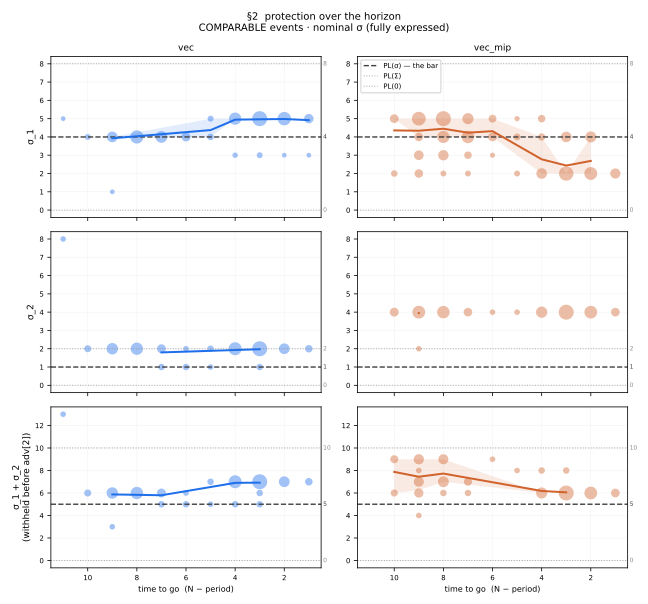
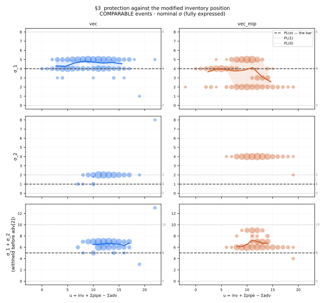
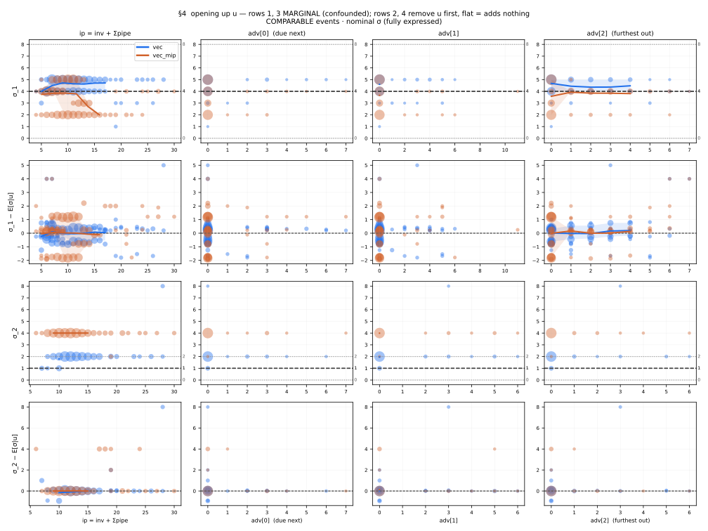
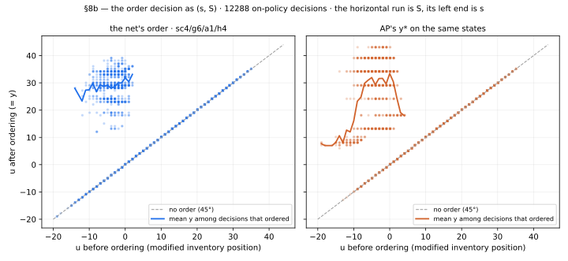

# INTERPRET — how the crowned policy orders and sets its protection levels

Spec §14 readback of the **crowned** artifacts, 2026-09-04 — the ordinal-head
cells adopted in [#E25](ESCALATION.md) on `het3_exp2`, `order_protection`,
`norm_obs=false`, `L4(hp+gym+arch)`; logged as [#E26](ESCALATION.md). It
supersedes the 2026-08-28/31 readback of the categorical-head crowns
(`sc4/g6/a0/h4` 337.4015, `sc4/g7/a0/h5` 337.6259, [#E19](ESCALATION.md),
[#E20](ESCALATION.md)), whose numbers are kept below wherever the comparison is
the finding — labelled *a0*.

| config | obs | head | 6-seed protocol | this artifact @8192 |
|---|---|---|---|---|
| **`sc4/g6/a1/h4`** — ships | `vec` | ordinal | 337.74 ±0.19 | **337.1663** (seed 21) |
| `sc4/g7/a1/h5` — reference arm | `vec_mip` | ordinal | 337.75 ±0.16 | 337.1984 (seed 25) |

Reproduce, all committed, from `adi_flex/`: `adi_flex_policy_probe.py
--identified --decompose [--config …]` (the surface and the identification
audit; `--validate` first), `adi_flex_readback_score.py --all --n-seeds 8192`
(every scored number below; the default `--config` is the crown, the `a0` ids
reproduce the earlier readback) and `--fig4 figures/fig4_order_sS.svg`,
`adi_flex_plot_policy.py --head a1` (figures 1–3; `--head a0 --outdir
figures/a0` redraws the retired crowns'). Every scored number is the 8192-seed
CRN protocol block from seed 0; surfaces use 400 on-policy episodes.

**Headline.** The paper's structures survive the ordinal head unchanged and one
constant moved *toward* the paper: the order policy is `(s(V̂), S)` with `S`
flat and `s` falling at slope −1, **and `s` now coincides with AP's at every
`V̂`** (the categorical crown sat one unit higher — the trigger bias
[#E21](ESCALATION.md) diagnosed, gone); `S` stays ≈ 5 below AP's. The ordering
is **−9.31 of the −10.01** edge. Two integers applied to AP — stop ordering in
the last 3 periods, lower `y*` by 4 — recover **90%** of the order gap, and the
mechanism is the one the earlier readback named: the relaxation over-values
inventory, so RL sheds 20 of holding to buy 13 of backorder. On the protection
side the picture **reversed**: the crown's own σ policy is worth **−0.06 in
isolation** against the paper's ladder, not the −1.11 the categorical crown
showed, and it does **not** beat the best constant (346.698). The
`discover`-stance evidence of the earlier readback was that artifact's, not the
shipped policy's (§5, §7).

---

## 0. What is and is not demonstrable here

`order_protection` makes σ **the action**, so the declared `confirm` stance RQ1
("the learned allocation is PL-shaped") is satisfied *by construction* and
demonstrates nothing (F7 recorded that trap when it removed σ as the decision;
the encoding that won the campaign reintroduces it). The protection sections
below therefore target RQ2, the `discover` stance: a PL policy holds σ
**constant**, so the question is whether the net's σ varies, on what, and
whether the variation is worth anything. §8–§8b address the order decision,
RQ3, and §4b/§7 the sufficient statistic, RQ4 — a `bypass` since F58.

## 1. Instrument validation (§14.1)

Two known answers recovered before any claim, re-run on the `a1` loader:

- `--validate` runs every readout against a stub with constant σ = 6 through the
  crowned artifact's environment. It reads back **spread 0 and zero sensitivity
  on all features**. A probe that cannot recognise a constant is not measuring
  one.
- The scoring harness replays the paper's ladder σ = (4, 1) under the AP order
  and returns **347.1749** — the recorded PL(σ) bar, to the float; the crown's
  own two decisions together return **337.1663**, its protocol row.

## 2. The gating fact: the decision is mostly not operative

**A protection level only does something when stock reaches its box.** The
cascade pours `rem` through `σ₁, adv[1], σ₂, adv[2]`; if `rem` is spent
earlier, σ has no effect and the network may emit anything. A level above the
stock reaching its box is **saturated** — σ = 17 against 3 units withholds 3.

**Binding** share (the *chosen* σ changes the allocation against no protection),
4800 allocation events per arm:

| | σ₁ | σ₂ |
|---|---|---|
| `sc4/g6/a1/h4` (ships) | **23.3%** | **9.0%** |
| `sc4/g7/a1/h5` | 22.8% | 10.6% |
| *a0* `vec` / `vec_mip` | 23.0% / 25.9% | 8.4% / 8.8% |

**Identification is a property of the encoding and the state distribution, not
of the policy**: four artifacts, two heads, the same quarter and tenth. Every
statistic below is computed on binding events only, and on *comparable* ones
where the paper's level is compared — both the policy's σ and PL's level fully
expressed. Non-binding events still bias the mean: the crown's σ₂ averages 5.97
where it does nothing against 5.32 where it acts (F55).

## 3. σ against the horizon



Nominal σ on comparable events (n per cell in the surfaces; cells under 5
dropped):

| time to go | 9 | 8 | 7 | 4 | 3 | 2 | 1 |
|---|---|---|---|---|---|---|---|
| crown `vec` σ₁ | 3.93 | 4.00 | 4.00 | 4.94 | 4.96 | 4.98 | 4.92 |
| crown `vec` σ₂ | 2.00 | 2.00 | 1.80 | 2.00 | 1.97 | 2.00 | — |
| `vec_mip` σ₁ | 4.34 | 4.45 | 4.23 | 2.78 | 2.43 | 2.69 | 2.00 |
| `vec_mip` σ₂ | 3.95 | 4.00 | 4.00 | 4.00 | 4.00 | 4.00 | 4.00 |

The crown holds σ₁ **on PL(σ) = 4** through mid-horizon and lifts it to ≈ 5 in
the last four periods; σ₂ is a flat **2** against PL's 1. **Neither arm zeroes
its protection at the end of the horizon**, the omission §6 prices. The
reference arm is the mirror image — σ₁ *falls* to 2–2.8 in the last four
periods while σ₂ sits at 4 — so the two arms tie on cost (337.17 / 337.20 best
seeds) with different protection surfaces, which is the first sign that the
protection surface is not where the cost is.

## 4. σ against the modified inventory position



On comparable events the crown's σ₁ is a flat band on PL(σ) = 4 across the `u`
range with the late-horizon lift of §3 above it; σ₂ is flat at 2. Matched to the
paper (comparable events, n in parentheses):

| arm | component | RL | PL(σ) | diff |
|---|---|---|---|---|
| crown `vec` | ahead of `adv[1]` (594) | 4.59 | 4 | **+0.59** |
| crown `vec` | ahead of `adv[2]` (214) | 2.00 | 1 | **+1.00** |
| `vec_mip` | ahead of `adv[1]` (679) | 3.66 | 4 | −0.34 |
| `vec_mip` | ahead of `adv[2]` (224) | 3.99 | 1 | +2.99 |
| *a0* `vec_mip` | ahead of `adv[1]` / `adv[2]` | 4.06 / 2.31 | 4 / 1 | +0.06 / +1.31 |

**The crown's near-class level is the paper's; the difference is extra
protection on the far class** — exactly the categorical crown's reading. What
changed is the reference arm, which now protects the far class by 3 more than
the paper and the near class by less. Two policies with different σ surfaces and
the same cost is what §5 measures directly.

## 4b. Opening up the MIP — the supply side collapses, the demand side not quite



`vec` arm only (the `vec_mip` arm is handed `u`, so the decomposition is not its
instrument). Rows 1 and 3 of the figure are marginal and confounded; rows 2 and
4 remove `u` nonparametrically first, where a **flat line means the feature adds
nothing**. Residual variance explained after `u` is removed: `ip = inv + Σpipe`
**0.001 / 0.000** (σ₁ / σ₂) — the net does not care how the position splits
between on-hand and pipeline. The demand profile adds a little, and time more:

| model | σ₁ | σ₂ |
|---|---|---|
| `u` alone | 0.226 | 0.489 |
| `u + ip` | 0.262 | 0.489 |
| `ip` + every `adv` component | 0.268 | 0.564 |
| + `time_to_go` | **0.336** | **0.607** |

Since `u = ip − Σadv`, any gain over "u alone" is composition: ~4 and ~8
points, and `time_to_go` adds 7 and 4 more (the horizon lift of §3). **`u` is
very nearly, but not exactly, sufficient for the protection decision** — the
right answer theoretically, since the paper proves sufficiency for the *order*
decision. The dependence is barely exercised: **`adv = (0,0,0)` in 53.2% of
on-policy states** (276 distinct profiles seen). *a0*: 0.292 → 0.332 / 0.069 →
0.132; same reading.

## 5. Scoring the rules (§14.2)

Order held at the AP policy for every arm, so σ is the only thing that moves.
8192 CRN seeds.

| σ rule under the AP order | cost | vs paper | vs best constant |
|---|---|---|---|
| PL(σ) ladder (4, 1) — the paper | 347.1749 | — | +0.4769 |
| **best constant (4, 2)** — a 56-ladder grid | 346.6980 | −0.4769 | — |
| **the crown's own σ policy** | **347.1171** | **−0.0579** | **+0.4191** |
| *a0* `vec` crown's own σ policy | 346.0685 | −1.1064 | −0.6295 |

**The shipped policy's protection component, in isolation, is worth 0.06 against
the paper's ladder and loses to the best constant by 0.42.** The categorical
crown's −1.11, which was 13 SE against the best constant and closed RQ2 as
"yes, and extracted" in the earlier readback, **does not replicate on the
crowned artifact**. Two readings, in the order F56 requires:

1. **The structure the earlier readback found was that artifact's, not the
   problem's.** Same board, same encoding, same hp, same seed block; only the
   order head differs. Under the ordinal head the policy put its cost edge in
   the order (§8) and learned a protection surface that, taken alone, is the
   paper's ladder plus noise.
2. **Isolation is a lower bound in company.** The 2×2 (§8) shows an interaction
   of **−0.64**: the crown's σ is worth −0.06 under AP's order but −0.70 under
   its *own* order (337.1663 against 337.8638). The protection is co-adapted to
   an order policy that holds ≈ 5 less stock, where a different split of a
   thinner buffer pays. That is real value in the shipped policy, but it is not
   "a rule beyond a constant protection level" in the sense RQ2 declared — it is
   the protection half of one joint policy, and it does not transfer to the
   paper's own order.

## 6. The end-of-horizon effect — unclaimed by every learned policy

| σ rule, order at AP | cost | vs paper |
|---|---|---|
| LEVEL only — constant (4, 2) | 346.6980 | −0.4769 |
| **TERMINAL only** — (4, 1), zero in the last period | 345.9955 | **−1.1794** |
| **constant (4, 2) + zero in the last period** | **345.3348** | **−1.8401** |
| the crown's own σ policy | 347.1171 | −0.0579 |

The simplest hand-written pair — one constant plus one boundary condition —
beats the crown's protection **by 1.78** under the same order. Neither crowned
artifact, under either head, learned the terminal rule (§3): the near-class
level *rises* into the last periods where it should fall to zero, because a unit
withheld in the final period protects a demand that arrives after the horizon.
[#E14](ESCALATION.md)'s off-bar heuristic is that rule applied to the ladder,
and it remains the best protection policy measured on this board.

## 7. Verdicts — the four stances against the crowned artifact

**RQ1 `confirm` — the allocation is PL-shaped.** *Not demonstrable by this
arm.* `order_protection` makes σ the action, so every expressible policy is
PL-shaped a priori (§0, F7). **Closed as not-answerable-here**; the shipped
encoding *is* the structure, and a future campaign can score the stance on a
`seq_mask` artifact where the shape is not imposed.

**RQ2 `discover` — a rule beyond a constant protection level.** **Not on the
shipped artifact.** Its protection component scores +0.42 *worse* than the best
constant in isolation and 0.06 better than the paper's ladder (§5); the
horizon boundary condition — the one structure beyond a constant that is worth
having, −1.18 alone and −1.84 with the constant — is absent from every learned
policy (§6). The 2026-08-31 verdict ("yes, 0.63 ± 0.05, extracted") stands
**for the categorical `vec` artifact it was measured on** and did not survive
the change of order head. **Closed: negative on the crown; the structure that
exists is a hand-written boundary condition, not a learned one.**

**RQ3 `confirm` — a state-dependent `(s(V̂), S)` order policy.** **CONFIRMED,
and stronger than before.** `S` ≈ 29.5 is flat in `V̂` and `s` decreases at
slope −1 per unit of `V̂`, **coinciding with AP's own `s` at every `V̂`** (§8b);
the categorical crown had `s` one unit higher. Scope as before: the stance named
the homogeneous branch and the exact DP; this is `het3_exp2` against the AP
policy — the same structural claim on a different branch and a weaker
reference, closed as supported, not as declared.

**RQ4 `bypass` — `u` as the sufficient statistic** (re-declared `bypass` on
2026-09-04, F58). **Bypassed — success.** The two obs arms tie on every board
(+0.01 ±0.23 here under the head, [#E24](ESCALATION.md)): a policy from the raw
state matches one handed the paper's transform. The readback shows the
mechanism — `ip` explains 0.001 of the σ residual once `u` is removed, so the
`vec` arm rebuilds `u` exactly on the supply side — and the small demand-side
composition effect (§4b) is what a sufficiency proof for the *order* decision
does not cover.

### The campaign's answer, in one paragraph

The paper's structures survive contact with RL, and the ordinal head brought the
learned policy *closer* to them: the order policy is `(s(V̂), S)` with `S`
constant and `s` decreasing in `V̂` at the paper's own trigger; the allocation is
a protection-level rule with the paper's level on the near class; `u` is the
statistic both run on. **The learned policy differs from the analytic one in one
constant** — `S` about 5 lower — **and one boundary condition on each side**: RL
adds the ordering horizon rule AP lacks (it stops ordering when a delivery can
no longer serve the horizon) and misses the protection horizon rule the paper's
ladder also lacks. Two integers applied to AP recover 90% of the order gap; one
integer plus a terminal zero beats the learned protection outright. **The
headline is not that RL found a new policy class. It is that both analytic
policies are stationary approximations of a finite-horizon problem, drawn from a
relaxation that over-values inventory — and that the whole of RL's edge on this
board is the ordering.**

## 8. Order versus protection — the 2×2

Same 8192 CRN block, `sc4/g6/a1/h4`:

| order | protection | cost | vs AP + PL(σ) |
|---|---|---|---|
| AP table | PL(4, 1) | 347.1749 | — |
| AP table | the net | 347.1171 | −0.0579 |
| **the net** | **PL(4, 1)** | **337.8638** | **−9.3112** |
| the net | the net | 337.1663 | −10.0087 |

```
ORDER alone       −9.3112     (93% of the total)
PROTECTION alone  −0.0579
interaction       −0.6396     (super-additive: the net's σ pays only with the net's order)
```

*a0*: −8.9452 / −1.1064 / +0.2782 — the order share was 91%, the protection
carried something on its own, and the halves were close to separable. Under the
head the order share is 93% and the protection half is worth nothing *except* in
company. Both cross cells drive a trained policy off its own state distribution,
so a cross cell is a lower bound on that half in company — which is what the
sign of the interaction now says out loud.

**The boards still disagree.** On `het_exp4` the same instrument gave AP order +
learned protection = 341.2645 against the bar's 341.2600
([#E13](ESCALATION.md)); the head's shipped `vec` arm there scores 342.48, so
the ordering *hurts* by ≈ +1.2 where here it wins by 9.3. The difference tracks
how much room the AP order policy leaves: PL(σ) sits +1.51% above the AP bound
on `het_exp4` and +4.31% here. "RL closes whatever the relaxation leaves open"
fits both boards.

## 8b. The order decision — the readback that mattered



`u` after ordering against `u` before, the crown's order on its own states and
AP's `y*` on the identical states (generator: `adi_flex_readback_score.py
--fig4`). An (s, S) policy draws the 45° no-order locus for `u ≥ s` and a
horizontal run at `S` for `u < s`; both policies draw exactly that, so **the
form is not in dispute** — what differs is where the lines sit.

### Wang & Toktay's Prop 3 holds, and the trigger is now the paper's

Pooled over the periods that order (5–7), 12,288 on-policy decisions:

| `V̂` | n | orders | net `s` | net `S` | AP `s` | AP `S` |
|---|---|---|---|---|---|---|
| 0 | 408 | 124 | 2 | 30.16 | 2 | 34.89 |
| 1 | 846 | 271 | 1 | 29.46 | 1 | 34.29 |
| 2 | 836 | 233 | 0 | 29.89 | 0 | 35.06 |
| 3 | 555 | 188 | −1 | 29.44 | −1 | 34.00 |
| 4 | 254 | 69 | −2 | 28.88 | −2 | 34.50 |
| 5 | 113 | 29 | −3 | 28.76 | −4 | 34.56 |
| 6 | 43 | 14 | −4 | 28.14 | — | — |

`s` falls at **slope −1 per unit of `V̂`** and **equals AP's at every `V̂` with
n ≥ 250** (the categorical crown read 3, 2, 1, 0, −1, −2: one unit high). `S` is
flat at ≈ 29.5 against AP's ≈ 34.5, with a drift of ≤ 2 across the range on
cells of 14–29 decisions at `V̂` ≥ 5.

### The differences are one constant and one boundary rule

| | net (`a1`) | *a0* | AP | Δ net − AP |
|---|---|---|---|---|
| `S` (periods 5–7) | ≈ 29.5 | ≈ 29.8 | ≈ 34.5 | **−5** |
| `s` at `V̂` = 0…5 | 2, 1, 0, −1, −2, −3 | 3, 2, 1, 0, −1, −2 | 2, 1, 0, −1, −2, −4 | **0** |
| orders in the last 4 periods | 1.4% | 0.9% | 9.1% | **shuts off** |

The last row is a boundary rule: with `L = 1`, an order at period 11 arrives
after the episode ends and one at period 10 serves only the final period. **The
AP relaxation has no horizon** — it is a stationary approximation and keeps
replenishing to the last period. The per-period table makes the taper explicit:
the crown orders in 100% of period-0 states (to `S` = 32), then in 4%, 33%, 41%,
17%, 4%, 1.5% of periods 4–9, and never in the last two.

### Two integers recover 90% of it

Order rule swapped in, protection at PL(4, 1), 8192 CRN seeds:

| order rule | cost | of the order gap |
|---|---|---|
| AP as published | 347.1749 | 0% |
| AP, `y* − 2` | 344.5466 | 28% |
| AP, no order in the last 2 periods | 345.4055 | 19% |
| **AP, no order in the last 3 + `y* − 4`** | **338.7974** | **90%** |
| the net's own order | 337.8638 | 100% |

Neither correction alone passes 28%; together they reach 90% (*a0*: 94% of a
smaller gap), and **δ = 4–5 is what the readback measured** (net `S` ≈ 29.5
against AP's 34.5). The interpretation predicted the fix rather than being
fitted to it. The two had to be searched jointly — without the boundary cut a
large δ starves the endgame.

### Why: the relaxation over-values inventory

Per-episode cost decomposition, 8192 CRN, protection at PL(4, 1):

| policy | total | setup | holding | backorder |
|---|---|---|---|---|
| AP order + PL(4,1) | 347.17 | 202.88 | **111.65** | 32.65 |
| net order + PL(4,1) | 337.86 | 201.10 | **91.24** | 45.52 |

The number of orders is essentially the same (setup 201 vs 203, i.e. ≈ 2.0
orders per episode); they are *smaller*. The net sheds **20.4 of holding** to
buy **12.9 of backorder**: at `h = 1, p = 9` that is ~20 unit-periods of stock
traded for ~1.4 unit-periods of shortage. AP carries a large buffer that is
almost never needed. *a0* read 19.0 for 12.1 — the same trade.

The proposed mechanism, unchanged: **the AP bound relaxes precisely the
constraint that makes stock hard to move between classes**, so a unit of
inventory is more fungible — and therefore worth more — in the relaxed problem
than in the real one. With advance demand information you can order *to need*
instead of hedging, so the real optimum holds less (`S` lower, smaller orders,
less holding). The cost decomposition is consistent with this and does not
prove it; a direct test would compare the two problems' shadow price on a unit
of stock, which this campaign has not run.

## 9. Appendix — retracted and superseded readings, and what caused them

Kept because the methodology is the transferable part (F55, F56, `PLAYBOOK.md`
LV3/LV4).

**First reading, withdrawn (2026-08-30).** "σ is a decreasing, saturating step
function of `u`", with "a scarcity regime where cumulative protection reaches
24.5, five times the bar". Computed over *all* events. The descent came from
low-`u` states where σ is unidentified; the scarcity regime is **0.0%
identified on σ₂ and 3.2% on σ₁**. It was not a behaviour — it was the absence
of one, filled in by a free parameter.

**Second reading, withdrawn (2026-08-31).** Correcting the first, the figures
switched to *effective* withholding `min(rem, σ)`, which made **every** policy
look state-dependent, PL(σ) included, because effective withholding is capped
by available stock. Fixed by requiring the **reference's** level to be fully
expressed too, which is what makes a constant plot as a constant.

**Third reading, superseded (2026-09-04).** "The net's protection beats the
best searched constant by 0.63 ± 0.05 (13 SE) — a rule beyond a constant
protection level exists" (F56, [#E20](ESCALATION.md)). True of the categorical
`vec` crown it was measured on; **false of the shipped ordinal-head artifact**,
whose protection component is +0.42 behind the best constant in isolation (§5).
Not a measurement error — a finding that was artifact-specific and was written
as if it were the problem's. The rule it leaves: **a §14 verdict is about one
artifact until it is re-measured on the next crown**, and a crown change owes
the readback again (F59).

**Three views exist**, each answering a different question:

| view | flag | question |
|---|---|---|
| comparable events, nominal σ | *(default)* | is the policy state-dependent? |
| binding events, effective withholding | `--effective` | how much was actually withheld? |
| all events | `--all-events` | reproduces what was withdrawn |

## 10. What this redirects

Four instruments now agree the value is in the **ordering**
([#E13](ESCALATION.md), [#E16](ESCALATION.md), [#E21](ESCALATION.md), and this
readback: 93% of the edge, the interaction included), and the protection story
closes with every learned policy *behind* a two-line heuristic. The open
questions are two: the protection horizon rule is worth −1.84 and no head has
learned it — the obvious next lever is a terminal feature or a head that can
express "zero at the boundary"; and the `S` gap of ≈ 5 to AP is now the whole
of the order difference, which an exact solver on a small het instance could
price as slack or as real.
