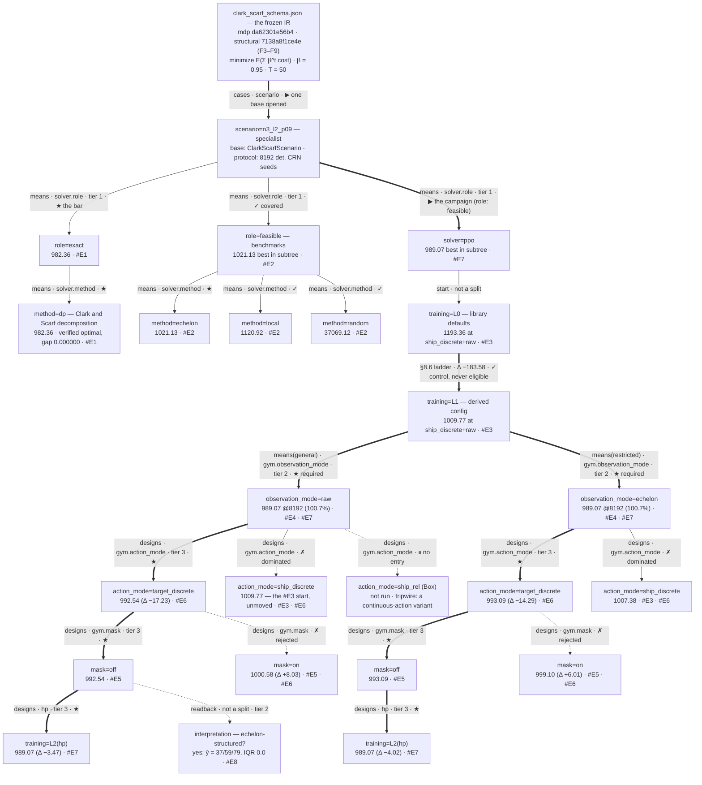

# ESCALATION.md — `clark_scarf`

Campaign log for the Clark & Scarf (1960) serial multi-echelon chain.
Sections per `ESCALATION_LOG_GUIDE.md` §2.

---

## §MAP — current frame (closed 2026-08-16)

**The question.** Echelon stock is an artifact of the *paper's analysis*, not
something a warehouse manager sees. Given only **raw installation stock**, does
an RL policy rediscover the echelon aggregation Clark & Scarf prove is the right
coordinate system?

**Why it is a fair question.** The two observation modes are related by an
invertible map, so they carry *identical information*. This is a test of
**representation**, not information. An MLP can express a cumulative sum (a
lower-triangular matrix of ones), so a `raw` shortfall would be an optimization
finding, not an impossibility.

**Target.** `n3_l2_p09` — 3 echelons, lead time 2, shortage 9. Specialist.
The other 17 cells of the frozen grid are later passes.

**The bar.** The exact Clark–Scarf DP, **verified optimal** against a
brute-force joint DP over the full joint state on `verify_tiny` (gap 0.000000),
not merely assumed from Theorems 1–2.

**Established (Phase A + Stages 1–3).**

| | |
|---|---|
| Phase A frozen model | `mdp = 771742e40b02`, `structural = 31635a1de6fd` — re-signed at F3–F6 (general pipeline; costs + per-link lags restored; stationarity misquote corrected; model layer declared in-schema at v0.9.0); results replay to the digit throughout |
| Gates | differential MATCH 10/10 · laws 8/9 · conformance **15/17** no-fail · 29 domain tests (re-gated at the v0.8.3 pin, 2026-08-16; **re-gate owed at the current v0.8.8 pin**) |
| Benchmarks (8192 CRN seeds) | DP **982.36** · `echelon_bs` 1021.13 · `local` 1120.92 · random 37069.12 |
| Ladder | `local → echelon_bs` = 99.8 (price of the echelon idea) · `echelon_bs → DP` = 38.8 (price of Theorem 2) |
| Gate classification | `random` + `local` are baselines; `echelon_bs` + `dp` are **references** — theory-informed arms must never gate an agent that has to discover the structure (#E2) |

**The research questions.** Declared, so the deliverables are not decided by
whoever remembers:

| tier | question | status |
|---|---|---|
| **1-comparative** *(standing — every campaign asks it)* | how does RL compare with the existing solutions, exact and heuristic? | answered: **100.69%** of the exact optimum, beats the best heuristic by 32.06 (#E7) |
| **2-structural**, stance **bypass** *(primary)* | is the echelon transform *required* to solve the problem well? | answered: **no** — −0.55 ± 0.14 at L1 (two-seed arms, inside the 1.57 floor) and point estimate −0.0014 at L2(hp); the seed-backed leg is L1's, and both agree on zero (#E4, #E7) |
| **2-structural**, stance **confirm** *(secondary)* | is the learned policy nonetheless echelon-structured? | **answered: yes** — implied targets 37/59/79, IQR 0.0, identical to the DP's; echelon-invariant at levels 2–3 (#E8) |

Carried in two stances because they read the same number differently:
`raw ≈ echelon` is a **success** under bypass and **inconclusive** under
confirm. Confirm is kept because echelon stock is *known* optimal, so a good
enough policy has to arrive there.

**Stage-4 starting configuration.** `ship_discrete` action (whole-unit
quantities, one categorical head per link) + `raw` observation + no masking,
at L0 (library defaults, `gamma = beta`) and L1 (the spec §8.6 derivation).
Nothing beyond the spec's own derivation is assumed.

**Open.** Nothing. Every design axis is closed (interface, masking,
observation, `L2(hp)`), both research questions are answered, A2's readback
shipped as `INTERPRET.md`, and A5 was closed **unrun** — it defended a tier-3
quantity the campaign never claims (see the frontier).

**Status: CLOSED 2026-08-16.** Both research questions answered — tier 1 at
100.69% of a verified optimum, tier 2 on both stances (bypass *and* confirm).
Carried open at close, deliberately and not as debt hidden by the closure —
struck through as each resolved afterwards, so the row records both what was
carried and how it ended rather than being deleted:

| open item | why it is open |
|---|---|
| ~~**A5** — multi-seed retrain~~ | **closed unrun.** It defended a tier-3 quantity (the tuning procedure's expected value) that the campaign never claims. The review it prompted corrected a real overclaim in #E7 instead — the L2 delta's ± is eval-only on a one-seed-per-arm design — and the tier-2 answer stands on L1 (seed-backed) plus the #E8 readback |
| ~~**A3** — remaining Stage-6 packaging~~ | **closed 2026-08-17** by the contribution pass (PR #40) |
| ~~**re-gate at v0.8.10**~~ | **closed.** Superseded and overtaken: gates now run at **v0.9.5** — conformance 18/21, laws 8/9, differential 11/11, `pytest` 33/33, zero FAILs anywhere. See §IR-CHANGELOG for the per-bump re-gates |
| ~~**adopt `benchmarks` in the IR**~~ | **closed.** The IR declares four — `dp=exact`, `echelon`/`local`/`random`=`feasible` — and `benchmarks.declared` PASSes. The README keeps its `role` column as presentation, no longer as the interim home |
| the other 17 `(n, l, p)` cells | separate leaderboards by construction; never in scope |

**Parked.** Cross-cell generalization; the `n_echelons` and `leadtime` sweeps;
a second demand family.

**Naming.** `echelon_bs` in earlier entries is the benchmark the tree calls
`method=echelon`, after its file. The ledger is append-only and keeps its
original wording.

---

<a id="MAP"></a>

## §MAP — the design tree

**INSTRUMENT NOTE (read before comparing any two numbers here).** Rows marked
`@8192` are the protocol (8192 deterministic CRN seeds, VecNormalize injected,
selection artifact — not the terminal checkpoint). Rows marked `sel` are a
run's own CRN selection-block score at 256 seeds, and rows marked `tune` are a
tuning trial's 512-seed score. **They are not interchangeable.** A tuning
winner is *chosen on* its 512 seeds, so its `@8192` re-score is expected to be
worse; quoting a `tune` number against an `@8192` bar would manufacture a win.
Only `@8192` rows are decision-relevant. **Resolution floor = 1.57** — #E3's
measured L1 training-seed sd; a delta inside it is not a claim, whatever its
eval-seed z-score says (eval SEs run ~0.2–0.4 and will call 0.5-unit
differences "significant" that two training seeds cannot reproduce).

### How to read this tree

**Split kinds.** Two questions generate all of them: *does the crown fork or
pass through one child?* × *do the siblings share one protocol, bar and
leaderboard?*

| kind | crown | frame | children are |
|---|---|---|---|
| **cases** | forks | own — scores incomparable | disjoint cases of the parent |
| **means** | forks | shared — scores comparable | the same case solved by different means |
| **designs** | passes one | shared | competing designs, one crown |

`OR × own frame` is empty by construction, which gives the one rule governing
the whole tree:

> **A score may be subtracted only within a frame.** Across frames a number may
> be reported — labeled as such — but it never selects: no crown, no prune, no
> `✗`.

**Per-edge attributes.** `coverage` `required`/`optional` · `order` by
generality (what makes a `means` split a chain, and what licenses its
cross-link delta as a *price of generality*) · `role` `exact`/`relaxed`/
`feasible` · `question`/`tier`.

**Role, and why min/max needs no second vocabulary.** With
`objective.sense = minimize` from the IR, define `≽` = *at least as good as*.
Then `relaxed ≽ opt` (unattainable), `exact = opt`, `feasible ≼ opt`. Never
"upper"/"lower" bound — those flip with the sense. A `feasible` sibling
scoring `≻` an `exact` one is impossible; if it happens the eval, the bound or
the simulator is wrong.

**Tiers.** `1-comparative` is **standing** — every campaign asks how RL
compares with the existing solutions, exact and heuristic, so it is not this
case's contribution. `2-structural` is this campaign's own question.
`3-engineering` is everything that only decides which encoding trains best.
Tier is independent of depth: §3.1 orders layers by conditioning, "not
importance".

**Labels.** Edge = `{kind}[({attribute})] · {locus}.{axis} · {mark} {status}`;
node = `{axis}={option}` / `{score} (Δ) · {#E ids}` (root exempt). Axis names
are read from the code (`observation_mode`, `action_mode`, `mask`), never
coined — so a node whose axis does not match its incoming edge is attached to
a split it does not belong to. Identity never carries a rank: priority is
mutable and lives in the status, so no reprioritization can rename a path.

**The tree is a structured bookmark.** Nodes carry identity, result and
reference and nothing else, because every detail is one hop away in the
ledger. Node labels must be *stable*, not *complete*. Links live in the
readings table below the diagram — mermaid `click` reaches external URLs but a
fragment href does not navigate (measured, 2026-08-16).



### Layers and node readings

One table, not two: the split's typing and what the node *says* are the same
row. The tree carries kind, tier and mark on its edges; this is the greppable
form, plus the reasoning the two-line nodes no longer hold.

| node | split kind · attributes · tier | reading | entry |
|---|---|---|---|
| root — the frozen IR | not a split | the frame is a frame over **one** problem: a moved `mdp` fingerprint re-roots it, a moved `structural` need not (cf. F2, which moved on a pin bump with a byte-identical schema) | — |
| `scenario=n3_l2_p09` | **cases** · required | one study base opened. The other 17 cells of the frozen grid are separate leaderboards — **absent** from the tree, not postponed children, so they carry no coverage debt | — |
| `role=exact` / `method=dp` | **means** · required · **1-comparative** | the bar, and the only reason 992.54 is legible as 101.0%. Verified optimal against a brute-force joint DP on `verify_tiny` (gap 0.000000), not assumed from Theorems 1–2 | [#E1](#E1) |
| `role=feasible` / `method=echelon`·`local`·`random` | **means** · required · **1-comparative** | best non-exact solution 1021.13 — half the tier-1 claim, and the number a practitioner actually compares against. `echelon_bs` and `dp` are **references**, `local` and `random` **baselines**: theory-informed arms must never gate an agent that has to discover the structure | [#E2](#E2) |
| `training=L0` → `training=L1` | not a split — the §8.6 ladder | L0 is library defaults at γ=β, reporting-only, never a gate, therefore never eligible for the crown — drawn as the rung L1 escalated *from*, not a sibling that lost. Both measured at the zero-knowledge start (`ship_discrete`+`raw`), which is why Δ −183.58 rides the edge: both endpoints are that configuration. L0 fails legibly — over-stocked, holding 1025–1071 against the DP's 868 | [#E3](#E3) |
| `observation_mode=raw` / `=echelon` | **means** · required · `order: echelon ⊂ raw` · **2-structural** | `raw` is physical stock per installation plus in-flight, with **no** echelon machinery supplied; `echelon` hands over Clark & Scarf's coordinates as component-wise running sums, invertible against `raw`. Price of generality −0.55 ± 0.14 @8192, **inside the 1.57 floor** | [#E4](#E4) |
| `action_mode=target_discrete` | **designs** · 3-engineering | the bin index *is* the order-up-to level `y_k`. The optimum is **constant** in target coordinates and state-dependent in quantity coordinates, so the pre-registered representational argument is **supported** — and it wins in all four cells, i.e. configuration-independent | [#E6](#E6) |
| `mask=off` / `=on` | **designs** · 3-engineering | rejected **twice, independently, on two structurally different masks** — one-sided under `ship`, two-sided under `target`. The pre-registered mechanism is **not** supported and none is claimed; the mask cannot touch the top link, where an unlimited supplier makes it all-True | [#E5](#E5) · [#E6](#E6) |
| `training=L2(hp)` | **designs** · 3-engineering | **crowned.** 258/260 trials; both studies found their best by trial ~80 and the remaining two thirds moved nothing. Four top artifacts re-scored @8192 land within **0.027** of each other at **989.07** — four configurations, two representations, one policy quality. Gain over L1 −3.47 / −4.02 (≈2σ: one training seed against a two-seed L1 mean). Winner's curse unquantified by design — a tier-3 quantity, not claimed | [#E7](#E7) |
| `interpretation` | not a split — readback · **2-structural** | **the confirm half, answered yes.** Implied order-up-to takes exactly one value per echelon where the clip is slack — 37/59/79, IQR **0.0** over ~36k decisions — identical to the DP's critical numbers. Echelon-invariant at levels 2–3 (spread 0.00/0.43), approximate at level 1 (0.75), which is defensible: level 1 faces demand this period. Agreement 84–95%, over-ordering upstream | [#E8](#E8) |

`role` is set at the `solver` layer and **inherited** by everything beneath it,
which is why the `ppo` subtree carries no role annotation of its own.

### The two research questions

**Tier 1 — comparative (standing).** How does RL compare with the existing
solutions, exact *and* heuristic? Three-part answer, all on one frame:

> `ppo` **989.07** is **100.69%** of the exact optimum (982.36), **beats the
> best heuristic** by 32.06 (1021.13), and sits 204.29 below the `L0` floor
> (1193.36). Headroom to the bar: **6.71**.

**Tier 2 — structural (this campaign's question).** Two stances, deliberately
ordered:

| stance | claim | instrument | status |
|---|---|---|---|
| **bypass** *(primary)* | a policy from raw installation stock matches one handed the echelon coordinates — the transform is not *required* to solve the problem well | the ordered `means` split; its cross-link delta | **answered, twice, and they agree**: −0.55 ± 0.14 at L1 with two-seed arms (inside the 1.57 floor), point estimate −0.0014 at L2(hp) on one seed per arm. L1 carries the seed-backed evidence; L2 sharpens the estimate (#E4, #E7) |
| **confirm** *(secondary)* | the learned policy is echelon-structured | policy readback on the crowned artifact | **owed** (A2) |

Confirm is carried because echelon stock is *known* optimal, so a good enough
policy has to arrive there and the readback says whether it did. The two are
not redundant: `raw ≈ echelon` is a **success** under bypass and
**inconclusive** under confirm — not needing the coordinates is consistent with
having found them and does not show it.

### Deviations from the guide, each carried deliberately

1. **The benchmarks are on the tree, not in the off-tree register.** §3.5 files
   bar calibration and baselines off-tree. A benchmark *is* a solution to the
   problem, so it belongs on the tree as a `means` sibling of the RL branch;
   the register keeps only work that consumes budget without being a solution.
2. **The `solver` split is `means`, not a partition.** `S` never required
   disjointness — the guide's own extension chain is nested, not disjoint. What
   unifies coverage is that no child may be pruned, which holds here: crowning
   `dp` would not retire the question whether a policy can *learn* the
   structure, and a good RL result does not retire the bar.
3. **`L0` is L1's parent, not its sibling**, contra §3.2's "controls are
   siblings". That rule was derived from `game2048`'s MLP-on-onehot — a
   *contrastive* control competing on one leaderboard. `L0` is a **floor**
   control: reporting-only, never a gate, so never eligible for the crown.
   Drawn as a sibling it would assert a selection that never happened.
4. **Masking nests below the action interface for a structural reason, not a
   conditioning one.** Masking was rejected in all four cells — which is
   evidence the interface does *not* condition its verdict. It nests below
   because the axis is **defined in terms of** the parent
   (`clark_scarf_gym.py::action_masks`): one-sided `j ≤ ship_capacity[k]` under
   `ship_discrete`, two-sided `u_k ≤ y_k ≤ x_{k+1}` under `target_discrete`,
   with a lower bound that has no analogue in the quantity encoding. "Masking =
   on" is two different axes sharing a name. That also explains the magnitude
   gap (+3.61 under `ship` vs +8.03 under `target`) and *strengthens* the
   four-cell agreement into two independent rejections.

All four are filed in §FRAME-CHANGELOG.

**Crowned path (§3.4).** The crown **forks at every `means` split** — one ★ per
covered child — and passes through exactly one child at each `designs` split:

`n3_l2_p09 / dp` ★ and
`n3_l2_p09 / ppo / L0 → L1 → L2(hp) / {raw | echelon} / target_discrete / mask=off` ★,
both leaves now closed at `L2(hp)` (#E7).

So the crown is two-part by construction, and says so: **best overall for the
cell is `dp` 982.36; best learned is `ppo` 992.54.** `L0` is on the path as the
rung escalated *from*, not a pruned competitor. Edges are jointly validated —
the interface win holds with masking off in both links — so adopt the *path*,
not the components.

**Slice view (§3.3) — interface × observation, the interaction under test.**

| | obs raw | obs echelon | price of generality |
|---|---|---|---|
| `ship` + nomask | 1009.77 | 1007.38 | **+2.39** (z +9.1) |
| `ship` + mask | 1013.38 | 1010.03 | **+3.35** (z +10.8) |
| `target` + nomask | **992.54** | 993.09 | −0.55 *inside floor* |
| `target` + mask | 1000.58 | 999.10 | +1.47 *inside floor* |

Real under `ship`, vanishes under `target`: the target interface already
expresses the action in echelon terms, so the echelon *observation* is
redundant. The two are partly **substitutes** — which is why the axes could not
be read independently, and why #E4's one-at-a-time verdict fell.

Each `designs` layer is expanded **only under its crowned parent** — a masking
or HP child of the dominated `ship_discrete` interface would be work under a
pruned node. Those cells were nonetheless *measured* (the #E6 factorial) and
live in the slice above, where they do the one job an off-crown cell can do:
establish that the interface win is configuration-independent.

**Bounds attached (§3.1).** interface −10.9…−17.2 · masking +2.6…+8.0
(rejected) · price of generality +2.4 under `ship`, ∅ under `target` ·
derivation −183.6 · **headroom to bar 10.2**.

**What the tree says that the first Stage-4 round did not.**

1. **The tier-3 axis dominates the arithmetic.** The action interface is worth
   11–17 units; every other design choice is worth ≤ 3 or is negative. The
   campaign's *research* axis is not where the performance is — which is
   exactly what tier exists to say without reordering the layers.
2. **Two nodes closed as honest negatives**, both with pre-registered
   mechanisms that failed: masking (rejected in all four cells) and — under the
   crowned interface — the observation axis itself.
3. **Half the tier-2 question is still open.** The bypass half is answered; the
   confirm half is A2 and unstarted. The tree now shows that as a node rather
   than leaving it implicit.

**Frontier (§3.5) — as of #E7.**

| | agenda item | node | status |
|---|---|---|---|
| A1 | L2(hp), both links, 20h | RHP, EHP | ✓ closed (#E7) — both branches crowned at 989.07 |
| A2 | Stage-5 readback on the crowned artifact — **the tier-2 confirm deliverable** | RPROBE | ✓ closed (#E8) — `INTERPRET.md` |
| A3 | Stage-6 package | off-tree | `PLAYBOOK.md` ✓ written (LV1 action encoding, LV2 price representation at L2, FM1 verify the reference); README/CLAUDE.md current |
| A4 | re-check the price of generality at tuned settings | slice | ✓ closed with A1 — point estimate −0.0014, eval-paired ± 0.0123 on one training seed per arm; agrees with L1's seed-backed −0.55 ± 0.14, both inside the floor |
| A5 | ~~multi-seed retrain to quantify the winner's curse~~ | RHP, EHP | ✗ **closed unrun 2026-08-17.** It defended the tuning *procedure's* value — tier 3, unclaimed, and nothing depends on it. Reviewing it did surface a real error: the L2 delta's tight ± is eval-only on a thinner seed design, corrected in #E7. The useful residue, if the L2 number is ever quoted standalone, is 2 fresh seeds per crowned config (4 runs, no re-tuning) |

Split kinds bind the queue: A1 crowns the bottom `designs` children and
licenses pruning their siblings; neither `means` link's obligation is reduced
by the other completing — `required` coverage is debt, and the case does not
close while one is outstanding, nor while A2 is.

**Off-tree register** (budget-consuming, *not* solution-touching) — narrowed
now that benchmarks are on the tree: bar **calibration** ✓ (the verification of
the DP against a brute-force joint DP, #E1 — the calibration work, not the DP
itself) · the CRN protocol construction · the resolution-floor measurement
(1.57, #E3).


## §UPSTREAM — the proposal round

Twenty-two proposals filed from this campaign. **Twenty-one accepted**,
shipping solver v0.8.2 → v0.9.4 plus two guide-only revisions; **#39 awaiting
disposition**. The last five
(#34–#38) are all regressions in the releases that shipped this campaign's own
proposals, and all five were found by *adopting* those releases within hours that shipped four of this
campaign's own proposals. Two of them are defects in those very fixes —
accepted, implemented, and stopping short of the case that motivated them.
The pattern is worth naming: a proposal is dispositioned when the code lands,
but it is only *verified* when a real case exercises it. The last four — #30–#33,
the post-F7 round — were dispositioned about half an hour after filing. All
four were found by *adopting* v0.9.0 rather than by reading it, and three were
defects in a release then three days old; the fourth (#33) was a gap the code
had already argued against itself in a comment. The drafts are deleted:
each issue carries the same body with its disposition attached and cannot
drift, while a local copy can — six of the eleven already carried a stale
`proposed` status within hours of being accepted. **Read the issue, not a
memory of the draft.**

| # | what it argued | outcome |
|---|---|---|
| [#18](https://github.com/tong-wang/auto-mdp-solver/issues/18) | §7 mandates the reset pattern's `else` branch and nothing checks it — a gym omitting it trains on `n_envs` fixed paths while evals stay healthy | `behavior.gym_reseed`, **v0.8.2**. Passes here |
| [#19](https://github.com/tong-wang/auto-mdp-solver/issues/19) | §3 has a shape contract but no drawing contract: node content, score/Δ provenance, layer naming, rule 2's missing mechanism, one table not two | `93f288c`, merged with #20 |
| [#20](https://github.com/tong-wang/auto-mdp-solver/issues/20) | `S`/`P` both read as their opposite; coverage conflated with disjointness; root and first two layers unspecified; benchmarks mis-filed off-tree | `93f288c` — `cases`/`means`/`designs`, the cross-frame rule, per-edge attributes, tiers, floor-control qualification |
| [#21](https://github.com/tong-wang/auto-mdp-solver/issues/21) | §5.2 calls a clairvoyant baseline "an upper bound" — false for every minimize domain | `8140d49`, **v0.8.3** — §9.3 defines `≽`, §5.2 restated, §9.9 names the three roles |
| [#22](https://github.com/tong-wang/auto-mdp-solver/issues/22) | §3.1's mis-attachment check needs an axis on the edge; no template edge carried one | `5660331` — `{locus}.{axis}` on every split edge, locus composing as `arch+hp` |
| [#23](https://github.com/tong-wang/auto-mdp-solver/issues/23) | §9.9 mandates naming a benchmark's role and the IR has nowhere to hold it; its "impossible" case is unenforceable | `bd0c72e`, **v0.8.5** — root-level `benchmarks`, `benchmarks.declared`, two gate behaviours |
| [#24](https://github.com/tong-wang/auto-mdp-solver/issues/24) | `2-structural` is three claims (`confirm`/`discover`/`bypass`) with different evidence and different deliverables | `7810ec1` — the stance is declared and ties the §14 deliverable to it |
| [#25](https://github.com/tong-wang/auto-mdp-solver/issues/25) | §9.7 forbids quoting the screen layer and says nothing about the trial layer — the one a human reads | `1ff99ce` — "never quoted" reaches the trial row; `mdp_tuning` prints the layer |
| [#26](https://github.com/tong-wang/auto-mdp-solver/issues/26) | the IR declares axes as sets in `gym` and a scalar in `rl`; a bound computed as an eval column cannot be declared at all | `aa31fc1`, **v0.8.8** — `algos` beside `algo`, per-family levels, `column` arms |
| [#27](https://github.com/tong-wang/auto-mdp-solver/issues/27) | the ordering gate compares raw means where the same function compares z-scores; `exact` defined so no implementation can hold it | `aa31fc1` — role is about logic not numerics; the check gets a band |
| [#28](https://github.com/tong-wang/auto-mdp-solver/issues/28) | §8.6 asks args.txt for the SB3 version and nothing checks it — so #26 item 4 had no contract to read | `59540b1`, **v0.8.9** — §8.4's provenance set + `run.provenance`, carrying #26 item 4 |
| [#29](https://github.com/tong-wang/auto-mdp-solver/issues/29) | the IR has no place to say what the *model* admits, so a sweep and an implementation cap freeze into the frozen block as if they were theory — this campaign's first freeze did exactly that | **v0.9.0** — `mdp.model`, `narrowed: {to, by}`, `model_fingerprint()`, the `model.boundary` check. Part 2 (`mdp.caps`) **declined** in favour of a stronger rule: a width **names** a constant, and a literal at a width site FAILs. This case is the first adopter (F6) |
| [#30](https://github.com/tong-wang/auto-mdp-solver/issues/30) | `model.boundary` gate 3 draws `cap` and `vals` from the **same** constant, so it forbids the pattern v0.9.0 recommends and permits the cap overrun it was written to catch | **ACCEPTED — fixed, v0.9.2.** Split on the `axis` tag exactly as proposed: a tagged width is the design value and is skipped; an untagged cap is compared against the quantity it caps. Upstream corrected one step of the argument — `_axis_tiers`' role string names the *state variable*, not the model quantity, so the pairing is by name-stripping and an **unpaired cap makes no claim**. Verified here: PASS, and `n_levels_max` is reported unpaired. Upstream also deleted a test that had encoded the bug. See [#E9](#E9) |
| [#31](https://github.com/tong-wang/auto-mdp-solver/issues/31) | `StateVariable.length` is scalar, so a 2-D state can declare no width at all — `game2048` carries `n_cells = grid_size^2` as a redundant constant, an invariant across two instance fields that nothing checks | **ACCEPTED — implemented, v0.9.2**, as `length: int \| str \| list[int \| str]` rather than a new `shape` field; `_axis_tiers` reports *which* axis a constant sets, and gate 2 reads the list so a half-symbolic `["grid_size", 3]` is caught on the literal part. Metadata only — `zeros()` is not shape-aware, so a 2-D declaration does not yet build a 2-D runtime array |
| [#32](https://github.com/tong-wang/auto-mdp-solver/issues/32) | `_BUILTINS` whitelists `for`/`in`/`range` for "comprehension index ranges", the evaluator runs them, but `_check_expr` never binds the index — so every comprehension is rejected at validation | **ACCEPTED — fixed, v0.9.2.** Bindings subtracted in `_check_expr`, parsed with `ast` rather than by regex, so tuple targets and nested comprehensions bind too; an undeclared name inside a comprehension still fails. **Residual: the `_exec` single-dict scoping caveat was not addressed** — genexps still depend on it silently |
| [#33](https://github.com/tong-wang/auto-mdp-solver/issues/33) | `Decision.dim` is a literal `int` while `StateVariable.length` takes a symbol — so an action width cannot name a constant and must be capped and padded | **ACCEPTED — implemented as filed, v0.9.2.** `dim: int \| str` with `MdpBlock.decision_dim()` beside `decision_bounds`; a constant named there classifies as **tier-1**, so `grids.axes` will now warn about sweeping it — correct, since it changes the action space. Spec §5.0's width-site list gained `decisions[].dim` |

| [#34](https://github.com/tong-wang/auto-mdp-solver/issues/34) | v0.9.2 adds `ModelQuantity.stochastic` but not to `_OPTIONAL_SINCE_29`, so `_prune_absent` leaves a `null` per quantity and **every IR declaring `mdp.model` gets a new freeze token on upgrade** — the property v0.9.0 was built to guarantee | **ACCEPTED — fixed, v0.9.3, but NOT the proposed way.** `_OPTIONAL_SINCE_29` prunes on `not v`, which catches `False` as well as `None`, so adding `stochastic` to it would have collapsed "deterministic by assumption" and "never asked" into one hash — fixing the token by discarding a claim. Shipped as a model-scoped `_model_payload` pruning only `None`. Upstream also found `model_fingerprint()` moved too, which this report missed. Payload diff isolates it to nine `stochastic: null` entries; pruning reproduces `20f732827637` exactly. Invisible to the shipped suite: no shipped example declares a model layer, so only the first adopter is hit |

| [#35](https://github.com/tong-wang/auto-mdp-solver/issues/35) | #32's binding parses `mode="eval"` and returns `{}` on `SyntaxError`, so it misses **statements** — and every `dynamics.updates` entry is one. A second site: the invariant check strips `prev.<name>` *before* validating, handing the target parser an unparseable string | **ACCEPTED — both parts fixed, v0.9.3.** Change (2) differently: `prev.x` substitutes to the **bare name**, not the `prev_x`-plus-`known` route proposed here, which would have widened the resolvable namespace and could mask a genuinely undeclared `prev_x`. Same file FAILs on v0.9.2 and validates with an `exec`-mode fallback: the collapsed IR is `['period', 'stock', 'pipe']`, four state variables to one. See [#E10](#E10) |
| [#36](https://github.com/tong-wang/auto-mdp-solver/issues/36) | `_random_policy` emits one scalar per decision regardless of `dim`, so a vector decision cannot be generated and the differential cannot exercise one; `_seed_prev_row` shares the assumption at t=0 | **ACCEPTED — implemented as filed, v0.9.3**, including the `n == 1` asymmetry. The seed-stream concern raised here was checked by pinning an existing example's action sequence from a v0.9.2 worktree: identical before and after. Keeps `ship_1..ship_4` and `n_levels_max` alive through the first half of the collapse |

| [#37](https://github.com/tong-wang/auto-mdp-solver/issues/37) | `--all-instances` re-reads the JSON for its instance list (`raw["mdp"]["scenario"]`) instead of using the loaded IR, so a **grouped** file yields no instances and the covering-set sweep runs the base alone | **ACCEPTED — `ungroup_mdp` as proposed, v0.9.3.** The *stronger variant* proposed here was **rejected with a measurement**: `resolve_catalog` drops instances inconsistent with the active selection, so sourcing the list from a loaded IR yields 7 of 9 on `inv_single` — trading a visible 11→1 for an invisible 11→9. Upstream also lifted the branch out of the argparse handler, which is why it had no test. Measured here: 11 declared, **1 swept, exit 0**, no warning. The only one of the four that fails silently. Fix is `ungroup_mdp`, already in the package |

| [#38](https://github.com/tong-wang/auto-mdp-solver/issues/38) | `laws.py::_fixed_decisions` builds one scalar per decision — a **fifth** site of the `dim` defect, in a module #36 did not touch, so every policy law raises on a vector decision | **ACCEPTED — fixed, v0.9.4.** The instance warning was load-bearing: upstream says it would have shipped the three-line version. Two findings past the report — `decision_bounds` was equally unresolved (live in `mab`, whose `arm` narrows to `(0, 4)` on 5-arm instances), and a **mixture name is not an instance**, so threading it through without a guard would have crashed every domain declaring one. `laws.py` had no unit tests; 21 added |

| [#39](https://github.com/tong-wang/auto-mdp-solver/issues/39) | both CLIs parse `--decision NAME=VALUE` as `float(val)`, so neither can drive a vector decision — and spec Phase-A **step 7b** names the interpreter CLI as how the restatement's trajectory is rendered | filed 2026-08-17 — awaiting disposition. A **sixth** `dim` site: #38's sweep covered the libraries, not the two arg parsers. Asks for width resolution plus a comma form, with a single value broadcasting so existing invocations are byte-identical |

**Sequencing, for whoever picks these up.** #30 is independent and the most
urgent — it is the one currently red on this domain and latent on
`examples/inv_single`. #31 and #32 **compose**: together they let a
per-installation pipeline collapse from `pipe_1 … pipe_4` to one `pipe` with
`shape: ["n_echelons", "leadtime"]` and quantified dynamics. Landing #32
alone would remove the enumeration at the cost of the width naming F7 just
won, so #31 should lead. #33 is independent and least urgent: `N_LEVELS_MAX`
is inert padding, not a correctness risk.

**Three that were sharpened by being pushed back on**, recorded because the
correction is the useful part:

- **#20's evidence.** The filing claimed two campaigns showed co-ranked `P1 ★`
  children without naming either. The maintainer checked four maps, found
  none, and corrected it; the claim reproduced in `cases/fnv` — which was not
  among them, and which is a *shipped* case. The retraction is on the issue.
  Naming the campaign in the filing would have avoided the round trip.
- **#26 Part A.** The filing asked for `algo` to *become* `algos`. Rejected in
  favour of adding `algos` beside it: `extra="forbid"` turns a rename into a
  breaking change for every existing IR at the version bump meant to be safe
  to take. "Mechanical and scriptable" described the edit, not the coordination.
- **An `algo` rung for §8.6 was drafted and withdrawn before filing.** Masking
  is not an algorithm-class change: the PPO objective, GAE and clipping are
  untouched, `action_masks()` is a gym capability, and this domain's own train
  script already labels the flag "L2(gym) escalation #2". The distinction would
  not have survived contact with the code.

## §FRAME-CHANGELOG

- **2026-08-16 (redefinition)** — split taxonomy RETYPED, campaign-wide. `S`/`P`
  are withdrawn: `S` read as "selection" but marked coverage, and `P` reads as
  "partition", which was an *S-split shape*. Kinds are now generated by two
  questions — *does the crown fork?* × *do siblings share one protocol, bar and
  leaderboard?* — giving **cases · means · designs**, with the fourth cell
  (`OR × own frame`) empty by construction. That emptiness is now stated as the
  governing rule: **a score may be subtracted only within a frame; across
  frames a number may be reported but never selects.** The extension chain
  merges into `means` (its siblings share a bar) rather than into `cases` (whose
  never do) — so `raw − echelon = −0.55` is a legal subtraction and an
  `n3 − n5` would not be. Attributes moved per-edge: `coverage`
  (`required`/`optional`, the old `must`/`stretch`), `order` by generality,
  `role`, `question`/`tier`. **No score, node, verdict or mark changed.**
- **2026-08-16 (redefinition)** — root RE-ROOTED and two layers SPLIT in. The
  root is now the **frozen IR** with both fingerprints, so the tree is
  self-evidently a tree over one problem and the §MAP ↔ §IR-CHANGELOG link is
  mechanical (a moved `mdp` re-roots the frame; a moved `structural` need not —
  cf. F2). Below it the **`scenario`** split, whose siblings are *study bases* —
  one named registry object each, so a specialist and a generalist are siblings
  rather than an invented axis; only opened children are drawn, so no phantom
  coverage debt is created. Below that the **`solver.role`** split. Layers are
  named and ordered, never numbered — a numbered layer collides with §8.6's
  `L0/L1/L2` (#19 item 3, and the merge condition recorded on that issue).
- **2026-08-16 (redefinition)** — benchmarks REPARENTED out of the off-tree
  register onto the tree, superseding the earlier same-day entry that drew them
  as "reference · not a split" edges. A benchmark **is** a solution to the
  problem, so it is a `means` sibling of the RL branch; §3.5's register keeps
  only work that consumes budget without being a solution (bar *calibration*,
  protocol construction, the floor measurement). Children are grouped by
  **role** — `exact` · `feasible` (+ `relaxed` where a domain has one) — which
  makes the optimality **bracket** legible when both bounding roles are open.
  Naming follows the artifacts (`benchmark/{method}/`): the node is `method=dp`,
  never "bar", since §9 makes `--baseline`/`--reference` a per-comparison role,
  "not part of the artifact's identity". The tree node is `method=echelon`, the
  artifact name (`clark_scarf_benchmark_echelon.py`); earlier ledger entries say
  `echelon_bs` for the same benchmark and are **not** rewritten — the ledger is
  append-only.
- **2026-08-16 (redefinition)** — `ship_rel` REPARENTED from a child of
  `action_mode=target_discrete` to a **third sibling** on the `action_mode`
  split. It is an alternative interface, not a refinement of `target_discrete`;
  the mis-parenting survived five revisions and was exposed only when the label
  scheme made its path unwritable. Still `⏸`, same tripwire.
- **2026-08-16 (redefinition)** — tree RELABELLED again (presentation only, and
  superseding the earlier same-day RELABELLED line's three-line node format).
  Identity is a **name**, never a rank: §3.1's `S{n}`/`P{n}` are simultaneously
  identity and a *mutable* priority, so one REPRIORITIZED line would rename
  every descendant path and stale every citation of it. Priority now lives in
  the status. Split ids are `{kind} · {locus}.{axis}` with locus from spec
  §8.6's `gym`/`arch`/`hp`; nodes are **two** lines, `{axis}={option}` /
  `{score} (Δ) · {#E}`, with axis names read from the code — so a node whose
  axis disagrees with its incoming edge is visibly mis-attached. Marks moved
  from the node to the **edge**, where the selection they judge happened.
  Ledger entries gained explicit `<a id="E{n}"></a>` anchors so the readings
  table can link to them without depending on heading text. **No number moved.**
- **2026-08-16 (redefinition)** — research questions declared, and A2
  RECLASSIFIED. Tier `1-comparative` is **standing** — every campaign asks it,
  so it is not this case's contribution — and the campaign's own question is
  tier `2-structural`, carried in two stances: **bypass** (primary, *answered*:
  the echelon transform is not required, −0.55 inside the floor) and **confirm**
  (secondary, *owed*: is the policy echelon-structured?). The distinction is
  load-bearing rather than cosmetic — `raw ≈ echelon` is a **success** under
  bypass and **inconclusive** under confirm. A2 therefore stops being a
  Stage-5 epilogue and becomes half the campaign's declared claim; it is drawn
  as an interpretation node (`RPROBE`) on the crowned leaf.

- **2026-08-16** — reference frame REPARENTED to the top layer, on operator
  direction. (a) The bar and the reference ladder are now tree nodes as well as
  off-tree register items, so every score in the diagram can be placed against
  the bar on sight. (b) The `L0 → L1` ladder is promoted **above** the S-split,
  contrary to §3.1's default order: it was settled campaign-wide at the
  zero-knowledge start, before any design split existed, and everything below
  inherits it. This also fixes an instrument error — Δ −183.58 was measured at
  `ship`+`raw` (#E3) but the old tree hung it off the crowned `target` leaf;
  it now rides the `L0 → L1` edge, both endpoints of which are that
  configuration. (c) `L0` is drawn as L1's **parent**, not its sibling,
  contrary to §3.2's "controls are siblings": a P-split's siblings compete for
  the crown and `L0` is reporting-only, so it can never be crowned — §8.6's
  levels are a ladder, and a ladder is a chain. The per-link "L0 not re-run on
  S2" placeholder is dropped as moot: L0 was run once, campaign-wide.
  `L2(hp)` stays at the bottom — it is per-branch. No score changed.
- **2026-08-16** — tree RELABELLED (presentation, no frame change). The layer
  labels `T0…T3` are withdrawn: they were a second numbering the reader had to
  join back to the ledger, and they existed only to dodge a collision with spec
  §8.6's training levels. Layers are now named by their **axis** and cited by
  **ledger id**; nodes carry three lines — identity, score (Δ where bounded),
  status with its `#E` reference — and the mechanisms they used to carry moved
  to the node readings and the entries themselves. No node, edge, mark, rank or
  number changed.
- **2026-08-16** — masking/interface REPARENTED: masking was explored first
  (#E5, under `ship`) but the tree places the interface above it, because the
  masking axis is *defined in terms of* the interface — one-sided on quantity
  under `ship_discrete`, two-sided on the order-up-to level under
  `target_discrete`. (An earlier draft of this line justified the move by
  conditioning strength; that was wrong — masking was rejected in all four
  cells, which is evidence the interface does **not** condition its verdict.
  The nesting stands on the structural dependence instead.) Masking's rejection
  is unchanged, and reads more strongly: two different mask constructions,
  independently refuted.
- **2026-08-16** — root RETYPED S (coverage), shape *extension chain*
  `echelon ⊂ raw`: crowning either leaves the other non-redundant (§3.1
  litmus), so the cross-link delta is the *price of generality*, not a
  selection.
- **2026-08-16** — interface/observation order REPARENTED in analysis but not
  in the tree: #E6 shows the interface conditions the observation verdict
  (+2.39 under `ship`, ∅ under `target`); tree kept rooted on observation by
  operator direction, interaction carried as a slice view.
- **2026-08-13** — Frame opened. Chain length reframed from fixed-at-2 to a
  swept axis on operator direction; lead time then split out as a *second,
  independent* axis (an installation is a discretionary buffer, a lead period is
  committed flow — same delay, different control).

---

## §IR-CHANGELOG

**Re-gates on pin bumps — no fingerprint move, so no F-entry.** F-numbers are
reserved for actual fingerprint moves (guide §5); a bump that leaves both
hashes alone is recorded here in prose so the *absence* of a move is on the
record rather than inferred from silence.

- **2026-08-17, v0.9.4 → v0.9.5.** Re-gated after the bump. `mdp =
  da62301e56b4` and `structural = 7138a8f1ce4e` both **unchanged** — v0.9.5 is
  CLI argument parsing and touches no hashed structure. Conformance 18/21,
  laws 8/9, differential 11/11, `pytest` 33/33, zero FAILs anywhere. These are
  the numbers the contribution PR (#40) states, and they were re-verified on
  the staged folder.

  *What it unblocked here.* #39 — both CLIs parsed `--decision NAME=VALUE` as a
  scalar, so neither could drive this domain's vector `ship`. Spec Phase-A step
  7b names the interpreter CLI as the route to the annotated sample trajectory,
  so the restatement's own artifact could not be regenerated by the documented
  command, and that section carried an API snippet instead. `--decision ship=10`
  now broadcasts to the resolved width and `ship=10,0,5` sets components, both
  per instance; the restatement is back on the documented command, verified at
  this pin (`ship [10,10,10]`, `holding 69.00`).

  *And what regenerating it found* — the reason this entry matters beyond a
  version number. The trajectory had been showing **pre-F1 numbers for the whole
  campaign**: holding `109.00` against `69.00`, in-transit stock charged one
  echelon too low, corrected at F1 and never re-rendered. Recorded in full at
  the restatement's §Annotated sample trajectory, decomposition included. The
  artifact whose purpose is to let a human check the model was showing a model
  corrected nine re-signings earlier, and **nothing gates it against the IR** —
  it was found only because someone tried to regenerate it. Upstream's
  disposition put "re-render whenever the model changes" into step 7b and left
  an automatic re-render-and-diff check as an open idea rather than a release.

- **2026-08-17, v0.9.3 → v0.9.4.** Re-gated after the bump per the repo brief.
  `mdp = da62301e56b4` and `structural = 7138a8f1ce4e` both **unchanged** —
  v0.9.4 is a fix to `mdp_ir.laws`'s decision builder and touches no hashed
  structure. The red gate F9 shipped with is now **green**: laws 4/9 with four
  FAILs → **8/9, zero FAILs**, exactly what the in-process patch predicted, and
  `pytest` 32/33 → **33/33**. Conformance 16/21 zero FAILs, differential 11/11.
  Repo-wide re-gate: all six domains zero FAILs.

  *Two things upstream found past the report, both worth carrying.* (i)
  `decision_bounds` resolves per instance and was equally unresolved at that
  site — live in `mab`, whose `arm` narrows from `(0, 9)` to `(0, 4)` on its
  5-arm instances, so the laws were fed an index those instances do not have.
  Same line, same parameter, and invisible because a wrong-but-plausible bound
  produces no error. (ii) A **mixture name is not an instance**:
  `decision_bounds` raises `KeyError` on one, and the laws are called with
  mixture names, so threading the instance through without
  `inst if inst in scenario.instances else None` would have crashed every
  domain declaring a mixture. This domain declares none; `inv_single` does.

- **2026-08-17, v0.9.0 → v0.9.2 — `mdp` MOVED, and the host did it.**
  `mdp = 20f732827637` → **`1cdcaed91870`**; `structural` unchanged at
  `2ff6e8344181`. The schema was not touched. Deliberately **not** given an
  F-number: F-numbers record the campaign re-signing its own model, and this
  is an upstream defect expected to revert.

  *Cause, isolated.* v0.9.2 adds `ModelQuantity.stochastic: bool | None =
  None` — a real feature (does the *theory* make this quantity random). It is
  absent from `_OPTIONAL_SINCE_29`, so `_prune_absent` leaves it in and every
  quantity serializes a `null` that was not there before. Verified by
  extracting v0.9.0's `mdp_ir` and diffing the two hashed payloads: the *only*
  difference is nine `stochastic: null` entries, one per declared quantity.
  Pruning them reproduces `20f732827637` exactly. The other two new fields
  (`length`'s list form, `dim: int | str`) are widenings and cannot move an
  existing hash.

  *Why it matters more than one token.* This is the property v0.9.0 was built
  to guarantee, and `_prune_absent`'s own docstring states it — "the freeze
  token must be byte-identical for an IR that predates them — otherwise every
  downstream fingerprint moves on upgrade and the Phase-A confirmations all
  read as voided". Any IR declaring `mdp.model` has its Phase-A sign-off
  silently voided by upgrading. That is currently **only this domain** (#29
  nominated it first adopter), which is why the bump found it here on the
  first re-gate and nowhere else — and why the rule that a pin bump is
  re-gated before its results are trusted earned its keep again.

  *Everything else at the new pin.* `model.boundary` now **PASSES** (#30's
  fix), taking conformance 15/21 → **16/21**; it reports `n_levels_max` as an
  **unpaired cap** whose coverage is therefore unchecked — the honest reading,
  and the residual upstream flagged as worth its own issue. Laws 8/9 (1 skip,
  0 fail), differential MATCH 11/11 @40 episodes, 34 domain tests.

- **2026-08-16, v0.8.2 → v0.8.3.** Re-gated after the pin bump per the repo
  brief. `mdp = 2171a651d328` and `structural = b4fb9602a580` both **unchanged**;
  conformance 15/17 no-fail (the denominator grew by one — v0.8.2 added
  `behavior.gym_reseed`, which this campaign proposed as #18 and which passes),
  laws 8/9 no-fail, differential MATCH 10/10, 29 domain tests. Nothing in
  v0.8.2 or v0.8.3 touches the hashing path: v0.8.2 is a conformance check plus
  spec prose, v0.8.3 is spec prose plus `plugin.json`. Contrast F2, where a
  byte-identical schema *did* move `structural` — that is why this is checked
  rather than assumed.

**F1 — in-transit stock was assigned one echelon too low.**

The first frozen model charged stock in transit *to* level `j` at level `j`'s
cumulative rate. Assumption 3 says a level's costs cover stock at that level
plus stock "at a lower level **or in transit to a lower level**" — *lower* being
operative — so in transit **to** `j` belongs to echelon `j+1` and is charged its
**source's** rate until it lands. Stock in transit to the *top* level is in no
echelon at all (on order, not yet in the system); `h_install` being 0 above the
chain gives that for free.

Uncorrected it double-charged pipeline stock (2.0 vs 1.0 per period at
`n3_l2_p09`) and biased the shipping incentive against moving stock downstream —
the exact trade-off the campaign measures.

Fingerprint `53d5d1f9cd5e` → **`2171a651d328`**. Re-signed by the operator.

**Caught by reading Assumption 3 against the implementation. The differential
passed bit-exact both before and after** — it proves the interpreter and the
domain agree, not that they agree on the *right* model. This is the case for the
restatement existing at all.

**F2 — structural fingerprint moved on the v0.8.1 pin bump.** Docs-only release,
byte-identical schema, `mdp` fingerprint unchanged; `structural`
`2cbb56a6f3dd` → **`b4fb9602a580`**. Attributed by re-computing on a copy reduced
to one action mode (same result), proving gym action modes do not feed it.
Recorded so a future reader does not read it as a model change.

---

**F3 — the pipeline was a sweep frozen as model structure; re-signed after
generalizing it to a shift register.** (2026-08-17)

`mdp` fingerprint `2171a651d328` -> `83588654745e`, `structural`
`b4fb9602a580` -> `26ab0de96d58`.

*What was wrong.* The frozen model carried the in-flight pipeline as two named
slots (`arriving`, `pending`) — capacity leadtime <= 2, exactly the sweep max,
with the runtime assert phrasing the slot count as a property of the problem
("leadtime must be 1 or 2"). The paper's model states no such bound. Operator
review named the defect precisely: *L >= 1 is model structure; L swept over
{1, 2} is experiment design; a slot cap is implementation* — three layers, and
the formalization had collapsed them into one. The restatement's sign-off
never surfaced it, because Phase A records sweeps and has no field for a
theoretical domain (proposed upstream:
`UPSTREAM_PROPOSAL_model_domain.md`, draft).

*The change.* `pipe1..pipe4` — a general shift register, unrolled to
`LEADTIME_CAP = 4` slots (a named implementation cap with headroom, mirroring
`n_levels_max`): each A event shifts every slot one step toward the
destination; a dispatch enters at slot `leadtime`; costs and echelon
coordinates read the per-level total over slots. The simulator, gym
(per-slot echelon running sums, so the coordinate change stays invertible at
any L), adapter and probes are general in the slot count; raising the cap is
appending slots, not restructuring.

*Verification, both directions.* Generality: new instance `verify_l3`
(N=2, L=3) added to the covering set — differential **MATCH 11/11** including
it, and a new domain test tracks a single impulse at every L in 1..4,
asserting it lands after exactly L arrival events with all higher slots empty.
Behavior preservation at the swept values: the DP record eval replays
**982.362986 identical in every column**, and the crowned PPO artifact
(trial 211) replays **989.065774 identical in every column** — 8192
deterministic CRN seeds, so these are bit-level reproductions, not
statistical agreement. No campaign number moves; every result and verdict
stands. Conformance 15/20 no-fail, laws 8/9 no-fail at the v0.8.11 pin.

*Why this is an F-entry and not silent.* The mdp block changed, so both
fingerprints moved — but the *model semantics at every point the campaign
evaluated* did not. The infidelity was in what the frozen record claimed the
model to be, which is exactly what a fingerprint is for.

**F4 — shipping/ordering costs and per-link lead times restored to the model.**
(2026-08-17, same review round as F3)

`mdp` fingerprint `83588654745e` -> `3fb17ad1eae9`, `structural`
`26ab0de96d58` -> `31635a1de6fd`.

*What was wrong.* Two more design points frozen as model structure, found by
the operator walking the schema after F3. (i) The paper's model carries
**linear shipping/ordering costs** `c_k` at every link and the decomposition
survives them; the scenarios set them to 0 for convenience — and the rendering
then omitted the term entirely, freezing the design value as *absent
structure* (a c capped at exactly {0}, the same class as the two-slot
pipeline). (ii) Lead times are **per-link `L_k`** in the model; the record
stated a single L as if identical lags were model structure.

*The change, deliberately asymmetric — the boundary mechanism choosing per
case.* `c_k` is **fully rendered**: a `c_ship` constant vector (design sets
0), a `shipping` cost component, an info component and an eval column — a
nonzero cost is now a value change, not a structural change. `L_k` enters the
model with the **rendering narrowed and cited**
(`clark_scarf.model.json` renderings.leadtime: identical lags, by design +
implementation, tripwire = any heterogeneous-lag instance) — lifting it is a
scenario-field + dispatch + DP extension and no designed instance needs it.
Render what is cheap, cite what is expensive; both are visible either way.

*Verification.* Differential MATCH 11/11; 35 domain tests including the
boundary gates; DP record eval replays **982.362986** and the crowned PPO
artifact **989.065774**, every pre-existing column identical to the digit,
the new `cost_shipping` column identically 0. Conformance 15/20 no-fail.

*Model-layer statement (clark_scarf.model.json).* `c_k: real >= 0` with the
design-not-model provenance in `source`; dynamics and objective quantified
over `L_k`; `out_of_scope` now carries the *precise* section-5 boundary — a
setup cost is admissible at the highest echelon only, and is not modeled at
any level — replacing the looser exclusion.

**F5 — the record misquoted the paper on demand stationarity; notation aligned
with the reprint.** (2026-08-17, same review round)

`mdp` fingerprint `3fb17ad1eae9` -> `8fa8c9c84f2e`; `structural`
**unchanged** at `31635a1de6fd` — the correction is a candidate `desc`, and
candidate pools are excluded from the structural hash. Desc-only: no behavior
surface touched; the full test suite (differential included) passes unchanged.

*The misquote.* The poisson candidate's desc claimed "the paper holds the
demand distribution fixed across the horizon." The reprint's section 2 says
the opposite, in a parenthetical: *"(The demand distributions may actually
differ from period to period.)"* (p. 1783). So stationarity is a THIRD thing
frozen as model that is actually design — after the leadtime cap (F3) and the
zero costs (F4) — and this one had been laundered through a false citation.
The desc now quotes the paper correctly and classifies both the family and
the stationarity as selection/design.

*Notation.* The model layer now carries the paper's own symbols, verified
against the reprint in-repo (`Clark-OptimalPoliciesMultiEchelon-2004.pdf`,
read 2026-08-17): in-transit slots are `w_{k,s}` (the paper's `w_j`), lead
time is `lambda_k` (the paper's λ — NOT L, which the paper uses for the
one-period cost function `L(x)`, Eq. 1), discount is `alpha` (`α^n`, rendered
as the IR's `discount_factor`), costs `h`, `p`, `c_k` all verbatim (Eq. 1,
p. 1784), and a `notation` map records the two deliberate divergences: `D_t`
for the demand draw (the paper's variable is `t`, which is our period index)
and forward `t` vs the paper's periods-remaining `n = T - t`. `u`, `y`, `x̄_n`
in the DP and readback were already the paper's (Eq. 4).

*(Addendum, same day.)* The symbol **adoption** half of this entry was
reverted on operator review: renaming the model layer to w/λ/α created a
third vocabulary, disconnected from `_scenarios`/`_mdp`, and none of it was
ever consumed downstream. The rule that survives: **one vocabulary — the
schema/code names — everywhere; the paper's symbols are recorded, not
adopted**, in `clark_scarf.model.json` `notation` (and a pointer in the
schema's root `assumptions_log`, which moved neither fingerprint). Every
*content* correction of F5 stands: the stationarity misquote fix, the
per-link lags, the L(x)-collision warning (recorded as "never shorten
leadtime to L"), and the t-vs-n index map.

**F6 — the model layer ported from the sidecar into `mdp.model`; first adopter
of v0.9.0.** (2026-08-17)

`mdp` fingerprint `8fa8c9c84f2e` -> `771742e40b02`; `structural`
**unchanged** at `31635a1de6fd`.

*Why now.* Upstream #29 accepted the model/rendering diagnosis and shipped it
as **v0.9.0** — `mdp.model` (quantities with a theoretical `domain` + source,
`out_of_scope`, quantified `dynamics`, `notation`), `narrowed: {to, by}` on
state variables and decisions, a `model_fingerprint()`, and a
`model.boundary` conformance check. The sidecar
`clark_scarf.model.json` existed only because the pinned IR forbade unknown
keys; that block is lifted, so the sidecar is **retired** and its content is
now schema-native. The maintainer nominated this case as first adopter, no
shipped example having declared a model layer yet.

*What moved and what did not.* Declaring the theory changes the `mdp` block,
so the freeze token moved; the **rendering did not change at all**, so
`structural` held — the split #29 asked for, doing exactly its job on its
first use. Annotations are free by design (`narrowed` is excluded from every
hash unconditionally), which is why adding citations to nine elements cost
nothing. DP replays **982.362986** and the crowned PPO **989.065774**,
identical in every column; differential 11/11; conformance 16/21 no-fail with
`model.boundary` **PASS**.

*`caps` is gone, and that is the upstream correction worth recording.* Part 2
of the proposal asked for an `mdp.caps` object. It was **declined**: every
width site (`length`, `bounds`, `horizon.T`) already accepts a symbol, and
`_axis_tiers` already derives what a constant caps and what it renders from
the reference. So a width **names a scenario constant**, and the check is
stronger than the proposal's — *a literal at a width site, for a quantity the
model declares, FAILs*. Documenting a cap would have recorded the mistake;
requiring the name prevents it. Verified here: bumping `n_levels_max` 4 -> 5
moves `mdp_fingerprint` and leaves `structural` untouched, which is the
cap-behaviour this campaign asked for, obtained by naming rather than by
re-scoping a hash.

*A residual the shipped check cannot see — the campaign's own F3 defect.*
`model.boundary` derives its widths from references, and its inventory here
reads `horizon_T, n_levels_max, ship_max`. **`leadtime` is absent**, because
this domain's lead-time cap is rendered as a *count of `pipeN` variables*
rather than at a width site. Gate 2 (literal at a width site) and gate 3
(width covers every designed value) both operate over that derived set, so
neither can reach it: the pre-F3 two-slot pipeline would pass. Covered locally
instead by `test_pipe_slot_count_equals_the_declared_leadtime_cap`, which
asserts the rendered slot count equals `LEADTIME_CAP` and fails when they
drift. Worth reporting upstream as a follow-up to #29.

**F7 — the lead-time cap removed: the pipeline is indexed by installation, and
its width NAMES the lead time.** (2026-08-17)

`mdp` fingerprint `771742e40b02` -> `20f732827637`; `structural`
`31635a1de6fd` -> `2ff6e8344181`.

*Why.* F6 closed with a residual it could not fix: `leadtime` was the one
model quantity with **no width site**, so `model.boundary` could not see it,
and the rendering carried a hand-rolled `LEADTIME_CAP = 4`. That cap is not
a scale headroom like `n_levels_max` — it is a hard expressiveness ceiling.
`L = 5` was **unrepresentable**, and the model layer declares `L_k` to be any
integer >= 1. A model whose declared domain the rendering cannot reach is the
F3 defect again, one layer down.

*The change — a transposition, not a redesign.* The register was indexed by
**slot**: four variables `pipe1..pipe4`, each `n_levels_max` long, `pipeS[k]`
= units landing at installation `k` in `S` more arrivals. It is now indexed by
**installation**: `pipe_1..pipe_4`, each `length: "leadtime"`, `pipe_k[s]` =
units landing at installation `k` after `s+1` more arrivals. The two carry the
same units in transposed storage — hence the digit-exact replay below.

What that buys is the whole point: the width is now a **named scenario
constant**, so each instance renders exactly the slots it selects (L=1 -> 1
slot, L=3 -> 3) and **any** lead time is representable. The cap is not raised,
it is *gone* — `LEADTIME_CAP` is deleted from `clark_scarf_scenarios.py`, and
so is the invariant `pipe_slots_beyond_leadtime_empty`, which existed only to
police the unused tail. This is the pattern the shipped `inv_single` example
already used (`length: "pipeline_len"`, `pipeline = pipeline[1:] + [0]`); the
campaign had wrongly concluded that slice-and-concat did not validate and
enumerated instead. It does. A new instance `verify_l3` (N=2, **L=3**, T=12)
sits in the covering set as the regression that the ceiling is gone, and
`clark_scarf_test.py`'s impulse test now sweeps `L = 1..6` — past every
designed value — asserting each row's length equals its instance's lead time.

*Behaviour preserved, verified twice.* Differential MATCH **11/11**; the DP
replays **982.362986** and the crowned PPO **989.065774**, identical in every
column at 8192 CRN seeds. `pytest` 34/34.

*One expression genuinely changed, and it is the interesting one.* The
`conservation` invariant summed the pipes over live links only
(`sum(pipe1[0:n_echelons])` — the slice ran over the **k** index). Transposed,
that slice no longer exists: `sum(pipe_4)` is a whole inert vector. The first
rewrite summed all four and **failed at every seed**, because inert pipes are
initialized with cover that *drains* into inert stock, which the
`stock[0:n_echelons]` term already excludes — so units left the accounted set
for the first `leadtime` periods. The liveness filter is now explicit
(`(sum(pipe_3) if n_echelons > 2 else 0)`, …). Worth recording because the
invariant caught a real accounting error in a change that was otherwise
behaviour-preserving, which is exactly the job §Phase-A step 7c claims for it.

*And it turned the F6 residual into a live gate — which then misfired.* With
`leadtime` finally named at a width site, `model.boundary`'s derived
inventory reaches it, closing the hole F6 recorded. Gate 3 immediately
**FAILs**: `leadtime=2 … is outrun by a designed 3`. That is a bug in the
gate, not in the rendering — see [#E9](#E9). Conformance therefore sits at
15/21 with one **known-wrong** FAIL, filed upstream rather than worked around.

**F8 — the theory declares its own randomness, and the file is grouped along
the boundary.** (2026-08-17)

`mdp` fingerprint `20f732827637` -> **`bd77963d9078`**; `structural`
**unchanged** at `2ff6e8344181`.

*What changed.* Two v0.9.2 features, adopted together:

- **`mdp.model.quantities[].stochastic`** — "does the THEORY make this
  quantity random?" Declared on all nine: `demand` **true** (Clark & Scarf's
  random demand is the problem), the other eight **false**. `leadtime_k` is
  the interesting one and upstream cites this domain for it: a deterministic
  lead time here is an *assumption of the source*, not a scenario that happens
  to have picked a point mass. Those two look identical from outside and mean
  opposite things, which is exactly what the field exists to separate.
- **the grouped file layout** — the `mdp` block now reads
  `model` / `design` / `rendering`, so opening the JSON shows which section
  moves which fingerprint. For a campaign whose entire subject is that
  boundary, having it visible in the artifact rather than only in prose is the
  point.

*Attribution, checked rather than assumed.* Regrouping moved **nothing** —
stripping `stochastic` from the grouped file reproduces `20f732827637`
exactly, so the whole move is the declaration. `structural` held, as it must:
the rendering is untouched. DP replays **982.362986** and the crowned PPO
**989.065774**, identical in every column.

*A side effect worth naming.* Every quantity now SETS `stochastic`, so the
stray `null` behind [#34](https://github.com/tong-wang/auto-mdp-solver/issues/34)
cannot arise here — the local symptom is gone while the bug is not. F8's token
is therefore stable across the #34 fix, and `bd77963d9078` is the one to
verify against from here.

*What this rewrite could NOT do, and why.* The obvious prize — collapsing
`pipe_1..pipe_4` into one matrix and `ship_1..ship_4` into one vector
decision, deleting `n_levels_max` — needs #31/#32/#33, all shipped in v0.9.2,
and **two of the three do not reach the case as shipped**. Both blockers are
one line, both are filed, and the collapse waits for them rather than being
half-done twice. See [#E10](#E10).

**F9 — the last hardcoding removed: one `pipe` matrix, one `ship` vector, no
cap.** (2026-08-17)

`mdp` `bd77963d9078` -> **`da62301e56b4`**; `structural` `2ff6e8344181` ->
**`7138a8f1ce4e`**.

*What changed.* The rendering the campaign has been arguing toward since F3,
landed in one move at the v0.9.3 pin:

| | before | after |
|---|---|---|
| pipeline | `pipe_1 … pipe_4`, four state variables | one `pipe`, `length: ["n_echelons", "leadtime"]` |
| action | `ship_1 … ship_4`, four scalar decisions | one `ship`, `dim: "n_echelons"` |
| stock | `length: "n_levels_max"`, four slots, padded | `length: "n_echelons"` |
| dynamics | one line per link per event | one quantified rule per event |
| cap | `N_LEVELS_MAX = 4` in code and IR | **gone** |

Every width now NAMES a scenario constant, so an instance renders exactly the
shape it selects — in chain length, lead time and action width alike. The
`no_flow_through_padding` invariant is retired with the padding it policed.

*Behaviour preserved.* Differential MATCH **11/11** @40 episodes across the
covering set; the gym coordinate-change check holds at all three chain
lengths; `verify_tiny` still totals 40.00; DP replays **982.362986** and the
crowned PPO **989.065774**, identical in every column at 8192 CRN seeds. The
inert levels this deleted were provably invisible — `h_install` is 0 there and
the gym already sliced them out — which is why a change this large moves no
number.

*What it took, and it was not the schema.* Four upstream defects, filed over
the day and fixed in v0.9.3 (#34–#37), plus one still open (below). The IR
edit itself is small; it was unreachable for eight hours because the features
it needs — `length` as a list, `dim` as a symbol, comprehensions in
statements — each shipped with a gap that only a real adopter could find.

*`model.boundary` now sees everything.* Its width inventory reads
`horizon_T (tier-2 horizon), leadtime (tier-2 obs-dim), n_echelons (tier-1),
ship_max (tier-1)` — no unpaired cap, because there is no cap. [#E9](#E9)'s
residual ("`n_levels_max` named for no declared quantity, so coverage is
unchecked") is closed by deletion rather than by pairing, which is the better
of the two fixes: nothing to check.

*One gate is red, and it is upstream again.* `mdp_ir.laws` fails all four
policy laws with `TypeError: 'float' object is not subscriptable`.
`laws.py::_fixed_decisions` is a **fourth site** with the defect #36 fixed in
`_random_policy` and `_seed_prev_row` — it builds one scalar per decision and
never consults `dim`. Patching it in-process gives 8/9 with zero FAILs, so it
is the only blocker. A grep for `decision_bounds`/`decision_dim` across the
harness shows it is now the last such site. See [#E10](#E10).

**Leaderboard correction, 2026-08-17 (pre-contribution audit).** The `random`
row read **37628.09 ± 51.04**; re-running its eval at the header protocol gives
**37069.12 ± 48.95**, deterministically. `dp`, `echelon`, `local` and the
crowned PPO all reproduce to the digit. Row updated.

*No cause is claimed.* A random policy's draws are bounded by capacities that
depend on stock that depends on the draws, so any perturbation anywhere
cascades; the difference identifies nothing on its own. The recorded figure
also predates F9, under which `advance2` required a `n_levels_max`-wide ship
vector that this benchmark does not produce — so it came from a code state not
identified here, and running that down would buy nothing.

*Why it does not matter beyond the digits.* `random` is the floor: 37x the
optimum, present so the ladder has a bottom and a broken eval is visible. It
supports a gate margin of z ≈ 718 and decides nothing. Quoting it to two
decimals is more precision than the arm carries.

## §LEDGER

<a id="E1"></a>

### #E1 — the exact DP was 30% suboptimal, and looked convincing

↑ [design tree](#MAP) — explains `role=exact` / `method=dp`.

*Hypothesis.* The Clark–Scarf decomposition, implemented from Theorems 1–2, is
the optimal reference for this domain.

*Run.* `clark_scarf_dp_exactness.py` — brute-force DP over the full joint state
on `verify_tiny` (N=2, L=1, T=4), tractable because at lead time 1 the pipeline
is empty at the decision point.

*Observed.* Clark–Scarf 24.340 vs joint optimum 18.698 — **+30.2%**. The brute
force independently reproduced the simulator to Monte-Carlo error on two separate
policies, so the brute force was sound and the decomposition implementation was
not.

*Diagnosis.* **Wrong risk period.** Cost is assessed on the **end-of-period**
state, one demand draw further on than the decision point — the periodic-review
"lead time **plus one**". The two terms need *different* risk periods: cost is
realized at end of period `s+L` (`D_{L+1}`), availability binds at the *decision*
point of `s+L` (`D_L`).

*Verdict.* **CONFIRMED and fixed.** Gap → **0.000000**, exact to machine
precision. Targets moved `[26,48,69] → [37,59,79]`.

*Why it mattered.* The wrong table was entirely plausible — monotone critical
numbers, a sensible time-varying profile, `ȳ₁` matching an independently computed
newsvendor fractile — and every other gate stayed green. Only the brute-force
comparison caught it; now
`clark_scarf_test.py::test_clark_scarf_decomposition_is_exactly_optimal`.

<a id="E2"></a>

### #E2 — the naive benchmark rung was not naive

↑ [design tree](#MAP) — explains `role=feasible` — `method=echelon` · `local` · `random`.

*Challenge (operator).* The heuristic first labelled `myopic` ran base-stock on
**echelon inventory position** with cumulative lead-time coverage. That
aggregation *is* Clark & Scarf's contribution — nobody reaches it without the
analysis — so gating an RL agent that must *discover* the structure against a
benchmark that was *handed* it is the wrong experiment.

*Action.* Renamed `echelon_bs`, with a docstring opening on the warning that it
is not a naive baseline. Added `clark_scarf_benchmark_local.py`: independent
single-installation base-stock, each level covering only its **own** lead time —
the pre-1960 practice §1 of the paper describes. Reclassified `echelon_bs` and
`dp` from `--baseline` to `--reference`.

*Observed.* `local` scores **1120.92**, worse than the theory-informed rung by
99.8 and giving the ladder a clean decomposition: `local → echelon_bs` prices the
echelon idea, `echelon_bs → DP` prices Theorem 2.

*Lesson.* A benchmark's *name* is not its difficulty. Classify every benchmark by
**what knowledge it is given**, not by how simple its code looks — and put
theory-informed arms in `--reference`, never `--baseline`.

<a id="E3"></a>

### #E3 — Stage 4 L0/L1 at the starting configuration (pre-registered)

↑ [design tree](#MAP) — explains the §8.6 ladder `training=L0` → `training=L1`.

*Design.* `ship_discrete` + `raw` + no masking. **L0** = SB3 library defaults
with `gamma = beta` (the control, reporting-only, never a gate); **L1** = the
spec §8.6 derivation, every derived knob logged with its rationale. 2M steps,
seeds {1, 2} per level. Reporting: 8192-seed CRN protocol, deterministic,
VecNormalize injected; selection on a disjoint CRN block.

*Pre-registered reads.*
- **Gate** (spec §8.6, `--sense minimize`): L1 must beat `random` and `local` by
  ≥ 2 SE. Losing to `local` would mean the agent has not reached pre-1960
  practice.
- **Diagnosis branches.** L1 ≤ random → build bug. L1 < L0 → the §8.6
  derivation misfired. L1 competitive with the references → stop at L1.
- **Seed noise.** The sd across the two seeds at each level is the resolution
  floor for every later round; margins landing inside it get widened, not
  believed.
- **Budget.** Whether the selection trace is still improving at 2M decides
  whether a longer budget is worth testing.

*Observed (8192-seed protocol).*

| level | seed | cost | vs DP | holding | shortage |
|---|---|---|---|---|---|
| L0 | 1 | 1198.49 | 122.0% | 1071.3 | 127.2 |
| L0 | 2 | 1188.23 | 121.0% | 1025.5 | 162.8 |
| **L1** | 1 | **1008.66** | **102.7%** | 896.1 | 112.6 |
| **L1** | 2 | **1010.89** | **102.9%** | 884.5 | 126.4 |

L0 mean 1193.36 (seed-sd 7.26) · L1 mean **1009.77** (seed-sd **1.57**).

*Gate (`--sense minimize`).* **PASS** — beats `random` (z = 717) and `local`
(z = 81.4). References: **98.8% of `echelon_bs`**, **102.7% of the verified
optimum**.

*Verdicts against the pre-registered reads.*
- **Gate:** passes on both baselines. L1 is 11.4 units BELOW `echelon_bs` —
  the agent, seeing only raw installation stock and given no inventory theory,
  beats the heuristic that was handed the echelon insight. 27.4 units from the
  proven optimum.
- **Diagnosis branches:** none fire. L1 >> random (no build bug); L1 - L0 =
  **-183.58 +/- 1.15 (z = -160)**, so the §8.6 derivation is worth ~15% and did
  not misfire. Spec §8.6's "competitive -> stop at L1" branch applies.
- **Seed noise:** **1.57** at L1 (7.26 at L0) — the resolution floor for later
  rounds; ~3-unit effects are resolvable with two seeds.
- **Budget:** the selection trace is still creeping down at 2M
  (`1013 1013 1012 1012 1010`), so a longer budget is worth a few units at
  most — clear diminishing returns.

*Cost composition.* L1's holding/shortage split (884-896 / 113-126) sits close
to the DP's balance (868.3 / 114.1); L0 is badly over-stocked (holding
1025-1071). The derived configuration is not merely cheaper — it lands in
roughly the right region of the trade-off.

*Disposition.* L1 at the starting configuration is the campaign's first honest
leaderboard row and passes the Stage-4 gate with no escalation. Escalation is
therefore **optional**, not required: any further round is about the remaining
27.4 units to the optimum, and must earn its compute against a 1.57 noise floor.


<a id="E4"></a>

### #E4 — the headline: does handing over the echelon coordinates help? (pre-registered)

↑ [design tree](#MAP) — explains `observation_mode=raw` / `=echelon`, and the owed `interpretation` node.

*The campaign's reason for existing.* Echelon stock is an artifact of the
paper's analysis. `raw` shows physical stock per installation plus what is in
flight toward it; `echelon` shows the same numbers under Clark & Scarf's
coordinates — running sums applied **component-wise** to on-hand and in-flight
separately (a single sum over their total would be genuinely lossy at
leadtime 2; §3's own state `C_n(x1, w1, x2)` carries in-transit separately for
exactly this reason).

The map between them is invertible, and
`test_raw_and_echelon_are_a_pure_change_of_coordinates` asserts the round-trip
at every step of a full episode on all six structural cells. So the two modes
carry **identical information** and this is a test of representation only: an
MLP can express a cumulative sum, so an `echelon` win would say the coordinates
are worth handing over, and a tie would say the network builds them itself.

*Design.* `echelon` obs, L1, `ship_discrete`, no masking, 2M steps, seeds
{1, 2} — identical to #E3's L1 arms in every respect but the observation. The
`raw` arms are #E3's and are reused, so this round costs 2 runs. Paired at 8192
CRN seeds.

*Pre-registered reads.* The resolution floor is #E3's measured L1 seed-sd of
**1.57**.
- |delta| < 1.57 -> **the coordinates do not matter**: the network constructs
  whatever aggregation it uses from raw stock unaided. This is the campaign's
  affirmative answer.
- `echelon` better by > 1.57 -> the paper's coordinates are worth handing over;
  report the size, and Stage 5 asks whether the `raw` policy is nonetheless
  echelon-structured.
- `raw` better by > 1.57 -> the extra structure actively hurts; would want a
  mechanism before being believed, since nothing predicts it.

*Deliberately run AFTER the configuration is settled.* An observation
comparison made while the action encoding is still moving measures the pair,
not the axis. #E3 fixed the encoding, masking, level and budget first; this
round changes exactly one thing.

*Observed (8192-seed protocol).*

| obs | seed | cost | vs DP | holding | shortage |
|---|---|---|---|---|---|
| raw | 1 | 1008.66 | 102.7% | 896.1 | 112.6 |
| raw | 2 | 1010.89 | 102.9% | 884.5 | 126.4 |
| **echelon** | 1 | 1007.65 | 102.6% | 886.5 | 121.1 |
| **echelon** | 2 | **1007.12** | **102.5%** | 888.7 | 118.4 |

raw mean **1009.77** (seed-sd 1.57) · echelon mean **1007.38** (seed-sd 0.38).

**Paired: raw - echelon = +2.39 +/- 0.26 (z = +9.1)**, 95% CI [+1.88, +2.90] —
just OUTSIDE the 1.57 floor.

*Verdict.* `echelon` wins, by **0.24%**. Statistically clear, practically
negligible. Against the ladder this is the honest framing:

| gap | size |
|---|---|
| `local -> echelon_bs` (the echelon **idea**) | 99.8 |
| `echelon_bs -> DP` (Theorem 2) | 38.8 |
| **`raw -> echelon` (the echelon **coordinates**)** | **2.4** |

Handing the agent Clark & Scarf's coordinate system is worth ~2% of what the
echelon *idea* is worth. **The network essentially builds the aggregation
itself**; the coordinates are a real but marginal convenience.

*Caveats on the record.* The margin sits barely outside the floor and the two
seeds disagree on size (seed 1: +1.01, inside the floor; seed 2: +3.77). Sign is
consistent, magnitude is not well pinned by two seeds — "2.4" should not be
quoted as precise. Separately, `echelon` is markedly more stable across seeds
(sd 0.38 vs 1.57): a weak estimate at n=2, but a plausible second benefit
(easier optimization, not just a better optimum) for Stage 5 to probe.

<a id="E5"></a>

### #E5 — masking, on both observation modes (pre-registered)

↑ [design tree](#MAP) — explains `mask=off` / `=on`.

*Lever.* `--mask` (MaskablePPO): the categorical head is restricted to feasible
shipment quantities, `q_k <= ship_capacity[k]`, instead of emitting freely and
letting the env clip. Without it, every quantity above the source installation's
stock maps to the same clipped action, so a block of the head's options are
behaviourally identical and carry no gradient distinguishing them.

*Note what it cannot touch.* The **top** link draws from an unlimited outside
supplier, so `ship_capacity` never binds there and its mask is all-True.
Masking constrains the lower links only.

*Design.* L1, `ship_discrete`, 2M steps, obs {raw, echelon} x seeds {1, 2} =
4 runs, `--mask` the single change from #E3/#E4's arms, which serve as the
unmasked comparison. Paired at 8192 CRN seeds.

*Pre-registered reads.* Floor = 1.57 (#E3's L1 seed-sd).
- Masked better by > floor on both obs modes -> masking is a real, encoding-
  independent improvement; it becomes part of the standard configuration.
- Within the floor -> the clipped-action degeneracy costs nothing measurable
  here; record and move on.
- **Interaction watch:** if masking helps one obs mode and not the other, the
  `raw`-vs-`echelon` conclusion of #E4 is conditional on masking and must be
  restated as such — the axes are not independent, and #E4's margin (2.4) is
  small enough that an interaction could reverse it.

*Observed (8192-seed protocol).*

| obs | mask | seed 1 | seed 2 | mean | seed-sd | vs DP |
|---|---|---|---|---|---|---|
| raw | off | 1008.66 | 1010.89 | 1009.77 | 1.57 | 102.8% |
| raw | **on** | 1009.06 | 1017.70 | 1013.38 | **6.11** | 103.2% |
| **echelon** | **off** | 1007.65 | 1007.12 | **1007.38** | 0.38 | **102.5%** |
| echelon | on | 1009.72 | 1010.34 | 1010.03 | 0.43 | 102.8% |

*Masking effect* (masked - unmasked): raw **+3.61 +/- 0.38** (z = +9.5),
echelon **+2.64 +/- 0.30** (z = +8.8).

*Verdict.* **Masking HURTS**, on both observation modes, outside the floor in
both cases — the opposite of the pre-registered expectation. It also
destabilizes `raw` (seed-sd 1.57 -> 6.11).

The mechanism I argued when pre-registering — that clipped-equivalent actions
carry no distinguishing gradient, so removing them should help — is **not
supported**. Two candidate explanations, NEITHER TESTED: (i) masking removes a
region of the action space from exploration, including "ask for more than is
available" actions that reliably return everything available, which is a useful
behaviour to sample; (ii) it swaps `PPO` for `MaskablePPO`, a different
implementation. The pre-registered read only licenses "outside the floor, wrong
direction"; the why is not established and is not claimed.

*Interaction check — CLEAN.*

| | raw - echelon |
|---|---|
| unmasked | +2.39 +/- 0.26 |
| masked | +3.35 +/- 0.31 |

Same sign, same order, shift +0.96. **#E4's conclusion survives**: `echelon` is
better by ~2-3 units regardless of masking, so the observation finding is a
property of that axis and not of the configuration it was measured in. The
interaction branch flagged in #E5's pre-registration did not fire.

*Disposition.* Masking is **rejected**; the standard configuration stays
unmasked, i.e. still exactly the spec's §8.6 derivation with nothing added.
Best cell: **`echelon` + no mask = 1007.38 (102.5% of DP)**, 13.8 units below
`echelon_bs`.


<a id="E6"></a>

### #E6 — the action encoding: `target_discrete` across the full 2x2 (pre-registered)

↑ [design tree](#MAP) — explains `action_mode=target_discrete` / `=ship_discrete`, and `mask=off` / `=on`.

*Lever.* `ship_discrete` emits a **shipment quantity** per link;
`target_discrete` emits an echelon **order-up-to level** `y_k`, with the
shipment computed as `clip(y_k - u_k, 0, capacity)`. Per-link grids
(`MultiDiscrete([41, 81, 121])` at `n3_l2_p09`) because echelon k covers k+1
levels and its target scales accordingly.

*Why it might matter.* Clark & Scarf's optimum is an order-up-to rule. In
quantity coordinates the optimal action is `q = ybar_k(t) - u_k`, a function
that varies with state; in target coordinates it is `ybar_k(t)`, which through
the stationary middle of the horizon is a **constant**. Same policy class, a far
simpler function to represent — if that reasoning holds, the encoding helps.

*Why it might not.* The target grid is ~2x larger (243 bins vs 123), so the
categorical head has more mass to allocate; and the availability clip makes
every target below `u_k` behaviourally identical (all ship nothing) — the same
degeneracy whose removal *hurt* in #E5.

*Design.* `target_discrete`, L1, 2M steps, the full 2x2: obs {raw, echelon} x
mask {off, on} x seeds {1, 2} = **8 runs**. The `ship_discrete` 2x2 from
#E3/#E4/#E5 is the comparison, completing a 2 (encoding) x 2 (obs) x 2 (mask)
factorial at 2 seeds. Paired at 8192 CRN seeds.

*Pre-registered reads.* Floor = 1.57.
- `target` better than `ship` by > floor in **all four** obs x mask cells ->
  a real, configuration-independent improvement; it becomes the standard action
  mode and the representational argument is supported.
- Within the floor everywhere -> the encoding does not matter here; the
  representational argument is unsupported by outcome and the standard config
  stays `ship_discrete` (simpler, smaller action space).
- **Mixed across cells** -> the encoding interacts with obs and/or mask; report
  the interaction, and make no encoding claim without naming the configuration.
- Watch the observation effect *within* `target`: if `raw - echelon` reverses
  sign there, #E4's conclusion is conditional on the encoding and must be
  restated.

*Observed (8192-seed protocol, full 2x2x2).*

| encoding | obs | mask | mean | sd | vs DP |
|---|---|---|---|---|---|
| **target** | **raw** | **off** | **992.54** | 0.57 | **101.0%** |
| target | echelon | off | 993.09 | 1.47 | 101.1% |
| target | echelon | on | 999.10 | 2.76 | 101.7% |
| target | raw | on | 1000.58 | 1.21 | 101.9% |
| ship | echelon | off | 1007.38 | 0.38 | 102.5% |
| ship | raw | off | 1009.77 | 1.57 | 102.8% |
| ship | echelon | on | 1010.03 | 0.43 | 102.8% |
| ship | raw | on | 1013.38 | 6.11 | 103.2% |

*Encoding — `target` wins in ALL FOUR cells*, by 10.9-17.2 units (z = 36-72).
Consistent in sign, an order of magnitude larger than any other effect. The
"configuration-independent improvement" branch fires: **`target_discrete`
becomes the standard action mode**, and the representational argument is
supported — the optimum is a CONSTANT in target coordinates and state-dependent
in quantity coordinates.

*Masking — hurts in all four cells*, and more under `target` (+6.0 to +8.0)
than `ship` (+2.6 to +3.6). #E5's rejection confirmed across the cube.

*Observation — #E4 IS OVERTURNED.* Under `target` the effect collapses inside
the floor: **-0.55** unmasked (raw marginally better), **+1.47** masked (echelon
marginally better). Sign reverses, magnitude negligible.

| encoding | mask | raw - echelon | verdict |
|---|---|---|---|
| ship | off | +2.39 +/- 0.26 | echelon |
| ship | on | +3.35 +/- 0.31 | echelon |
| **target** | **off** | **-0.55 +/- 0.14** | **within floor** |
| **target** | **on** | **+1.47 +/- 0.14** | **within floor** |

**Correction to #E4.** Its conclusion ("echelon better by 2.39") held only under
`ship_discrete`. The encoding axis was still open when #E4 ran, and under the
better encoding the effect vanishes — precisely the branch #E6 pre-registered as
the watch. #E4's *number* stands for its cell; its *claim about the axis* does
not.

The corrected claim is stronger for the campaign's question: **under the best
configuration, handing the agent Clark & Scarf's coordinates is worth nothing
measurable.** The interaction has a coherent reading — the target encoding
already expresses the action in echelon terms, so the echelon *observation*
becomes redundant; the two are partly substitutes.

*Method note.* Two axes tested one-at-a-time gave a clean-looking result that
the third axis reversed. One-at-a-time rounds establish an effect AT a
configuration; only the factorial establishes it as a property of the axis.
Where the cube is affordable (here: 8 runs, half already existing), run it.

*Disposition.* Standard configuration: **`target_discrete` + no masking**;
observation mode is a free choice (`raw` reported, being the harder question).
Best cell **992.54 = 101.0% of the verified optimum**, 28.6 units below
`echelon_bs`.


<a id="E7"></a>

### #E7 — L2(hp): tuning the two top cells (pre-registered)

↑ [design tree](#MAP) — explains `training=L2(hp)`.

*Why now.* L1 already passes the gate at 101.0% of the verified optimum, so
this is not a rescue — it measures **how much a hyperparameter search adds on
top of a derivation that is already competitive**, which is the more useful
number for the pipeline. Per spec §8.6 a tuned result is by definition L2.

*Targets.* The two best cells from the #E6 factorial, both
`target_discrete` + **no masking**: obs `raw` (992.54) and obs `echelon`
(993.09). Separated by 0.55 — inside the 1.57 floor — so tuning also asks
whether they stay tied once each is given its own best hyperparameters.

*Knobs — `--knobs all` (11).* learning_rate, gamma, gae_lambda, ent_coef,
net_arch, n_steps, batch_size, n_epochs, vf_coef, clip_init, max_grad_norm.

**gamma is included deliberately.** It is a PPO *training* knob, distinct from
beta: beta fixes how the eval and every benchmark score `sum beta^t cost_t`,
while gamma only shapes how far ahead the algorithm assigns credit during
learning. Spec §8.2 permits `gamma < beta` as a logged escalation and forbids
`gamma > beta`; `mdp_tuning --beta 0.95` enforces exactly that by sampling
gamma in `(0.90, 0.95]`. The L1 default gamma = beta = 0.95 remains reachable.

*Budget.* 20h wall clock. 2 studies x 4 workers, staggered 5 min; 2M steps per
trial (the established budget); 512-seed trial scoring; `--n-trials 120` per
study with `--timeout 72000` as the hard stop, whichever comes first. Warm start
on: trial 0 is the L1 center, so the study can only improve on the L1 result.

*Parallel-collapse mitigation.* TPE has no constant_liar, so workers joining a
warm study can draw duplicate configs. Separate sqlite per study, staggered
starts, and an explicit in-flight duplicate check after launch.

*Pre-registered reads.* Floor = 1.57; **selection bias is expected** — each
winner is chosen on its 512 tuning seeds, so the 8192-seed re-score will come in
worse, and only the re-scored number is quotable.
- Tuned beats L1 by > floor after re-scoring -> report the L2 gain and ship the
  tuned artifact (spec: prefer the tuned artifact over retraining its config).
- Within the floor -> **the derivation had already captured what was available
  here**; that is a finding about the spec's §8.6 derivation, not a failure.

*Run.* Both studies ran to the 20h stop: **258** complete trials (`raw`) and
**260** (`echelon`), 8 workers, no failures. The parallel-collapse check found
no duplicate configs — concurrent trials differed on the continuous knobs
throughout — but the *structural* knobs collapsed to one value per study early
(clip, n_steps, n_epochs, net_arch, batch_size), so the late search was a
continuous-knob walk in one neighbourhood.

*Converged early, and the tail bought nothing.* Best-ever appeared at trial
**#85 of 258** (`raw`) and **#76 of 260** (`echelon`). The final nominal bests
— #211 and #244 — improve the trial value by **0.005** and **0.022**, which at
512 seeds is noise. Two thirds of the compute moved nothing.

*Re-scored at the protocol layer (8192 CRN seeds, deterministic).* All four
top artifacts were re-scored, not just the nominal winners:

| arm | trial | trial value (512) | **@8192** | SE |
|---|---|---|---|---|
| `raw` | #85 | 996.109 | 989.0932 | ±1.19 |
| `raw` | #211 | 996.104 | **989.0658** | ±1.19 |
| `echelon` | #76 | 996.144 | 989.0916 | ±1.19 |
| `echelon` | #244 | 996.122 | **989.0672** | ±1.19 |

**All four land within 0.027 of each other**, against a per-arm SE of 1.19.
Four independently-tuned configurations — different learning rates, rollout
lengths, architectures, and two different observation modes — arrive at the
same policy quality. The tune-layer ranking predicted the protocol-layer
ranking *directionally* in both studies, but by margins that are themselves
noise (paired z = +1.56 and +1.55).

*The price of generality collapses.* Paired per-seed, at tuned settings:

| pair | delta | paired SE | z |
|---|---|---|---|
| `raw` #85 − `echelon` #76 | +0.0016 | 0.0206 | +0.08 |
| `raw` #211 − `echelon` #244 | −0.0014 | 0.0123 | −0.11 |

Against **−0.55 ± 0.14** at L1. Given each branch its own best
hyperparameters the point estimate falls ~400× toward zero.

**What that ± does and does not cover — corrected 2026-08-17 (operator review
of A5).** These are **eval-paired** intervals only. Each tuned arm is a
**single** training seed (42), where each L1 arm is a **two-seed mean**, so the
training-seed uncertainty on the L2 delta is ≈ 1.57·√2 ≈ **2.2** — larger than
L1's ≈ 1.57, not smaller. The tuned comparison therefore has a **100× tighter
eval interval on a thinner seed design**. An earlier draft of this entry called
it "the tier-2 bypass claim in its strongest form"; that conflated the two
uncertainties and is withdrawn. The point estimate moving to zero is real and
worth reporting; the *evidence* did not become 100× stronger.

The tier-2 bypass answer does not rest on this interval. It stands on three
legs, and the seed-backed one is L1's:

1. **L1** — −0.55 ± 0.14 with two-seed arms, inside the measured 1.57 floor;
2. **L2** — point estimate indistinguishable from zero, with four
   independently-tuned artifacts (two per arm, different lr / rollout /
   architecture) landing within 0.027 of one another;
3. **the readback (#E8)** — the raw-trained policy reconstructs the reference
   critical numbers exactly (IQR 0.0), mechanism evidence independent of both.

Making leg 2 seed-backed would take **two fresh training seeds per crowned
config** (4 runs × 2M steps, no re-tuning) — worth doing only if the L2 number
is ever quoted standalone. It is not required for the campaign's answer.

*The gain over L1, stated with the instrument it actually has.* The crowned L1
figures are **two-seed means** (`raw` 992.135 + 992.948 → 992.54; `echelon`
992.054 + 994.131 → 993.09). Every tuned artifact is a **single** training seed
(42). So the comparison is one seed against a two-seed mean, and its sd is not
the 1.57 floor but ≈ √(1.57² + 1.57²/2) ≈ **1.92**:

| branch | L1 (2-seed mean) | L2(hp) (1 seed) | gain | ≈ sigma |
|---|---|---|---|---|
| `raw` | 992.54 | 989.07 | **−3.47** | 1.8 |
| `echelon` | 993.09 | 989.07 | **−4.02** | 2.1 |

*Verdict — the pre-registered rule, honoured.* "Tuned beats L1 by > floor after
re-scoring → report the L2 gain and ship the tuned artifact." 3.47 and 4.02
both exceed 1.57, so **L2(hp) is crowned on both branches** and the tuned
artifacts ship. Recorded caveats, neither of which reverses that:

1. **The gain is ~2 sigma, not the ~2.2 the bare floor suggests**, because the
   floor is a training-seed sd and this comparison mixes n=1 against n=2. The
   pre-registration named the floor as the bar and the floor is cleared; the
   sharper instrument is recorded here rather than applied retroactively.
2. **Winner's curse is unquantified, and deliberately left so.** Each artifact
   is a maximum over ~260 trials, so 989.07 is an honest measurement of *that
   artifact* and an optimistic estimate of what re-running the search would
   yield. Quantifying it would establish the tuning **procedure's** expected
   value — a tier-3 quantity this campaign does not claim, and which no tier-1
   or tier-2 answer depends on (a leaderboard score is a property of the
   shipped artifact; selection bias does not touch it). A5 was queued for this
   and is **closed unrun** — see the frontier.
3. **The four-way tie is the more durable result.** Whichever artifact ships,
   the finding that four independently-tuned configurations across two
   representations converge to 989.07 ± 0.03 is not sensitive to which
   trial won, and it is what makes (2) a bounded worry rather than an open one.

*Instrument note, paid for once.* Reading the study bests (996.11 / 996.14)
against the L1 protocol figures (992.54 / 993.09) says tuning made things
worse, and that conclusion was drawn in this campaign before the re-score
overturned it — with the INSTRUMENT NOTE at the top of this file already
warning in bold that the two layers are not interchangeable. Proposed upstream
as issue #25, accepted: §9.7's "never quoted" now reaches the trial layer and
`mdp_tuning` prints the layer alongside its best value.
- obs `raw` vs `echelon` re-checked at tuned settings: if they remain within the
  floor, #E6's conclusion (the coordinates are worth nothing measurable) holds
  under tuning too, which is the stronger version of the claim.

*Status.* Launched 2026-08-16.

<a id="E8"></a>

### #E8 — the readback: does a policy trained on raw stock recover echelon base-stock? (pre-registered)

↑ [design tree](#MAP) — explains the `interpretation` node on the crowned raw leaf.

*Why.* The tier-2 **confirm** half. #E4/#E7 answered the *bypass* half — the
echelon transform is not required — but not needing the coordinates is
consistent with having found them and does not show it. This is the direct
evidence. Full write-up in `INTERPRET.md`.

*Subject.* The `L2(hp)` raw winner (trial 211, 989.0658 @8192, 100.69% of the
bar). 400 policy-own episodes, 20,000 decisions; off-policy grids were declined
deliberately — they probe states no policy visits.

*Pre-registered read (spec §14).* Small spread in the implied order-up-to level
where the availability clip is slack ⇒ base-stock; invariance to how a fixed
echelon position is split across installations ⇒ the *echelon* aggregate is
what the policy keys on, not raw components.

*Observed.* Three measurements, all positive, and the first is unusually clean:

| echelon | fitted ȳ | IQR | DP ȳ | exact agreement | invariance spread |
|---|---|---|---|---|---|
| 1 | 37.0 | **0.0** | 37 | 95.4% | 0.75 |
| 2 | 59.0 | **0.0** | 59 | 90.4% | 0.43 |
| 3 | 79.0 | **0.0** | 79 | 84.0% | **0.00** |

Where the clip is slack the implied target takes **exactly one value per
echelon**, and it is the paper's critical number to the unit — not a
distribution around it. The offset sweep confirms the constants sit at an
optimum: +2 costs +2.08…+3.93 (z 12.8–17.6), rising to +41.14 at echelon 3,
offset +8.

*Reading.* **Confirmed.** The policy is a base-stock rule on echelon
aggregates with Clark & Scarf's own numbers, learned from raw installation
stock. Agreement degrades up the chain (95.4% → 84.0%) with a **positive**
bias (+0.41 → +1.38) — it over-orders upstream, the cheap direction of error
here, and that residual is where the remaining 6.71 gap to the bar lives.

Echelon 1's invariance residual (0.75) is **not** counted against the claim:
level 1 faces demand this period, so its on-hand-versus-in-transit split
genuinely matters in a way echelon position does not capture. A policy
perfectly invariant there would be discarding information it should use. The
claim is bounded accordingly — invariance established at echelons 2–3,
approximate at echelon 1.

*What the two tier-2 halves compose into.* They could have come apart: a
bypass success with a structurally unrecognisable policy would read "the
transform is unnecessary and we cannot say what replaced it". Instead — **the
transform is not needed as an input because the network reconstructs it, and
having reconstructed it, it applies the paper's own critical numbers.**

*Limits, carried into `INTERPRET.md`.* One artifact, one training seed (42),
one cell; the figure is a single period while the IQR-0 result spans all; the
offset sweep tested only positive offsets, so it shows the targets are not too
low rather than not too high (moot, since they equal a verified-optimal DP's);
and the 6.71 gap is described, not explained — whether the disagreement
concentrates in clip-bound states or near horizon ends is unmeasured.

*Artifacts.* `readback.json` beside the model; `figures/policy_n3_l2_p09_raw_t25.svg`
(committed) and an interactive copy under `results/n3_l2_p09/figures/`.
Probes: `clark_scarf_policy_probe.py`, `clark_scarf_plot_policy.py`.

<a id="E9"></a>

### #E9 — the `model.boundary` gate rejects a width that IS the design value

*(Design tree: [MAP](#MAP) — infrastructure, no node; this is a host finding,
not a design point on this domain's tree.)*

*Trigger.* [F7](#IR-CHANGELOG) named `leadtime` at a width site
(`length: "leadtime"` on every `pipe_k`), which is what F6 said was missing.
`mdp_conformance clark_scarf` then went from 16/21 no-fail to **15/21**:

```
[FAIL] model.boundary   leadtime=2 (tier-2 obs-dim (sets length of state 'pipe_4'))
                        is outrun by a designed 3
```

*Verdict: the gate is wrong, the rendering is right — and the gate is wrong in
BOTH directions.* Gate 3 reads:

```python
for cname, role in widths.items():
    vals = designed(cname)                       # <- the SAME constant
    cap  = constants[cname].value if cname in constants else None
    if isinstance(cap, (int, float)) and vals and max(vals) > cap:
        problems.append(f"{cname}={cap} ({role}) is outrun by a designed {max(vals)}")
```

`cap` and `vals` are drawn from **the same constant** — `cap` is its base
value, `vals` its base plus every instance override of it. So the comparison
is not "does the cap cover the quantity it caps?" but "does this constant's
base value equal its own maximum override?" Two consequences, both verified:

**False positive — the pattern v0.9.0 recommends fails.** When the width
constant *is* the per-instance design value (the width names the quantity;
each instance renders exactly what it selects), the check compares the base
against its own overrides and FAILs whenever the base is not the largest.
`leadtime` is 2 at base, overridden to 1, 2, 3 → `3 > 2`, FAIL. Nothing is out
of bounds: the `L = 3` instance's pipeline is three slots long, as intended.

**False negative — a real cap overrun is invisible.** `n_levels_max = 4` is a
genuine cap, and the quantity it caps is a *different* constant,
`n_echelons`. Gate 3 never relates them. Adding an instance
`{"n_echelons": 9}` against `N_LEVELS_MAX = 4` — the study flagrantly
outrunning its own rendering, precisely the defect the docstring names — is
**not reported at all**. The only complaint remains the false positive above.
`designed("n_levels_max")` is `[4]`, `cap` is `4`, `4 > 4` is false, pass.

So gate 3 currently forbids the one thing v0.9.0 asks for and permits the one
thing it was written to forbid. It has its comparison wired to the wrong pair.

*Not a quirk of this domain — reproduced on the shipped reference example.*
The check skips any domain without a model layer, and **no shipped example
declares one**, so the path is unexercised upstream. Adding a two-line
`mdp.model` to a scratch copy of `examples/inv_single` is enough:

```
[FAIL] model.boundary   pipeline_len=1 (tier-2 obs-dim (sets length of state
                        'pipeline')) is outrun by a designed 6
```

`inv_single` is the example whose `pipeline_len` pattern F7 was rewritten to
copy. It would fail its own gate on the day it declares a model. (The probe
ran on a scratch copy; the shipped example is untouched.)

*Why `horizon_T` does not fail.* It is a width via `horizon.T` and is
overridden per instance exactly the same way — 50 at base, 4 and 12 in the
verify instances. It passes only because the base happens to be the largest
value designed. Add an instance with `horizon_T = 60` and it fails too. The
gate's current pass on this domain's other widths is luck, not evidence.

*The fix has two halves, because the two failures are.* For the false
positive: a width that names its own design value cannot be "outrun" by
construction, since the width is resolved per instance — that case should
pass, and the IR already carries the signal to tell it apart (a swept design
value is `axis`-tagged, as `leadtime` and `pipeline_len` are; a cap is not, as
`n_levels_max` is not). For the false negative: a cap needs to be compared
against **the constant it caps**, which `_axis_tiers` knows — it derived the
role string `"sets length of state 'pipe_4'"`, so the pairing is available at
the point of the check and is simply not used.

*Disposition.* Left FAILing. Working around it would mean reintroducing a cap
constant and padding every short instance — undoing F7 to satisfy a check that
F7 revealed to be wrong. Recorded here, filed upstream, and re-checked on the
next pin bump.

*Cost of the status quo.* One red gate on this campaign, and a latent one on
`inv_single` the moment it adopts v0.9.0's headline feature.

<a id="E10"></a>

### #E10 — three v0.9.2 features shipped; two do not reach the case

*(Design tree: [MAP](#MAP) — infrastructure, no node.)*

The post-F7 round ([#30–#33](#UPSTREAM)) was filed to remove the last
hardcoding from this IR: one `pipe` matrix instead of four vectors, one `ship`
vector instead of four scalars, `n_levels_max` deleted. All four were accepted
and shipped as v0.9.2 within the hour. Attempting the rewrite found that two
of the three enabling features stop short of the case that motivated them.

**#32 — comprehensions bind in expressions, not in statements.** The fix
subtracts `_comprehension_targets(expr)`, which parses `mode="eval"` and, on
`SyntaxError`, returns the empty set under the comment *"statement-shaped
exprs (`x += 1`) and other non-eval forms never carry comprehension bindings
this check would miss"*. They do:

| expression | binds | validates |
|---|---|---|
| `[pipe[k] for k in range(n)]` | `['k']` | PASS |
| `[x + y for x, y in pairs]` | `['x','y']` | PASS |
| `a = [pipe[k] for k in range(n)]` | `[]` | **FAIL `['k']`** |
| `total += sum([pipe[k][0] for k in range(n)])` | `[]` | **FAIL `['k']`** |

Every entry in `mdp.dynamics.transitions[].updates` is a statement, so the fix
lands everywhere except the one place the enumeration it targeted lives.
Adding an `exec`-mode fallback to the same `try` binds all four.

**#33 — `dim` takes a symbol, but nothing generates a vector action.**
`Decision.dim` accepts `"n_echelons"` and `MdpBlock.decision_dim()` resolves
it, but `IrInterpreter._random_policy` still emits one scalar per decision:

```python
out[d.name] = float(rng.uniform(lo, hi))      # dim not consulted
```

Verified by setting `dim = "n_echelons"` in memory and calling it — a scalar
comes back, so `ship[k]` in any dynamics rule raises on a float, and the
differential (which drives the random policy) cannot exercise a vector
decision at all.

**#31 works** — `length: ["n_echelons", "leadtime"]` is accepted and both axes
become width references. It is also useless on its own here: the collapse it
enables needs #32's statements to write the quantified dynamics.

**RESOLVED at v0.9.3.** All four were fixed (#34–#37) and the collapse landed
as [F9](#IR-CHANGELOG) — but the adoption found a **fifth** site of the same
`dim` defect, in a different module: `mdp_ir.laws::_fixed_decisions` builds
one scalar per decision, so all four policy laws fail with `TypeError: 'float'
object is not subscriptable`. #36 fixed the interpreter's two sites;
`laws.py` was missed. Patched in-process it gives 8/9, zero FAILs. A sweep for
`decision_bounds`/`decision_dim` across `mdp_ir`, `mdp_conformance`,
`mdp_gates` and `mdp_tuning` shows this is the **last** one — the interpreter's
two are fixed and no other module builds decision values.

*The collapsed IR exists and validates — the blocker is one line.* Built in
full and checked against two harnesses. Same file:

| harness | result |
|---|---|
| v0.9.2 as shipped | `FAIL … unresolved identifier(s) ['k']`, first dynamics statement |
| v0.9.2 + an `exec`-mode fallback in `_comprehension_targets` | **validates**; states `['period', 'stock', 'pipe']`, `pipe` length `['n_echelons', 'leadtime']` |

The rendering it produces, recorded here so the work survives the scratch dir:

```
state:    pipe   length ["n_echelons", "leadtime"]      (pipe_1..pipe_4 gone)
initial:  pipe = [[demand_mean] * leadtime for k in range(n_echelons)]

[A] arrived = [pipe[k][0] for k in range(n_echelons)] + [0] * (4 - n_echelons)
    stock   = [stock[k] + pipe[k][0] for k in range(n_echelons)] + stock[n_echelons:]
    pipe    = [pipe[k][1:] + [0] for k in range(n_echelons)]

[S] ship  = [ship_1, ship_2, ship_3, ship_4]
    a     = [ship[k] if k == n_echelons - 1 else min(ship[k], stock[k + 1])
             for k in range(n_echelons)]                 # top link: outside supplier, unclipped
    stock = [stock[k] - (a[k - 1] if k >= 1 else 0) for k in range(n_echelons)] + stock[n_echelons:]
    shipped = a + [0] * (4 - n_echelons)
    pipe  = [pipe[k][:leadtime - 1] + [pipe[k][leadtime - 1] + a[k]] for k in range(n_echelons)]

holding  = h_install[0] * max(0, stock[0])
         + sum([h_install[k] * stock[k] for k in range(1, n_echelons)])
         + sum([(h_install[k + 1] if k + 1 < n_echelons else 0.0) * sum(pipe[k])
                for k in range(n_echelons)])
shipping = sum([c_ship[k] * shipped[k] for k in range(n_echelons)])
conservation = close(sum(stock[0:n_echelons]) + sum(sum(pipe, [])), …)
```

Two details worth keeping. The holding rule's `if k + 1 < n_echelons else 0.0`
is not a fudge — in-transit stock is charged at the level **above** its
destination (Assumption 3), and above the top installation there is no level,
because those units are on order from the outside supplier and in no echelon's
stock. It reproduces the enumerated form's numbers on every chain length.
And `conservation` uses `sum(sum(pipe, []))` rather than a comprehension
because the invariant path strips `prev.<name>` *before* handing the string to
the target parser, leaving `sum( [0:n_echelons])` — unparseable, so the parse
returns no bindings. A **third** variant of the same defect, and the reason a
fix should be tested on invariants and not only on dynamics.

*Still genuinely blocked: the decision side.* `ship = [ship_1, ship_2, ship_3,
ship_4]` above is the surviving enumeration, and it cannot go until
`_random_policy` emits vectors (#33's gap). So the collapse lands in two
moves, not one — and `n_levels_max` survives the first.

*Disposition.* The three-way collapse is **deferred, not abandoned**. Doing it
half-way — one matrix with enumerated per-row updates — would keep both the
enumeration and `n_levels_max` while moving `structural` twice, so the whole
move waits on two one-line fixes. What F8 adopted instead is the part that is
complete and will not be redone: `stochastic` and the grouped layout.

*A third defect, found by adopting the layout.* `mdp_ir.differential`'s
`--all-instances` reads `raw["mdp"]["scenario"]` from the JSON, which the
grouped layout does not have, so it silently sweeps **only the base
instance** — prints one `MATCH`, exits 0. The covering-set run collapses from
11 instances to 1 with no signal. `ungroup_mdp` is in the same package. Driven
per-instance the differential still MATCHes 10/10 + base, and this domain's
`pytest` is unaffected because it parametrizes over instances itself.
