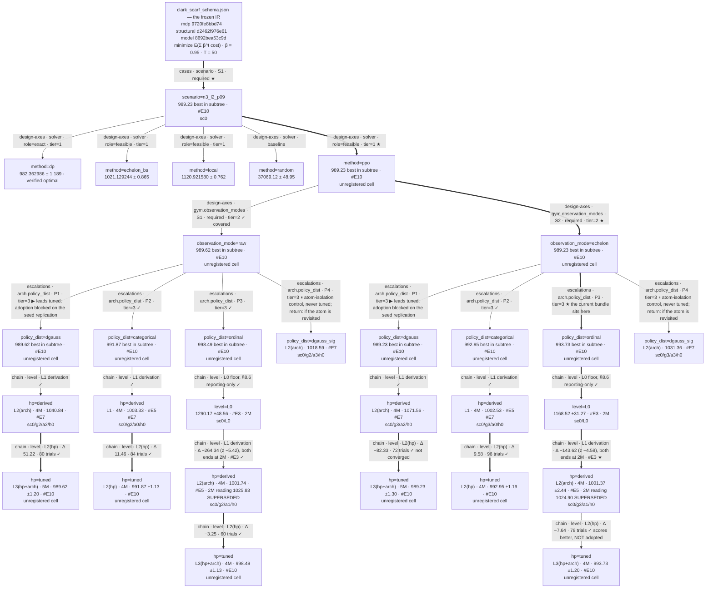

# clark_scarf (ordinal board) — escalation log

Opened 2026-09-14. **Empty history by construction**: the code, the IR and the
gates are inherited; no result is. An earlier campaign on this same domain is published at
tag **`v0.11.5`**, and its board and log are not cited here — if a number from it is
ever wanted, it is moved in deliberately and re-earned at this pin, not quoted
across.

## MAP  (as of 2026-09-24)

**One cell, one frame.** `n3_l2_p09` — three echelons, lead time 2,
`p_short = 9.0`, β = 0.95, T = 50, Poisson demand on the integer lattice. The
lattice rendering is chosen deliberately: the `dp` benchmark is role **`exact`**
here (the decomposition checked against a brute-force joint DP to 0.000000), so
"% of optimal" means it, and `ship_discrete`'s integer support is the action
set's natural home rather than a quantization.

### Design tree

### Layers and node readings
| node | kind · attributes · tier | reading | entry |
|---|---|---|---|
| `method=dp` | design-axes · solver · role=exact · tier=1 ★ | **982.362986 ± 1.189** @8192 CRN. The bar, and the reason a number here is legible as a percentage. Verified against a brute-force joint DP on `verify_tiny` (gap 0.000000), not taken on the theorems' word. One documented caveat: the Poisson pmf is truncated at a high quantile while the simulator's sampler is not (dropped mass < 1e-9) | — |
| `method=echelon_bs` | design-axes · solver · role=feasible · tier=1 | **1021.129244 ± 0.865** — the best non-exact reference, and the number a practitioner actually compares against. A *reference*, not a baseline: it is theory-informed, so it may not gate an agent that has to discover the structure | — |
| `method=local` | design-axes · solver · role=feasible · tier=1 | **1120.921580 ± 0.762** — the structure-blind baseline | — |
| `method=random` | design-axes · solver · baseline | **37069.12 ± 48.95** — the floor that makes "a policy was learned" a checkable claim | — |
| `method=ppo` | design-axes · solver · role=feasible · tier=1 ★ | **989.23 best in subtree** ([#E10](#E10)) — 100.70% of the exact bar, from the `echelon` + `dgauss` tuned cell. The board's whole RL subtree hangs here; four heads x two observation arms x the §8.6 ladder | [#E3](#E3), [#E7](#E7), [#E10](#E10) |
| `observation_mode=raw` / `=echelon` | **design-axes** · `gym.observation_modes` · S1/S2 · required · tier=2 | **conditional on the head, not a property of the board** ([#E10](#E10), tuned): null on `dgauss` (+0.39, z 0.22) and `categorical` (−1.08, z 0.66), **+4.76 (z 2.89) on `ordinal`** — the echelon rendering pays only the head that cannot learn the transform itself. Supersedes the untuned reading, a tie at L1 on `ordinal` alone (−0.93 ± 3.28) and at L0 (−121.65 ± 62.86). **Never prunable**: the IR declares both modes and the research question names them the instrument. **[#E11](#E11) reaches the same conclusion from a second instrument**: the readback shows the `raw` policy is at least as invariant to redistributing a fixed echelon position as the arm handed the transform (0.76/0.00/1.76 vs 1.00/0.87/2.54) | [#E3](#E3), [#E10](#E10), [#E11](#E11) |
| `policy_dist=` `dgauss` / `categorical` / `ordinal` / `dgauss_sig` | **escalations** · `arch.policy_dist` · P1–P4 · tier=3 | **four competing heads, campaign-invented — not an IR declaration**, so crown-one-prune-the-rest applies and no coverage debt is owed. **The ordering REVERSES between L1 and L2** ([#E7](#E7) → [#E10](#E10)): untuned `ordinal < categorical < dgauss_sig < dgauss`, tuned `dgauss < categorical < ordinal`. Tuning pays `dgauss` −51.22/−82.33, `categorical` −11.46/−9.58, `ordinal` −3.25/−7.64. **No crown is taken** — one artifact per cell against a ~6 seed floor, and `dgauss` alone ran at 5M | [#E7](#E7), [#E10](#E10) |
| `level=L0` → `hp=derived` | chain · `level` · §8.6 ladder · tier=3 | **the dominant lever measured on this board**: −264.34 (z −5.42) on `raw`, −143.62 (z −4.58) on `echelon`, both endpoints at 2M on the `ordinal` head ([#E3](#E3)). L0 is reporting-only and never a gate. It moves eight knobs at once, so the delta is the whole derivation and attributes to no single knob | [#E3](#E3) |
| `hp=derived` → `hp=tuned` | chain · `level` · `L2(hp)` · tier=3 | **the A6 rung, six studies of 60–96 trials** ([#E10](#E10)). Pays every head, but by wildly different amounts — see the `policy_dist` row; that spread, not the level, is the finding. Best cell **989.23 ± 1.30**. **No `h` id minted**: §13.2 mints on adoption and nothing here is adoptable yet. `dgauss`+`echelon` was still improving when its wall hit at 72 trials, so its number is a floor | [#E10](#E10) |

### Frontier
1. ~~**A1 — the ordinal head's ladder, L0 → L1, both arms @ 6 seeds**~~ — **done 2026-09-15** ([#E3](#E3)): L1 at 104.3/104.4% of exact, arms tied, floor measured at ~8
2. ~~**A2 — L2 tuning of `a1`**~~ — ran as `ordL2` (57 trials @4M: 28 scored the ship-nothing constant, best = the untuned centre; the evidence base of [#E6](#E6)) and `ordL2b` (20 trials @5M, `norm_obs`/`norm_reward`/`gamma` pinned) — **stopped 2026-09-18 by decision**: it was tuning a head diagnosed as mismatched ([#E6](#E6))
3. ~~**A3 — a categorical arm at L1**~~ — **done** ([#E4](#E4), verdict superseded by [#E5](#E5): the 2M contrast was truncation)
4. ~~**A4 — the `a2` ladder**~~ + ~~**the `a3` twin**~~ — **done** ([#E6](#E6), [#E7](#E7)): the loss decomposes ~evenly into the atom (+17/+30) and the affine `mu` (+22/+40); the categorical is the head nothing beats here
5. ~~**A5/A6 — the TUNED three-way**~~ — **harvested 2026-09-24**
   ([#E10](#E10)): six `--minimize` studies (60–96 trials each), all eighteen
   top-3 winners re-scored @8192. **The coordinate axis is answered** — a null
   for `a0` (z 0.66) and `a2` (z 0.22), **+4.76 (z 2.89) for `a1`**, the head
   [#E8](#E8) diagnosed as regime-coupled: the echelon rendering pays only the
   head that cannot learn the transform itself. **The head axis is NOT
   answered** — `dgm_*` ran at 5M against `catm_*`/`hurm_*` at 4M, confounding
   the ordering with a 25% budget gap in the direction of the result; at equal
   budget only "categorical beats hurdle on `raw`, ties on `echelon`" survives.
   No id minted, no bundle crowned: one artifact per cell against a seed floor
   of ~8. Owed — one budget, and 4–6 seeds per winner

6. ~~**A7 — the §14 readback, forced by a conformance FAIL**~~ — **done
   2026-09-24** ([#E11](#E11)): the `confirm` stance has a verdict — the policy
   found the echelon **coordinates** (split-invariance under 2 units at every
   level) and **not** the base-stock rule (fitted 32/20/98 against 37/59/79;
   the one tight level is the one whose clip binds on 98% of decisions).
   `INTERPRET.md` written, `research.deliverables` passes. Owed — widen the
   17-comparison invariance sample, and re-implement `--offset-sweep` on
   `ship_discrete`

- parked: the Gamma-density rendering (`g1_*` instances) — tripwire: the ordinal
  board reaching a verdict, at which point the same question can be asked where
  the bar is only `feasible`
- parked: β = 1 twins — tripwire: none currently; the discount was answered on
  the previous board

### Off-tree register   (budget-consuming, *not* solution-touching)
- bar calibration — all four benchmarks re-solved at the v0.10.12 pin, 2026-09-14
- ~~floor measurement~~ — **done**, as a by-product of A1 rather than its own batch:
  within-cell seed sd at L1 is **7.12** (`raw`) / **9.09** (`echelon`), so the
  floor is **~8** and a cell SE is ~3. At L0 it is 119 / 77 — a 13x spread,
  which is a property of the rung, not of the instrument.
  **REVISED by [#E5](#E5) and not carried back until 2026-09-24**: the ~8 was
  budget-inflated. At 4M the within-cell sd is **0.97–5.97**, so the working
  floor is **~6** and a 6-seed cell SE is ~1.6. Quote the 4M figure; the ~8
  belongs to the 2M rung only

### Current best bundle
`sc0/g3/a1/h0` @ 4M — obs=echelon, `ship_discrete`, hurdle-dgauss head,
hyperparameters at their derived origin, 4M steps. **The address resolves to
`L2(arch)`, not L1** (`clark_scarf_configs.level()`): `h0` is the derivation
but `a1` is not the arch origin, and a non-origin arch id is an architecture
escalation. Only the `a0` cells on this board are L1. Corrected 2026-09-24;
the log had called this "L1 hyperparameters", which is true of the hp layer
and false of the address: **1001.37 ± 2.44 @8192 = 101.9% of the exact bar**
([#E5](#E5)). All four 4M cells sit within 2 units (1001.4–1003.3): at an
adequate budget neither the head ([#E5](#E5)) nor the representation moves
this board, so the ★ is a tie-break, not a win. 2M numbers are superseded —
every cell was undertrained by 13–24 units.

**Not superseded by [#E10](#E10), deliberately.** A6's tuned cells score better
(best **989.23 ± 1.30**, `a2` + `echelon` @5M) but none is adoptable: single
artifact per cell, seed floor ~6 ([#E5](#E5)), head axis confounded with budget.
The bundle stays on the 6-seed reading until the replication in [#E10](#E10)'s
plan lands. Note what the bundle IS: a configuration with a six-seed cell mean,
not a designated artifact — 1001.37 ± 2.44 is a mean over six runs and the
±2.44 is the spread ACROSS those seeds, not an eval SE. No model file has been
crowned on this board.

## FRAME-CHANGELOG
- **2026-09-14 INTRODUCED** — the board opens on `n3_l2_p09` (lattice) with the
  mixture-at-zero ordinal head as the subject. **No head-vs-head contrast is
  planned**: the previous board's tuned centres are categorical-fitted, so they
  cannot price a rival head, and a screen against them measures centre-fit
  rather than the head (the defect the attempt was caught on). The ladder is
  the instrument instead — where does this head land against an exact bar, on
  its own terms.
- **2026-09-19 WIDENED — the board IS a head-vs-head contrast now.** The
  opening frame above refused one, for a reason that was sound and has since
  been met: the previous board's centres are categorical-fitted, so they cannot
  price a rival head. A5/A6 does not use them. It tunes **each head at its own
  centre** — six studies, one per (head x arm), every one warm-started at the
  same L1 derivation and searching the same 11 knobs — so the comparison is
  between tuned equals rather than against someone else's optimum. What the
  opening frame forbids is still forbidden: no number here is screened against
  the old board's `hp2`/`hp4` centres, and no score crosses the boards.
  Recorded because the log's own frame said this contrast was not planned, and
  a reader arriving at [#E10](#E10) would otherwise find it unexplained.
- **2026-09-24 RETYPED + REPARENTED — the head axis becomes an `arch`
  escalations split.** The four heads had been drawn as one pooled node listing
  four values, below the `hp` ladder. Both were wrong: they are four parallel
  competitors on the **`arch`** layer, campaign-invented rather than IR-declared
  (`escalations`, guide §3.1), and `arch` conditions `hp` rather than the
  reverse. Redrawn as `arch.policy_dist` with P1–P4 siblings under each
  observation arm, each carrying its own §8.6 chain (`L0 → hp=derived →
  hp=tuned`). The mis-drawing hid [#E10](#E10)'s largest effect — the L1→L2
  ordering reversal is only visible once the four are siblings with their own
  ladders. No number moved; the diagram was the defect.

## IR-CHANGELOG

**Inherited, not re-derived.** The IR is unchanged and carries its frozen
Phase-A identity: `model = 8692bea53c9d`, `mdp = 9720fe8bbd74`,
`structural = d2462f976e61`, verified at this pin on 2026-09-14. The
formalization history that produced it — twelve re-signings, F1–F12 — lives
with the earlier downstream campaign and is deliberately not copied: this log records what
*this* board does to the model, and so far that is nothing. `clark_scarf.
restatement.md` and `clark_scarf.scenarios.md` travel with the IR because they
describe the model rather than any result.

## CONFIG-REGISTRY   (living — ids append-only; guide §13)

Reset with the board. The **design space** is inherited (it is the IR's, not a
campaign's) but **no adopted base is**: the `h` axis holds only its origin, and
every tuning winner must be re-earned here. Ids are minted on adoption
(§13.2) — crowned, shipped, or parented — never for a probe.

**Merge hazard, stated once.** Ids here are scoped to this board. The previous
board used `sc0`–`sc3`, `g0`–`g5`, `a0`–`a1`, `h0`–`h8`; the meanings of `sc0`,
`g0`–`g3`, `a0` and `h0` are kept ALIGNED with it deliberately, so those do not
collide on a merge. `a1` and any new `h` id do collide — `a1` was the Gamma
head there and is the ordinal head here. Renumber on merge, never reinterpret.

### scenario
| id | key in SCENARIOS | note |
|---|---|---|
| `sc0` | `n3_l2_p09` | the only cell. Every `_L1_DERIVED` row was measured here, and `dp` is role `exact` on it |

### gym · `g`
| id | parent | delta | why it exists | cell tuned in |
|---|---|---|---|---|
| `g0` | — (L1 origin) | the §8.6 derivation's gym output | the derivation; reserved | — |
| `g1` | `g0` | `observation_mode=echelon` | the tier-2 comparison arm — required coverage, never prunable | — |
| `g2` | `g0` | `action_mode=ship_discrete` | the echelon-free interface: integer quantities, no reference construct in the decode | — |
| `g3` | `g1` | `action_mode=ship_discrete` | its echelon twin | — |

### arch · `a`
| id | parent | delta | why it exists | cell tuned in |
|---|---|---|---|---|
| `a0` | — (L1 origin) | PPO + `MlpPolicy`; a MultiDiscrete space gets SB3's flat categorical | the derivation; reserved | — |
| `a1` | `a0` | `policy_dist=ordinal` | the HURDLE-discretized-Gaussian (`clark_scarf_ordinal_head.py`): three parameters per link, an exclusive atom at `ship = 0`. **Clarified 2026-09-18 (#E6):** "ordinal" is a misnomer binding two mechanisms — adjacency pooling (general) and the zero atom (a fixed-cost mechanism this domain lacks). The atom's `sigmoid(0) = 0.5` init gates the deterministic-eval argmax behind ~3.7 logit-units of one scalar; 28 of 57 tuning trials scored the constant ship-nothing policy. Kept as the record and the decomposition arm; identifiers frozen | — |
| `a2` | `a0` | `policy_dist=dgauss` | the plain body (`clark_scarf_dgauss_head.py`): adjacency pooling alone, **no atom** — two numbers per link, affine `mu` over bins 0..40 so every bin including the boundaries is the mode at \|m\| <= 1, init measured flat (ratio 1.29, argmax mid-range). Minted 2026-09-18 (#E6) per adi_flex LV1's own scope clause: no fixed cost here, so "the plain ordinal body" — which existed nowhere as an artifact until now | — |
| `a3` | `a0` | `policy_dist=dgauss_sig` | the atomless twin of `a1`'s body (minted 2026-09-19, [#E6](#E6) follow-up): same discretized-Gaussian machinery as `a2` but with the SIBLING's sigmoid-bounded `mu` — so `a1` vs `a3` differs in exactly one thing, the atom, removing the parameterization confound that [#E6](#E6)'s A4 read carries. The sigmoid's edge cliff (boundary bins need a saturating \|m\| ~ 4) is the twinned property, kept deliberately | — |

### hp · `h`
| id | parent | delta | why it exists | cell tuned in |
|---|---|---|---|---|
| `h0` | — (L1 origin) | the §8.6 derivation, **read** from `_L1_DERIVED` rather than restated | the derivation; reserved | — |

### Constraints   (declared on the constraining id, refused at launch)
| id | requires |
|---|---|
| `a1` | `g.action_mode = ship_discrete` — the head is a MultiDiscrete parameterization. It asserts the space in its own `_build`; declaring the force here refuses the citation at launch instead of at model construction |
| `a2` | `g.action_mode = ship_discrete` — same force, same reason |

### Current bases
| axis | current | since |
|---|---|---|
| scenario | `sc0` | 2026-09-14 |
| gym | `g2` / `g3` (the two arms) | 2026-09-14 |
| arch | `a0`, `a1`, `a2`, `a3` — **all four are live arms**, none adopted | 2026-09-19 |
| hp | `h0` | 2026-09-14 |

## UPSTREAM — the proposal round

The drafts are deleted by design: once the issue exists the issue IS the
proposal, and a tracked local copy is a second source of truth that cannot
follow the issue's edits or its disposition.

| issue | gap | disposition |
|---|---|---|
| [#89](https://github.com/tong-wang/auto-mdp-solver/issues/89) | `scripts.selection_protocol` detects a §9.7 violation by class NAME (`endswith("EvalCallback")`) and, finding nothing, PASSes with "no live selection callback" — a negative it never tested. Demonstrable on upstream's own shipped `cases/clark_scarf` | **ACCEPTED, both parts — v0.10.14**, same day. `_local_selection_callbacks` detects a script-defined `*Callback` subclass that calls `self.model.save`/`.predict`, naming the behaviour it saw; the name detector stays beside it, because SB3's own `EvalCallback` is not defined in the script and behaviour cannot see it. The PASS now states what was examined, and the docstring adopts §5 `bound_rationale`'s "evidence, not proof" stance explicitly. Regression moved from "assert WARN on `cases/clark_scarf`" to three synthetic tests in `test_launch_check.py` — engine tests may not depend on shipped folders — the first of which fails at v0.10.13. Spec §9.7's text is untouched: the rule was never the defect, the detector was |

## LEDGER

### #E1  2026-09-14 — DIAGNOSIS: the board trained under the selection protocol §9.7 replaced, and six months of green gates never said so

**address** — not a tree node: a protocol defect under every node, found in the
pre-launch audit rather than by a run.

**reads** — no prior verdicts; this board has none. The evidence is the code and
the gate output at v0.10.12.

**observed.**

`clark_scarf_ppo_train.py` registered `CRNSelectionCallback` unconditionally:
every 100k steps it rolled 256 episodes on a live env and saved the best as
`{scenario}_ppo.zip`, the shipped artifact. §9.7 has mandated post-hoc
checkpoint selection since v0.7.0 — "no `EvalCallback`, no live selection env"
— so the deliverable was chosen by the protocol the spec replaced, at a cost of
~13% of each run's step budget in evaluation.

`scripts.selection_protocol` reported **PASS** throughout, across eight pin
bumps. It detects violations lexically (`n.endswith("EvalCallback")`); this
class is called something else, so the check's PASS was carried entirely by its
unrelated second half and its message — "no live selection callback" — asserted
a negative it had not tested. Filed as upstream
[#89](https://github.com/tong-wang/auto-mdp-solver/issues/89); the same blind
spot is live in upstream's own shipped `cases/clark_scarf`.

Fixing it exposed **two silent-corruption paths that the fix itself opened**,
both found by auditing rather than by running. `vecnormalize.pkl` was written
*only* by the live callback, so with it off the default path resolved to
nothing — and both consumers degraded quietly instead of failing:
`clark_scarf_ppo_eval.py` printed "scoring raw observations" and would have
emitted a well-formed, wrong TSV for a `norm_obs=True` policy, and
`clark_scarf_policy.py` — the §12 deliverable — did the same and would have
shipped it. Both now fall back to `vecnormalize_final.pkl` and **refuse** when
the run's args record that the policy trained normalized.

Separately, the gym implemented two action modes (`ship_fraction_bins`,
`ship_scaled`) that the IR declared nowhere — §7 in the gym→IR direction,
reported by the previous board for a whole campaign and never closed. Removed
here rather than declared: this board runs `ship_discrete` only.

**missing.** Whether the protocol change moves a number is **unmeasured and
deliberately so** — it cannot be measured on this board, which has no arm under
the old protocol and will produce none. The previous board's figures are
internally comparable (they shared the protocol) and are not comparable to
anything produced here. That discontinuity is the reason this entry exists
rather than a footnote.

**plan.** Nothing to arbitrate. The ladder (A1) launches under the corrected
protocol; its verdict branches are unaffected, because no arm on either side of
the change exists to be compared.

**verdict** — ✗ for the old protocol, and a correction rather than a result.
Three defects closed (§9.7 live selection, §9.5/§12 silent unnormalized
scoring, §7 undeclared modes), one filed upstream, five gates added that the
harness cannot provide: live selection off by default and the screen present,
the deployable policy refusing a missing normalizer, and `gym_only_modes()`
asserted empty rather than asserted to equal a known residue.

**status** ✓ closed

### #E2  2026-09-14 — an opt-in flag did not clear the rule, and the retention rationale was board-specific

**address** — the same protocol defect as [#E1](#E1); this entry records what
its fix got wrong.

**reads** — [#E1](#E1), and upstream's disposition on
[#89](https://github.com/tong-wang/auto-mdp-solver/issues/89).

**observed.** #E1 made `CRNSelectionCallback` opt-in and off by default, and
kept the class "to reproduce runs that used it". v0.10.14's behavioural
detector — the one this campaign asked for — then WARNed on this board:

> `CRNSelectionCallback evaluates (self.model.predict) and ships
> (self.model.save) in-training — a live selection callback by behaviour,
> whatever its name`

Correctly. **The check reads the source, not the default**, and §9.7 forbids
the machinery, not merely its use. A flag defaulting to off is a promise about
how a script will be invoked, and nothing enforces it — the same class of
reasoning that let the original callback run for six months.

The retention rationale was also wrong *here* and right elsewhere: "reproduce
runs that used it" is an argument that belongs to the board holding ~1100 such
runs (the earlier downstream campaign), not to this one, which has **none**. Carried
across the reset without re-deriving it — the failure mode the empty-history
split exists to prevent, reappearing in the first week.

Removed outright: the class, `--live-select`, `--select-every`,
`--select-n-seeds`, the now-unused eval imports, their `_SKIP` and `PROTOCOL`
entries, and the module docstring's claim that `{scenario}_ppo.zip` is the
selection artifact — which had survived #E1 and was by then describing a file
the script no longer writes.

**verdict** — ✓ `scripts.selection_protocol` PASSes with the honest message
upstream's Part B introduced; 123 tests, laws 8/9, conformance 25/30 with only
the deliberate `research.deliverables` FAIL. The test that pinned the flag's
default is retargeted to pin the machinery's **absence**, which is the property
that actually holds the rule.

**status** ✓ closed

### #E3  2026-09-15 — the ordinal head's ladder: L1 lands at 104.3% of exact, and the two observation arms tie

**address** — `sc0/g{2,3}/a1/h0`, the board's first learned cells, plus the two
L0 controls (outside the registry by guide §13.4).

**hypothesis, stated before launch** — the head is measured against the exact
bar on its own ladder, NOT against the categorical head. The previous board's
tuned centres are categorical-fitted and cannot price a rival head; a screen
against them measures centre-fit, which is the defect the attempt was caught
on. What the ladder decides: does this head reach a sane rung at all, and does
the raw/echelon question survive the rung change.

**runs** — 24 × 2M steps, `ship_discrete`, `n3_l2_p09`, 6 seeds per cell.
the round's working notes for the commands, since deleted. Every run saved 20 checkpoints
with per-checkpoint normalizers, was screened by `clark_scarf_select.py` on the
block at offset 1,000,000, and had its top-1 confirmed @8192 on the protocol
block — the first numbers this domain has ever produced under §9.7 ([#E1](#E1),
[#E2](#E2)).

**verdict.**

| rung | arm | @8192 | sd | SE | % of exact |
|---|---|---|---|---|---|
| L0 | raw | 1290.17 | 118.96 | 48.56 | 131.3% |
| L0 | echelon | 1168.52 | 76.60 | 31.27 | 119.0% |
| L1hp | raw | 1025.83 | 7.12 | 2.91 | **104.4%** |
| L1hp | echelon | 1024.90 | 9.09 | 3.71 | **104.3%** |

| contrast | paired, n=6 | z |
|---|---|---|
| L1 − L0, raw | **−264.34** ± 48.80 | −5.42 |
| L1 − L0, echelon | **−143.62** ± 31.36 | −4.58 |
| echelon − raw, at L0 | −121.65 ± 62.86 | −1.94 |
| echelon − raw, at **L1** | **−0.93** ± 3.28 | −0.28 |

*The derivation dominates.* −264/−144 is the largest effect on this board by an
order of magnitude. It attributes to **no single knob**: L0 moves eight at once
(no VecNormalize, `n_envs` 1, constant schedules, `ent_coef` 0, different arch
and batch), so this is the whole §8.6 derivation and nothing finer. A claim
made before launch — that L0 vs L1 would bracket the `ent_coef` interaction the
sibling campaigns warn about — is **withdrawn**: it would need a one-knob
contrast at L1, which this ladder does not contain.

*The arms tie at L1.* −0.93 ± 3.28 against a measured floor of ~8 is not a
small effect, it is no effect. That reproduces the previous board's #E7/#E17
mechanism on a fresh board, a new head and a corrected protocol: the raw/
echelon gap is a property of the CONFIGURATION, and at a sane rung it is gone.
At L0 the arms are also not separable (z −1.94) despite a 122-unit gap, because
L0's spread is enormous.

*The floor is measured, not inherited.* Within-cell sd 7.12 / 9.09 at L1 → a
floor of **~8**, cell SE ~3. The previous board's 1.57 belonged to a different
head and protocol; the density frame's 5.0 was explicitly a holding value.
Everything on this board is now judged against ~8.

*§9.7 earned its keep on the first batch.* At `L0/raw` the screen chose winners
at 35%, 40%, 40%, 70%, 75% and 95% of budget — half the runs peaked before the
45% mark, and one run's terminal checkpoint was 58% worse than its best
(1855 vs 1174 on the screen block). Under the replaced protocol none of that
curve would exist, and the shipped artifact would have been whichever
checkpoint won a 256-episode draw at a 100k boundary.

**missing.** *Whether this head is good* is not answered and cannot be from
this entry. There is no categorical arm on this board, and the previous board's
figures sit across [#E1](#E1)'s protocol discontinuity, so quoting them here
would be the precise error that entry exists to prevent. A3 on the frontier is
that arm. What IS established is that the head reaches 104.3% of an exact bar
untuned, which is a rung worth escalating from.

**status** ✓ closed — A2 (L2 tuning) and A3 (the categorical L1 arm) spawned.

### #E4  2026-09-16 — the categorical arm at L1, 2M: a +9.31 head effect on `echelon` — ENTERED LATE, and WITHDRAWN where it stands

**a hole in the ledger, recorded as one.** This entry was never written when
the work was done. A3 ran, its result was carried forward in conversation, and
[#E5](#E5) was then written against it — citing "#E4's +9.31 head effect" in
its own title and withdrawing it in its body — while the entry those citations
point at did not exist. Four references in this log dangled for eight days.
The numbers below are **not reconstructed from artifacts**: they are the 2M
column of [#E5](#E5)'s own verdict table, which preserved them. Nothing here is
new evidence, and the entry is written so the citations resolve and the gap is
visible rather than silent.

**what A3 measured** — the categorical head (`a0`) against the hurdle head
(`a1`) at L1, both observation arms, `ship_discrete`, 2M steps, seeds 1–6,
screened and confirmed @8192 (`sc0/g{2,3}/a{0,1}/h0`).

| cell | 2M |
|---|---|
| hurdle-dgauss raw | 1025.83 |
| hurdle-dgauss echelon | 1024.90 |
| categorical raw | 1023.09 |
| categorical echelon | **1015.59** |

The read at the time: categorical beats hurdle by **+9.31** on `echelon` and
+2.74 on `raw`, i.e. a head effect that appears only under the echelon
coordinates.

**WITHDRAWN by [#E5](#E5).** At 4M the same contrast is −1.59 ± 1.70 (`raw`)
and −1.16 ± 3.21 (`echelon`) — ties. The +9.31 was the faster-descending head
being cut off earlier: truncation, not a head effect. Every 2M number above is
superseded and is retained here only as the object [#E5](#E5) withdraws.

**status** ✓ closed — withdrawn at entry; retained because four live citations
need a referent, and because a ledger that silently skips a number is the
failure mode [#E1](#E1) exists to prevent.

### #E5  2026-09-17 — 2M undertrains every cell by 13–24 units, and #E4's head verdict was truncation

**address** — the four L1 cells re-run at 4M, same seeds (`sc0/g{2,3}/a{0,1}/h0`;
budget is protocol, not configuration — `total_timesteps` is EXCLUDED, so a 4M
run cites the same address as its 2M twin).

**hypothesis, stated before launch** — the 2M screens showed 21/24 runs peaking
in the final 5% of budget with the last fifth still buying −5.7/−6.7, the same
size as [#E4](#E4)'s +9.31 head effect; the ordinal head was descending faster.
Prediction: doubling the budget moves every cell and may close the head gap.

**runs** — 24 × 4M, `ship_discrete`, seeds 1–6, screened and confirmed @8192
(the per-cell matrix in the round's working notes, since deleted).

**verdict.**

| cell | 2M | 4M | Δ paired | z |
|---|---|---|---|---|
| hurdle-dgauss raw | 1025.83 | **1001.74** | −24.09 | −9.06 |
| hurdle-dgauss echelon | 1024.90 | **1001.37** | −23.53 | −11.52 |
| categorical raw | 1023.09 | **1003.33** | −19.75 | −6.82 |
| categorical echelon | 1015.59 | **1002.53** | −13.05 | −6.03 |

- **[#E4](#E4) is WITHDRAWN as a head verdict.** At 4M the contrast is
  −1.59 ± 1.70 (raw) / −1.16 ± 3.21 (echelon) — ties. The 2M +9.31 was the
  faster-descending head being cut off earlier, exactly the truncation
  mechanism flagged when the 2M curves landed.
- The representation contrast is a tie under both heads at 4M (−0.37 / −0.80).
- **The floor was budget-inflated**: within-cell sd 3.76–9.09 at 2M →
  0.97–5.97 at 4M. Working floor on this board is now **~6**, and 2M-era
  verdicts judged against ~8 are re-read against it.
- 4M is close but not flat (last fifth −2.1/−2.8, argmin at 96–98%); the
  tuning budget moved to 5M on this reading.

**status** ✓ closed — supersedes every 2M number on the board.

### #E6  2026-09-18 — DIAGNOSIS: the "collapse" was the head's own init, the name hid the mechanism, and the atom was never warranted here

**reads** — [#E3](#E3), [#E5](#E5), the `ordL2`/`ordL2b` studies, adi_flex
PLAYBOOK LV1 + MR9, this board's PLAYBOOK-LV7 inheritance, and the measured
probes below.

**observed.**

*The symptom.* 28 of `ordL2`'s 57 completed trials (49%) scored a constant
**22501.15** — `units_shipped_mean = 0.00`, the ship-nothing policy — and the
study's best trial was the untuned L1 centre. Two diagnoses were recorded and
are both RETRACTED: entropy starvation (healthy trials exist at `ent_coef`
4 orders below the collapsed maximum) and the `norm_obs`/`norm_reward`
mismatch (a seemingly clean 2×2 — 77% vs 0/12% — that TPE's adaptive sampling
had confounded: all 12 `normalize_advantage=False` trials also had
`norm_reward=True`, and 4 of 8 cells were never sampled). A trial under the
pinned rerun (`ordL2b` #5, `norm_reward=True`, `ent_coef` 0.023) collapsed
anyway, falsifying the pin's rationale.

*The mechanism, measured.* The head is a **hurdle** construction: its positive
branch is zero-truncated, so `w = sigmoid(t)` EXCLUSIVELY owns `P(ship=0)` —
and `sigmoid(0) = 0.5` at init, 20× a flat categorical's bin mass, against the
shipped docstring's "near-uniform" claim. The deterministic record eval takes
the argmax, which stays "ship nothing" until `w` falls below the best positive
bin (~0.014 at init): **~3.7 logit-units of travel in one scalar**. Probes:
trial 5 (lr 1.2e-05) trained normally the whole way — train cost 31006 → 8020,
sampled behaviour ships — while `w` moved only 0.5 → ~0.42, so its argmax was
[0,0,0] in 100/100 probed states; a healthy trial sits at `w` ≈ 0.02–0.05.
There is no absorbing state and no collapse: **every slow-learning
configuration evaluates as the ship-nothing constant**, which put a cliff in
the tuner's objective and presented as "half the space collapsed".

*The root cause is an import error with a naming defect underneath.* The atom
is the (s,S) trigger — a **fixed-cost** mechanism. adi_flex LV1's own scope
clause says so ("zero-inflate only when the problem has a genuine 'do nothing'
mass (a fixed cost ⇒ an (s,S) trigger); otherwise the plain ordinal body") and
this board's inherited LV7 rule agrees (smooth cost surface → no atom). This
domain has no fixed cost; the DP ships ≈ demand nearly every period and
zero-ship is ~16%, endgame-concentrated — the import's justification ("ship
nothing is modal") was wrong arithmetic and is retracted in `a1`'s docstring.
The name "ordinal" binds the two mechanisms so the composite travels as a
unit, and the scope clause's else-branch — "the plain ordinal body" — **existed
nowhere as an artifact**, so the prescription funnels every importer into the
if-branch. An upstream proposal covering the naming, the false init line
(shipped verbatim in `cases/adi_flex` and the `examples/inv_single` exemplar)
and the missing else-branch is drafted and HELD at the user's direction
(held as a working draft, untracked by the mdp-propose convention — the issue
becomes the proposal when filed); inv_single may be fixed
by direct PR instead.

**plan** *(amended 2026-09-18, before any L1 run completed: the ladder is
L0@2M → L1@4M → L2@5M — the L1@2M rung was dropped, since [#E5](#E5) already
supersedes every 2M number and a 2M cell could pair only against superseded
figures; L0 stays at 2M to pair with `a1`'s control).* `a2` minted: `clark_scarf_dgauss_head.py`, the plain body — two
numbers per link, affine `mu` (every bin the mode at |m| ≤ 1; a sigmoid `mu`
would rebuild the travel cliff at the support boundaries), init measured flat
(ratio 1.29, argmax mid-range, a live action). Six gates, including the two
this episode taught: mode reachability on the boundary bins, and the init
pinned — distribution against flat AND the deterministic argmax. A4 runs
`a1`'s protocol rung for rung (L0 → L1(2M) → L1@4M → L2@5M), seeds 1–6, both
arms, giving the decomposition the sibling boards cannot: dgauss-vs-categorical
prices adjacency pooling alone; dgauss-vs-hurdle prices the atom. Pre-declared
reads at the ~6 floor ([#E5](#E5)): dgauss ≈ categorical AND hurdle ≈ dgauss →
neither mechanism matters here and the sibling gains were the atom's fit to
fixed-cost structure; dgauss < categorical → adjacency pooling transfers on its
own. The `a1` tuning was stopped by decision with the cores redirected here;
`ordL2` (57 trials) and `ordL2b` (20 trials, pinned, one falsifying collapse)
are preserved as this entry's evidence.

**status** ✓ diagnosis closed — A4 ▶

### #E7  2026-09-19 — the decomposition: A4's loss splits ~evenly between the missing atom and the affine `mu`, and the atom helps WITHOUT a fixed cost

**address** — `sc0/g{2,3}/a3/h0` (the atomless twin, sigmoid `mu`), completing
the four-head set at L1@4M, seeds 1–6, screened + confirmed @8192.

**hypothesis, stated before launch** — `a3` differs from `a1` in exactly one
thing (the atom) and from `a2` in exactly one thing (the `mu`
parameterization). Pre-declared branches: `a3 ≈ a1` → the affine `mu` caused
A4's loss, atom innocent; `a3 ≈ a2` → the atom is worth ~40; in between →
both contribute.

**verdict** — in between, and strikingly balanced:

| head @ L1(4M) | raw | echelon | seed sd |
|---|---|---|---|
| hurdle-dgauss `a1` (atom + sigmoid) | **1001.74** | **1001.37** | 4.4 / 6.0 |
| categorical `a0` | 1003.33 | 1002.53 | 1.0 / 2.2 |
| `a3` (sigmoid, no atom) | 1018.59 | 1031.36 | 8.6 / 22.4 |
| `a2` (affine, no atom) | 1040.84 | 1071.56 | 29.5 / 51.5 |

| paired contrast | raw | echelon |
|---|---|---|
| the atom (`a3` − `a1`) | **+16.84 ± 4.21** (z +4.0) | **+29.99 ± 10.34** (z +2.9) |
| the parameterization (`a2` − `a3`) | **+22.25 ± 14.11** (z +1.6) | **+40.20 ± 25.99** (z +1.5) |
| total (`a2` − `a1`, = the sum by construction) | +39.09 | +70.19 |

The split is the finding (the sum is an identity — same seeds, telescoping).
Removing the atom costs 17–30 at matched parameterization; the affine `mu`
costs another ~22–40 on top, though its z sits under 2 because `a2`'s own
variance is the phenomenon being measured.

*Three readings, each with its scope stated.*

1. **The atom helps in a domain with NO fixed cost** — against adi_flex LV1's
   scope clause, which predicts it is only warranted by a genuine do-nothing
   mass. z +4.0/+2.9, paired. Mechanism NOT established; the candidate story —
   the gate is a second mode that absorbs the zero-ish states (endgame,
   above-target, ~16% of decisions) so the Gaussian body's `mu` can serve the
   ship-≈-demand regime without swinging — is a hypothesis for a probe, not a
   claim. What IS claimed: the clause's prediction fails here in direction.
2. **Seed variance orders by parameters-per-link**: 41 logits (sd 1–2) → 3
   (4–6) → 2 sigmoid (9–22) → 2 affine (30–51). The pooling heads are the
   HIGH-variance heads on this domain — the exact inverse of inv_single's
   "the value is VARIANCE" — so that sibling claim does not transfer either.
3. **The practical answer for this domain is the flat categorical.** The best
   composite only ties it (#E5), every reduced head loses to it, and it has
   the lowest variance. adi_flex MR9 ("a per-quantity categorical is the
   choice that needs justifying") is measured here as backwards: the
   categorical is the choice nothing beats.

*Caveats.* All 12 `a3` screens picked their best checkpoint at 100% of budget
— the sigmoid variant is still climbing at 4M, so its cells may be modestly
pessimistic and the atom contrast with them. `dgL2` (running) tunes `a2`; its
early trials already refute the entropy-starvation story for `a2`'s wide-`tau`
behaviour (starved-entropy trials score WORSE, 1103/1091) and confirm the
cliff is gone (worst config 7646, a bad policy rather than the ship-nothing
constant). The upstream naming proposal (held) gains this entry as evidence:
the scope clause is not merely under-specified, it mis-predicts.

**status** ✓ closed, **head ranking SUPERSEDED by [#E10](#E10)** (the
categorical is beaten by `a2` once both are tuned; the decomposition stands).
The board's question is answered at L1. The forward
pointer it carried (`dgL2` decides whether tuning changes any of it) is
**dead**: `dgL2` was one of the ten MAXIMIZE studies [#E9](#E9) stopped. The
question it deferred is answered by [#E10](#E10), on the relaunched studies.

### #E8  2026-09-19 — DIAGNOSIS: the swings are regime coupling in the location head; the atom is a pressure-relief valve, not a representation

**reads** — [#E5](#E5), [#E7](#E7), the user's TensorBoard observation (cost
goes down–up–down in every head except categorical and hurdle), and four
probes on the trained artifacts and checkpoints.

**observed.**

1. *The swings are real, localized, and predictive.* Regressions >25% above
   the running minimum occur in **5 of 12 atomless-head runs and 0 of 24**
   categorical/hurdle runs, all between 0.7–1.7M of 4M, all dying out before
   the end. A per-run swing burden (integrated excess cost) correlates
   **r = +0.65** with the final @8192 across the 24 atomless runs; the
   zero-burden `a2` run confirms at 1005.1 — hurdle territory. The user's
   reading stands: **the swings are undertraining** — [#E7](#E7)'s contrasts
   are substantially mediated by swing incidence, not converged capability.
2. *No optimizer anomaly.* Through the deepest dip (dg-sigmoid raw s3, 49%),
   `approx_kl` sits flat at ~0.005, clip fraction flat, entropy flat. The
   policy walks smoothly uphill in true cost for ~400k steps — the advantage
   signal itself pointed uphill.
3. *Checkpoint anatomy.* Into the dip, `mu_TOP` — the one UNCLIPPED action —
   is dragged 5.1 → 3.1 (a starved top link starves the chain), then crawls
   back 3.1 → 7.4 over **3.2M steps, still short of ~10 at budget end**:
   recovery is rate-limited by the sigmoid's saturated tail, the edge-cliff
   property `a3` twinned deliberately, biting in training dynamics rather
   than at a boundary bin. The hurdle control's `mu_TOP` sits at 9.4–11 from
   the first checkpoint and never moves. The swinging run's obs-variance
   drift is 4–5× the control's — instability makes wilder states, the
   normalizer chases them, the shifted inputs move a saturating head:
   a feedback loop, not the root cause.
4. *The valve probe (the discriminator).* Sweeping one mid-episode state's
   stock ×0.25…×8 and reading the final artifacts: `a1`'s gate is **monotone
   in stock** (Spearman +0.77/+0.94/+1.00 per link), snapping to w ≈ 1 under
   overstock **while its `mu` stays parked** (top link spans only 3.6–6.2
   across a 32× stock range). `a3`'s `mu` must answer alone: forced monotone
   (−1.00 on every link), down to 0.3–2.6 at ×8 — `m ≈ −5`, deep in the
   saturated tail. On its own converged trajectory `a1` runs w ≈ 0.03; on
   overstocked states it runs 0.3–1.0 — **the gate serves states the final
   policy rarely visits.**

**root cause.** A two-parameter location head **couples state regimes**
through one shared `mu(obs)`. Early training is transiently overstocked
(wild init shipping); those states demand near-zero shipping, and serving
that demand drags `mu` into a zone from which recovery is slow — saturated
tail for the sigmoid (one long dip), unbounded oscillation for the affine
(recurring dips). The hurdle head's atom is a **pressure-relief valve**: a
bounded, dedicated parameter absorbs the transient do-nothing demand, so
`mu` never leaves its working range. The categorical is immune for the
expressiveness reason — 41 per-state logits can suppress shipping in
overstocked states without dragging any shared location. **Not an
implementation bug**: `a2`/`a3` are faithful; the pathology is structural.

**consequences.**

- [#E7](#E7) is REINTERPRETED, not withdrawn: the atom's +17/+30 is
  *training robustness through a transient* — an optimization device — not
  converged capability. The converged ordering is unresolved, and extending
  to 8M was considered and REJECTED by decision: it would cover up the root
  cause rather than expose it (this entry is what exposing it looks like).
- The sibling scope clause ("zero-inflate only when the problem has a genuine
  do-nothing mass") needs its condition widened: mass demanded **by the
  training path counts** — inventory domains manufacture an overstock
  transient generically, even when the optimum this frame's policies play
  contains no meaningful zeros (none play the endgame; β⁴⁴ ≈ 0.10). The held
  upstream proposal gains this as its sharpest item.
- `dgL2` (running) now carries a prediction: tuning cannot remove a
  structural coupling, but it can damp the transient (smaller lr, larger
  n_steps, milder early updates), so the tuned `a2` should close much of the
  gap without ever matching the categorical's stability.

**status** ✓ diagnosis closed — no new arms; the record is the deliverable.

### #E9  2026-09-20 — every optuna study this board launched was MAXIMIZING the cost

**reads** — [#E6](#E6), [#E7](#E7), [#E8](#E8), the frontier's A5/A6, and the
optuna storage itself.

**observed.** `mdp_tuning` defaults to `direction=maximize` (the reward
convention) with an opt-in `--minimize` flag, and every launch on this board
omitted it while tuning `cost_total_mean` — **all ten studies** (`ordL2`,
`ordL2b`, `dgL2`, `hurL2`, `catL2`, both arms each) ran `MAXIMIZE`, confirmed
in `study_directions`. After the ~10 random startup trials, TPE actively
sought the worst configurations: `catL2_raw`'s late trials cluster at the
catastrophic corner and its exit summary names trial 17 (**16170**) as the
winner. A second silent default compounded it: `--n-trials` defaults to **25
per worker**, so the 72–80 h wall budgets never governed — studies "completed"
at ~25 trials/worker. The old board's `hp2`/`hp4` are clean (`MINIMIZE`
confirmed in their DBs); the inversion is entirely this board's launches — the
operator's error, not the tool's, though a tool that auto-selects a metric
named `cost_*` and silently maximizes it invites exactly this and the held
upstream proposal pile gains a note.

**blast radius, itemized.**

- **[#E6](#E6)'s "49% of the space collapses" framing is WITHDRAWN.** The
  sampler was *climbing toward* the ship-nothing constant — 22501.15 is the
  maximum it could find — so the 28/57 fraction measures the sampler's
  success, not the space. What SURVIVES of #E6 is everything probe-based and
  sampler-independent: the collapse exists, the init geometry
  (`w₀ = 0.5`, the ~3.7 logit-unit argmax gate), the trained-`w` trajectories,
  and the deterministic-eval cliff. The mechanism stands; the fraction goes.
- **"Nothing beats trial 0" in every study is explained**: the warm-started
  centre was the only good configuration the sampler ever visited on purpose.
- **[#E8](#E8)'s `dgL2` prediction never got a test** — re-armed on the new
  studies below.
- [#E7](#E7) is untouched (ladder runs, no tuner involved). The three-way
  directive (A6) is unmet, not answered.

**plan.** All maximize studies stopped; kept in the storage as this entry's
evidence. Relaunched under new names with `--minimize --n-trials 999`
(wall-clock governs), directions verified `MINIMIZE` in the DB before
trusting anything: `dgm_{raw,echelon}` (a2, 5M/80 h, 2 workers, seeds 42/43),
`hurm_{raw,echelon}` (a1, 4M/72 h), `catm_{raw,echelon}` (a0, 4M/72 h).
Winners get the §9.7 screen + @8192 confirm. A trap for the record: **check
`study_directions` before trusting any study on a minimize domain** — the
inverted studies looked healthy on every dashboard (trials completing, no
failures, plausible centre values) and were revealed only by reading the exit
summary's "winner" against the DB.

**status** ✓ recorded — the corrected three-way is A6's live instrument.

### #E10  2026-09-24 — A6's tuned three-way: the coordinate axis is a null for the two stronger heads and worth ~4.8 to the weakest, and the head ordering is confounded with budget

**reads** — [#E7](#E7), [#E8](#E8), [#E9](#E9), the frontier's A5/A6, and the
six `--minimize` studies' winners re-scored on the protocol block.

**the instrument.** Six studies, one per (head × observation arm), warm-started
at the L1 centre, `gamma`/`norm_obs`/`norm_reward` pinned, 11 knobs searched,
`--n-trials 999` with wall clock and an 80-trial cap as the bounds. Completed
trials: `dgm_raw` **80**, `dgm_echelon` **72**, `catm_raw` **84**,
`catm_echelon` **96**, `hurm_raw` **60**, `hurm_echelon` **78**.

**Tuning has no screen layer — that is the training-run protocol.** §9.7's
three layers (≈20 checkpoints → selection block → protocol block) rank the
*checkpoints of one run*. A tuning trial is already ranked on its terminal
model by the trial layer (500 seeds, the tuner's own block), so the harvest is
a straight re-score of the trial winner on the protocol block, which is what
`mdp_tuning`'s own exit line instructs: *"best trial value … is a TRIAL-LAYER
score, 500 seeds — not comparable to a protocol number (§9.7)."* Each study's
**top-3** trials were confirmed rather than its top-1, because the trial
layer's SE (~5) cannot separate leaders sitting under 1.5 units apart.

**observed.** Rank-1 confirms, 8192 CRN seeds at offset 0, deterministic:

| head | budget | `raw` | `echelon` |
|---|---|---|---|
| `a2` dgauss | **5M** | **989.62 ± 1.20** (100.74%) | **989.23 ± 1.30** (100.70%) |
| `a0` categorical | 4M | 991.87 ± 1.13 (100.97%) | 992.95 ± 1.19 (101.08%) |
| `a1` hurdle | 4M | 998.49 ± 1.13 (101.64%) | 993.73 ± 1.20 (101.16%) |

**the coordinate axis (raw − echelon), the campaign's own question.**

| head | Δ | SE | z | reading |
|---|---|---|---|---|
| `a2` dgauss | +0.39 | 1.77 | 0.22 | null |
| `a0` categorical | −1.08 | 1.64 | 0.66 | null |
| `a1` hurdle | **+4.76** | 1.65 | **2.89** | echelon better |

Both arms share a budget within each head, so **this axis is unconfounded**.
Two heads are indifferent to the coordinates and point in opposite directions
from each other, which is what a genuine null looks like rather than a small
real effect; the third — the weakest head, and the one [#E8](#E8) diagnosed as
coupling state regimes through a shared location — gains from being handed the
transform. The interaction is the finding: **the value of the echelon
rendering is not a property of the domain alone, it is conditional on whether
the head can learn the transform internally.** That refines, and does not
overturn, [#E3](#E3)'s L1 tie (−0.93 ± 3.28): the tie was measured on `a1`,
where this board now reads a 4.76 gap, so the two disagree — and the L1 reading
is the one taken at an untuned centre, on 6 seeds per arm.

**the head axis is CONFOUNDED with budget and cannot be read as it stands.**
`dgm_*` ran at 5M steps, `catm_*` and `hurm_*` at 4M — a 25% difference in the
direction of the result, on a board where [#E5](#E5) measured 2M→4M as worth
13–24 units per cell. The comparison that survives is the equal-budget one:

- at 4M, **categorical beats hurdle** on `raw` (+6.62, SE 1.60, z 4.14) and
  ties it on `echelon` (+0.78, SE 1.68, z 0.46);
- dgauss leads both at 5M. The extra million steps are **bounded, not
  unbounded**: [#E5](#E5) measured the last fifth of a 4M run buying −2.1
  (`raw`) / −2.8 (`echelon`), so a further 1M plausibly buys single digits at
  the low end of that decay, not nine units. On that bound the `raw` lead
  (8.87) likely survives the confound and the `echelon` lead (4.50) may not —
  but a bound taken from another head's decay curve is an argument, not a
  measurement, and the equal-budget rerun in the plan is what settles it.

**THE HEAD ORDERING REVERSES BETWEEN L1 AND L2 — the largest effect on this
board.** Set against [#E7](#E7)'s L1(4M) table, tuning does not shift the heads
by a common amount; it reorders them outright:

| head | L1(4M) raw / echelon | tuned raw / echelon | Δ raw | Δ echelon |
|---|---|---|---|---|
| `a2` dgauss | 1040.84 / 1071.56 — **worst untuned** | 989.62 / 989.23 — **best tuned** | **−51.22** | **−82.33** |
| `a0` categorical | 1003.33 / 1002.53 | 991.87 / 992.95 | −11.46 | −9.58 |
| `a1` hurdle | 1001.74 / 1001.37 — **best untuned** | 998.49 / 993.73 — **worst tuned** | −3.25 | −7.64 |

The untuned ordering `a1 < a0 < a3 < a2` inverts to `a2 < a0 < a1`. This is
**not** the budget confound: 51–82 units is an order of magnitude beyond the
few units the 4M→5M step can carry on [#E5](#E5)'s own decay measurement.

Two consequences, both larger than anything in the tables above:

- **[#E7](#E7)'s "the categorical is the head nothing beats here" was an
  UNTUNED verdict and does not survive.** At a tuned centre `a0` is beaten by
  `a2` on both arms. [#E7](#E7)'s *decomposition* is untouched — the atom is
  still worth +16.84/+29.99 and the parameterization +22.25/+40.20 **at L1** —
  but its head ranking was a statement about one centre, read as a statement
  about heads.
- **Tunability is a property of the head, and it is not the same property as
  untuned quality.** `a1`'s atom is what [#E8](#E8) called a pressure-relief
  valve: it buys a good policy from a bad centre, which is exactly why it wins
  untuned and gains least from tuning. `a2` has no such device and pays for it
  untuned — then converts a tuned centre into the board's best number. A head
  screened at its default centre is screened on the wrong axis, which is the
  same error [#E4](#E4) made with budget, and the same one the previous
  board's #E13 made with a one-knob flip off a tuned winner.

**what this does NOT establish.** Every SE above is the eval SE across 8192
scoring seeds of **one artifact**; it contains no training-seed variance. The
right floor is [#E5](#E5)'s, not the off-tree register's: at 4M the within-cell
seed sd is **0.97–5.97** (the register's ~8 is the budget-inflated 2M figure,
corrected there on 2026-09-24). A difference between two single runs therefore
carries an implied SE of **1.4–8.4** depending on the cell, before the eval SE
is added — a band wide enough that it does not settle even the 8.87 gap
(z between ~1.1 and ~6 across that range) and narrow enough that it might. The
comparison is indeterminate against seed noise, which is a different and more
honest statement than either "separated" or "not separated". A tuned winner is
a selected point rather than a random seed draw, which narrows the spread by an
unmeasured amount; "unmeasured" is the operative word. **The defensible claim
is the ORDERING, which replicates across two independent arms** (dgauss <
categorical ≤ hurdle on both) — not any single margin, and the replication is
what the seed retrain in the plan below is for.

**traps, for the record.**

- **A tuning artifact self-labels `L1`.** `--level` is a declared flag with
  `choices=["L0","L1"]` and `mdp_tuning` never passes it, so every trial
  defaults to L1: the run name reads `lvlL1` and the confirm TSV's `arm`
  column reads `ppo_raw_ship_discrete_L1` for what is an L2(hp) artifact. The
  flag cannot express L2 at all. The knobs are still in the run name, so the
  directory is unambiguous — but `arm` is the leaderboard join key.
- **Trial counts are unequal (60–96) and a tuner's best is a maximum over
  trials**, so the count flatters. It does not explain the ordering here (the
  highest-count cell, `catm_echelon` at 96, is not the winner), but it
  handicaps `hurm_raw` specifically, which has the fewest and the worst score.
- **Rank-1 preservation was 6/6, full monotonicity 4/6.** Every study's
  trial-layer rank-1 also won its confirm layer, so no quoted number is a
  max-over-3 — each was pre-registered by the cheap selector. Ranks 2–3 swapped
  in `dgm_echelon` and `catm_raw`. Confirms sit uniformly 5–7 units below trial
  values: a block-and-size shift, not noise.
- **`dgm_echelon` was not converged.** Its winner (trial #70) landed in the
  final hours, after the study's best had sat at 998.41 — a 3.3-unit trial-layer
  jump at the very end, with the wall arriving at 72 trials. 989.23 is a floor
  on that cell, not its ceiling.

**the winning configurations.** Written out rather than pointed at: the run
directories and the optuna storage both live under `results/`, which does not
travel with the project, so a path is not a citation. All six are `sc0` +
`ship_discrete` + seed 42, with `gamma` (= `beta`), `norm_obs` and `norm_reward`
pinned and the remaining 11 knobs searched. `net_arch` is `net_depth` layers of
`2^log2_net_width`; `lr_final = lr/10` and `clip_final = clip_init/4` by the
§8.6 derivation; `gae_lambda = 1 − one_minus_gae_lambda`.

| knob | `dgauss` raw | `dgauss` ech | `categ` raw | `categ` ech | `ordinal` raw | `ordinal` ech |
|---|---|---|---|---|---|---|
| steps | 5M | 5M | 4M | 4M | 4M | 4M |
| learning_rate | 1.11e-4 | 8.80e-4 | 3.77e-4 | 1.237e-3 | 1.14e-4 | 5.7e-5 |
| n_steps | 256 | 2048 | 2048 | 2048 | 2048 | 2048 |
| batch_size | 256 | 64 | 128 | 256 | 64 | 32 |
| n_epochs | 4 | 4 | 10 | 10 | 10 | 20 |
| gae_lambda | 0.8013 | 0.8290 | 0.8179 | 0.8580 | 0.9835 | 0.9054 |
| clip_init | 0.1 | 0.2 | 0.2 | 0.2 | 0.4 | 0.4 |
| ent_coef | ~0 | 7e-6 | 7.24e-3 | 8.96e-2 | ~0 | 3e-6 |
| vf_coef | 0.782 | 0.629 | 0.635 | 0.395 | 0.555 | 0.895 |
| max_grad_norm | 0.3 | 5.0 | 5.0 | 5.0 | 1.0 | 5.0 |
| net_arch | 256x4 | 64x2 | 32x4 | 32x3 | 32x4 | 32x3 |
| normalize_advantage | True | True | **False** | True | True | True |

Two things are visible here that no single score shows. **The two `dgauss`
winners disagree on nearly every knob** — 1.11e-4 vs 8.8e-4 learning rate,
256 vs 2048 `n_steps`, 256x4 vs 64x2 `net_arch` — yet land 0.39 apart. That is
a flat optimum, and it is the same message as the coordinate null: the cell
does not care. **The `ordinal` winners are the only pair that keeps
`clip_init` at 0.4 and drives `ent_coef` to zero**, i.e. the tuner's answer to
that head was to stop it exploring — consistent with [#E8](#E8)'s reading that
its atom already supplies the exploration this domain needs.

**no id is minted and no bundle is crowned.** §13.2 mints on adoption, and
adoption needs a decision-grade number: this one is a single artifact per cell
against a seed floor of ~6 ([#E5](#E5)), with the head axis confounded. The `h` axis stays
at its origin.

**plan.** Two runs settle what is left, and they are cheap next to the six
studies that produced the table:

1. **Re-tune, or re-train, at ONE budget.** Either re-score the two dgauss
   winners at 4M or extend the four 4M winners to 5M. Until then the head axis
   has no reading.
2. **Multi-seed retrain of the rank-1 winners, 4–6 seeds each.** This is the
   only thing that converts any margin above into a real one; it is also the
   instrument [#E3](#E3) already used, so the two boards would become
   comparable.

**status** ▶ open — the coordinate axis is answered (null for `a0`/`a2`,
+4.76 for `a1`); the head axis is measured but confounded, and A6's directive
is met in procedure, not yet in verdict.

### #E11  2026-09-24 — the readback: two echelons implement Clark & Scarf's rule, the retailer never stops ordering — and the first version of this entry was scored on unnormalized observations

**reads** — [#E10](#E10)'s two tuned winners, the IR's `confirm` stance,
`clark_scarf_policy_probe.py` and `clark_scarf_plot_policy.py --sweep`.

**why now.** `mdp_conformance research.deliverables` FAILed the domain: a
declared `confirm` stance owes the spec §14 readback and `INTERPRET.md` did not
exist. The gate was right — the stance had been open since the board opened.

**RETRACTED AND REPLACED, same day, twice.** Both retractions are the entry's
most useful content, so they lead it.

- **The numbers were wrong.** `_load_policy` looked only for
  `vecnormalize.pkl`; every run since §9.7's machinery was removed writes
  `vecnormalize_final.pkl`. It found neither, set `vn = None`, and read both
  nets back on **unnormalized observations they never saw in training**. The
  first version of this entry reported "found the coordinates, not the rule" —
  a well-formed description of a policy that was never trained. This is the
  [#E1](#E1) silent-corruption class, in the one consumer that had not been
  given the fallback-and-refuse contract. The probe now falls back and
  **refuses** when the args record `norm_obs=True` and no normalizer is found.
- **The instrument was wrong.** The first figures read the policy off its own
  trajectories, where the availability clip binds on **~2/3** of the lower
  echelons' decisions — so they showed execution, not the rule. The clip is a
  property of the upstream installation, not of the ordering policy. Replaced by
  an **enumerated sweep**: one synthetic state per input, queried
  deterministically, source raised past the largest shippable quantity, each
  echelon swept over its own window with the critical number at the right third.

**the instrument.** Enumerate the input, read the output — nothing to do with
training or eval draws. Each curve holds the rest of the chain at the DP's own
optimum and varies only the echelon of interest; `u_k` is a cumulative sum, so
that convention is a choice and is stated. An earlier convention that put the
whole echelon position on level k and emptied everything below produced
non-monotone curves (for the top echelon it emptied the entire downstream) and
is recorded in the probe's docstring so it is not re-invented.

**Echelon STOCK is invariant to the decision — measured, not argued.** Over 1500
decisions the shipment's effect on echelon stock is exactly **0.000000** at
every level: shipping moves goods within an echelon, never across one. So a
before/after plot in stock coordinates is three 45° lines, and the readback's
axis must be echelon **position**.

**observed**, DP critical numbers **37 / 59 / 79** at mid-horizon:

| | ech 1 | ech 2 | ech 3 |
|---|---|---|---|
| `raw` arm stops ordering at | **never** (floor 5 units to u=148) | **52** | **78** |
| `echelon` arm stops ordering at | **never** (floor 2 to u=148) | **never** (floor 1 to u=125) | **83** |
| implied order-up-to on own trajectories, `raw` | 37.0 | 58.0 | 79.0 |
| its IQR where the clip is slack | 2.0 | 3.0 | 1.0 |
| within 2 units of the DP action, `raw` | 93.4% | 92.2% | 95.1% |
| split-invariance, `raw` → `echelon` (units) | 9.15 → 5.44 | 12.11 → 1.64 | 1.43 → 1.25 |

**verdict — confirmed at the two upper echelons, refuted at the retailer.**

- **Echelon 3 is the paper's rule**: shutoff at 78 against 79, tracking
  `max(u, ȳ)` on both sides of the kink. Nothing constrains this level, so it is
  the cleanest evidence on the board.
- **Echelon 2 is the same rule, threshold seven units low** (52 vs 59).
- **Echelon 1 has no shutoff at all.** Its order decays to a ~5-unit floor and
  never reaches zero, still shipping at four times its optimal level. A
  base-stock rule has a shutoff by definition.

**the floor is invisible by construction, which is why it survived.** A good
policy rarely occupies deeply overstocked retailer states, so neither training
nor evaluation charges much for it — and no trajectory-based readback can see
it, because the states that expose it never arise. It took enumeration to find,
and it costs almost nothing, which is the same statement twice.

**the control cuts against the intuition.** The `echelon` arm is markedly more
invariant to redistributing a fixed echelon position (5.44/1.64/1.25 against
9.15/12.11/1.43) — the transform buys coordinate-faithfulness, and that is
independent support for the primary `bypass` stance from a second instrument.
It does **not** buy a cleaner rule: under enumeration it is *worse* at the
thresholds (echelon 2 loses its shutoff entirely, echelon 3 moves from 78 to 83,
away from 79), while costing 989.23 against 989.62. **Two policies with visibly
different thresholds score within noise of each other** — the same flatness
[#E10](#E10) found when its two tuned `dgauss` winners disagreed on nearly every
hyper-parameter and landed 0.39 apart. On this cell the rule and the cost are
close to decoupled.

**limits.** Both artifacts are single runs against a ~6-unit seed floor
([#E5](#E5)). One period (t = 25; `ȳ` is time-varying). The far end of every
sweep is extrapolation, so the echelon-1 floor is reported as a *shape* — no
shutoff exists — not as a quantity to cost. §14.2's paired fitted-rule scoring
is not done: `--offset-sweep` raises `NotImplementedError`, reading the target
off a `target_discrete` action, the mode the PREVIOUS board's #E11 voided (that
log is the earlier downstream campaign's; this board's #E11 is this entry).
§14.0
makes paired scoring the `discover` requirement, so the deliverable is complete
without it — but with thresholds this clean at two echelons, a fitted
constant-threshold rule might beat the net it was read from.

**a third instance of the same mechanism, found at case close.** The §12
deployable CLI defaulted `--action-mode` to `ship_fraction`. Replaying the
tuned `ship_discrete` winner without passing `-a` decoded a MultiDiscrete
action as a fraction and reported **35267** against the artifact's true
**998.59** — 35x, the magnitude of the `random` baseline, so it reads as a
plausibly bad policy rather than as a wiring mistake, and nothing raised. Same
shape as the two retractions above and as [#E1](#E1): **a consumer resolving a
run's contract from its own default instead of from the run.** `ppo_eval` has
read the modes off the args file since [#E1](#E1); this was the last consumer
that did not, and it is the one a reader runs first. Now resolved from the run
and refused on contradiction, with the §12 replay verified against `ppo_eval`
at matched seeds: **998.5860 vs 998.586015**, the contract's to-the-digit
agreement.

**status** ✓ closed — the `confirm` stance has a verdict, `INTERPRET.md` is
written, `research.deliverables` passes (conformance 27/30, zero FAIL). Owed:
price the retailer's floor; re-implement `--offset-sweep` on `ship_discrete`;
re-read on the replicated artifacts when [#E10](#E10)'s plan lands.
