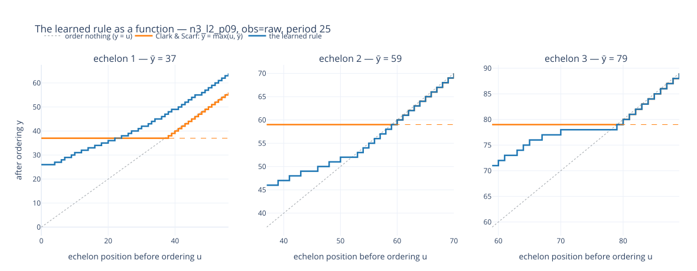
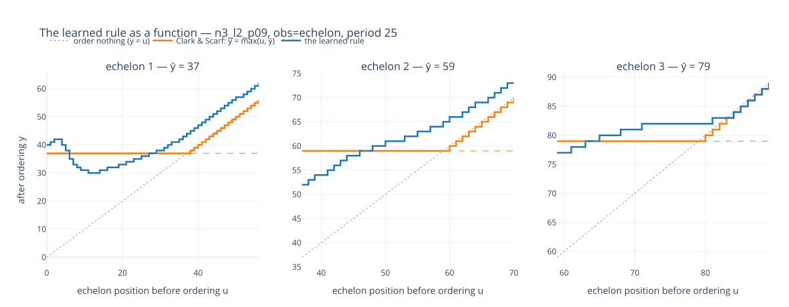

# INTERPRET.md — policy readback for `clark_scarf`

The spec §14 deliverable: what the trained networks actually *do*. The IR
declares three `research_questions.tier2` stances; §14.0 makes this document
owed by the `confirm` one, and the two `bypass` stances are answered by outcome
comparison in `README.md`, recorded here only where the readback bears on them.

**Headline: the two lower echelons implement Clark & Scarf's rule; the retailer
does not.** Swept as a function, the top echelon stops ordering at 78 against
the paper's critical number of 79 and the middle one at 52 against 59 — but the
retailer never stops at all, shipping a floor of ~5 units even when it already
holds four times its optimal level.

## What was read back, and from what

Two artifacts, both the tuned winners of their observation arm, both
`ship_discrete` on `n3_l2_p09`:

| artifact | observation | cost @8192 | role here |
|---|---|---|---|
| tuned raw | `raw` — installation stock only | 989.62 | **the subject**: the stance is about a raw-trained policy |
| tuned echelon | `echelon` — the transform supplied | 989.23 | **the control**: does being handed the coordinates change the rule? |

Both are single training runs and neither is adopted — `README.md` explains
why. Every statement below inherits that caveat: this is what *these two
networks* do, not what the method does.

## The instrument: enumerate the input, read the output

The rule is read by **enumeration, not by sampling**. For each echelon and each
echelon position `u` on a grid, one synthetic state is built, the policy is
queried **deterministically**, and the ordered-up-to level `y = u + q` is
recorded. One input, one output. This has nothing to do with training or
evaluation draws.

Three properties a trajectory-based read cannot have, each of which changed a
conclusion here:

1. **The source cannot bind.** Link *k* draws from installation *k+1*, and on
   this cell that cap binds on about **two thirds** of the lower echelons'
   executed decisions. A scatter of executed shipments is therefore mostly a
   picture of the upstream constraint. In the sweep the source is raised past
   the largest shippable quantity, so every point is the quantity the policy
   *chose*.
2. **The sweep goes past the kink.** Each echelon is swept over its own window,
   1.5× the distance from its floor to its critical number, so the shutoff sits
   at the right third of the axis and the plot shows *where ordering stops* — a
   region no trajectory reaches, because a good policy does not visit deeply
   overstocked states.
3. **It is a function, not a cloud.** One state per input means the curve is the
   rule itself, and a kink is a threshold rather than a density.

**The state convention, stated because it is a choice.** Echelon position `u_k`
sums inventory position over levels 0…k, so one `u_k` is reachable by many
splits and this policy is measurably sensitive to which. Each curve holds **the
rest of the chain at the DP's own optimum** — every other level carries the
increment the optimal policy would hold — and varies only the echelon of
interest. So a curve reads: *with the rest of the chain stocked optimally, how
does this echelon respond to its own position?*

**A structural fact that decides the axes.** Echelon *stock* cannot be changed
by a shipping decision at all — shipping moves goods within an echelon, never
across one. Measured over 1500 decisions the effect is exactly **0.000000** at
every level. So "echelon stock before vs after ordering" is three 45° lines by
construction; the quantity a decision moves, and the one the rule is stated on,
is echelon **position**. This is why `clark_scarf_mdp.py` keeps
`echelon_stock()` and `echelon_position()` separate.

## `confirm` — is the raw-trained policy an echelon base-stock rule?

*Claim as declared: the raw-trained policy IS an echelon base-stock rule — it
recovers the aggregation and applies Clark & Scarf's own critical numbers.*

**Verdict: confirmed at the two upper echelons, refuted at the retailer.**



*Tuned raw arm. Blue is the learned rule, orange Clark & Scarf's
`y = max(u, ȳ)`, dotted the order-nothing diagonal. Each echelon is swept over
its own window with ȳ at the right third.*

| | echelon 1 | echelon 2 | echelon 3 |
|---|---|---|---|
| DP critical number | 37 | 59 | 79 |
| **policy stops ordering at** | **never** | **52** | **78** |
| swept window | u 0–148 | u 37–125 | u 59–139 |
| residual order at the top of the window | **5 units** | 0 | 0 |

**Echelon 3 is the paper's rule.** It shuts off at 78 against a critical number
of 79, and the curve tracks `max(u, ȳ)` on both sides of the kink. Nothing
constrains this level — it draws on the outside supplier — so this is the
cleanest evidence in the document.

**Echelon 2 is the same rule with a displaced threshold**, shutting off at 52
against 59. It holds a genuine order-up-to level; the level is seven units low.

**Echelon 1 is not a base-stock rule.** Its order decays from 26 toward a floor
of about 5 units and never reaches zero: swept to u = 148, four times its
optimal level of 37, it is still shipping. A base-stock rule has a shutoff by
definition, so this level does not have one.

That deviation is invisible to every trajectory-based read, and the reason is
the same as the reason it survived training: a good policy rarely occupies
deeply overstocked retailer states, so nothing in training or evaluation ever
charges much for the floor. It is a real defect in the rule and a cheap one in
cost.

**On its own trajectories the same policy fits** an implied order-up-to of
**37.0 / 58.0 / 79.0** with an IQR of **2 / 3 / 1**, landing within 2 units of
the optimal action on 93.4% / 92.2% / 95.1% of decisions. Those numbers are
consistent with the sweep and say nothing about the floor, because the states
that expose it never arise.

**The echelon aggregation is approximate.** Holding an echelon position fixed
and redistributing the same total across installations and pipelines moves the
shipment by **9.15 / 12.11 / 1.43** units. A policy computing with the
aggregate exactly would not move at all. So the raw-trained policy implements
the right rule in the right coordinate while still keying partly on how that
coordinate is split.

### The control: does being handed the coordinates change the rule?



| | echelon 1 | echelon 2 | echelon 3 |
|---|---|---|---|
| stops ordering at, `raw` → `echelon` | never → **never** | 52 → **never** | 78 → **83** |
| residual order at the top of the window | 5 → 2 | 0 → 1 | 0 → 0 |
| implied order-up-to on own trajectories | 37/58/79 → 37/58/78 | | |
| within 2 units of the DP action | 93.4/92.2/95.1% → 97.1/97.8/90.2% | | |
| **split-invariance** (units) | **9.15 → 5.44** | **12.11 → 1.64** | 1.43 → 1.25 |

**The transform buys coordinate-faithfulness, not a better rule.** The arm given
the echelon observation is markedly more invariant to redistributing a fixed
echelon total — 5.44 / 1.64 / 1.25 against 9.15 / 12.11 / 1.43, which is the
expected direction and confirms the instrument reads what it claims to.

What it does not buy is a cleaner rule. It agrees more closely with the optimal
action on its own trajectories, but under enumeration it is *worse* at the
thresholds: echelon 2 loses its shutoff entirely (a 1-unit floor persists to
u = 125) and echelon 3's moves from 78 to 83, away from the DP's 79. And the two
cost 989.23 and 989.62 — a difference of 0.39 against a seed floor of about 6.

**The rule and the cost are close to decoupled here.** Two policies with
visibly different thresholds, one with an extra level that never shuts off,
score within noise of each other. That is the same flatness `ESCALATION.md`
#E10 found when the two tuned `dgauss` winners disagreed on nearly every
hyper-parameter and landed 0.39 apart.

## `bypass` — the echelon coordinate transform (primary)

§14.0 owes this stance **no readback**: its evidence is the outcome comparison
alone, in `README.md`'s structural section and `ESCALATION.md` #E10. The
readback bears on it from a second direction and is reported for that reason:
the raw policy reaches the paper's thresholds at the upper echelons without
being given the coordinates, with a looser grip on the aggregation, and that
looseness costs nothing measurable.

## `bypass` — the transform on the continuous rendering

Out of scope on this board, which renders the integer-lattice frame only. No
readback, and none owed.

## Reproducing

```bash
# the rule as a function — the figures above
python clark_scarf_plot_policy.py --model-path {run}/n3_l2_p09_ppo_final.zip \
    -o raw -a ship_discrete --sweep            # --span widens the window

# the on-trajectory statistics: implied target, DP agreement, split-invariance
python clark_scarf_policy_probe.py --model-path {run}/n3_l2_p09_ppo_final.zip \
    -o raw -a ship_discrete --episodes 400
```

Each plot writes a committed `.svg` under `figures/` and an interactive `.html`
under `results/{scenario}/figures/`, which is gitignored — GitHub and VS Code
markdown do not execute JS, so an embedded figure has to be an image.

## Limits, and what is owed

- **Single artifacts.** Both policies are one training run each, against a
  run-to-run spread of about 6 cost units.
- **One period.** The figures are cut at mid-horizon (t = 25) because `ȳ` is
  time-varying on a finite horizon and mixing periods blurs the threshold.
- **The far end of each sweep is extrapolation.** Deeply overstocked states are
  far outside anything training visited, so the network is extrapolating there
  and the curve describes the network rather than a policy anyone would run.
  This is why the floor at echelon 1 is reported as a *shape* — no shutoff
  exists — rather than as a quantity anyone should cost.
- **A narrow window can hide a shutoff that exists further out.** At the default
  span the echelon arm's echelon 2 reads "never stops" inside its window; the
  wide sweep confirms it still has not stopped by u = 125. The console line
  prints the window bounds beside every verdict so a truncated read cannot be
  mistaken for an absent one.
- **§14.2's paired fitted-rule scoring is NOT done.** `--offset-sweep` raises
  `NotImplementedError`: it reads the target off a `target_discrete` action, the
  mode the previous board's #E11 voided. §14.0 makes paired scoring the
  `discover` requirement rather than the `confirm` one, so this document is
  complete without it — but with thresholds this clean at two echelons, a fitted
  constant-threshold rule might well *beat* the net it was read from, which
  would make it a shippable artifact and would price the retailer's floor.
