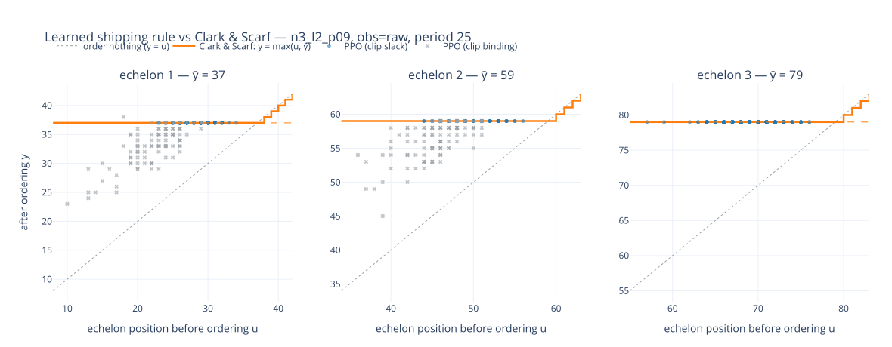

# What did the crown learn? — interpretation round (A2, #E4/#E7)

*(Artifacts regenerate: `clark_scarf_policy_probe.py` writes
`readback.json` beside the artifact, `clark_scarf_plot_policy.py` writes the
committed SVG to `figures/` and an interactive HTML under
`results/{scenario}/figures/`. `results/` is gitignored; this findings
document and `figures/` are not.)*

Subject: the **`L2(hp)` raw winner** — `hp_target_raw` trial 211,
`target_discrete` + `raw` + no masking, **989.0658 @8192** (±1.19), which is
**100.69% of the verified-optimal Clark–Scarf DP** (982.36). Chosen because
it is the crowned artifact on the branch the campaign's question is about:
trained on **raw installation stock**, with no echelon machinery supplied.

Readback on 400 policy-own episodes (20,000 decisions); the figure plots one
period at 200 episodes. Everything below is on-trajectory — an off-policy grid
would probe states no policy visits.

---

## The one-paragraph answer

It learned **Clark & Scarf's rule, with Clark & Scarf's numbers**. Wherever
the availability clip is slack, the implied order-up-to level `y_i = u_i + q_i`
takes **exactly one value per echelon — 37, 59, 79 — identical to the DP's
critical numbers `ȳ_i`, with interquartile spread 0.0** across ~36,000
unclipped decisions. Not a tight distribution around the optimum: a single
integer. It is also a function of the **echelon aggregate** rather than the raw
components — hold the echelon position fixed and redistribute the same total
across installations and pipelines, and the decision is unchanged at echelon 3
(spread 0.00) and nearly so at echelon 2 (0.43), with a small residual at
echelon 1 (0.75) that is arguably *correct* rather than a defect. It agrees
with the optimal action 84–95% of the time, degrading up the chain with a
positive (over-order) bias, and that residual disagreement is where the
remaining **6.71** cost gap to the bar lives.

---

## Rung 1 — is it a base-stock rule at all?

The structural-form statistic is the spread of the implied target where the
clip does not bind: small spread = base-stock, large = something else.

| echelon | fitted ȳ | IQR | n (unclipped) | DP ȳ (mid-horizon) |
|---|---|---|---|---|
| 1 | **37.0** | **0.0** | 9,516 | 37 |
| 2 | **59.0** | **0.0** | 8,943 | 59 |
| 3 | **79.0** | **0.0** | 17,600 | 79 |

Zero spread is the strongest form this test can return, and the fitted
constants are not merely constant — they are the paper's, to the unit.

## Rung 2 — agreement with the optimal policy

| echelon | exact | within 2 | signed bias |
|---|---|---|---|
| 1 | 95.4% | 96.0% | +0.41 |
| 2 | 90.4% | 90.7% | +0.85 |
| 3 | 84.0% | 86.0% | +1.38 |

Two things worth reading carefully. **Within-2 barely exceeds exact** (96.0 vs
95.4; 86.0 vs 84.0), so this is not a policy fuzzy around the optimum — it is
exactly right most of the time and occasionally notably off. And the **bias is
positive and grows up the chain**: it over-orders upstream, by more at echelon
3 than at echelon 1. Over-ordering upstream is the cheap direction of error in
this cost structure (holding at an upper echelon is cheaper than a retailer
stockout), which is consistent with a policy that has the structure right and
the trade-off slightly conservative.

## Rung 3 — the discriminating test: did it find the *echelon* coordinates?

Hold the echelon position `u_i` fixed and vary how the same total is split
across installations and pipelines. A policy that has found the echelon
aggregation ships the same amount; one keying on raw components does not.

| echelon | mean spread | p90 |
|---|---|---|
| 1 | 0.75 units | 2.00 |
| 2 | 0.43 | 0.00 |
| 3 | **0.00** | **0.00** |

Echelons 3 and 2 are invariant — the split is irrelevant to the decision. That
is what "rediscovered the aggregation" means operationally, and it is the test
that separates it from "learned something that happens to score well".

**Echelon 1's residual is defensible, not noise.** Level 1 faces demand *this*
period, and its on-hand-versus-in-transit split genuinely matters to the
immediate shortage in a way the echelon position alone does not capture. A
policy perfectly invariant at level 1 would be ignoring information it should
use. The claim here is bounded accordingly: invariance is established at
echelons 2–3 and approximate at echelon 1.

## Rung 4 — are the recovered constants at an optimum?

Add a constant offset to each echelon's fitted target and re-score under the
Stage-4 protocol (paired, 8192 CRN seeds):

| offset | echelon 1 | echelon 2 | echelon 3 |
|---|---|---|---|
| +2 | +2.23 (z 12.8) | +2.08 (z 15.7) | +3.93 (z 17.6) |
| +5 | +5.61 (z 24.3) | +8.12 (z 34.9) | +19.89 (z 48.4) |
| +8 | +5.61 (z 24.3) | +13.00 (z 50.3) | +41.14 (z 84.4) |

Every perturbation costs, monotonically and far outside noise, and steeply at
echelon 3 where an error propagates down the whole chain. **Limit:** only
positive offsets were swept, so this shows the targets are not too low, not
that they are not too high. Since they equal the DP's numbers exactly, and the
DP is verified optimal, that gap is academic here — but the sweep alone would
not have established it.

## The figure

Echelon position **after** ordering against **before**, one panel per echelon,
period 25. The orange staircase is `y = max(u, ȳ)`; blue points are the
policy's own decisions where the clip is slack; grey × are decisions where the
availability clip binds.

The grey points are drawn separately because the paper's optimum is a
**median**, `y_i = median(u_i, ȳ_i, x_{i+1})` — a point below the plateau may
be the level above running short, not a policy error. At this period the clip
binds on 48.5% of echelon-1 and 55.0% of echelon-2 decisions (shortfall mean
4.0 and 2.8 units) and never at echelon 3, which draws on the unlimited outside
supplier. Conflating those with disagreement would read a supply constraint as
a learning failure.

---

## What this settles

**The tier-2 `confirm` question answers yes.** The campaign carried two
stances on one structure, and they now agree rather than merely coexisting:

- **bypass** (primary) — the echelon transform is not *required*: price of
  generality **−0.55 ± 0.14** at L1, inside the 1.57 floor (#E4), with the
  point estimate falling to **−0.0014** once each branch is tuned separately
  (#E7). The tuned interval is eval-paired on one training seed per arm, so
  L1 carries the seed-backed leg; both agree on zero;
- **confirm** (secondary) — the policy is echelon-structured anyway, to the
  unit, from raw coordinates.

Those could have come apart. A bypass success with a structurally
unrecognisable policy would have been the more awkward result: "the transform
is unnecessary, and we cannot say what replaced it." Instead the two halves
compose into one statement — **the transform is not needed as an input because
the network reconstructs it, and having reconstructed it, it applies the
paper's own critical numbers.**

## Limits, stated

- **One artifact, one training seed.** Trial 211, seed 42. The structural
  claims are not known to be seed-stable. Establishing that would take two
  fresh seeds on the crowned config — cheap (no re-tuning), and the one place
  a seed sweep would buy something here. It was **not** run: A5, which would
  have, was closed unrun because as scoped it defended the tuning procedure's
  expected value, a tier-3 quantity this campaign never claims.
- **One cell.** `n3_l2_p09` only. Nothing here transfers to other
  `(n, l, p)` cells by construction — they are separate leaderboards.
- **One period in the figure.** The IQR-0 result is across all periods; the
  panel is a slice at t=25, and `ȳ` is time-varying on a finite horizon.
- **The 6.71 gap is described, not explained.** Disagreement concentrates
  upstream with a positive bias, but whether it concentrates in clip-bound
  states, near horizon ends, or in some other region has not been measured.
  That is the obvious next probe if the gap is ever worth closing.
