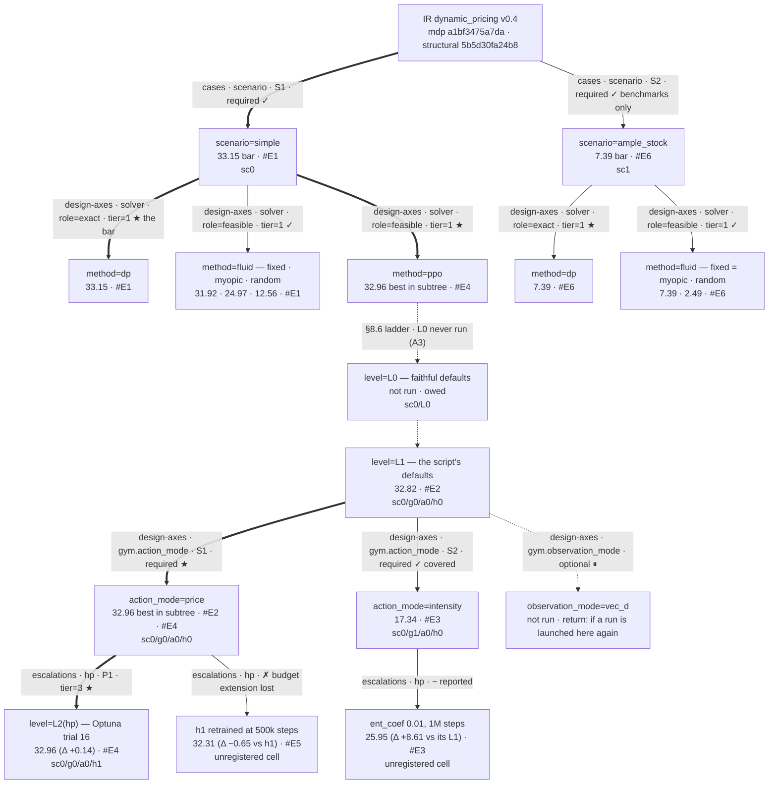

# dynamic_pricing — escalation log

Campaign log for the Gallego & van Ryzin (1994) finite-horizon pricing
problem. Sections per `ESCALATION_LOG_GUIDE.md` §2. **Seeded 2026-09-14 from
the record**: the campaign ran in July 2026 before this log existed, and
entries `#E1`–`#E6` are reconstructed from the README of commit `86d7385`
(the author's research workspace, 2026-07-09) with that provenance stated
on each (guide §7 rule 8). Run directories from that campaign were not
retained, so those entries cite the README's artifact names and nothing else.

## MAP  (as of 2026-09-14, #E7)

**The question.** Tier 1 only — how does PPO compare with the exact DP of the
discretized problem and with the paper's fluid heuristics on one instance
where the stock constraint binds? No tier-2 stance is declared in the IR.

**Target.** `simple` — `a` 100, `alpha` 1, `n0` 25, `T` 50. Specialist.
`ample_stock` (`a` 20) is a second, incomparable board opened for its
benchmarks only.

**The bar.** Backward induction over `(period, inventory)` on a 0.005 price
grid: exact for the discretized MDP. Its computed value `V[0][25]` = 33.1047;
the paper's deterministic fluid relaxation gives 34.66, `≽ opt`, unattainable.

**Established.**

| | |
|---|---|
| Frozen IR today | `mdp a1bf3475a7da` · `structural 5b5d30fa24b8` (v0.10.11 pin). Two `Confirmable`s still `derived` (decision type, decision bounds); no `signoff.json`, no `runplan.json` — every `mdp_stage` op is BLOCKED until a human signs off |
| Gates (2026-09-14, v0.10.11) | IR OK · conformance 22/30, no FAIL, WARN `schema.no_enumeration` (`allow_backlog`, `allow_reorder` decorative) and `scripts.schedule_pairs` (`--learning_rate` without `--lr_final`) · laws 7/9 (SKIP `path_independence`, `mixture_equivalence`) · differential MATCH 40/40 on `base` and `ample_stock` · pytest 9 |
| Benchmarks (8192 seeds, July record / 2026-09-14 re-measurement) | `dp` **33.15 / 33.02** · `fixed` 31.92 / 31.85 · `myopic` 24.97 / 24.95 · `random` 12.56 / 12.44 |
| RL (July record only; no surviving artifact) | `price` L1 32.82 · `price` L2(hp) **32.96** (99.4% of the bar) · `intensity` best 25.95 |
| Ladder | `random → myopic → fixed → dp` = 12.56 → 24.97 → 31.92 → 33.15; PPO `price` sits between `fixed` and `dp` at both rungs |
| Gate classification | `fixed`, `myopic`, `random` are baselines (`--baseline`); `dp` is the reference (`--reference`, refused as a baseline by the §9.9 role gate) |

**Status: dormant since 2026-07-09; not closed.** The record answers tier 1
on `simple` but cannot be replayed: the RL artifacts are gone and the seed
tree moved under the folder (v2, 2026-07-22). Re-admission upstream requires
A1–A4 below; case close requires A5.

### Design tree

Two rows per node, three where the §CONFIG-REGISTRY names the tuple. The
root carries **today's** fingerprints; the July runs were produced under an
earlier token that was never recorded (see §IR-CHANGELOG).

### Layers and node readings

| node | kind · attributes · tier | reading | entry |
|---|---|---|---|
| root — the frozen IR | not a split | the frame is over one problem, rooted at the **current** token; the July runs' token was never recorded, so the tree cannot say whether the `mdp` block that produced them hashes to this root | — |
| `scenario=simple` | **cases** · required | the study base; the stock constraint binds (`p0` 1.386 > `p*` 1.0), so the optimal price is state-dependent | [#E1](#E1) |
| `scenario=ample_stock` | **cases** · required | opened for benchmarks only: `p0` = `log(20·1/25)` < 0, so `p_FP` = `p*` and the DP is the constant myopic price. Separate leaderboard; no RL arm, and none owed — there is nothing to learn | [#E6](#E6) |
| `method=dp` | **design-axes** · role=exact · **1-comparative** | the bar. Computed 33.1047, evaluated 33.15 (July) and 33.02 ± 0.05 (2026-09-14) — both within noise of the computed value, which is the calibration the off-tree register records | [#E1](#E1) · [#E8](#E8) |
| `method=fluid` | **design-axes** · role=feasible · **1-comparative** | `fixed` (the paper's `p_FP`) is the must-beat baseline at 96.3% of the bar; `myopic` sells out early; `random` is the floor | [#E1](#E1) |
| `level=L0` | not a split — the §8.6 ladder | never run. The campaign predates the L0/L1 levels (v0.3.0, 2026-07-27); the floor is owed with A3 | — |
| `level=L1` | not a split — the §8.6 ladder | the train script's defaults, which `_L1_DERIVED` records as the derivation since 2026-08-22 (VecNormalize on, γ 1.0, λ 0.95, rollout 2048, batch 512, lr 3e-4 constant, ent 0). One seed, 500k steps | [#E2](#E2) |
| `action_mode=price` / `=intensity` | **design-axes** · required · `gym.action_modes` | both declared in the IR, both covered. `price` is crowned as the default; `intensity` is reported, not pruned — it is the paper's native control and the IR keeps it. The 15.5-point gap at L1 is an interface effect (raw action 0 = shut-off price), tier 3 | [#E2](#E2) · [#E3](#E3) |
| `observation_mode=vec_d` | **design-axes** · optional · ⏸ | declared, never run; `vec` is the sufficient statistic (`requires_memory` false, `human_confirmed`), so `vec_d` is an open extension, not debt | — |
| `level=L2(hp)` | **escalations** · tier=3 · ★ | crowned: trial 16 of a 25-trial TPE study, re-scored on the protocol block at 32.96. Gain over L1 +0.14 on one seed per arm — a selection maximum, not a procedure estimate | [#E4](#E4) |
| `h1 @ 500k` | **escalations** · tier=3 · ✗ | the crowned configuration retrained at 2.5× the budget scored 32.31; the heavy 20-epoch recipe does not improve with budget, so the shipped artifact was trial 16 itself | [#E5](#E5) |
| `intensity` + `ent_coef` 0.01 @ 1M | **escalations** · tier=3 · ~ | more entropy and double the budget move `intensity` from 17.34 to 25.95, still below `myopic`'s successor `fixed`; reported, never crowned | [#E3](#E3) |

**Crowned path (§3.4).** `simple / dp` ★ and
`simple / ppo / L1 → L2(hp) / price` ★ — best overall for the cell is `dp`
33.15; best learned is `ppo` 32.96 at `sc0/g0/a0/h1`. `L0` is on the path as
the rung never run, not a pruned competitor.

**Bounds attached (§3.1).** action interface (`price` − `intensity`) +15.5 at
L1, +7.0 after `intensity`'s own escalation · tuning +0.14 (one seed) ·
budget extension of h1 −0.65 · headroom to bar **0.19** (July frame).

### Frontier  (as of #E7)

| | agenda item | node | status |
|---|---|---|---|
| A1 | **sign-off backfill** — confirm the two `derived` Confirmables (`mdp.decisions[0].type`, `.bounds`) through `mdp-formalize` step 6, then write `dynamic_pricing.signoff.json` (CONTRACTS.md, "Pre-split domains"); a human act, no date to invent | root | queued — blocks every `mdp_stage` op |
| A2 | **run-plan backfill** — `dynamic_pricing.runplan.json`: target `simple`, specialist, escalation budget spent (one 25-trial study) | root | queued; after A1 |
| A3 | **re-train the RL arms under the v2 tree** — L0 (owed floor), L1 at `sc0/g0/a0/h0`, h1 at `sc0/g0/a0/h1`, three seeds each, screened per §9.7 and scored on the protocol block — so the `simple` board has one frame and `dynamic_pricing_policy.py` has an artifact | L0, L1, HP | queued; the only way the RL rows become reproducible |
| A4 | **conformance residue** — (a) `schema.no_enumeration`: drop or reference `allow_backlog`/`allow_reorder` (moves the `mdp` fingerprint → F-entry, re-sign); (b) `scripts.schedule_pairs`: expose `--lr-final` with a schedule (a re-derivation of `_L1_DERIVED`, new L1 generation); (c) `mdp_tuning --show-space` reports `breadth`/`all` BLOCKED — `vf_coef`, `clip_init`, `max_grad_norm` not exposed; (d) the train script does not tee `train.log` into the run dir (spec §8.4) | root, L1 | queued; (a) and (b) each void a sign-off, so sequence them with A1 |
| A5 | **`PLAYBOOK.md`** (guide §10) | off-tree | ✓ distilled 2026-09-14 at re-contribution (LV1–LV2, FM1–FM2, envelope verdict); the campaign stays dormant, A3 still owed |
| parked | `observation_mode=vec_d` | VD | ⏸ optional — tripwire: a run launched on this board |

**Off-tree register** (budget-consuming, *not* solution-touching): bar
calibration ✓ — computed `V[0][25]` 33.1047 vs evaluated 33.15 (July, pre-v2)
and 33.02 ± 0.05 (v2); fluid relaxation 34.66 `≽ opt` by construction ·
protocol construction ✓ (8192 seeds from 0, deterministic argmax) · floor
measurement: none — no L0, no retrain spread.

### Current best bundle

`sc0 / g0 / a0 / h1` — `price` encoding, `vec` observation, VecNormalize on,
trial-16 hyper-parameters at 200k steps: **32.96 @ 8192** (July frame). No
jointly-validated edges. The artifact is not in this folder.

## FRAME-CHANGELOG

- 2026-07-09  INTRODUCED — campaign on `simple`, specialist; `price` and `intensity` action modes as declared design axes; exact DP + fluid heuristics; PPO within 0.6% of DP (`86d7385`, the author's research workspace)
- 2026-07-21  folder MOVED upstream into auto-mdp-solver `examples/` at the solver split (`84ae2c0`); all later changes are upstream conformance edits with **no number re-run**
- 2026-07-22  seed scheme v2 — the four-word key `[1, period, episode_seed, seed_salt]` became the leaf-first v2 tree; the recorded numbers are no longer bit-reproducible (`40cf3e4`)
- 2026-07-28  RENAMED `vanryzin_pricing_*` → `dynamic_pricing_*`; invariants + laws gate; `dynamic_pricing_test.py` (`7e99f1f`, `34112b9`, `a13c4e1`)
- 2026-08-16  `benchmarks` DECLARED in the IR: `dp` exact, `fluid` feasible (`06aec21`)
- 2026-08-22  `_L1_DERIVED` / `_L1_BASIS` as data, `assert_l1_current` at launch, provenance lines in the eval TSV (`17f3bcc`, `4812d50`, `346c74d`)
- 2026-09-01  DEMOTED `examples/` → `cases/`: redundant with `inv_single`'s shape as a few-shot exemplar, not incomplete (`585ed46`, v0.9.38)
- 2026-09-14  WITHDRAWN from `cases/` to this workspace: pre-§1.3 shape, no `CLAUDE.md`, no campaign record (`5f6c8d1`, v0.10.11)
- 2026-09-14  log SEEDED; `CLAUDE.md` and `README.md` brought to the v0.10.11 §1.3 shapes; restatement backfilled; root RE-ROOTED on today's fingerprints; benchmarks RE-MEASURED under the v2 tree (#E7, #E8). No RL number moved; all four benchmark rows agree with the record within two SE

## IR-CHANGELOG

**Pre-log moves, without a recorded token.** The `mdp` block moved at least
twice upstream before this log existed — the v2 seed scheme (2026-07-22) and
the declared invariants (2026-07-28) — and no fingerprint was recorded at
either, so no F-entry can cite one. The tree roots at today's token
(`a1bf3475a7da`); a re-signed IR under A1 records the next move here as F1.
The July numbers were produced under `mdp_ir/examples/vanryzin_pricing.json`
at IR v0.4, a file the current schema descends from by rename and the two
moves above.

**Re-gate on the pin, 2026-09-14, v0.10.11 — no fingerprint move, so no
F-entry.** IR OK; conformance 22/30 no FAIL; laws 7/9; differential MATCH on
both instances; pytest 9. Recorded here so the absence of a move is on the
record rather than inferred.

## CONFIG-REGISTRY   (living — ids append-only; guide §13)

No `dynamic_pricing_configs.py` exists; the tables below are the reader-facing
half only, and the module is owed the moment an arm is launched here again
(guide §13.5).

### scenario
| id | key in SCENARIOS | note |
|---|---|---|
| `sc0` | `simple` | `a` 100 — the record board; stock binds |
| `sc1` | `ample_stock` | `a` 20 — benchmarks only; DP = constant myopic price |

### gym · `g`
| id | parent | delta | why it exists / what promoted it | cell tuned in |
|---|---|---|---|---|
| `g0` | — (L1 origin) | `observation_mode=vec`, `action_mode=price`, `reward_mode=revenue`, `norm_obs=True`, `norm_reward=True`, `vecnorm_clip_obs=10`, `n_envs=1` | the §8.6 derivation's gym output, read from the train script | — |
| `g1` | `g0` | `action_mode=intensity` | a design axis, so a different **cell**, not an escalation (guide §13.4); L1 in its own cell | — |

### arch · `a`
| id | parent | delta | why it exists / what promoted it | cell tuned in |
|---|---|---|---|---|
| `a0` | — (L1 origin) | `MlpPolicy`, no custom extractor | the derivation; `net_arch` width is `h` | — |

### hp · `h`
| id | parent | delta | why it exists / what promoted it | cell tuned in |
|---|---|---|---|---|
| `h0` | — (L1 origin) | `learning_rate=3e-4` constant, `n_steps=2048`, `batch_size=512`, `n_epochs=10`, `gamma=1.0`, `gae_lambda=0.95`, `ent_coef=0`, `normalize_advantage=True`, `net_arch=64,64` | `_L1_DERIVED` in `dynamic_pricing_ppo_train.py`; the budget (500k) is not config | — |
| `h1` | `h0` | `learning_rate=1.6e-4`, `ent_coef=2.6e-3`, `gamma=0.9995`, `n_steps=512`, `batch_size=32`, `n_epochs=20` | [#E4](#E4) — Optuna trial 16, crowned on the protocol re-score | `sc0/g0/a0` |

### Constraints
| id | requires |
|---|---|
| `sc0`, `sc1` | `h.gamma <= 1.0` — β = 1 (undiscounted); γ > β is refused by `assert_l1_current` |

### Current bases
| axis | current | since |
|---|---|---|
| `sc` / `g` / `a` / `h` | `sc0` / `g0` / `a0` / `h1` | [#E4](#E4) |

## LEDGER

### #E1 2026-07-09 — the bar and the heuristics on `simple`
address: `simple / solver` — `method=dp`, `method=fluid`
↑ [design tree](#MAP) — explains `method=dp`, `method=fluid`
provenance: reconstructed from the README of `86d7385` (guide §7 rule 8); run dirs not retained; four-word pre-v2 seed key
runs: `dynamic_pricing_dp.py -s simple` (then-name; today `dynamic_pricing_benchmark_dp.py`), its eval at 8192 seeds; `dynamic_pricing_lp.py --policy {fixed,myopic,random}` (today `dynamic_pricing_benchmark_fluid.py`)
verdict: computed `V[0][25]` = 33.10; fluid relaxation 34.66 `≽ opt`
         | arm | revenue @8192 | Δ vs dp | scope |
         |---|---|---|---|
         | `dp` | 33.15 | — | matches the computed value within eval noise |
         | `fixed` | 31.92 | −1.23 | `p_FP` = 1.386 |
         | `myopic` | 24.97 | −8.18 | `p*` = 1.0; sells out early |
         | `random` | 12.56 | −20.59 | uniform on `[0, 8]` |
         Ordering sane: `dp ≽ fixed ≽ myopic ≽ random`.   status: ✓

### #E2 2026-07-09 — PPO in the `price` encoding at the script's defaults
address: `simple / ppo / L1 / action_mode=price` — `sc0/g0/a0/h0`
↑ [design tree](#MAP) — explains `level=L1`, `action_mode=price`
provenance: README record; the config equals today's `_L1_DERIVED` by construction (the derivation was backfilled from these defaults upstream on 2026-08-22)
runs: `dynamic_pricing_ppo_train.py -s simple -a price` (500k steps, seed 1); protocol eval at 8192 seeds
verdict: **32.82** = 99.0% of the bar, +0.90 over `fixed`.   status: ✓ clears every baseline

### #E3 2026-07-09 — the paper's native `intensity` control is the harder encoding for PPO
address: `simple / ppo / L1 / action_mode=intensity` — `sc0/g1/a0/h0`, and an hp escalation in an unregistered cell
↑ [design tree](#MAP) — explains `action_mode=intensity`, `intensity + ent_coef 0.01 @ 1M`
provenance: README record
hypothesis: the IR's own `desc` predicted `intensity` might be easier — revenue is linear in sales under it
runs: `-a intensity` at the defaults, 500k; then `--ent-coef 0.01 --total-timesteps 1000000`
verdict: | arm | revenue @8192 | Δ vs `price` L1 | scope |
         |---|---|---|---|
         | `intensity`, defaults 500k | 17.34 | −15.48 | below `myopic` |
         | `intensity`, ent 0.01, 1M | 25.95 | −6.87 | above `myopic`, below `fixed` |
         Mechanism: SB3's Gaussian initializes at raw action 0, which in the box `[0, a/e]` is the null (shut-off) price, so half the initial action mass earns zero revenue and the gradient signal is weak; in the `price` box raw 0 is a low-but-selling price. `price` is the recommended default. Both encodings stay declared and covered; this is a tier-3 interface finding, not a prune.   status: ~ reported

### #E4 2026-07-09 — L2(hp): a 25-trial Optuna study on the `price` cell
address: `simple / ppo / L1 / price / L2(hp)` — `sc0/g0/a0/h1`
↑ [design tree](#MAP) — explains `level=L2(hp)`
provenance: README record; study `dynamic_pricing_simple_ppo`, 25 TPE trials × 200k steps scored on 2048 trial-layer seeds; the winner (`trial_0016`) re-scored on the protocol block
runs: `dynamic_pricing_ppo_tune.py -s simple --n-trials 25 --total-timesteps 200000`
verdict: trial 16 — `learning_rate` 1.6e-4, `ent_coef` 2.6e-3, `gamma` 0.9995, `n_steps` 512, `batch_size` 32, `n_epochs` 20, `net_arch` (64,64) — **32.96 @8192** = 99.4% of the bar, Δ +0.14 over L1 on one seed per arm. The winning region is consistent across the top trials (small net, rollout 512, 20 epochs, γ ≈ 0.999; γ ≤ 0.99 reliably hurt in this undiscounted problem). Trial-layer scores are not quoted (spec §9.7).   status: ✓ crowned

### #E5 2026-07-09 — does the crowned configuration improve with budget?
address: `simple / ppo / L1 / price / L2(hp)` — `sc0/g0/a0/h1` + `total_timesteps=500000`, unregistered cell
↑ [design tree](#MAP) — explains `h1 @ 500k`
provenance: README record
runs: the trial-16 configuration retrained for 500k steps, seed 1; protocol eval
verdict: **32.31**, Δ −0.65 against the 200k artifact. The heavy 20-epoch recipe does not improve with a larger budget; the shipped artifact was the trial-16 model itself. One seed — the selection maximum over 25 trials versus one fresh draw, so this is also the size of the winner's curse on one sample.   status: ✗ budget extension not adopted

### #E6 2026-07-09 — `ample_stock`: the degenerate control
address: `ample_stock / solver` — `sc1`
↑ [design tree](#MAP) — explains `scenario=ample_stock`, its `method=dp`, `method=fluid`
provenance: README record
runs: the #E1 commands with `-s ample_stock`
verdict: `dp` = `fixed` = `myopic` **7.39**, `random` 2.49. With `a` 20 the run-out price is negative, `p_FP` = `p*` = 1.0, and the DP policy is that constant, so the three arms are one policy. No RL arm trained and none owed.   status: ✓

### #E7 2026-09-14 — DIAGNOSIS: re-admission audit at the v0.10.11 pin
reads:    #E1–#E6 (README record, pre-v2 key); the upstream withdrawal commit `5f6c8d1`; the gate battery run today
observed: IR validates (`mdp a1bf3475a7da`, `structural 5b5d30fa24b8`); conformance 22/30 with no FAIL and two WARNs; laws 7/9; differential MATCH on both instances; 9 tests. The folder is byte-identical to the withdrawn upstream copy. No `CLAUDE.md`, no log, no restatement, no sign-off, no run plan: every `mdp_stage` op BLOCKED. Two `Confirmable`s still `derived`. The RL artifacts are gone; the benchmark commands run as written and the train/eval/policy/tune commands run at a smoke budget.
missing:  a sign-off (human); a run plan; RL rows on the current seed tree; the two conformance WARNs; tuning tier reach (`vf_coef`, `clip_init`, `max_grad_norm` unexposed); `train.log` tee; `PLAYBOOK.md`
plan:     A1–A5 (§Frontier). Arbiters: A1 is the sign-off itself; A3 re-runs the #E2/#E4 configurations — pre-decided branches: (i) h1 ≥ `fixed` + 2 SE and ≤ `dp` → the record stands under the new frame; (ii) h1 < `fixed` → the July numbers do not transfer and the campaign re-opens at L1; (iii) any arm > `dp` → bug report, not a result (§9.9)

### #E8 2026-09-14 — the benchmark arms re-measured under the v2 seed tree
address: `simple / solver`, `ample_stock / solver` — `sc0`, `sc1`
↑ [design tree](#MAP) — explains `method=dp`, `method=fluid` on both boards
hypothesis: the same seed block under the v2 key reproduces the July benchmark levels within eval noise
runs: `README.md` technical appendix, benchmark block, both scenarios, 8192 seeds from 0
verdict: | arm | July (pre-v2) | 2026-09-14 (v2) | SE (v2) | Δ | scope |
         |---|---|---|---|---|---|
         | `simple` `dp` | 33.15 | 33.02 | 0.054 | −0.13 | computed `V[0][25]` 33.10 sits between |
         | `simple` `fixed` | 31.92 | 31.85 | 0.044 | −0.07 | |
         | `simple` `myopic` | 24.97 | 24.95 | 0.004 | −0.02 | |
         | `simple` `random` | 12.56 | 12.44 | 0.057 | −0.12 | |
         | `ample_stock` `dp`=`fixed`=`myopic` | 7.39 | 7.31 | 0.030 | −0.08 | computed `V[0][25]` 7.36 |
         | `ample_stock` `random` | 2.49 | 2.45 | 0.025 | −0.04 | |
         Every Δ is within two SE of a two-block comparison (`√2 · SE`). The July board and this one are different frames: numbers may be reported across them, never subtracted. The RL rows have no v2 counterpart until A3.   status: ✓ benchmarks reproduce
