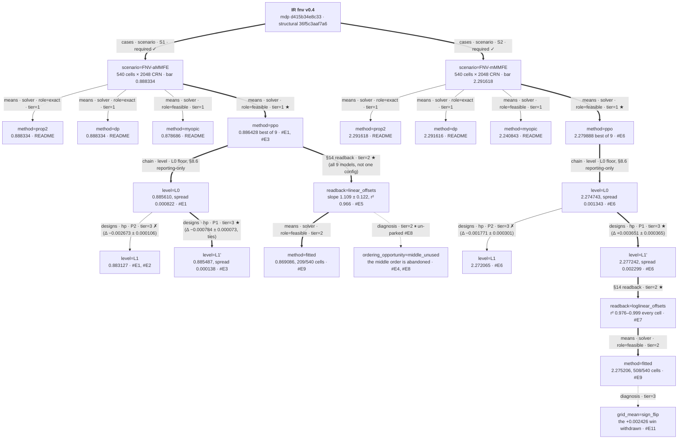

# fnv — escalation log

Campaign opened 2026-08-13 on the `FNV-aMMFE` branch (additive MMFE, 540-cell
design grid, generalist policy) and **closed 2026-08-14** with both branches
run. `FNV-mMMFE` is a **separate board** — same protocol, its own bar, and its
scores are never comparable with the additive ones. Protocol throughout: 540
cells × 2048 CRN seeds, seed block 0…2047, identical for every arm; comparisons
are paired per cell.

<a id="MAP"></a>
## MAP  (as of 2026-08-17 — both branches run and closed; the tree was **redrawn
to the guide §3.1 contract** on 2026-08-17, numbers unchanged)

### Design tree

**Redrawn 2026-08-17 (guide §3.1/§3.2, retype only — no number and no verdict
moved).** The previous tree predated the `cases`/`means`/`designs` taxonomy and
carried five defects, four of which the guide names in its own text:

1. **The root was not the IR.** It read "root: FNV generalist over the aMMFE
   grid" — a prose description of one branch, which cannot be the root of a
   tree spanning two. §3.1: *the root is the frozen IR, carrying both
   fingerprints*, which is what makes the §MAP ↔ §IR-CHANGELOG link mechanical.
2. **`L0` was drawn as a crown-eligible sibling of `L1′`, both `P1 ★`** — the
   defect the guide cites `cases/fnv` by name for. Spec §8.6 makes L0
   reporting-only and never a gate, so a sibling edge asserts a selection that
   never happened, and two co-ranked `P1 ★` children cannot both be crowned at
   a `designs` split. The ladder now draws as a **chain** (§3.2).
3. **`∅` was used for refutation.** `∅` means *structurally void — cannot
   exist*; `L1` exists and lost. Both `∅` edges are now `✗`.
4. **The scenario and solver layers were missing.** §3.1 fixes the first two
   layers below the root, and the four benchmarks were sitting in the off-tree
   register — but *a benchmark is a solution to the problem*, so it belongs on
   the `solver` layer, grouped by `role`. Only the bar **calibration** is
   genuinely off-tree, and it stays there.
5. **Nodes were prose, and untyped.** No `{axis}={option}` line, no split ids,
   no tier, protocol and bar buried inside node labels, and no readings table.

**Typing.** The scenario split is **`cases`**: a-MMFE and m-MMFE do not share a
frame — demand is `mu + I` on one and `exp(mu + I)` on the other, so the scales
differ and a score from one may never be subtracted from a score in the other.
That is the Phase-A mode stance ("two independent branches, separate
leaderboards") carried onto the tree, and it is why the crown **forks** here and
why neither branch is prunable. One scenario split covers the branch choice
because each branch *is* one `GRIDS` registry object — an extra `mmfe_mode`
layer above it would be phantom depth. Below each case sits the **`solver`
layer**, a `means` split grouped by role: `prop2` and `dp` are `exact = opt`,
`myopic`, `fitted` and `ppo` are `feasible ≼ opt`. `means` children share the
case's frame, which is what licenses every "% of bar" here; none is prunable.
Everything below is **`designs`** — one shared leaderboard, crown one, prune the
rest.

**The root re-rooted at F2** (2026-08-17): `mdp` `40110193eba5` →
`d415b34e8c33`. Every number below carries over unchanged, and the reason is
checkable rather than asserted — F2 declared the *model* layer only, the
**structural (rendering) fingerprint did not move**, and the step-7b trajectory
re-rendered byte-identical on both instances.



### Layers and node readings

One table, keyed by node (guide §3.1). The tree is an index; every reading below
reproduces from the entry it cites. `README` marks an arm built before the
campaign opened, whose record is the leaderboard rather than a ledger entry.

| node | kind · attributes · tier | reading | entry |
|---|---|---|---|
| `scenario=FNV-aMMFE` | cases · required · tier=1 | additive branch, `D = mu + I`; the 540-cell grid a generalist is trained over. Protocol and bar are annotated here, not on the campaign | [#E1](#E1) |
| `scenario=FNV-mMMFE` | cases · required · tier=1 | multiplicative branch, `D = exp(mu + I)`. A separate board — its profits are never comparable with the additive ones | [#E6](#E6) |
| `method=prop2` | means · role=exact · tier=1 | the paper's Proposition 2 recursion; **the bar**. Exact as an algorithm, so no feasible arm may pass it | README |
| `method=dp` | means · role=exact · tier=1 | the same optimum from an independent value-function solver. Its *agreement* with `prop2` is the §1.2 second-implementation gate; the calibration itself is off-tree | README |
| `method=myopic` | means · role=feasible · tier=1 | safety stocks that ignore the option to order again. Corollary 1 guarantees `b_n ≤ b̂_n`, so it over-orders by construction — a floor check, not a contender | README |
| `method=ppo` (a) | means · role=feasible · tier=1 ★ | the trained artifact, best of 9 confirmed checkpoints; −0.21% of bar. Crowned within its own frame, read against the exact arms rather than gated on them | [#E3](#E3) |
| `method=ppo` (m) | means · role=feasible · tier=1 ★ | as above on the multiplicative board; −0.51% of bar | [#E6](#E6) |
| `level=L0` (both) | chain rung · tier=3 | faithful defaults, **reporting-only and never crown-eligible** (§8.6). It is the ruler the configuration layer is measured against, which is why it is a chain parent and not a sibling | [#E1](#E1), [#E6](#E6) |
| `level=L1` (both) | designs · hp · tier=3 ✗ | the derivation as first read: LR 1e-4→1e-5, batch 256. Loses to L0 on **both** branches — 2 campaigns, none opposed. #E2 shows why: ~40× less total policy movement at equal budget, i.e. under-training, not instability | [#E1](#E1), [#E2](#E2), [#E6](#E6) |
| `level=L1'` (both) | designs · hp · tier=3 ★ | the corrected derivation (LR 3e-4→3e-5, batch 64 — both inside the spec's own ranges, so a re-application of the L1 rules and not a tuned escalation). Ties L0 on a-MMFE with 6× tighter spread; **beats** it on m-MMFE. Ship-by-default on both | [#E3](#E3), [#E6](#E6) |
| `readback=linear_offsets` | designs · tier=2 ★ | §14 anchored readback: post-order inventory against cumulative information at the final order recovers the predicted slope of 1, and `b̂₃` lands 0.026 from the exact `b₃`. **Hangs off `method=ppo`, not off `level=L1'`, on purpose** — the 36 fits pool all 9 confirmed checkpoints (L0/L1/L1′ × 3 seeds), so it is a claim about the artifact, not about one config. Structural fidelity tracks the config error: L1, refuted on score, is also worst on structure (slope 1.20–1.26 against L1′'s 1.05–1.07). The design that produced it is not incidental — three earlier probe designs each returned a different wrong verdict on the same policy (#E10) | [#E5](#E5), [#E10](#E10) |
| `readback=loglinear_offsets` | designs · tier=2 ★ | the same claim in logs on the multiplicative branch, `log S = mu + I + b`. Hangs off `level=L1'` because it *was* measured there — the best confirmed checkpoint on this branch is an L1′ model. Slope approaches 1 as a cell carries more information; the middle order is well sampled here (408–566 acting episodes of 1500) where a-MMFE could barely reach it | [#E7](#E7) |
| `method=fitted` (a) | means · role=feasible · tier=2 | the readback scored as a policy (§14.2), distilled from the branch's best confirmed checkpoint — which here is an **L0 seed2** model, not the ship-by-default L1′. **Scored on 209/540 cells, so its number is a different frame** — never subtract it from a full-grid arm above. Within its own subset it ties the net it came from (reference 0.871613, rule 0.869086, net 0.869212; Δ −0.000126 ± 0.000049). **The coverage split is the finding**: the full-horizon assertion drops 331 cells because the policy never orders at period 2 there, so `b̂₂` is unidentifiable and the rule cannot be completed at all — a policy that abandons an ordering opportunity cannot be distilled into a rule over it, however well it scores | [#E9](#E9) |
| `method=fitted` (m) | means · role=feasible · tier=2 | as above on 508/540 cells — again its own frame (reference 2.285018, rule 2.275206, net 2.272780). Ties the net once #E11's correction lands; the apparent +0.002426 win was an artifact | [#E9](#E9), [#E11](#E11) |
| `ordering_opportunity=middle_unused` | diagnosis · tier=2 | the a-MMFE policy abandons one of its three ordering opportunities entirely, and the profit gap does not show it — the landscape is flat. Parked as invisible to scores, then **un-parked** when the tripwire (`P(order@2) > 0.35`) fired on m-MMFE at 0.433: the collapse is branch-specific, not a property of the learner | [#E4](#E4), [#E8](#E8) |
| `grid_mean=sign_flip` | diagnosis · tier=3 | the m-MMFE "fitted beats the net" claim was an artifact of an equal-weight grid mean over an *enumerated* grid: the correct denominator uses seeds as the replication unit (1.78 SE, below the bar), the median cell Δ is negative, and 4% of cells carried the whole mean. The improvement claim is withdrawn; the structural claim is untouched | [#E11](#E11) |

### Frontier

Campaign **closed 2026-08-14**; the queue is retained as the record of what was
asked and how it resolved (frontier as of #E11).

1. ~~A1 — read back the m-MMFE branch~~ **done** (#E6, #E7, #E8).
2. ~~A2 — score the fitted rule as a policy~~ **done** (#E9) — and its headline
   claim was then **withdrawn** by #E11. The rule *ties* the net on both
   branches; it does not beat it.
3. **A3 — separate truncation bias from genuine over-response** — *not run as an
   experiment*, and **#E10 records it as still open** in so many words. Mitigated
   by convention instead: the acting count is reported beside every slope and
   truncation-biased cells are excluded from averages and named (#E5, #E7). The
   residual question — how much of the 1.109 slope excess is the censoring kink
   and how much is genuine over-response — is the campaign's one acknowledged
   open item, carried in `PLAYBOOK.md` LV6.
- `ordering_opportunity=middle_unused` **un-parked 2026-08-14** — tripwire fired
  on m-MMFE (L1′ seed1 at 0.433, L0 seed3 at 0.399, #E8). Closed as
  branch-specific; no further arm opened.

### Off-tree register   (budget-consuming, *not* solution-touching)

- **Bar calibration** — `prop2` and `dp` agree on the optimum to 2.4e-05 in
  scored profit (`--cross-check`, §1.2). The bar is not in question. The two
  solvers themselves are **on** the tree, at the `solver` layer; only this
  verification is off it.
- Protocol construction: 2048 seeds/cell, not the 8192 evidence grade — the
  spec's cheap-domain default, justified by T̄ = 3 and per-cell SE ≈ 0.004
  against gaps an order of magnitude larger.
- Next campaign root: none open; both branches have run.

### Current best bundle

**L1′, the corrected derivation**, on both branches:

| branch | L1′ | vs L0 | best single arm | % of bar |
|---|---|---|---|---|
| a-MMFE | 0.885487 | ties (t = −0.26), 6× tighter spread | 0.886428 | −0.21% |
| m-MMFE | **2.277242** | **beats, +0.003651 ± 0.000365** | 2.279888 | −0.51% |

L1′ is the ship-by-default configuration: it wins outright on m-MMFE and ties
with far better reproducibility on a-MMFE. The configuration layer is worth
≈ 0 on a-MMFE and ~+0.004 on m-MMFE.

## FRAME-CHANGELOG

```
2026-08-13  INTRODUCED  the config layer (L0 vs L1) is the first axis          (#E1)
2026-08-13  REFUTED     "the derived L1 config beats faithful defaults"        (#E1)
2026-08-13  NARROWED    L1's loss is under-training, not instability           (#E2)
2026-08-14  INTRODUCED  structural fidelity is a separate axis from profit     (#E5)
2026-08-14  PARKED      the middle-order gap — real, but invisible to scores   (#E4, #E5)
2026-08-14  CONFIRMED   L1 < L0 replicates on a second branch                   (#E6)
2026-08-14  NARROWED    L1' beats L0 outright on m-MMFE, not merely ties        (#E6)
2026-08-14  UN-PARKED   the middle-order collapse is aMMFE-specific, not general (#E8)
2026-08-14  INTRODUCED  fit COVERAGE is a structural diagnostic, not bookkeeping (#E9)
2026-08-14  CONFIRMED   the distilled rule is a shippable artifact on m-MMFE     (#E9)
2026-08-14  REFUTED     "the fitted rule beats the net it was read from"        (#E11)
2026-08-17  RE-ROOTED   the frame roots at IR mdp d415b34e8c33 (was 40110193eba5) (F2)
2026-08-17  REPARENTED  benchmarks moved off-tree-register → the `solver` layer  (§3.1)
2026-08-17  REPARENTED  L0 drawn as a chain parent, not a crown-eligible sibling (§3.2)
```

The three 2026-08-17 lines are one **retype**, not a re-framing: no number, no
verdict and no crown moved. They are logged because §3.1 makes REPARENTED and
RE-ROOTED changelog-owing moves, and because the tree they replace is the one
the guide cites `cases/fnv` by name for.

## IR-CHANGELOG

### F1  2026-08-13 — the `order` decision bound was derived from one branch only

decision: `mdp.decisions[0].bounds`
initial: literal `[0, 3]`, rationale "additive MMFE with mu=1 and stdev≤0.3:
  mean demand ~1, so an upper bound of ~3 covers the useful action scale" —
  correct arithmetic, but reasoned entirely from the **additive** branch.
signal: gate-coverage audit while resolving the two open confirmables
  (`unconfirmed (2)` from `python -m mdp_ir`).
symptom: the IR also carries a multiplicative instance whose own action ceiling
  is `exp(mu + 5·stdev) = 7.39`, so the differential drew decisions from [0, 3]
  while the domain's reachable range ran to 7.39 — everything above 3 was
  unverified on that instance. The bound was simultaneously too loose on base
  (real ceiling 1.5) and too tight on `mmmfe`.
fix: bound names the scenario constant `order_max` = `mu + 5·stdev` (additive) /
  `exp(mu + 5·stdev)` (multiplicative), re-baked per instance — the same
  baked-derived-data pattern the IR already uses for `signal_stdevs`. Both
  confirmables resolved (`type` → human_confirmed, `bounds` → human_override).
  `gym.action_modes` names the same constant so model and encoding cannot drift.
rule: **when a bound is derived from a branch, check it against every instance
  the IR carries** — a per-instance bound is what the schema's constant-naming
  form exists for, and a literal silently under-covers the branches it was not
  reasoned from.

fingerprints: `mdp` `b992f2adead2` → **`40110193eba5`**,
structural `b1a471107c9d` → **`36f5c3aaf7a6`**. All four gates re-run green.
Carried downstream while the case's IR half lived upstream; landed here with
the solve-leg contribution, so the fork is closed.

### F2  2026-08-17 — the theory layer was undeclared, so the rendering was the only model on record

decision: `mdp.model` (new), plus `narrowed` citations and the grouped
  `model`/`design`/`rendering` file layout.
initial: no `mdp.model` at all — the IR predates spec §5.0 (solver v0.9.0). The
  `mdp` block held one undifferentiated layer, so anything the rendering fixed
  read as something the theory states.
signal: the v0.9.5 re-gate. `model.boundary` SKIPped with "the theory layer is
  undeclared, so nothing separates it from the rendering" — a SKIP that is not
  a pass, and the check cannot fire until the layer exists.
symptom: **three design choices were sitting where a reader would take them for
  model structure**, each traced back to the paper's §3:
  1. **the cost ladder.** The paper assumes only `0 < c_1 < c_2 < … < c_N < r`.
     The arithmetic `c_n = c1 + (n-1)·lamb` is *one admissible sequence*, so
     `lamb` is a design constant with no counterpart in the theory — but with
     no model layer, the IR's only statement about cost was the linear one.
  2. **the volatility schedule.** The per-epoch variances `sigma_i²` are FREE
     in the model and need not be equal or related. Deriving them from a total
     `stdev` and an epoch spacing `t_last` (a Brownian information flow) is
     this study's design, not the MMFE's requirement.
  3. **the action ceiling.** The model bounds an order only below, at 0
     (`Q_n ≥ 0`, §4.1). `order_max` is a design cap — the useful action scale
     under no salvage — and without a model layer it reads as a capacity limit
     the problem states. This is exactly the failure §5.0 was written for.
fix: declare the theory at the paper's own generality — 10 quantities with
  their `domain` and `source` (quoted from §3/§4.1), six `out_of_scope` items
  the paper explicitly excludes (salvage, shortage penalty, discounting, fixed
  costs, cancelations, lead time), seven quantified `dynamics` rules, and a
  `notation` map from the paper's symbols to this IR's identifiers. The three
  narrowings above carry `narrowed` citations naming the layer that made them.
  Regrouped into the three headed groups with `--regroup`.
rule: **a rendering that nobody contradicted becomes the model.** The layer
  that is not written down is not neutral — it is silently supplied by the
  executable form, and every reader after that inherits it.

fingerprints: `mdp` `40110193eba5` → **`d415b34e8c33`**; structural
**unmoved** at `36f5c3aaf7a6` — the rendering did not change, which is the
distinction v0.9.0 split the hashes to be able to state. The step-7b sample
trajectory was re-rendered on both instances and is **byte-identical**, which
is the independent confirmation that no number moved.

Gates re-run at v0.9.5: conformance **17/22 → 20/22, zero FAILs**
(`benchmarks.declared`, `research.deliverables` and `model.boundary` all turn
from SKIP to PASS), laws 7/9 zero FAILs, differential MATCH on base + `mmmfe`
at 40 episodes, 19 domain tests pass.

Two side-effects worth their own line:

- **`benchmarks` and `research_questions` are now declared** (spec §9.9, §14.0):
  `prop2`/`dp` = `exact` with a 2.4e-05 tolerance (the measured cross-check
  spread in scored profit), `myopic`/`fitted` = `feasible`; the tier-2 stance is
  `confirm` on Propositions 1-2. Both blocks are root-level, so neither moved a
  fingerprint. Declaring the roles arms §9.9's ordering gate under
  `mdp_gates --ir`: a feasible arm beating the exact bar is now a gate failure
  rather than a judgement call.
- **The regroup broke `fnv_test.py`** — it read `["mdp"]["scenario"]` off the
  raw JSON, a path that exists only in the flat layout, so collection died with
  `KeyError: 'scenario'`. Fixed to read through `load_ir`, which flattens both.
  **The same latent break sits in `examples/mab` (21 raw `["mdp"]` reads),
  `examples/inv_single` (9) and `examples/dynamic_pricing` (1)** — any case
  adopting the grouped layout breaks its own test file at collection time, and
  `--regroup` gives no warning. Not fixed here: it is a pipeline defect, not a
  `fnv` one, and belongs in its own change. Note there are already **two
  idioms** for the fix and they are not equivalent: `load_ir` (used here) walks
  the resolved IR, so it drops instances that re-select a slot, while
  `ungroup_mdp` (used by `cases/clark_scarf`) flattens the raw doc and preserves
  the declared enumeration exactly. They agree on `fnv` because `mmmfe`
  overrides constants only. Whichever the pipeline change picks, it should pick
  one.

  **Filed upstream as issue #42** (2026-08-17), which measures what the counts
  above only imply: regroup those three schemas and collection goes 69 → 0,
  26 → 0, 9 → 0, because `mab` and `inv_single` bind the raw document at module
  scope. It also places this as the *third* instance of one defect class —
  issue #37 (fixed in v0.9.3) was `--all-instances` reading
  `raw["mdp"]["scenario"]`, the same root cause one layer down, whose fix never
  generalized to the exemplars or to the contract.

## LEDGER

<a id="E1"></a>
### #E1  2026-08-13 — the derived L1 config beats faithful defaults
address: scenario=FNV-aMMFE / method=ppo / level=L1
runs: L1 — `PPO_20260813_181526_default`, `PPO_20260813_181525_seed2`,
  `PPO_20260813_181526_seed3`; L0 — `PPO_20260813_181526_lr0.0003_lrf0.0003_clipf0.2_nsteps2048_bs64_ent0_klNone_nenvs1_normrewFalse_normobsFalse`
  and its `_seed2` / `_seed3` siblings. 2M steps each, 20 checkpoints,
  screened then confirmed on the protocol block.

| level | config | mean | retrain spread | best seed | worst seed |
|---|---|---|---|---|---|
| L0 | faithful defaults | **0.885610** | 0.000822 | 0.886428 | 0.884784 |
| L1 | derived config | 0.883127 | 0.000636 | 0.883755 | 0.882483 |

verdict: best-vs-best paired **Δ(L1 − L0) = −0.002673 ± 0.000106**, ~25 SE;
  every L1 seed below every L0 seed, no overlap.   status: ✗
note: §8.6's diagnosis table maps this to "the derivation misfired" — a
  re-derivation, not an escalation.

<a id="E2"></a>
### #E2  2026-08-13 — DIAGNOSIS: L1 under-trains, it does not destabilize
reads: #E1; SB3 telemetry from the six run logs.
observed:

| telemetry @ 2M steps | L0 | L1 | reads as |
|---|---|---|---|
| gradient updates | **312,320** | **78,080** | batch 64 vs 256 at equal rollout → 4× fewer |
| `approx_kl` mean / max | 0.0140 / 0.060 | **0.0015** / 0.008 | ~10× smaller step, against L1's own 0.02 valve |
| `target_kl` truncations | n/a | **none** | the valve is inert; not an instability story |
| screen winner | 75–90% of budget | 80–100%, **2 of 3 terminal** | still climbing at the ceiling |

  net effect ≈ **40× less total policy movement** at equal env-step budget.
missing: whether the LR row or the batch row dominates — not separated, both
  moved together in #E3.
plan: re-derive **within the spec's own stated ranges** — LR to the row's other
  branch (3e-4 → 3e-5), batch to the band floor (rollout/32 = 64). Arbiter:
  paired Δ vs L0 and vs L1. Pre-decided: if L1′ clears L1 the diagnosis holds;
  if not, `ent_coef` 0.005 vs L0's 0 is the next suspect.

<a id="E3"></a>
### #E3  2026-08-13 — L1′: the corrected derivation recovers the loss
address: scenario=FNV-aMMFE / method=ppo / level=L1'
runs: `PPO_20260813_220047_lr0.0003_lrf3e-05_bs64`,
  `PPO_20260813_220046_seed2_lr0.0003_lrf3e-05_bs64`,
  `PPO_20260813_220047_seed3_lr0.0003_lrf3e-05_bs64`.
lever: LR 1e-4→1e-5 ⇒ **3e-4→3e-5** (the row's other branch); batch 256 ⇒ **64**
  (band floor). Both inside the spec's stated ranges — a re-application of the
  L1 rules, not a tuned escalation.

| level | mean | retrain spread | best | worst | paired Δ vs L0 |
|---|---|---|---|---|---|
| L0 | 0.885610 | 0.000822 | 0.886428 | 0.884784 | — |
| **L1′** | **0.885487** | **0.000138** | 0.885644 | **0.885388** | −0.000784 ± 0.000073 |
| L1 | 0.883127 | 0.000636 | 0.883755 | 0.882483 | −0.002673 ± 0.000106 |

verdict: **Δ(L1′ − L1) = +0.001889 ± 0.000087** — recovers **71%** of the gap,
  diagnosis confirmed. Against L0 the across-seed means **tie**
  (t = −0.26, n = 3 each) while L1′'s spread is **6× tighter** and its worst
  seed beats L0's worst.   status: ~
note: best-vs-best systematically favours the higher-variance arm (max of 3
  draws); §9.7's warning that retrain spread and eval SE are different
  uncertainties is exactly this trap. Reported both.

<a id="E4"></a>
### #E4  2026-08-14 — the middle ordering opportunity is unused
address: scenario=FNV-aMMFE / ordering_opportunity=middle_unused
runs: all 9 confirmed checkpoints, via `fnv_plot_policy.py` / `fnv_policy_probe.py`.

| | P(order@2) | q₁ | total ordered | profit |
|---|---|---|---|---|
| optimum | **0.504** | 0.933 | 1.0043 | 0.9001 |
| trained, 9 models | **0.000 – 0.235** | 0.947 – 0.976 | 1.0041 | 0.895 – 0.899 |

verdict: the three-order policy collapses to effectively two — over-order at
  period 1, skip period 2, top up at period 3. **Quantity right, timing
  wrong.** Costs 0.1–0.6% of profit.   status: ✓

Does the cost grow when early information is worth more? Sweeping T:

| T | variance resolved by period 3 | P(order@2) optimum | net | profit gap |
|---|---|---|---|---|
| 0.1 | 0.10 | 0.321 | 0.000 | 0.11% |
| 0.5 | 0.50 | 0.507 | 0.014 | 0.16% |
| 0.9 | 0.90 | 0.574 | 0.223 | 0.12% |

note: the policy moves the right way (P(order@2) rises with T) but **the gap
  stays flat at ~0.1%** — refuting the prediction that a costlier middle order
  would expose the defect in the score. No leaderboard number distinguishes
  this policy from one that uses all three orders.

<a id="E5"></a>
### #E5  2026-08-14 — the linear structure IS recovered at the final order
address: scenario=FNV-aMMFE / readback=linear_offsets
runs: all 9 confirmed checkpoints; 36 fits = 9 models × 4 well-sampled cells,
  800–1500 episodes each. Full writeup in `INTERPRET.md`.
verdict: post-order inventory vs cumulative information at the final order —
  slope **1.109 ± 0.122** against a predicted **1**, **r² 0.966**, recovered
  `b̂₃` a mean **0.026** from the exact `b₃`.   status: ✓

| level | slope | r² | b̂₃ − b₃ | score verdict (#E1/#E3) |
|---|---|---|---|---|
| L0 | 1.030 – 1.075 | 0.974 – 0.995 | −0.018 – −0.001 | best |
| L1′ | 1.048 – 1.066 | 0.964 – 0.986 | −0.022 – −0.009 | ties L0 |
| L1 | **1.200 – 1.258** | **0.910 – 0.959** | −0.046 – −0.043 | **refuted** |

note: **structural fidelity tracks the config error.** L1 — refuted on score in
  #E1 — is also worst on structure. The same misfire shows in the leaderboard
  and in the readback, which is the first evidence here that the readback is
  not merely decorative.
  Two cells (`stdev=0.05`, `T=0.1`) excluded from the averages: the policy acts
  in only 9–47% of episodes there and only in the upper tail of I, so the slope
  is truncation-biased upward (1.38, 1.85).

<a id="E6"></a>
### #E6  2026-08-14 — REPLICATION on m-MMFE: does L1 < L0 hold on a second branch?
address: scenario=FNV-mMMFE / method=ppo / level=L1'
runs: 9 runs `PPO_20260814_0021*` on `FNV-mMMFE` — L0 / L1 / L1′ × 3 seeds,
  2M steps, same protocol (540 cells × 2048 CRN, seed block 0…2047).

| level | mean | retrain spread | paired Δ vs L0 | aMMFE verdict (#E1/#E3) |
|---|---|---|---|---|
| **L1′** | **2.277242** | 0.002299 | **+0.003651 ± 0.000365** | tied L0 |
| L0 | 2.274743 | 0.001343 | — | best |
| L1 | 2.272065 | 0.002470 | **−0.001771 ± 0.000301** | refuted |

verdict: **both aMMFE findings replicate, and one strengthens.**
  Δ(L1 − L0) < 0 again → the L1 misfire is **confirmed on a second branch**
  (2 campaigns, none opposed). Δ(L1′ − L1) = +0.005421 ± 0.000262.
  And Δ(L1′ − L0) = **+0.003651 ± 0.000365 (~10 SE)** — where L1′ merely *tied*
  faithful defaults on aMMFE, here it **beats** them.   status: ✓
note: the corrected derivation is now the ship-by-default configuration on both
  branches: it wins outright on one and ties with 6× tighter spread on the
  other. The original L1's LR/batch rows are wrong on both.

<a id="E7"></a>
### #E7  2026-08-14 — m-MMFE: the LOG-linear structure is recovered
address: scenario=FNV-mMMFE / readback=loglinear_offsets
runs: best confirmed checkpoint `PPO_20260814_002108_seed3_lr0.0003_lrf3e-05_bs64`
  @ 1.7M steps; 6 cells × 1500 episodes. Figure:
  `figures/policy_structure_FNV-mMMFE.png`.

Proposition 2 on this branch is `S_n(I) = exp(mu + I + b_n)`, i.e.
**`log(x_{n-1}+q_n) = mu + I_n + b_n`** — slope 1 in *log* space.

| cell | period 2 slope | period 3 slope | r² |
|---|---|---|---|
| stdev=0.6, T=0.5 | **0.981** | **0.979** | 0.976 – 0.996 |
| stdev=0.4, T=0.9 | 1.163 | **0.999** | 0.978 – 0.991 |
| stdev=0.4, T=0.5 | 1.080 | 1.141 | 0.983 – 0.999 |
| stdev=0.4, lamb=0.02 | 1.343 | 1.073 | 0.980 – 0.996 |
| stdev=0.1, T=0.5 | 1.193 | 1.321 | 0.991 – 0.997 |
| stdev=0.4, T=0.1 | 1.201 | 1.346 | 0.985 – 0.988 |

verdict: **r² 0.976–0.999 in every cell and period** — the log-linear form
  holds wherever the policy acts. Slope approaches 1 as the cell carries more
  information (0.98 at stdev=0.6; 1.00 at period 3 with T=0.9) and drifts high
  in the information-poor cells, the same truncation pattern as #E5.  status: ✓
note: **period 2 is well sampled here** (408–566 acting episodes of 1500)
  where on aMMFE it was 21–335, so this branch tests the structure at the
  middle order that aMMFE could barely reach.

<a id="E8"></a>
### #E8  2026-08-14 — TRIPWIRE FIRED: the middle-order gap is branch-specific
address: scenario=FNV-aMMFE / ordering_opportunity=middle_unused (⏸ → un-parked)
reads: #E4 (aMMFE: P(order@2) 0.000–0.235 vs optimum 0.504), #E6, #E7.

| branch | optimum P(order@2) | trained models | gap |
|---|---|---|---|
| a-MMFE | 0.504 | 0.000 – 0.235 | large |
| m-MMFE | 0.474 | **0.168 – 0.433** | small |

verdict: C4 was parked with the tripwire "any arm reaching P(order@2) > 0.35".
  Two m-MMFE arms cross it — L1′ seed1 at **0.433** and L0 seed3 at **0.399**.
  **Tripwire fired; C4 is un-parked.**   status: ✓
note: this refutes the implicit reading of #E4 that the collapse is a general
  property of the domain. It is specific to the additive branch. Under
  `exp(mu+I)` the demand scale itself moves with the information, so a stale
  early commitment is punished multiplicatively — the middle order earns its
  place, and the policy finds it. What #E4 measured is the *flat additive
  landscape*, not a limitation of the learner.

<a id="E9"></a>
### #E9  2026-08-14 — §14.2: score the fitted rule as a policy
address: scenario=FNV-aMMFE + FNV-mMMFE / method=fitted
runs: `fnv_benchmark_fitted.py` distils each branch's best confirmed checkpoint
  into per-cell `b̂_1..b̂_N`; scored by `fnv_benchmark_dp_eval.py` on the same
  2048-seed CRN block as every other arm.

| branch | cells fitted | reference | fitted rule | raw net | Δ fitted − net |
|---|---|---|---|---|---|
| a-MMFE | **209 / 540** | 0.871613 | 0.869086 | 0.869212 | −0.000126 ± 0.000049 (−0.014%) |
| m-MMFE | **508 / 540** | 2.285018 | **2.275206** | 2.272780 | **+0.002426 ± 0.000746 (+0.106%)** |

verdict: **§14.2 branch 1 on both** — |fitted − net| ≤ 1% of the bar, so the
  net does implement the predicted structure. The rule **ties** the net on both
  branches.   status: ✓
CORRECTION 2026-08-14 (see #E11): this entry first read "the fitted rule beats
  the network it was read from (3.3 SE)" on m-MMFE. Retracted — the 3.3 SE used
  a cell-dispersion denominator, the median cell Δ is negative, and 4% of cells
  carried the mean. The structural claim is unaffected; the improvement claim is
  withdrawn.
note: **the coverage split is the finding.** The full-horizon assertion dropped
  **331 of 540 aMMFE cells** — the policy never orders at period 2 there, so
  `b̂_2` is not identifiable and the rule cannot be completed at all. On m-MMFE
  only 32 cells fail. #E4's structural gap therefore has a hard downstream
  consequence: **a policy that abandons an ordering opportunity cannot be
  distilled into a rule over it**, no matter how well it scores. Without the
  assertion those 331 cells would have silently taken a defaulted offset and
  returned a plausible number.

<a id="E10"></a>
### #E10  2026-08-14 — DIAGNOSIS: three probe designs, three different verdicts
reads: #E5, #E7; the readback's own measurement history, logged here because
  PLAYBOOK LV6 cites this detail and guide §10 lets a digest cite rather than
  copy only if the ledger actually holds it.
observed: the same policy, the same cell (`stdev=0.15,T=0.5,lamb=0.1`), four
  probe designs:

| design | result | why it was wrong |
|---|---|---|
| free inventory sweep at fixed I | slopes **1.24 / 0.94 / 0.87**, flatness 0.30–0.49 | mostly **off-manifold**: `I₁ ≡ 0` makes the period-1 action deterministic, so reachable inventory collapses to a single trajectory prefix — `x₂ = x₃ = 0.9501` exactly, not a distribution |
| reachable states only | period-2 slope **0.00** — "ignores information" | at its reachable `x₂` the policy orders **nothing**; `q = 0` is censored and certifies only `S₂ ≤ x`, identifying no slope. Conflated the order quantity `q` with the level `S` |
| affine plane `post = A + B·I + C·x` | B ≈ 0.96–1.16 but **R² only 0.82–0.85** | fits a plane through a surface with a censoring kink in it |
| realized trajectories, acting periods only, per cell | slope **1.109 ± 0.122**, r² **0.966** | on-distribution by construction; censoring excluded rather than modelled |

  `B + C = 1.003` at period 3 in the third design — the partial-adjustment
  signature — which is what first suggested the kink was structural rather than
  noise.
missing: how much of the residual slope excess above 1 is truncation bias from
  the kink vs genuine over-response — still open (Frontier A3).
plan: none; the fourth design is the one the figure and every quoted slope use.

<a id="E11"></a>
### #E11  2026-08-14 — DIAGNOSIS: an equal-weight grid mean hid a sign flip
reads: #E9, and the per-seed dump the earlier entries never produced
  (`--per-seed-out`, 1,040,384 paired rows on m-MMFE).
observed: three defects in one published number, Δ(fitted − net) = +0.002426:

| check | value | reads as |
|---|---|---|
| across-cell SE / √540 | 0.000746 → 3.25 SE | **wrong denominator** — the grid is enumerated, so cell spread is dispersion, not sampling error |
| across-seed SE / √2048 | **0.001365 → 1.78 SE** | seeds are the only replication unit; below the 2-SE bar |
| median cell Δ | **−0.001105** | the net wins the typical cell |
| cells favouring the rule | **193 / 508 (38%)** | a minority |
| top-20 cells' share of the total | **111%** | ~4% of cells carry the whole mean |
| mean over the other 488 cells | −0.000290 | sign flips without them |

  The tail cells are all `stdev=0.6, T=0.9` — the largest-scale corner of a
  branch whose demand is `exp(mu+I)`, where Δ reaches +0.138.
missing: nothing for this claim; the ladder contrasts were re-checked against
  the same tests and hold (L1′ vs L0 69% of cells, L1′ vs L1 89%, L0 vs L1 66%,
  top-20 shares 16–43%, profit scale only 1.5× across cells).
plan: report median + sign test beside every grid mean; use seeds as the
  replication unit for any grid-mean SE. Both now stated in README and
  PLAYBOOK LV8.
