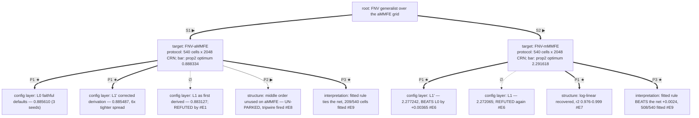

# fnv — escalation log

Campaign opened 2026-08-13 on the `FNV-aMMFE` branch (additive MMFE, 540-cell
design grid, generalist policy) and replicated on `FNV-mMMFE` — a **separate
board**, never compared. Both branches have run; the campaign closed
2026-08-14. Protocol throughout: 540 cells × 2048 CRN seeds, seed block
0…2047, identical for every arm; comparisons are paired per cell.

## MAP  (as of 2026-08-14, both branches run)

### Design tree



### Frontier

1. ~~A1 — read back the m-MMFE branch~~ **done** (#E6, #E7, #E8).
2. ~~A2 — score the fitted rule as a policy~~ **done** (#E9): it beats the net
   on m-MMFE, ties on a-MMFE.
3. **A3 — separate truncation bias from genuine over-response @ T1/C4** queued
   — the readback slope is 1.109 ± 0.122, systematically above 1, and the
   censoring kink is a known upward bias; cost ~30 min.
- **C4 un-parked 2026-08-14** — the tripwire ("any arm reaching P(order@2) >
  0.35") fired on m-MMFE: L1′ seed1 at 0.433, L0 seed3 at 0.399 (#E8). The
  collapse is specific to the additive branch, not a property of the learner.

### Off-tree register

- Bar calibration: two independent solvers agree on the optimum to 2.4e-05 in
  scored profit (`--cross-check`, §1.2). The bar is not in question.
- Protocol bookkeeping: 2048 seeds/cell, not the 8192 evidence grade — the
  spec's cheap-domain default, justified by T̄ = 3 and per-cell SE ≈ 0.004
  against gaps an order of magnitude larger.
- Next campaign root: none open; both branches have run.

### Current best bundle

The shipped deliverable is **the readback**, not the network: on m-MMFE the
distilled constants outscore the policy they came from (#E9). Best *learned*
arm, both branches:

| branch | L1′ | vs L0 | best single arm | % of bar |
|---|---|---|---|---|
| a-MMFE | 0.885487 | ties (t = −0.26), 6× tighter spread | 0.886428 | −0.21% |
| m-MMFE | **2.277242** | **beats, +0.003651 ± 0.000365** | 2.279888 | −0.51% |

L1′ is the ship-by-default configuration: it wins outright on m-MMFE and ties
with far better reproducibility on a-MMFE. The configuration layer is worth
≈ 0 on a-MMFE and ~+0.004 on m-MMFE.

## FRAME-CHANGELOG

```
2026-08-13  INTRODUCED  the config layer (L0 vs L1) is the first axis          (#E1)
2026-08-13  REFUTED     "the derived L1 config beats faithful defaults"        (#E1)
2026-08-13  NARROWED    L1's loss is under-training, not instability           (#E2)
2026-08-14  INTRODUCED  structural fidelity is a separate axis from profit     (#E5)
2026-08-14  PARKED      the middle-order gap — real, but invisible to scores   (#E4, #E5)
2026-08-14  CONFIRMED   L1 < L0 replicates on a second branch                   (#E6)
2026-08-14  NARROWED    L1' beats L0 outright on m-MMFE, not merely ties        (#E6)
2026-08-14  UN-PARKED   the middle-order collapse is aMMFE-specific, not general (#E8)
2026-08-14  INTRODUCED  fit COVERAGE is a structural diagnostic, not bookkeeping (#E9)
2026-08-14  CONFIRMED   the distilled rule is a shippable artifact on m-MMFE     (#E9)
```

## IR-CHANGELOG

### F1  2026-08-13 — the `order` decision bound was derived from one branch only

decision: `mdp.decisions[0].bounds`
initial: literal `[0, 3]`, rationale "additive MMFE with mu=1 and stdev≤0.3:
  mean demand ~1, so an upper bound of ~3 covers the useful action scale" —
  correct arithmetic, but reasoned entirely from the **additive** branch.
signal: gate-coverage audit while resolving the two open confirmables
  (`unconfirmed (2)` from `python -m mdp_ir`).
symptom: the IR also carries a multiplicative instance whose own action ceiling
  is `exp(mu + 5·stdev) = 7.39`, so the differential drew decisions from [0, 3]
  while the domain's reachable range ran to 7.39 — everything above 3 was
  unverified on that instance. The bound was simultaneously too loose on base
  (real ceiling 1.5) and too tight on `mmmfe`.
fix: bound names the scenario constant `order_max` = `mu + 5·stdev` (additive) /
  `exp(mu + 5·stdev)` (multiplicative), re-baked per instance — the same
  baked-derived-data pattern the IR already uses for `signal_stdevs`. Both
  confirmables resolved (`type` → human_confirmed, `bounds` → human_override).
  `gym.action_modes` names the same constant so model and encoding cannot drift.
rule: **when a bound is derived from a branch, check it against every instance
  the IR carries** — a per-instance bound is what the schema's constant-naming
  form exists for, and a literal silently under-covers the branches it was not
  reasoned from.

fingerprints: `mdp` `b992f2adead2` → **`40110193eba5`**,
structural `b1a471107c9d` → **`36f5c3aaf7a6`**. All four gates re-run green.
Carried downstream while the case's IR half lived upstream; landed here with
the solve-leg contribution, so the fork is closed.

## LEDGER

### #E1  2026-08-13 — the derived L1 config beats faithful defaults
address: T1 / config layer
runs: L1 — `PPO_20260813_181526_default`, `PPO_20260813_181525_seed2`,
  `PPO_20260813_181526_seed3`; L0 — `PPO_20260813_181526_lr0.0003_lrf0.0003_clipf0.2_nsteps2048_bs64_ent0_klNone_nenvs1_normrewFalse_normobsFalse`
  and its `_seed2` / `_seed3` siblings. 2M steps each, 20 checkpoints,
  screened then confirmed on the protocol block.

| level | config | mean | retrain spread | best seed | worst seed |
|---|---|---|---|---|---|
| L0 | faithful defaults | **0.885610** | 0.000822 | 0.886428 | 0.884784 |
| L1 | derived config | 0.883127 | 0.000636 | 0.883755 | 0.882483 |

verdict: best-vs-best paired **Δ(L1 − L0) = −0.002673 ± 0.000106**, ~25 SE;
  every L1 seed below every L0 seed, no overlap.   status: ✗
note: §8.6's diagnosis table maps this to "the derivation misfired" — a
  re-derivation, not an escalation.

### #E2  2026-08-13 — DIAGNOSIS: L1 under-trains, it does not destabilize
reads: #E1; SB3 telemetry from the six run logs.
observed:

| telemetry @ 2M steps | L0 | L1 | reads as |
|---|---|---|---|
| gradient updates | **312,320** | **78,080** | batch 64 vs 256 at equal rollout → 4× fewer |
| `approx_kl` mean / max | 0.0140 / 0.060 | **0.0015** / 0.008 | ~10× smaller step, against L1's own 0.02 valve |
| `target_kl` truncations | n/a | **none** | the valve is inert; not an instability story |
| screen winner | 75–90% of budget | 80–100%, **2 of 3 terminal** | still climbing at the ceiling |

  net effect ≈ **40× less total policy movement** at equal env-step budget.
missing: whether the LR row or the batch row dominates — not separated, both
  moved together in #E3.
plan: re-derive **within the spec's own stated ranges** — LR to the row's other
  branch (3e-4 → 3e-5), batch to the band floor (rollout/32 = 64). Arbiter:
  paired Δ vs L0 and vs L1. Pre-decided: if L1′ clears L1 the diagnosis holds;
  if not, `ent_coef` 0.005 vs L0's 0 is the next suspect.

### #E3  2026-08-13 — L1′: the corrected derivation recovers the loss
address: T1 / config layer
runs: `PPO_20260813_220047_lr0.0003_lrf3e-05_bs64`,
  `PPO_20260813_220046_seed2_lr0.0003_lrf3e-05_bs64`,
  `PPO_20260813_220047_seed3_lr0.0003_lrf3e-05_bs64`.
lever: LR 1e-4→1e-5 ⇒ **3e-4→3e-5** (the row's other branch); batch 256 ⇒ **64**
  (band floor). Both inside the spec's stated ranges — a re-application of the
  L1 rules, not a tuned escalation.

| level | mean | retrain spread | best | worst | paired Δ vs L0 |
|---|---|---|---|---|---|
| L0 | 0.885610 | 0.000822 | 0.886428 | 0.884784 | — |
| **L1′** | **0.885487** | **0.000138** | 0.885644 | **0.885388** | −0.000784 ± 0.000073 |
| L1 | 0.883127 | 0.000636 | 0.883755 | 0.882483 | −0.002673 ± 0.000106 |

verdict: **Δ(L1′ − L1) = +0.001889 ± 0.000087** — recovers **71%** of the gap,
  diagnosis confirmed. Against L0 the across-seed means **tie**
  (t = −0.26, n = 3 each) while L1′'s spread is **6× tighter** and its worst
  seed beats L0's worst.   status: ~
note: best-vs-best systematically favours the higher-variance arm (max of 3
  draws); §9.7's warning that retrain spread and eval SE are different
  uncertainties is exactly this trap. Reported both.

### #E4  2026-08-14 — the middle ordering opportunity is unused
address: T1 / C4
runs: all 9 confirmed checkpoints, via `fnv_plot_policy.py` / `fnv_policy_probe.py`.

| | P(order@2) | q₁ | total ordered | profit |
|---|---|---|---|---|
| optimum | **0.504** | 0.933 | 1.0043 | 0.9001 |
| trained, 9 models | **0.000 – 0.235** | 0.947 – 0.976 | 1.0041 | 0.895 – 0.899 |

verdict: the three-order policy collapses to effectively two — over-order at
  period 1, skip period 2, top up at period 3. **Quantity right, timing
  wrong.** Costs 0.1–0.6% of profit.   status: ✓

Does the cost grow when early information is worth more? Sweeping T:

| T | variance resolved by period 3 | P(order@2) optimum | net | profit gap |
|---|---|---|---|---|
| 0.1 | 0.10 | 0.321 | 0.000 | 0.11% |
| 0.5 | 0.50 | 0.507 | 0.014 | 0.16% |
| 0.9 | 0.90 | 0.574 | 0.223 | 0.12% |

note: the policy moves the right way (P(order@2) rises with T) but **the gap
  stays flat at ~0.1%** — refuting the prediction that a costlier middle order
  would expose the defect in the score. No leaderboard number distinguishes
  this policy from one that uses all three orders.

### #E5  2026-08-14 — the linear structure IS recovered at the final order
address: T1 / C4
runs: all 9 confirmed checkpoints; 36 fits = 9 models × 4 well-sampled cells,
  800–1500 episodes each. Full writeup in `INTERPRET.md`.
verdict: post-order inventory vs cumulative information at the final order —
  slope **1.109 ± 0.122** against a predicted **1**, **r² 0.966**, recovered
  `b̂₃` a mean **0.026** from the exact `b₃`.   status: ✓

| level | slope | r² | b̂₃ − b₃ | score verdict (#E1/#E3) |
|---|---|---|---|---|
| L0 | 1.030 – 1.075 | 0.974 – 0.995 | −0.018 – −0.001 | best |
| L1′ | 1.048 – 1.066 | 0.964 – 0.986 | −0.022 – −0.009 | ties L0 |
| L1 | **1.200 – 1.258** | **0.910 – 0.959** | −0.046 – −0.043 | **refuted** |

note: **structural fidelity tracks the config error.** L1 — refuted on score in
  #E1 — is also worst on structure. The same misfire shows in the leaderboard
  and in the readback, which is the first evidence here that the readback is
  not merely decorative.
  Two cells (`stdev=0.05`, `T=0.1`) excluded from the averages: the policy acts
  in only 9–47% of episodes there and only in the upper tail of I, so the slope
  is truncation-biased upward (1.38, 1.85).

### #E6  2026-08-14 — REPLICATION on m-MMFE: does L1 < L0 hold on a second branch?
address: T2 / config layer
runs: 9 runs `PPO_20260814_0021*` on `FNV-mMMFE` — L0 / L1 / L1′ × 3 seeds,
  2M steps, same protocol (540 cells × 2048 CRN, seed block 0…2047).

| level | mean | retrain spread | paired Δ vs L0 | aMMFE verdict (#E1/#E3) |
|---|---|---|---|---|
| **L1′** | **2.277242** | 0.002299 | **+0.003651 ± 0.000365** | tied L0 |
| L0 | 2.274743 | 0.001343 | — | best |
| L1 | 2.272065 | 0.002470 | **−0.001771 ± 0.000301** | refuted |

verdict: **both aMMFE findings replicate, and one strengthens.**
  Δ(L1 − L0) < 0 again → the L1 misfire is **confirmed on a second branch**
  (2 campaigns, none opposed). Δ(L1′ − L1) = +0.005421 ± 0.000262.
  And Δ(L1′ − L0) = **+0.003651 ± 0.000365 (~10 SE)** — where L1′ merely *tied*
  faithful defaults on aMMFE, here it **beats** them.   status: ✓
note: the corrected derivation is now the ship-by-default configuration on both
  branches: it wins outright on one and ties with 6× tighter spread on the
  other. The original L1's LR/batch rows are wrong on both.

### #E7  2026-08-14 — m-MMFE: the LOG-linear structure is recovered
address: T2 / structure
runs: best confirmed checkpoint `PPO_20260814_002108_seed3_lr0.0003_lrf3e-05_bs64`
  @ 1.7M steps; 6 cells × 1500 episodes. Figure:
  `figures/policy_structure_FNV-mMMFE.png`.

Proposition 2 on this branch is `S_n(I) = exp(mu + I + b_n)`, i.e.
**`log(x_{n-1}+q_n) = mu + I_n + b_n`** — slope 1 in *log* space.

| cell | period 2 slope | period 3 slope | r² |
|---|---|---|---|
| stdev=0.6, T=0.5 | **0.981** | **0.979** | 0.976 – 0.996 |
| stdev=0.4, T=0.9 | 1.163 | **0.999** | 0.978 – 0.991 |
| stdev=0.4, T=0.5 | 1.080 | 1.141 | 0.983 – 0.999 |
| stdev=0.4, lamb=0.02 | 1.343 | 1.073 | 0.980 – 0.996 |
| stdev=0.1, T=0.5 | 1.193 | 1.321 | 0.991 – 0.997 |
| stdev=0.4, T=0.1 | 1.201 | 1.346 | 0.985 – 0.988 |

verdict: **r² 0.976–0.999 in every cell and period** — the log-linear form
  holds wherever the policy acts. Slope approaches 1 as the cell carries more
  information (0.98 at stdev=0.6; 1.00 at period 3 with T=0.9) and drifts high
  in the information-poor cells, the same truncation pattern as #E5.  status: ✓
note: **period 2 is well sampled here** (408–566 acting episodes of 1500)
  where on aMMFE it was 21–335, so this branch tests the structure at the
  middle order that aMMFE could barely reach.

### #E8  2026-08-14 — TRIPWIRE FIRED: the middle-order gap is branch-specific
address: T1 / C4 (parked) → un-parked
reads: #E4 (aMMFE: P(order@2) 0.000–0.235 vs optimum 0.504), #E6, #E7.

| branch | optimum P(order@2) | trained models | gap |
|---|---|---|---|
| a-MMFE | 0.504 | 0.000 – 0.235 | large |
| m-MMFE | 0.474 | **0.168 – 0.433** | small |

verdict: C4 was parked with the tripwire "any arm reaching P(order@2) > 0.35".
  Two m-MMFE arms cross it — L1′ seed1 at **0.433** and L0 seed3 at **0.399**.
  **Tripwire fired; C4 is un-parked.**   status: ✓
note: this refutes the implicit reading of #E4 that the collapse is a general
  property of the domain. It is specific to the additive branch. Under
  `exp(mu+I)` the demand scale itself moves with the information, so a stale
  early commitment is punished multiplicatively — the middle order earns its
  place, and the policy finds it. What #E4 measured is the *flat additive
  landscape*, not a limitation of the learner.

### #E9  2026-08-14 — §14.2: score the fitted rule as a policy
address: T1 + T2 / interpretation
runs: `fnv_benchmark_fitted.py` distils each branch's best confirmed checkpoint
  into per-cell `b̂_1..b̂_N`; scored by `fnv_benchmark_dp_eval.py` on the same
  2048-seed CRN block as every other arm.

| branch | cells fitted | reference | fitted rule | raw net | Δ fitted − net |
|---|---|---|---|---|---|
| a-MMFE | **209 / 540** | 0.871613 | 0.869086 | 0.869212 | −0.000126 ± 0.000049 (−0.014%) |
| m-MMFE | **508 / 540** | 2.285018 | **2.275206** | 2.272780 | **+0.002426 ± 0.000746 (+0.106%)** |

verdict: **§14.2 branch 1 on both** — |fitted − net| ≤ 1% of the bar, so the
  net does implement the predicted structure. On m-MMFE the fitted rule
  **beats the network it was read from** (3.3 SE): three constants per cell
  outscore the policy they were distilled from, which is the shippable-artifact
  case §14.2 anticipates. On a-MMFE it ties (marginally below, 2.6 SE but
  −0.014% in absolute terms).   status: ✓
note: **the coverage split is the finding.** The full-horizon assertion dropped
  **331 of 540 aMMFE cells** — the policy never orders at period 2 there, so
  `b̂_2` is not identifiable and the rule cannot be completed at all. On m-MMFE
  only 32 cells fail. #E4's structural gap therefore has a hard downstream
  consequence: **a policy that abandons an ordering opportunity cannot be
  distilled into a rule over it**, no matter how well it scores. Without the
  assertion those 331 cells would have silently taken a defaulted offset and
  returned a plausible number.

### #E10  2026-08-14 — DIAGNOSIS: three probe designs, three different verdicts
reads: #E5, #E7; the readback's own measurement history, logged here because
  PLAYBOOK LV6 cites this detail and guide §10 lets a digest cite rather than
  copy only if the ledger actually holds it.
observed: the same policy, the same cell (`stdev=0.15,T=0.5,lamb=0.1`), four
  probe designs:

| design | result | why it was wrong |
|---|---|---|
| free inventory sweep at fixed I | slopes **1.24 / 0.94 / 0.87**, flatness 0.30–0.49 | mostly **off-manifold**: `I₁ ≡ 0` makes the period-1 action deterministic, so reachable inventory collapses to a single trajectory prefix — `x₂ = x₃ = 0.9501` exactly, not a distribution |
| reachable states only | period-2 slope **0.00** — "ignores information" | at its reachable `x₂` the policy orders **nothing**; `q = 0` is censored and certifies only `S₂ ≤ x`, identifying no slope. Conflated the order quantity `q` with the level `S` |
| affine plane `post = A + B·I + C·x` | B ≈ 0.96–1.16 but **R² only 0.82–0.85** | fits a plane through a surface with a censoring kink in it |
| realized trajectories, acting periods only, per cell | slope **1.109 ± 0.122**, r² **0.966** | on-distribution by construction; censoring excluded rather than modelled |

  `B + C = 1.003` at period 3 in the third design — the partial-adjustment
  signature — which is what first suggested the kink was structural rather than
  noise.
missing: how much of the residual slope excess above 1 is truncation bias from
  the kink vs genuine over-response — still open (Frontier A3).
plan: none; the fourth design is the one the figure and every quoted slope use.
