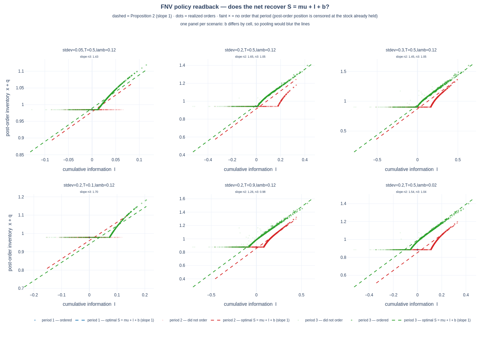
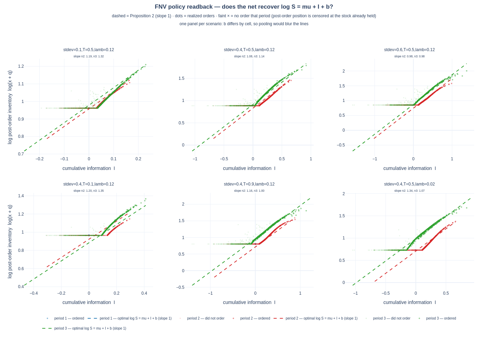

# Policy readback — does the learned policy recover the paper's linear structure?

Spec §14 anchored readback. **Both branches run**, 9 trained policies each
(L0 / L1 / L1′ × 3 seeds), each its best confirmed checkpoint.

**Short answer: yes.** The a-MMFE policies recover `S = mu + I + b` at the final
order (slope 1.109 ± 0.122 over 36 fits, r² 0.966); the m-MMFE policies recover
the log-linear form `log S = mu + I + b` (r² 0.976–0.999, slope → 0.98 in the
information-rich cells). The one structural failure — abandoning the middle
ordering opportunity — turns out to be **specific to the additive branch**.

Part 1 below is a-MMFE; part 2 is m-MMFE.

## Question

Wang, Atasu & Kurtuluş (2012), Proposition 2: the optimal policy is a
state-dependent base-stock whose level is **linear in the information state**,

```
x_{n-1} + q_n  =  S_n(I_n)  =  mu + I_n + b_n
```

so post-order inventory against cumulative information is a straight line of
**slope 1**, intercept `mu + b_n`, with the safety stock `b_n` independent of
the forecast evolution. Does a policy trained only on profit rediscover it?

## Answer

**Yes at the final ordering period, no at the middle one.**

Across 36 fits (9 models × 4 scenarios), the slope at the last order is
**1.109 ± 0.122** with **r² = 0.966**, and the recovered safety stock lands a
mean **0.026** from the exact `b_3`. Restricted to the six configurations that
trained properly, the slope is **1.03–1.08**.

But the policies use their *middle* ordering opportunity in 0–24% of episodes
against the optimum's ~50%, collapsing a three-order policy into effectively
two — while ordering the same total quantity.



```bash
python fnv_plot_policy.py --model-path <ckpt>     # figure + per-cell slopes
```

## Method

1500 episodes per scenario under the trained policy; record the realized
`(I_n, x_{n-1}+q_n)` pairs and regress. Two constraints the measurement must
respect:

- **Fit each scenario separately.** `b_n` differs cell to cell, so every cell's
  line has its own intercept. Pooling cells smears the intercepts and destroys
  the structure being tested.
- **Use only periods where the policy actually ordered.** `q_n = max(0, S_n − x)`
  is censored at zero: a period with no order fixes the post-order position at
  the stock already held, which certifies `S_n ≤ x` and identifies no slope.
  Only `S` is a policy; `q` is a path-dependent outcome.

Period 1 carries no slope — `I_1 ≡ 0` identically, since the first increment is
revealed only after the period-1 order.

## Slope at the final order

Per model, averaged over the four well-sampled scenarios:

| model | slope | r² | b̂₃ − b₃ |
|---|---|---|---|
| L0 seed1 | 1.057 | 0.974 | −0.018 |
| L0 seed2 | 1.030 | 0.995 | −0.014 |
| L0 seed3 | 1.075 | 0.977 | −0.001 |
| L1′ seed1 | 1.048 | 0.964 | −0.022 |
| L1′ seed2 | 1.049 | 0.986 | −0.009 |
| L1′ seed3 | 1.066 | 0.985 | −0.015 |
| L1 seed1 | 1.200 | 0.910 | −0.046 |
| L1 seed2 | 1.201 | 0.946 | −0.043 |
| L1 seed3 | 1.258 | 0.959 | −0.046 |

Per scenario, averaged over the nine models:

| scenario | slope | sd | r² | b̂₃ − b₃ |
|---|---|---|---|---|
| stdev=0.15, T=0.9, lamb=0.1 | 1.051 | 0.088 | 0.976 | −0.019 |
| stdev=0.30, T=0.5, lamb=0.1 | 1.081 | 0.070 | 0.970 | −0.017 |
| stdev=0.15, T=0.5, lamb=0.02 | 1.099 | 0.122 | 0.953 | −0.021 |
| stdev=0.15, T=0.5, lamb=0.1 | 1.206 | 0.148 | 0.966 | −0.037 |

**Structural fidelity tracks training quality.** L1 — the misapplied derivation
that lost to faithful defaults on profit — is also the worst on structure
(slope 1.20–1.26, lowest r²). L0 and the corrected L1′ agree on both, at
1.03–1.08. The same configuration error shows up in the readback and in the
score.

Two further scenarios (`stdev=0.05` and `T=0.1`) are excluded from these
averages: information is scarcest there, the policy orders in only 9–47% of
episodes and only in the upper tail of `I`, so a slope fitted over that
truncated range is biased upward (1.38 and 1.85). Visible in the figure as a
short steep segment just past the kink.

## What is not recovered: the middle order

The figure's flat plateau is the policy holding its period-1 stock without
ordering. Its kink — where ordering starts — sits **right of the optimum's**:
the net waits for a larger information surprise before acting.

| | P(order at period 2) | q₁ | total ordered |
|---|---|---|---|
| optimum | 0.504 | 0.933 | 1.0043 |
| trained (9 models) | 0.000 – 0.235 | 0.947 – 0.976 | 1.0041 |

The quantity is right; the timing is wrong. The policies buy slightly more at
the cheap early price and top up at the end, skipping the middle adjustment
that the optimum uses half the time.

## Why the score does not reveal this

Profit gap is 0.1–0.6% across all nine models. Ordering early is cheaper
(`c₁ = 1.00` vs `c₂ = 1.04`), and at `T = 0.5` only half the demand variance
resolves before the last order, so the option value of waiting is small.

Sweeping the information timing `T` (best model): P(order at period 2) rises
0.000 → 0.014 → 0.223 as `T` goes 0.1 → 0.5 → 0.9, so the policy does move the
right way as early information becomes more valuable. **The profit gap does not
widen — it stays flat at ~0.1%**, because the policy partially compensates
exactly where the stake rises. (This refutes the prediction that a costlier
middle order would expose the defect in the score.)

So a policy 0.2% from optimal still misses one of three ordering opportunities,
and no leaderboard number distinguishes it. That is the case for scoring the
readback separately from the policy.

## §14.2 — the fitted rule scored as a policy

The recovered constants are themselves a policy, so they are scored on the same
CRN block as every other arm (`fnv_benchmark_fitted.py` → `fnv_benchmark_dp_eval.py`).

| branch | cells fitted | reference | fitted rule | raw net | Δ fitted − net |
|---|---|---|---|---|---|
| a-MMFE | 209 / 540 | 0.871613 | 0.869086 | 0.869212 | −0.000126 ± 0.000049 (−0.014%) |
| m-MMFE | 508 / 540 | 2.285018 | **2.275206** | 2.272780 | **+0.002426 ± 0.000746 (+0.106%)** |

Means are over the *fitted* cells only, against the reference restricted to the
same cells — hence a different bar from the full-grid leaderboard.

**On m-MMFE the fitted rule beats the network it was read from** (3.3 SE): three
constants per cell outscore the policy they were distilled from, which is the
shippable-artifact case §14.2 anticipates. On a-MMFE it ties (marginally below,
2.6 SE, −0.014% in absolute terms). Both land in §14.2's **verdict branch 1** —
|fitted − net| ≤ 1% of the bar — so the net does implement the predicted
structure.

**Coverage is the sharper diagnostic.** The full-horizon assertion dropped
**331 of 540** a-MMFE cells: the policy never orders at period 2 there, so `b̂₂`
is unidentifiable and the rule cannot be completed. Only 32 cells fail on
m-MMFE. A policy that abandons an ordering opportunity **cannot be distilled
into a rule over it**, however well it scores — and that states the structural
gap more sharply than the profit gap does. Without the assertion those 331 cells
would have taken a defaulted offset and returned a plausible number.

## Limits

- The slope is systematically **above** 1 (1.109 ± 0.122, mean of 36 fits), not
  centered on it. Some of that is truncation bias from the censoring kink; how
  much is not yet separated.

---

# m-MMFE branch — the log-linear form

Separate board. Demand is `exp(mu + I)`, so Proposition 2 predicts a
**log**-linear relation:

```
log(x_{n-1} + q_n)  =  mu + I_n + b_n        slope 1 in log space
```

Fitting the raw level here would find a curve and report a meaningless slope;
`fnv_plot_policy.py` maps to the structural coordinate (`S` additive,
`log S` multiplicative) before fitting.



```bash
python fnv_plot_policy.py --model-path <ckpt> -s FNV-mMMFE
```

Best confirmed checkpoint (L1′ seed3 @ 1.7M, grid-mean 2.279888 against the
optimum's 2.291618):

| cell | period 2 slope | period 3 slope | r² |
|---|---|---|---|
| stdev=0.6, T=0.5 | **0.981** | **0.979** | 0.976 – 0.996 |
| stdev=0.4, T=0.9 | 1.163 | **0.999** | 0.978 – 0.991 |
| stdev=0.4, T=0.5 | 1.080 | 1.141 | 0.983 – 0.999 |
| stdev=0.4, lamb=0.02 | 1.343 | 1.073 | 0.980 – 0.996 |
| stdev=0.1, T=0.5 | 1.193 | 1.321 | 0.991 – 0.997 |
| stdev=0.4, T=0.1 | 1.201 | 1.346 | 0.985 – 0.988 |

**The log-linear form holds everywhere the policy acts** — r² 0.976–0.999 in
every cell and period. The slope approaches the predicted 1 as the cell carries
more information (0.98 at `stdev` 0.6; 1.00 at the final order with `T` 0.9)
and drifts high in the information-poor cells, the same truncation pattern as
the additive branch.

## The additive branch's structural gap does not generalize

| branch | optimum P(order@2) | trained models |
|---|---|---|
| a-MMFE | 0.504 | 0.000 – 0.235 |
| m-MMFE | 0.474 | **0.168 – 0.433** |

On a-MMFE the policies effectively abandoned the middle order. Here they use
it, and two arms (L1′ seed1 at 0.433, L0 seed3 at 0.399) come close to the
optimum's rate — which fired the tripwire that had parked that finding (#E8).

The reading: under `exp(mu + I)` the demand *scale* moves with the information,
so a stale early commitment is punished multiplicatively rather than additively.
The middle order earns its place and the learner finds it. What the additive
branch measured was a **flat profit landscape**, not an inability to learn the
timing — which is only visible because both branches were run.

Period 2 is also far better sampled here (408–566 acting episodes per 1500,
against 21–335 on a-MMFE), so this branch tests the structure at the middle
order that a-MMFE could barely reach at all.
