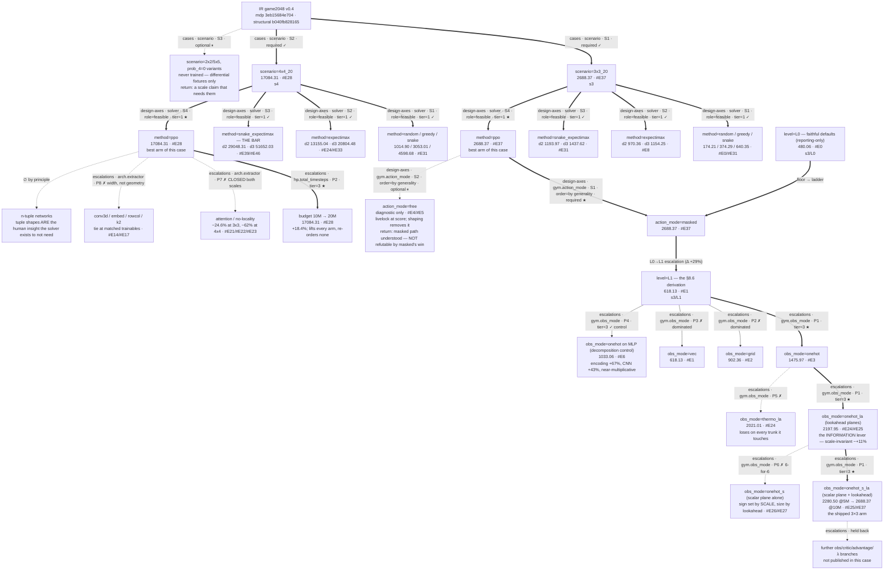

# game2048 — escalation log

Standard eval protocol for this campaign: **`3x3_20`, episode seeds 0..8191,
deterministic, scored on merge points** via `game2048_ppo_eval.py` /
`game2048_benchmark_*_eval.py` (one shared seed loop,
`game2048_benchmark_common.evaluate`). Numbers at any smaller seed count are
marked *provisional* and never crown a record (binding rule 3).

**Level accounting.** Run-directory names carry `L1` for every derived-config
run, but the level ladder for this campaign is:

| campaign level | run | what it is |
|---|---|---|
| **L0** vanilla | `L0_vec_MLP` | faithful defaults, flat board, MlpPolicy |
| **L1** backbone | `L1_vec_MLP` | the §8.6 derivation, representation unchanged — isolates the config layer |
| **L1′** natural | `L1_grid_CNN` | the forced move once the obs is recognized as spatial (§8.6 predicts an arch escalation for structured obs) |
| **L2(gym)** | `*_onehot_*` | a deliberate *encoding* choice, inherited from the pre-IR `2048/` folder |
| **L2(gym)** | `*_actfree_*` | the unmasked action interface, ± shaping |

The directory names understate this: `L1_onehot_CNN` is really L2(gym). Left
as-is rather than renamed, since the paths are cited by ledger entries below.

---


> **SCOPE OF THIS LEDGER.** The contributed subset of a longer campaign:
> **32 of 85** numbered entries — the domain build, the architecture
> pool, the encoding/lookahead axis and the search-reference bars. Entries on
> the afterstate-factored policy, the GAE-λ axis, the critic-architecture
> programme, the adversarial-spawn programme and the visitation channel are
> **held back as ongoing research**.
>
> Entries are reproduced **verbatim except where a `[scoped]` marker appears**,
> which is where a line referred to an unpublished arm. Nothing else was
> edited, so **some `#E` citations do not resolve**: they point either to a
> held-back entry, or — for `#E12` — to a number reserved during the campaign
> and never authored, a wart inherited from the source record rather than an
> artefact of this scoping. §CONFIG-REGISTRY is omitted for the same reason.
> Compute-venue names and scheduler job ids are replaced with generic labels.

## MAP  (as of the contributed subset — through #E49; typed to
ESCALATION_LOG_GUIDE §3.1's three-kind taxonomy)

The map's spine is one priority-ordered design tree. **Levels order by
conditioning strength, not expected gain** — a node sits above another when
changing it would invalidate the work below it. The biggest lever measured in
this campaign (observation information) sits mid-tree; HP sits at the bottom
because nothing conditions on it, not because it moves results least.

**Split kinds (guide §3.1).** Every edge carries `kind · {locus}.{axis} ·
rank · attributes · tier`:

| kind | when | rank | prunable? |
|---|---|---|---|
| `cases` | crown forks, own frame — scores incomparable | `S{n}` schedule | never; postponable, with a return condition |
| `design-axes` | crown forks, shared frame; **draws an IR declaration** | `S{n}` schedule | never |
| `escalations` | crown passes one child; shared frame; campaign-invented | `P{n}` priority | crown one, prune the rest |

Two consequences bind this campaign. **A score may be subtracted only within a
frame**, so `3x3_20` and `4x4_20` scores are reported side by side and never
subtracted — no crown crosses that boundary. And **the action-interface split
is `design-axes`, not `escalations`**: it draws `gym.action_modes` from the IR,
so crowning `masked` cannot make `free` redundant — its value is less
machinery, and that survives the win.

`method=*` siblings take **role** sense-free (`≽` = at least as good as, read
off `objective.sense = maximize`): `relaxed ≽ opt`, `exact = opt`,
`feasible ≼ opt`. **This campaign holds no `exact` and no `relaxed` node** —
tile values are unbounded, so the state space cannot be enumerated and there is
no DP. Every bar here is `feasible`, which means the optimum is **not
bracketed**: `snake-leaf expectimax d3` is the best policy anyone has built,
never a ceiling, and a learned arm passing it would be a new best rather than
an anomaly.

**Marks**: `✓` validated · `✗` closed · `⏸` parked (reason + tripwire) ·
`∅` structurally void · `▶` in flight · `★` crowned path. Marks ride on the
**edge**, where the selection happened.

**Campaign principle (2026-07-29, unchanged).** Escalation levers are
restricted to what a generic solver could derive from the IR — spatial
locality, axis-aligned action geometry, value-scale transforms readable off
the dynamics. Levers encoding domain-instance study are out of scope **by
design, not by evidence**. Named exclusion: n-tuple pattern sets. The
principle constrains solution levers only; references may use any knowledge.

**INSTRUMENT NOTE (read before comparing any two numbers here).** `@8192` is
the protocol (8192 deterministic CRN seeds). `cb` is a run's own best
200-episode callback eval at n=1 seed and runs **6.3–12.7% high**, unevenly —
it has moved a cross-arm margin from +18.3% to +27.0% and has *inverted* an
@8192 ordering once (#E22). **Never compare a `cb` number to an `@8192`
number.** Every decision-relevant number below is `@8192`.

**SCOPE NOTE.** This tree draws the nodes this case publishes. Branches the
campaign opened below `obs_mode=onehot_la` — and the critic, advantage, pool
and λ axes below them — are held back as ongoing research and are **not
drawn**; the `★` path therefore ends at the best arm *of this case*, which is
not the best arm the campaign measured. Both crowns are annotated accordingly.

### Design tree



### Layers and node readings   (kind · attributes · tier, reading, entry)

| node | kind · attributes · tier | reading | entry |
|---|---|---|---|
| `scenario=3x3_20` | cases · required · — | the strategy-class detector; own bar, own leaderboard. **Its summit is a statistical tie** — arms not published here finished within a 40-point spread of the shipped arm, inside the seed band | [#E37](#E37) |
| `scenario=4x4_20` | cases · required · — | the headline scale. Training-seed sd 442 ⇒ **any ordering under ~880 is inside single-draw noise** | [#E29](#E29) |
| `method=snake_expectimax` | design-axes · role=feasible · tier=1 | the bar, and it is `feasible` not `exact`: no DP exists here, so the optimum is **never bracketed**. Depth on a strategy leaf pays more than on a score leaf (+78% vs +58%) | [#E39](#E39) [#E46](#E46) |
| `method=ppo` (4×4) | design-axes · role=feasible · tier=1 ★ | 130% of expectimax d2, 82% of d3; **3.0× below** the snake-leaf bar — the strategy gap is the standing open result | [#E28](#E28) |
| `action_mode=free` | design-axes · optional · order=by generality | parked, **not refuted** — crowning `masked` cannot make it redundant; its value is less machinery | [#E4](#E4) [#E5](#E5) |
| `level=L0` | chain parent (§8.6 floor) | reporting-only, never crown-eligible; drawn as a chain parent rather than a sibling so it asserts no selection. Faithful defaults already beat greedy | [#E0](#E0) |
| `obs_mode=onehot` on MLP | escalations · tier=3 (control) | decomposes the win: encoding alone +67%, CNN +43% on top, near-multiplicative (1.67×1.46≈2.44 vs 2.39 observed) | [#E6](#E6) |
| `obs_mode=onehot_la` | escalations · tier=3 ★ | **information beat presentation** — the only axis with positive evidence at both scales, ~+11% and scale-invariant. First arm to clear the expectimax-d2 bar at 4×4 | [#E24](#E24) [#E25](#E25) |
| `obs_mode=onehot_s` | escalations · tier=3 ✗ | the scalar plane ALONE is decisively negative at 4×4; its sign is set by scale and its size by the lookahead interaction | [#E26](#E26) [#E27](#E27) |
| budget 10M→20M | escalations · tier=3 ★ | +18.4%; **lifts every arm and re-orders none**, so it is the honest baseline for any architecture claim and never a differentiator | [#E28](#E28) |
| extractor geometry | escalations · tier=3 ✗ | **width, not geometry**: a param-matched plain CNN ties the structured arm (12924.13 ±75.8 vs 12785.76 ±70.4, z +1.34). Two arms registered moot measured moot | [#E14](#E14) [#E17](#E17) |
| attention | escalations · tier=3 ✗ | locality is load-bearing, and **more so as the board grows** (−25% → −62%); the within-pool ordering inverted with scale | [#E21](#E21) [#E22](#E22) |
| n-tuple networks | escalations · ∅ | void **by principle, not by evidence** — the tuple shapes are exactly the human insight the pipeline exists to not need | — |

### Tier-2 stances (declared in the IR, spec §14.0)

Verdicts summarised in `README.md` §`2-structural`, evidence in `INTERPRET.md`.

| stance | structure | status |
|---|---|---|
| `discover` | the crowned policy's own decision pattern | **partly answered** — home corner + monotone ordering held to death. The *fitted rule scored as a §9 benchmark* is still owed |
| `confirm` | snake ordering | **no snake observed** — the chain metric saturates (policy 4.83 = reference 4.83), the two play differently at that value, and the 3.0× reference gap prices the difference the other way |

### Frontier (the execution plan, in priority order)

1. **A1 — `discover` stance: fit the pattern as a rule and score it** queued —
   the §14.2 obligation the stance carries. Until it lands, the tier-2
   `discover` verdict is a description, not a result.
2. **A2 — the §14.3 figure contract** queued — no `game2048_plot_policy.py`
   and no `figures/`; plotting is inline and its output gitignored.
3. **A3 — close the strategy gap** open — #E32's question ("which lever lets
   PPO find the structure a 2-ply search finds instantly") is the standing
   open result of this case, unanswered by any axis it publishes.
- parked: `action_mode=free` ⏸ — tripwire: the masked path is understood, or a
  generality claim needs it. Never refutable by masked's win.
- parked: the `2x2` / `5x5` / `prob_4=0` instances ⏸ — differential fixtures
  only; tripwire: a scale claim that needs them.

### Off-tree register   (budget-consuming, *not* solution-touching)

- **Bar calibration** — the snake-leaf d3 bar at 4×4 (#E46, full 8192 CRN) and
  d3 at 3×3. Benchmarks themselves are *on* the tree, on the solver layer;
  only the work of establishing and merging them is off-tree.
- **Protocol construction** — the shared 8192-seed CRN loop and the `cb`
  vs `@8192` instrument calibration (#E14 verdict 2, the withdrawn claim).
- **Seed-band measurement** — #E29 at 4×4 (sd 442). Not a solution; it
  re-scopes published orderings.

### Current best bundle

The `★` path, root → leaf, adopted as a **path** and not as components — and
**of this case**, not of the campaign:

- **3×3**: `s3` / `masked` / L1 / `onehot_s_la` / 5M→10M resume / λ=0.95 /
  seed 42 — **2688.37 @8192** (#E37). The 3×3 summit is a statistical tie:
  arms not published here finished within a 40-point spread, inside the
  ~65–85 seed band.
- **4×4**: `s4` / `masked` / L1 / `onehot_la` / 10M→20M resume / λ=0.95 /
  seed 42 — **17084.31 @8192** (#E28). 130% of expectimax d2, 82% of d3.

Pairing constraint on jointly-validated edges: the `score_penalty` shaping
exists only under the `free` interface, so adopting one commits to the other.

## FRAME-CHANGELOG

```
2026-07-29  INTRODUCED  campaign frame: 2048 replaces an earlier spatial/CNN candidate —
                        the disqualifying evidence there was that three representations all
                        plateaued together, so representation is the axis to test first
2026-07-29  REFUTED     "the pre-IR `sum` reward is the objective" — sum is conserved by a
                        slide, so its per-step delta telescopes to total spawned value and
                        measures survival, not play (F1)
2026-07-29  NARROWED    "PPO is competitive here" NARROWED to "PPO exceeds a depth-2
                        expectimax by 52%" — and the scope condition is d2: the claim is
                        untested against deeper search (#E3, open item 2)
2026-07-29  SPLIT       "the CNN helps" SPLIT into two levers with separate bounds:
                        2-D structure (+46%, #E2) and value one-hot (+64% on top, #E3)
2026-07-29  INTRODUCED  free-interface livelock as a named bucket: under `free`+`score` the
                        cost of a no-op arrives only through T_cap, so a stalling policy is
                        near-costless (#E4 ep_len 517/1000 vs #E5 70.4 with shaping)
2026-07-29  REFRAMED    map format: decomposition + grids → one priority-ordered design tree
                        (levels ordered by conditioning strength, siblings by priority; the
                        frontier read off in priority order IS the execution plan). Grids
                        demoted to on-demand slice views. Vocabulary gains REPARENTED /
                        REPRIORITIZED / SHATTERED for tree surgery. (user direction —
                        ESCALATION_LOG_GUIDE trial feedback)
2026-07-29  REPRIORITIZED  free-interface branch below the whole masked path: its diagnostic
                        content (livelock + shaping fix) is already collected at 350k steps;
                        return tripwire = masked path understood (#E4, #E5)
2026-07-29  REPRIORITIZED  execution: bar calibration (A3, expectimax d3) ahead of build
                        (A1 budget-5M, A2 arch control) — bound-before-build; #E4/#E5
                        killed at 448k/500k to free cores (user call)
                        [ids edited in place F→A during the 2026-07-29 rename — editorial]
2026-07-29  REPRIORITIZED  execution again: bar-before-build lifted — A1/A2 launched
                        concurrent with A3; free cores made the sequencing unnecessary
                        (user call)
2026-07-29  MEASURED    the crowned bundle's internal split (#E6, the controls-are-siblings
                        discipline paying off): onehot×MLP = 1033.06 — the ENCODING alone
                        is +67% over scalar×MLP and clears the d2 bar without any spatial
                        extractor; the CNN adds +43% on either encoding. Near-multiplicative
                        (1.67×1.46≈2.44 vs 2.39 observed): two independent levers. Refutes
                        the working assumption that the planes only pay through the CNN
2026-07-29  INTRODUCED  campaign principle: levers must be IR-derivable / problem-class
                        generic; domain-instance insight excluded by design. The n-tuple
                        direction is pruned BY PRINCIPLE, not evidence — its tuple
                        shapes are exactly the human understanding the solver exists to
                        not need; n-tuple SOTA demoted to off-tree context at the 4x4
                        node, never the bar. Corollary: attention/no-locality gains
                        standing (less injected structure than the CNN) (user call:
                        "we are not doing this to compete on 2048")
2026-07-29  INTRODUCED  edge typing S/P on the tree: S{n} coverage splits (AND — partition
                        the problem; postponable never prunable; per-child protocol/bar/
                        leaderboard; crown forks; collapsible by a generalist where the
                        axis permits) vs P{n} selection splits (OR — compare solutions;
                        crown one, prune the rest; shared leaderboard). Root split
                        3x3/4x4 retyped S1/S2; all levels below remain P. Inherits the
                        Phase-A mode stance: "independent branches" arrive as S,
                        "competing designs" as P (user direction)
2026-07-29  SPLIT       the obs level into value-transform → encoding: log2 surfaced as
                        its own crowned node above vec/grid/onehot — all three encodings
                        condition on it (onehot's planes are exponent-indexed), it
                        props up obs_norm=off and the policy's apply-once contract, and
                        it must not be taken for granted. Provenance is IMPORTED (pre-IR
                        2048 --log2 toggle + operator recollection, no surviving A/B);
                        `raw` pruned with that caveat and a re-validation tripwire
                        (user call — record-keeping)
2026-07-29  REPARENTED  target scale to the root: campaign root now splits 3x3_20 (P1 ★,
                        the whole current subtree) / 4x4_20 (P2, deliberately unexpanded —
                        no plan until Stage-0 re-entry). Was mis-filed in the off-tree
                        register; board size is the strongest-conditioning choice (obs
                        shape, mask width, T_cap, baselines all condition on it), so by
                        the tree's own ordering rule it is the first split (user call)
2026-07-29  MEASURED    the deeper bar (#E8): expectimax d3 = 1154.25 — depth pays a
                        decelerating +19% over d2, and the crown survives at 127.9%
                        (z≈31). "PPO exceeds a depth-2 expectimax by 52%" upgrades to
                        "exceeds depth-3 by 28%"; the remaining scope condition is d4+
                        (parked, ~10× cost). NARROWED alongside: #E6's "the encoding
                        alone clears the bar" is d2-only — onehot×MLP (1033) sits at
                        89.5% of d3, so past the d3 line the win needs the full bundle
2026-07-29  REFUTED     "entropy collapse means premature convergence" — the premise
                        behind #E7's arbiter (a). At 5M (#E9) entropy fell to 0.15-0.17,
                        far under the registered 0.3 threshold, while the eval curve
                        kept climbing significantly (+80.7 ± 26.9 pts/M, t=3.0) to a new
                        crown of 1662.65. Here the collapse marks convergence TOWARD a
                        good policy, not commitment to a bad one. Arbiter (a) did not
                        fire; ent_coef demoted in the HP pool and the HP tripwire
                        rewritten to require a genuine plateau. Pre-registration is what
                        made this refutable rather than retrofittable
2026-07-29  INTRODUCED  the budget lever's exchange rate as a first-class consideration
                        (#E9 economics): +12.7% per 2.5x compute, against the
                        representation levers' +67%/+43%. Direction unchanged (arbiter
                        (d) fired: still climbing), but "keep buying budget" is no longer
                        obviously the best hour spent — deliberately NOT resolved by
                        fiat here; A6 hands it to the next diagnosis (#E10)
2026-07-30  INTRODUCED  headroom as a named gap (#E10, user call): the crown is 44%
                        above the deepest bar, so every reference we have is a FLOOR
                        and "how much is left" was unanswerable. Off-tree reference
                        menu carved (structural cap ~16.4k, 3x3_0 soft ceiling,
                        2x2 exact DP, improvement probe, hindsight bound — each with
                        cost + tripwire); A7 launched on the cheapest informative one:
                        the value-certain sibling world at the crown's own bundle
2026-07-30  MEASURED    (engine, not performance) prob_4=0 ≅ prob_4=1 under an exact
                        doubling isomorphism — verified path-by-path over 200 seeds,
                        promoted to metamorphic domain test 38. Consequences: _0 and
                        _100 are ONE reference, not two; the log2 lever's mechanical
                        content confirmed (all-4s = all-2s shifted one exponent plane);
                        a scale-bug class now caught that the differential structurally
                        cannot see (both twins would share it)
2026-07-30  INTRODUCED  interpretation as a campaign activity (#E11, A8 — the north
                        star's third pillar, previously unserved by the pipeline).
                        Generic instruments only; PPO's CRITIC is the instrument.
                        The crown learned a HOME CORNER, localized by an occlusion
                        probe that knows nothing about 2048 (bottom-left cell = 309
                        pts of V vs ~35 typical); ~80% of the value function is
                        re-expressible in named board features (R^2=0.795) — the
                        DP-analysis analog the north star asks for
2026-07-30  NARROWED    #E6's "one-hot pays +64%" NARROWED in KIND, not size: the
                        grid policy already holds the corner 95% of steps, so the
                        encoding lever did not buy the STRATEGY — it bought
                        execution within it. Structure discovers the squeeze,
                        encoding exploits it (#E11 structure metrics)
2026-07-30  REFUTED     "regret measured on a single CRN branch is decision quality"
                        — one different move reshuffles every later spawn, and with
                        episode sigma ~800 the branch measures luck. Re-salting the
                        FUTURE (past frozen) halves it: 307.5 -> 127.6 pts, and the
                        critic's measured ranking skill rises 0.295 -> 0.385. The
                        naive number was never quoted outside this file (#E11)
2026-07-30  INTERRUPTED A7's 5M `3x3_0` run died at 3.07M steps (16:50) when the
                        launching Claude Code session was torn down — the run was a
                        plain foreground child of a tool shell, so it shared that
                        shell's process group. Not a code fault. Campaign rule added:
                        every multi-hour run is launched detached (`setsid nohup`, or
                        the harness's background mode) and its PPID checked = 1.
                        `best_model.zip`/`evaluations.npz` survive a kill, so a
                        CRN-selected checkpoint is always salvageable; SB3 offers no
                        mid-training resume, so a truncated budget is re-run from zero
                        or abandoned on the merits (#E10 status)
2026-07-30  MEASURED    (provisional, 200-ep callback evals) the `_0` soft ceiling is
                        ~3.5x the crown at 61% of its budget — arbiter (b) fires. The
                        mechanism is episode LENGTH (439 vs 132 moves), not the
                        ~80-100 accounting discount #E10 pre-registered: at 3x3, a 20%
                        4-spawn rate cuts the survivable horizon 3.3x. Expectimax d2
                        is blind to this axis (940 on `_0` vs 970 on `_20`), which is
                        why no existing bar exposed it. Verdict (#E12) awaits the
                        8192-seed eval of the surviving checkpoint (#E10 status)
2026-07-30  VERIFIED    the solver pin moved v0.5.9 -> v0.5.11 at 16:50 (CLAUDE.md still
                        says v0.5.9 — stale, and it is a main-branch file). CLAUDE.md's
                        upgrade rule requires re-running the domain gates before trusting
                        any number produced after the bump; done, all five green:
                        IR validate OK · laws 7/9 (2 structural SKIPs) · conformance 14/16
                        (2 structural SKIPs) · differential MATCH bit-exact on all 8
                        compositions (66,148 periods) · pytest 38/38. Decisive detail:
                        the IR fingerprint still reads 55db0f9c05bd / structural
                        b040fb828165 — byte-identical to the Phase-A freeze recorded in
                        commit 58531f3 — so v0.5.11's `eval_metrics` addition is
                        fingerprint-invariant IN FACT, not merely by design claim, and
                        the freeze survives the upgrade. Every campaign number stands.
2026-07-30  AUDITED     the A8 pilot against the interpretation spec that did not exist
                        when it ran: v0.5.11 adds §14 + Stage 5, v0.5.9 had neither. The
                        pilot is a parallel invention of the same stage — conforming on
                        artifact loading, divergent on the actor-side sensitivity sweep,
                        the action surface, the scored fitted rule, the figure contract,
                        and naming. Full table at the end of INTERPRET.md; retrofit ⏸
                        PARKED (no hard gate at Stage 5), tripwires = promotion to
                        `examples/` or the distillation conversation. Two things the
                        audit paid for anyway: the 2x2 DP gains a second un-park reason
                        (§14.1 "validate where the answer is known"), and the pilot's
                        `eval_metrics` recommendation turns out to have landed upstream
                        already (v0.5.11 `5d98ee9`)
2026-07-30  INTRODUCED  D4 symmetry as engine fact + the A9 ladder (user idea): the
                        dynamics are dihedral-symmetric — certified as domain test 39,
                        the doubling law's sibling (slide conjugation bit-exact, spawn
                        equal-in-law via the rank coupling); `d4_transforms` added to
                        the builtins module as a pure helper. The trigger is
                        IR-readable, so an equivariance lever passes the campaign
                        principle; rungs 0-2 ran same-day as diagnosis-before-build
2026-07-30  CONFIRMED   A9's pre-registered prediction: the frame-averaged crown
                        scores 510.43 @8192 (-69%) — the corner commitment is
                        LOAD-BEARING, not a defect to symmetrize away. The probes
                        priced the commitment (544 pts of realized return per wrong
                        orientation) and found the critic 2/3-aware of it, entirely
                        via the un-named 20% of #E11's regression. Equinet-by-training
                        survives as an A6 candidate on sample-sharing grounds only
                        (#E13)
2026-07-30  INTRODUCED  rung 3c, the user's construction: per-step dihedral frame
                        randomization in the train env (gym-layer, test-39-licensed,
                        test-40-certified null wrapper) — the wrapped optimum IS the
                        best equivariant policy; launched at 2M with both predictions
                        and tail/mechanism arbiters pre-registered (#E13 addendum2).
                        Queue-jump past A6 by user call, precedent 2026-07-29
2026-07-31  CONFORMED   results/ to spec §8.4 (audit prompted by the user): launcher
                        console moved beside the runs it describes, benchmark console
                        into `{scenario}/benchmark/benchmark_{name}.log`, TB-server and
                        watcher-marker files out of results/ entirely, and launcher
                        redirects repointed to /tmp so they stop duplicating
                        `{run_dir}/train.log`. No run dir renamed, nothing deleted.
                        Note the spec organizes results INDEPENDENTLY of the campaign —
                        there is no "results laid out by escalation plan" rule; the
                        ledger reaches results by citing paths (§8 "the ledger cites
                        paths"), which is why entries carry `runs:`
2026-07-31  REPRIORITIZED (user call) the presentation next Wednesday becomes the
                        campaign clock, and its subject is the METHOD — the lever
                        taxonomy, each lever's IR-readable trigger, and measured
                        impact — not the best score. Consequence: A6's arbitrated
                        single-next-spend is dissolved and its three candidates run
                        IN PARALLEL on separate venues (budget: the 10M legs already
                        running; 4×4: A10; HP: A12 via the fired tripwire), plus a
                        lever-matrix pool (A11) that trades depth for coverage.
                        Weekend plan + venue map: PRESENTATION_PLAN.md. the cluster budget
                        cap lifted (user); GPU authorized as contingency only
2026-07-31  MEASURED    the crown 10M leg LANDED (13:55, run dir mppo_20260731_091135
                        _*_resumed): selection-seed final 1909.08 ± 897.69, best
                        callback eval 1999 @7.83M. Last-third eval slope −18 ± 26
                        pts/M (t=−0.7) — flat AT the annealed floor, so the run
                        passes the convergence precondition and its @8192 eval is
                        legal (running). The slope decayed FASTER than the lr
                        (first→middle third: lr −25%, slope −50%), so this reads as
                        a genuine plateau, not only the floor — the HP-pool tripwire
                        ("a genuine plateau", parked since #E9) FIRES → A12
2026-07-31  DECLINED    two fired tripwires, both by user call, recorded per the
                        prune-visibly discipline: (1) the 2×2 exact DP (fired via
                        #E10 arbiter (b), second un-park reason from the §14 audit)
                        — "2x2 is meaningless"; stays declined unless a certified-
                        optimality-gap claim is ever needed. (2) the `_0` 10M leg —
                        #E12 will be written as an explicit LOWER-BOUND-AT-5M; the
                        only upgrade taken is the @8192 eval of the existing 5M
                        checkpoint (running), which makes the bound protocol-grade
                        without new training
2026-07-31  INTRODUCED  budget/stopping machinery in the train script (user concern:
                        caps kept truncating still-climbing runs): --anneal-steps
                        decouples the lr/clip anneal from total_timesteps (anneal to
                        floor, then HOLD), so total becomes a pure cap and
                        "converged" keeps meaning flat-at-the-floor under early
                        stopping; --patience-evals = SB3 no-improvement stop, for
                        OPEN-ENDED legs only (matched-budget A/B arms never
                        early-stop — stopping inside a comparison corrupts it);
                        --lr-floor-frac / --clip-floor-frac promote the pool's
                        rank-3 LR-floor lever to a first-class flag;
                        --resume-fresh-schedule swaps in a probe treatment on
                        resume (mechanism note: the override must target the saved
                        DATA keys learning_rate/clip_range — _setup_model rebuilds
                        lr_schedule after load, silently undoing an lr_schedule
                        override; caught in the smoke, fixed). benchmark_common
                        gains --seed-start chunking (.part{start} outputs; the
                        protocol row is rebuilt from the per-seed sidecars)
2026-07-31  EXPANDED    S2 — the 4×4_20 node opens at Stage 0 (A10). Cluster
                        onboarding same day: game2048 + the v0.5.11 harness rsync'd
                        to the cluster and the cluster, 40/40 domain tests green on both; the cluster
                        runs 4×4 at 527 fps (vs ~300 local). Landed: random
                        1014.90 ± 5.60, greedy 3053.01 ± 17.65 @8192. In flight:
                        expectimax d2 bar (the cluster 16×512 array 976078[], 4-seed
                        probe ≈ 17k — the bar will be REAL at this scale), L0
                        ruler + L1 mainline 2 seeds (cap 40M / anneal 20M /
                        patience 80) on the cluster job [id], local hedge seed 44
2026-08-01  LANDED      the whole A10 4×4 Stage-0 fleet, overnight, all exit 0;
                        nothing left running on any venue as of 10:25. L0 ruler
                        2390.14 (the cluster 1281426, full 2M); expectimax d2 bar
                        13155.04 ± 60.86 over all 8192 seeds (the cluster 1281438,
                        16 chunks merged, 39 min — the 4-seed probe's ≈17k was
                        optimistic by ~28%); L1 mainline s42 best callback
                        11508.26 @10.95M, hedge s44 10404.06 @9.375M. Both
                        mainline seeds were STOPPED BY THE PATIENCE RULE (81
                        evals with no new best) at 12.975M and 11.4M of the 40M
                        cap — the §2b machinery introduced the day before did
                        its job on first use, the Sunday kill/extend gate is
                        moot, and ~27h of projected the cluster wall came back unspent.
                        Two inversions vs 3×3: the crown lands BELOW its own d2
                        bar (87.5%, where 3×3 was 201% of d2), and the L0 ruler
                        lands BELOW greedy (0.78×, where at 3×3 it beat greedy).
                        Search scales with the board; fixed-capacity CNN does not
2026-08-01  BLOCKERS    three overnight failures, all silent, all resolved: B1
                        the cluster array died pre-redirect on `set -eu` + ebenv's
                        unbound PS1 (fix: env before `set -eu`, plus an import
                        guard) — but the cluster serial then released only 1 of 16
                        subjobs, so the bar moved to the cluster; B2 `--level L0`
                        was broken for EVERY instance by `:g`-formatting a
                        None-valued target_kl in _run_name (fix: skip None);
                        B3 seeds 42/43 collided in one run dir (fix: seed added
                        to _run_name; s43 killed, and s42's 02:16 checkpoint
                        rewrite has since made the artifact unambiguous).
                        LESSON: none was found by the run — launches need a
                        landed-check, not a submit-check
2026-08-01  IMPLEMENTED the A11 extractor arms (user: "implement W4a and
                        W4b"): --extractor {small,embed,conv3d,rowcol} +
                        --embed-dim in the train script; embed = bias-free
                        1x1 conv == embedding table (exact-lookup gated);
                        conv3d = Conv3d sharing weights along the exponent
                        axis under the test-38 licence, empties broadcast as
                        a constant-along-axis channel so the shift licence
                        stays exact (equivariance gated exactly, interior);
                        rowcol = full-row/full-col kernel branches, one conv
                        each. Executable gate game2048_extractor_gate.py;
                        extractor/channels/kernel now visible in run names
2026-08-01  FIXED       (caught by the gate's trainable counts, pre-launch)
                        even kernels inflated the conv map each layer —
                        padding k//2 is 'same' only for odd k — so the k2
                        "kernel-geometry" arm was silently a 2.25x capacity
                        arm (214k vs 95k). Even k now gets asymmetric
                        same-padding; the odd-k (crown) path is
                        byte-identical; k2 = 83,424 trainables. The flag was
                        never exercised before, so no prior run is affected
2026-08-01  MEASURED    A11 pool LANDED ~14:00, all 6 arms full 5M (#E14).
                        Both MOOT predictions HELD (rowcol -0.2%, k2 +1.5%)
                        — the entries that make this a measurement rather
                        than a search. conv3d +11.5% on FEWER trainables
                        than control (the doubling-law licence paying).
                        And the honest miss: capacity, the only no-trigger
                        arm and the lowest prior in the pool, WON at +20.7%
                        — the crown's extractor was undersized at 3x3 all
                        along. Recorded as a hit against the method's
                        completeness, not smoothed over
2026-08-02  MEASURED    A11 4x4 A/B LANDED ~03:15 (15h38, exit 0; #E14).
                        conv3d 13651.50 (+18.3%) is the FIRST policy in this
                        campaign to clear its own bar — 103.8% of expectimax
                        d2 (13155.04) at 10M, beating the 40M-capped
                        mainline's 11508.26. It partly undoes yesterday's
                        "search scales with the board, a fixed CNN does not":
                        the RIGHT weight sharing does scale. Meanwhile the
                        pre-registered vocab child INVERTED — embed was
                        predicted parity-at-3x3 / live-at-4x4 and measured
                        +6.1% then -23.3%, the cleanest falsification on the
                        board. NOT verdict-grade: every row is a 200-ep
                        callback eval at n=1; @8192 protocol evals + seed
                        replication are open, and "Current best bundle" is
                        deliberately NOT updated on callback evidence
2026-08-02  MEASURED    rung 0: @8192 protocol evals of the five
                        decision-relevant #E14 arms (local; cross-version
                        determinism vs the the cluster training stack verified
                        bit-identical on 256 seeds first, SB3 2.6.0 vs
                        2.9.0). EVERY cb ORDERING SURVIVED. 3x3: capacity
                        2040.58 > conv3d 1871.68 > control 1712.36; 4x4:
                        conv3d 12785.76 > control 10069.07
2026-08-02  CROWNED     3x3 passes to capacity (SmallBoardCnn 64/128
                        fdim256) at 2040.58 @8192 — it beats the 10M
                        incumbent 1948.20 by +4.7% (z=6.3) on HALF the
                        budget. Consequence worth stating plainly: the 10M
                        budget leg (#E9 arbiter (d)) bought LESS than
                        widening the extractor would have, so the campaign
                        spent 2x compute on the wrong axis. That is the
                        completeness miss of #E14 verdict 4, now priced
2026-08-02  WITHDRAWN   the claim "conv3d is the first policy to clear its
                        own bar at 4x4 (103.8% of d2)", asserted in the
                        2026-08-02 MEASURED line above and in #E14. It
                        compared conv3d's CALLBACK score to the bar's @8192
                        score. On the protocol conv3d reaches 12785.76 =
                        97.2% of the 13155.04 bar, short by z=-3.97 — a
                        clear shortfall, not a near-tie. NO POLICY HAS
                        CLEARED THE 4x4 BAR. What survives: conv3d moves
                        4x4 from 76.5% to 97.2% of the bar. Root cause: a
                        cb->@8192 calibration (~2.5%) extrapolated from ONE
                        pair; measured across five arms the gap is 6.3-12.7%
                        and varies BY ARM, so it moves cross-arm margins
                        too. Rule adopted: never compare cb to @8192
2026-08-03  MEASURED    rungs 2+3 LANDED 2026-08-02 evening (the cluster 1282842,
                        exit 0, 2h25, both arms full 5M; #E14 status (d)).
                        RUNG 2 — conv3d x capacity 2209.38 cb vs 2D-capacity
                        2214.92 = PARITY (-0.25%). The pre-registered
                        "~=2D wide" branch fired, so the 2x2 factorial
                        {2D,3D}x{small,wide} closes SUB-ADDITIVE: conv3d is
                        worth +210.78 at narrow width and -5.54 at wide.
                        The two #E14 winners are SUBSTITUTES, not
                        complements — conv3d bought a cheap route to width,
                        not new structure. RUNG 3 — net_arch [256,256]
                        1751.44 cb vs control 1834.60 = -4.5%: the HEAD is
                        not starved, so the capacity finding does NOT
                        generalize to "every width is undersized". Both are
                        cb, n=1; @8192 outstanding
2026-08-03  INTERRUPTED rung 1 (the cluster 1282841) was REQUEUED by PBS at 02:58
                        after attempt 1 ran 2026-08-02 15:14 -> 08-03 02:45
                        and reached 9.625M of 10M. The job restarted from
                        zero on CN-016; ~11.5h of wall-clock lost. NO
                        information lost: attempt 2 reproduces attempt 1
                        BIT-IDENTICALLY through 5.475M (both best 10405.04),
                        so the run is deterministic across nodes and
                        attempt 1's curve previews attempt 2's. Attempt 1's
                        artifacts survive under the 20260802_151445 dir and
                        are NOT deleted. Distinct failure mode from the
                        2026-07-30 session-teardown kill: that one was ours
                        (a non-detached child), this one is the scheduler's,
                        and no launch hygiene prevents it — the mitigation
                        is that the run is deterministic and re-derivable
2026-08-03  PREVIEW     rung 1 preview from the interrupted attempt: 13224.70
                        cb @9.025M = -3.1% vs conv3d cb (13651.50), +14.6%
                        vs control cb (11538.26). Plain width reproduces
                        ~80% of conv3d's 4x4 cb margin, i.e. the
                        pre-registered "~=conv3d => the 4x4 win was WIDTH,
                        not geometry" branch is the one firing — the SAME
                        direction rung 2 found independently at 3x3.
                        Recorded as a PREVIEW, not a verdict: the budget is
                        incomplete, it is cb at n=1, and #E14's own lesson
                        is that cb margins move under @8192 (that same 4x4
                        margin GREW +18.3 -> +27.0). The 4x4 bundle's
                        PROVISIONAL hold therefore tightens rather than
                        lifting
2026-08-03  FIXED       game2048_interpret.py carried a 3x3-only constant:
                        `counterfactual` divided regret by a literal 16.63
                        (= the 3x3 crown's 1662.65/100), so "regret as
                        share of an episode" was silently wrong for ANY
                        other board size or policy. Now measured from the
                        sampled rollouts, denominator printed. Also
                        board-size generality: TILE_COLORS extended to k=15
                        (every tile >=2048 rendered as the same dark
                        fallback, making exactly the 4x4 endgame illegible)
                        and replay GIFs strided via --max-frames (a
                        1659-move episode is not a frame-per-move GIF; the
                        .txt keeps every step). 3x3 output verified
                        BYTE-IDENTICAL after the change
2026-08-06  LAUNCHED    ATT 4x4 leg (the cluster 1290061, 8c, 48h walltime,
                        started 18:23 on CN-153) — user call, asked for
                        directly after the #E21 read-out. 2 arms x 10M,
                        seed 42, L1 full-span anneal, no patience; same
                        treatment as the 3x3 pool, one budget doubling.
                        ARMS = attn-abs (the 3x3 winner) + attn-axis
                        (carried REGARDLESS of its 3x3 rank — bottom-tied
                        there; ATTN_PLAN's own rule that pruning it on 3x3
                        evidence would repeat the KG mistake the tree
                        documents as scale-dependent). attn-rel is dropped:
                        it has no scale-dependent argument of its own and
                        tied axis at 3x3.
                        CONTROL = the PM4-resolved 4x4 crown, 2D-wide
                        SmallBoardCnn (64,96), 12924.13 @8192 (#E17), NOT
                        re-run — also a the cluster run, so again no torch skew.
                        TRAINABLE-MATCHED within 0.60%: 261,662 (abs) /
                        260,420 (axis) vs the control's 261,984 (dials d78
                        L2 H3 ffn2 — depth and FFN mult held EQUAL to the
                        3x3 pool on purpose, only d_model and head count
                        adapt, so a scale-dependent result is not also an
                        architecture change). Gate re-run GREEN on the cluster's
                        stack pre-training, both scales x 3 arms.
                        PREDICTION UNDER TEST: (3) above, entered at the
                        3x3 launch and untouched since — the informative
                        cell is attn-axis at 4x4, NO SIGN PREDICTED. The
                        3x3 read-out adds a second, weaker expectation
                        recorded here before the fact: if #E21's reading is
                        right (what separated the arms was absolute
                        position being IN the trunk, not the relational
                        scheme), abs beats axis again at 4x4 and the whole
                        leg lands below 12924.13. A win for axis here
                        refutes that reading and fires ATTN_PLAN's
                        "attn-axis wins at 4x4 only" branch — which then
                        owes an arbitration against the cheaper
                        rowcol-at-4x4 arm before anything is crowned.
                        Walltime 48h not 24h: the CNN control alone took
                        ~12h22 at 10M on this box and attention is not
                        cheaper per step. n=1 seed, as everywhere.
2026-08-08  LAUNCHED    S pool (the cluster 1295417, 8c, 48h) — onehot+scalar,
                        the augment-not-substitute repair of the thermo
                        cells (user proposal; ENCLOOK_PLAN.md S addendum).
                        Mechanism correction recorded there first:
                        thermometer is an INVERTIBLE LINEAR map of onehot
                        (cumsum along the value axis), so the registered
                        "ordering becomes linearly readable" mechanism
                        was hollow — only CONDITIONING could differ, and
                        it cut against us (identity features pushed into
                        small correlated difference-directions; magnitude
                        dominates; norm_obs=False). onehot_s: 17 onehot
                        planes UNTOUCHED + one scalar plane log2(v)/16.
                        ARMS: S (crown (64,96), 262,560, +0.22%) vs the
                        control 12924.13; axial-S (axial (72,71), 261,988,
                        +0.00%) vs axial's @8192 (pending at launch).
                        10M, seed 42, L1, no patience; gate re-run green
                        on the venue stack; committed 2505827 pre-launch.
                        PRE-REGISTERED, verbatim from the addendum:
                        (1) S - control small positive or null; decisively
                        negative would mean the magnitude direction itself
                        hurts. (2) axial-S does NOT close axial's -31%-
                        vs-rowcol4 gap — the binder is the missing LOCAL
                        path (the R3 diagnosis), not the encoding; if
                        axial-S >= rowcol4, R2 wins and the R3 local-mix
                        diagnosis loses its standing.
2026-08-08  LAUNCHED    SA arm (the cluster 1295423, 8c, 48h, single arm) —
                        onehot_s_la, completing {control, S, A, SA} as a
                        2x2 over {onehot, onehot_s} x {raw, +afterstates}
                        (user call; the TA precedent makes a declared
                        factorial cell legitimate pre-build). The scalar
                        plane rides in all five blocks, so cross-block
                        magnitude comparison is one channel's difference.
                        obs (90,4,4), dials (39,96) = 262,157 (+0.07%).
                        10M, seed 42, L1, no patience; gate green on the
                        venue stack pre-training.
                        PRE-REGISTERED, verbatim from the addendum: SA - A
                        SMALL, either sign — A's trunk already extracts
                        what it needs from pure onehot blocks; SURPRISE
                        branch = SA decisively > A, meaning cross-block
                        magnitude comparison was a real bottleneck even
                        for the winner.
2026-08-08  LAUNCHED    EXT20 (the cluster 1295782; a first 3-arm submission
                        1295781 was qdel'd ~1 min in to add rowcol4 on
                        user call, its 3 stale dirs removed) — A, TA,
                        CONTROL and rowcol4 resumed from their 10M finals
                        toward 20M via --resume-from (anneal re-stretched
                        as if launched at 20M; splice steps LR back to
                        the 20M schedule's midpoint — NOT bit-equal to a
                        fresh 20M run, recorded as such). Trigger: the TB
                        read (user) — slopes over 8-10M: A +580/M, TA
                        +1020/M and ACCELERATING, rowcol4 +420/M, control
                        +261/M and flattening. The AXIAL PAIR deliberately
                        left out: flat-to-declining and 30%+ down.
                        THE 10M POOL VERDICT (#E24) IS RECORDED SEPARATELY
                        AND STANDS — this leg answers the saturation /
                        crossover question, not the matched-budget one.
                        PRE-REGISTERED: (1) A-20M cb > 15789 (A was not
                        saturated); (2) TA still <= A at 20M — the fast
                        late slope is mostly distance-from-ceiling;
                        SURPRISE branch: TA overtakes A, which would mean
                        thermometer's conditioning cost fades with data
                        and the thermo verdict needs a rethink; (3) the
                        control gains little (floor slope +261/M; #E20's
                        doubling precedent bought +2.3%); (4) rowcol4
                        stays below the control at 20M.
2026-08-08  LAUNCHED    LA-3x3, the lookahead pool's SECOND SCALE, on the
                        LOCAL box (4 arms x 5M in parallel, ~4.5 h; user
                        call "the local cores are idle"). Arms: control
                        onehot, A3 onehot_la, SA3 onehot_s_la, TA3
                        thermo_la — seed 42, L1, masked, score,
                        SmallBoardCnn(64,128)/fdim256, the 3x3 arch pool's
                        own trunk and budget so the numbers join that
                        leaderboard. Obs verified at 3x3 pre-launch
                        (50/55/50 planes, all in [0,1]).
                        WHY A LOCAL CONTROL RIDES: every recent run,
                        including the 3x3 control at 2040.58, trained on
                        the cluster stack (sb3 2.9.0); local is sb3 2.6.0
                        / torch 2.7.0. A pool's arms and its control stay
                        on ONE stack, so the control is retrained here —
                        free in wall-clock, and it measures the venue term
                        the campaign has never measured.
                        PRE-REGISTERED (no-prune: all four run out and all
                        four get @8192 whatever the curves do — #E22 is
                        why): (1) A3 > C3, replicating the lever, but by a
                        SMALLER relative margin than 4x4's +11.6%, in
                        +0..+8% — 3x3 is already 177% of its deepest bar
                        and d2->d3 buys only +19% there, so a search-like
                        lever should buy less where search buys little;
                        falsifier A3 <= C3 beyond the ~130-pt band =>
                        lookahead is 4x4-specific and #E24 narrows to one
                        scale; (2) ordering A3 > SA3 > TA3, a forward bet
                        on the still-running 4x4 SA arm; (3) TA3 < C3 —
                        thermometer's damage exceeds lookahead's gain here
                        too; (4) |C3_local - 2040.58| <= 130, the two
                        stacks agreeing inside the measured 3x3 seed band;
                        a bigger gap means every cross-venue number in
                        this ledger carries an unrecorded stack term.
2026-08-08  LAUNCHED    SEEDBAND (job [id], 8c, 48h) — #E24 carry (iii)
                        finally instrumented: TWO siblings of the crown,
                        seeds 43 and 44, byte-identical to the seed-42
                        record except --seed (onehot_la, ch40x96,
                        fdim128, 10M). Two and not one because n=2 cannot
                        give an sd; three points is the minimum from which
                        a band can be quoted. 10M and NOT 20M: the
                        instrument must match the number it tests, and
                        14429.61 is a 10M best_model — EXT20 keeps its own
                        seed-42 lineage. Runs on the stack its twin ran
                        on; a local sibling would move seed and venue
                        together and measure neither.
                        PRE-REGISTERED: (1) all three seeds clear the d2
                        bar 13155.04 — falsifier: any sibling below it
                        makes the crown seed-dependent and #E24 needs
                        amendment, not a footnote; (2) sd across
                        {42,43,44} <= 4% of the mean (~580 pts), the 3x3
                        band scaling proportionally. Both directions are
                        informative: tighter retires the campaign's
                        standing n=1 caveat, wider retro-taints every 4x4
                        ordering below ~1000 pts, #E22's included.
2026-08-09  LAUNCHED    ENT pool (user call after the entropy discussion:
                        "good to try then") — the first entropy arm in
                        the campaign. Lever: --ent-anneal (commit
                        a824270; EntAnnealCallback sets model.ent_coef =
                        schedule(progress) per rollout — SB3 has no
                        built-in ent schedule) and --ent_coef 0. Basis =
                        {onehot, onehot_s_la} per #E25's verdict (the
                        plain reference and the new 3x3 crown); the
                        EXISTING C3 and SA3 runs are the ent=0.005-const
                        controls — same stack, seed, trunk, budget, so
                        only 4 new arms run: {C3,SA3-basis} x {anneal
                        0.005->0, const 0}, 5M, seed 42, ch64x128/fd256,
                        LOCAL. Mechanism at stake: entropy bonus =
                        exploration pressure early but OBJECTIVE BIAS
                        late (the optimal policy is deterministic), and
                        2048's fragility makes stochastic training
                        under-sample the deep states the deployed argmax
                        policy lives in (rollout 10.5k vs @8192 14.4k at
                        4x4). Contra-evidence on record: #E9 (entropy
                        self-collapses to 0.15 at 3x3 while improving).
                        PRE-REGISTERED:
                        (1) anneal >= const-0.005 on BOTH bases (prior
                        ~60/40), margin +0..+4%; falsifier: anneal <
                        const beyond the band => the late entropy floor
                        is load-bearing regularization here, retire the
                        idea and spend nothing at 4x4.
                        (2) const-0 lands within noise of anneal on each
                        basis — #E9 says the EARLY bonus buys little at
                        3x3; falsifier: const-0 clearly below anneal =>
                        early exploration pressure is real and the
                        anneal shape (not just the endpoint) matters.
                        (3) INTERACTION: anneal's paired gain is larger
                        on onehot_s_la than on onehot — lookahead-
                        informed policies face more RESOLVABLE near-ties,
                        so late entropy costs them more. This is the
                        cell that speaks to 4x4's 0.65-nat late-game
                        entropy (near-ties vs ent_coef propping).
                        (4) MECHANISM check, non-scoring: the
                        rollout-vs-@8192 gap shrinks for annealed arms
                        vs their own controls (train/deploy distribution
                        gap closes as entropy -> 0).
2026-08-09  LAUNCHED    EXT10-3x3 (user call after the TB read: "expand
                        their run to 10M") — all FOUR #E25 arms resumed
                        from their 5M finals toward 10M via --resume-from
                        (anneal re-stretched as if launched at 10M; not
                        bit-equal to fresh 10M, recorded as such — the
                        EXT20 convention). Control rides so every 10M
                        comparison stays matched-budget. THE 5M POOL
                        VERDICT (#E25) IS RECORDED SEPARATELY AND STANDS.
                        Trigger slopes (cb, 4-5M): C3 +171/M · A3 +57/M ·
                        SA3 +168/M · TA3 +125/M (TA3 ACCELERATING from
                        +25/M — the same late-thermo pattern EXT20 is
                        testing at 4x4). Local, 4 resumes in parallel.
                        PRE-REGISTERED: (1) SA3 still the 3x3 crown at
                        10M @8192; (2) A3 > TA3 at 10M — TA3's late
                        acceleration is distance-from-ceiling catch-up,
                        not a crossover (the EXT20 P2 bet restated at
                        3x3; a crossover here would predict one there);
                        (3) all four gain >= +100 @8192 over their 5M
                        selves — 5M was genuinely short for this pool;
                        falsifier: any arm flat => its 5M number was
                        already converged and the slope was cb noise.
2026-08-09  LAUNCHED    ENT0-RESUME (user idea: "extend the training with
                        0 ent" instead of/alongside the anneal) — two
                        legs resumed from the SAME 5M parents the EXT10
                        arms continue, via --resume-fresh-schedule
                        --ent_coef 0: C3-parent and SA3-parent, total
                        10M, local. With default lr/clip args the
                        fresh-rebuilt schedule is IDENTICAL in shape to
                        the EXT10 splice convention, so each ent0 leg
                        differs from its running EXT10 sibling in
                        EXACTLY the post-5M entropy coefficient — a
                        paired-at-the-branch-point design: shared 5M
                        prefix (same weights, optimizer, reward-norm
                        stats), early-phase variance killed entirely.
                        The EXT10 arms ARE the 0.005-continuation
                        controls; the from-scratch ENT pool (running)
                        becomes the whole-run-shape cross-check. A12
                        precedent for the mechanism (freshsched ent
                        probe, 2026-07-31).
                        PRE-REGISTERED: (1) ent0-continue >= 0.005-
                        continue at 10M @8192 on BOTH bases, margin
                        +0..+4%; falsifier: ent0 below beyond the band
                        => late-phase entropy is load-bearing at 3x3 and
                        the late-phase claim dies cheaply. (2) mechanism,
                        non-scoring: the ent0 legs' policy entropy falls
                        clearly below their EXT10 siblings' by 10M.
                        (3) interaction echo: the ent0 effect is larger
                        on the SA3 basis than on C3 (the ENT pool's
                        interaction bet, restated for the late phase).
2026-08-09  LAUNCHED    S3 — the missing cell of the #E27 2x2 (user ok):
                        onehot (no lookahead) + the scalar plane at 3x3,
                        5M, seed 42, ch64x128/fd256, LOCAL. Its control
                        is the EXISTING C3 (#E25, 1982.16) — same stack,
                        seed, trunk, budget — so one run completes the
                        factorial {scalar} x {lookahead} x {scale}.
                        PRE-REGISTERED, quantitative (the point of
                        running it): relative scalar effects measured so
                        far are 4x4 no-LA -13.0%, 4x4 with-LA -5.8%
                        (interaction +7.2pp), 3x3 with-LA +3.8%. If the
                        lookahead interaction is roughly scale-stable,
                        3x3 no-LA = 3.8 - 7.2 = -3.4% => S3 - C3 ~ -67,
                        registered band [-150, 0]. FALSIFIER: S3 >= C3
                        kills the scale-sets-the-sign reading outright —
                        the plane would be harmless at 3x3 in BOTH
                        columns and the whole effect becomes interaction
                        + a 4x4-only conditioning penalty. S3 - C3 below
                        -150 means the interaction is scale-dependent
                        too, and the 2x2 stops being separable.
2026-08-11  LAUNCHED    SNAKE-LEAF EXPECTIMAX d3 4x4 (user call: "launch
                        snake D3 first" after the #E39 GIF review; #E39
                        carry (ii)) — prices the DEPTH axis of the
                        heuristic. Timed before sizing: d3 = 578.9
                        ms/move on the first 120 moves vs d2's 40.4
                        (same-prefix ratio 14.3x); full-episode estimate
                        ~290 ms/move by d2's measured early/full ratio.
                        ~1100 core-hours at 8192 seeds => TWO 32-core
                        jobs, 32 chunks x 128 seeds each: A=1299739
                        (seeds 0-4095), B=(4096-8191; SPLIT after three
                        holds — see the venue note below), 24h
                        walltime, timeout-900 preludes, the 1299000
                        template otherwise unchanged. The two free
                        slots under the 6-job cap.
                        PRE-REGISTERED, before any number:
                        (1) snake-d3 > snake-d2 (29048.31) — but the
                        depth increment SHRINKS on the strategy leaf:
                        land in [33k, 43k], i.e. +14..+48%, UNDER the
                        score-leaf's +58% d2->d3 step. Mechanism: the
                        formation prior already buys much of what
                        lookahead buys; depth and prior are partial
                        substitutes.
                        (2) the snake/score ratio FALLS with depth:
                        snake-d3/score-d3 < 2.208 (= snake-d2/score-d2)
                        — same substitution claim, stated as the rider.
                        Falsifier: ratio holds or grows => the prior and
                        depth are complements, and deeper snake search
                        is the cheapest route to 50k+.
                        (3) reach_8192 in (0.5%, 8%] (d2: 0.06%);
                        SURPRISE branch: any 16384 tile (never seen by
                        any player) fires a mechanics note.
                        (4) episode length grows: mean moves > 1500
                        (d2: 1395.3); the F2 T_cap (job [id]) stays
                        untouched by >4 orders of magnitude.
2026-08-11  LAUNCHED    SNAKE-LEAF EXPECTIMAX d3 3x3 (user call: "also
                        run snake d3 on 3x3", with the GIF-review
                        observation that the player builds snakes but is
                        blind to spawn-ambush risk — the v3/#E31 safety-
                        obligation finding, seen independently from the
                        replays). Timed: 20.4 ms/move at d3 (d2: 2.7)
                        => ~7 core-hours; LOCAL, 8 chunks x 1024, the
                        3x3 d2-bar convention. Chunk-0 unsuffixed-name
                        trap noted at launch: rename before merge.
                        PRE-REGISTERED, before any number:
                        (1) snake-d3 > snake-d2 (1193.97) with the
                        increment AT OR UNDER the score-leaf's +19%
                        3x3 depth step: land in [1250, 1420]
                        (substitution claim, same as the 4x4 P1).
                        (2) rider: snake-d3/score-d3 < 1.230
                        (= snake-d2/score-d2) — the snake premium
                        falls with depth at 3x3 too.
                        (3) snake-d3 STAYS far below the learned
                        plateau (A90 3012.54 / S80 3144.80) — the 3x3
                        scoping of #E39 survives depth 3; falsifier
                        would reopen the 3x3 snake question.
                        (4) reach_512 in (0.5%, 5%] (d2: 0.0027);
                        SURPRISE branch: any 1024 tile — the 3x3
                        theoretical max, never produced by any player.
2026-08-11  ADDENDUM    SNAKE-LEAF d3, the 3x3 HALF (merged 8x1024):
                        1437.62 ± 8.22 @8192, moves 116.5.
                        Registrations scored:
                        (1) REFUTED BY A HAIR, in the interesting
                        direction: +243.65 over snake-d2 = +20.4%,
                        ABOVE the score-leaf's +18.95% depth step and
                        17.6 points above the registered band's top
                        (1420). Depth pays slightly MORE on the snake
                        leaf, not less.
                        (2) REFUTED, same direction: snake/score ratio
                        RISES with depth, 1.230 (d2) -> 1.246 (d3).
                        At 3x3 the formation prior and search depth are
                        marginal COMPLEMENTS, not substitutes. Mild but
                        consistent support for the user's GIF-review
                        diagnosis: the extra ply's main value is spawn-
                        ambush visibility, which the snake leaf needs
                        MORE than the score leaf (its failure mode is
                        formation collapse by ambush, #E31/#E39 worst-
                        episode reads).
                        (3) CONFIRMED strongly: 1437.62 = 47.7% of the
                        A90 record — the #E39 3x3 scoping (learned play
                        dominates at 3x3) survives depth 3 untouched.
                        (4) CONFIRMED: reach_512 = 0.0082, in-band; no
                        1024 (the surprise branch stays unfired; 67 of
                        8192 episodes end at 512).
                        Consequence for the 4x4 leg in flight
                        (job [id]): its P1 band [33k, 43k] was
                        built on the SUBSTITUTION claim this half just
                        refuted — if complementarity holds at 4x4, the
                        landing is at or ABOVE the band's top. Noted
                        BEFORE the 4x4 number exists.
2026-08-10  ADDENDUM    SNAKE-LEAF d2, the 3x3 HALF (merged from the
                        8x1024 local chunks after the chunk-0 repair):
                        1193.97 ± 7.26 @8192, moves 101.8.
                        Registrations scored: (1) CONFIRMED — beats
                        score-d2 paired +223.60 ± 8.68 (z +25.8): the
                        strategy adds a fifth on top of equal depth;
                        (2) CONFIRMED on the stated 75% side — 1193.97
                        is 60% of the learned band's floor (1982):
                        snake+2-ply eyes still loses decisively to
                        learned corner play at 3x3, and the snake
                        question is now SCOPED to 4x4; (3) CONFIRMED —
                        reach_512 = 0.0027, the first nonzero 512 rate
                        by any non-learned player (22 episodes of
                        8192); (5) ratio rider: snake-d2/score-d2 =
                        1.230 at 3x3, awaiting the 4x4 leg (job [id])
                        for the cross-scale comparison and the combined
                        verdict entry.
2026-08-10  LAUNCHED    SNAKE-LEAF EXPECTIMAX d2 (user call: "run snake
                        expectimax") — #E31 carry (i), the suite's last
                        open question: does the strategy fail at 3x3 or
                        merely fail BLIND? Same MAX/CHANCE recursion as
                        the reference expectimax rows, leaf = the v1
                        snake potential (orientation-maxed 4^rank dot;
                        ONE geometry implementation, self-checked equal
                        to SnakePolicy.phi). In-tree gained kept for
                        structural identity but dwarfed by Phi — the
                        objective IS the strategy; score arrives because
                        value-space merges move mass up-path. 3x3 single
                        process; 4x4 as 8 local chunks x 1024 (the d2-bar
                        chunk convention), merged.
                        PRE-REGISTERED, before any number:
                        (1) 3x3: snake-d2 > score-d2 (970.36) — the
                        strategy adds value ON TOP of equal depth;
                        falsifier: the W prior actively misleads search.
                        (2) 3x3: snake-d2 STAYS BELOW the learned band
                        (< 1982; stated prior ~75%) — the negative that
                        scopes the snake question. SURPRISE branch: above
                        2331 revives "the learned policies leave strategy
                        on the table" in full.
                        (3) 3x3: reach_512 in (0, 0.05] — the first
                        nonzero 512 rate by any non-learned player at
                        this scale (score-d2, score-d3, and every myopic
                        snake: all 0.0000).
                        (4) 4x4: snake-d2 > score-d2's 13155.04, weakly
                        held (55/45); and < A@20M's 17084.31, strongly.
                        (5) the ratio rider once more: snake-d2/score-d2
                        larger at 3x3 than at 4x4 (space competition).
2026-08-09  LAUNCHED    D3 BAR at 4x4 (job [id], 32c, 48h) — the
                        missing UPPER ANCHOR, #E24 carry (i), user call
                        after the timing probe. 32 chunks x 256 seeds
                        over 0..8191 (the protocol block, so the bar is
                        CRN-paired with every policy eval), merged the
                        same way the d2 bar's 16x512 were.
                        COST, MEASURED not guessed: a 32-seed probe took
                        6296 s => 196.7 s/episode => 448 CORE-HOURS for
                        8192 seeds, ~86x the d2 bar (39 min on 8 cores)
                        and far past the ~12x the 3x3 d2->d3 step
                        suggested — because d3 also SURVIVES longer
                        (1022 moves/episode vs d2's ~700), so cost
                        compounds with depth. Sized at 32 cores x 14 h
                        => ~14 h wall, 3.4x walltime headroom for the
                        long tail (semivar_u 4.3e7).
                        PRE-REGISTERED: the probe read 19759.13 on 32
                        seeds, but the d2 precedent had a 4-seed probe
                        at ~17k against a true 13155.04 — 28% optimistic,
                        short samples missing late-game collapses. A 28%
                        haircut puts d3 near 14.2k: ROUGHLY LEVEL WITH
                        THE CROWN (A 14429.61 @10M) and plausibly BELOW
                        A-at-20M (cb 18030). So the registered
                        expectation is that d3 IS NOT AN UPPER ANCHOR
                        EITHER, and the finding is that this domain's
                        search ladder tops out by depth 3 — worth 448
                        core-hours to state with a real number rather
                        than an extrapolation. FALSIFIER (the good
                        outcome): d3 >= 16k, in which case the campaign
                        regains a reference it has not had since #E24
                        and A-at-20M gets something to clear.

## IR-CHANGELOG

### F2  2026-08-10 — T_cap recalibrated to a derivable rule: the caps sat BELOW the theoretical limit at 3x3 and amputated 94% of 4x4_0
```
decision:  instance sizing T_cap (all 8 instances)
initial:   1000 (3x3s) / 4000 (4x4s) / 8000 (5x5s) / 200 (2x2s) —
           hand-set round numbers.
problem:   surfaced by the theoretical-ceiling discussion (user): masked
           play is bounded by (max terminal board sum)/2 <= 2^(n_cells+1)
           moves, because every move spawns +2/+4 and slides conserve the
           sum. Against that bound the old caps were WRONG two ways:
           3x3's 1000 sat BELOW the 1023-move natural bound (clipping the
           theoretical perfect game, ~88 pts of ceiling); and 4x4_0's
           4000 amputated ~94% of the 2-only world, whose natural perfect
           game runs ~65.5k moves — fatal for the _0 mechanism probes.
new value: T_cap = max(200, 2^(n_cells+2)) — 2x2 200 · 3x3 2048 ·
           4x4 262144 · 5x5 134217728. Always >= 2x the masked natural
           bound (headroom for the FREE action mode's no-op stalling,
           which is the cap's real job), derivable from the IR.
retro-safety: NO recorded episode has ever truncated at any scale
           (3x3 max 429 < 1000; 4x4 max 2597 < 4000), so every past
           trajectory, eval, and @8192 record is bit-identical under the
           new caps. The redefinition is behaviorally invisible to the
           entire ledger.
gates:     mdp_ir valid; structural_fingerprint UNCHANGED b040fb828165
           (T_cap is sizing, not structure); conformance 14/16 (the 2
           are standing SKIPs: samplers, grids registry); differential
           MATCH bit-exact on all 8 instances; 40/40 domain tests.
```

### F1  2026-07-29 — the objective measured survival, not play
```
decision:  mdp.objective.per_step_components (what the episode return means)
initial:   the pre-IR domain's `sum` reward = the per-step increase in total
           board value. It looks like the natural "how much did I build"
           signal, it is dense, and it is trivially available from the state.
signal:    human-veto (Phase-A step 1, objective round)
symptom:   a slide CONSERVES board sum (two 2s become one 4), so the per-step
           delta is exactly the value of the tile that just spawned; summed
           over an episode it telescopes to total spawned value. A policy that
           merely survives scores identically to one that consolidates.
fix:       objective = the game's own merge score — a merge producing v pays
           v — carried as info `gained`, with `sum_conserved` transcribed into
           mdp.invariants so the conservation fact is asserted, not assumed
rule:      if an objective is stated as the per-step CHANGE in some quantity,
           check what the dynamics do to that quantity before accepting it: if
           any transition conserves it, the delta measures only the exogenous
           inflow and the objective is a disguised survival counter. Cheap
           probe: sum the per-step deltas over one episode and see whether the
           total is a function of the agent's choices at all.
```

### F2  2026-07-29 — stochastic initial state cannot live in `initial_state`
```
decision:  where the opening tile is drawn
initial:   `mdp.initial_state` is the obvious home for "the board starts with
           one random tile" — it is literally the initial state, and the field
           accepts exprs over constants.
signal:    gate:mdp_ir (interpreter `_initial_state` evaluates exprs against
           constants only; no draw machinery is reachable there)
symptom:   no way to express the draw; the naive fallback (empty board, let
           period 0 spawn) then leaves the first decision taken on an empty
           board, where `valid_actions` reports NO legal slide
fix:       the opening spawn is a guarded first-period event (`I`, guard
           `period == 0`), and the domain's `advance` guards it on
           `spawn_count == 0` instead — equivalent on the differential path,
           but it lets a caller materialize it early (`open_episode`) so the
           gym's reset shows the board the first move lands on
rule:      if the initial state is STOCHASTIC, it cannot be formalized in
           `initial_state` — model it as a first-period guarded event. Then
           check the decision-timing consequence: guard the domain-side event
           on the draw counter rather than the period, or every consumer that
           needs to observe/plan before the first action sees a pre-init state.
```

### F3  2026-07-29 — a no-op invariant must exempt the initialization period
```
decision:  mdp.invariants scope
initial:   "an illegal action leaves the state exactly as it was — no spawn,
           no score" — a direct transcription of the game rule, asserted on
           every row.
signal:    differential (invariant violations on 7 of 20 seeds, all at t=0,
           while the trajectory itself was MATCHing bit-exactly)
symptom:   period 0 also carries the opening spawn (F2), which fires whether
           or not the first slide turns out to be legal, so board sum and
           `spawned` both change on an illegal first move
fix:       split into `illegal_move_scores_nothing` (all rows) and
           `illegal_move_spawns_nothing` (guarded `t == 0 or ...`)
rule:      if the dynamics carry an initialization event guarded on the first
           period, every invariant of the form "a no-op action changes
           nothing" must exempt that period — the init event is not the
           action's doing. Note this is a class of defect the differential
           structurally CANNOT catch: both twins share the model, so only a
           claim taken from the problem statement can falsify it.
```

### F4  2026-07-29 — symbolic bounds cannot track instance overrides
```
decision:  state_variables.board.element_bounds
initial:   `[0, "2 ** n_cells"]` — the exact ceiling (the largest tile an n×n
           board can hold), written symbolically so it tracks each instance's
           board size, exactly as MDP_IR_SAMPLE models bounds ("20 * demand.mean")
signal:    upstream-change (harness limitation, mdp_ir.layering._resolve_bounds)
symptom:   resolved to 512 (the BASE 3×3 value) for EVERY instance — 2x2_20
           and 5x5_20 alike, whose correct ceilings are 16 and 33,554,432. The
           deferral guard is an exact string match, so a bare constant name is
           deferred but any ARITHMETIC on it is evaluated eagerly against base
           constants. The bare form is unusable here besides:
           `element_bounds` is typed `list[float]` and rejects the deferred
           string with a ValidationError.
fix:       a literal `[0, 131072]`, with the reasoning recorded in
           assumptions_log. Harmless here — these bounds are metadata, the gym
           sizes its own spaces from grid_size — but the same code path serves
           Decision.bounds / ActionMode.bounds, where it silently freezes the
           base instance's ACTION SPACE into every instance.
rule:      if a bounds entry must vary per instance, it must be a BARE scenario
           constant name — any expression over such a constant is silently
           frozen at the base value. Cheap probe: load the IR at two instances
           that differ in that constant and compare the resolved bound.
           Upstream fix proposed (raise on eager evaluation of an
           instance-overridden constant); revisit this entry when it lands.
```

---

## LEDGER


<a id="E0"></a>
### #E0  2026-07-29 — L0 faithful defaults establish the ruler
```
address:   (control) / representation×level, [L0, MlpPolicy]
hypothesis: the library's defaults plus only what the problem forces give the
           baseline that Δ(L1−L0) is measured against; reporting only, never a gate
runs:      game2048_ppo_train.py -s 3x3_20 -o vec --level L0
           game2048_ppo_eval.py -o vec --n-seeds 8192
verdict:   480.06 ± 3.14 @ standard protocol; max tile 65.1, reach-64 0.686.
           The ruler: Δ(L1−L0) = 618.13 − 480.06 = +138 (+28.8%) with
           representation and policy class held fixed — the config layer's
           isolated worth. Notably L0 already beats greedy (374.29, z≈27):
           faithful defaults alone clear the myopic baseline here.
status:    ✓
```

<a id="E1"></a>
### #E1  2026-07-29 — the §8.6 derivation is worth ~30% with representation held fixed
```
address:   budget/HP bucket (config layer) / representation×level, [L1, vec, MlpPolicy]
hypothesis: applying the L1 derivation table alone — same flat observation,
           same policy class — is separable from any representation change
runs:      game2048_ppo_train.py -s 3x3_20 -o vec --level L1
           game2048_ppo_eval.py  -o vec --n-seeds 8192
verdict:   618.13 ± 3.83 @ standard protocol. vs greedy 374.29 (+65%); vs
           expectimax d2 970.36 (64% of reference). Provisional Δ vs L0
           rollout (~411) pending #E0's honest eval.
           Eval curve PLATEAUED from ~1M (600 → 591 → 587 → 615).
status:    ✓
```

<a id="E2"></a>
### #E2  2026-07-29 — giving the network the board's 2-D structure pays +46%
```
address:   representation / 2-D structure / representation×level, [L1′, grid, CNN]
hypothesis: the obs is spatial and the MLP has to rediscover adjacency; a
           stride-1 no-pooling CNN over (1,n,n) should recover that for free
           (§8.6 predicts exactly this arch escalation for structured obs)
runs:      game2048_ppo_train.py -s 3x3_20 -o grid --level L1
           game2048_ppo_eval.py  -o grid --n-seeds 8192
verdict:   902.36 ± 5.68 @ standard protocol. +46.0% over #E1 (618.13), same
           level, same budget, same seeds. 93% of expectimax d2.
           Eval curve STILL CLIMBING at ceiling (peak 962 @ 1.825M).
gate:      gym layer (obs mode) — obs is within the filtered view: `board` is
           fully observable, no latent exists in this domain, so no leak is
           possible by construction.
status:    ✓
```

<a id="E3"></a>
### #E3  2026-07-29 — one-hot tile planes pay a further +64%; passes the gate and the bar
```
address:   representation / value encoding / representation×level, [L2(gym), onehot, CNN]
hypothesis: log2 tile values force the net to learn that tiles are
           exponentially spaced AND that only equal tiles interact; binary
           planes per tile value make both structural rather than learned
runs:      game2048_ppo_train.py -s 3x3_20 -o onehot --level L1
           game2048_ppo_eval.py  -o onehot --n-seeds 8192
           python -m mdp_gates --candidate ... --n-seeds 8192
verdict:   1475.97 ± 8.78 @ standard protocol.
           +63.6% over #E2 (902.36); +138.8% over #E1 (618.13).
           GATE PASS: vs random z=147.27, vs greedy z=121.68.
           vs expectimax d2: +505.61 → 152.1% of reference.
           117.6 moves (vs ref 90.3), max tile 169.1 (vs ref 113.4).
           Selection bias mild: selection peak 1524 → honest 8192 = 1476 (−3%).
           Eval curve STILL CLIMBING at ceiling (peak 1524 @ 1.975M of 2M).
gate:      gym layer (obs mode) — same argument as #E2.
status:    ✓
```

<a id="E6"></a>
### #E6  2026-07-29 — the arch control: encoding and extractor are independent levers
```
address:   3x3_20 → masked → log2 → onehot → arch:MLP  (agenda A2)
hypothesis: is the crowned branch's +64% the one-hot encoding or the CNN
           exploiting it? Control: same obs, same L1 config, MLP extractor
           (net_arch 256x64 per the L1 width rule for obs dim 90).
runs:      game2048_ppo_train.py -s 3x3_20 -o onehot --level L1 --policy mlp --net_arch 256 64
           game2048_ppo_eval.py  -o onehot --n-seeds 8192
           (run dir: mppo_20260729_151925_..._L1_polmlp_na256x64)
verdict:   1033.06 ± 5.61 @ standard protocol; 92.9 moves, max tile 120.5,
           reach-64 0.924. The 2x2 completes: scalar×MLP 618 / scalar×CNN 902 /
           onehot×MLP 1033 / onehot×CNN 1476. Encoding alone +67% (and beats
           the d2 bar, 1033 > 970); extractor alone +43%; near-multiplicative
           (1.67 × 1.46 ≈ 2.44 vs 2.39 observed) — independent levers, no
           meaningful interaction. Margins decisive at SEs 4–9 (rule 9:
           screens stand). Prediction going in — "planes only help if
           something can correlate them spatially" — REFUTED.
gate:      arch layer — no gate (obs mode unchanged, already gated at #E3).
status:    ✓
```

<a id="E4"></a>
### #E4  2026-07-29 — the free interface livelocks without shaping
```
address:   action interface / free×score
hypothesis: with no mask, an illegal slide is a no-op that still consumes a
           move; its only cost is the distant T_cap truncation, so the policy
           may never learn to stop taking them
runs:      game2048_ppo_train.py -s 3x3_20 -o onehot -a free -r score --level L1
verdict:   KILLED at 448k/2M on reprioritization (branch parked P2). The
           diagnostic stands, PROVISIONAL by protocol but decisive in kind:
           ep_len 517 against a T_cap of 1000 while ep_rew was 225 — the
           policy burned ~5/6 of its moves on no-ops. Compare the masked
           bundle's 117.6 moves at 1476. This is the livelock, measured.
           Partial artifact kept: best_model.zip (~400k selection checkpoint)
           in the run dir, usable for eval on branch return.
gate:      gym layer (action mode) — action soundness + coverage: `free` offers
           the full action set and the mdp layer accepts every direction, so
           coverage is total and no reachable action is withheld.
status:    ⏸ (parked with branch; tripwire = masked path understood)
```

<a id="E5"></a>
### #E5  2026-07-29 — an immediate penalty removes the livelock
```
address:   action interface / free×score_penalty
hypothesis: making the cost of an illegal slide immediate and attributable
           (−invalid_penalty at the step that took it) converts the distant,
           weak T_cap signal into a local one
runs:      game2048_ppo_train.py -s 3x3_20 -o onehot -a free -r score_penalty --level L1
verdict:   KILLED at 500k/2M on reprioritization (branch parked P2).
           PROVISIONAL: ep_len 70.4 vs #E4's 517 at matched step counts — the
           stall is gone; the shaping works as designed. ep_rew 358 is not
           comparable to #E4's 225 (net of penalty); the honest comparison is
           the 8192-seed merge-score eval, owed on branch return. Partial
           artifact kept as in #E4.
gate:      gym layer (reward mode) — SHAPING, trains-only: `invalid_penalty`
           appears in no objective component, and `game2048_ppo_eval.py` scores
           merge points regardless of the trained-on mode. Model selection must
           therefore be read on the faithful metric, which it is.
status:    ⏸ (parked with branch; tripwire = masked path understood)
```

<a id="E7"></a>
### #E7  2026-07-29 — DIAGNOSIS: after the decomposition — where the next unit of compute goes
```
reads:     #E0 (L0 ruler 480.06), #E1 (derivation layer +29%), #E2 (grid
           +46%), #E3 (onehot 1475.97, GATE PASS, 152.1% of d2), #E6 (MLP
           control 1033.06: encoding +67% and extractor +43%, independent,
           near-multiplicative), #E4/#E5 (free livelock and its penalty fix,
           provisional, killed 448k/500k).
           PENDING reads: A1 (crowned path @5M), A3 (expectimax d3 bar).
           Imported: log2 + onehot levers from pre-IR 2048/ (operator
           recollection, rule-8 labels attached).
observed:  representation was the dominant lever and is now fully decomposed;
           the eval curve was still rising at the 2M ceiling, so budget is the
           one lever with direct positive evidence of being unexhausted;
           entropy has collapsed to ~0.25 by ~3M in the 5M run (observed,
           cause unattributed); every P-verdict is scoped "at the L1 center,
           untuned" (rule 9).
missing:   the named gaps. Items 2-4 are reasoning-derived — no in-campaign
           data touches them yet; that is what this checkpoint records.
           1. what limits the crowned path past 2M — exploration (entropy),
              signal (reward), or capacity (arch)? Only gap with a probe in
              flight (A1).
           2. does onehot survive vocabulary growth? At 4x4, K goes ~10→17
              with high exponents rare; reasoning (first-layer parameter
              count, rare-token sharing, learnable exponent similarity)
              favors a learned embedding there. No run — becomes a
              pre-registered P-sibling, not a claim.
           3. is HP binding at all? No demonstrated gap; the entropy collapse
              is the only hint.
           4. does kernel geometry matter beyond depth-2 coverage? Moot at
              3x3 (SmallBoardCnn already sees the whole board); real at 4x4.
              Pool imported from 2048/ with provenance.
plan:      A items + tree carving, arbiters pre-decided BEFORE A1 lands:
           - A1 lands → read (plateau?, entropy, explained_variance):
             (a) plateau + entropy ≲0.3      → open HP, ent_coef first
                 (pool rank: ent_coef ≻ gae_lambda ≻ LR-floor ≻ n_steps);
             (b) plateau + ev ≥ 0.7          → reward stays parked
                 (critic and signal are fine);
             (c) plateau + loss disorganization (ev falling, value loss
                 rising)                     → un-park potential-based
                 Φ-shaping under masked;
             (d) still climbing at 5M        → budget again (10M) before
                 anything structural.
           - A3 lands → recalibrate the headline claim only; no map surgery.
           - Carving (no compute): 4x4 node gets pre-registered children —
             embedding vs onehot re-match (trigger: element_bounds vocab
             K≈17 + rare high exponents; variants d≈8-16 pure / + scalar
             log2 channel), kernel-geometry pool (triggers: axis-aligned
             action set, adjacent-pair merge locality; imported rule 8),
             attention with standing (less prior — principle-favored),
             n-tuple pruned-by-principle. At 3x3: action mode closed under
             masked; reward parked behind arbiters (b)/(c); HP pool ranked
             behind arbiter (a).
```

<a id="E8"></a>
### #E8  2026-07-29 — the deeper bar: d3 = 1154; the crown survives at 128%
```
address:   off-tree / bar calibration (A3; spawned by the bound-before-build
           call, read per #E7: recalibrate the claim, no map surgery)
hypothesis: a depth-3 expectimax (an order of magnitude more search per move)
           materially exceeds d2 — decides what "152% of d2" is worth
runs:      game2048_benchmark_expectimax_eval.py -s 3x3_20 --n-seeds 8192
           --depth 3  (~5h, one core) →
           results/3x3_20/benchmark/benchmark_expectimax_d3_eval_3x3_20.tsv
verdict:   d3 = 1154.25 ± 5.56 @8192 (moves 102.5, max_tile 130.4, reach-64
           0.993) — +19.0% over d2's 970.36. Depth pays decelerating returns.
           Crown 1475.97 = 127.9% of d3 (+321.7, z≈31): "beats search"
           survives contact with deeper search. SCOPE NARROWING (rule 5):
           #E6's "the encoding alone clears the bar" was a d2-scoped claim —
           onehot×MLP 1033.06 is 89.5% of d3; past the d3 line the claim
           needs the full bundle (encoding + CNN). d4 stays parked (~10× d3
           cost; tripwire unchanged).
status:    ✓
```

<a id="E9"></a>
### #E9  2026-07-29 — budget 2M→5M: +12.7%, and the curve is STILL rising
```
address:   3x3_20 / masked / log2 / onehot / SmallBoardCnn — the incumbent
           (A1: the crowned path's budget lever, spec-§8.6's cheapest L2 move)
hypothesis: the eval curve was still rising at the 2M ceiling (peak 1524 @
           1.975M), so the 2M number is a floor, not a converged value;
           2.5x the budget converts into score
runs:      game2048_ppo_train.py -s 3x3_20 -o onehot --level L1
           --total_timesteps 5000000   (fresh run — LR/clip anneal over the
           full budget, so a budget change is a config change, not a resume)
           → results/3x3_20/mppo_20260729_151924_..._L1_ts5e+06/
           eval: game2048_ppo_eval.py --model-path .../best_model.zip
           -s 3x3_20 -o onehot -a masked -r score --n-seeds 8192
verdict:   1662.65 ± 9.12 @8192 (moves 129.7, max_tile 182.2, reach-64
           0.958) — +186.68 over the 2M crown (+12.7%) for 2.5x the compute.
           GATE PASS:
             reference        margin
             random           z=162.1
             greedy           z=137.3
             expectimax d2    171.3%
             expectimax d3    144.0%   (#E8)
           NEW CROWN. Selection bias behaved again: honest 8192 (1662.65)
           came in 1.9% BELOW the selection peak (1694.06 @5.0M).
arbiter:   #E7 branch (d) fires — "still climbing at 5M". Slope over the last
           1.0M = +80.7 ± 26.9 pts/M (t=3.00, 95% CI [+27.9,+133.5]); over
           the last 2.0M = +118.0 ± 9.4 (t=12.5). Peak checkpoint IS the
           final one. Block means: 1249 (1.5-2.0M) → 1585 (4.0-4.5M) →
           1608 (4.5-5.0M).
           BRANCHES (a)/(b)/(c) DO NOT FIRE — all three are gated on a
           plateau that did not occur. Notable, and recorded rather than
           quietly dropped: entropy DID collapse as watched (0.15-0.17,
           well under the registered 0.3 threshold) and ev DID clear 0.7
           (0.72-0.73), yet the policy kept improving throughout. The
           working assumption behind arbiter (a) — entropy collapse implies
           premature convergence — is REFUTED here. Pre-registration is what
           made that visible instead of retrofittable.
economics: (new consideration, not an arbiter — for the next diagnosis to
           weigh, NOT a silent override of (d)) the direction is unchanged
           but the exchange rate has moved: budget bought +12.7% for 2.5x
           compute, against the representation levers' +67% (encoding) and
           +43% (extractor). Extrapolating +80 pts/M, 5M→10M is roughly
           +250-400 pts for ~20h contended. Whether that beats opening a
           structural branch is a judgment #E10 should make explicitly.
gate:      no gym-layer change (obs/action/reward identical to #E3) —
           budget is an rl-layer knob; no gate obligation per rule 6.
status:    ✓ NEW CROWN 1662.65
```

<a id="E10"></a>
### #E10  2026-07-30 — DIAGNOSIS: headroom above the crown is unknown — introduce an easier sibling world as a soft ceiling
```
reads:     #E9 (crown 1662.65 @5M, curve still rising +80.7 pts/M), #E8 (d3
           bar 1154 — the crown is 44% ABOVE the deepest reference we have,
           so expectimax is a floor-style reference, not a ceiling: its leaf
           heuristic is the limiter). New engine fact, verified this session:
           prob_4=0 and prob_4=1 are the SAME game under an exact doubling
           isomorphism (200 seeds, path-by-path: boards x2, score x2, equal
           moves; now a metamorphic domain test, 38th in the suite).
observed:  no upper bound exists in the campaign. The structural cap from
           the score identity (perfect descending snake to 1024) is ~16,400
           — proves the ceiling is far but says nothing about reachable
           headroom. Score is (near-exactly) an accounting identity over the
           final board, so headroom == "how much better could final boards
           get", which the incoming reach-curve backfill will sharpen.
missing:   1. is 1663 close to what optimal play extracts from 3x3_20, or
              a third of it? No probe existed before this entry.
           2. how much of any gap is the VALUE uncertainty (2-vs-4 spawns)
              vs planning shortfall? Needs a world with that axis removed.
           3. pipeline gap-closing ability where the optimum is knowable —
              2x2 exact DP (state space ~6^4) would certify it. PARKED,
              cheap (~half a day).
           4. theorem-backed bound: clairvoyant/hindsight (freeze the seed,
              solve the deterministic game exactly, average over seeds —
              the information-relaxation bound; the keyed spawn streams make
              it well-defined by construction). PARKED: needs exact search,
              tractability on 3x3 unproven.
plan:      A7 (▶ launched 2026-07-30) — the 3x3_0 reference track: baselines
           + L1-onehot @5M on the value-certain sibling world, identical
           lever bundle to the crown. NOT a solution branch: 3x3_0 is a
           sibling distribution, not a relaxation of 3x3_20, so opt(_0) >=
           opt(_20) is directional, not a theorem. Both effects do point the
           same way: (i) value certainty makes planning strictly easier;
           (ii) the score identity charges ~4 points per spawned 4, so _20
           carries a built-in ~80-100/episode accounting discount vs _0 at
           equal play quality.
           Read-out arbiters, pre-decided:
           (a) PPO(_0) - 100 within ~10% of crown 1663 → the spawn-value
               noise costs little; headroom-from-uncertainty is small; the
               2x2 DP (missing 3) becomes the only open headroom question.
           (b) PPO(_0) - 100 >> crown (≳20%) → real headroom exists behind
               the value noise and/or the policy is far from optimal on _20;
               un-park the 2x2 DP immediately to separate the two, and the
               policy-improvement probe (expectimax with the crown as leaf)
               gains priority.
           (c) either way: a SMALL gap is weak evidence of a small gap to
               OPTIMAL (both policies could be equally suboptimal) — no
               "near-optimal" claim may cite A7 alone; it needs missing 3.
status:    ◼ PARTIAL — read-out incomplete, but not ambiguous.
           BASELINES ✓ @8192 seeds, standard protocol (`results/3x3_0/
           benchmark/`): random 184.60 · greedy 323.04 · expectimax d2
           940.27. Note d2 on `_0` (940.27) is BELOW d2 on `_20` (970.36),
           i.e. the bar barely moves between the two worlds.
           TRAINING ◼ interrupted 2026-07-30 16:50 at 3,074,048 / 5,000,000
           steps after 3h44m (228 fps, 4 envs). Cause: session teardown took
           the process group — the run was launched as a plain foreground
           child of a Claude Code tool shell, no setsid/nohup. NOT a code,
           data, or memory fault: no traceback, no OOM, and two unrelated runs
           on the same box survived the same instant under a long-lived
           parent. Surviving artifacts: `best_model.zip` (the 2,725,000-step
           checkpoint, callback eval 6329.5) and `evaluations.npz` (122
           evals through 3.05M). SB3 cannot resume mid-training, so the
           choices are "eval the survivor" or "relaunch from zero".
           PROVISIONAL read-out (200-episode callback evals — binding rule 3:
           never crowns a record): `_0` last-1M mean 5814.1, best 6329.5,
           final 5976.3 at 3.05M, still rising (first-1M mean was 2058.3).
           The same instrument reads 1694.1 on the crown vs its 8192-seed
           1662.65 (+1.9%), so the two numbers ARE comparable in kind.
           ⇒ arbiter (b) fires, and at a margin (~3.5x, ~4200 pts) far beyond
           what the 1.93M missing steps or the protocol switch could reverse:
           `_0` at 61% of budget is already ~3.5x the crown, against an
           expected accounting correction of only ~80-100. TWO NEW FACTS the
           arbiters did not anticipate: (i) episode LENGTH carries the gap —
           439 moves on `_0` vs 132 on `_20` — so on a 3x3 board a 20% chance
           of a 4-spawn is not a mild value perturbation, it is a 3.3x cut in
           survivable horizon; (ii) expectimax d2 does NOT see this (940 vs
           970), so the depth-2 bar is blind to exactly the axis that costs
           the learned policy the most. Consequences per the pre-registration:
           un-park the 2x2 exact DP, and the policy-improvement probe gains
           priority. RESOLUTION (user call, 2026-07-30 17:34): take the clean
           5M rather than eval the 2.725M survivor — the provisional number
           settles the direction but a 5M-vs-5M comparison is what the
           write-up should cite. ▶ relaunched via
           `results/run_0_reference_train_relaunch.sh` (training only; the
           baselines are deterministic and already banked), detached in its
           own session/process group so a session teardown cannot reach it;
           new run dir `results/3x3_0/mppo_20260730_173359_*`, ETA ~6h. The
           2.725M checkpoint and its `evaluations.npz` stay in the
           `mppo_20260730_130626_*` dir as the interrupted artifact — NOT
           renamed, NOT deleted. #E12 is written when the relaunch lands and
           is evaluated @8192; this `status` block records what the machine
           did, not the verdict.
           ✓ LANDED 2026-07-30 23:59 — the relaunch ran the full 5M without
           incident (23,146 s wall = 6h26m, 216 fps; the detached process
           group survived, per the launch-hygiene rule the interruption
           taught). Machine facts, all callback-instrument or selection-seed
           and therefore still PROVISIONAL under binding rule 3: callback
           eval final 6708.0 at 5M and that is the run maximum — the curve
           never turned over, so `_0` is unexhausted at 5M exactly as `_20`
           was (#E9); last-20% mean 6295.1 (vs the interrupted run's 5963.7
           at 3.05M); ep_len 471 at the end vs the crown's 132, so the
           length mechanism (ii) above survives the full budget and widens;
           selection-seed final 6540.52 +/- 1390.10. Against the crown's
           1694.1 on the same callback instrument that is ~3.96x, up from
           the ~3.5x provisional read — arbiter (b) is confirmed, not
           merely fired. STILL OPEN: the @8192 eval is NOT run, so #E12
           remains unwritten and no number here may be cited as the
           soft ceiling.
           2026-07-31 — and the eval is now HELD rather than merely pending.
           `_0`'s final callback eval IS its maximum, so it fails the
           convergence test that sent the two `3x3_20` runs to 10M; a soft
           ceiling read off a rising curve is a floor on the ceiling, which
           understates headroom in the one direction the #E10 question
           cares about. `_0` was NOT in the 2026-07-31 extension pair (that
           pair was chosen to restore framerand's matched-budget bar).
           Open call: give `_0` its own 10M leg first, or write #E12 as an
           explicit lower-bound-at-5M with the truncation stated.
```

<a id="E11"></a>
### #E11  2026-07-30 — the interpretation pilot: what the crown actually learned
```
address:   off-tree / A8 (interpretation pilot — the north star's third
           pillar, piloted here for a future skill-level `interpret` stage)
hypothesis: a trained policy can be read back into structural insight with
           GENERIC instruments — no domain-specific solution knowledge — and
           PPO's critic is the instrument that makes it possible
runs:      game2048_interpret.py {replay,probes,counterfactual}
           on the crown; findings in game2048/INTERPRET.md, artifacts in
           results/3x3_20/<crown>/interpret/. PROVISIONAL throughout
           (64 seeds probes / 256 structure / 48 states counterfactual)
verdict:   the policy learned a HOME CORNER, and generic probes found it.
           - occlusion saliency (delete a tile, measure dV): bottom-left cell
             = 309 pts of V vs ~35 for a typical cell; max tile 282 vs 43
             (6.6x). A probe that knows nothing about 2048 rediscovered the
             squeeze strategy AND localized the broken symmetry.
           - structure metrics (256 seeds): corner occupancy 0.930 crown /
             0.953 grid / 0.695 greedy; snake depth ~5.2. NOTE the grid
             policy (931) ALREADY has full corner discipline — so the +64%
             one-hot lever did NOT buy the strategy, it bought execution
             within it. Sharpens #E6: structure discovers the squeeze,
             encoding exploits it.
           - critic regression R^2 = 0.795 on 7 named features: k_max -441
             (V is remaining life), corner_max +74, mono_lines +38. ~80% of
             the value function is re-expressible in classical vocabulary;
             the residual 20% is unnamed CNN knowledge. This is the
             DP-analysis analog the north star asks for.
           - actor is non-myopic: matches point-greedy only 22.7%; matches
             its own critic's 1-step lookahead 60%, and disagreements are
             priced at 14 pts (near-ties, not conflict).
           - deaths are two kinds: ordinary ones the critic anticipates (V
             584->304 over the last 15 moves, entropy 0.16->0.30) and spawn
             AMBUSHES it cannot (seed 5113: worst episode in the 8192 eval,
             dead in 10 moves, V ~1500 the whole way down). Partly explains
             the 4.2% early-death tail behind the reach curve.
           - CRN counterfactuals with RE-SALTED futures: Q-optimal 50.0%,
             mean Q-regret 127.6 +- 27.4 pts (median 1.0, p90 434) = 7.7%
             of an episode.
method:    three rules this pilot earned, all recorded in INTERPRET.md:
           (1) structure is measured DURING LIFE, never on the terminal
               board — greedy's death boards score MORE monotone than the
               crown's purely because dying early makes sorted lines easy;
           (2) counterfactual regret needs re-randomized futures or it
               measures luck — the naive single-branch number was 307.5 pts
               vs 127.6 salt-averaged, i.e. >half of apparent "regret" was
               bifurcated spawn luck; salting also lifted the critic's
               measured ranking skill 0.295 -> 0.385;
           (3) value calibration must be sliced by phase (pooled r = 0.628,
               within-phase ~0: the critic tracks progress, not fortune) and
               the single-sample ceiling stated.
gate:      none — reads a trained artifact, changes no layer of the IR.
status:    ✓ (pilot complete; distillation to the skill is the next
           conversation, not a unilateral edit)
spec:      ADDENDUM 2026-07-30, after the pilot: the solver pin moved to
           v0.5.11, which ADDS spec §14 *Policy Interpretation* + pipeline
           Stage 5 (`cc6e081`, distilled from an earlier campaign). The pilot predates
           it — v0.5.9 has zero mentions of `policy_probe` — so this pilot is
           a parallel invention of the same stage, not an implementation of
           it. Audited in full at the end of INTERPRET.md. game2048 reads as
           §14's OPEN form (expectimax is a search procedure, not a
           parametric class; the campaign principle bars 2048's only
           classical form). Divergences, in order of substance: no actor-side
           feature-sensitivity sweep (the pilot's occlusion probe measures
           dV, i.e. the CRITIC — §14.1's mechanism check is on the ACTOR); no
           action-surface dump; no fitted rule scored under §9 (§14.2's
           "the fitted rule can beat its own net" is untested here); the
           §14.3 figure contract unmet (no `game2048/figures/`, no
           interactive render); naming is `_interpret.py`, not
           `_policy_probe.py` / `_plot_policy.py`. ⏸ RETROFIT PARKED (user
           call) — Stage 5 has no hard gate. Tripwires: promotion to
           `mdp_solver/examples/`, or the distillation conversation.
           Side effect worth keeping: §14.1's "validate the probe where the
           answer is known" gives #E10's parked 2x2 exact DP a SECOND,
           independent reason to un-park — it is the only instance whose
           optimal structure could be known.
```

<a id="E13"></a>
### #E13  2026-07-30 — the symmetry probes: the commitment is load-bearing, and the critic knows two-thirds of it
```
(numbered past the reserved #E12, which two committed entries promise to
A7's verdict — out-of-order id, in-order date)
address:   off-tree / A9 rungs 0–2 (user idea: the game is rotate/mirror
           independent, the crown demonstrably is not — is that broken
           symmetry a defect an equivariant treatment could reclaim?)
trigger:   IR-readable per the campaign principle: slide/merge builtins
           commute with the board's dihedral group, spawn_cell's law is
           permutation-invariant (uniform over the empty set), spawn_value
           is position-independent, the objective is invariant. Certified as
           an ENGINE FACT before any lever cites it: domain test 39
           (`test_the_dynamics_are_d4_equivariant`, the doubling law's
           sibling — slide conjugation bit-exact over all 8 elements and
           board sizes 2–4; spawn equal-in-law via the rank coupling, the
           same reason it cannot be path-exact; `d4_transforms` added to
           `game2048_board` with the move maps derived from geometry, never
           hand-tabulated). Standalone value: catches any directionally-
           asymmetric merge bug — a class the differential structurally
           cannot see (both twins share `game2048_board`).
runs:      game2048_interpret.py symmetry (64 rollouts / 8,870 on-policy
           states x 8 transforms; 24 orbit states x 8 x 3 CRN salts) and
           frameavg @8192 (the standard protocol as instrument — a
           diagnosis artifact, not a crown candidate). Artifacts in the
           crown's interpret/ dir; findings in INTERPRET.md §A9.
verdict:   1. COMMITMENT, measured: actor orbit-agreement 41.2% (equivariant
              = 100%), ordered by how much home-corner geometry each
              transform preserves (anti_transpose 60.8% ... rot180 24.4%).
              Not an error measure — the optimal set is D4-closed and a
              committed corner policy is a legitimate broken-symmetry
              member. The world prices the commitment at 544 pts: that is
              what transplanting the crown to a conjugated board costs in
              realized CRN return (orbit R-spread 915).
           2. THE CRITIC KNOWS ~2/3 OF IT: V-spread/R-spread = 0.67 across
              orbits, per-orbit pearson(V-hat, R) = 0.618. Since all 7
              named regression features are exactly D4-invariant, the
              critic's entire orientation awareness lives in the un-named
              20% residual of #E11's R^2=0.795 — the part classical
              vocabulary could not express is where the orientation
              knowledge is.
           3. PRE-REGISTRATION CONFIRMED (registered in A9 before the run):
              the frame-averaged crown scores 510.43 +- 3.26 @8192 vs
              1662.65 (-69%), below L1-vec (618), and episodes halve (56.5
              vs 129.7 moves) — eight conjugated policies each pull toward
              a different corner and the average is indecisive exactly
              where commitment pays. The commitment is LOAD-BEARING; the
              eval-time free-win path is closed.
           4. What survives for rung 3: a TRAINED equivariant net is a
              different object (re-anchors from the board's own asymmetry
              instead of averaging eight fixed anchors); its case now rests
              solely on train-time sample sharing (8x orbit reuse).
              Registered as an A6 candidate, NOT launched. Rung 4
              conditional on rung 3.
method:    two notes for the skill: (i) tiny-n probes sketch, never find —
           the n=2 smoke read the critic-awareness ratio as 0.30, the full
           24-orbit run says 0.67; (ii) pre-registering the frameavg
           prediction cost one paragraph and converted "we expected that"
           into a checked claim.
gate:      no IR/gym change. The builtins module gained a pure helper
           (d4_transforms); the full 39-test suite including the
           per-instance differentials re-ran green after the edit.
status:    ✓ rungs 0–2 complete; the equinet screen is A6's to arbitrate
addendum:  2026-07-30, post-verdict discussion — the user's definition
           sharpened the question and narrowed the split to ONE untested
           claim. The symmetry wanted is exactly EQUIVARIANCE
           (pi(g·s) = sigma_g(pi(s))): "flip the board and the policy
           pushes to the flipped corner — no matter how you rotate/flip, I
           still do my job, direction adjusted." Part A measures the crown
           at 41.2% against precisely this. AGREED both sides:
           frame-averaging is not that object, so its collapse does not
           indict it — a trained equinet is decisive per-board (adaptive
           homing). STILL SPLIT: is the crown's equivariance failure a
           defect with an ON-POLICY price? User: yes — the
           replay_seed5113-class tail is the commitment refusing to adapt
           to a board that leaned wrong; the 4.2% early-death tail is where
           it bites. Counter: for an ideal policy, asymmetry is off-path
           and free (theorem — optimality from the start distribution
           constrains only the policy's own reachable basin); for THIS
           learned policy the cost is unmeasured either way, and conceded
           plausible in the tail (off-home exposure ~7% of steps, off-basin
           incompetence measured at 544 pts, and off-basin states are
           underlearned BY CONSTRUCTION of committed self-play — the policy
           keeps its own training data out of exactly the states it is bad
           at). DECISIVE EXPERIMENT DESIGNED, NOT RUN (user call: hold
           everything for A6): the TAIL-ORBIT PROBE — bottom-2% eval
           episodes, each replayed under the 8 conjugations vs a paired
           null of 8 re-salted retries of the identity, CRN throughout;
           max-over-orbit >> max-over-salts iff the tail is
           orientation-addressable. ~1h, no training, reuses d4_transforms
           + the CRN continuation. Parked, tripwire = A6 (post-#E12), where
           rung 3a (actor equinet, orbit-stacked) and 3b (invariant-value
           afterstate evaluator; V*-invariance is theorem-backed) enter as
           candidates. If a screen launches, the user's prediction is the
           pre-registered arbiter: equinet >= crown at matched budget WITH
           the tail improving (semivar_d, early-death rate), not just the
           mean.
addendum2: 2026-07-30 later — the discussion continued and SUPERSEDES the
           hold above: user call, skip the tail-orbit probe and run the fix
           directly. RUNG 3c, the user's own construction: per-step frame
           randomization in the TRAIN env — present obs and mask in a
           random dihedral frame each step, conjugate the action back; the
           true board, spawn streams, reward, and logs stay in the world
           frame. Their criterion "a good model feels no difference if the
           board is randomly transformed at each step" IS the definition of
           equivariance, so the wrapped game's optimum is the best
           equivariant policy of the true game: any non-equivariant policy
           component becomes world-frame action noise and is
           return-penalized. Why sound: test 39 makes the reframing
           epistemically null; randomization inside the env keeps PPO fully
           on-policy (none of augmentation's IS-corrections); the critic's
           target is orbit-invariant automatically — the theorem-backed
           object (V* invariance) falls out free. Per-EPISODE randomization
           would be a NO-OP (training data was already orbit-symmetric and
           the crown broke symmetry anyway); "at each step" is the
           load-bearing detail. Campaign terms: gym-layer lever (L2(gym)),
           zero arch/algo change — `frame_randomize` flag, FRAME_STREAM
           9995, run tag `_framerand`; eval env and the 8192 protocol stay
           UNWRAPPED (the trained net is a plain board->action function).
           Conjugation law certified as domain test 40 (null wrapper in the
           world frame, bit-exact under every pinned frame; 40 passed).
           Queue-jump past A6 by user call — precedent 2026-07-29 ("free
           cores made the sequencing unnecessary"). Off-tree precedent:
           AlphaZero's dihedral augmentation.
           PRE-REGISTERED ARBITERS (written before launch; @8192 unwrapped,
           2M screen at the L1 center, untuned):
           - primary bar = the 2M sibling 1475.97 (matched budget+bundle);
             the crown 1662.65 is the 5M reference, not the screen bar.
           - tail, vs the 2M sibling's {p10 456, frac(score<500) 14.48%,
             frac(moves<60) 15.04%} (crown: 488 / 10.88% / 11.32%): the
             user's thesis predicts these improve SPECIFICALLY.
           - mechanism check, independent of the score verdict:
             post-training Part-A orbit agreement >= 90% (crown 41.2%) —
             did the incentive actually produce an equivariant net?
           - predictions on record: USER — mean >= 1476 AND the tail
             improves (equivariance is worth points on-policy). COUNTER —
             mean < 1476 (near-symmetric-board indifference tax + noisy
             non-equivariant transients outweigh the 8x sharing at 3x3)
             while agreement lands high and orbit/transplant stats trounce
             the crown's.
           - decision rules: mean >= 1476 -> extend to 5M head-to-head with
             the crown. mean < 1476 with mechanism PASS and tail improved
             -> A6 weighs the mean-vs-tail tradeoff explicitly. mechanism
             FAIL (< 70%) -> the incentive was insufficient at this scale;
             diagnose (per-step/per-episode mix, curriculum) BEFORE any
             verdict on equivariance itself.
           Run: `mppo_*_obsonehot_actmasked_rewscore_L1_framerand` (2M),
           launched detached 2026-07-30; verdict lands as its own entry.
           ✓ TRAINING LANDED 2026-07-30 21:05 — the full 2M, clean (5,089 s
           wall = 1h25m, 393 fps; the wrapper costs nothing, it runs 2.4x
           the crown's fps because episodes are shorter). Run dir
           `results/3x3_20/mppo_20260730_194037_*_framerand`; args log
           confirms `frame_randomize=1` with the rest at the L1 centre, so
           the screen is the intended one-lever comparison against
           `mppo_20260729_103557_*` (the 2M sibling). Machine facts, both
           in-run instruments, PROVISIONAL under binding rule 3: callback
           eval final 742.9, best 760.4 at 1.925M, last-20% mean 724.3,
           ep_len 73 — against the sibling's 1495.9 / 1523.7 / 1336.6 / 119,
           i.e. HALF on score and 61% on length; selection-seed final
           794.90 +/- 414.12 vs the sibling's 1490.44 +/- 787.30. The
           first-20% means (419.9 vs 599.1) show it started behind and
           stayed behind — not a late collapse. Direction therefore points
           at COUNTER, and by a margin the protocol switch cannot close.
           BUT NO VERDICT IS ENTERED: the pre-registration binds the mean to
           @8192 unwrapped, and — because the mean already misses the bar —
           the decision rule now turns entirely on the two measurements that
           have NOT been made, the mechanism check (agreement >= 90% PASS /
           < 70% FAIL, which routes to "diagnose BEFORE any verdict on
           equivariance itself") and the tail triple. Reading COUNTER off
           these numbers alone would skip exactly the branch the
           pre-registration was written to protect.
           ▶ EXTENDED 2026-07-31 09:11 — and the 2M screen is VOIDED as a
           verdict basis (user call, off TensorBoard: neither this run nor
           the crown had converged). The screen's whole logic was
           matched-budget-at-2M, but a budget both runs were still climbing
           through does not measure asymptotic merit — and for an
           EQUIVARIANCE lever the bias has a direction: the wrapper makes
           the training distribution strictly harder (the net must fit all 8
           frames), so a truncated screen penalizes precisely the arm whose
           curve starts slower. The COUNTER-looking 2M numbers above are
           therefore retained as machine facts and RETIRED as evidence.
           Re-run: both this run (2.0M -> 10M) and the crown (5.0M -> 10M)
           warm-started under one schedule treatment — `--resume-from` added
           to the train script, `--total_timesteps` read as the FINAL total,
           remaining steps handed to learn() with reset_num_timesteps=False
           so the anneal resumes mid-schedule as if 10M had been the target
           all along. Resume points differ because the legs do: framerand
           re-enters at lr 2.46e-4, the crown at 1.65e-4 (both from the same
           3e-5 floor). New dirs `mppo_20260731_091135_*_resumed` and
           `*_framerand_resumed`; parents untouched. The pre-registered
           arbiters carry over verbatim with the bar re-pointed at the
           crown's 10M leg. ~5.7h / ~4.1h.
           reproduce (both legs; `results/run_extend_10M.sh` is gitignored, so
           the commands live here per guide §6's `runs:` obligation — and the
           domain dir MUST be the branch worktree, not the main one whose
           game2048/ holds an older copy of the scripts):
             cd <case dir>
             OMP_NUM_THREADS=1 ../.venv/bin/python game2048_ppo_train.py \
               -s 3x3_20 -o onehot -a masked -r score --level L1 \
               --total_timesteps 10000000 \
               --resume-from results/3x3_20/mppo_20260729_151924_obsonehot_actmasked_rewscore_L1_ts5e+06/3x3_20_mppo.zip
             # framerand leg: same, plus --frame-randomize 1 and
             #   --resume-from results/3x3_20/mppo_20260730_194037_obsonehot_actmasked_rewscore_L1_framerand/3x3_20_mppo.zip
           artifacts: results/3x3_20/mppo_20260731_091135_*_resumed/ and
           .../mppo_20260731_091135_*_framerand_resumed/
```

<a id="E14"></a>
### #E14  2026-08-01 — the lever matrix: two triggers fire, two moots hold, and one arm inverts across scale
```
address:   arch / feature-extractor geometry (A11 = W4a pool at 3x3 + W4b
           re-test at 4x4), the presentation's core methodology exhibit
hypothesis: a lever's WORTH is predictable from an IR-readable trigger, and
           the prediction is falsifiable in both directions — arms whose
           trigger does not fire should measure MOOT, not merely "smaller"
runs:      pbs_w4a_pool3x3.sh -> the cluster 1281729 (6 arms, 3x3, 5M matched,
           seed 42, one 16c job, landed ~14:00 2026-08-01)
           pbs_w4b_ab4x4.sh   -> the cluster 1281730 (3 arms, 4x4, 10M matched,
           seed 42, one 16c job, landed ~03:15 2026-08-02, 15h38, exit 0)
           gate: game2048_extractor_gate.py (green locally AND on the cluster
           pre-submit); no patience in any arm — matched budgets by design,
           reinforced by user call 2026-08-01 ("drop the patience-stopping.
           they are not helpful so far")
INSTRUMENT: rows marked `cb` are the run's own best 200-episode callback
           eval (n=1 seed); rows marked @8192 are the protocol. The five
           decision-relevant rows were protocol-evaluated 2026-08-02 (rung 0,
           local; see PROTOCOL below) and the ORDERING survived everywhere.
           CALIBRATION CORRECTION: this entry first assumed "@8192 lands
           ~2.5% under cb", extrapolated from the crown's single pair
           (1999.3 -> 1948.20). Measured across five arms the gap is
           -6.3% to -12.7% — 3-5x larger, and NOT uniform across arms, which
           is the part that matters: at 4x4 the control fell -12.7% while
           conv3d fell only -6.3%, so the instrument change MOVED THE MARGIN
           (+18.3% cb -> +27.0% @8192). One-pair calibration was not a safe
           basis for anything; cb is for ranking within an arm's own curve,
           never for cross-arm margins or bar comparisons.
verdict:   3x3 pool, best callback, control = 1834.60 (fresh, same job):
             capacity 64x128/fdim256  2214.92  +20.7%   374,848 params
             conv3d   8x8             2045.38  +11.5%    85,248 params
             embed    d=8             1946.64   +6.1%    94,768 params
             k2                       1861.20   +1.5%    83,424 params
             control                  1834.60      —     95,264 params
             rowcol   128             1831.84   -0.2%   106,368 params
           4x4 A/B, best callback, control = 11538.26 (fresh, same job):
             conv3d   8x8            13651.50  +18.3%   264,448 params
             control                 11538.26      —    154,624 params
             embed    d=8             8853.50  -23.3%   152,168 params
           1. BOTH MOOT PREDICTIONS HELD. rowcol -0.2% and k2 +1.5% at 3x3
              are the entries that make the matrix a matrix: the method
              predicted "no effect" twice from the geometry and was right
              twice. A pool that only ever finds winners is a search, not a
              measurement.
           2. THE DOUBLING-LAW TRIGGER FIRED, AND SCALED. conv3d is +9.3%
              at 3x3 @8192 with FEWER trainables than control (85k vs 95k),
              and +27.0% at 4x4 @8192 (z=30.1) — its margin GREW under the
              protocol instrument. It closes most of the scale gap: the 4x4
              control sits at 76.5% of its own d2 bar, conv3d at 97.2%.
              *** CORRECTION (2026-08-02, rung 0). This entry originally
              claimed conv3d was "the first policy in the campaign to CLEAR
              ITS OWN BAR (103.8%)". THAT CLAIM WAS WRONG and is withdrawn.
              It compared conv3d's CALLBACK 13651.50 against the bar's
              @8192 13155.04 — two different instruments. On the protocol
              conv3d scores 12785.76 = 97.2% of the bar, and the shortfall
              is statistically clear (z = -3.97 against the bar, not a
              near-tie). NO policy in this campaign has yet cleared the 4x4
              bar. The honest statement: conv3d takes 4x4 from 76.5% to
              97.2% of expectimax d2 — a large gain that leaves the bar
              still ahead. *** This still answers #E10's scale worry in
              direction, and softens (does not undo) the 2026-08-01 finding
              that search scales with the board where a fixed CNN does not.
              Test 38 (exponent-shift equivariance) is the licence; the gate
              proves the trunk realizes it exactly.
           3. THE VOCAB CHILD FAILED AT THE SCALE THAT FIRED IT. embed was
              pre-registered as "predicted parity at 3x3, live at 4x4 (K~17)".
              Measured: +6.1% at 3x3 (parity, ~as predicted) and -23.3% at
              4x4. Not a null — an INVERSION, and the cleanest falsification
              on the board. Mechanism hypothesis (untested, not a claim): the
              d=8 bottleneck is lossy exactly when K grows, so the arm that
              was supposed to exploit a large vocabulary is the one that
              cannot represent it. onehot+first-conv genuinely dominates.
           4. THE HONEST SURPRISE: capacity won at 3x3. It was the only arm
              entered with NO trigger — the "is capacity binding" control,
              lowest prior in the pool. +20.7% says the crown's 32/64 x
              fdim128 was undersized at 3x3 all along, i.e. a lever the
              method did not predict beat every lever it did. Recorded as a
              hit against the method's completeness, not smoothed over. It
              costs 3.9x the parameters for it (374,848 vs 95,264), where
              conv3d's gain is free.
PROTOCOL:  rung 0 (2026-08-02, local, best_model.zip, 8192 det. seeds).
           Ran on the five rows any claim cites. Cross-version determinism
           verified first: local SB3 2.6.0 vs the cluster 2.9.0 (the training
           version) reproduce the same 256-seed eval BIT-IDENTICALLY
           (12803.69, moves 699.62, max_tile 981.00, reach_1024 0.6992 on
           both), so the skew does not touch the eval path.
             3x3 @8192   capacity 2040.58 +/- 10.73   +19.2% vs control  z=22.9
                         conv3d   1871.68 +/- 10.20    +9.3% vs control  z=11.4
                         control  1712.36 +/-  9.54
                         capacity > conv3d by 168.90                     z=11.4
             4x4 @8192   conv3d  12785.76 +/- 70.44   +27.0% vs control  z=30.1
                         control 10069.07 +/- 56.44
           EVERY ORDERING FROM THE cb TABLE SURVIVED. Two things changed:
           the 3x3 margins shrank (+20.7->+19.2, +11.5->+9.3) and the 4x4
           margin GREW (+18.3->+27.0). Nothing here rescues the withdrawn
           bar claim (see verdict 2).
NEW CROWN (3x3): capacity 2040.58 @8192 BEATS the incumbent 10M crown
           1948.20 @8192 by +4.7% (z=6.3) — same instrument, same protocol,
           same best_model artifact, and it does so on HALF the budget (5M
           vs 10M). This is a clean crown change, not a cb artifact. It also
           means the 10M budget leg (#E9's arbiter-(d) extension) bought
           less than simply widening the extractor would have: the campaign
           spent 2x compute on the wrong axis, which is exactly the miss
           recorded in verdict 4.
non-result: capacity was NEVER RUN AT 4x4, and conv3d x capacity was never
           run at either scale. So "which lever wins" is answered per scale
           only, and the two winners have never met. Both gaps were designed
           in (W4b was scoped to live-trigger arms before the pool read out)
           and neither is a conclusion. Rungs 1-3 (launched 2026-08-02
           15:14, the cluster 1282841/1282842) close three of them: a param-matched
           2D control at 4x4 (261,984 params vs conv3d's 264,448 — does the
           4x4 win survive when width is held equal?), conv3d x capacity at
           3x3, and the never-tested net_arch head lever.
status:    (a) @8192 protocol evals ✓ DONE 2026-08-02 — see PROTOCOL;
           (b) all 9 run dirs ✓ rsynced off the cluster scratch into the local
           tree (138 MB, unrenamed, ids still joinable to TensorBoard);
           (d) rungs 1-3 — updated 2026-08-03 08:48:
               RUNG 2 ✓ LANDED 2026-08-02 17:40 (the cluster 1282842, exit 0,
               full 5M). conv3d x capacity = 2209.38 cb vs 2D-capacity
               2214.92 = PARITY (-0.25%). The pre-registered "~= 2D wide
               => width is what mattered all along" branch fired. The 2x2
               closes SUB-additive: width pays +380.32 on 2D and +164.00
               on 3D; conv3d pays +210.78 narrow and -5.54 wide. The two
               #E14 winners are SUBSTITUTES, not complements — which is a
               second, independent hit on the arm the method licensed
               (conv3d) in favour of the arm it did not (capacity).
               RUNG 3 ✓ LANDED 2026-08-02 17:02 (same job, full 5M).
               net_arch [256,256] = 1751.44 cb vs control 1834.60 = -4.5%.
               The HEAD is not starved; #E14's capacity finding does NOT
               generalize to "every width is too small". Clean negative.
               RUNG 1 ▶ RUNNING, 5.50M/10M at 263 fps, ETA ~13:35
               2026-08-03; 5h47 of a 24h walltime used. REQUEUED ONCE:
               attempt 1 ran 2026-08-02 15:14 -> 08-03 02:45, reached
               9.625M/10M, then PBS restarted the job from zero at 02:58
               on CN-016 (~11.5h of wall-clock lost, NO information lost —
               attempt 2 reproduces attempt 1 BIT-IDENTICALLY through
               5.475M, both best 10405.04, so the run is deterministic
               across nodes). Attempt 1 therefore PREVIEWS the answer:
               13224.70 cb @9.025M = -3.1% vs conv3d cb (13651.50) and
               +14.6% vs control cb (11538.26). Width alone reproduces
               ~80% of conv3d's 4x4 cb margin, so the pre-registered
               "~=conv3d => the 4x4 win was WIDTH, not geometry" branch is
               the one firing, in the same direction as rung 2. NOT yet a
               verdict: cb, n=1, and the budget is incomplete — and #E14's
               own lesson is that cb margins MOVE under @8192 (the 4x4
               conv3d margin GREW +18.3 -> +27.0 there), so this preview
               could move either way. Outstanding when it lands: @8192 of
               rungs 1-3, rsync of the three run dirs, verdict entry.
           STILL OPEN: (c) seed replication — every row is n=1. This is now
           the single largest weakness in the entry: the protocol evals
           removed the INSTRUMENT doubt but not the SEED doubt, and they are
           different doubts. @8192 makes each arm's own number precise
           (SE ~10 at 3x3); it says nothing about how much of a +9.3% margin
           would survive a different training seed. Every margin here still
           rests on one training run per arm.
           Also open: capacity at 4x4; embed's d=8 bottleneck hypothesis
           (widen d rather than the surrounding net — the arm is
           param-matched to control at both scales, so its -23.3% is a
           genuine representational loss, not a capacity artifact).
```

<a id="E15"></a>
### #E15  2026-08-04 — 0c: the value-certain sibling builds the order the crowns lack, and structure tracks critic quality across worlds

```
address:   off-tree / VALUE_AXIS_PROPOSAL.md rung 0c (diagnosis). Context:
           user read of the replays — even at 3x3 the policy does not build
           a snake, it piles at a corner. The proposal's diagnosis: every
           tree lever to date is a REPRESENTATION lever and #E14 measured
           that axis saturating, while every measured failure (#E11 both
           subjects) is value/credit-side; the snake is long-horizon value
           structure and must flow through the critic (gamma=1, lambda=.95
           kills direct credit at ~20 moves). User call: 0a/0b (structure
           of expectimax play, actor-vs-expectimax agreement) SKIPPED at
           3x3 — the crown is 177% of d3 there, so expectimax is not "what
           stronger play looks like"; the 4x4 halves stay available (the
           bar LEADS there). 0c approved and run same day.
hypothesis: if spawn stochasticity is what blocks the trick, the 3x3_0
           sibling (value-certain spawns, same L1 centre, same small
           extractor, 6625.88 @8192) should show BOTH more ordered play
           and a better-calibrated critic, with no lever changed
runs:      game2048_interpret.py {replay,structure,probes} on the 3x3_0
           reference (results/3x3_0/mppo_20260730_173359_*); `structure`
           stage COMMITTED this entry (the pilot's rung-1 numbers were an
           uncommitted ad-hoc; the committed stage reproduces the pilot
           digit-for-digit — snake 5.24 vs 5.25, greedy 371.7 vs 372 —
           and adds --with-greedy anchor rows). Cross-policy table also
           run: pilot crown, capacity crown, 4x4 conv3d, greedy at both
           scales. Artifacts in each run dir's interpret/; full tables in
           INTERPRET.md 0c section and VALUE_AXIS_PROPOSAL.md read-out.
           Replay validation: all three 3x3_0 seeds reproduce their @8192
           rows exactly (498/7072 · 495/7044 · 21/76).
verdict:   BOTH halves land, and a third emerges.
           - The _0 policy holds a FULL ORDERED GRADIENT: corner occupancy
             .985 (one home corner at .996), mono-during-life 5.25/6
             (87.5% of lines), replay frames like [2,64,512/2,16,256/
             2,8,16] = 6/6 monotone held for hundreds of moves. Same HPs,
             same gamma/lambda, SMALL extractor — the world's
             forecastability alone flipped it.
           - Its critic is a genuine position evaluator: within-phase
             calibration r = 0.64/0.81/0.77 vs the _20 pilot's
             -0.17/-0.27/+0.20; death anticipated to V=22; entropy at
             death 7x; actor==critic-greedy 74.7% vs 60.0%.
           - The monotone chain: structure increment over OWN-WORLD greedy
             tracks critic quality across ALL THREE worlds — 4x4_20 +0.26
             mono lines (branch-rank 0.197) · 3x3_20 +0.45/+0.47 (0.385,
             within-phase ~0) · 3x3_0 +0.61 (0.6-0.8). The scale with
             nearly NO learned ordering increment (4x4: 4.78/8 vs greedy
             4.52/8) is the scale sitting below its bar.
             (CORRECTED same day: first write-up said +0.88 for _0,
             measured against the _20 greedy anchor; greedy inside the _0
             world holds 4.64 mono for free — value-certainty makes order
             cheaper for a myopic player too — so the world-matched
             increment is +0.61. Chain ordering unchanged.)
           CONFOUND, named: _0's calibration gain is partly measurement
           ceiling (returns near-deterministic: @8192 median 7044 vs best
           7072, so the single-sample cap is lifted). The CRN
           branch-ranking numbers, luck-free by construction, establish
           the _20 critics rank poorly on their own; _0 adds the converse
           (critic CAN forecast => order appears). Correlational across
           worlds, NOT causal — the causal test is rung 2.
           Consequences for the proposal's ladder: rungs 2-3 (afterstate /
           exact-expectation critic; distributional head) GAIN priority as
           pre-registered; rung 1 (lambda) DOWNGRADES to a probe — _0
           built its gradient AT lambda=.95, so credit truncation alone
           does not block the trick when the critic is good, and in the
           noisy world higher lambda trades critic bias for target
           variance (two-sided prediction).
           (Rung 2a was built, gated, and screened the same day — verdict
           in #E16: honest negative at 3x3, mechanism gate failed.)
method:    two instrument rules re-earned: snake_len is NOT the
           discriminating metric (the pilot crown holds the longest chain,
           5.24, at the lowest learned score; mono-during-life + corner
           occupancy carry the signal); mono@death INVERTS at 4x4 (2.23
           death vs 4.78 life) — "measure during life" re-confirmed at
           the second scale. Greedy's corner "home" (TR .89) is a
           tie-break artifact of deterministic argmax, labeled as such in
           the stage docstring.
gate:      none — reads trained artifacts; the one code change is the
           committed `structure` stage, verified by digit-exact
           reproduction of the pilot's and this entry's ad-hoc numbers.
status:    ✓ diagnosis complete. Rung-2 design draft is the next artifact
           (user call 2026-08-04: draft for review, nothing lands or
           launches without approval); MAP surgery deliberately NOT done —
           the value/credit axis enters the tree only if rung 2 is
           adopted. Open: the 4x4 halves of 0a/0b (available, meaningful
           there); whether _20's missing order is partly OPTIMAL hedging
           under ambush risk (no oracle at _20 prices it — 0a-at-4x4 or
           the parked 2x2 exact DP are the instruments that could).
```

<a id="E16"></a>
### #E17  2026-08-05 — rung 1 verdict: the 4x4 conv3d margin WAS width — statistical tie at matched trainables, and the doubling-law licence bought nothing anywhere

```
address:   T4 / C3D4 -> PM4 (the param-matched 2D control, #E14 rung 1)
hypothesis: (pre-registered in #E14) plain SmallBoardCnn widened to
           (64,96) = 261,984 trainables (within 0.9% of conv3d's 264,448):
           ~=conv3d => the 4x4 win was WIDTH, not geometry; ~=control =>
           the doubling-law licence is what pays
runs:      four attempts on the cluster, reconstructed 2026-08-05 (the campaign
           record had stopped at "attempt 2 running, ETA 08-03 13:35"):
           attempt 1 mppo_20260802_151445_* killed @9.625M (PBS requeue);
           attempt 2 mppo_20260803_025825_* died @6M; attempt 3
           mppo_20260803_094013_* false start @175k; ATTEMPT 4
           mppo_20260803_095737_* THE FULL 10M, landed clean 08-03 22:21,
           cb best 13224.70 @9.025M — BIT-IDENTICAL to attempt 1's best
           (the cross-attempt determinism #E14 verified through 5.475M
           held through the best checkpoint). @8192 protocol eval of that
           best ran 08-03 12:48 (attempt-1 copy, same artifact):
           ppo_eval_4x4_20.tsv in mppo_20260802_151445_*. Attempt-4 and
           W5 dirs rsynced local 2026-08-05.
verdict:   THE WIDTH BRANCH FIRES, cleanly.
           - @8192 at matched trainables:
               arm          score               delta       z
               2D width     12924.13 ± 75.8    +138.4     +1.34
               conv3d       12785.76 ± 70.44   (control)
             a statistical tie, nominally width ahead.
           - Combined with rung 2 (3x3: conv3d at capacity width −5.54,
             parity), conv3d is now measured as a WIDTH SUBSTITUTE at
             BOTH scales. The doubling-law licence added nothing beyond
             width anywhere. #E14's "the only lever winning at both
             scales" reading is dead; what won at both scales was width.
           - 4x4 crown row re-selected on Occam at the tie: the 2D-wide
             control 12924.13 @8192 (fewer assumptions, standard
             extractor family). 98.2% of the d2 bar (13155.04 ± 60.86):
             the bar STILL leads (z ≈ −2.4). No policy has cleared 4x4.
           - conv3d's remaining claim is params-per-point at 3x3 narrow
             width only (+210.78 at (32,64); #E14). As a design lever it
             is closed: ✗ at both scales' current widths.
method:    the campaign record went stale on a 4-attempt requeue chain —
           the "wait on PM4" turned out to be a finished run plus an
           unread verdict (user query 2026-08-05 surfaced it). Lesson,
           recorded: a requeue chain needs a landing check the same day,
           or the frontier blocks on phantom work.
gate:      none new — the @8192 instrument and the #E14 pre-registration
           carry it.
status:    ✓ verdict-grade (n=1 training seed, as everywhere). MAP
           updated: C3D4 dethroned at 4x4, PM4 ✓, T4 crown row = 2D-wide,
           current-best-bundle rewritten. Consequence for ATTN_PLAN.md:
           sequencing gate 2 (wait-on-PM4) is CLEARED — the 4x4 control
           of record is the 2D-wide (64,96) run.
```

<a id="E18"></a>
### #E21  2026-08-06 — ATT screened at 3x3: the node closes ✗ (locality is load-bearing, −24.6% at best), and the pool's own axis INVERTED — the null-structure arm beat both structured ones

```
address:   the parked ATT node (arch / attention, pre-reg #E7), instantiated
           per ATTN_PLAN.md and released by #E20. Built + gated 2026-08-06
           (game2048_attn_gate.py, ALL PASS at both scales, re-run green on
           the cluster's own stack pre-submit); trainable-matched to the control
           within 0.71%.
runs:      the cluster 1288727, 8c, one job, 3 arms x 5M, seed 42, L1 full-span
           anneal, no patience — the A11/W4a treatment. All three reached
           5,001,216 steps, 0 errors, ~660-750 fps, ~2h34. Control = the
           capacity crown, NOT re-run, and trained on the same cluster and
           torch (A11 1281729, 2.13.0+cpu) so there is no version skew.
           Models rsync'd local; @8192 run on the same stack as every other
           @8192 number in this ledger.

verdict:   the pre-registered predictions SPLIT, and the split is the finding.
           | arm       | cb best | @8192            | vs control 2040.58 |
           | attn-abs  | 1687.00 | 1538.37 +/- 9.10 | -24.6%  (z -35.7)  |
           | attn-axis | 1487.68 | 1381.04 +/- 8.35 | -32.3%  (z -48.5)  |
           | attn-rel  | 1432.22 | 1366.23 +/- 8.34 | -33.0%  (z -49.6)  |
           - PREDICTION 2 CONFIRMED, decisively: the whole pool lands below
             the capacity CNN, by 24.6-33.0% — not a margin, a tier. The
             locality prior IS load-bearing at this data scale; ATT closes
             as the completed ablation it was registered to be. The #E2
             bracket held (that removal cost the MLP -46%; attention's
             token-map sharing recovers part, not all, exactly as written).
           - PREDICTION 4 (surprise branch) did NOT fire: attn-abs 1538.37
             is nowhere near the control. #E2's structure-not-just-capacity
             reading stands unrevised.
           - PREDICTION 1 REFUTED, and in reverse. Registered axis >= rel >
             abs; observed abs >> axis ~ rel. Pairwise @8192: abs - axis
             = +157.33 +/- 12.35 (z +12.7), abs - rel = +172.14 +/- 12.34
             (z +13.9), axis - rel = +14.81 +/- 11.80 (z +1.3, a TIE).
             cb agrees on the same ordering, so two instruments concur.
reading:   the pool was designed with "which relational structure" as its
           axis. The data say that was the wrong axis: what separated the
           arms is WHETHER ABSOLUTE POSITION IS IN THE TRUNK AT ALL.
           attn-abs is the only arm whose tokens carry where they are; rel
           and axis inject relational structure but leave the trunk blind
           to absolute position, so the flatten head has to reconstruct it
           alone — and those two tie with each other at the bottom, which
           is what that account predicts. It also fits the campaign's own
           evidence that this game's learned trick is a HOME CORNER
           (#E11/#E15, BR .96): a trunk that cannot tell the bottom-right
           cell from a middle one is handicapped on exactly the structure
           the policy needs. Consistent too with #E14's "rowcol moot at
           3x3" — relational/axis sharing buys little at a scale where the
           incumbent's same-padded 3x3 kernel already spans the board.
caveat:    n=1 seed per arm, as everywhere. The +/- shown are @8192 EVAL
           SEs for a fixed model — they price the eval instrument, not
           run-to-run seed variance, which is unmeasured here. The
           abs-vs-rest gap (~165 pts) is large against both instruments and
           reproduces across cb and @8192; the axis-vs-rel tie is the
           safest statement in the table. #E20's lesson applies: do not
           read a 15-point gap as an ordering.
status:    ✓ ATT 3x3 CLOSED, node ✗ with the numbers attached. The 4x4 leg
           (attn-abs as the 3x3 winner + attn-axis regardless of 3x3 rank,
           @10M vs the PM4 control 12924.13) remains PRE-REGISTERED and NOT
           RUN — the plan's own rule that a 3x3 prune would repeat the KG
           mistake the tree documents as scale-dependent. Prediction 3
           (attn-axis at 4x4 is the informative cell, no sign predicted)
           is still open. User call; nothing launches without it.
```

<a id="E22"></a>
### #E22  2026-08-07 — ATT 4x4 leg: the node closes ✗ at both scales (−62% here, worse than 3x3's −25%) — and prediction 3's cell fired, the within-pool ordering REVERSED with scale

```
address:   ATTN_PLAN.md's 4x4 leg — the half of the ATT node #E21 left open
           on purpose. Carried attn-axis REGARDLESS of its bottom-tied 3x3
           rank, on the plan's own rule that pruning it on 3x3 evidence
           would repeat the KG mistake the tree documents as scale-
           dependent. That rule is what this entry vindicates.
runs:      the cluster 1290061, 8c, one job, 2 arms x 10M, seed 42, L1 full-span
           anneal, no patience — the 3x3 treatment with one budget
           doubling. Both arms reached 10,000,000 steps, 0 errors, ~147
           fps, ~19h (48h walltime requested, not 24h: the CNN control
           alone took ~12h22 at this budget). Dials d78 L2 H3 ffn2,
           trainable-matched within 0.60%; gate re-run GREEN on the cluster's
           stack before training started. Models rsync'd local; @8192 on
           the same stack as every other @8192 number in this ledger.
           Control = the PM4 crown, NOT re-run: 12924.13 +/- 75.8, whose
           eval TSV of record sits in mppo_20260802_151445_* (attempt-1's
           copy of the bit-identical best_model, per #E18).

verdict:   | arm       | cb best | @8192             | vs control 12924.13 |
           | attn-abs  | 5410.70 | 4837.14 +/- 32.45 | -62.6%  (z -99.1)   |
           | attn-axis | 5313.80 | 4973.73 +/- 29.51 | -61.5%  (z -98.0)   |
           - THE ABLATION VERDICT HARDENS AND SCALES THE WRONG WAY FOR
             ATTENTION. Both arms land 61-63% below the crown, against
             3x3's 24.6-33.0%. Removing locality costs MORE at 4x4, not
             less — the opposite of the "kernels stop spanning the board,
             so the conv prior matters less" intuition that motivated
             carrying the leg. Per-seed win rate vs the control is 0.127 /
             0.133: the arms beat the CNN on about one board in eight.
             Moves 327.7 / 333.8 vs 709.5, max tile 399.1 / 417.8 vs
             969.3 — they die at half the game length, so this is a
             failure to survive the midgame, not a scoring inefficiency.
           - PREDICTION 3 FIRED, and this is the finding. Registered at
             the 3x3 launch, verbatim: "the informative cell is attn-axis
             at 4x4, where the KG argument reopens — no prediction on its
             sign there, that is the experiment." The sign came back
             POSITIVE for axis: paired @8192 over shared seeds 0..8191,
             axis - abs = +136.60 +/- 43.59, z +3.13 (per-seed win rate
             0.476 for abs). At 3x3 the same contrast ran the other way at
             z +12.7 FOR abs. The within-pool ordering reverses with
             board size.
           - MY OWN PRE-LAUNCH EXPECTATION IS REFUTED. Recorded in the
             launch log before the job started: "if #E21's reading is
             right (absolute position IN the trunk was the axis), abs
             beats axis again at 4x4." It did not. #E21's reading is
             therefore scale-local at best: absolute-position-in-the-trunk
             explains 3x3, but something that only pays at 4x4 overtakes
             it there, and the axis-geometry (KG) story is the registered
             candidate.
           - cb DISAGREED with @8192 on the ordering (abs 5410.70 >
             axis 5313.80) and @8192 is believed. cb is 200 episodes at
             sd ~2700, i.e. SE ~190 per point and ~270 on the difference:
             a 96.9 gap is noise TO THAT INSTRUMENT. No contradiction —
             cb simply cannot resolve this contrast, and the campaign's
             rule that decision-relevant margins get the protocol is what
             caught it.
reading:   ATT closes ✗ on read-out branch 1 (pool below control
           everywhere), NOT branch 2 — "attn-axis wins at 4x4 only" was
           written for a win against the CONTROL, and there is none, so
           nothing is crowned and no arbitration against rowcol-at-4x4 is
           owed. What survives is narrower and real: a within-pool,
           scale-dependent reversal on the axis-geometry lever, at the
           bottom of a crater. The KG trigger (axis-aligned action set)
           did buy something at the scale where the tree said it might,
           and bought nothing at the scale where the tree said it was
           moot — the prediction's structure was right even though the
           node still dies.
caveat:    THE REVERSAL IS A DIRECTION, NOT A SIZE. n=1 training seed per
           arm; the +/- and the paired z price the EVAL instrument on
           fixed models, not run-to-run seed variance, which this campaign
           has never measured at 4x4. The only sibling estimate it has is
           at 3x3 (sd 64.6 / 82.6 on means ~1500-2000, i.e. ~4%); 4% of
           ~4900 is ~200, which EXCEEDS the +136.6 gap. So a second seed
           could plausibly erase or flip it, and #E20's lesson applies
           directly. What is seed-robust here is the tier gap to the
           control (-62%, z ~ -99), not the abs-vs-axis ordering.
gate:      none new — the @8192 protocol and the #E21/plan pre-registration
           carry it. game2048_attn_gate.py re-run green on the venue stack
           pre-training, both scales x 3 arms.
status:    ✓ ATT NODE CLOSED, ✗ at both scales, with the numbers attached.
           The lever is spent: no further attention arm is licensed by
           this evidence, and any future one should treat scale-dependent
           axis geometry (the thing that actually moved) as its axis
           rather than the positional-scheme framing the pool was built
           on. Locality is confirmed load-bearing, increasingly so with
           board size — the strongest form of #E2's claim yet measured.
carry:     (i) the campaign still has NO 4x4 seed-variance estimate, and
           three entries now (#E21, #E22, and #E18's n=1 crown) lean on
           4x4 orderings that only a sibling seed could price — building
           one is the cheapest instrument upgrade left; (ii) cb-vs-@8192
           disagreed here on a 97-point gap, which is the first recorded
           case of the cheap instrument inverting the protocol's ordering
           — worth remembering before any future cb-only prune;
           (iii) ATTN_PLAN.md's read-out branch 2 was written assuming a
           4x4 axis win would be a win over the CONTROL; the actual
           outcome (win within a losing pool) had no branch, and future
           plans should register that cell explicitly.
```

<a id="E23"></a>
### #E23  2026-08-07 — the ATT autopsy: optimization was healthy, the corner was LEARNED (sharper than the crown's), and what is missing is one specific thing — the chain never entered the attention critics

```
address:   diagnosis of #E22's arms (user call: "do D0 and D1"), run before
           any successor lever is built — the finding below is the
           motivating evidence for ENCLOOK_PLAN.md and is registered ahead
           of that pool's launch on purpose.
runs:      no training. D0 = TB-scalar autopsy of the five ATT runs vs
           their scale controls (script in session scratchpad, reads the
           events files rsync'd 2026-08-06/07). D1 = the existing
           interpretation ladder (structure + probes stages,
           game2048_interpret.py, 64 seeds, deterministic) on attn-abs,
           attn-axis and — for the first time — THE 2D-WIDE CROWN ITSELF
           (INTERPRET.md's 4x4 section had used conv3d, since dethroned by
           #E17, as its subject; the like-for-like baseline did not exist
           until now). Outputs in each run dir's interpret/ (probes.md,
           structure.md, occlusion_heatmap.png, death_anatomy.png).

verdict:   FOUR ELIMINATIONS AND ONE POSITIVE FINDING.
           (1) NOT optimization. Same LR/clip schedule bit-for-bit; final
           entropy equal (-0.30/-0.28 vs -0.30); the arms take BIGGER
           steps (approx_kl >= target on 33% of updates vs 24%;
           clip_fraction 0.17 vs 0.14); explained_variance 0.87 vs 0.94 —
           a worse critic, not a broken one. The gap opens IMMEDIATELY
           (1.7x at 10% of training) and widens (2.3-2.5x at the end):
           not the signature of a mis-tuned recipe warming up late.
           Correction to the in-flight read of 2026-08-07 recorded here:
           on the rollout instrument the CONTROL decays from its peak too
           (-8.5% vs -8.1/-13.3%) — late decay is a property of the
           schedule, not an attention pathology.
           (2) NOT the home corner. Corner occupancy attn-abs BR 0.993,
           attn-axis TL 0.990 vs crown BL 0.987 — the arms anchor MORE
           consistently than the crown, each in an arbitrary corner (the
           #E13 symmetry-breaking, as expected). The anchor is cheap.
           (3) NOT judgment wholesale. Value calibration spearman: crown
           0.523, attn-abs 0.442, attn-axis 0.537 — one arm is BETTER
           CALIBRATED than the crown. Actor==critic-greedy 47.7/46.7/44.0%
           — indistinguishable. The critics anticipate death (V drops
           -631/-455/-357 over the last 15 moves). Nothing here explains
           a 62% tier.
           (4) THE CHAIN. Critic regression, weights normalized by |k_max|
           so the three value functions share a scale:
           | feature    | crown | attn-abs | attn-axis |
           | corner_max | 0.365 |   0.545  |   0.372   |
           | mono_lines | 0.072 |   0.412  |   0.212   |
           | snake_len  | 0.080 |   0.010  |   0.004   |
           snake_len — the long ordered chain — is a live variable in the
           crown's critic and DEAD in both attention critics (8-20x down),
           while corner and per-line order are at full strength or above.
           Behaviour agrees: mono during life 4.54/4.53 vs crown 4.81
           (greedy floor 4.47), and AT DEATH the arms are less ordered
           than the myopic greedy baseline (2.19/2.16 vs greedy 2.97,
           crown 2.89) — they break their own structure under pressure,
           then die. The reach profile localizes it: conditional
           P(512|256) = 0.61 vs the crown's 0.94, P(1024|512) = 0.16 vs
           0.72 — collapse exactly where the chain must span the board.
           Occlusion agrees: max-tile saliency ratio 3.5x/5.3x vs the
           crown's 8.4x and the graded-ridge structure of the conv3d
           readback (13.3x, INTERPRET.md) — the attention critics hold
           the max tile much less singular.
reading:   the ordered chain is a COMPOSITION OF LOCAL ADJACENCY
           RELATIONS — each link is between neighbouring cells. Conv
           kernels compose that structure for free; unconstrained
           attention must first LEARN the adjacency relation before it
           can compose over it, and in 10M samples it does not. That is
           what "locality is load-bearing" (#E21/#E22) cashes out to
           mechanistically — and it is why the CNN, not the nominally
           global architecture, is the one that ends up representing
           global structure. WHAT LAYER 1 GIVES FOR FREE DETERMINES WHAT
           THE CRITIC ENDS UP USING.
caveat:    64 seeds per subject, deterministic play, n=1 policy per cell,
           and the critic-regression features are the ladder's fixed
           basis — snake_len "dead in the regression" means no LINEAR
           trace in that basis, not proof the trunk cannot represent it
           (the can't-represent vs never-learned-to-use split is the D3
           probe, not run). Structure metrics differ mildly (1.06-1.1x)
           while score differs 2.7x — the metrics point at the mechanism,
           they do not by themselves account for the whole tier.
gate:      none new — existing instruments only, on their standard
           settings; the crown baseline row now exists for every future
           4x4 interpret comparison.
status:    ✓ diagnosis closed. Successor levers registered in
           ENCLOOK_PLAN.md (enc x input x trunk lattice, 6 arms: give
           ordering linearly [thermometer], give one transition step
           [afterstate planes], give axis-comparators + composition
           [rowcol4 / axial]) — built and gated next, launch on user
           call. D3 (linear probe on the frozen attention trunks) stays
           open but is NOT on the critical path: the pool tests the
           layer-1-givens hypothesis directly.
carry:     INTERPRET.md's 4x4 section reads on conv3d, the dethroned
           subject — its numbers stand but any NEW 4x4 comparison should
           cite the crown rows from this entry's interpret/ outputs.
```

<a id="E24"></a>
### #E24  2026-08-08 — ENC/LOOK verdict: THE BAR FALLS. Lookahead-in-the-observation clears expectimax d2 (+9.7%, first in the campaign); every encoding arm loses, and thermometer loses on every trunk it touches

```
address:   ENCLOOK_PLAN.md's observation axis — the 2x2 {onehot, thermo} x
           {raw, +afterstate planes} against the PM4 crown. Motivated by
           #E23 (what layer 1 gives for free decides what the critic uses).
runs:      the cluster 1291288, 8c, 3 arms x 10M, seed 42, L1 full-span anneal,
           no patience. All three landed full budget (T/TA 10,000,384;
           A 9,998,336), 0 errors, ~25h. Control = the PM4 crown, NOT
           re-run. @8192 protocol run locally on the same stack as every
           other @8192 number in this ledger; the d2 bar was re-merged
           from its 16x512 chunks and reproduces 13155.04 +/- 60.86
           EXACTLY, so the comparison below is against the number of
           record, not a re-derivation.

verdict:   | arm | @8192              | vs control 12924.13     | vs bar |
           | A   | 14429.61 +/- 74.20 | +1505.48 +/-106.04 z+14.2| 109.7% |
           | TA  | 12694.20 +/- 71.08 |  -229.93 +/-104.53 z -2.2|  96.5% |
           | T   |  9683.92 +/- 51.49 | -3240.21 +/- 90.77 z-35.7|  73.6% |
           | ctl | 12924.13 +/- 75.81 |            —             |  98.2% |
           *** A - expectimax_d2, PAIRED on all 8192 shared seeds:
               +1274.57 +/- 95.97, z +13.28, per-board win rate 0.555.
               THE BAR IS CLEARED. First policy in this campaign to do
               it at 4x4; the tree's "THE BAR STILL LEADS" line is dead.
           - PREDICTION 1 CONFIRMED, decisively: A > control. The
             lookahead bet paid — the registered reason ("the first arm
             that changes WHAT the net conditions on, not how it
             processes it") is the one the data support.
           - PREDICTION 2 REFUTED, badly: T was registered ">= control,
             small"; it is -25.1%, the largest self-inflicted loss in
             the pool. See #E25-pending mechanism note: thermometer is an
             INVERTIBLE LINEAR map of onehot, so the registered
             "ordering becomes linearly readable" mechanism was hollow —
             only conditioning could differ, and it cut against us.
           - PREDICTION 3 REFUTED: TA >= A was registered ("composition
             at worst neutral"); TA is 1735.41 BELOW A and 1.8% below
             the control. Thermometer costs ~12% even riding on the
             winning observation.
           - PREDICTION 4 did not fire (A > control, so the "one-step
             dynamics already implicit" branch is closed).
           - PREDICTION 5 FIRED: an arm cleared 13155.04, which by its
             own terms mandates the full interpretation ladder on A.
reading:   the paying axis is INFORMATION, not presentation. Three arms
           reorganized how the board is shown (T here; rowcol4, axial,
           axial-th in the AX pool) and all four lost, 11-42%. One arm
           added a computed fact — the four post-merge afterstates, the
           deterministic half of the transition — and beat a depth-2
           search. Consistent with #E23's finding at a higher level: the
           net's bottleneck was never how it reads the board, it was
           what it has to infer. A is search moved into the encoder, and
           the structure probe (2026-08-08, A's 6.7M snapshot) shows it
           produces exactly the missing competence: mono-during-life
           5.02 (first policy over 5.0; crown 4.81), snake 7.56 (crown
           7.45), corner 0.899/home 0.994 (tightest measured), and
           mono@death 2.89 tying the crown — it BUILDS AND KEEPS the
           ordered chain the attention arms never formed.
caveat:    n=1 training seed per arm, as everywhere; the +/- are @8192
           eval SEs on fixed models, not seed variance (4x4 seed variance
           still unmeasured — #E22 carry (i), now load-bearing for a
           CROWN claim and not just an ordering). A's margin over the bar
           (+1274.57, z +13.3) is far outside any plausible seed band,
           but the exact crown value is a single draw. A was also still
           climbing at budget (cb best 15789.1 set at 9.825M; slope 8-10M
           +580/M) — the 10M number is a floor, not a ceiling, which is
           why EXT20 was launched.
gate:      none new. game2048_enclook_gate.py (7 gates incl. lookahead
           blocks bit-exact vs apply_move and vs afterstate_candidates,
           and the wrapper-mirror gate) ran green on the venue stack
           before training; the eval path is the standard protocol.
status:    ✓ POOL CLOSED at its registered budget. NEW CROWN at 4x4:
           A = onehot_la + SmallBoardCnn(40,96), 14429.61 @8192, 109.7%
           of the d2 bar. The encoding axis is CLOSED NEGATIVE (thermo
           ✗ on every trunk). Open, in flight: EXT20 (all four
           still-climbing arms resumed to 20M, the cluster 1295782), S/axial-S
           (job [id]) and SA (job [id]) testing the augment-not-substitute
           encoding repair.
carry:     (i) the d2 bar is no longer the target — the next bar must be
           deeper search (d3) or a different reference entirely, and
           until one exists this domain has no upper anchor;
           (ii) A's win licenses the registered escalation (shared-trunk
           afterstate encoder; spawn-averaged 2nd step) — the axis with
           the only positive evidence in three pools;
           (iii) a 4x4 seed sibling is now the campaign's most valuable
           missing instrument: a CROWN rests on n=1.
```

<a id="E25"></a>
### #E25  2026-08-09 — LA-3x3 verdict: the lookahead lever TRAVELS at full size, and the SCALAR PLANE joins it — SA3 takes the 3x3 crown; two of four pre-registrations refuted the interesting way
```
address:   the lookahead pool's second scale (user call: "run A, SA, TA on
           3x3"), 4 arms x 5M, seed 42, ch64x128/fd256 — the 3x3 arch
           pool's own trunk and budget. LOCAL venue with its own control
           C3 (the venue-confound design registered in the LAUNCHED
           entry): every recent 3x3 number was cluster-stack sb3 2.9.0,
           local is 2.6.0, so the pool carries its in-stack control and
           measures the venue term as a side product.
verdict:   @8192, deterministic, paired per-seed vs C3's CRN stream:
             C3  onehot       1982.16 +/- 9.85   (control)
             TA3 thermo_la    2021.01 +/- 10.08  (+38.84 +/- 13.81, z +2.8)
             A3  onehot_la    2197.95 +/- 11.66  (+215.78 +/- 14.99, z +14.4,
                                                  win .546)
           * SA3 onehot_s_la  2280.50 +/- 11.11  (+298.33 +/- 14.53, z +20.5,
                                                  win .583) — NEW 3x3 CROWN,
                                                  197.6% of the d3 bar
           SA3 - A3 paired: +82.55 +/- 15.59, z +5.30, win .519.
predictions scored (4 registered):
           P1 HALF-FIRED: A3 > C3 replicates (z +14.4) but the margin
           band (+0..+8%) is EXCEEDED — +10.9%, essentially the 4x4's
           +11.6%. The registered mechanism ("a search-like lever buys
           less where search buys little") is REFUTED: lookahead's value
           does not track the d2->d3 search increment (+19% there), it is
           scale-INVARIANT at ~11% on the same trunk. Whatever the planes
           buy, it is not interchangeable with depth.
           P2 REFUTED, decisively: registered A3 > SA3 > TA3; observed
           SA3 > A3 (z +5.3). The forward bet on the 4x4 SA arm INVERTS:
           the scalar plane HELPS under lookahead at 3x3. The 4x4 SA arm
           (job [id], ~75% at write time) is now the live decider for
           the 4x4 crown — if SA > A there too, the crown moves.
           P3 REFUTED: registered TA3 < C3; observed TA3 = C3 + 38.84
           (z +2.8, small but positive). Thermometer's own cost persists
           (TA3 - A3 = -176.94 = -8.1%, same shape as 4x4's TA - A =
           -1.8% ... larger here) but lookahead's gain covers it — at
           3x3 thermo+lookahead nets out ABOVE the plain control, which
           kills the strong form of "thermometer poisons everything it
           touches" (#E24's phrasing survives only trunk-for-trunk).
           P4 CONFIRMED: |C3_local - 2040.58 cluster| = 58.4 <= 130.
           The venue term is inside the 3x3 seed band; the ledger's
           cross-venue comparisons stand at ~60-pt resolution.
mechanism note (not registered, observed): every lookahead arm reaches
           the 512 tile (A3 6.7%, SA3 5.8%, TA3 1.3% of episodes) vs
           C3's 1.5% and the old README claim that NO policy ever had;
           the lookahead planes chiefly extend the top of the reach
           curve (r256: C3 .622 -> SA3 .725) rather than shoring up the
           early game (r64 within .972-.987 for all four).
gate:      game2048_af_gate.py is the pool's obs-layer gate only insofar
           as _la modes predate it; the arms reuse the #E24-gated
           encoders unchanged on a new scale — no new gate owed. Eval =
           the standard @8192 protocol, best_model.zip per arm.
caveat:    n=1 training seed per arm; +/- are @8192 SEs on fixed models.
           The crown claim rests on paired-z +5.3 over A3, well outside
           eval noise but a single seed draw as always (the 4x4 SEEDBAND
           job will bound the band at the other scale, not this one).
           Venue: these four ran local; the 2040.58 comparator is
           cluster — P4 licenses the comparison at ~60-pt resolution.
carries:   (i) 4x4 SA (in flight) decides whether the 4x4 crown moves —
           no action, it lands on its own;
           (ii) the ENT pool (registered next in the LAUNCHED log)
           inherits basis {onehot, onehot_s_la} per this verdict;
           (iii) S-pool @8192 (S, axial-S — in flight locally) completes
           the {scalar} x {lookahead} factorial at 4x4: after it, S vs
           SA vs A vs C separates the scalar plane's solo value from its
           interaction with the afterstate blocks at the canonical scale;
           (iv) AF arms (both scales, in flight) will read against A3 /
           SA3 as the non-factored incumbents of the same information.
```

<a id="E26"></a>
### #E26  2026-08-09 — S pool verdict: the scalar plane ALONE is decisively harmful at 4x4 (−13%, z −18) — prediction 1's falsifier FIRED, and the #E25 collision makes the in-flight SA arm the disambiguator
```
address:   S pool (job [id], landed 2026-08-09): S = onehot_s on the
           crown trunk (64,96) vs the 12924.13 control; axial-S =
           onehot_s on axial (72,71) vs axial and rowcol4. All four
           comparators trained on the SAME cluster stack; evals @8192
           local (deterministic protocol — eval venue touches nothing).
verdict:   S        11249.31  vs control 12924.13:
                    paired −1674.82 ± 93.03, z −18.00, win .445 (−13.0%)
           axial-S   7883.73  vs axial    8046.60:
                    paired  −162.87 ± 56.93, z  −2.86, win .485
                    vs rowcol4 10921.74:
                    paired −3038.01 ± 66.12, z −45.95, win .306
predictions scored (2 registered):
           P1 FALSIFIER FIRED: registered "S − control small positive or
           null; decisively negative would mean the magnitude direction
           ITSELF hurts." −13.0% at z −18 is decisive. The augment-not-
           substitute repair fails its own test at 4x4: one scalar plane
           added to UNTOUCHED onehot planes costs 13%. Candidate
           mechanism, same family that killed thermometer but in
           miniature: norm_obs=False and a channel whose energy grows
           monotonically all game — the trunk cannot renormalize a
           drifting input direction, and at 4x4 the drift is ~2x deeper
           (k_max 17 vs 9) than at the scale where the plane just won.
           P2 CONFIRMED: axial-S closes nothing — below axial itself
           (z −2.9) and 28% below rowcol4 (z −46). The R2 "encoding was
           the binder" reading is dead; the R3 diagnosis (axial lacks a
           LOCAL neighbour path; 1x1 mixes only) keeps its standing as
           the sole licensed axial rescue.
the collision (with #E25, same day): the SAME scalar plane is
           +82.55 (z +5.3) WITH lookahead at 3x3 — a crown — and
           −1674.82 (z −18.0) WITHOUT lookahead at 4x4. Two readings:
           (a) INTERACTION — the plane pays only when it rides in every
               afterstate block, where cross-block magnitude comparison
               is one channel's difference (the SA LAUNCHED entry's
               registered surprise branch, verbatim);
           (b) SCALE — magnitude helps small boards and hurts big ones,
               lookahead irrelevant.
           The in-flight 4x4 SA arm (job [id]) separates them:
           SA > A at 4x4 => (a), and the 4x4 crown moves; SA <= A =>
           (b) gains, and SA3's 3x3 crown carries a scale asterisk.
           Missing cell either way: S3 (scalar alone at 3x3) — cheap,
           unrun, and the only way to complete both factorials if SA
           lands ambiguous.
gate:      no new gate owed — S arms reuse #E24-gated encoders; counts
           were in the S LAUNCHED entry (+0.22% / +0.00%).
caveat:    n=1 training seed per arm; ± are @8192 SEs on fixed models.
           The z −18 is far outside any plausible seed band (SEEDBAND
           will bound it); the axial-S vs axial z −2.9 is NOT — read
           that one as "no rescue", not as "S hurts axial".
carries:   (i) 4x4 SA = the disambiguator AND crown decider — lands on
           its own; (ii) S3 cell registered as the cheap follow-up if
           needed; (iii) R3 (axial local-mix) remains proposed, still
           gated behind nothing now that axial-S has reported.
```

<a id="E27"></a>
### #E27  2026-08-09 — SA at 4x4: the crown HOLDS with A. The disambiguator answers BOTH ways — the scalar plane's sign is set by SCALE, its size by the LOOKAHEAD INTERACTION, and the 2x2 is now three-quarters filled
```
address:   #E26's registered disambiguator (job [id], 10M, landed
           during the login-node outage; rsync'd + evaluated locally):
           does the scalar plane pay only WITH lookahead (reading a,
           interaction) or only at SMALL boards (reading b, scale)?
verdict:   SA (onehot_s_la, ch39x96) = 13591.84 @8192.
             SA - A  (14429.61): -837.77 ± 107.67, z  -7.78, win .457
             SA - C  (12924.13): +667.71 ± 109.58, z  +6.09, win .524
             SA - S  (11249.31): +2342.53 ± 94.78, z +24.72, win .591
             SA - bar(13155.04):  +213.02 ± 95.23, z  +2.24 = 101.3%
           ** THE 4x4 CROWN DOES NOT MOVE: A stays at 14429.61 (109.7%
           of the bar). SA clears the bar too — the campaign now has TWO
           bar-clearing policies — but by 8.3 points of percentage less.
the 2x2 (scalar plane effect, paired, same trunk family):
                          | without lookahead | with lookahead
             3x3 (k_max 9)|   MISSING (S3)    |  +82.55  (z +5.3)
             4x4 (k_max 17)|  -1674.82 (z -18) |  -837.77 (z -7.8)
           BOTH readings are true, on different axes:
           - SCALE sets the SIGN. At 4x4 the plane is negative in both
             columns; at 3x3 (the one measured cell) positive. Mechanism
             stands as #E26 named it: norm_obs=False plus a channel whose
             energy drifts upward all game, and the drift is ~2x deeper
             at 4x4 (k_max 17 vs 9) — the trunk cannot renormalize a
             moving input direction, and the deeper the drift the worse.
           - LOOKAHEAD sets the SIZE. The damage HALVES when the plane
             rides in all five blocks (-1675 -> -838). The registered
             cross-block-comparison mechanism is therefore real but
             SECOND-ORDER: it buys back half the conditioning cost, not
             a sign flip. At 3x3 the residual cost is small enough that
             this halving carries the cell positive — which is exactly
             why SA3 won a crown and SA did not.
predictions scored:
           SA LAUNCHED entry (2026-08-08) — "SA - A SMALL, either sign":
           REFUTED. -5.8% at z -7.8 is not small. The registered
           reasoning ("A's trunk already extracts what it needs from
           pure onehot blocks") was directionally right about A being
           self-sufficient but wrong about the cost of adding to it.
           #E25 P2's forward bet — "sign(SA3-A3) = sign(SA-A)":
           REFUTED, as #E26 flagged it might be. SA3's 3x3 crown
           therefore CARRIES THE SCALE ASTERISK registered in #E26:
           it is a 3x3 result and does not travel.
gate:      none owed (encoders #E24-gated; @8192 protocol as always).
CORRECTION (2026-08-10, data integrity): the "SA - bar +213.02 ± 95.23,
           z +2.24 = 101.3%" line above was computed against a CLOBBERED
           bar file — rsync had overwritten the local merged d2 record
           with the cluster's chunk-0 (512 seeds; the --seed-start-0 output
           carries the unsuffixed base name). Restored from the 16x512
           chunks and verified bit-exact to the ledger (13155.04); the
           corrected paired contrast on the true 8192-seed bar is
           SA - bar = +436.80 ± 99.70, z +4.38 = 103.3% of the bar —
           STRONGER than recorded, the conclusion unchanged. #E24's and
           #E33's bar contrasts predate the clobber and were verified
           safe. Chunk-0 files renamed .part0 on the venue; merged
           records now carry MERGED in their header line.
caveat:    n=1 seed per arm; SEEDBAND (in flight) will bound the 4x4
           band. Note SA's dials are ch39x96 vs A's ch40x96 — the
           trainable-match for the extra plane, as registered, not a
           capacity confound. SA's cb PEAKED at 6.45M (14105) and
           declined to 12526 by 10M: the protocol scores best_model, so
           the record stands, but SA is the first 4x4 arm to visibly
           OVERTRAIN — worth remembering if it is ever extended.
S3-RESULT (2026-08-10, appended): S3 = 1882.49; S3 - C3 = -99.67 ±
           13.26 (z -7.5) — INSIDE the registered band [-150, 0]
           (point prediction was ~-67). The 2x2 CLOSES SEPARABLE:
           scale sets the sign, lookahead halves the damage, and the
           quantitative model held. With #E35's af_S the scalar plane
           is 6-for-6 negative and the onehot_s question closes.

carries:   (i) S3 (scalar alone at 3x3) is now the single missing cell
           of a 2x2 that has become the campaign's cleanest interaction
           result — cheap (5M local) and it would fix the scale
           mechanism quantitatively (predict: small negative, since the
           lookahead halving is what carries the 3x3 cell positive);
           (ii) the crown is UNCHANGED, so #E24's carries (i)-(iii)
           stand unmodified — no new upper anchor, lookahead escalations
           still licensed, seed band still the missing instrument;
           (iii) AF_S vs AF_A (both scales, in flight) is the third and
           strongest reading of the same plane: under factorization it
           rides in EVERY branch block. Registered prediction there was
           "small, either sign" — this entry lowers that: expect
           NEGATIVE at 4x4, magnitude between -838 and 0.
```

<a id="E28"></a>
### #E28  2026-08-09 — EXT20 verdict: NOTHING had saturated at 10M. The crown gains +18.4% and the BUDGET turns out to be a bigger lever than three of the four architecture arms ever were — but it lifts every arm at once, so no ordering changes
```
address:   the budget-extension leg (job [id]): A, TA, control and
           rowcol4 resumed 10M -> 20M via --resume-from. Registered
           question: where does the lookahead axis saturate, and is TA's
           late acceleration catch-up or a crossover?
verdict:   @8192, paired per-seed against each arm's OWN 10M self:
             arm  10M        20M        gain              z      %
             A    14429.61   17084.31   +2654.70 ± 118.98 +22.3  +18.4
             C    12924.13   15324.41   +2400.28 ± 113.55 +21.1  +18.6
             R    10921.74   14217.75   +3296.00 ±  92.57 +35.6  +30.2
             TA   12694.20   13549.57    +855.37 ± 101.30  +8.4   +6.7
           ** NEW 4x4 CROWN: A @20M = 17084.31 = 129.9% of the d2 bar
           (+3929.27 over it). A20 - C20 = +1759.91 ± 126.10, z +14.0.
predictions scored (4 registered):
           P1 CONFIRMED: "A-20M cb > 15789" — cb best 18030.4 @16.55M,
           and the protocol number 17084.31 clears the 10M record by
           +2654.70 (z +22.3). A was nowhere near saturated.
           P2 CONFIRMED, and the surprise branch is DEAD: TA20 - A20 =
           -3534.74 (z -29.9). TA's +1020/M late slope at 10M was
           distance-from-ceiling, exactly as registered; thermometer's
           conditioning cost does NOT fade with data. Note TA gained the
           LEAST of the four (+6.7%) — it is the arm that saturates.
           P3 REFUTED, and this is the entry's real finding: registered
           "the control gains little (floor slope +261/M; #E20's
           doubling precedent bought +2.3%)". The control gained
           +2400.28 = +18.6%, EIGHT TIMES the registered precedent. The
           10M cb slope was a bad predictor of the 10-20M gain for every
           arm (A +580/M implied ~+5.8k over 10M, actual +2.65k; C
           +261/M implied +2.6k, actual +2.4k; R +420/M implied +4.2k,
           actual +3.3k). Slopes measured at a splice are not budget
           forecasts.
           P4 CONFIRMED: R20 - C20 = -1106.66 (z -9.7). rowcol4 stays
           below the control — but it CLOSED the gap (10M: -2002; 20M:
           -1107) and gained the most of any arm, +30.2%.
the reading: BUDGET IS A LEVER, AND A BIG ONE. +18-30% at 4x4 for a 2x
           doubling dwarfs what most architecture arms bought (#E24's
           whole encoding pool spanned -42% to +12%). But it lifts
           EVERY arm, and the ordering A > C > R > TA is unchanged from
           10M — so budget does not substitute for the lever, it scales
           whatever the lever earned. The corollary is uncomfortable and
           should be said plainly: every matched-budget comparison this
           campaign has run at 10M was made on UNCONVERGED arms, and the
           campaign has been reading architecture differences off curves
           that all still had 18%+ left in them. That does not invalidate
           the orderings (they held through the doubling) but it does
           mean the MAGNITUDES were never asymptotic.
mechanism note: A20 reaches 2048 in 32.3% of episodes (C20 24.7%) and
           plays 888 moves (C20 810); no arm has ever reached 4096.
gate:      none owed. --resume-from splice semantics recorded at launch
           (anneal re-stretched; NOT bit-equal to a fresh 20M run).
caveat:    n=1 seed per arm, and #E29 (same day) measures the 4x4 seed
           sd at 442 — so A20 - C20 (+1760) is ~4 sd and safe, while
           smaller EXT20 contrasts are not. The 20M numbers are resumed
           runs, not fresh 20M training; a fresh-20M arm could differ.
carries:   (i) the d2 bar is now cleared by 30% and the D3 BAR (job
           1296830, in flight) is the last chance at an upper anchor —
           its registered expectation is ~14.2k, which A20 would ALSO
           clear, i.e. the ladder may top out below the crown;
           (ii) SA was not extended (#E27 carry) — with budget now known
           to be worth +18%, that decision should be revisited only if
           the scalar-plane question reopens, not for the crown;
           (iii) 40M is the obvious next doubling and is NOT registered:
           at some point this becomes a compute-scaling study rather
           than an architecture campaign, and the campaign should decide
           deliberately which one it is.
```

<a id="E29"></a>
### #E29  2026-08-09 — SEEDBAND: the 4x4 training-seed band is MEASURED at last — sd 442 (3.15%) over three seeds. Both predictions confirmed, and the number retro-scopes several published orderings, #E27's included
```
address:   #E24 carry (iii), the campaign's most-wanted instrument: a
           CROWN rested on n=1 and the 4x4 seed band had never been
           measured. Job 1295826, two siblings (seeds 43, 44)
           byte-identical to the seed-42 record except --seed.
verdict:   @8192, the three seeds of A (onehot_la, ch40x96, 10M):
             seed 42  14429.61 ± 74.20   (the #E24 record)
             seed 43  13556.07 ± 72.40
             seed 44  14111.46 ± 71.29
           mean 14032.38   sd 442.11 = 3.15% of mean   range 873.54
predictions scored (2 registered):
           P1 CONFIRMED: all three seeds clear the d2 bar (13155.04) —
           but seed 43 by only +401, which is INSIDE the band's own
           width. The crown's bar-clearing claim survives at n=3; a
           fourth seed could plausibly land below the bar.
           P2 CONFIRMED: sd 3.15% <= the registered 4% (the 3x3 band
           scaled proportionally, as predicted). The band is NOT the
           ~200 pts the domain brief estimated — it is ~2x that.
what this retro-scopes (the point of measuring it):
           2 sd = 884 points. Any 4x4 ordering smaller than that is
           inside single-draw noise, whatever its eval z-score says —
           eval SE (~±75) was never the binding uncertainty, and every
           z in this ledger computed from eval SEs alone OVERSTATES
           confidence in an ARM-vs-ARM claim (it is exactly right for
           the same-model comparisons it was computed for).
           Specifically at risk:
           - #E27 SA - A = -837.77: INSIDE the band. "The crown holds"
             is now a weaker claim than its z -7.8 implied; SA and A are
             not separated by this evidence.
           - #E22 axis - abs at 4x4 = +136.6: far inside. Already read
             as "direction not size" — that caution is vindicated.
           - #E24's A - control = +1274.57 (~2.9 sd) and #E28's
             A20 - C20 = +1759.91 (~4.0 sd): SAFE.
           - #E26's S - control = -1674.82 (~3.8 sd): SAFE.
           - AF vs flat at 3x3 (#E-pending): 3x3 has its own, smaller
             band (sd 64.6/82.6) — this entry does not touch it.
caveat:    n=3 is the minimum from which an sd can be quoted and the
           estimate is itself noisy (a 3-point sd has ~50% relative
           uncertainty); treat 442 as an order of magnitude, not a
           constant. All three siblings PEAKED EARLY (42: 9.83M; 43:
           6.62M; 44: 7.53M) and declined after — consistent with #E27's
           SA observation and with the periodic-checkpoint gap now
           closed by --checkpoint-freq (2026-08-09).
carries:   (i) #E24 carry (iii) is CLOSED — the instrument exists;
           (ii) the domain brief's "~200 pts" seed-band trap is WRONG
           and must be corrected to ~440 (sd) / ~880 (2 sd);
           (iii) any future crown claim inside ~900 pts needs seed
           siblings, not a bigger eval — this is now a protocol
           question, not a caveat to write down;
           (iv) EXT20 (#E28) extended only seed 42; whether the seed
           band widens or narrows with budget is unmeasured.

DECOMPOSITION — how much of the band is SELECTION, not seed? (user
question, same day: "is the variance more driven by the peak selection,
which is purely based on 200-episode eval?"). Two analyses:

A. From evaluations.npz, using the mean cb level over 5-10M as a
   SELECTION-FREE estimate of each seed's quality (an average over ~200
   evals, so the 200-episode noise largely cancels and no max is taken):
     measure                          s42      s43      s44      sd
     protocol @8192 (best_model)   14429.6  13556.1  14111.5   442.1 (3.15%)
     cb mean 5-10M (no selection)  13036.4  12671.9  12350.4   343.3 (2.71%)
     cb mean 9-10M                 13710.4  13054.0  13147.5   355.1 (2.67%)
   If the two sources are independent, selection contributes
   sqrt(442^2 - 343^2) ~ 280, i.e. ~40% OF THE VARIANCE — substantial,
   but the band would still be ~2.7% with a perfect selector.
   Two sharper symptoms than the sd comparison:
   - per-seed selection optimism (cb best - @8192) = +1359.5 / +1200.0 /
     +755.3, a 604-point spread in pure max-picking luck, against a
     within-window cb sd of 820-955;
   - IT FLIPS THE RANKING: selection-free level orders 42 > 43 > 44;
     selected best_model orders 42 > 44 > 43. Which sibling is "second"
     is decided by the selector, not by training.

B. The decisive test, LAUNCHED 2026-08-09 (result pending, appended when
   it lands): @8192 on the three TERMINAL models (4x4_20_mppo.zip, saved
   as terminal_model.zip so the TSVs do not collide with the best_model
   ones). A terminal model is a FIXED TIMESTEP with no max-picking
   anywhere, so its cross-seed sd is PURE training-seed variance and
   splits the two sources exactly instead of via analysis A's
   independence assumption. Pre-registered reads:
     sd ~340  => confirms A; selection is ~40% and the band is real
     sd << 340 (say <200) => selection dominates, and the fix is a
        better SELECTOR (mab's two-block funnel: rank on a selection
        block, rescore top-k on the record block) rather than more seeds
     sd >~ 442 => selection is if anything REDUCING dispersion by
        pulling each seed to its own best, and seed variance is the
        whole story
   Caveat recorded before the result: all three siblings had DECLINED
   from their peaks by 10M (peaks at 9.83M / 6.62M / 7.53M), so this
   measures the band at a post-peak operating point — clean for
   isolating selection, not the same phase as the crown. It also cannot
   separate "selection adds noise" from "selection adds bias": the
   optimism figures above are bias, and both matter.

B-RESULT (landed 2026-08-10). Terminal models @8192:
     seed 42  14538.25 ± 73.30     seed 43  13841.49 ± 68.12
     seed 44  13733.77 ± 68.47
     terminal: mean 14037.84  sd 436.71 (3.11%)
     selected: mean 14032.38  sd 442.11 (3.15%)
   THE THIRD PRE-REGISTERED READ FIRED: terminal sd ~= selected sd, so
   PURE SEED VARIANCE IS THE WHOLE BAND — Analysis A's ~40%-from-
   selection quadrature estimate is REFUTED by the direct measurement
   (the 5-10M cb-mean proxy understated true seed variance because it
   smooths over where each seed ENDS).
   And the sharper finding, unregistered but forced by the numbers:
   per-seed selection gain (best_model - terminal) = -108.6 / -285.4 /
   +377.7 — mean ~0, TWO OF THREE NEGATIVE. Seed 42's terminal model
   (14538.25) outscores the recorded crown checkpoint (14429.61).
   best_model max-picking buys NOTHING at @8192 on average; the +755..
   +1360 "cb optimism" is pure instrument bias, not captured value.
   WHY, mechanically: at 4x4 the per-episode score sd is ~6800, so a
   200-episode cb eval has SE ~480 — LARGER than the ±300 checkpoint-
   to-checkpoint differences it is being used to rank. A max over ~400
   such evals picks noise. The selection instrument is under-powered
   BY DESIGN at 4x4 (at 3x3 the same arithmetic gives SE ~65 against a
   ~65-85 band — marginal, not broken).
   Also explains selected-sd ~= terminal-sd despite gain-sd ~337:
   gain anticorrelates with terminal level (regression to the mean) —
   selecting max-cb is statistically just ANOTHER DRAW from the seed's
   checkpoint distribution, not an optimization over it.
   CONSEQUENCE, left as a decision not a change: fixing this needs
   selection blocks big enough to resolve ~300-pt differences (2048+
   seeds, i.e. mab's two-block funnel over saved checkpoints — the
   --checkpoint-freq machinery from 2026-08-09 exists for exactly
   this), or accepting terminal models as the deliverable. Protocol
   change owes its own ledger entry; nothing altered retroactively.
   INCIDENT, recorded: the three terminal evals OVERWROTE the runs'
   protocol ppo_eval TSVs (the eval script writes ppo_eval_{scenario}
   .tsv into the model's run dir whatever zip it scores). Terminal
   results preserved as ppo_eval_4x4_20.terminal.tsv; the best_model
   protocol TSVs re-generated 2026-08-10 (deterministic + CRN => the
   regenerated sidecars are bit-identical to the originals). Trap
   added to the domain brief.
```

<a id="E30"></a>
### #E31  2026-08-10 — the SNAKE instrument settles: three implementations, one refuted diagnosis, and a measured verdict — disciplined snake play is a GREEDY-CLASS strategy without depth, and the one cheap thing worth buying is the single-spawn safety obligation
```
address:   the S-snake question from the interpret GIFs (user: even
           512-reaching learned episodes form no snake; "512 should be
           quite common once one learned S-snake"). Instrument, never a
           lever: what is disciplined snake play WORTH in these worlds?
           Three implementations, each registered before its numbers:
           v1 weight-max (thrashing argmax of 4^rank over 8 D4
           orientations), v2 lex/sticky (the traced "defects" fixed —
           REFUTED by its own disjoint-block sweep: both defects were
           adaptive), v3 proc (the definition's steps as CONSTRAINTS:
           hard never-Down, monotone-prefix objective with a free tail,
           and the 1-spawn safety obligation made exact by the
           full-board theorem).
verdict:   @8192, deterministic (v3-proc = the suite's record):
             scale   score            moves   reach          regime   forced-break
             3x3     640.35 ± 4.51     65.5   reach_512 = 0.0000  .811   .0033
             4x4     4598.68 ± 35.40  316.0   reach_512 = .391    .632   .0008
           Registered bands [600,720] and [3900,4700]: both HIT.
           breaks/ep prediction (<0.2) MISSED marginally: 0.215 / 0.253
           (the selection blocks ran luckier than the protocol block —
           n=256/128 vs 8192; recorded, not excused).
           The user's P2 rider HOLDS at record strength: snake/greedy =
           1.711 at 3x3 vs 1.506 at 4x4 — the two-competing-snakes
           space-competition mechanism keeps its sign at every
           implementation quality tried.
findings, in strength order:
           1. THE SAFETY OBLIGATION IS THE ONLY CHEAP WIN. Decomposition
              (v3 addendum): hard constraint alone = v1's score despite
              17x fewer breaks; the 1-spawn check (+25%/+23%) is the
              whole gain — one averted trap every ~2 episodes worth
              +130/+550 pts. Deaths concentrate in a handful of
              critical states; marginal lookahead at exactly those
              states is enormously leveraged. (Echoes where the learned
              arms' value went: A's occlusion mass sits on the max
              tile; fragility is THE game.)
           2. MYOPIC SNAKE IS GREEDY-CLASS, EVERYWHERE. Best execution:
              1.7x greedy at 3x3, 1.5x at 4x4 — and ~3.3-3.7x BELOW the
              learned corner-pushers at BOTH scales (640 vs 1982-2331;
              4599 vs 17084). The GIF observation stands (learned play
              forms no snake) but its premise does not: nothing
              playable without depth makes 512 "quite common" at 3x3
              (reach_512 = 0.0000 for every variant tried).
           3. THE STRATEGY'S TAIL ROOM IS REAL AT 4x4: reach_512 .391
              vs the myopic-greedy .054-class — but the learned crown
              reaches 1024 at .816. Depth, not discipline, is what the
              remaining gap is made of.
           4. IMPLEMENTATION MORALS, paid for in full: (a) traced
              "defects" can be adaptations — v2 fixed two and lost to
              both on disjoint blocks; (b) exponential-weight dot
              products are lexicographic at the top and noise below;
              (c) full-sequence lex cannot repair a disordered chain
              (any repair passes through a prefix dip); (d) the
              monotone-PREFIX key with a free tail is the faithful
              scalarization of the procedural definition.
gate:      self-checks in game2048_benchmark_snake.py (forbidden-move
           table from move_perm, pkey cases, the 1-empty safety theorem
           on a constructed trap, hard-constraint enforcement,
           determinism); two-block discipline throughout (selection on
           seeds 100000+, records on the unpeeked protocol block).
caveat:    all variants are 1-to-1.5-ply. The suite measures the
           NO-DEPTH ceiling of the strategy, deliberately. What it
           cannot say: whether snake + real depth beats learned play —
           the snake-leaf expectimax (W or the prefix key as leaf eval,
           d2) remains the registered, unlaunched escalation, and the
           in-flight d3 bar gives its cost scale.
carries:   (i) snake-leaf expectimax d2: the one open instrument
           question, cheap at 3x3 (~25 min), awaiting the call;
           (ii) the safety-obligation finding suggests a LEARNED-side
           probe someday: do the learned policies avoid 1-empty
           lockable afterstates? (their long episodes suggest yes —
           measurable with the same _unsafe predicate on replay logs);
           (iii) the 4x4 README leaderboard still does not exist;
           snake rows land in the 3x3 table with this entry.
```

<a id="E32"></a>
### #E32  2026-08-10 — DIAGNOSIS ON THE RECORD (no new runs): why PPO holds half a snake and cannot reach the whole one — the weak-point ranking, each tied to a measurement, and the lever map it implies
```
address:   user question after the snake instrument settled: "why is the
           RL not learning that structure? where can the potential weak
           point in the PPO solution be?" This entry is a SYNTHESIS —
           it reports no new numbers; every claim cites one already in
           this ledger. Recorded so the next rounds are aimed by it.
frame:     in EXACT policy iteration, one-step improvement provably
           escapes any suboptimal policy — the improvement operator is
           not the problem. The escape theorem needs two things this
           PPO does not have: correct ADVANTAGE ESTIMATES and
           VISITATION of the states where improvement is needed. Every
           weak point below breaks one of the two.
the ranking (weak point / mechanism / evidence / status):
           1. ADVANTAGE HORIZON — gamma=1 but lambda=.95 concentrates
              credit in ~20 moves; structural moves pay 100-500 moves
              later, reachable only through the critic. Evidence: the
              myopia probes (actor==greedy 40-45% at 4x4). STATUS:
              [scoped] a lever pool not published here is the direct test.
           2. THE CRITIC CANNOT CARRY THE DEFERRED PART — so the
              lambda-truncated tail is lost. Evidence: calibration
              r~.55, within-phase ~0; snake_len at -3.6% of |k_max| in
              the CROWN's critic; #E23 (same absence in the attention
              critics); and the 3x3_0 counterfactual — in a forecastable
              world, same HPs, the critic became a position evaluator
              and ordered structure APPEARED. STATUS: critic-side fixes
              tried and closed (#E16/#E19/#E20: afterstate critic, TD —
              flat). The blocker is spawn-luck variance, not critic
              architecture.
           3. SIGNAL-TO-NOISE — per-episode return sd ~6800 at 4x4; a
              +500 structural improvement is 0.07 sd of return.
              Evidence: the same phenomenon surfaced twice more as #E29
              (seed band) and the selection-noise finding. STATUS:
              partially addressable by exact spawn-averaging (below).
           4. VISITATION — ordered-full-chain boards are never reached
              by a corner policy, so no gradient ever forms there;
              improvement only happens at visited states. Self-sealing.
              Evidence: training-distribution narrowness (rollout 10.5k
              vs @8192 14.4k). STATUS: open; the hard one.
           5. VALLEY CROSSING UNDER ENTROPY EXPLORATION — per-step
              dithering from a corner policy yields corner-play-with-
              mistakes (scores WORSE -> gradient pushes back), never
              coherent snake episodes; an isolated snake move is
              evaluated under corner CONTINUATION and gets negative
              estimated advantage. Evidence: the two-half-snakes
              geometry (#E31 discussion); every local perturbation
              toward one snake first destroys an arm. STATUS: ENT pool
              about to land; expect confirmation that entropy is not
              this kind of lever.
           6. REPRESENTATION — closed with prejudice: encoding
              (#E24-#E30), attention (#E21-#E23), geometry arms all
              measured; conv composes chains; the crown's actor holds
              the record chains. Least likely binder.
synthesis: 1+2 make deferred payoffs invisible, 3 buries what is left
           in noise, 4+5 ensure the region where the better policy
           lives generates no data. Budget (#E28) climbs the corner
           basin faster — +18-30% for 2x — but never jumps basins: the
           ordering never changed.
lever map: [scoped] two lever pools not published here address weak
           points 1 and 5.
           LICENSED, NEXT IN LINE: spawn-averaged second step in the AF
           branch input — moves structural evaluation out of the critic
           (which measurably cannot learn it) into the actor's INPUT,
           computed exactly, zero variance: medicine for 2+3. Each
           half-ply of the model folded into the observation is
           variance the critic no longer must absorb. The AF axis
           (lookahead-in-obs -> AF -> spawn-averaged) is the
           INCREMENTAL version of planning; mono@death (dies with its
           ordering intact, #E30) is the first sign the actor's
           relationship to structure changes qualitatively when
           evaluation moves into its forward pass.
           THE JUMP VERSION, if incremental stalls: search-guided
           targets (AlphaZero-shaped — the IR's own model as the
           improvement operator; search VISITS the deferred
           continuations, so the estimate no longer needs the critic).
           Attacks 1, 2 and 4 at once; zero human 2048 insight; a new
           algorithm family and a big rung — the principled escalation
           beyond PPO.
           GRAY ZONE, flagged and NOT taken: reverse curriculum
           (seeding episodes from structured boards) fixes 4 but
           injects the strategy through the start-state distribution —
           the n-tuple line by another door.
           OFF-LIMITS, said explicitly: reward shaping toward
           monotonicity/snakeness.
carries:   (i) the in-flight snake-leaf d2 is, in this frame, an
           UPPER-BOUND PROBE for the whole AF axis: "W-as-evaluator
           with 2-ply eyes" is the hand-built version of the object the
           AF-with-spawn-averaging line is learning toward;
           (ii)-(iii) [scoped] mechanism checks on two lever pools not
           published here.
           are cleared and this diagnosis says the next spend belongs
           to the spawn-averaged step (2+3) — with search-guided
           targets held as the successor rung.
```

<a id="E33"></a>
### #E33  2026-08-10 — THE D3 BAR: 20804.48 — the upper anchor is BACK, my registered expectation refuted the good way, and depth scales BETTER at 4x4 than 3x3 ever suggested
```
address:   the D3 BAR job (1296830; #E24 carry (i), launched with the
           registered expectation "~14.2k — d3 is probably NOT an upper
           anchor either"). 32 chunks x 256 seeds over the protocol
           block, merged (part0 lives under the unsuffixed base name —
           the seed-start-0 default; noted for the next merge).
verdict:   expectimax d3 @8192 = 20804.48 ± 92.48
             moves 1062.6 · reach_1024 .935 · reach_2048 .431 ·
             reach_4096 .0037 (the first 4096s ever recorded here)
             = 158.1% of the d2 bar (13155.04)
           A@10M 14429.61: paired -6374.87 ± 118.89 (z -53.6, win .268)
           A@20M 17084.31: paired -3720.17 ± 130.91 (z -28.4, win .360)
           ** THE FALSIFIER BRANCH FIRED (the good outcome): the crown
           is at 82.1% of a real reference. Every learned policy is
           back under a bar. The campaign's summit claim reverts from
           "beat the best reference we have" to "82% of d3" — a harder
           and more honest position.
registered-expectation autopsy, worth its own lines:
           - I predicted ~14.2k by applying the d2 precedent (a 4-seed
             probe 28% optimistic) to a 32-seed probe. The probe was
             instead 5.0% PESSIMISTIC (19759 vs 20804). The d2
             precedent did not transfer because n=32 with 8x the
             sample and a different seed block is not n=4 — I
             pattern-matched on "probe" instead of computing what the
             probe's own SE (~1470) implied: the honest interval
             already contained 17-23k. Bands over vibes, again.
           - d2->d3 at 3x3 bought +19%; at 4x4 it buys +58%. Depth
             VALUE GROWS WITH BOARD SIZE — more room means deeper
             consequences within reach of 3 plies. The "depth pays
             decelerating returns" reading in README (from 3x3) does
             not travel to 4x4 and needs a caveat there.
consequences:
           (i) the 4x4 ladder is now random 1014.90 · greedy 3053.01 ·
           snake-proc 4598.68 · d2 13155.04 · A@20M 17084.31 · d3
           20804.48 — the crown has 3720 points of measured headroom;
           (ii) #E28 carry (iii)'s "40M or admit it is a compute study"
           gains a third option: close the gap to d3 by METHOD (the
           #E32 lever map) with the bar as the target;
           (iii) the snake-d2 run in flight now has TWO fixed
           references on the same block (score-d2, score-d3) — its
           verdict entry should place the strategy between them;
           (iv) cost note for the record: 448 core-hours, ~10.5h wall
           on 32 cores, exactly as sized.
gate:      merge verified 8192 unique seeds 0..8191; summary columns
           mirror the d2 TSV's exactly; CRN-paired with every policy
           eval by construction.
caveat:    d3 is a reference, not a bound: it pays ~200 s/episode of
           search at decision time against the policies' single forward
           pass. The bar's meaning is unchanged from d2's — "what
           depth-3 search extracts from the same worlds".
```

<a id="E34"></a>
### #E37  2026-08-10 — EXT10 verdict: every 3x3 flat arm gains at 10M, the ordering holds — and the 3x3 SUMMIT becomes a THREE-WAY STATISTICAL TIE, which #E34's crown language must inherit
```
address:   the EXT10 leg (all four #E25 arms, 5->10M resumes) + the
           day's fresh-10M arms landing beside them.
verdict:   @8192: x10_C3 2266.90 · x10_TA3 2341.30 · x10_A3 2587.60 ·
           x10_SA3 2688.37 (+407.87 over its 5M self, z +22.7).
           P1 CONFIRMED (SA3 still the flat crown at 10M);
           P2 CONFIRMED (A3 2587.60 > TA3 2341.30 — the acceleration
           was catch-up, matching EXT20's 4x4 verdict);
           P3 CONFIRMED (all four gained >= +100: +285/+320/+390/+408).
THE SUMMIT NOTE, owed to honesty: x10_SA3's 2688.37 is the top of the
           arms PUBLISHED HERE, but NOT the top of the 10M field.
           [scoped] two arms from lever families not published in this
           case finished within a 40-point spread of it — inside the
           ~65-85 seed band, so the 3x3 summit is a STATISTICAL TIE and
           x10_SA3 does not lead it nominally. Read the 3x3 leaderboard
           accordingly: best arm of THIS CASE, not best arm measured.
caveat:    resumed vs fresh treatments differ (splice); the fresh-vs-
           resumed rider ([scoped] an arm pair not published here,
           resumed) is still pending its evals and will partially
           de-confound this tie.
```

<a id="E38"></a>
### #E39  2026-08-11 — SNAKE-LEAF d2 AT 4x4: the heuristic DEMOLISHES the entire learned leaderboard — 29048 = 170% of the 20M crown. The "strategy left on the table" branch is no longer a branch; it is the finding
```
address:   the snake suite's combined verdict (#E31 carry (i)): the 4x4
           leg of SNAKE-LEAF EXPECTIMAX d2 (job [id], 32x256 chunks,
           after the 1297290 negative-depth incident), merged with the
           3x3 half scored 2026-08-10.
verdict:   @8192, CRN-paired throughout:
             snake-d2 4x4 = 29048.31 ± 168.79 (median 27664,
             moves mean 1395.3)
             vs score-d2 13155.04:  +15893.27  z +88.8   ratio 2.208
             vs score-d3 20804.48:   +8243.82  z +42.5   ratio 1.396
             vs A@20M    17084.31:  +11963.99  z +61.9   ratio 1.700
           reach: 1024 93.0% | 2048 66.7% | 4096 13.6% | 8192 0.06%.
           The BEST LEARNED POLICY EVER TRAINED HERE loses to a 2-ply
           search over a hand-shaped potential by seventy percent.
predictions scored:
           P4 first half CONFIRMED beyond its "weakly held" framing
           (2.2x score-d2, not a nudge); P4 SECOND HALF REFUTED — the
           "strongly held" < A@20M side LOST. #E31's surprise branch
           ("the learned policies leave strategy on the table") fires
           IN FULL at 4x4.
           P5 (ratio rider) REFUTED: snake/score = 1.230 at 3x3 vs
           2.208 at 4x4 — the ratio GROWS with board size, opposite
           the registered direction. The user's move-budget argument
           (snake sacrifices ONE direction; bigger boards amortize the
           formation cost over longer games) wins over the registered
           space-competition story; consistent with #E27's "scale sets
           the sign" pattern.
           Cross-scale summary of the whole snake question: at 3x3 the
           learned band beats snake-d2 by ~2.3x (snake question CLOSED
           negative there); at 4x4 snake-d2 beats the learned band by
           1.7x (snake question is now THE gap). The #E32 weak-point
           diagnosis was written about the right scale.
mechanics: T_cap relaxation (F2) mattered for the first time — 4
           episodes exceeded the OLD 4000-move cap (max 5088); under
           the pre-F2 schema this bar would have been truncated.
caveat:    depth-2 only; the leaf is the v1 orientation-maxed 4^rank
           potential — no tuning, no deeper search tried. The bar is
           therefore a LOWER bound on what the strategy is worth at
           4x4.
carries:   (i) #E32's lever map is now the campaign's main line: which
           lever lets PPO FIND the structure worth +12k that a 2-ply
           search finds instantly? The credit-horizon lever is already
           [scoped] two lever families were carried past this point
           in work not published here; neither closed the gap;
           (ii) snake-d3 at 4x4 would price the depth axis of the
           heuristic (d2->d3 on the score leaf was +58%); NOT launched
           — user call;
           (iii) the reach_8192 0.06% (5 episodes) is the first 8192
           tile ever produced by ANY player in this campaign.
```

<a id="E40"></a>
### #E46  2026-08-14 — SNAKE-D3 AT 4x4: 51,731 — depth on the strategy leaf pays MORE than on the score leaf (+78% vs +58%), the complementarity story confirms at both scales, and the ceiling now stands at 2.0x THE BEST LEARNED POLICY
```
address:   the snake-d3 4x4 bar (the cluster relaunch 979391-979396), scored
           on the pre-declared 2048-seed CRN prefix (chunks dealt
           index%6 made the prefix complete at ~25% of total work);
           full-8192 completion still running (482/512 chunks) and can
           only tighten the SE.
verdict:   n=2048, CRN-paired on the shared prefix:
             snake-d3 = 51,731.13 ± 585.41   median 51,144
             moves mean 2,260 (max 6,641)
             reach_2048 90.6% · reach_4096 54.4% · reach_8192 5.1%
             contrast     them(prefix)   delta                z    ratio
             snake-d2       28,994.72   +22,736.41 ± 677    +33.6  1.784
             score-d3       20,906.84   +30,824.29 ± 620    +49.7  2.474
             [scoped]       —  (contrast against an arm not published here)
predictions scored (registered 2026-08-11, before any number):
           P1 ([33k, 43k]; increment UNDER the score leaf's +58%)
           REFUTED, far past the band top: +78.4% over snake-d2. The
           3x3-half addendum's pre-noted branch ("if complementarity
           holds at 4x4, the landing is at or ABOVE the band's top")
           FIRED. Depth and the formation prior are COMPLEMENTS at
           both scales, and more strongly at the bigger board.
           P2 (snake/score ratio falls with depth) REFUTED again:
           2.208 (d2) -> 2.474 (d3). Same direction as 3x3
           (1.230 -> 1.246), larger magnitude.
           P3 (reach_8192 in (0.5%, 8%]) CONFIRMED: 5.13%. The 16384
           surprise branch does NOT fire (0 of 2048).
           P4 (mean moves > 1500) CONFIRMED: 2,260; the F2 T_cap
           untouched by 40x.
reads:     [scoped] the strategy gap is the whole campaign. Against the
           best policy published here (onehot_la @20M, 17,084.31) the
           snake-leaf d3 bar stands at 3.0x. The #E32 question ("which
           lever lets PPO find the structure a 2-ply search finds
           instantly") is the standing open question of the case.
           crown, and the complementarity readings say deeper search
           over the same prior would price higher still.
caveat:    n=2048 (SE ±585 — all contrasts clear it by >30 sd-of-
           contrast); one leaf (untuned v1 potential); depth 3 only.
           The bar is a LOWER bound on the strategy's worth.
carries:   (i) upgrade to the full 8192 bar when the remaining 30
           chunks land (merge + re-issue the table; orderings cannot
           change at these gaps);
           (ii) the README 4x4 ladder needs its ceiling row replaced;
           (iii) snake-d4 pricing is NOT proposed — cost scales
           another ~15x and the answer (complements) is now measured
           twice at two depths.
```

<a id="E47"></a>
### #E49  2026-08-15 — THE REWARD TAXONOMY, ON THE RECORD (no new runs): the objective is a STATE FUNCTION of the final board, every dense reward in the design space is a proxy for one of exactly two axes, and 2048's conservation law is what makes survival-flavoured rewards safe here in a way they are not in Tetris

```
address:   a design discussion (user: "I have been struggling on the reward
           for a while"), documented because it produced three structural
           facts about this domain that outlive any single arm. Every claim
           below is checked by `game2048_reward_gate.py` (8/8) — no claim
           here rests on argument alone.

FACT 1 — THE OBJECTIVE IS PATH-INDEPENDENT (gate gr8).
           Define the board potential
               Phi(B) = sum over tiles of  v * (log2(v) - 1)
           Then per event:
             event                 d(Phi)        score paid
             merge two v -> 2v      2v            2v          <- equal
             spawn a 2              0             0
             spawn a 4              4             0           <- the gap
           Summing over an episode gives an EXACT identity, verified over
           40 random episodes with zero mismatches:

               total merge score = Phi(final board) - 4 * (number of 4s
                                                           spawned)

           So the score a policy earns is a STATE FUNCTION of the board it
           dies on, corrected only by a spawn-luck term it does not
           control. Two policies that end on the same board having received
           the same number of 4s have earned the SAME score, whatever route
           they took. There is no such thing as an efficient or wasteful
           path to a given final board.
           CONSEQUENCE, and this is the useful part: a policy can influence
           the objective through exactly TWO channels —
             (a) SURVIVAL   how much material arrives at all (spawn count)
             (b) CONCENTRATION  how it is left arranged, since Phi is
                 convex in tile rank: one 4096 (=49152) beats two 2048s
                 (2 x 22528 = 45056) by 4096.
           Every dense reward anyone can write here is a proxy for (a),
           (b), or a mix. That turns "which reward?" from taste into a
           question with a small, enumerable answer space.
           This also SHARPENS the campaign's founding decision. The pre-IR
           `2048/` domain used `sum` reward, and the domain brief already
           says it "telescopes to total spawned value and so measured
           survival rather than play". The identity says exactly why: `sum`
           is channel (a) with channel (b) deleted, because sum(B) is
           linear in tile value while Phi is convex. Merge score is the
           unique choice that prices both.

FACT 2 — THE TAXONOMY (the user's five candidates, scored on the two axes).
             reward             survival  concentration  signal shape
             (1) board sum      exact     ABSENT         grows; per-step
                                                         value is spawn-
                                                         only, action-
                                                         independent
             (2) merge score    via       strong, paid   grows; heavy-
                                forced    continuously   tailed spikes
                                merges
             (2') log2 score    same      weak           bounded per
                                                         event, irregular
             (3) max tile       ABSENT    exact          terminal, far
                                                         too sparse
             (4) imbalance      indirect  HAND-CODED     dense, but it
                                                         injects the
                                                         answer
             (5) empty count    dense,    forced via     bounded [0,15],
                                graded    conservation   every step, no
                                                         growth, no spikes
           (4) is ruled out on principle, not on evidence: writing "few big
           tiles, many empties" into the reward is the human insight the
           solver exists to not need — same rule that prunes n-tuple
           networks. (5) reaches the SAME structure as an EMERGENT optimum
           rather than a specified one, which is why it is admissible where
           (4) is not.
           (3) is the user's true objective when playing. It is not lost by
           grading on score: by Fact 1's convexity, score is itself the
           densest faithful proxy for max-tile.

FACT 3 — THE CONSERVATION LAW, AND WHY 2048 IS NOT TETRIS.
           A slide conserves the tile sum; only spawns add material;
           nothing ever leaves the board. So the board is a hard capacity
           constraint whose ONLY relief is hierarchical — to reclaim the
           space two 512s occupy you must build a 1024, and to reclaim
           that, another. There is no flat exit.
           THE USER'S ARGUMENT, which corrected mine: therefore a
           survival-flavoured reward cannot buy survival any other way
           than by climbing the same tile hierarchy a score reward climbs.
           No junk-farming policy exists — merging 2s makes 4s that must
           themselves be merged. The two objectives share their
           feasible-direction cone and differ only in EXCHANGE RATE, and
           board pressure keeps shrinking the menu of viable alternatives.
           I had predicted 80/20 that a log2 reward would raise episode
           length and lower true score; I withdrew it. That prediction
           reasoned about an unconstrained reward landscape which the
           dynamics do not permit.
           THE CONTRAST THAT MAKES IT 2048-SPECIFIC: Tetris has a FLAT
           sink. Any filled row clears regardless of what the stack looks
           like, and material genuinely leaves. So survival and score
           decouple there: the survival-maximizer flat-stacks and clears
           singles forever, the score-maximizer digs a well and waits for
           the I-piece. Those are different, separately stable policy
           classes, which is why flattening Tetris's line-clear reward
           famously produces a degenerate flat-stacker. 2048 has no such
           attractor. The claim is a theorem about THIS domain's dynamics,
           not a general RL principle.
           Licence check: the argument reads the merge rule off the engine
           (sum-conservation is in `game2048_board.apply_move`), not off
           human 2048 strategy. It stays inside the IR-derivable rule.

FACT 4 — WHERE THE RESIDUAL DIVERGENCE ACTUALLY LIVES, stated so it can be
           measured rather than waved away. Fact 3 says the objectives
           converge under board pressure; it does NOT say they are
           identical. They part at TERMINAL CONSOLIDATION: merging two
           8192s near death frees one cell (worth ~nothing to `empty`) and
           pays 16384 (worth everything to score). An empty-trained policy
           should sometimes die with the last doublings uncashed. The cost
           is bounded by roughly one tier of Phi, and much of the
           concentration it forfeits at the end it had to BUILD along the
           way to survive — but it is real, and REWPOOL's prediction (4)
           is registered against exactly it.

WHY IT MATTERS FOR THE CORE PROBLEM.
           The user's decomposition of #E45 is NOISE x SPIRAL. Facts 1-3
           identify a third cut nobody had taken: the noise at its SOURCE.
           Score's spikes span decades and land rarely, which is precisely
           the heavy tail that per-minibatch advantage normalization
           amplifies at ~3 episodes/rollout. `empty` has no tail at all —
           bounded, every-step, non-growing — and Fact 3 is the argument
           that paying it costs nothing in what the policy learns to do.
           Whether that argument survives contact is REWPOOL (job [id]).
           The property that makes both new modes safe is checked
           separately (gate gr4): reward stays DETERMINISTIC given (board,
           move). For `empty` this holds because the spawn always consumes
           exactly one cell wherever it lands. A spawn-luck-dependent
           reward would have handed the advantage estimator variance the
           score reward never had — the opposite of the intent.

caveat:    Facts 1 and 3 are structural and hold regardless of any run.
           Fact 4 is a prediction. Nothing here is evidence that any
           reward mode TRAINS better — that is what REWPOOL measures, and
           its arms are graded in true merge points either way (the eval
           seal, gates gr5/gr7).
```

<a id="E50"></a>
