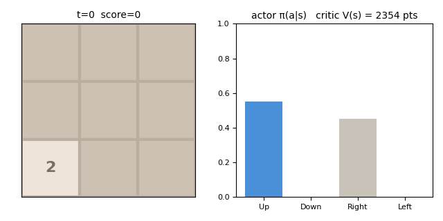
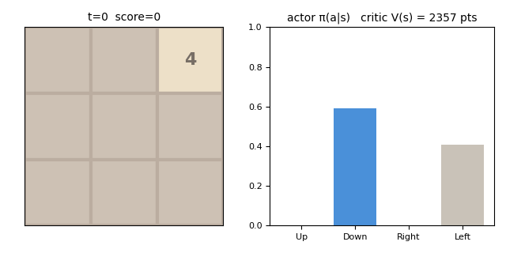
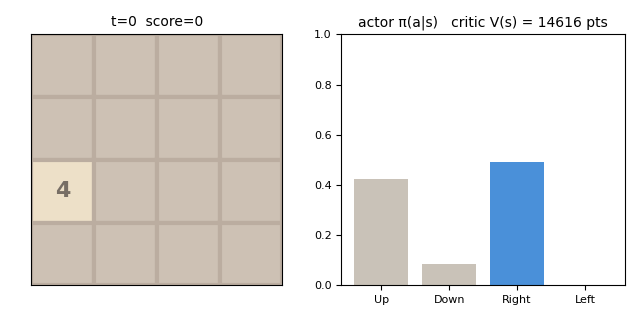

# INTERPRET.md — what the trained policy learned

The spec-§14 readback. **One message: the policy builds a corner, and it does
not build the snake.**

Run with `game2048_policy_probe.py` on the shipped crowns — 200 seeds,
deterministic argmax, with a myopic control (greedy) and the snake heuristic
as brackets measured through the same instrument. Per-stage artifacts
regenerate into `results/{scenario}/<run>/interpret/`, which is gitignored;
the commands are at the end of this file.

## The probes, side by side

Behaviour during life, 3×3 (200 seeds, 37,039 states for the policy row):

| probe | what it measures | crowned policy | greedy (control) | snake (reference) |
|---|---|---|---|---|
| score | merge points, 200-seed subsample of the record | **2625.0 ± 89.2** | 367.8 ± 14.0 | 699.5 ± 30.4 |
| moves | episode length | 185.2 | 47.0 | 69.4 |
| corner occupancy | fraction of steps with the max tile in a corner | **0.970** | 0.714 | 0.935 |
| home corner | which corner, and how consistently | **TR 0.986** | TR 0.886 | TR 0.344 |
| snake chain (ep-max) | longest monotone boustrophedon run, /9 | 4.83 | 4.33 | 4.83 |
| monotone lines, life | ordered rows+cols during play, /6 | **4.92** | 4.34 | 4.43 |
| monotone lines, at death | the same on the terminal board, /6 | 4.58 | 3.81 | 3.56 |

Where the policy's max tile actually sits (policy row, by corner):

| TL | TR | BL | BR |
|---|---|---|---|
| 0.006 | **0.986** | 0.002 | 0.005 |

*Instrument validation (§14.1 — validate where the answer is known): the snake
reference clears the myopic control on the chain metric, 4.83 > 4.33, span
0.50 — **PASS**. The instrument can detect the structure it is asked about.*

**A methodology note, earned the hard way.** Greedy's *death boards* look more
monotone than they should relative to its play, because dying early with few
distinct tiles makes sorted lines trivially likely. **Structure is measured
during life** — occupancy rates and episode-max chain length — never on the
terminal board alone. The `at death` row is reported only as a contrast with
the `life` row.

## `discover` — it builds a corner, and holds an ordering off it

The pattern, before the numbers — a median episode, one frame per few moves.
The max tile is pinned top-right and the chain is built down from it; each
frame pairs the board with the actor's π(a|s) and the critic's V(s) in merge
points, so the two networks can be read against each other.



The same pattern, measured, has four parts:

**1. It anchors one corner, and commits to it.** Corner occupancy 0.970
against the myopic control's 0.714 — but the sharper number is *which* corner:
the max tile sits top-right in **98.6%** of max-tile states, against 0.6%,
0.2% and 0.5% for the other three. This is not "keeps the max tile in a
corner"; it is "keeps the max tile in **this** corner".

**2. The corner is discovered by a probe that knows nothing about 2048.** A
generic occlusion sweep — delete one tile, measure |ΔV| — finds it unaided:
deleting the max tile costs **282 points of V** against 43 for a typical cell,
a 6.6× ratio, and the anchored cell specifically is worth **309**. The
probe localizes the strategy to one board position without being told the game
has corners.

**3. The commitment is load-bearing, and its identity is arbitrary.** Separate
training runs settle on different corners — BL, BR, TL and TR have all been
observed (#E11/#E21/#E24) — so nothing in the problem prefers one. But
averaging the policy over the board's eight dihedral frames at evaluation time
costs **−69%** (#E13). The symmetry is real in the *dynamics* and broken in
the *policy*, deliberately: an equivariant policy cannot commit, and
committing is most of what the policy is doing.

**4. It holds an ordering off the corner, and loses it before it dies.**
Monotone lines run 4.92/6 during play against greedy's 4.34, and fall to
4.58 on the terminal board. Death is therefore not the ordering collapsing at
the end — the ordering degrades first, and the loss of the corner structure is
what precedes game over. About **80% of the value function is re-expressible
in seven named board features** (R² = 0.795); the remainder is whatever the
CNN sees that has no name yet.

**Still owed.** What the `discover` stance requires under spec §14.0 is a
*fitted rule*, scored paired against the policy as a first-class §9 benchmark.
The pattern above is described but not reduced to a rule that can be run and
beaten — the R² = 0.795 regression fits **V**, not a policy.

Spec §14.3's figure contract is **partly** met: committed figures exist
(below), but they come from the `replay` stage rather than from a
`game2048_plot_policy.py` emitting a static and an interactive render from one
spec. What is missing is the *action surface* in canonical coordinates with the
reference overlaid — the plot that would make a fitted rule's deviations
visible rather than arithmetic.

## `confirm` — it does not build the snake

The chain metric **saturates**, so it cannot separate the policy from the
reference: policy 4.83, snake reference 4.83, both above the myopic control's
4.33. Agreement here is not recovery, and three things say so:

1. **The two play differently at the same chain length.** The policy commits to
   a home corner at TR 0.986; the snake reference sits at 0.344. Identical
   metric value, visibly different strategy.
2. **The metric is a class detector, not a skill meter.** It separates learned
   from myopic play and then goes flat — which is exactly the failure mode
   §14.1's validation step exists to expose, and why the span (0.50) is
   reported beside the value.
3. **The leaderboard prices the difference the other way.** At 4×4 the
   snake-leaf search stands **3.0× above** the arm shipped here. If the policy
   were playing the reference's structure, that gap would not exist.

Nothing measured here shows the policy building the reference's ordering.

## Watching it play

The `replay` stage renders an episode frame by frame — board, the actor's
π(a|s) with the chosen move, and the critic's V(s) in merge points. Run on the
argmin / median / argmax seeds of each crown's committed 8192-seed sidecar:

| scenario | seed | moves | final score | max tile | V(s₀) | V(final board) |
|---|---|---|---|---|---|---|
| `3x3_20` | 4508 (best) | 395 | 6,520 | 512 | 2,365 | 134 |
| `3x3_20` | 4922 (median) | 195 | 2,640 | 256 | 2,354 | 743 |
| `3x3_20` | 7203 (worst) | 15 | 52 | 16 | 2,357 | **1,894** |
| `4x4_20` | 1278 (best) | 2,574 | 59,640 | 4096 | 14,633 | 406 |
| `4x4_20` | 4076 (median) | 850 | 15,464 | 1024 | 14,616 | 429 |
| `4x4_20` | 1317 (worst) | 64 | 404 | 32 | 14,639 | **7,390** |

Two readings. **The critic opens well calibrated** — V(s₀) ≈ 2,360 against a
2,688 record mean at 3×3, and ≈ 14,620 against 17,084 at 4×4. And **the worst
episodes surprise it completely**: at 3×3 it dies at 52 points with the critic
still forecasting 1,894, and at 4×4 at 404 points forecasting 7,390 — 18× what
the episode earned, on a board one move from death, while the actor is
simultaneously confident (99.5% on its chosen move). Catastrophic early death
is invisible to the value function at both scales. The 2026-07-30 pilot saw
this on a weaker net (seed 5113: V ≈ 1570 → 1454 through the death spiral), so
it survives a 62% stronger policy and reappears at the canonical board.

Two of these render as committed figures (the third, the median episode, is
in `discover` above where it illustrates the pattern):

**The failure mode, 3×3 (worst seed).** Fifteen moves, 52 points — and watch
the critic's V(s) in the right-hand panel stay in the thousands the whole way
down. This is the surprise in the table above, animated.



**The canonical board, 4×4 (median seed).** Same strategy at scale, 850 moves
strided to 58 frames.



Per spec §14.3 the **interactive** render (transport controls, a scrubable
episode trace) belongs in `results/{scenario}/figures/` and is gitignored, so
it is regenerated rather than linked. The committed GIFs above and every
number in this file come from the commands below:

```bash
export OMP_NUM_THREADS=1 MKL_NUM_THREADS=1

# the stance table and the structure rows above
python game2048_policy_probe.py stances \
    --model-path results/3x3_20/<run>/best_model.zip -s 3x3_20 -o onehot_s_la --n-seeds 200
python game2048_policy_probe.py structure \
    --model-path results/3x3_20/<run>/best_model.zip -s 3x3_20 -o onehot_s_la --n-seeds 200

# the occlusion / value probes and the CRN counterfactuals
python game2048_policy_probe.py probes \
    --model-path results/3x3_20/<run>/best_model.zip -s 3x3_20 -o onehot_s_la

# the symmetry probes (the −69% frame-averaged reading)
python game2048_policy_probe.py frameavg \
    --model-path results/3x3_20/<run>/best_model.zip -s 3x3_20 -o onehot_s_la

# a replay of one episode (GIF + full-step text log)
python game2048_policy_probe.py replay \
    --model-path results/3x3_20/<run>/best_model.zip -s 3x3_20 -o onehot_s_la
```
