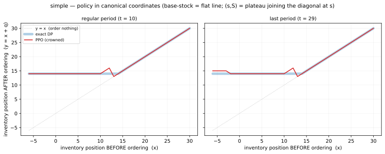
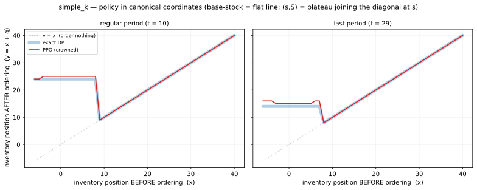

# INTERPRET — what the trained policies learned (`inv_single`)

Spec §14 readback, organized **one section per research question**. Each
section opens with the claim as `research_questions.tier2` declares it, says
which artifacts it is read from, and answers it; the evidence sits underneath
the question it serves.

Three of the six declared questions owe a section here. The other three say so
**in the IR, not in prose**: RQ-2 is `bypass` (which defaults `probe_required`
to false), and RQ-6 and RQ-7 carry an explicit `probe_required: false` with the
reason on their `instrument`, which is the exception §14.0 provides for. The
three that are owed are different kinds of claim (§14.0), and the stance decides
what counts as evidence in each:

| question | stance | cells | evidence is | status |
|---|---|---|---|---|
| [**RQ-1** — `(s,S)` threshold recovery](#rq-1) | `confirm` | `simple`, `simple_k` | **anchored**: agreement with a verified-exact DP | ✓ answered |
| RQ-2 — inventory position as sufficient statistic | `bypass` | `lt`, `slt` | an outcome comparison — **owes no section here** | ✓ answered in the ledger (#E10, #E11) |
| [**RQ-3** — deviation from base-stock under lost sales](#rq-3) | `discover` | `lt_lost_sales`; `lost_sales` closed by collapse (#E14) | **anchored**: a verified-exact lost-sales DP (#E17) | ✓ answered — reference AND learned-policy halves (#E22) |
| [**RQ-4** — structure under stochastic lead time](#rq-4) | `discover` | `slt`, control `lt`; extended over `lt_variance_k0` (45 cells) | **unanchored** at `slt`; the family's `p=0` slice IS anchored — a deterministic lead time has an exact DP | ✓ answered, and generalised (§RQ-4.7) |
| RQ-5 — *withdrawn* 2026-08-27 to §9 Q-B | — | — | action encoding is a rendering question | id retired, not reused |
| RQ-6 — per-cell cost across `grid16` | `confirm` | `grid16` | **anchored**: an exact DP at every one of the 16 cells | ✓ answered (#E23 — 96.5% median). **Narrowed 2026-09-11**: the threshold and interpolation clauses were struck (§FRAME-CHANGELOG), so this question owes an outcome comparison only — `probe_required: false` |
| RQ-7 — interpolation across `cost_leadtime` | `confirm` | `cost_leadtime` (54 cells, 42 held out) | **anchored**: an exact DP at every cell | ✓ answered (#E24) — `b` interpolates with no degradation, `LT=1` collapses to 55.1%. Outcome comparison only — `probe_required: false`: the claim declares no structural readback, deliberately (see `a6b29cd`), and no policy was trained for it |

All numbers are on the standard §9.7 protocol block, `--first-seed 0`, at
**8192 CRN seeds** — with one declared exception: **§RQ-4.7's 45-cell family is
scored per cell at 2048 seeds** (#E16, #E19, #E20), the grid convention, so its
figures are exact against each other and only *indicative* against the
single-scenario sections above. Instrument throughout:
`inv_single_policy_probe.py`.

---

<a id="rq-1"></a>

# RQ-1 — `(s,S)` threshold recovery   *(`confirm`, anchored)*

> **`confirm` — order-up-to / `(s,S)` threshold structure on inventory position.
> Claim: a policy trained end-to-end recovers the structure classical DP
> analysis derives, rather than merely matching its cost.**

**Confirmed, on both halves of the question.** PPO reaches **99.92%**
(`simple`) and **99.96%** (`simple_k`) of the exact DP, from 93.1% / 97.7% at
the L1 baseline (#E2) — and the recovered *thresholds* match the reference, not
just the totals. At `simple_k` the best fitted base-stock costs 775.94, so 157
cost units of the gap are reachable only by a policy that batches, and the
learned policy captures essentially all of it.

Read from the two crowned artifacts (#E9):

| | crowned artifact | address |
|---|---|---|
| `simple` (K=0) | 176.11 — 99.92% of exact | `sc0/g4/a1/h2` |
| `simple_k` (K=20) | 618.96 — 99.96% of exact | `sc1/g4/a1/h3` |

## RQ-1.1 The structure recovered

**Both policies implement the structure classical theory predicts, and the
thresholds are readable.**

| target | predicted class | recovered | reference | agreement |
|---|---|---|---|---|
| `simple` | base-stock (K=0 ⇒ order-up-to optimal) | **`s` = 13, `S` = 14** — *constant, all 30 periods* | `s*` = 13, `S*` = 14 | **exact**, every period |
| `simple_k` | `(s, S)` (K>0 ⇒ batching optimal) | **`s` = 8** constant; **`S` period-dependent**: 25 stationary → 23 (t=28) → **15** (t=29) | `s*` = 8; `S*` 24 → 23 → **14** | **reorder point exact, every period**; level +1 throughout |

**`S` is a single number at `simple` and a function of the period at
`simple_k`** — and that difference is the end-of-horizon effect, not an
inconvenience of reporting. `simple`'s optimum is genuinely stationary (#E1:
the DP orders up to 14 in all 30 periods), so one number describes it. At
`simple_k` a fixed cost makes it worth ordering *less* as the horizon closes,
and both the DP and the learned policy do so. Quoting a scalar `S` for
`simple_k` — as an earlier draft of this table did — states the stationary
value and silently drops the ramp the figures below show.

`S_hat − S_dp` at `simple` is **+0.00, max |·| 0.0 across every period** — the
net is not approximating the base-stock level, it is hitting it.

`S_hat over periods` reads **mean 24.60, min 15.0, max 25.0** at `simple_k` —
the spread *is* the ramp. Against the DP's own 24 → 23 → 14, the policy tracks
the shape and sits one unit high throughout. The policy learned that the
horizon ends.

## RQ-1.2 The figures (§14.3)

Canonical coordinates: **x = inventory position before ordering, y = inventory
position after ordering**. In these coordinates base-stock is a flat line at
`S`, and `(s,S)` is a flat plateau at `S` that joins the `y = x` no-act diagonal
at `s` — so a deviation from the form is *visible*, not arithmetic. The exact DP
is drawn underneath the trained policy (overlay, never side-by-side).





What they show, reading the plateaus directly off the curves:

| | plateau `S` (PPO / DP) | joins diagonal at `s` (PPO / DP) |
|---|---|---|
| `simple`, regular t=10 | 14 / 14 | 13 / 13 |
| `simple`, last t=29 | 14 / 14 | 13 / 13 |
| `simple_k`, regular t=10 | **25 / 24** | **8 / 8** |
| `simple_k`, last t=29 | **15 / 14** | **8 / 8** |

- `simple` is a **flat line**, identical in both periods for both policies —
  base-stock, and no terminal effect exists there (#E1).
- `simple_k` is a **plateau joining the diagonal at 8** — the `(s,S)` form,
  with the reorder point exactly right and the level one unit high.
- **The last-period panel is the end-of-horizon effect made visible**: the
  plateau falls from 25 to 15 (DP: 24 → 14) because ordering up to the
  stationary level with one period left buys stock that can never be sold. The
  trained policy does this, which the aggregate score could not show.
- The only raggedness is 2–3 states either side of the threshold, where the
  net interpolates and the fitted rule does not — which is exactly the
  raggedness §14.2 predicts the fit deletes, and why the fitted rule scores
  better than the net.

Regenerate (the interactive HTML lands in the gitignored `results/` tree and
does not exist in a fresh clone, so this command is cited instead of a link):

```bash
python inv_single_plot_policy.py -s simple    --x-min -6 --x-max 30 \
  --model-path results/tuning/tune_simple_b/trial_0065/simple/PPO_*/ppo_inv_single.zip \
  --vecnorm-path results/tuning/tune_simple_b/trial_0065/simple/PPO_*/vecnormalize.pkl
python inv_single_plot_policy.py -s simple_k  --x-min -6 --x-max 40 \
  --model-path results/tuning/tune_simple_k_a/trial_0042/simple_k/PPO_*/ppo_inv_single.zip \
  --vecnorm-path results/tuning/tune_simple_k_a/trial_0042/simple_k/PPO_*/vecnormalize.pkl
```

## RQ-1.3 Scoring the fitted rule (§14.2)

The fitted rule is itself a policy, so it is scored under the same protocol and
published as a trio with paired Δs:

| target | reference (DP) | **fitted (s,S)** | raw net | fitted − net | fitted − DP |
|---|---:|---:|---:|---:|---:|
| `simple` | 175.966 | **175.974** | 176.110 | **−0.136** (t=−6.0) | +0.009 (t=+1.7) |
| `simple_k` | 618.706 | **618.660** | 618.963 | **−0.302** (t=−2.6) | −0.045 (t=−0.1) |

**Verdict: branch 1 on both targets.** Recovery is clean and |fitted − net| is
0.136 and 0.302 against a 1%-of-bar threshold of 1.76 and 6.19 — an order of
magnitude inside. The nets implement the predicted structure; the claim is made.

Two consequences the spec anticipates:

- **The fitted rule beats the net it was read from**, on both targets and
  significantly (t=−6.0, t=−2.6). Fitting the threshold deletes the plateau
  raggedness the network carries. Interpretation is a policy *improvement*
  here, not only an explanation.
- **The fitted rule is therefore a shippable artifact** — a table of `(s, S)`
  per period replacing a 3-layer network at `simple` and a 4×256 one at
  `simple_k`. At `simple_k` it is statistically **indistinguishable from the
  exact DP** (−0.045, t=−0.1): a handful of integers per period reproduce a
  verified-optimal policy.

Absolute gaps beside percentages, per §14.2: the fitted rule is **+0.009** over
exact at `simple` and **−0.045** at `simple_k`; the nets are **+0.14** and
**+0.26**.

## RQ-1.4 What the confirmation cost

The structure did not appear at the derivation; it took five escalations, each
measured:

| step | `simple` | `simple_k` | entry |
|---|---:|---:|---|
| L1 derived config | 188.92 | 633.22 | #E2 |
| `norm_obs` off | 182.94 | 625.95 | #E3 |
| `normalize_advantage` off | 178.88 | 625.72 | #E5 |
| ordinal head (+ depth, entropy) | 176.49 | 621.31 | #E7, #E8 |
| tuned hp — 308 trials | **176.11** | **618.96** | #E9 |

The single most important lever was the **action parameterization**, not the
optimizer: a flat categorical spreads its gradient over 46 independent logits
with no notion of adjacency, so learning that 14 is right teaches it nothing
about 13 or 15 — and this domain's cost surface punishes a one-unit error by
2.7–6.3%. The ordinal (mixture-at-zero) head induces every logit from three
numbers, pooling the location gradient across all samples, and it is the first
thing in the campaign to move the end-of-horizon term (#E7).

## RQ-1.5 Scope, and what is not claimed

`simple` is the control: at K=0 a fitted base-stock *is* optimal (175.97 = the
DP), so recovering `S` = 14 there demonstrates the readback works where the
answer is known — §14.1's "validate the instrument where the answer is known".
`simple_k` is the target, where the structure is genuinely `(s,S)` and no
order-up-to rule can reach the bar.

Both cells are zero and deterministic lead time with backlogged demand, so
nothing in RQ-1 speaks to the lost-sales or grid cells. The end-of-horizon term
remains ~54% of `simple_k`'s residual (#E6, #E7) and is not solved, only
reduced.

---

<a id="rq-3"></a>

# RQ-3 — deviation from base-stock under lost sales   *(`discover`, anchored)*

> **`discover` — deviation from base-stock under lost sales with positive lead
> time. Claim: at `lt_lost_sales` the learned policy beats the tuned base-stock
> heuristic, and its orders sit at-or-below the fitted base-stock rule's in
> high-stock states — the direction lost-sales theory predicts.**

**Answered on both halves.** The reference layer (RQ-3.1–3.4) establishes what
the optimum does; RQ-3.5 states in advance what the learned policy must show;
RQ-3.6 measures it. Read from `inv_single_benchmark_dp_lostsales.py`,
`inv_single_dp_lostsales_probe.py` and `inv_single_policy_probe.py` on the tuned
`vec_ip` artifact (416.01, 99.95% of optimal). Full numbers in #E17 and #E22.

**The claim's stated direction is already falsified — see RQ-3.4.** That is a
finding, not a failure: `discover` means the structure is not known in advance,
and here the exact optimum can say what it is instead of the campaign guessing.

## RQ-3.1 The section changed kind: this question is now anchored

RQ-3 was scheduled as an *unanchored* `discover`, like RQ-4 — argued by contrast
because "no exact DP exists" at either lost-sales cell. That was true of the
**shipped** `dp`, whose recursion is backlog-only, but it had been
over-generalized to the problem. It does not hold: at L=2 the exact lost-sales
recursion is `V_t(u, p1)` with `u = inv + p0`, roughly 10⁴ states.

`(u, p1)` is the **standard** lost-sales state — on-hand after receipt plus the
`L−1` outstanding orders, dimension `L`, which at L=2 is two. Nothing was
reduced below what the literature uses; the DP is cheap because this domain's
`L` is 2. Verified against the un-reduced 3-D DP (max gap 6e-14) and by
simulating its own policy through `InvSingleEnv` (+0.19 SE of `V₀`).

**Optimum = 415.79.** RQ-3 can now be argued from agreement with a reference,
the way RQ-1 is, rather than only from contrast.

## RQ-3.2 The optimal policy is a capped base-stock policy

Visitation-weighted, t=10 (the policy is stationary for t ≤ 27):

| IP | Q\*(dp) | target = IP + Q\* | region |
|---:|---:|---:|---|
| 8 | 13.00 | 21.00 | cap binds — **constant-order** |
| 14 | 13.00 | 27.00 | cap binds |
| 20 | 11.87 | 31.87 | transition |
| 26 | 9.00 | **35.00** | base-stock |
| 32 | 4.00 | **36.00** | base-stock |
| 36 | 0.00 | **36.00** | base-stock |

Above IP ≈ 26 the target is pinned at 36 — order-up-to. Below IP ≈ 14 the
*order* is pinned at 13 and the target just tracks IP. So

    Q* ≈ min(cap, (S − IP)⁺)

which is exactly **Xin (2021)'s capped base-stock policy** — a two-parameter
family whose limits are pure base-stock (cap → ∞) and pure constant-order
(S → ∞). The optimum here is not near a limit: **both limbs are active inside
one policy**, the constant-order limb below IP=14 and the base-stock limb above
IP=26. This was arrived at from the DP table and only afterwards recognised as a
named family; the citation is owed to that literature, not to this campaign.

Two boundary facts, so the table is not over-read:

- **The last two periods are a tie, not a taper.** An order at t=28 or t=29
  arrives past the horizon, and with `K = c = 0` placing it costs nothing, so
  every action is exactly tied and the DP's `Q*=0` there is an argmin
  tie-break. A stationary rule that keeps ordering loses nothing. The single
  real end effect is t=27, where Q\* rises 13 → 14.
- **The policy is stationary for t ≤ 27**, so the finite horizon is long enough
  that Xin's infinite-horizon analysis is the relevant comparison.

## RQ-3.3 What base-stock's gap is, and what the cap recovers

Protocol block, paired against the exact optimum:

| arm | cost | % of optimal | paired vs exact | t |
|---|---:|---:|---:|---:|
| **`dp_lostsales` (exact)** | **415.79** | 100% | — | — |
| `capped_basestock(S=35, cap=12)` | 418.78 | **99.29%** | +2.99 ± 0.15 | +19.4 |
| PPO best, 6M (#E15) | 419.12 | 99.21% | +3.33 ± 0.16 | +20.6 |
| `plain_basestock(S=35)` | 451.82 | 92.03% | +36.02 ± 0.22 | +164.0 |

**Base-stock leaves 36.02 — 8.66%. One extra number, the cap, recovers 91.7% of
it.** `(S, cap)` was grid-searched on the selection block, never the block it is
quoted at.

That sits where the literature would put it. Huh, Janakiraman, Muckstadt &
Rusmevichientong (2009) prove order-up-to is asymptotically optimal as the
lost-sales penalty grows, and report it within 1.5% of optimal at `b/h = 100`.
This cell is `b/h = 9`, far from that regime, and base-stock is 8.66% off.

**Is IP the right statistic?** Not sufficient — Karlin & Scarf forbid it, and
the violation is measurable: at fixed IP the optimal order rises with the
near-hand share, slope +0.10 to +0.19 where the cap binds and **exactly 0.000**
in the base-stock region. But IP is sufficient *for a near-optimal policy*, and
it is decisively the right basis over on-hand:

| rule | fitted | cost | % of optimal |
|---|---|---:|---:|
| `min(cap, S − IP)` | S=35, cap=12 | 418.78 | 99.29% |
| `min(cap, S − u)` | S=26, cap=11 | 439.54 | 94.60% |
| `max(0, S − IP)` | S=35 | 451.82 | 92.03% |
| `max(0, S − u)` | S=28 | 629.19 | 66.08% |

The two levers are strongly **non-additive** — each is worth ~180 alone and only
20–33 once the other is present. A cap substitutes for tracking the pipeline
(it stops the runaway double-ordering that sinks the uncapped on-hand rule) and
tracking the pipeline substitutes for a cap.

## RQ-3.4 The claim's stated direction is backwards

RQ-3 predicts the learned orders sit **at-or-below** base-stock's *in high-stock
states*. The exact optimum does the opposite:

| IP | Q\*(dp) | basestock(S=35) | dp − bs |
|---:|---:|---:|---:|
| 8 | 13.00 | 27 | **−14.00** |
| 16 | 12.97 | 19 | −6.03 |
| 24 | 10.90 | 11 | −0.10 |
| 28 | 8.00 | 7 | **+1.00** |
| 34 | 2.00 | 1 | **+1.00** |

It orders **far below** base-stock at **low** stock and **slightly above** at
high stock. The mechanism is the lost-sales/backlog distinction itself: with
L=2 an order placed now lands in two periods, so when stock is deeply short a
large order cannot rescue the current shortage — that demand is *lost*, not
backlogged — and only becomes inventory to carry. Under backlog the shortage
persists and must eventually be served, which is exactly what makes base-stock
order more. **The cap at low stock is the lost-sales structure.**

Consequence for the owed probe: **it must compare against base-stock at low IP,
where the signal is 14 units wide, not at high IP where it is 1.** The
instrument RQ-3 declared was pointed at the wrong end of the state space.

## RQ-3.5 What the learned policy must show — stated before it is measured

The reference layer makes RQ-3 falsifiable in a way it was not when scheduled.
For the claim to hold, the tuned artifact must:

1. **beat `plain_basestock`** — already true at the carried recipe (#E15),
   4/4 seeds, and worth 90.8% of the available gap;
2. **show the cap** — orders flattening to a constant below IP ≈ 14 rather than
   rising as `S − IP` does;
3. **deviate below base-stock at LOW IP**, per RQ-3.4, not at high IP.

A fourth outcome is possible and would be the more interesting one: the tuned
artifact fails to beat `capped_basestock` (418.78), which currently **ties** the
best PPO run at −0.34 ± 0.24 (t = −1.4, not significant). If a two-parameter
rule ties a 6M-step network, the readback is that PPO found capped base-stock
and stopped there.

## RQ-3.6 The readback: the net recovered the DP, not the rule

Probe on the tuned artifact (`tune_lt_lost_sales_vec_ip_b` trial 18, 416.01),
`t=10`, pipeline held at 0 so `x == IP`:

| IP | net `q` | DP `q*` | capped rule | base-stock | net−bs | net−DP |
|---:|---:|---:|---:|---:|---:|---:|
| 0 | **13** | 13 | 12 | 35 | **−22** | 0 |
| 8 | **13** | 13 | 12 | 27 | **−14** | 0 |
| 14 | **13** | 13 | 12 | 21 | −8 | 0 |
| 20 | 12 | 12 | 12 | 15 | −3 | 0 |
| 24 | 11 | 11 | 11 | 11 | 0 | 0 |
| 28 | 8 | 8 | 7 | 7 | +1 | 0 |
| 32 | 4 | 4 | 3 | 3 | +1 | 0 |
| 36 | 0 | 0 | 0 | 0 | 0 | 0 |

**Mean |net − DP| = 0.24**, exact agreement at 17 of 21 sweep points, and
`S_hat` 36–37 against the DP's 36. All three RQ-3.5 conditions hold:

1. **Beats `plain_basestock`** — 4/4 seeds, established in #E15/#E18.
2. **The cap is there.** Orders flatten to **12–13 for every IP ≤ 18** instead
   of rising as `35 − IP`. This is why the probe reports `flat = 24.00`: under a
   cap of 12 at `S = 36` the post-order position is `y = IP + 12` at low IP, so
   `|y − 36| = 24` at `IP = 0`. The base-stock flatness metric is *correctly*
   reading the cap as a departure from order-up-to.
3. **The deviation is at LOW IP**, as RQ-3.4 predicted and the declared claim
   did not: mean **−15.2** for IP ≤ 14 against **+0.9** for IP ≥ 28. Run where
   RQ-3 originally aimed its instrument, the probe would have measured ±1 and
   looked like a refutation.

**The net is closer to the DP than the fitted rule is** — mean |net − DP| 0.24
against |net − capped| 0.71. At IP 28–34 it orders 8/6/4/4 where the capped rule
orders 7/5/3/1, tracking the DP's curvature through the transition region. So it
is not a capped base-stock with better constants; that is what earns the −2.77
(t=−17.0) over `capped_basestock` in #E21, and it settles the question #E17 left
open — PPO did not merely rediscover Xin (2021)'s rule and stop.

## RQ-3.7 What is not claimed

- **The readback is the `p1 = 0` slice only.** The probe holds the pipeline at
  zero, so it does not test whether the net tracks the genuine 2-D structure —
  the `dQ*/du` slope of +0.10 to +0.19 where the cap binds (RQ-3.3). That needs
  a composition probe like RQ-4's, at fixed IP with the split varied, and is
  **not run**. Everything in RQ-3.6 is a statement about one slice.
- **No novelty in the structure.** Capped base-stock is Xin (2021); the
  asymptotic optimality of order-up-to is Huh et al. (2009); the insufficiency
  of IP is Karlin & Scarf (1958). What this campaign contributes at this cell is
  the exact bar for *this instance*, which did not exist here before.
- **`lost_sales` (L=0) carries no structural content** and is closed by collapse
  (#E14), not by an arm: at zero lead time the two stockout modes are the same
  problem on-policy.
- **The residual 2.99 is undecomposed.** It is some mix of a better stationary
  `(S, cap)`, a richer IP-only rule, and the genuine 2-D dependence — and only
  the last bounds what `vec` can win over `vec_ip`. The projection that would
  separate them is not run.


---

<a id="rq-4"></a>

# RQ-4 — structure under stochastic lead time   *(`discover`, unanchored)*

> **`discover` — optimal policy structure under stochastic lead time with
> potential order crossover. Claim: at `slt` the learned policy on the full
> pipeline beats every rule measured on inventory position alone, and its action
> depends on pipeline composition at fixed inventory position.**

**Confirmed, and the discovered rule has a direction and a price.**

Read from #E11's crowned `slt` artifact (`vec`, 723.83) with `lt`'s crowned
`vec` artifact (551.57) as the control — no runs of its own. Instrument:
`inv_single_policy_probe.py --composition`. Full numbers in #E12.

`slt` has **no verified bar** — #E1 showed the shipped DP is mis-specified
there — so unlike RQ-1 this section cannot argue from agreement with a
reference. Its evidence is the contrast against `lt`, where theory says
inventory position *is* sufficient.

## RQ-4.1 The structure, in one figure


**How to read it.** The y-axis is the order *minus the mean order at the same
inventory position*, and the x-axis is `lateness = Σ k·pipe[k] / Σ pipe` — how
far out the outstanding stock sits (0 = all landing this period). Subtracting
the per-IP mean is what turns the picture into a test: **the best possible rule
that reads only inventory position must emit one number per IP, so in these
coordinates it is the flat line y = 0 — by construction, with no fitting.** Every
departure from that line is behaviour no IP-only rule can reproduce. Faint lines
are individual inventory-position levels; the bold line is their mean.

**What it shows.** At `slt` the policy rises steadily from −0.65 to +1.9 across
the lateness range: **it orders more when the same inventory position is
backloaded.** That is the crossover-aware response. Under L ∈ {1,2,3} a later
order can land ahead of an earlier one, so total inventory position overstates
coverage of the near periods when the stock is far out — and the near periods
are exposed regardless of the total. A rule reading IP alone cannot tell ten
units landing now from ten units landing in three periods; this policy can, and
does.

Note also what the shared x-axis shows: `lt` **stops short**. A fixed lead time
cannot produce the far-out pipelines a stochastic one reaches, so the right half
of the left panel is empty as a fact about the scenario, not a gap in the data.

**Why the canonical coordinates of RQ-1.2 are not used here.** They were tried
first. In the band where these policies operate the behaviour is near enough
order-up-to that every curve is flat near `y = S`, and a one-unit dependence on
the pipeline is invisible against an axis the `y = x` diagonal has already
stretched over twenty units. RQ-1's claim was a *shape* and canonical
coordinates render shapes; RQ-4's is a *differential*, and it belongs on the
y-axis.

## RQ-4.2 Why this is a finding and not an artifact of the probe

The same probe at `lt`, where the lead time is deterministic and IP *is*
sufficient, returns a gradient of **+0.54** against `slt`'s **+1.27** — smaller,
but neither zero nor flat: the left panel above has a visible hump, and the
slopes differ by only about a factor of two (+0.69 vs +1.31 per unit lateness).
Read alone, the surface would have called `lt` crossover-aware too.

`lt` is the right control for a second reason: both scenarios have **mean lead
time 2.0** (`lt` is L=2 fixed, `slt` is uniform on {1,2,3}). They differ in the
lead time's *variance* and in nothing else, so the contrast below cannot be a
lead-time-length effect.

The cost test separates them cleanly. Projecting each net onto the best IP-only
rule **fitted to that net's own behaviour** — the modal action it took in every
(period, IP) cell it visited, the strongest available control because it is the
policy itself minus the composition information:

| scenario | net (`vec`) | net projected onto IP | Δ ± SE | t |
|---|---:|---:|---:|---:|
| `lt` (deterministic L=2) | 551.57 | 551.24 | **−0.33 ± 0.07** | −4.4 |
| `slt` (stochastic L∈{1,2,3}) | 723.83 | 735.19 | **+11.36 ± 0.52** | +21.9 |

At `lt` the projection loses nothing — it is marginally *better*, because it
denoises the network's plateau raggedness exactly as the fitted `(s,S)` rule
does in RQ-1.3. So `lt`'s composition-dependence is a cost-irrelevant wiggle. At
`slt` it is worth 11.36, systematically: median Δ +16, and no seed worse by
more than 500.

**On the surface the two cells differ by a factor of two; on cost they differ in
kind.** That gap between the two readings is the finding's real content, and it
is why the panel titles in RQ-4.1 carry the price rather than only the slope.

**The methodological point is the transferable one: an existence test on the
action surface is noisy, and a cost test on a fitted restriction is not.** State
the structure from the surface; price it by fitting the restriction and scoring
it.

Two probe artifacts had to be removed before either reading was trustworthy, and
both are recorded in #E12 with pytest gates: a fitted-rule fallback that answered
"order nothing" at unvisited states and ran away on 7 of 8192 `lt` seeds, and a
per-IP composition cap that took a *prefix* of a sorted list — the low-inventory,
heavy-pipeline states — and so inflated the reported gradients to +2.79 / +0.84.
Drawing the figure is what exposed the second one.

This also corroborates RQ-2's `bypass` answer from the other side. #E10 showed
the net rebuilds IP by matching `vec_ip`'s cost; here the same net's *entire*
deviation from an IP-only rule prices at −0.33 — not merely equalled, but shown
to carry no usable extra information.

## RQ-4.3 What it beats

Every reference available at `slt` collapses the pipeline to its sum, and the
net beats all three, paired on the protocol block: optimized base-stock
737.96 (+14.12, t=+24.3), the backlog DP table run as a heuristic 808.78
(+84.94), myopic 819.36 (+95.53). With #E1 having shown the shipped DP is
mis-specified at this cell, **723.83 is the best known policy for `slt`**, and
RL is what produced it.

## RQ-4.4 The structure as a statistic — how many numbers, and which

RQ-4.1–4.3 established *that* the policy reads pipeline composition and what
that is worth. This asks the sharper question: **can `(inv, pipe)` be compressed
to a few numbers on which ordering is near-optimal?** At `lt` that number is
inventory position, provably. At `slt` it is not — so what is it?

The instrument constrains **information only** (#E13). A linear bottleneck
`e_i = inv + Σ w_ik·pipe_k` — inventory coefficient fixed at 1, no bias, so `w`
is identified — feeds a free MLP. Nothing above the bottleneck is constrained,
so a failure is attributable to compression rather than to rule shape. The
teacher is *distilled*, not retrained, which makes success conclusive and
failure merely suggestive; every claim below rests on a success.

**Two controls first.** At `lt`, d=1 beats its teacher (551.14 vs 551.57) with
weights `(1.045, 0.988)` — **inventory position recovered, not assumed**, where
Karlin-Scarf says it must be. At `slt`, d=4 (full rank, no compression)
reproduces its teacher. And `pipe₀` returns ≈1.0 in both without being told,
which theory demands: under `O→R→D` it is received before this period's demand.

| what the policy may read at `slt` | cost | vs full information |
|---|---:|---:|
| plain inventory position (weights frozen at all-ones) | 733.46 | +10.44 |
| one **learned** weighted position `(1.018, 0.996, 0.862)` | 724.58 | +1.56 |
| **two learned numbers** | **722.55** | **−0.47** |
| everything (4 numbers) | 723.02 | — |

**One number buys 85% of it; two numbers are enough.** d=2 in fact lands *below*
full information — a bottleneck at the true dimension regularises, exactly as
RQ-1.3's fitted `(s,S)` beat the net it was read from.

**The two numbers are a level and a tilt — not dual-index.** Rows of a d=2
bottleneck are not individually identified, so the question is asked of the
subspace. The Veeraraghavan–Scheller-Wolf shape would be two *prefix sums*, the
plane `{(a,a,a,b)}`. The learned plane contains a weighted inventory position
almost exactly — `inv + 1.001·p₀ + 1.001·p₁ + 0.923·p₂`, smallest principal
angle **0.025°** against a 0.074% random baseline — but its second direction,
`(−0.293, +0.967, −1.000, +0.354)`, weights `inv`, `p₀`, `p₁` *unequally*. It is
a contrast between near and far pipeline contents, not a cumulative sum. So the
second statistic reports how the same stock is spread in time.

## RQ-4.5 The rule, and where the gap actually lives

The weights transfer out of the network into a deployable rule. `order up to S
on inv + Σ wₖ·pipeₖ`, searched exactly as `basestock_opt` was, **contains**
`basestock_opt` as its `w=(1,1,1)` member — it returns `S*=41` and 737.96 to the
cent — so the comparison is like-for-like:

| arm | cost | vs `basestock_opt` |
|---|---:|---:|
| `basestock_opt` `w=(1,1,1)`, S=41 | 737.96 | — |
| weighted, net's weights `(1.02,1.00,0.86)`, S=41 | 732.61 | −5.35 (t=−21.8) |
| weighted, cost-fitted `w=(1,1,0.70)`, S=40 | **730.93** | **−7.03** (t=−15.4) |

**A single coefficient beats the entire correction the crossover literature
offers**, which keeps unweighted IP and adjusts only `S`. Note the cost-optimal
discount is *deeper* than the net's own (0.70 vs 0.862): the net is not
order-up-to, so its internal weighting is not optimal for a rule that is.

Splitting 737.96 → 722.55 three ways — separable only because the bottleneck
measured compression without imposing rule shape. The chain ends at the **d=2**
bottleneck, the best point measured, not at full information (723.02), which d=2
beats:

| step | from → to | worth | share |
|---|---|---:|---:|
| weighting the pipeline `(1,1,1) → (1,1,0.70)` | 737.96 → 730.93 | 7.03 | 46% |
| dropping order-up-to form on that scalar | 730.93 → 724.58 | 6.36 | 41% |
| information beyond one number | 724.58 → 722.55 | 2.02 | 13% |

## RQ-4.6 What is not claimed

No optimality claim: `slt` has no verified bar, so "best known" is a leaderboard
statement, not a distance from an optimum. Distillation inherits the teacher, so
"two numbers suffice" means *for a policy as good as this one* — a from-scratch
d=1 policy could differ, which matters only for the direction these results are
not used in. The three estimates of the far-slot coefficient answer three
different questions and must not be averaged: **0.862** best scalar for
imitating the net, **0.70** best scalar for an order-up-to rule by cost,
**0.923** the weighted-IP direction inside the d=2 plane. And `α` is loosely
identified — selection cost is nearly flat over 0.65–0.80.

Everything in §RQ-4.1–4.6 is one cell. Whether the structure survives across
varying costs and lead times is the generalist question, and §RQ-4.7 answers the
half of it that has been run.

## RQ-4.7 The same structure across a 45-cell family

`lt_variance_k0` sweeps the lead-time law `[p, 1−2p, p]` on support {1,2,3} —
`E[L] = 2` at every cell, `Var(L) = 2p` spanning its full range 0→1 — crossed
with shortage cost `b ∈ 1…9`, at `K = 0`. One policy is trained across all 45
cells, in two observation modes that differ *only* in whether the pipeline is
visible or collapsed to its sum (#E16, #E19). **Every figure in this section is
2048 seeds per cell**, not the 8192 the sections above use — which is why the
cells that *are* `lt` and `slt` read 551.52 and 721.83 here against 551.57 and
723.83 elsewhere. Same policies, a different block.

### The control that makes the reading possible


At `Var(L) = 0` the lead time is deterministic, so inventory position is
provably sufficient and **the two modes carry identical information** — their
difference must be zero. It is not, until the policy is good enough:

| rung | gap at `Var(L)=0` | % of the exact DP |
|---|---:|---:|
| L1, §8.6-derived | +75.01 | 47.0% / 51.9% |
| L1, carried levers | +23.30 | 92.1% / 97.7% |
| **tuned** | **−0.14** | **98.9% / 99.1%** |

Every point on the top two curves is **learnability**, not information: an
11-wide observation is harder to fit than a 7-wide one, and a flat categorical
head over 136 actions (#E7's mechanism) makes that worse. Only the bottom curve
starts at the control, and only then can its slope be read as structure.

### What the family says

With the intercept at zero, the gap descends monotonically past `Var(L) = 1/3`
to **−14.65** at maximum variance (rung mean; −10.16 for the crowned arm).
**The pipeline is worth nothing when the lead time is deterministic and ~10–15
when it is maximally variable** — RQ-4's claim, now measured from scratch across
a family rather than read off one cell post-hoc. It is the third independent
line of evidence, after RQ-4.2's cost test and RQ-4.4's bottleneck, and the only
one that does not depend on a distillation of an already-trained policy.

The crowned arm's gap, cell-mean per lead-time law — the series the claim is
read off:

| `Var(L)` | 0 | 1/3 | 1/2 | 2/3 | 1 |
|---|---:|---:|---:|---:|---:|
| `vec` − `vec_ip` | +0.54 | +1.41 | −1.21 | −4.50 | **−10.16** |

The `Var(L) = 0` column is the control above, and its **+0.54** is what makes
the rest readable: the residual there is learnability, and the descent from it
is information. Read the row against the rung table — the same column stood at
+75.01 table-faithful and +23.30 carried, so tuning is what brought the control
to zero and the trend into view.

### What generality costs

The cells `p00_b9_K0` and `p33_b9_K0` *are* the `lt` and `slt` scenarios, so the
comparison against their specialists is paired on identical seeds rather than
indicative:

| cell | specialist | generalist | paired Δ ± SE | % |
|---|---:|---:|---:|---:|
| `lt` (Var=0) | 551.52 | 553.19 | +1.67 ± 0.45 | **0.30%** |
| `slt` (Var=2/3) | 721.83 | 730.43 | +8.61 ± 0.95 | **1.19%** |

One policy covering 45 cells costs **0.3–1.2%** against a policy tuned for that
single cell. The price is higher at `slt` — more structure to specialise on —
and lower for the pipeline-aware mode at both, which is what you would expect if
the pipeline is what a generalist needs to adapt.

Where truth is computable (`Var=0, b=9`), all on the same seeds: exact DP
**549.83** → specialist **551.52** (99.69%) → generalist **553.19** (99.39%).

### And the rule itself generalises

RQ-4.4 found one weighted inventory position suffices *at a single cell*. The
family answers the harder question. Distilling the crowned generalist through a
**context-aware** bottleneck — only `(inventory, pipeline)` compressed, the
lead-time law and cost fractile passing through to a free MLP, so a student may
order differently per cell while forced to read the same statistic (#E20):

| student | params | 45-cell mean | vs teacher (475.76) |
|---|---:|---:|---:|
| **one shared weight vector** | 3 | **475.24** | **−0.52** |
| full rank (no compression) | 12 | 475.58 | −0.18 |
| plain inventory position | 0 | 478.55 | +2.79 |

**Three numbers reproduce a policy spanning 45 cells, and beat it** — and beat
the full-rank ceiling too, whose lower imitation error (MAE 0.294 vs 0.629) is
fitting raggedness rather than policy. The vector is
`inv + 1.010·pipe₀ + 0.988·pipe₁ + 0.818·pipe₂`, against RQ-4.4's single-cell
`(1.018, 0.996, 0.862)`: two independent routes onto one rule.

Do the weights move with the cell? Letting them differ per lead-time law — 15
parameters strictly containing the shared 3 — buys **+0.07 in cost**, i.e.
nothing. The cell enters through the order-up-to *level*, not through which
statistic is read.

**One cell cannot answer, and it is the one theory is sharpest about.** At
`Var(L)=0` the order enters slot 2 and shifts out before the next decision, so
`pipe₂` is identically zero and its weight is **unidentifiable** — the fitted
1.000 there is the initialisation, not a measurement, and no reparameterisation
helps (`a₂ = a₁` in the prefix-sum basis). A ridge toward `(1,1,1)` would have
*manufactured* the expected decline: simulated with a constant true weight, it
returns exactly 1.000 where the coordinate is dead and ≈0.82 elsewhere, because
the shrinkage and the hypothesis both track `sd(pipe₂)`. Across the four laws
where the weight *is* identified the spread is 0.023, drifting mildly upward —
the opposite of the theoretical direction.

### Not claimed here

`K = 0` only; `lt_variance_k20` is unrun and unanchored. The generality result
is about reproducing *this* teacher, itself trained across all 45 cells and
possibly settled on a compromise weighting — the specialist gap above is where
genuinely cell-specific behaviour would still hide. And the two instruments
**disagree about the weight's level**: the local finite-difference readout says
`pipe₂ ≈ 0.99`, the fit says ≈0.82, a gap that also sat unexplained in RQ-4.4
(0.952 vs 0.862). They measure different things — a pointwise derivative versus
the best single scalar over the visited distribution — and coincide only if the
policy really is a function of a weighted sum. That is open, and it is about the
rule's *form* rather than its existence. The rung comparison
above is aggregation-dependent in its middle row — best-arm-vs-best-arm gives
+205.11 / +4.46 / +0.54 instead, because a maximum over replicates inherits
whichever mode got luckier — and the conclusion survives either way, but the
claim about *where* the confound closed does not. And the structure is
characterised by its price and its trend, not by a closed form: no parametric
crossover-aware rule has been fitted across the family.
