# mab — escalation log

Format: `ESCALATION_LOG_GUIDE.md` (mdp_solver, 2026-07-29 revisions — design
tree + frontier, id spaces, §IR-CHANGELOG, and the coverage/selection split
typing). Reorganized from the 2026-07-24 decomposition+grids shape on
2026-07-29; ids migrated, no verdict edited (see the migration lines in
FRAME-CHANGELOG).

Id spaces per guide §2: `S{n}` coverage-split schedule · `P{n}` selection-split
priority · `A{n}` frontier agenda · `#E{n}` ledger · `F{n}` IR reversal.
`D{n}` is a local extension (deviation register, below) and `O{n}` names the
two derivation defects that `mab_ppo_train.py` cites by name in its docstrings.

> ## ⚠ Runs #E1–#E4 are VOID — superseded by #E7 (2026-07-29)
>
> The `pull` stage took `key_exprs: ["int(arm)"]` (F1), giving each arm its own
> per-period stream and re-realizing **both** branches. #E1–#E4 and the original
> benchmark evals were measured on a payout stream that no longer exists. They
> are kept unedited — the guide forbids editing verdicts in place, and their
> *comparisons* are still evidence — but none of their absolute numbers is
> quotable. **#E7 is the re-run**; every table below carries its numbers.

---

## MAP  (as of 2026-08-11 — #E31 coverage, #E32 robustness grid, #E33
selection validity, #E34 operating envelope, #E35 lambda ladder, #E36
generalist and #E37 its readback closed; F4 logs the structural move #E35
forced; policy search stopped on #E34 Verdict 3, whose reasoning #E37
independently confirms; **no open measurement**; all numbers committed @8192
protocol, except the long-horizon cells @2048 with same-path references)

### Design tree

Levels order by **conditioning strength** (guide §3.1): a choice sits above
another when changing it invalidates the work below. Here
target ≻ obs encoding ≻ solve level ≻ {norm_obs, budget, HP} — obs encoding is
also the biggest lever (+458.73), but it is placed by conditioning, not gain:
re-choosing it voids every trained policy beneath it.

**Split types (guide §3.1).** The root is a **coverage split** (`S`): Bernoulli
and Gaussian are two halves of one problem, declared in Phase A as independent
branches reported separately (D1) — so each owns its **own protocol, bar and
leaderboard**, and neither is prunable. T2 is coverage *debt*, not a parked
option: `✗`/`∅` are illegal on an S-edge and completing T1 does not reduce
the obligation. **What closed it here was a SCOPE decision, not a discharge:
S2 was taken out of scope by the operator (2026-08-11), so the campaign
reports T1 only and every T1 claim ships bounded to Gaussian payouts.** The
S-typing did its job — it is why that boundary is stated on every claim rather
than left implicit. Everything
*below* a target is a **selection split** (`P`) — obs encoding and solve level
are competing designs on one shared leaderboard, where the point is to crown
one child and prune the rest. The crown therefore **forks at the root**: T1 has
a ★ path, T2 has none yet.

*Generalist collapse of the S-split — open, not attempted.* **Distinct from
#E36's generalist**, which spans HORIZONS inside T1 (a §5.6 grid over T); this
would span the S-split itself, Bernoulli and Gaussian in one policy. One policy
covering both children is conceivable: the obs vector has identical shape (21 features)
on both branches and the family is inferable within a few pulls (Bernoulli
payouts are 0/1). Blockers: the `bayes` features are computed family-specific
(`is_gauss`), and payout scales differ by ~1000×. It would collapse the
policies, never the leaderboards.

**Level placement, corrected 2026-08-02.** The earlier tree hung the A6/A7
arms directly off L1, which mis-stated their level: *every* escalation arm
from A6 onward is **L2**, and they differ by which §8.6 *layer* they open
(gym / arch / algo / hp). The L2 node below makes that explicit, and each
arm carries its own layer tag. Numbers are committed 8192-seed protocol
means; where a claim rests on ≥3 training seeds the seed-mean is shown
(#E21's noise model: per-run seed sd 16.70, so single-seed gaps under ~50
are not established).

```mermaid
graph TD
    ROOT["<b>mab</b> — stochastic K-armed bandit · β=1 undiscounted<br/>base cell gauss_K10_T1000; since F3 the IR spans <b>34 instances</b> (K∈{5,10,20}, T∈{10…40000}) + 1 grid<br/>protocol at the base cell: episode seeds 0..8191, stochastic · oracle 1530.75<br/>references: thompson 1462.38 · ucb1 1440.79 · greedy 1015.69 · random −2.51"]

    ROOT ==>|"S1 ✓ CLOSED — policy search stopped on #E34 V3"| T1["<b>T1 gaussian</b><br/>★★ best overall <b>1486.14</b> — a 2-constant index formula (#E26)<br/>★ best trained net 1453.57 ± 4.80, 3 seeds (#E23)<br/><i>both are cell-local claims — see the envelope and the grid below</i>"]
    ROOT -.->|"S2 — OUT OF SCOPE by decision"| T2["<b>T2 bernoulli</b> — bern_K10_T1000<br/><b>implemented and differentially gated; deliberately not evaluated</b><br/>scoped out by operator decision 2026-08-11 — one payout family carries this campaign<br/>consequence: every T1 claim is reported BOUNDED to gaussian payouts<br/>forgone: the sharpest available transfer test of the A9 constant (#E27)"]

    T1 ==>|"P1 ★ ✓ exhausted"| OB["<b>obs = bayes</b> — posterior mean+sd per arm<br/>the conjugate update is <i>handed</i> to the agent<br/>+458.73 over stats at the L1 centre"]
    T1 -->|"P2 ✗ → reopened → ✓ closed (A11)"| OS["<b>obs = stats</b> — raw sufficient statistic<br/>counts + totals + ttg — the agent must learn the update<br/>pruned at 927.63 under a centre later shown bad; reopened at the A8 centre"]
    T1 -.->|"F3 made K and T IR axes — new targets became expressible"| CELLS["<b>other cells &amp; horizons</b> (§5.4 instances, §5.6 grid)<br/>where every T1 claim above gets tested off its tuning cell"]

    OB ==>|"P1 ✓"| L1B["<b>L1</b> — the derived centre · MLP <b>1314.46</b> (#E7)<br/>a0 frame-average mitigation 1353.35, eval-only (#E13)"]
    OB -->|"P2 ✗"| L0B["<b>L0</b> control — −1.67<br/>indistinguishable from random, z=0.08"]

    L1B -.->|"training-free probe"| PROBE["<b>A5 probe bundle</b> ✓ → #E11 · capacity REFUTED<br/>index class distils to 99.5% of thompson at 4.5k par<br/>distilled ceiling 1455.49 — later EXCEEDED by #E26"]
    L1B -.->|"instrument audit"| SELECT["<b>selection validity</b> ✓ #E33<br/>the 256-seed callback picks the ORACLE checkpoint in 5 of 6 runs<br/>noise costs <b>+1.44</b> against the <b>+42.90</b> that selecting at all is worth<br/>selection retained; <b>plateau early-stopping retired</b>"]

    L1B ==>|"escalate — §8.6 <b>L2</b>"| L2["<b>L2 — the escalation surface</b><br/>every A6/A7/A8 arm sits here; they differ by LAYER"]

    L2 -->|"L2(gym)"| GYM["<b>A7-b</b> belief-potential shaping ✗ <b>1293.03</b> (#E15)<br/>REGRESSED −21.4 vs the raw MLP"]

    L2 ==>|"L2(arch)"| ARCH["<b>A6 symmetry ladder</b> — rung b ✓ <b>1387.57</b> (#E14)<br/>architecture of record; 20M re-run 1391.49, 3-seed 1369.92<br/>c 1310.16 ✗ · c-max 1328.16 ✗ · d 1336.65 ✗ (#E20)<br/><i>every enlargement lost — findability, not capacity</i>"]

    L2 -->|"L2(arch+algo)"| ALGO["<b>A7-t2 family</b> — ttg-weighted entropy price<br/>t2 <b>1445.32</b> 3-seed (#E18/#E21) · t2n 1419.65<br/>t2-t3 1422.80 ✗ · t2n-t3 1326.41 ✗<br/>λ probes: 0.995→1459.74 n.s. · 1.0→1325.05 ✗ (#E21)"]

    L2 ==>|"L2(hp) ★"| HP["<b>A3 tuning → A8-a</b> ★ <b>1453.57 ± 4.80</b>, 3 seeds (#E23)<br/>ent_coef→3.4e-5, λ 0.988, lr 1.6e-5, 20 epochs<br/>argmax gap 450→<b>37</b>: exploration moved INTO the index<br/>statistically level with t2 — the two subsidy-removals converge<br/>A3 closed 73/73 trials; its own top trial refuted at protocol (#E28)"]

    ARCH -.->|"parametrization ✗ ×4"| HEAD["<b>temperature heads — refuted four times</b><br/>t3 1334.20 (#E19) · identified t3 1427.41 3-seed (#E23)<br/>β learned the anneal with the sign INVERTED (#E19)<br/>placement, not parametrization, was the defect (#E22)"]

    HP -.->|"diagnosis + constructive fix"| COVER["<b>coverage: the starvation tail IS the deficit</b> ✓ #E31<br/>verdict <b>H-opt</b> — an optimizer failure, not a rational trade<br/>rung 5: a forward-KL anchor to thompson removes the tail <b>15–22×</b><br/>at no measurable cost in mean, dose-ordered in β"]

    HP ==>|"§14 readback ★★"| READ["<b>A9/A10 — the crown IS a quantile index</b> (#E24, named by #E25)<br/>argmax of m + c·s · 98% action agreement · 12-knot fit 1459.56<br/>★★ tuned <b>c = 2.5·(ttg/T)^0.15 → 1486.14</b>, beats thompson +22.95 (#E26)<br/>flat c=2.5 → 1482.82 (ONE param, +20.44)<br/>best parameter-FREE form 1464.87 — 21.27 short (#E27)"]

    READ ==>|"take the rule off its tuning cell"| GRID["<b>robustness grid</b> ✓ #E32 — beats thompson in <b>all 21 cells</b><br/>K∈{5,10,20} × n=T/K ∈ 2…100, capturing ~⅓ of thompson's closable gap<br/>but the LEVEL is a log law: <b>c* = 1.204 + 0.286·ln n</b> (R² 0.743)<br/><i>the fitted 2.5 is cell-local; the shape is not</i>"]

    GRID ==>|"how far does it hold?"| ENV["<b>operating envelope</b> ✓ #E34 — where the rule STOPS<br/>a fixed quantile is inconsistent: regret <b>linear</b> in T vs thompson's <b>log</b><br/>crossover K-invariant in total rounds: T* = <b>14,149</b> (K=10) / 14,513 (K=20)<br/>repair must GROW with t (log:0.7 works, a constant floor does not)<br/><b>every repair converges to thompson</b> — V3, where the search stopped"]

    CELLS -->|"L2(hp) at long horizon"| LAM["<b>λ ladder</b> ✓ #E35 — credit horizon must scale with T<br/>state λ as COVERAGE = (1/(1−λ))/T: aim ~8%, floor ~1%<br/>at 0.41% coverage <b>2 of 3 seeds never learn at all</b> (31× thompson)<br/>at constant coverage PPO is a flat <b>2–3× thompson, not diverging</b>"]

    CELLS ==>|"one net over a §5.6 grid"| GEN["<b>generalist</b> ✓ #E36 — 40 log-spaced cells, T∈[500,10000]<br/>at T=500 it <b>ties thompson (1.05×)</b> — no specialist here has<br/>but +10% vs the specialist at T=1000, <b>+76%</b> at T=10000 (budget-matched)<br/>limits: one grid cannot vary K; one scalar λ cannot cover a 20× T span"]

    GEN ==>|"§14 readback ★"| GREAD["<b>the generalist is a FIXED QUANTILE</b> ✓ #E37<br/>c ≈ <b>0.85, constant</b> — no dependence on ttg/T (0.003 vs the rule's 0.15)<br/>nor on T (0.003 vs #E32's 0.286), given both raw over a 20× span<br/>~⅓ of c*(n), shortfall widening; regret linear in T (R² 0.9999)<br/>at T=10000 only ~6 of 10 arms ever pulled — #E34's mechanism, seen"]

    OS -->|"P1"| L1S["L1 — best <b>927.63</b> at norm_obs=True (#E10)<br/>#E10 verdict ✗: z=−9.29 vs greedy<br/><i>trained at ent_coef 0.01, raw-MLP arch, untuned</i>"]
    OS -->|"P2 ✗"| L0S["L0 control — 732.17"]

    L1S -.->|"A11 ✓ #E29"| REOPEN["<b>stats reopened at the A8 centre — the prune reverses</b><br/>index @ share/avg map: <b>1408.55 ± 8.66</b> (3 seeds), 96.3% of thompson<br/>Δ vs bayes-at-same-centre <b>45.02</b>: 91% of the old gap was the CENTRE<br/>raw MLP @ same HP 1060.81 — the arch, not the HP, is the rescuer"]
    REOPEN -->|"§14 readback ★ #E30"| SREAD["<b>the stats twin is a learned THOMPSON, not an index</b><br/>mode: behavioral c = −0.47, worthless straight (argmax 643.60 / −28.99)<br/>ALL performance in a posterior-calibrated sampling anneal 0.31→0.05<br/>stoch−argmax gap <b>772–1442</b> vs A8-a's 37<br/>the encoding decides WHERE exploration lives; the ~45 = randomized-vs-index premium"]
```




### Frontier  (as of #E37, 2026-08-11)

**State of the campaign.** T1/bayes is **closed as science** (A1, A3, A5–A10
consumed; the best object is a formula, #E26) and **the stats reopen is now
consumed too** (A11 → #E29 + the #E30 readback: the prune reversed — 91% of
the encoding gap was the centre — and the stats twin turned out to be a
learned Thompson, so the encoding decides *where* exploration lives).

**Two rounds since, both operator-raised, both closed as science.** #E31 read
the starvation tail the interpretation GIFs exposed: it *is* the crown's whole
deficit against thompson, and the verdict is **H-opt** — the objective prefers
near-full coverage, PPO cannot reach it because the revisit gradient dies ~20
rounds into each episode, and the achieved level is set by wherever entropy
decay leaves the policy when selection snapshots it. #E32 then took the #E26
formula off its tuning cell: it **beats thompson in all 21 grid cells**, the
parameter-free alternatives do not, and the honest qualification is that the
*level* follows **c\* = 1.204 + 0.286·ln n** rather than being the constant
2.5. Between them they promoted K and T to IR axes (**F3**) and opened a third
front — the *selection protocol* itself (#E33, since closed).

**#E33 and #E34 then closed two more.** #E33 answered the operator's objection
to checkpoint selection: the 256-seed callback picks the oracle checkpoint in
5 of 6 runs (+1.44 left on the table) against the +42.90 that selecting at all
is worth — selection retained, plateau early-stopping retired. #E34 mapped the
rule's **operating envelope**: it crosses thompson at T ≈ 14,000 because a
fixed quantile is inconsistent (linear regret vs log), the repair must *grow*
with t (`log:0.7` works, a constant floor does not), and **every repair
converges to thompson** — which is where the operator stopped the policy
search.

What remains open across T1: the **★-crown / packaging call** (operator's;
three candidates tabled under §Current best bundle — #E32 hands the rule
candidate a scaling law and #E34 hands it a stated domain of validity), the
A12 tail lever now measured across the whole ladder (#E34). **A4 is not on
this list** — S2 was taken out of scope by decision, not left open (see
Frontier item 7). What that decision FORGOES belongs on the record though, and
it is the sharpest thing lost: bernoulli was the only tractable route to a
**finite-horizon Bayes-optimal anchor** (#E34 Verdict 5), so every number in
this campaign stays anchored to thompson rather than to optimal, and the size
of that gap is now permanently unmeasured here. The #E32 corner read-back is
superseded — the corner runs
inherited HPs tuned at a different cell, so they cannot test H-gap as designed.

**#E35 then repaired that read and closed it.** Re-running the long horizons
with `gae_lambda` swept rather than inherited: the credit horizon must be set
as a *fraction* of the episode; on this domain, below ~0.8% coverage it stops
being a tuning penalty and becomes a training failure (2 of 3 seeds never
learned at 0.41%). The band is mab's own — a second campaign refuted any
general one (see #E35's 2026-08-13 amendment).
With coverage held at 8.33%, PPO sits at a **flat 2–3× thompson across
T ∈ {2,000 … 20,000} and does not diverge** — so #E32's corner collapse was
part misconfiguration and part a constant-factor deficit, not the widening gap
the partial draft extrapolated. Nothing here reopens the policy search #E34
stopped; the residual is a constant, and the transferable finding is a spec
one (upstream issue #4 (https://github.com/tong-wang/auto-mdp-solver/issues/4)).

**#E36 asked the one question no specialist can answer** — can a single net
serve a *range* of horizons, the way the #E26 formula does? Yes, and at the
short end it ties thompson (1.05× at T=500), which no specialist in this
campaign has done. But the tax grows with T (+10% vs the specialist at
T=1000, +76% at T=10000, budget-matched), and #E35 supplies a confound the
round could not remove: a scalar `gae_lambda` cannot hold credit coverage
constant on a grid spanning 20× in T, so the worst cell is also the
thinnest-coverage cell (1.67%). Generality and mis-coverage are not separated
by this round.

**#E37 discharged the campaign's last measurement debt** — #E36's readback —
and the answer reorganizes the two rounds above it. The generalist learned a
**fixed quantile**: `c ≈ 0.85`, constant in both `ttg/T` and `T` (p, q ≈ 0.003
against the rule's 0.15 and #E32's 0.286), about **⅓** of the fitted optimum
`c*(n)`, with the shortfall widening as `c*` grows and `c` does not. That is
exactly the class #E34 proved is inconsistent, so its near-linear regret and
its collapse to ~6 of 10 arms touched at T=10000 are the predicted behaviour of
what it turned out to be, not separate facts. It also corrects #E36 Verdict 3:
the long-T deficit is the index class first, and `gae_lambda` coverage remains
only a candidate explanation for *why* a constant was learned — one that does
not fit the shape, since coverage varies 20× across the grid and `c` does not
vary at all.

Ordering below is historical; items 1–12 are the record.

**The pivot (operator, 2026-08-02 — resolved by #E29): close T1/bayes,
reopen T1/stats.**
The rationale is not sentiment — it is that **the stats prune is conditional
on a centre we have since proved wrong**. #E10 scored stats at 927.63 with
`ent_coef` 0.01, the raw MLP, no tuning, at the 2026-07-29 L1 centre. Since
then: A3 drove `ent_coef` ~300× down, A6-b replaced the MLP with the index
architecture, A8-a showed the two together are worth +84 on bayes, and #E22
explained *why* (the flat entropy subsidy mis-prices late exploration —
a defect that is **encoding-independent** and therefore applied to the stats
runs too). No stats run has ever seen ent→0, the tuned HP, or an equivariant
scorer. Its ✗ is a verdict about a configuration, not about the encoding.
The scientific question is also sharper on stats than on bayes: with `bayes`
the conjugate update is *handed* to the agent, so the net only has to learn
the index; with `stats` it must learn the sufficient-statistic update as
well. **A9/A10 showed the bayes branch's whole answer compresses to one
tuned constant — which is precisely why the branch is exhausted, and why
the interesting remaining question lives one level up.**

1. **A1 — probe `norm_obs` @ T1/stats/L1** ✓ *consumed → #E10* — ON beat OFF
   by +71.9 (z≈7.2) in clean isolation; the per-mode split is refuted and the
   derivation reverts to a single `True` (code + IR rationale updated).
2. **A2 — budget extension @ T1/stats/L1** ⏸ *parked (#E12)* — stats exhausts
   20M under both norm_obs flags (#E7, #E10), so the ceiling is real, but the
   branch is a pruned P-sibling (✗ at its best 927.63, z=−9.29): budget spent
   there serves no deliverable. Tripwire: stats ever needed to support a claim.
   **⚠ 2026-08-02: the parking rationale is void.** "The ceiling is real" was
   measured at the old centre (ent 0.01, raw MLP, untuned) — the same centre
   #E22/#E23 showed costs ~84 on bayes. A plateau under a mis-priced entropy
   subsidy is evidence about the subsidy, not about the budget or the
   encoding. A2 stays parked only because it is the *wrong* lever: the stats
   reopening is an HP+arch question (A11), not a budget one.
3. **A5 — probe bundle @ T1/bayes/L1** ✓ *consumed → #E11* — capacity
   refuted (the shipped MLP distills to 97.5% of Thompson); the index class
   distills to **99.5%** at 4.5k params; the shipped policy's equivariance
   error is TV 0.298 with 34.5% argmax flips; the regret profile is unhealthy
   (late-regret share 38% vs Thompson's 15%). Against #E9's pre-registration:
   (a)-as-capacity demotes, (b) fires, and (a′) symmetry survives as an
   *optimization prior*.
4. **A6 — symmetry ladder @ T1/bayes/L1, L2(arch)** ✓ *consumed → #E14* —
   rung a0 crowned then superseded; **rung b is the architecture of record**
   (1387.57 at 12M, +73.11 over the raw MLP at z=8.22; its 20M re-run measures
   1391.49, z=0.44 — indistinguishable, confirming the plateau call). The
   leaderboard lead has since moved to **A7-t2 (1436.00, #E18)**, which is
   rung b's *network* under a modified objective, not a new rung here. Rung a
   (augmentation) stays unrun — its question was subsumed.
   **Rungs c / c-max / d were all run** (launched 2026-07-31 by operator
   request alongside A3, relaunched 2026-08-01 at `patience: 25` to the full
   20M): #E14's "≥ ~1400 ⇒ c/d unnecessary" never fired, and #E11's "pooled
   context ≈ index" is evidence about the *distillation target* rather than
   about what PPO finds on-policy, so the expected gain was small but untested.
   **All three landed 2026-08-01 and ALL THREE REGRESS → #E20** (c −81.33,
   c-max −63.33, d −54.84 vs the matched control). The ladder's internal
   ordering is real — c-max beats c by +18.01 at identical size, confirming
   a5's mean-as-nuisance / max-as-leader R² evidence — but it sits inside a
   55–81 point hole. **Rung d is the decisive cell**: masked attention spans
   both siblings, so it *can represent* them, yet at 2.4× the control's params
   it still loses to no-context-at-all and ties the fixed-max sibling it
   contains (z=0.98). A strictly larger class that provably contains the better
   policy does not reach it — findability, not capacity, for the fourth time
   (#E11). **d-full's tripwire is spent** ("only if minimal d pays"). Rungs:

   | rung | lever | symmetry via | training cost | isolates |
   |---|---|---|---|---|
   | **a0** | frame-average the *shipped* MLP: π̄(s) = meanσ σ⁻¹(π(σ(s))), 16 perms (operator-added 2026-07-29) — **measured: 1353.35 ± 6.51 @ 8192, +38.9 over shipped, zero training** | inference-time averaging | none — one eval | slot noise in the incumbent; *mitigation, not a new class* — cannot exceed what the MLP learned |
   | **a** | MLP + permutation augmentation in the gym wrapper (permute obs, unpermute action) | data | one L1 run | symmetry-by-data vs by-construction |
   | **b** ✓ | shared per-arm scorer φ(meanᵢ, sdᵢ, ttg) → logitᵢ — **equinet, minimal tier** | architecture — the pure index-policy class | one L1 run | → #E14: **1387.57 ± 6.30** @ 12M, +73.11 over the raw MLP (z=8.22), 94.9% thompson; the 20M re-run reads **1391.49 ± 6.30** (z=0.44, indistinguishable). The representation prior alone — and it subsumed a0 |
   | **c-max** ✗ | **same class, leave-one-out max pooling** — ctx_i = max_{j≠i} h_j, the "best arm other than me". Identical size to c (8,769 scorer par); the *only* difference is the pooling statistic, so the pair isolates it | architecture — decision-relevant statistic | one L1 run | → #E20: **1328.16 ± 6.10, −63.33** (seed-z −2.68). Beats c by +18.01 but at **seed-z 0.76 — noise (#E21)**: mean-as-nuisance vs max-as-leader is **UNRESOLVED**, not confirmed |
   | **c** ✗ | **EquiNet (DeepSets tier)** — per-arm scorer + mean-pooled context at *every* layer. Equivalently spellable as a flat MLP with its weights bound by the symmetry (Ravanbakhsh et al. 2017: Sₙ-equivariant layers have two free weights per feature pair); implemented structurally, which is K-agnostic | architecture + cross-arm context | one L1 run | **1310.16 ± 6.06 — REGRESSES −81.33, z=−9.31** vs the matched control at 1.96× the scorer params: the cross-arm context is not what PPO was missing |
   | **d** ✗ | **attention over arms, minimal form** — the same pooling slot, weights learned per state by masked self-attention (no positional encoding, no value projection); spans c's uniform and c-max's one-hot. 10,913 scorer par | architecture — learned pooling | one L1 run | → #E20: **1336.65 ± 6.19, −54.84, z=−6.21**. The decisive cell — it *can represent* both siblings at 2.4× the control's params and still loses to no-context, level with fixed-max (z=0.98): **findability, not capacity** |
   | d-full | attention over arms — **equinet, the other project's full tier** (multi-head + LayerNorm + PMA readout) | — | — | ⏸ only if minimal d pays. Original scope check on the imported claim: that boundary was a different selection shape, this one is rank-1 vs rank-2; if it pays anyway, the imported claim narrows |

   > ⚠ **Reading the z-values above and in the A7 table (#E21, 2026-08-01).**
   > Figures written before #E21 use the 8192-seed *evaluation* SE (±6.3).
   > Comparing two independently-trained policies needs the **training-seed**
   > sd, measured at **16.70** — two-sample denominator **23.62**, 2.7× larger.
   > Rule of thumb: single-seed contrasts below ~**50** points are not
   > established. #E21 restates every affected contrast.

   **Integration trap, recorded**: VecNormalize keeps per-slot stats, so an
   equivariant net behind a slotwise normalizer is *not* an equivariant
   policy — rungs b/c must tie the normalizer stats per feature *type*
   (one mean/var for all post-mean slots, one for all sd slots).
   *Imported lever* (rule 8): equivariant nets pre-validated in **another
   project** (arch win +0.061 @ honest 8192); label travels until
   re-validated here.
5. **A7 — exploration levers @ T1/bayes crown** — rung b ✗ (#E15: shaping
   REGRESSED); rung a folds into A3 (#E16). **Rung c ✓ consumed → #E17:
   over-exploration MATERIAL** — the crown's explore-rate *rises* 22% → 30.5%
   over the episode while Thompson's anneals 35% → 5%, and a step-anneal at
   t0=250 recovers +59.11 (z=62.6), 87% of the residual. All three 2026-07-31
   prescriptions have **landed**: t1 ✓ (the calibration bar), t2 ✓ (#E18 —
   converts, +44.51, but short of B_cal), t3 ✗ (#E19 — β learned the anneal
   inverted). #E19's post-mortem then opened the **3×2 factorial** (entropy
   weight × β head): t2n / t2-t3 / t2n-t3 launched 2026-08-01 (▶), reads
   pre-decided there. Rungs:

   | rung | lever | exploration via | cost | isolates |
   |---|---|---|---|---|
   | a | `ent_coef` 0.02, then 0.05 (the ⏸ ENT tripwire "after O1" has fired) | undirected (uniform pressure) | one L1 run each | whether *more* of the same funding helps — the control sibling |
   | b | potential-based shaping on the belief, Φ = −c·Σᵢ sdᵢ | **directed** (uncertainty-seeking bonus) | one L1 run | undirected vs posterior-directed exploration |
   | **c** ✓ | **anneal probe** (`mab_anneal_probe.py`, eval-only on the crown) | **calibrated** — Thompson's noise anneals with the posterior; ours trains under constant `ent_coef` and structurally cannot | none (no training) | → #E17: dithering, MATERIAL (+59.11 causal, z=62.6) |
   | **t1** ✓ | deployment β(t) = 1 + c·(t/T)^p on the logits (`anneal_probe --part temper`), tuned on selection seeds | post-hoc calibration of the shipped policy | eval sweeps only | → #E17: winner (c=32, p=4) **1445.18 ± 6.35**, +56.37 CRN-paired at z=60.64; sets **B_cal = 1447.92** (max with the step-anneal), the bar every training-side fix must beat |
   | **t2** ✓ | ttg-weighted entropy bonus (`--policy index_ttgent`, L2(arch+algo)) | the **objective**: bonus ∝ remaining option value | one run | → #E18: **1436.00 ± 6.35**, **+44.51, z=4.98** vs the matched 20M control, but **−11.92 vs B_cal** — converts, does not calibrate; confounds schedule with a halved level (→ t2n) |
   | **t3** ✗ | learned temperature head, logits = β(s)·z (`--policy index_temp`, L2(arch)) — **operator preference** | the **parametrization**: one invariant sharpness dof | one run | → #E19: **1334.20 ± 6.00, −57.29, z=−6.59**. β learned the anneal with the sign **inverted** — a policy starting *exactly* on the index manifold finished 6.6σ below it; the defect is the objective's exchange rate, not the parametrization |
   | **t2n** ~ | the same schedule at matched level: w = 2·ttg/T, E[w]=1 (`--policy index_ttgent_norm`) | the **objective**, level held fixed | one run | → #E21: **1419.65**, +28.16 over control but **seed-z 1.19 — not established**. Right design, under-powered at n=1; the 63/37 schedule/level split is withdrawn |
   | **t2-t3** ✗ | t2's objective + t3's head (`--policy index_temp_ttgent`) | both, level unmatched | one run | → #E21: **1422.80**, −13.20 vs t2 (seed-z −0.56) |
   | **t2n-t3** ✗ | matched-level schedule + t3's head (`--policy index_temp_ttgent_norm`) | both, level held fixed | one run | → #E21: **1326.41**, −93.24 vs t2n (seed-z −3.95) — **#E19's headline prediction produced the worst of the six cells** |
   | **gae** ✗ | λ = 0.995 and λ = 1.0 on the t2 base (`--gae-lambda`) | credit horizon, not exploration | two runs | → #E21: 0.995 = **1459.74** (+23.74, seed-z 1.01 — **no effect**, and t2's own seed 2 moves +25.97); 1.0 = **1325.05** (−110.95, seed-z −4.70, collapse). Closes #E16's contestable row |
   | **seeds** ✓ | 3 seeds of t2 and of the control (`--seed 2,3`) | none — measures training-seed noise | four runs | → #E21: **t2 − control = +75.40, t(2df)=4.44**; per-run seed sd **16.70 = 2.7× eval SE**. The campaign's one properly-powered training-side result |

   > ⚠ **z-values above predating #E21 use the eval SE, not the training-seed
   > sd** — see the same warning under the A6 table. Single-seed contrasts
   > below ~50 points are not established.

   Gate obligations (gym layer): shaping **trains-only**, selection and eval
   on the faithful reward — the selection callback already scores faithfully.
   *Imported lever* (rule 8): belief-obs + potential shaping is the other project's
   instance-A gate-pass pairing; label travels until re-validated here.
6. **A3 — `mdp_tuning` L2(hp) @ T1/bayes/L1/index** ✓ *consumed → #E28* —
   the study closed on its timeout 2026-08-03 at **73/73 trials COMPLETE**
   (clean exit, no failures). Its `ent_coef` marginal was the campaign's
   pivotal measurement (→ #E22/#E23: ent→0, the subsidy is deletable), and
   trial 6's HP is the A8-a recipe of record. **The study's own final ranking
   was then REFUTED at the protocol**: its best trial 36 (1458.67) beat the
   harvested trial 6 (1443.15) only because the tuner scores
   `_ppo_final.zip` on an easier 2048-seed block (`oracle_mean` 1546.99 vs
   1530.75). Re-scored at 8192 on the campaign's canonical checkpoint the gap
   is **−0.30** — gone — and even on the tuner's own checkpoint it is
   +20.58 = seed-z 0.87, under #E21's bar. **#E23's pre-registration held;
   the HP centre is unchanged.** Two process findings ride out of it: the
   tuner ranks a checkpoint the campaign does not ship (O1 at the tuning
   layer), and reward is not comparable across seed blocks while regret
   nearly is.
7. **A4 — S2 bernoulli: OUT OF SCOPE by decision (operator, 2026-08-11)** —
   not an outstanding obligation. The branch is implemented and differentially
   gated (it is a candidate of the same `payout` slot, and the differential
   covers it), but it is deliberately not evaluated: one payout family carries
   what this campaign is for, and the second would double the evaluation
   surface without exercising a shape the pipeline has not already been shown.
   What the decision **forgoes** is stated rather than hidden: an evaluated T2
   would have said whether "bayes ≫ stats" (+458.73, the largest lever here) —
   and any A6/A7 win, and #E26's fitted 2.5 — is a fact about bandits or a fact
   about *Gaussian* bandits. Nothing in this campaign separates those, so
   **every T1 claim is reported bounded to Gaussian payouts** (README states
   the same boundary at the top). Anyone who wants the numbers can have them in
   minutes:
   `mab_benchmark_{random,greedy,ucb1,thompson}_eval.py -s bern_K10_T1000`.
8. **A8 — exploration in the index: ent→0 + identified temperature @
   T1/bayes** ✓ *consumed → #E23. Arm a (plain index @ A3-#6 HP) = **NEW BEST
   CONFIG: 1453.57 ± 4.80 (3 seeds)** — clears B_cal on the mean, 99.4% of
   Thompson, argmax gap collapsed 450→37 (exploration moved into the index);
   statistically level with t2 (+8.25, t=0.84) — the two subsidy-removals
   converge, and this one trains tightest (sd 8.31). Arm b (identified head)
   −26.16 vs a (t=−2.11, at the power floor): the head line is CLOSED, fourth
   failure. Arm c: identification confirmed mechanically (corr(β,t)=−1.0000)
   and placement re-confirmed — the inversion re-routed through the shape
   channel. Instrument reading: arm b's policies are the campaign's first
   whose explore-rate ANNEALS (0.25→0.15); the schedule is pegged to the
   posterior via ẑ's shape — learned, not legislated. ★-crown decision now
   with the operator; gate override was 2026-08-01 (idle cores), moot after
   the 3-seed confirmation* —
   the belief-MDP admits a deterministic optimal policy, so exploration
   belongs in the *index* (which arm), not in randomness (how random); the
   entropy price subsidized the wrong one. Two independent removals of that
   subsidy already read the same number (A3 trial #6 at 1443.15 ≈ t2's 3-seed
   mean 1445.32). Arms inherit the harvested A3 winner verbatim (`ent_coef`
   stays at its literal tuned value, not exact 0). Rungs:

   | rung | lever | mechanism | cost | isolates |
   |---|---|---|---|---|
   | **a** | plain index @ A3-winner HP (doubles as the harvest confirmation) | delete the subsidy; exploration must move into the index | 3 runs | vs control 1369.92 and t2 1445.32: does ent≈0 + tuned HP alone reach t2's level? Free diagnostic: the stoch−argmax eval gap (~450 on subsidized policies) should collapse toward 0 |
   | **b** | normalized-z + β head @ A3-winner HP (ẑ standardized across arms, ε-floor at the tied t=0 state; β sole owner of scale, zero-init β≡1) | identified factorization, trained with no price | 3 runs | (b−a): does the identified head pay once the price is gone? β readback is **price-free** — regress β(s) on ttg and H₂(top-two gap) to answer the t4 pegging question empirically |
   | **c** | normalized-z + β head @ L1 centre (flat price, ent 0.01) | identifiability check under the known-bad price | 1 run | pre-registered prediction: **cleaner** inversion than unnormalized t3 (corr(β,t) ≤ −0.99, scorer entropy now flat) — normalization amplifies the price, it cannot fix it |

   Power, stated up front: 3v3 at per-run seed sd 16.70 resolves only
   |b−a| ≳ 27 (#E21); a null on (b−a) is "no material effect", not "no
   effect". t4 (VOI-shaped entropy price) survives only as the fallback if
   ent≈0 proves to need a residual stabilizer.
9. **A9 — the quantile schedule, swept in behavior space @ the fitted-rule
   harness** ✓ *consumed → #E26: **the level was too low, not the shape**.
   c = 2.5·(ttg/T)^0.15 scores **1486.14**, +26.6 over the #E24 fitted rule
   and **+22.95 over Thompson (z=36.8)** — the campaign's first policy to
   beat the reference. Level worth ~+27, shape ~+2.5; `disc` and `joint`
   both lose to plain level-tuning; the gain is insurance (−12/episode when
   both identify, +221 on the 17.9% where c≈1.5 wrong-locks). Deliverable
   for T1 is now a two-constant formula, not a network* — #E24
   read the crown back as a **fixed-quantile index** (argmax of the ~93rd
   posterior percentile, c ≈ 1.5 nearly flat), whose measured signature is
   the 1.2% wrong-lock tail. The open question — which quantile *schedule*
   is optimal for this prior and horizon — is answerable without training:
   every candidate c-function drops into argmax(pm + c·psd) and scores in
   ~10s. Two-block discipline (t1 precedent): rank on the 1e6 selection
   block, score only the top on 0..8191. Rungs (all one sweep):

   | rung | lever | mechanism | cost | isolates |
   |---|---|---|---|---|
   | flat | constant c ∈ [0.5, 3.0] | quantile *level* — the operator's "tune the average" direction, in behavior space | ~10s/cand | is the 93rd percentile the right level |
   | pow | c₀·(ttg/T)^p grid | anneal *shape* beyond level | — | does the schedule matter at all |
   | floor | max(fit, f), f ∈ [1.5, 2.5] | partial late insurance | — | the wrong-lock tail's price, bought surgically |
   | ucb | a·√(2 ln t) | full growing-quantile insurance | — | the known anchor (a=1 scored 1440.79) |
   | **disc** | c∞·(1 − γ^ttg) | **operator-proposed**: discounted-mass VOI — flat early, endgame collapse (the Bayes-optimal shape the crown half-executes) | — | is the endgame anneal worth points |
   | **joint** | a + b·ln(1 + s²·ttg) | Gittins-style **non-separability** — uncertainty × remaining window | — | was the curvature the affine readback discarded doing work |

10. **A10 — parameter-free index forms @ the fitted-rule harness** ✓
   *consumed → #E27: **refuted**. No zero-parameter rule comes within 10 of
   the tuned constant; the best (finite-horizon √(2 ln(ttg/nᵢ)), 1464.87)
   is −21.27 (z=36.1). All free rules have HIGHER final-ID (0.948–0.956) yet
   score lower — they **over-explore**: with a known prior and horizon the
   optimal identification rate is ~0.93, not ~0.95. The 21.27 gap is the
   measured value of instance knowledge. Transfer check rides A4* —

11. **A11 — reopen T1/stats at the A8 centre** ✓ *consumed → #E29. Rung a
   (index @ stats, share/avg map) = **1408.55 ± 8.66 (3 seeds)** — read (a)
   fires at the boundary: Δ vs bayes-at-same-centre is **45.02** (< the ~50
   threshold, > the 27 floor — established), so **91% of the 525.94 gap was
   the centre, 9% the encoding**, and the ~45 is the measured price of
   constructing sd from counts. Rung b (raw MLP @ same HP) 1060.81: HP alone
   +133, arch +348 on top — the architecture is the rescuer. Rung c
   SUPERSEDED by the #E30 readback: the stats twin is a learned THOMPSON —
   near-greedy mode (behavioral c = −0.47), all performance in a
   posterior-calibrated sampling anneal (0.31→0.05), stoch−argmax gap
   772–1442 vs A8-a's 37 — so the encoding decides WHERE exploration
   lives, and A11 is fully closed* — re-ran the pruned encoding
   under everything the campaign learned after it was pruned. The prune
   (#E10, 927.63) predates ent→0, the index architecture, and the tuned HP;
   #E22's mis-priced-subsidy defect is encoding-independent, so it applied to
   those runs too. Rungs, cheapest first:

   | rung | config | why |
   |---|---|---|
   | **a** | stats + **index arch** (share/avg feature map, below) + A8-a HP, 3 seeds | the A8-a recipe, only the encoding swapped — isolates the encoding at a centre that works |
   | **b** | stats + raw MLP + A8-a HP, 1 seed | separates "tuned HP" from "index arch" as the rescuer |
   | **c** | ⏸ obs ablation (counts-only / totals-only) | only if (a) lands near bayes — then ask *what* it learned |

   Pre-decidable reads: (a) within ~50 of bayes at the same centre ⇒ **the
   +458.73 encoding gap was largely an artifact of the bad centre**, and the
   campaign's headline representation claim needs restating; (a) still
   ≥200 short ⇒ the encoding gap is real and the conjugate features are
   genuinely load-bearing, which is itself the cleaner version of the #E7
   claim.

   **The rung-a design question is settled (operator, 2026-08-04).** The
   index scorer's stats features are the **pull share and the running
   average**: fᵢ = nᵢ/max(t,1) with t = T − ttg, and mᵢ = Σᵢ/nᵢ (prior mean
   — 0 gauss / 0.5 bern — for unpulled arms; the fill is unambiguous because
   fᵢ = 0 identifies them). Lossless: (fᵢ, mᵢ, ttg) ↔ (nᵢ, Σᵢ, ttg) is a
   bijection, so this is still the stats *encoding*, rescaled — the obs gate
   holds trivially. Equivariant: t is permutation-invariant (= T − ttg), so
   per-arm features depend on own stats + invariants only, and the
   no-VecNormalize contract of the equivariant class is honored with no new
   machinery. Scale: fᵢ ∈ [0,1] (sums to 1), mᵢ O(1) on both branches —
   unlike nᵢ/T, Σᵢ/T, which crush toward 0 exactly when the exploration
   decisions are made. Consequence for the read, stated before launch: with
   the division handed over, what separates rung a from bayes is only (i)
   prior shrinkage (negligible past nᵢ ≈ 3) and (ii) the uncertainty feature
   sd = 1/√(1+nᵢ) — so rung a asks specifically **whether PPO can construct
   the exploration bonus from counts when it is not handed sd**, rather than
   conflating that with learning the division. Raw-count features stay
   available as a rung-c ablation if (a) lands near bayes.
12. **A12 — tail insurance on the shipped rule** ⏸ *cheap, unrun (#E24/#E26)*
   — a late floor or log-term in c(ttg) aimed at wrong-lock escape, scored on
   the fitted-rule harness with zero training. #E26 priced the tail at
   +221/episode on 17.9% of seeds; #E27 showed uniform over-exploration is
   the wrong way to buy it. Tripwire: only if T1 is reopened for a deliverable.

- **S2 T2 bernoulli is *not* parked and was never pruned** — it is OUT OF
  SCOPE by decision (see the tree, and Frontier item 7). Listed here so it is
  read as neither: not a `⏸` park awaiting a tripwire, not a `✗` prune, but a
  branch deliberately left unevaluated with the consequence stated on every
  T1 claim.
- ⏸ **DQN / value-based switch** — ε-greedy is *undirected* exploration in its
  crudest form (state-independent uniform noise), a downgrade from the
  learnable stochastic policy the whole protocol is built on (D5/D7), and an
  algo-layer escalation — the most expensive move on the board — for something
  A7 buys cheaper. Honest footnote: a per-arm equivariant Q-head
  (argmaxᵢ Q(xᵢ, ctx)) is a natural "learned value index". Tripwire: A5's
  distilled ceiling is high but PPO + A6 + A7 cannot climb to it — then
  on-policy optimization is the binding constraint.
- ⏸ **ARCH / ENT / BUDS** — ARCH and ENT are subsumed by A6 and A7 (tripwire:
  A5's verdict); BUDS per its node.
- ⏸ **Discounted / Gittins bandit** — β<1 is *not a knob on T1*: it would
  desync UCB1 and Thompson from the scored objective, void the regret column,
  and make `time_to_go` vestigial. It belongs as its own composition, where it
  uniquely brings an *exactly optimal* reference (the Gittins index,
  DP-computable for Beta/Bernoulli). Tripwire: a decision to add it. See
  `README.md`.
- ∅ **"Fixing" an L0 number** — L0 is definitional; the script rejects
  overrides of its knobs. Not a branch that can exist.

### Off-tree register

- **Bar calibration** — re-run on the per-arm stream (#E7). `oracle_mean`
  bit-identical at 1530.7471; every benchmark moved under one SE. Owed again
  only if the stream moves again.
- **O1 — selection criterion ≠ reporting criterion.** *Resolved in #E6.*
  Checkpoints were selected by deterministic return while the deliverable is
  scored stochastically; the two criteria ranked the obs modes oppositely.
  Now both sample. Protocol bookkeeping, not solution-touching.
- **O2 — `norm_obs`.** *Closed (#E10)*: the per-mode split itself was
  refuted by isolation (+71.9 for ON on stats); a single `True` is restored in
  code and IR rationale. Full arc: uniform True (mis-rationalized) → per-mode
  split (#E6) → refuted, suggestively (#E8) then cleanly (#E10).
- **Level taxonomy of the deliverable** — the *training config* is L1, but
  §8.6's invariant is "level ≥ L2 ⟺ more than one training configuration was
  tried", and the campaign chose the obs mode by running both. The shipped
  bundle is honestly **L2(gym) with an L1 hp centre**. Flagged for
  confirmation; affects no number.
- **KG reference (proposed, cheap)** — add the knowledge-gradient policy as a
  third reference: closed-form for Gaussian posteriors, often above UCB and
  Thompson at *finite* horizon, and machinery precedent exists (the other project's `kg_m`). Sharpens what the ceiling actually is (is ~97% on the table, or is
  95.5% the right aspiration?) before budget is spent closing the gap.

### Current best bundle — the ★ path

The crown forks at the root S-split — this is T1's path; **T2 has no ★ and
will not get one** (out of scope by decision, A4).

`ROOT → S1 T1 gaussian → obs=bayes → level L1 backbone → policy=index
(L2(arch))` is the path every candidate below sits on — including the rule,
which is a *readback* of that path (#E24), not a separate branch.

**★ is deliberately unmoved: the packaging decision is the operator's** (ripe
since #E23, restated in #E28), so the deployed artifact is still the #E14
crown while two strictly better objects sit measured and unpackaged. The
candidates, cheapest to ship first:

| candidate | protocol score | what it is | packaging state |
|---|---|---|---|
| **rule** `c = 2.5·(ttg/T)^0.15` | **1486.14 ± 6.47** | two constants over `mab_bayes.py`'s posteriors — `argmax(pmᵢ + c·psdᵢ)`, deterministic, no torch, no training (#E26) | **unpackaged** — exists only inside `mab_policy_probe.py --part csweep`; +22.95 vs thompson (z=36.8), the only policy here that beats the reference |
| **A8-a** index @ A3-tuned HP | 1453.57 ± 4.80 (3 seeds) | the same class with the entropy subsidy deleted; exploration moved into the index, argmax gap 450→37 (#E23) | trained and evaluated, **not deployed**; clears B_cal (1447.92) on the mean, 99.4% of thompson, tightest training sd (8.31) |
| **A6b** index @ L1 centre | 1387.57 ± 6.30 | the #E14 crown, 12M steps | **deployed** through `mab_policy.py` (frame averaging **auto-disabled**: exactly equivariant, TV 2.3e-8, so averaging is a no-op) |

GATE PASS on the deployed artifact: z=41.01 vs greedy, z=192.77 vs random;
it beat the previous crown (frame-averaged MLP) by +34.22, z=3.78 (#E14).
Artifact: `results/gauss_K10_T1000/PPO_obsbayes_L1_policyindex_normobsFalse_seed1_20260729_185003/`.
Superseded crowns: frame-averaged MLP 1353.35 (#E13), raw MLP 1314.46 (#E7).
A12 (tail insurance) is the one lever whose tripwire this decision fires: if
the rule ships, its 17.9% wrong-lock exposure is worth pricing first.

**Jointly-validated edges — adopt the path, not the components.** `bayes`
at L0 (where `ent_coef`=0) collapses to −1.67, statistically indistinguishable
from random (z=0.08), while `stats` at L0 reaches 732.17. The posterior
observation is only an asset when something funds exploration long enough to
populate the posterior; alone it is an invitation to commit to one arm forever.
The `obs=bayes` and `level=L1` edges were never validated apart. #E7
strengthened this: on the per-arm stream `bayes` L0 is no longer merely bad, it
is indistinguishable from random. **The frame-averaging edge did NOT survive
into this crown** — as #E13 warned, it compensates a *non*-equivariant
artifact, and the index policy is symmetric by construction, so the wrapper is
an exact no-op (auto-disabled in `mab_policy.py`). The pairing constraint fired
exactly as recorded: a bundle component died when its partner changed.

### Slice view — obs × level

Rendered while the `norm_obs` × obs-mode interaction is under test (A1); not
maintained. Standard protocol, all cells re-measured in #E7. Bracketed values
are the voided pre-F1 readings, kept only to show direction.

|             | L0 (faithful defaults) | L1 (derived)                  |
|-------------|------------------------|-------------------------------|
| obs=`stats` | #E7 732.17 ✗ [719.77]  | #E10 **927.63** ✗ norm_obs=True (855.73 with it off, #E7) [899.59] |
| obs=`bayes` | #E7 −1.67 ✗ [26.45]    | **#E7 1314.46 ✓** [1284.33]   |

**Selection vs reporting criterion at L1** — the O1 acceptance test. Left
column *provisional/diagnostic only* (256 CRN seeds).

|             | selection (256) | reporting (stoch, 8192) | Δ |
|-------------|-----------------|-------------------------|---|
| obs=`stats` | 793.10          | 855.73                  | +7.3% |
| obs=`bayes` | **1265.47**     | **1314.46**             | +3.7% |
| *pre-#E6 (deterministic selection)* | stats 977.40 **>** bayes 951.06 | bayes 1284.33 **>** stats 899.59 | **inverted** |

The criteria now agree, **including on which obs mode wins** — the acceptance
test for O1, and a stronger one than "the numbers are close".

### T1 node annotation — protocol and bar

**Standard eval protocol (declared).** 8192 shared episode seeds `0..8191`,
faithful reward mode (`pull` payout), PPO scored **stochastically**
(`--stochastic`, D5). Numbers from smaller or differently-scored evals are
*provisional* and never crown a record. The selection eval (256 CRN seeds from
`1_000_000`, **stochastic since #E6**) is training-internal — diagnostic only.

| policy | reward_mean | ±SE | regret | % oracle | role |
|---|---|---|---|---|---|
| oracle (clairvoyant best arm) | 1530.75 | — | 0.00 | 100% | ceiling |
| thompson (exact conjugate) | 1462.38 | 6.52 | 68.37 | 95.5% | reference |
| ucb1 (sigma-scaled) | 1440.79 | 6.52 | 89.95 | 94.1% | reference |
| greedy (myopic Bayes) | 1015.69 | 6.52 | 515.05 | 66.4% | **baseline** |
| random | −2.51 | 3.50 | 1533.26 | −0.2% | **baseline** |

Excess regret of the crowned path over Thompson: **147.92** (216.29 − 68.37).

### Deviation register  *(local extension — not a guide §11 section)*

What is non-vanilla relative to the MDP spec, independent of any tree node —
the inventory that motivated this log. Formalization reversals moved to
IR-CHANGELOG; what remains is problem definition, protocol, and gym choices.

| id | layer | choice | vanilla | rationale |
|---|---|---|---|---|
| **D1** | problem | Two branches, **separate leaderboards** | one scenario | payout scales differ, so a head-to-head number has no meaning. This is the Phase-A mode stance that types the root as a coverage (`S`) split — the branches are covered, never compared |
| **D2** | problem | K=10, T=1000 | — | Sutton & Barto testbed size (human-decided, menu) |
| **D3** | problem | **β = 1**, finite horizon, undiscounted | — | *confirmed, not a deviation* — regret minimization (Lai & Robbins; Auer; S&B). The discounted/Gittins reading is a parked separate composition |
| **D4** | rl | `requires_memory` = **false**, `human_override` | derivation said *true* | `(pulls, payouts)` is the exact sufficient statistic under both conjugate priors → fully observed. **The keystone**: it is what licenses D6. Generalized as F2 |
| **D5** | eval | PPO scored **stochastically** | §9 template: `deterministic=True` | the policy's entropy **is** its exploration mechanism; argmax turns a bandit policy into an under-explorer. No spec convention mandates deterministic eval — a genuine documented deviation |
| **D6** | gym | second obs mode **`bayes`** | `stats` = the state, flattened | hands the net the posterior — in particular posterior **sd**, the exploration signal — instead of counts it must implicitly invert. Domain-owned `mdp.expr_builtins` (`mab_bayes.py`), shared by IR and gym. **obs gate ✓**: computed only from `(pulls, payouts, t)`; `mab_test.py` asserts no obs or reward mode reads the hidden means |
| **D7** | deploy | `mab_policy.py` defaults `deterministic=False` | `True` | same reason as D5; the deployed artifact must behave like the scored one |
| **D8** | gates | UCB1 + Thompson are `--reference`, not `--baseline` | all benchmarks must-beat | both are near-optimal for this objective; gating on them would be a false bar. They measure headroom |

### HP node annotation — the §8.6 L1 derivation

Every row is a *forced move* under §8.6's table, but the **reading of the rule
against this IR is judgment**. `contest?` flags rows where another defensible
reading exists. L0 is absent: it is definitional and the script refuses to let
it be configured.

| knob | rule (§8.6) | reading for mab | value | contest? |
|---|---|---|---|---|
| `gamma` | γ = β | β = 1 (D3) | **1.0** | no — forced |
| `gae_lambda` | 0.95; → 0.98+ when consequences materialize ≫ 1/(1−λ) | an exploratory pull pays off over the whole remaining horizon, up to 1000 steps ≫ 50 | **0.98** | **yes** — 0.99 is equally defensible |
| `n_envs`,`n_steps` | rollout ≥ max(2048 transitions, 10 episodes) | 10 × T=1000 = 10000 binds, not 2048; 2560×4 = **10240** | **4 / 2560** | no — the constraint is tight |
| `batch_size` | rollout/32 … rollout/8, power of two | 320 … 1280 | **512** | mild — 1024 also legal |
| LR schedule | exogenous noise dominates reward variance → 1e-4→1e-5 | per-step reward is N(μ,1) with μ∼N(0,1): almost pure noise | **1e-4 → 1e-5** | no |
| clip schedule | 0.2 → 0.05 | — | **0.2 → 0.05** | no |
| `ent_coef` | 0.005; **0.01+ where premature determinism is a known hazard (bandit-like exploration)** | the rule names this domain by name | **0.01** | **yes** — "0.01+" is a floor (⏸ ENT) |
| `n_epochs`,`target_kl` | 10 / 0.02, never tuned | — | **10 / 0.02** | no |
| `norm_obs` | §8.3: heterogeneous stationary → on; **drifting/accumulator obs → off** | settled **empirically**, not by rule-reading: first uniform True (mis-rationalized), then split per mode (#E6, stats→off as the accumulator case), then the split **refuted by isolation** — ON beats OFF for stats by +71.9, z≈7.2 (#E10). The drift cost is real but second-order | **True, both modes** | closed — but note §8.3's accumulator clause did not bind here; playbook-worthy |
| `norm_reward` | on, `gamma=args.gamma` | — | **True** | no |
| `net_arch` | (64,64) for obs dim ≤ ~32; **structured obs (set/permutation, …) is never a width problem — record a *predicted escalation: arch* note** | *corrected 2026-07-29*: first read as "21 flat numbers, not structured" — wrong. The obs is a **set** of 10 exchangeable (mean, sd) pairs + ttg, exactly the rule's set/permutation case, so the note was owed from day one | **(64,64)**, escalation predicted → A6 | **yes — the misreading survived two audits** (#E5 missed it too) |
| budget | 20k–50k episodes × T̄, ≥300 updates, plateau stop | 20M ceiling; 1953 updates | **20M + plateau** | **mode-dependent** (#E7): bayes plateaus at 13M, stats exhausts 20M |
| model selection | EvalCallback on **disjoint CRN** seeds; terminal checkpoint never the deliverable | 256 seeds from 1e6, every 1M, patience 5, min_delta 5.0; **samples** the policy since #E6 | **implemented** | no — criteria now agree |

---

## FRAME-CHANGELOG

```
2026-07-24  INTRODUCED  mab as a two-branch domain, Bernoulli + Gaussian, separate leaderboards (D1)
2026-07-24  INTRODUCED  requires_memory=false as human_override — sufficient statistic, not a POMDP (D4)
2026-07-28  INTRODUCED  obs parametrization as a design axis: stats (state) vs bayes (posterior) (D6)
2026-07-28  INTRODUCED  one source of randomness, not two — catalog form, one stream identity (the catalog re-formalization);
                        all pre-2026-07-28 absolute numbers void, % of oracle unchanged to 1 dp
2026-07-28  NARROWED    "the bayes obs pays" → "pays only once exploration is funded"; ranking
                        inverts between L0 and L1 (#E1 #E2 #E3 #E4)
2026-07-28  REFUTED     "budget is the binding constraint" — both L1 runs plateau-stopped at 15M of 20M (#E1 #E2)
2026-07-29  INTRODUCED  selection criterion ≠ reporting criterion; the two disagree on the winner (#E5) → O1
2026-07-29  INTRODUCED  norm_obs derivation splits by obs mode; applied uniformly → suspect for stats (#E5) → O2
2026-07-29  PARKED      discounted/Gittins formulation as a separate composition, not a knob (⏸D)
2026-07-29  REFUTED     "the arms share one primitive draw per period" as an acceptable encoding — the
                        round's luck was fixed before the choice (F1); corrected via solver v0.5.9,
                        which VOIDS #E1-#E4 and the bar table
2026-07-29  NARROWED    O1/O2 from "open buckets in the gap" to "derivation defects" — both were forced
                        moves read wrongly, so fixing them is L1-internal and earns no escalation (#E6)
2026-07-29  REFUTED     "norm_obs off helps obs=stats" (O2's accumulator argument) — stats L1 fell to
                        855.73 AND stopped plateauing, running out the 20M ceiling; probe queued (#E8)
2026-07-29  SPLIT       the budget bucket by obs mode: bayes plateaus early (13M), stats is now
                        budget-limited (20M, no plateau) — one verdict no longer covers both (#E7)
2026-07-29  INTRODUCED  "the criteria agree on the winner" as the O1 acceptance test, not just
                        "the numbers are close" — the pre-fix failure was a rank inversion (#E7)
2026-07-29  MIGRATED    log reorganized to the 2026-07-29 guide revision: decomposition+grids -> priority
                        design tree + frontier; ids remapped (#n -> #En, deviation P{n} -> D{n}, guide
                        P{n} now means selection-split priority); F2 opened for the requires_memory veto
2026-07-29  SPLIT       root re-typed as a COVERAGE split per the guide's S/P typing: gaussian S1,
                        bernoulli S2 — postponed debt, not a parked branch; the crown now forks at
                        the root and the campaign cannot close until S2 is covered (A4)
2026-07-29  REFUTED     "the obs is unstructured flat features" — it is a SET of 10 exchangeable
                        (mean, sd) pairs + ttg; §8.6's net_arch rule owed a predicted-escalation:arch
                        note from day one, and the misreading survived two audits (#E5 missed it)
2026-07-29  INTRODUCED  potential decomposition of the 147.92 excess regret: (a) representation/
                        symmetry vs (b) exploration; A5 probe bundle (Thompson distillation +
                        equivariance error + regret profile) arbitrates and bounds both before RL
                        spend; pre-decided: both fire -> A6 before A7; neither -> A3 promotes
2026-07-29  REPRIORITIZED  A3 (mdp_tuning) demoted to closing must-do on the winning config —
                        campaign closes on A3 + A4; A6 (equivariant ladder, imported from another project)
                        and A7 (ent ladder + belief-potential shaping, the other project's pairing) inserted
                        conditional on A5's verdict
2026-07-29  PARKED      DQN/value-based switch — epsilon-greedy is state-independent undirected
                        noise, a downgrade from the learnable stochastic policy the protocol is
                        built on (D5/D7), and an algo-layer escalation; tripwire: A5's distilled
                        ceiling is high yet PPO + A6 + A7 cannot reach it
2026-07-29  MIGRATED    the MAP "potentials" block -> ledger entry #E9 per guide rev 3 (DIAGNOSIS
                        entries): the reasoning is event-shaped and belongs in the timeline; the
                        frontier now cites #E9 as its governing diagnosis
2026-07-29  REFUTED     O2's per-mode norm_obs split, by clean isolation — ON beats OFF for stats
                        +71.9 (z≈7.2), same stream, only the flag changed (#E10); single True
                        restored; §8.3's accumulator clause did not bind here
2026-07-29  NARROWED    potential (a) "representation" to (a') "symmetry as optimization prior":
                        capacity refuted (MLP distills to 97.5% of thompson) while the index class
                        distills to 99.5% at 4.5k params and RL never finds symmetric solutions
                        (TV 0.30, 34.5% argmax flips; frame-averaging alone +38.9) (#E11)
2026-07-29  PARKED      A2 (stats budget extension) — ceiling is real under both flags but the
                        branch is a pruned P-sibling; tripwire: stats needed to support a claim (#E12)
2026-07-29  REPRIORITIZED  #E12's amendment ADOPTED by operator: A6-rung-b (IndexPolicy) launched
                        CONCURRENTLY with the mandated A7-rung-b (shaping) — one L1-centre run each,
                        pre-decided reads in #E12; A6-rung-a (augmentation) skipped unless b disappoints
2026-07-29  INTRODUCED  frame-averaged inference into the crowned bundle (#E13): 1353.35 GATE PASS at
                        zero training; paired to the MLP artifact — an equivariant policy voids it
2026-07-29  INTRODUCED  A6-rung-b (IndexPolicy) as the CROWN: 1387.57, 94.9% of thompson, +73.11 over
                        the raw MLP (z=8.22) and +34.22 over the frame-averaged crown (z=3.78) (#E14)
2026-07-29  REFUTED     "belief-potential shaping converts the exploration deficit" — coef=1.0
                        REGRESSED the MLP by 21.4 (z=−2.40), not merely failed to help (#E15)
2026-07-29  PARKED      frame averaging — its partner changed: the crowned policy is equivariant by
                        construction, so the wrapper is an exact no-op (auto-disabled) (#E14)
2026-07-29  REPRIORITIZED  A3 (mdp_tuning) PROMOTED from closing formality to next action: 67.92 is
                        unrealized inside the index class with a supervised proof it is reachable;
                        constant ent_coef in a commit-late problem is the lead suspect (#E16)
2026-07-30  INTRODUCED  §RUNS — the action↔artifact index, and with it the rule that the campaign
                        namespace (A/#E ids) and the config namespace (run dir names) are joined at
                        the source (run_status.json campaign) and never by hand: four of the first
                        nine ledger path citations had already gone stale. Run names stay a pure
                        function of the config — --tag is excluded from them (operator call: keep
                        the info in ESCALATION.md, keep the tag, backfill #E1–#E4)
2026-07-31  REPRIORITIZED  A6-rung-c (DeepSets tier) UNPARKED and launched by operator request,
                        concurrently with the A3 study. #E14's read "A6-b >= ~1400 => rungs c/d
                        likely unnecessary" did NOT fire (1387.57, short by 12.4), so c was never
                        actually retired — it was deprioritized on #E11's "pooled context ~ index
                        at the Thompson target", which is evidence about the *distillation*
                        target, not about what PPO can find on-policy. A3 and A6-c now split the
                        same 67.92 residual two ways: A3 asks whether it is HP, A6-c whether it
                        is the index restriction. Pre-decided reads, 8192-seed stochastic
                        protocol, paired against the 1387.57 crown: >= ~1420 at z >= 3 =>
                        cross-arm context is real headroom, the A6 ladder reopens and rung d
                        (attention) leaves its parked state; <= ~1390 => the index restriction is
                        not the binding constraint, #E11's reading is confirmed on-policy, and
                        A3's HP read stands alone. Recorded scope: c is a DIFFERENT class, so
                        #E11's 1455.49 distillation ceiling bounds rung b only — c's own ceiling
                        would need re-distillation before it can bound anything
2026-07-31  INTRODUCED  A6-rung-c-max, a same-size sibling of rung c differing ONLY in the pooling
                        statistic: leave-one-out max (ctx_i = max_{j!=i} h_j) instead of the mean.
                        Motivation, measured on 4096 Thompson-visited episodes: the decision a
                        regret-minimizing rule makes is a comparison against the LEADER, and
                        variance explained in max_{j!=i} pm_j is 0.33 for mean-pool, 0.82 for
                        plain max-pool, 1.00 for leave-one-out max by construction (plain max
                        caps out because the leading arm pools itself). Mean-pool is close to an
                        episode-level nuisance constant: sd 0.27 across states vs 0.58 for max.
                        Pre-decided reads, same 8192-seed protocol: c-max >= ~1420 while c-mean
                        ~1387 => the lever is the POOLING STATISTIC, not cross-arm context per
                        se, and rung d (attention, a learned soft-max over arms) unparks with a
                        sharpened prior; both ~1387 => cross-arm context does not pay on-policy
                        at all and A6 closes; both >= ~1420 => context pays and the statistic
                        does not matter. NOTE this is an inductive-bias claim, not a capacity
                        one: mean-pooled DeepSets is universal and mean_j exp(b*h_j) is a smooth
                        max, so c-mean CAN represent c-max — the question is what SGD finds
2026-07-31  RECORDED    #E11's "context adds nothing at this target" (ContextNet 1453.41 vs
                        IndexNet 1455.49) is structurally uninformative about A6-c, and the
                        hedge "at this target" carries the entry: the distillation target is
                        THOMPSON, which is itself an index rule (independent posterior draws,
                        argmax), so no cross-arm statistic of any pooling kind could have helped
                        there. A distillation-based read on rung c needs a non-index target
2026-07-31  REPRIORITIZED  A6-rung-d (attention over arms) UNPARKED and launched with c/c-max,
                        at operator request, to test the prediction rather than inherit it. Its
                        ⏸ predicted-no-op rested on #E11's scope note ("the attention no-op
                        prediction extends one rung down — pooled context ~ index at the Thompson
                        target"), which the entry above voids: that target could not have
                        detected ANY cross-arm mechanism. The prediction may still hold; it is
                        now simply untested rather than supported. SCOPE NARROWED: rung d is run
                        in its MINIMAL form — attention as the pooling operator, in the same slot
                        c/c-max use — not the other project's full tier (multi-head + LayerNorm + PMA
                        readout), so the ladder keeps changing one lever at a time. The full tier
                        becomes rung d-full if minimal-d pays. This makes the three cross-arm
                        rungs one family differing only in the pooling weights alpha over the
                        same h: c uniform, c-max one-hot on the best other arm, d learned per
                        state. Verified in the module smoke test that alpha spans both endpoints
                        (uniform at zero query/key scale; peak weight 0.997 at large scale).
                        Pre-decided read: d >= max(c, c-max) + ~15 => learning the statistic beats
                        fixing it, and d-full is worth building; d ~ the better fixed sibling =>
                        the ceiling is the statistic, not the flexibility, and A6 closes on
                        whichever fixed pooling won; d < both siblings => attention is costing
                        optimization more than it buys, the classic small-data attention failure
2026-07-31  RECORDED    HP CONFOUND across the whole A6 arch ladder, imported from another project
                        experience (operator, rule 8): HP were decisive there, and every A6 rung
                        (b, c, c-max, d) is trained at the L1 centre inherited from the MLP
                        class. A null therefore refutes "rung X AT THE L1 CENTRE", not rung X —
                        and that asymmetry bites hardest on the rungs whose priors predict a
                        no-op (d especially), where a mis-tuned run simply confirms the prior.
                        OBLIGATION before A6 closes: when A3 lands (Mon 2026-08-03), re-run the
                        arch winner and every rung that read null-but-close under A3's winning
                        HP. A3 tunes the rung-b class, but b/c/c-max/d share depth, width and
                        critic, so its optimum transfers as a prior — not as a proof
2026-07-31  CORRECTED   LEVEL MISLABEL across the escalation runs (operator). Every A6/A7 run was
                        recorded at L1 because the trainer stored `--level` verbatim, but that
                        flag selects the config *derivation* (L0 preset vs derived L1 backbone),
                        which is not the run's level. Spec §8.6: L1 is the derived config where
                        "every row is a forced move — a hard rule reading the IR", and "judgment
                        beyond these rules is L2", tagged with the layer opened. A hand-designed
                        equivariant scorer is judgment, not a forced move. So A6b (the CROWN) is
                        L2(arch), not L1; A7b is L2(gym); c/c-max/d are L2(arch). Fixed at the
                        source, not in the generated table: `mab_ppo_train` now derives the level
                        from the levers it owns and records the flag separately as
                        `config_level`, and `mab_runs_index --annotate --set-level` corrects runs
                        written before that. Run dirs keep their names — the `_L1_` in
                        `PPO_obsbayes_L1_policyindex_…` is now known-stale, and renaming would
                        break every path citation for a cosmetic gain; §RUNS is the view that
                        carries truth. NOT derivable and therefore owed by hand: L2(hp), since a
                        tuned config is indistinguishable from an L1 one by its args — the A3
                        study's trial runs need `--set-level 'l2(hp)'` at harvest. The three
                        in-flight A6 runs still report L1 (their processes hold the pre-fix code)
                        and get corrected when they land. CONSEQUENCE for reporting: the campaign
                        has no L1-vs-L2 comparison it thought it had — 1387.57 was never an L1
                        number, and Δ(L1−L0) per §8.6 must be read against the raw MLP at
                        1314.46, which IS L1
2026-07-31  INTRODUCED  A7-rung-c, the ANNEALING HYPOTHESIS (operator): Thompson's randomization
                        is posterior-calibrated — noise scales with post_sd and anneals as data
                        accumulates — while our policy's randomization is softmax entropy trained
                        under a CONSTANT ent_coef, so the prediction is that the crown still
                        dithers late, paying known posterior gaps for information worth ~nothing
                        at small ttg. This refines #E16's commit-late suspect from a level claim
                        to a schedule claim, and is testable on the SHIPPED artifact: probe =
                        mab_anneal_probe.py, eval-only. `profile` (descriptive) separates the two
                        diseases late regret conflates — dithering (high entropy, self-aware
                        suboptimal pulls) vs mis-identification (confidently wrong argmax);
                        `commit` (causal) plays the crown stochastic for t<t0 / argmax after,
                        CRN-paired on the 0..8191 faithful streams. Pre-decided reads, fixed in
                        operator conversation before any execution: interior-t0 paired delta
                        >= +15 at z >= 3 => over-exploration MATERIAL, the delta lower-bounds
                        what a proper anneal buys (a step is the crudest schedule), and an
                        exploration-schedule move is promoted (ent-coef anneal informed by A3's
                        marginal, or the posterior-dithered rung); 0 < delta < 15 => detectable
                        but immaterial; delta <= 0 at every interior t0 => hypothesis REFUTED at
                        the crown and the dithering rung stays unbuilt. Profile read: late
                        explore-rate >= 2x Thompson's => dithering; low explore-rate with wrong
                        argmax => mis-identification (and the medicine is earlier exploration,
                        not an anneal). Recorded for honesty: the 64-seed harness smoke ran
                        before this entry was written and already points MATERIAL (+62.6 at
                        t0=500, z=13.2; crown late explore-rate 33% vs Thompson 6%) — the
                        thresholds above predate all execution. Cross-validation: the smoke's
                        t0=0 leg reproduced 1188.88 BIT-EXACT vs A3_PLAN's independent argmax
                        measurement through mab_ppo_eval, so CrownPolicy+VecSim match the eval
                        pipeline. Caveat pinned to the verdict: the crown trains at ent_coef
                        0.01; A3's winner may shrink the floor — re-probe it at harvest before
                        treating the price as current
2026-07-31  CONSUMED    A7-rung-c → #E17: over-exploration MATERIAL. Commit curve peaks at
                        t0=250 with +59.11 paired (z=62.6) — a step-anneal recovers 87% of the
                        67.92 residual (1447.92 = 99.0% of thompson, 7.6 below the distilled
                        ceiling). Profile: dithering, not mis-identification (late explore-rate
                        30.5% vs thompson 5.0%, entropy stuck at 0.78 nats, paid posterior gap ≈
                        true regret). NARROWED A3's read: the deficit is the entropy SCHEDULE,
                        which a constant ent_coef cannot express — A3 now prices the non-entropy
                        knobs
2026-07-31  INTRODUCED  A7 prescriptions t1/t2/t3 (#E17), all launched, operator preference t3
                        ("neural-network-driven over hand-crafted"): t1 deployment β(t) schedule
                        (temper part, selection-tuned, sets the calibration bar B_cal); t2
                        ttg-weighted entropy bonus (index_ttgent, L2(arch+algo)) — fixes the
                        OBJECTIVE; t3 learned invariant temperature head (index_temp, L2(arch)),
                        β zero-initialized to 1 so training starts on the index manifold — fixes
                        the PARAMETRIZATION. General by construction: nothing posterior- or
                        family-specific; t2 transfers to any finite-horizon commit-late problem,
                        t3 to any set-scoring softmax policy. Reads pre-decided in #E17 against
                        both bars (crown 1387.57, B_cal)
2026-08-03  CONSUMED    A3 → #E28: study closed on its timeout at 73/73 trials COMPLETE, clean
                        exit. HP centre UNCHANGED — #E23's pre-registration ("the 3-seed
                        confirmation outranks any late single-trial displacement") tested and
                        UPHELD: the study's own best trial 36 leads by +15.51 on the study's
                        scale but by −0.30 on the campaign's canonical checkpoint at 8192
2026-08-03  INTRODUCED  two measurement rules, from the A3 re-score (#E28). (1) The tuner ranks
                        `_ppo_final.zip`; §8.4's canonical artifact is the best-selection
                        `_ppo.zip`. They are different networks and the difference REORDERS the
                        leaderboard — O1 (selection ≠ reporting) resurfacing at the tuning
                        layer, where #E6 closed it only for training. (2) `reward_mean` is NOT
                        comparable across seed blocks (2048 oracle 1546.99 vs 8192 oracle
                        1530.75); `regret_mean` nearly is (moves ≤2.61). State cross-block
                        comparisons in regret
2026-08-04  RECONCILED  the §RUNS join and the tuning levels — both obligations were recorded
                        and neither had been paid, so the campaign's own "store the link at the
                        source" rule was being broken by the campaign. (1) LEDGER COLUMN: 22 run
                        dirs carried actions but no ledger id — every artifact after #E14/#E15,
                        i.e. the whole A6 c/c-max/d ladder, the A7 factorial and λ probes, and
                        all seven A8 runs. Filled from the entries that READ each artifact, a
                        rule worth stating because it is not "every entry that mentions it":
                        a run cites its own verdict entry plus any later entry that
                        commissioned or re-scored it, so #E21's campaign-wide denominator
                        correction attaches to the seed/factorial/λ runs it commissioned, not
                        to every z it restated. Same pass for the probe/harness bundles, which
                        carry a `campaign.json` sidecar instead: `beta_probe` had none at all
                        (→ A7-t3-probe/#E19/#E22), `interpret` += #E24/#E26/#E27, `a5_probe` +=
                        A6a/#E13. (2) TUNING LEVELS: the 2026-07-31 obligation
                        ("the A3 study's trial runs need `--set-level` at harvest") was restated
                        as part of #E28's formal harvest and still unpaid — all 73 trials read
                        l1 (7, pre-fix code) or l2(arch) (66). Set to **l2(arch+hp)**, not the
                        `l2(hp)` shorthand the obligation was written with: that phrasing
                        predates `solve_level`, and these runs open the arch layer too (they are
                        `--policy index`), so l2(arch+hp) is what the composition rule and the
                        A8 precedent both give. The trainer's `--level` flag survives as
                        `config_level`, so the correction is auditable. Trials live outside
                        `results/{scenario}/`, so they are labelled at the source but do not
                        enter the §RUNS table. (3) A latent bug in the view generator, found by
                        paying (1): `by_action/{action}__{HHMMSS}` is not a unique key — a seed
                        sweep launches in one second, so two superseded siblings collided and
                        `--symlinks` raised FileExistsError. The seed now joins the stamp, and
                        the bare-label owner breaks stamp ties by name instead of arbitrarily.
                        LESSON, and the reason this is a frame entry rather than a chore: a
                        generated view only stays true if regenerating it is cheap and routine —
                        this one had been unrunnable since the 08-01 seed sweep and nobody
                        noticed, because nothing reads the view except a human asking "what was
                        this run for?"
2026-08-05  CONSUMED    A11 → #E29: the stats prune REVERSES at the A8 centre. Index @ stats on
                        the operator's share/avg feature map reads 1408.55 ± 8.66 (3 seeds,
                        96.3% of thompson) vs the #E10 prune at 927.63; Δ vs bayes-at-same-
                        centre = 45.02 — read (a) fires at the boundary, so 91% of the 525.94
                        encoding gap was the CENTRE and the established ~45 residual is the
                        price of constructing sd = 1/sqrt(1+n) from counts. Raw MLP @ same HP
                        1060.81: HP alone +133, arch +348 — the architecture is the rescuer.
                        The representation headline restates from "conjugate obs worth +459"
                        to "worth ~45 at a defensible centre"
2026-08-05  CONSUMED    stats readback → #E30 (closes A11 fully; rung c superseded unrun). The
                        stats twin is a learned THOMPSON: near-greedy mode (behavioral c −0.47;
                        agreement collapses at the crown's c=1.51), argmax play 643.60/83.85/
                        −28.99 across seeds (gap 772–1442 vs A8-a's 37), all performance in a
                        posterior-calibrated sampling anneal (0.31→0.05, thompson-shaped,
                        entropy 0.95→0.13 nats at ent≈0). #E29's residual re-read: not "sd
                        built worse" — no bonus was built; the ~45 is the randomized-vs-index
                        exploration premium. Third sighting of the self-taught anneal (index /
                        shape / sampling channels); findability instance six (the index
                        solution is representable from stats — the probe's synthetic gate IS
                        that construction — but PPO cannot find it from raw counts); D5/D7
                        load-bearing at the artifact level (an argmax eval would have pruned
                        the encoding a second time). New tool: mab_stats_probe.py; findings in
                        INTERPRET.md Part II
2026-08-12  UPSTREAM    the per-domain CLAUDE.md proposal filed from this campaign was
                        ADOPTED in solver v0.6.0 (b3bbcc0) — and widened on the way: it
                        asked for Stage 6 to emit the file, the landed design has Stage 1
                        emit it from a new DOMAIN_CLAUDE_TEMPLATE.md, Stage 6 verify it,
                        and spec §1 give it a declared home. The template also made the
                        Traps section a seeded, growing list, each trap citing the #E that
                        paid for it — which the proposal had not thought to ask for.
                        mab/CLAUDE.md is now generated from that template. Same release
                        moved the playbook into the case folder (guide §10 digest schema)
                        and gave spec/schema proposals their own channel (mdp-propose)
```

---

## IR-CHANGELOG

Formalization reversals (guide §5). Tripwire: no structural-fingerprint move
after the Phase-A gate without an entry. Opened retroactively at #E6; the catalog
fingerprint move (2026-07-28, catalog re-form — a representation change, not a
wrong model) predates the section and stays recorded in MAP/FRAME-CHANGELOG
only.

### F1  2026-07-29 — the arms shared one primitive draw per period
decision:  seed key of the per-period `pull` stage
initial:   key derived from realization alone — `[period, source, 1,
           episode_seed, seed_salt]` — with the arm entering only the settings
           (`p = payout_arm_means[int(arm)]`). Looked right because the
           realized law IS right (exactly one arm revealed per round, correct
           marginal), the spec derives keys mechanically from realization, and
           every gate stayed green — nothing prompted a second look.
signal:    downstream-impl (#E6); needed upstream-change → solver v0.5.9
           (b893f7b), proposed from this campaign and adopted upstream
symptom:   one primitive variate shared by all arms: Gaussian cross-arm
           differences equal the mean differences to 10 dp; Bernoulli payouts
           comonotone (a win at p=0.10 forces a win at p=0.90). The round's
           luck was fixed before the choice — wrong counterfactual structure,
           and outright wrong for any variant revealing >1 arm per round.
fix:       `key_exprs: ["int(arm)"]` on the period stage — per-(arm, period)
           independent streams, one read per period (F1). Voids #E1–#E4 and the
           bar table.
rule:      if a decision selects WHICH exogenous stream is read (bandit shape:
           K parallel streams, one observed per period — side observations,
           dueling, batch pulls all inherit this), the selector must enter the
           seed key (`key_exprs` on the period/event stage); settings-only
           dependence shares one variate across all counterfactuals. Probe:
           realize two selector values at one (period, episode_seed) — if
           their difference is deterministic, the streams are coupled.

### F2  2026-07-29 — the hidden latent did not imply a POMDP (D4)
decision:  `rl.requires_memory`
initial:   the arm means are drawn per episode and never observed, so the
           derivation ran the standard chain — unobserved parameters ⇒ belief
           state ⇒ recurrence — and suggested `true`. It looks right because
           every step of it is true: the latent *is* hidden, the belief state
           *is* what matters, and a frame-stacked MLP genuinely cannot
           represent it.
signal:    human-veto (assumptions_log `human_override`, Phase A) — tripwire 1;
           no gate could fire, and none did
symptom:   none observable. A recurrent policy would have trained correctly and
           simply cost more — this is the failure mode with no downstream
           symptom at all, which is why it needs the veto record
fix:       `requires_memory: false`. `(pulls, payouts)` carried in state is the
           exact sufficient statistic for the arm means under both conjugate
           priors, so the belief-state MDP is already fully observed by a
           memoryless policy. This is also what licenses the `bayes` obs mode
           (D6) to be a pure reparametrization rather than added information.
rule:      if a hidden latent's posterior admits a finite sufficient statistic
           that the state already carries — the conjugate families are the tell
           (Beta–Bernoulli, Normal–Normal known variance, Gamma–Poisson) — the
           belief-state MDP is fully observed and memory is not required. Ask
           "does the observation history determine the posterior through a
           fixed-size summary the state already holds?", not "is the parameter
           hidden?". Probe: name the sufficient statistic; if you can write it
           down and it is in the state vector, set requires_memory=false.

---

### F3  2026-08-06 — K and T were structural literals, which foreclosed the robustness question

decision:  `mdp.horizon.T`, the `length` of `pulls`/`payouts`,
           `decisions.arm.bounds`, `initial_state`, and the arm-means draw
           `size` — i.e. where the arm count and the horizon live in the IR.
initial:   all six were written as literals (10, 1000, [0,9], `zeros(10)`).
           This looked right, and by the guide's own §5.2 classification it
           *was* right: Phase A posed one problem — "K=10 arms, T=1000 rounds
           (human-decided; Sutton & Barto testbed size)" — and a constant that
           no instance varies is a structural constant by definition. Nothing
           was wrong with the model; the differential matched bit-exactly and
           28 tests passed against it for three weeks.
signal:    downstream-impl (#E32) — not a defect report. The campaign asked a
           question the frozen IR could not express: is the #E26 rule robust
           off its tuning cell? Answering it requires cells at other K and T,
           and there was no legal way to write one.
symptom:   none from any gate — this is the second mab entry (with F2) whose
           tripwire is not a failure. The observable was an *impossibility*:
           every route to a K=5 cell was illegal (a `{Domain}ScenarioGrid` is
           for a **generalist** target and its family-agreement assertion
           rightly rejects cells disagreeing on `n_arms`; a hand-written
           side-registry bypasses the IR entirely). Structural fingerprint
           moved `072c7f55c967` → `4629085df478`, mdp `546617c32435` →
           `509ccd95b168`, which is what owes this entry (binding rule 7).
fix:       promote to axis-tagged scenario constants — `n_arms` (axis `size`),
           `arm_max`, `horizon_T` (axis `horizon`) — and let the six sites
           resolve them **by name**, which the schema already supports:
           `Horizon.T: int | str`, `StateVariable.length: int | str`,
           `Decision.bounds` / `ActionMode.bounds` accepting constant names,
           resolved via `MdpBlock.horizon_T(instance)` / `decision_bounds`.
           Cells are then `scenario.instances` (specialists, spec §5.4), NOT a
           grid (§5.6, generalists only). No upstream change needed: the IR
           was already built for this. Base instance keeps K=10/T=1000, so the
           change is additive and behavior-preserving — proven by the
           differential (MATCH on base + all 21 instances) and independently
           by `mab_a5_probe --part verify` (bit_exact, and its seed
           reconstruction predates the change).
           One wart the schema forces: bounds resolve constant *names*, not
           expressions, so K−1 is carried as its own constant `arm_max` and
           `mab_test.py` asserts `arm_max == n_arms - 1` across every instance.
rule:      if a numerical attribute sets a **dimension** — vector length,
           action-index ceiling, horizon, draw size — formalize it as an
           axis-tagged scenario constant even when the case poses exactly one
           value, and let the dimension sites name it. The cost is three lines
           of IR; the cost of not doing it is that the whole class of "does
           this result generalize?" questions becomes a structural IR change
           mid-campaign, with both fingerprints moving and every gate to
           re-run. Trigger to test in the Phase-A interview: "if someone later
           asks whether this result holds at a different size or horizon, can
           the IR express that instance today?" If no, and the attribute is
           numeric, tag it. (Contrast a genuinely structural constant: one
           whose change would alter the *shape* of the dynamics, not just a
           dimension.) SKILL.md step 2 already lists **horizon** among the
           numerical attributes belonging in `scenario.constants` — this entry
           is the case for reading that as "size-setting attributes too".

### F4  2026-08-11 — state-variable BOUNDS cannot name a constant, so every longer cell re-widens them by hand

address:  #E35 (registering the long-horizon cells). Logged late: the move
          happened at `e0a7c2a` on 2026-08-10 and was found on 2026-08-11
          while closing #E35, which recorded only the *mdp* fingerprint move
          and missed the structural one. The omission is the entry's own
          first finding — see `rule`.
signal:   downstream-impl (#E35), same class as F3 and in a site F3 did not
          reach. Not a defect report: nothing was wrong with the model.
symptom:  structural fingerprint moved `4629085df478` → `36688c7707f1` with
          no entry — guide §5 tripwire 2 (binding rule 7). Diagnosing it
          showed the cause was **not** the 12 new instances: `mdp_ir`'s
          `structural_fingerprint` docstring promises that "appending a
          candidate/instance ... never moves this fingerprint", and it does
          not. What moved it was widening `pulls.bounds` `[0, 2000]` →
          `[0, 40000]` and `payouts.element_bounds` `[-10000, 10000]` →
          `[-60000, 60000]` to cover the new cells' declared ranges.
fix:      none available in-IR — the widening is the fix, and it must be
          repeated for every future cell. `StateVariable.bounds` and
          `.element_bounds` are typed `list[float] | None`: literals only.
          The contrast inside the same class is exact — `StateVariable.length`
          is `int | str` and resolves a constant *name* (that is F3's fix),
          and `Decision.bounds` is `Confirmable[list[float | str]]` and does
          too. So of the sites that a size axis touches, bounds are the one
          that cannot follow the axis, and must instead be sized for the union
          over every registered instance.
rule:     two, one local and one upstream.
          **Local:** when a fingerprint moves, diff to find *what* moved it
          before naming a cause. #E35's entry attributed the round's IR change
          to "12 long-horizon instances" — true of the commit, false of the
          fingerprint, and it is the kind of plausible attribution that closes
          an investigation early. Both fingerprints are reported by
          `python -m mdp_ir`; record both.
          **Upstream:** `bounds`/`element_bounds` should accept a constant
          name exactly as `length` and `Decision.bounds` do, resolved per
          instance. Until they do, an instance family that varies a size axis
          carries declared bounds that are correct for no single instance and
          silently over-wide for all but the largest — metadata that degrades
          as the family grows, and a structural fingerprint move (with every
          gate to re-run) each time it is corrected. Filed as
          upstream issue #3 (https://github.com/tong-wang/auto-mdp-solver/issues/3).

### F5  2026-08-13 — the catalog default was the branch the campaign does not report

address:  the maintainer's PR review of the case contribution, which observed
          that `mdp_ir.laws` resolves the slot DEFAULT, and that because the
          default was `bernoulli` while all 33 instances select `gaussian`,
          every instance was dropped as inconsistent with the active selection.
signal:   downstream-review — not a defect report, and no gate was red. The
          laws line read `6/9 passed` with `[SKIP] instances_run — no
          instances declared`, which is indistinguishable at a glance from a
          domain that simply has no instances.
symptom:  **the laws gate covered ZERO of the case's instances** — it exercised
          only the bare composition, on the branch this campaign does not
          report. Everything the case claims lives on `gaussian`; the gate that
          checks engine laws per instance was checking none of them. The
          differential was unaffected (`--all-instances` names them
          explicitly), so nothing was unverified — but a green laws line meant
          less than it appeared, which is the worse failure of the two.
fix:      flip the slot default to `gaussian` **and add an explicit
          `bernoulli` instance**, so the branch that was previously reachable
          only as the default stays reachable, differentially gated, and named.
          Flipping alone would have orphaned it — the case now claims bernoulli
          is implemented and gated, and that claim has to stay true.
          One consequence had to be fixed with it: the base constant
          `is_gauss` was still `false`, so the bare composition selected the
          gaussian candidate while computing bernoulli's posterior formulas on
          real-valued payouts — `sqrt` of a negative, surfacing as
          `observation_modes: ValueError: math domain error`. A candidate
          default and the constants that describe it are one decision, not two.
          `mab_test.py`'s bernoulli-payout test also relied on the old default
          and silently changed meaning (it began asserting gaussian payouts are
          0/1); it now names its instance.
          mdp fingerprint `260a417de2c5` → `e385f662a857`; structural
          unchanged (`36688c7707f1`) — the shape did not move, only which
          candidate is default and one constant's value.
rule:     if a catalog slot has a default, the default is a CLAIM about which
          branch the domain is primarily about — keep it pointed at the branch
          the campaign reports, and keep every constant that describes the
          branch consistent with it. *Trigger*: whenever instances select a
          non-default candidate, check what `mdp_ir.laws` actually resolved —
          `instances_run` reporting "no instances declared" on a domain that
          has instances means the default and the instances disagree, and the
          per-instance law checks are running on nothing. A branch that no
          instance names is reachable only as the default, so changing the
          default without giving it an instance deletes it from the gates.

---

## RUNS  *(local extension — not a guide §11 section)*

The action↔artifact index. Ledger entries live in the campaign's namespace
(`A6b`, `#E14`); the results tree lives in the config's (spec §8.4:
`PPO_obsbayes_L1_policyindex_normobsFalse_seed1_…`). The mapping between them
is **many-to-many** — `…_115417/` serves #E7 *and* #E13 *and* is A3's
warm-start centre — so it cannot be carried by a folder name, and when it was
carried by ledger prose alone it drifted (four of the first nine path
citations were dead within a day; #E1–#E4 now annotate their renames inline).

So it is stored once at the source and every view is generated:
`run_status.json["campaign"]`, written by `mab_ppo_train.py --tag A6b` and
extended after the fact by `mab_runs_index.py --annotate <dir> --add A6a,#E13`
(ledger ids are usually assigned only once the verdict is in). `--tag` is
deliberately excluded from the run name, which stays a pure function of the
config and so remains reproducible from the args alone.

Refresh both views — the table below and the TensorBoard labels — with:

```bash
python mab_runs_index.py --write --symlinks
tensorboard --logdir results/gauss_K10_T1000/by_action   # runs named A6b, A7b, …
```

<!-- RUNS:BEGIN -->
Generated by `mab_runs_index.py` from `run_status.json['campaign']` — do not hand-edit between the markers. 11 scenarios (`gauss_K10_T1000`, `gauss_K10_T10000`, `gauss_K10_T2000`, `gauss_K10_T20000`, `gauss_K10_T50`, `gauss_K10_T5000`, `gauss_K10_Tlog`, `gauss_K20_T100`, `gauss_K20_T2000`, `gauss_K5_T25`, `gauss_K5_T500`). **reward_mean is NOT comparable across scenarios** (different horizons, different oracles — #E28); the sort is for readability only.

| run dir | scenario | actions | ledger | level | steps | reward_mean |
|---|---|---|---|---|---|---|
| `PPO_obsbayes_L1_policyindex_lr1.58e-05_lrf1.58e-06_nsteps2048_bs32_ep20_gae0.988_ent3.44e-05_vf0.381_normobsFalse_seed3_20260801_230542` | `gauss_K10_T1000` | **A8-a-s3**, **A8-a** | #E23, #E24 | L2(arch+hp) | 20,004,864 | 1462.39 |
| `PPO_obsbayes_L1_policyindex_ttgent_normobsFalse_seed2_20260801_122620` | `gauss_K10_T1000` | **A7-t2-s2** | #E21 | L2(arch+algo) | 20,008,960 | 1461.97 |
| `PPO_obsbayes_L1_policyindex_ttgent_gae0.995_normobsFalse_seed1_20260801_122149` | `gauss_K10_T1000` | **A7-t2-gae995** | #E21 | L2(arch+algo) | 20,008,960 | 1459.74 |
| `PPO_obsbayes_L1_policyindex_lr1.58e-05_lrf1.58e-06_nsteps2048_bs32_ep20_gae0.988_ent3.44e-05_vf0.381_anchor0.01_normobsFalse_seed1_20260806_112311` | `gauss_K10_T1000` | **rung5-klanchor** | — | L2(arch+algo) | 20,004,864 | 1452.97 `stoch`<br>1419.79 `stoch_FINAL20M` |
| `PPO_obsbayes_L1_policyindex_lr1.58e-05_lrf1.58e-06_nsteps2048_bs32_ep20_gae0.988_ent3.44e-05_vf0.381_normobsFalse_seed2_20260801_230542` | `gauss_K10_T1000` | **A8-a-s2**, **A8-a** | #E23, #E24 | L2(arch+hp) | 20,004,864 | 1452.35 |
| `PPO_obsbayes_L1_policyindex_lr1.58e-05_lrf1.58e-06_nsteps2048_bs32_ep20_gae0.988_ent3.44e-05_vf0.381_anchor0.03_normobsFalse_seed1_20260806_112346` | `gauss_K10_T1000` | **rung5-klanchor** | — | L2(arch+algo) | 20,004,864 | 1451.93 `stoch`<br>1422.78 `stoch_FINAL20M` |
| `PPO_obsbayes_L1_policyindex_lr1.58e-05_lrf1.58e-06_nsteps2048_bs32_ep20_gae0.988_ent3.44e-05_vf0.381_normobsFalse_seed1_20260801_230542` | `gauss_K10_T1000` | **A8-a-s1**, **A8-a** | #E23, #E24 | L2(arch+hp) | 20,004,864 | 1445.97 `stoch`<br>1408.82 `eval` |
| `PPO_obsbayes_L1_policyindex_normobsFalse_seed1_20260729_185003` | `gauss_K10_T1000` | **A6b** | #E14 | L2(arch) | 12,000,000 | 1445.18 `stoch_temper`<br>1387.57 `stoch` |
| `PPO_obsbayes_L1_policyindex_temp_id_lr1.58e-05_lrf1.58e-06_nsteps2048_bs32_ep20_gae0.988_ent3.44e-05_vf0.381_normobsFalse_seed3_20260801_230542` | `gauss_K10_T1000` | **A8-b-s3**, **A8-b** | #E23 | L2(arch+hp) | 20,004,864 | 1443.80 |
| `PPO_obsbayes_L1_policyindex_temp_id_lr1.58e-05_lrf1.58e-06_nsteps2048_bs32_ep20_gae0.988_ent3.44e-05_vf0.381_normobsFalse_seed2_20260801_230542` | `gauss_K10_T1000` | **A8-b-s2**, **A8-b** | #E23 | L2(arch+hp) | 20,004,864 | 1442.87 |
| `PPO_obsbayes_L1_policyindex_ttgent_normobsFalse_seed3_20260801_122620` | `gauss_K10_T1000` | **A7-t2-s3** | #E21 | L2(arch+algo) | 20,008,960 | 1437.98 |
| `PPO_obsbayes_L1_policyindex_ttgent_normobsFalse_seed1_20260801_001834` | `gauss_K10_T1000` | **A7-t2** | #E18, #E21 | L2(arch+algo) | 20,008,960 | 1436.00 |
| `PPO_obsbayes_L1_policyindex_lr1.58e-05_lrf1.58e-06_nsteps2048_bs32_ep20_gae0.988_ent3.44e-05_vf0.381_anchor0.003_normobsFalse_seed1_20260806_112344` | `gauss_K10_T1000` | **rung5-klanchor** | — | L2(arch+algo) | 20,004,864 | 1433.86 `stoch`<br>1425.47 `stoch_FINAL20M` |
| `PPO_obsbayes_L1_policyindex_temp_ttgent_normobsFalse_seed1_20260801_112703` | `gauss_K10_T1000` | **A7-t2-t3** | #E21 | L2(arch+algo) | 20,008,960 | 1422.80 |
| `PPO_obsbayes_L1_policyindex_ttgent_norm_normobsFalse_seed1_20260801_112703` | `gauss_K10_T1000` | **A7-t2n** | #E21 | L2(arch+algo) | 20,008,960 | 1419.65 |
| `PPO_obsstats_L1_policyindex_lr1.58e-05_lrf1.58e-06_nsteps2048_bs32_ep20_gae0.988_ent3.44e-05_vf0.381_normobsFalse_seed2_20260804_174359` | `gauss_K10_T1000` | **A11-a-s2**, **A11-a** | #E29, #E30 | L2(arch+hp) | 20,004,864 | 1417.69 `stoch`<br>643.60 `eval` |
| `PPO_obsstats_L1_policyindex_lr1.58e-05_lrf1.58e-06_nsteps2048_bs32_ep20_gae0.988_ent3.44e-05_vf0.381_normobsFalse_seed1_20260804_174359` | `gauss_K10_T1000` | **A11-a-s1**, **A11-a** | #E29, #E30 | L2(arch+hp) | 20,004,864 | 1407.48 |
| `PPO_obsstats_L1_policyindex_lr1.58e-05_lrf1.58e-06_nsteps2048_bs32_ep20_gae0.988_ent3.44e-05_vf0.381_normobsFalse_seed3_20260804_174359` | `gauss_K10_T1000` | **A11-a-s3**, **A11-a** | #E29, #E30 | L2(arch+hp) | 20,004,864 | 1400.48 |
| `PPO_obsbayes_L1_policyindex_temp_id_lr1.58e-05_lrf1.58e-06_nsteps2048_bs32_ep20_gae0.988_ent3.44e-05_vf0.381_normobsFalse_seed1_20260801_230542` | `gauss_K10_T1000` | **A8-b-s1**, **A8-b** | #E23 | L2(arch+hp) | 20,004,864 | 1395.55 |
| `PPO_obsbayes_L1_policyindex_normobsFalse_seed1_20260801_001834` | `gauss_K10_T1000` | **A6b** | #E20, #E21 | L2(arch) | 20,008,960 | 1391.49 |
| `PPO_obsbayes_L1_policyindex_temp_id_normobsFalse_seed1_20260801_230542` | `gauss_K10_T1000` | **A8-c** | #E23 | L2(arch) | 20,008,960 | 1365.27 |
| `PPO_obsbayes_L1_policyindex_normobsFalse_seed3_20260801_122620` | `gauss_K10_T1000` | **A6b-s3** | #E21 | L2(arch) | 20,008,960 | 1359.31 |
| `PPO_obsbayes_L1_policyindex_normobsFalse_seed2_20260801_122620` | `gauss_K10_T1000` | **A6b-s2** | #E21 | L2(arch) | 20,008,960 | 1358.96 |
| `PPO_obsbayes_L1_seed1_20260729_115417` | `gauss_K10_T1000` | **A0**, **A6a**, **A3-centre** | #E7, #E13 | L1 | 13,000,000 | 1353.35 `stoch_frameavg16`<br>1314.46 `stoch` |
| `PPO_obsbayes_L1_policyattention_normobsFalse_seed1_20260801_001834` | `gauss_K10_T1000` | **A6d** | #E20 | L2(arch) | 20,008,960 | 1336.65 |
| `PPO_obsbayes_L1_policyindex_temp_normobsFalse_seed1_20260801_001833` | `gauss_K10_T1000` | **A7-t3** | #E19, #E22 | L2(arch) | 20,008,960 | 1334.20 |
| `PPO_obsbayes_L1_policydeepsets_max_normobsFalse_seed1_20260801_001834` | `gauss_K10_T1000` | **A6c-max** | #E20 | L2(arch) | 20,008,960 | 1328.16 |
| `PPO_obsbayes_L1_policyindex_temp_ttgent_norm_normobsFalse_seed1_20260801_112703` | `gauss_K10_T1000` | **A7-t2n-t3** | #E21 | L2(arch+algo) | 20,008,960 | 1326.41 |
| `PPO_obsbayes_L1_policyindex_ttgent_gae1_normobsFalse_seed1_20260801_122149` | `gauss_K10_T1000` | **A7-t2-gae1** | #E21 | L2(arch+algo) | 20,008,960 | 1325.05 |
| `PPO_obsbayes_L1_policydeepsets_normobsFalse_seed1_20260801_001834` | `gauss_K10_T1000` | **A6c** | #E20 | L2(arch) | 20,008,960 | 1310.16 |
| `PPO_obsbayes_L1_shape1_seed1_20260729_185003` | `gauss_K10_T1000` | **A7b** | #E15 | L2(gym) | 13,000,000 | 1293.03 |
| `PPO_obsstats_L1_lr1.58e-05_lrf1.58e-06_nsteps2048_bs32_ep20_gae0.988_ent3.44e-05_vf0.381_seed1_20260804_174359` | `gauss_K10_T1000` | **A11-b** | #E29 | L2(hp) | 20,004,864 | 1060.81 |
| `PPO_obsstats_L1_normobsTrue_seed1_20260729_153041` | `gauss_K10_T1000` | **A1** | #E10 | L1 | 20,008,960 | 927.63 |
| `PPO_obsstats_L1_seed1_20260729_115417` | `gauss_K10_T1000` | — | #E2, #E7 | L1 | 20,008,960 | 855.73 |
| `PPO_obsstats_L0_seed1_20260729_115416` | `gauss_K10_T1000` | — | #E3, #E7 | L0 | 2,000,896 | 732.17 |
| `PPO_obsbayes_L0_seed1_20260729_115417` | `gauss_K10_T1000` | — | #E4, #E7 | L0 | 2,000,896 | -1.67 |
| `PPO_obsbayes_h_L1_policyindex_h_grid_namegauss_K10_Tlog_steps40960_nsteps2048_gae0.99_nenvs20_normobsFalse_seed1_20260807_172930` | `gauss_K10_T1000` | — | — | — | — | — |
| `a5_probe` | `gauss_K10_T1000` | **A5**, **A6a** | #E11, #E13 | — | — | — |
| `anneal_probe` | `gauss_K10_T1000` | **A7c** | #E17 | — | — | — |
| `benchmark` | `gauss_K10_T1000` | — | #E7 | — | — | — |
| `beta_probe` | `gauss_K10_T1000` | **A7-t3-probe** | #E19, #E22 | — | — | — |
| `grid_probe` | `gauss_K10_T1000` | — | — | — | — | — |
| `interpret` | `gauss_K10_T1000` | **A9**, **A10**, **A11-read** | #E24, #E26, #E27, #E30 | — | — | — |
| `tb_rung5` | `gauss_K10_T1000` | — | — | — | — | — |
| ~~`VOID_PPO_obsbayes_L1_seed1_20260728_173709`~~ | `gauss_K10_T1000` | — | #E1 | L1 | 15,000,000 | 1284.33 |
| ~~`VOID_PPO_obsstats_L1_seed1_20260728_173709`~~ | `gauss_K10_T1000` | — | #E2 | L1 | 15,000,000 | 899.59 |
| ~~`VOID_PPO_obsstats_L0_seed1_20260728_173709`~~ | `gauss_K10_T1000` | — | #E3 | L0 | 2,000,896 | 719.77 |
| ~~`VOID_PPO_obsbayes_L0_seed1_20260728_173709`~~ | `gauss_K10_T1000` | — | #E4 | L0 | 2,000,896 | 26.45 |
| `PPO_obsbayes_L1_policyindex_steps200000000_lr1.58e-05_lrf1.58e-06_nsteps2048_bs2048_ep20_gae0.999_ent3.44e-05_vf0.381_nenvs49_normobsFalse_seed2_20260807_165851` | `gauss_K10_T10000` | **e35-T10000-scl** | #E35 | L2(arch+hp) | 200,001,536 | 15206.45 |
| `PPO_obsbayes_L1_policyindex_steps200000000_lr1.58e-05_lrf1.58e-06_nsteps2048_bs2048_ep20_gae0.988_ent3.44e-05_vf0.381_nenvs49_normobsFalse_seed3_20260807_165851` | `gauss_K10_T10000` | **e35-T10000-fix** | #E35 | L2(arch+hp) | 200,001,536 | 15155.62 |
| `PPO_obsbayes_L1_policyindex_steps200000000_lr1.58e-05_lrf1.58e-06_nsteps2048_bs2048_ep20_gae0.999_ent3.44e-05_vf0.381_nenvs49_normobsFalse_seed3_20260807_165851` | `gauss_K10_T10000` | **e35-T10000-scl** | #E35 | L2(arch+hp) | 200,001,536 | 15110.99 |
| `PPO_obsbayes_L1_policyindex_steps200000000_lr1.58e-05_lrf1.58e-06_nsteps2048_bs2048_ep20_gae0.988_ent3.44e-05_vf0.381_nenvs49_normobsFalse_seed2_20260807_165851` | `gauss_K10_T10000` | **e35-T10000-fix** | #E35 | L2(arch+hp) | 200,001,536 | 15056.12 |
| `PPO_obsbayes_L1_policyindex_steps200000000_lr1.58e-05_lrf1.58e-06_nsteps2048_bs2048_ep20_gae0.999_ent3.44e-05_vf0.381_nenvs49_normobsFalse_seed1_20260807_165851` | `gauss_K10_T10000` | **e35-T10000-scl** | #E35 | L2(arch+hp) | 200,001,536 | 15003.13 |
| `PPO_obsbayes_L1_policyindex_steps200000000_lr1.58e-05_lrf1.58e-06_nsteps2048_bs2048_ep20_gae0.988_ent3.44e-05_vf0.381_nenvs49_normobsFalse_seed1_20260807_165851` | `gauss_K10_T10000` | **e35-T10000-fix** | #E35 | L2(arch+hp) | 200,001,536 | 14788.60 |
| `PPO_obsbayes_L1_policyindex_steps40000000_lr1.58e-05_lrf1.58e-06_nsteps2048_ep20_gae0.994_ent3.44e-05_vf0.381_nenvs10_normobsFalse_seed1_20260807_165851` | `gauss_K10_T2000` | **e35-T2000-scl** | #E35 | L2(arch+hp) | 40,017,920 | 2956.83 |
| `PPO_obsbayes_L1_policyindex_steps40000000_lr1.58e-05_lrf1.58e-06_nsteps2048_ep20_gae0.994_ent3.44e-05_vf0.381_nenvs10_normobsFalse_seed2_20260807_165851` | `gauss_K10_T2000` | **e35-T2000-scl** | #E35 | L2(arch+hp) | 40,017,920 | 2951.18 |
| `PPO_obsbayes_L1_policyindex_steps40000000_lr1.58e-05_lrf1.58e-06_nsteps2048_ep20_gae0.988_ent3.44e-05_vf0.381_nenvs10_normobsFalse_seed1_20260807_165407` | `gauss_K10_T2000` | **e35-T2000-fix** | #E35 | L2(arch+hp) | 40,017,920 | 2926.11 |
| `PPO_obsbayes_L1_policyindex_steps40000000_lr1.58e-05_lrf1.58e-06_nsteps2048_ep20_gae0.994_ent3.44e-05_vf0.381_nenvs10_normobsFalse_seed3_20260807_165851` | `gauss_K10_T2000` | **e35-T2000-scl** | #E35 | L2(arch+hp) | 40,017,920 | 2923.21 |
| `PPO_obsbayes_L1_policyindex_steps40000000_lr1.58e-05_lrf1.58e-06_nsteps2048_ep20_gae0.988_ent3.44e-05_vf0.381_nenvs10_normobsFalse_seed3_20260807_165851` | `gauss_K10_T2000` | **e35-T2000-fix** | #E35 | L2(arch+hp) | 40,017,920 | 2917.51 |
| `PPO_obsbayes_L1_policyindex_steps40000000_lr1.58e-05_lrf1.58e-06_nsteps2048_ep20_gae0.988_ent3.44e-05_vf0.381_nenvs10_normobsFalse_seed2_20260807_165851` | `gauss_K10_T2000` | **e35-T2000-fix** | #E35 | L2(arch+hp) | 40,017,920 | 2875.54 |
| `PPO_obsbayes_L1_policyindex_steps400000000_lr1.58e-05_lrf1.58e-06_nsteps2048_bs4096_ep20_gae0.999_ent3.44e-05_vf0.381_nenvs98_normobsFalse_seed1_20260807_165851` | `gauss_K10_T20000` | **e35-T20000-scl** | #E35 | L2(arch+hp) | 400,003,072 | 30713.38 |
| `PPO_obsbayes_L1_policyindex_steps400000000_lr1.58e-05_lrf1.58e-06_nsteps2048_bs4096_ep20_gae0.999_ent3.44e-05_vf0.381_nenvs98_normobsFalse_seed3_20260807_165851` | `gauss_K10_T20000` | **e35-T20000-scl** | #E35 | L2(arch+hp) | 400,003,072 | 30675.83 |
| `PPO_obsbayes_L1_policyindex_steps400000000_lr1.58e-05_lrf1.58e-06_nsteps2048_bs4096_ep20_gae0.999_ent3.44e-05_vf0.381_nenvs98_normobsFalse_seed2_20260807_165851` | `gauss_K10_T20000` | **e35-T20000-scl** | #E35 | L2(arch+hp) | 400,003,072 | 30570.28 |
| `PPO_obsbayes_L1_policyindex_steps400000000_lr1.58e-05_lrf1.58e-06_nsteps2048_bs4096_ep20_gae0.988_ent3.44e-05_vf0.381_nenvs98_normobsFalse_seed3_20260807_165851` | `gauss_K10_T20000` | **e35-T20000-fix** | #E35 | L2(arch+hp) | 400,003,072 | 30561.66 |
| `PPO_obsbayes_L1_policyindex_steps400000000_lr1.58e-05_lrf1.58e-06_nsteps2048_bs4096_ep20_gae0.988_ent3.44e-05_vf0.381_nenvs98_normobsFalse_seed1_20260807_165851` | `gauss_K10_T20000` | **e35-T20000-fix** | #E35 | L2(arch+hp) | 400,003,072 | 25645.38 |
| `PPO_obsbayes_L1_policyindex_steps400000000_lr1.58e-05_lrf1.58e-06_nsteps2048_bs4096_ep20_gae0.988_ent3.44e-05_vf0.381_nenvs98_normobsFalse_seed2_20260807_165851` | `gauss_K10_T20000` | **e35-T20000-fix** | #E35 | L2(arch+hp) | 400,003,072 | 24602.67 |
| `PPO_obsbayes_L1_policyindex_lr1.58e-05_lrf1.58e-06_nsteps2048_bs32_ep20_gae0.988_ent3.44e-05_vf0.381_normobsFalse_seed2_20260806_192622` | `gauss_K10_T50` | **e32-corner** | — | L2(arch) | 20,004,864 | 56.21 |
| `PPO_obsbayes_L1_policyindex_lr1.58e-05_lrf1.58e-06_nsteps2048_bs32_ep20_gae0.988_ent3.44e-05_vf0.381_normobsFalse_seed1_20260806_192621` | `gauss_K10_T50` | **e32-corner** | — | L2(arch) | 20,004,864 | 56.02 |
| `PPO_obsbayes_L1_policyindex_lr1.58e-05_lrf1.58e-06_nsteps2048_bs32_ep20_gae0.988_ent3.44e-05_vf0.381_normobsFalse_seed3_20260806_192624` | `gauss_K10_T50` | **e32-corner** | — | L2(arch) | 20,004,864 | 55.34 |
| `PPO_obsbayes_L1_policyindex_steps100000000_lr1.58e-05_lrf1.58e-06_nsteps2048_bs1024_ep20_gae0.998_ent3.44e-05_vf0.381_nenvs25_normobsFalse_seed2_20260807_165851` | `gauss_K10_T5000` | **e35-T5000-scl** | #E35 | L2(arch+hp) | 100,044,800 | 7540.98 |
| `PPO_obsbayes_L1_policyindex_steps100000000_lr1.58e-05_lrf1.58e-06_nsteps2048_bs1024_ep20_gae0.998_ent3.44e-05_vf0.381_nenvs25_normobsFalse_seed1_20260807_165851` | `gauss_K10_T5000` | **e35-T5000-scl** | #E35 | L2(arch+hp) | 100,044,800 | 7500.86 |
| `PPO_obsbayes_L1_policyindex_steps100000000_lr1.58e-05_lrf1.58e-06_nsteps2048_bs1024_ep20_gae0.998_ent3.44e-05_vf0.381_nenvs25_normobsFalse_seed3_20260807_165851` | `gauss_K10_T5000` | **e35-T5000-scl** | #E35 | L2(arch+hp) | 100,044,800 | 7470.45 |
| `PPO_obsbayes_L1_policyindex_steps100000000_lr1.58e-05_lrf1.58e-06_nsteps2048_bs1024_ep20_gae0.988_ent3.44e-05_vf0.381_nenvs25_normobsFalse_seed1_20260807_165851` | `gauss_K10_T5000` | **e35-T5000-fix** | #E35 | L2(arch+hp) | 100,044,800 | 7428.89 |
| `PPO_obsbayes_L1_policyindex_steps100000000_lr1.58e-05_lrf1.58e-06_nsteps2048_bs1024_ep20_gae0.988_ent3.44e-05_vf0.381_nenvs25_normobsFalse_seed3_20260807_165851` | `gauss_K10_T5000` | **e35-T5000-fix** | #E35 | L2(arch+hp) | 100,044,800 | 7369.48 |
| `PPO_obsbayes_L1_policyindex_steps100000000_lr1.58e-05_lrf1.58e-06_nsteps2048_bs1024_ep20_gae0.988_ent3.44e-05_vf0.381_nenvs25_normobsFalse_seed2_20260807_165851` | `gauss_K10_T5000` | **e35-T5000-fix** | #E35 | L2(arch+hp) | 100,044,800 | 7268.67 |
| `PPO_obsbayes_h_L1_policyindex_h_grid_namegauss_K10_Tlog_steps190000000_lr1.58e-05_lrf1.58e-06_nsteps2048_bs1024_ep20_gae0.994_ent3.44e-05_vf0.381_nenvs16_normobsFalse_seed1_20260807_173138` | `gauss_K10_Tlog` | **e36-generalist** | #E36 | L2(arch+hp) | 190,021,632 | — |
| `PPO_obsbayes_h_L1_policyindex_h_grid_namegauss_K10_Tlog_steps190000000_lr1.58e-05_lrf1.58e-06_nsteps2048_bs1024_ep20_gae0.994_ent3.44e-05_vf0.381_nenvs16_normobsFalse_seed2_20260807_173139` | `gauss_K10_Tlog` | **e36-generalist** | #E36 | L2(arch+hp) | 190,021,632 | — |
| `PPO_obsbayes_h_L1_policyindex_h_grid_namegauss_K10_Tlog_steps190000000_lr1.58e-05_lrf1.58e-06_nsteps2048_bs1024_ep20_gae0.994_ent3.44e-05_vf0.381_nenvs16_normobsFalse_seed3_20260807_173140` | `gauss_K10_Tlog` | **e36-generalist** | #E36 | L2(arch+hp) | 190,021,632 | — |
| `interpret` | `gauss_K10_Tlog` | — | — | — | — | — |
| `PPO_obsbayes_L1_policyindex_lr1.58e-05_lrf1.58e-06_nsteps2048_bs32_ep20_gae0.988_ent3.44e-05_vf0.381_normobsFalse_seed1_20260806_192625` | `gauss_K20_T100` | **e32-corner** | — | L2(arch) | 20,004,864 | 143.17 |
| `PPO_obsbayes_L1_policyindex_lr1.58e-05_lrf1.58e-06_nsteps2048_bs32_ep20_gae0.988_ent3.44e-05_vf0.381_normobsFalse_seed3_20260806_192627` | `gauss_K20_T100` | **e32-corner** | — | L2(arch) | 20,004,864 | 142.66 |
| `PPO_obsbayes_L1_policyindex_lr1.58e-05_lrf1.58e-06_nsteps2048_bs32_ep20_gae0.988_ent3.44e-05_vf0.381_normobsFalse_seed2_20260806_192626` | `gauss_K20_T100` | **e32-corner** | — | L2(arch) | 20,004,864 | 142.49 |
| `PPO_obsbayes_L1_policyindex_lr1.58e-05_lrf1.58e-06_nsteps2048_bs32_ep20_gae0.988_ent3.44e-05_vf0.381_normobsFalse_seed1_20260806_192633` | `gauss_K20_T2000` | **e32-corner** | — | L2(arch) | 20,004,864 | 3494.42 |
| `PPO_obsbayes_L1_policyindex_lr1.58e-05_lrf1.58e-06_nsteps2048_bs32_ep20_gae0.988_ent3.44e-05_vf0.381_normobsFalse_seed2_20260806_192634` | `gauss_K20_T2000` | **e32-corner** | — | L2(arch) | 20,004,864 | 3488.20 |
| `PPO_obsbayes_L1_policyindex_lr1.58e-05_lrf1.58e-06_nsteps2048_bs32_ep20_gae0.988_ent3.44e-05_vf0.381_normobsFalse_seed3_20260806_192634` | `gauss_K20_T2000` | **e32-corner** | — | L2(arch) | 20,004,864 | 3470.84 |
| `PPO_obsbayes_L1_policyindex_lr1.58e-05_lrf1.58e-06_nsteps2048_bs32_ep20_gae0.988_ent3.44e-05_vf0.381_normobsFalse_seed2_20260806_192619` | `gauss_K5_T25` | **e32-corner** | — | L2(arch) | 20,004,864 | 20.42 |
| `PPO_obsbayes_L1_policyindex_lr1.58e-05_lrf1.58e-06_nsteps2048_bs32_ep20_gae0.988_ent3.44e-05_vf0.381_normobsFalse_seed1_20260806_192618` | `gauss_K5_T25` | **e32-corner** | — | L2(arch) | 20,004,864 | 20.38 |
| `PPO_obsbayes_L1_policyindex_lr1.58e-05_lrf1.58e-06_nsteps2048_bs32_ep20_gae0.988_ent3.44e-05_vf0.381_normobsFalse_seed3_20260806_192620` | `gauss_K5_T25` | **e32-corner** | — | L2(arch) | 20,004,864 | 20.22 |
| `PPO_obsbayes_L1_policyindex_lr1.58e-05_lrf1.58e-06_nsteps2048_bs32_ep20_gae0.988_ent3.44e-05_vf0.381_normobsFalse_seed2_20260806_192629` | `gauss_K5_T500` | **e32-corner** | — | L2(arch) | 20,004,864 | 540.17 |
| `PPO_obsbayes_L1_policyindex_lr1.58e-05_lrf1.58e-06_nsteps2048_bs32_ep20_gae0.988_ent3.44e-05_vf0.381_normobsFalse_seed1_20260806_192628` | `gauss_K5_T500` | **e32-corner** | — | L2(arch) | 20,004,864 | 514.26 |
| `PPO_obsbayes_L1_policyindex_lr1.58e-05_lrf1.58e-06_nsteps2048_bs32_ep20_gae0.988_ent3.44e-05_vf0.381_normobsFalse_seed3_20260806_192631` | `gauss_K5_T500` | **e32-corner** | — | L2(arch) | 20,004,864 | 499.57 |

- `PPO_obsbayes_L1_policyindex_lr1.58e-05_lrf1.58e-06_nsteps2048_bs32_ep20_gae0.988_ent3.44e-05_vf0.381_normobsFalse` — A8-a seed3 (#E23) — best TRAINED net 1462.39; the artifact the §14 readback compressed into the 1486.14 index formula (#E26)
- `PPO_obsbayes_L1_policyindex_normobsFalse` — FORMER crown (#E14, 1387.57) — the ARCHITECTURE of record; superseded as best net by A8-a (#E23) and overall by the A9 formula (#E26)
- `PPO_obsbayes_L1_policyindex_ttgent_normobsFalse` — A7-t2 (#E18) — ttg-weighted entropy; 3-seed mean 1445.32 (#E21), statistically level with A8-a
- `PPO_obsbayes_L1` — L1 centre: raw MLP crown (#E7), frame-averaged crown (#E13), A3 warm-start
- `PPO_obsbayes_L1_shape1` — belief-potential shaping — REFUTED, regressed 21.43
- `PPO_obsstats_L1_normobsTrue` — norm_obs isolation probe: +71.9, z=7.2 — refuted O2
- `a5_probe` — training-free probe bundle: distill ceiling 1455.49, equiv err 0.298
- `anneal_probe` — anneal probe: over-exploration MATERIAL, +59.11 causal @ t0=250 (z=62.6); prescriptions t1/t2/t3
- `benchmark` — random / greedy / thompson bars, 8192 seeds
- `beta_probe` — beta readback on the t3 artifacts: corr(beta,t)=-0.995, the anneal learned with the sign INVERTED
- `interpret` — interpretation rounds: #E24 bayes readback + #E26/#E27 c-sweeps + #E30 stats readback (stats_*.json)
- `VOID_PPO_obsbayes_L1` — VOID — pre-F1 shared-payout stream, superseded by #E7
- `VOID_PPO_obsstats_L1` — VOID — pre-F1 shared-payout stream, superseded by #E7
- `VOID_PPO_obsstats_L0` — VOID — pre-F1 shared-payout stream, superseded by #E7
- `VOID_PPO_obsbayes_L0` — VOID — pre-F1 shared-payout stream, superseded by #E7
- `PPO_obsbayes_L1_policyindex_steps200000000_lr1.58e-05_lrf1.58e-06_nsteps2048_bs2048_ep20_gae0.999_ent3.44e-05_vf0.381_nenvs49_normobsFalse` — lambda ladder T=10000 arm=scl
- `PPO_obsbayes_L1_policyindex_steps200000000_lr1.58e-05_lrf1.58e-06_nsteps2048_bs2048_ep20_gae0.988_ent3.44e-05_vf0.381_nenvs49_normobsFalse` — lambda ladder T=10000 arm=fix
- `PPO_obsbayes_L1_policyindex_steps200000000_lr1.58e-05_lrf1.58e-06_nsteps2048_bs2048_ep20_gae0.999_ent3.44e-05_vf0.381_nenvs49_normobsFalse` — lambda ladder T=10000 arm=scl
- `PPO_obsbayes_L1_policyindex_steps200000000_lr1.58e-05_lrf1.58e-06_nsteps2048_bs2048_ep20_gae0.988_ent3.44e-05_vf0.381_nenvs49_normobsFalse` — lambda ladder T=10000 arm=fix
- `PPO_obsbayes_L1_policyindex_steps200000000_lr1.58e-05_lrf1.58e-06_nsteps2048_bs2048_ep20_gae0.999_ent3.44e-05_vf0.381_nenvs49_normobsFalse` — lambda ladder T=10000 arm=scl
- `PPO_obsbayes_L1_policyindex_steps200000000_lr1.58e-05_lrf1.58e-06_nsteps2048_bs2048_ep20_gae0.988_ent3.44e-05_vf0.381_nenvs49_normobsFalse` — lambda ladder T=10000 arm=fix
- `PPO_obsbayes_L1_policyindex_steps40000000_lr1.58e-05_lrf1.58e-06_nsteps2048_ep20_gae0.994_ent3.44e-05_vf0.381_nenvs10_normobsFalse` — lambda ladder T=2000 arm=scl
- `PPO_obsbayes_L1_policyindex_steps40000000_lr1.58e-05_lrf1.58e-06_nsteps2048_ep20_gae0.994_ent3.44e-05_vf0.381_nenvs10_normobsFalse` — lambda ladder T=2000 arm=scl
- `PPO_obsbayes_L1_policyindex_steps40000000_lr1.58e-05_lrf1.58e-06_nsteps2048_ep20_gae0.988_ent3.44e-05_vf0.381_nenvs10_normobsFalse` — lambda ladder T=2000 arm=fix
- `PPO_obsbayes_L1_policyindex_steps40000000_lr1.58e-05_lrf1.58e-06_nsteps2048_ep20_gae0.994_ent3.44e-05_vf0.381_nenvs10_normobsFalse` — lambda ladder T=2000 arm=scl
- `PPO_obsbayes_L1_policyindex_steps40000000_lr1.58e-05_lrf1.58e-06_nsteps2048_ep20_gae0.988_ent3.44e-05_vf0.381_nenvs10_normobsFalse` — lambda ladder T=2000 arm=fix
- `PPO_obsbayes_L1_policyindex_steps40000000_lr1.58e-05_lrf1.58e-06_nsteps2048_ep20_gae0.988_ent3.44e-05_vf0.381_nenvs10_normobsFalse` — lambda ladder T=2000 arm=fix
- `PPO_obsbayes_L1_policyindex_steps400000000_lr1.58e-05_lrf1.58e-06_nsteps2048_bs4096_ep20_gae0.999_ent3.44e-05_vf0.381_nenvs98_normobsFalse` — lambda ladder T=20000 arm=scl
- `PPO_obsbayes_L1_policyindex_steps400000000_lr1.58e-05_lrf1.58e-06_nsteps2048_bs4096_ep20_gae0.999_ent3.44e-05_vf0.381_nenvs98_normobsFalse` — lambda ladder T=20000 arm=scl
- `PPO_obsbayes_L1_policyindex_steps400000000_lr1.58e-05_lrf1.58e-06_nsteps2048_bs4096_ep20_gae0.999_ent3.44e-05_vf0.381_nenvs98_normobsFalse` — lambda ladder T=20000 arm=scl
- `PPO_obsbayes_L1_policyindex_steps400000000_lr1.58e-05_lrf1.58e-06_nsteps2048_bs4096_ep20_gae0.988_ent3.44e-05_vf0.381_nenvs98_normobsFalse` — lambda ladder T=20000 arm=fix
- `PPO_obsbayes_L1_policyindex_steps400000000_lr1.58e-05_lrf1.58e-06_nsteps2048_bs4096_ep20_gae0.988_ent3.44e-05_vf0.381_nenvs98_normobsFalse` — lambda ladder T=20000 arm=fix
- `PPO_obsbayes_L1_policyindex_steps400000000_lr1.58e-05_lrf1.58e-06_nsteps2048_bs4096_ep20_gae0.988_ent3.44e-05_vf0.381_nenvs98_normobsFalse` — lambda ladder T=20000 arm=fix
- `PPO_obsbayes_L1_policyindex_steps100000000_lr1.58e-05_lrf1.58e-06_nsteps2048_bs1024_ep20_gae0.998_ent3.44e-05_vf0.381_nenvs25_normobsFalse` — lambda ladder T=5000 arm=scl
- `PPO_obsbayes_L1_policyindex_steps100000000_lr1.58e-05_lrf1.58e-06_nsteps2048_bs1024_ep20_gae0.998_ent3.44e-05_vf0.381_nenvs25_normobsFalse` — lambda ladder T=5000 arm=scl
- `PPO_obsbayes_L1_policyindex_steps100000000_lr1.58e-05_lrf1.58e-06_nsteps2048_bs1024_ep20_gae0.998_ent3.44e-05_vf0.381_nenvs25_normobsFalse` — lambda ladder T=5000 arm=scl
- `PPO_obsbayes_L1_policyindex_steps100000000_lr1.58e-05_lrf1.58e-06_nsteps2048_bs1024_ep20_gae0.988_ent3.44e-05_vf0.381_nenvs25_normobsFalse` — lambda ladder T=5000 arm=fix
- `PPO_obsbayes_L1_policyindex_steps100000000_lr1.58e-05_lrf1.58e-06_nsteps2048_bs1024_ep20_gae0.988_ent3.44e-05_vf0.381_nenvs25_normobsFalse` — lambda ladder T=5000 arm=fix
- `PPO_obsbayes_L1_policyindex_steps100000000_lr1.58e-05_lrf1.58e-06_nsteps2048_bs1024_ep20_gae0.988_ent3.44e-05_vf0.381_nenvs25_normobsFalse` — lambda ladder T=5000 arm=fix
- `PPO_obsbayes_h_L1_policyindex_h_grid_namegauss_K10_Tlog_steps190000000_lr1.58e-05_lrf1.58e-06_nsteps2048_bs1024_ep20_gae0.994_ent3.44e-05_vf0.381_nenvs16_normobsFalse` — generalist over gauss_K10_Tlog (40 cells, T in [500,10000])
- `PPO_obsbayes_h_L1_policyindex_h_grid_namegauss_K10_Tlog_steps190000000_lr1.58e-05_lrf1.58e-06_nsteps2048_bs1024_ep20_gae0.994_ent3.44e-05_vf0.381_nenvs16_normobsFalse` — generalist over gauss_K10_Tlog (40 cells, T in [500,10000])
- `PPO_obsbayes_h_L1_policyindex_h_grid_namegauss_K10_Tlog_steps190000000_lr1.58e-05_lrf1.58e-06_nsteps2048_bs1024_ep20_gae0.994_ent3.44e-05_vf0.381_nenvs16_normobsFalse` — generalist over gauss_K10_Tlog (40 cells, T in [500,10000])
<!-- RUNS:END -->

---

## LEDGER

Append-only; corrections are new entries citing the old, never an edit in
place. Ids migrated `#n` → `#En` on 2026-07-29 (guide §2); no verdict changed.
Artifact paths are indexed in **§RUNS** — an entry's `runs:` line records the
command that produced the run, and the generated table resolves it to a live
directory even after a rename, so paths here are never the linkage of record.

### #E1  2026-07-28 — obs=bayes at L1 is the deliverable candidate
address: T1/bayes/L1  (crowned leaf) — pre-frontier, no A id
runs: `OMP_NUM_THREADS=1 python mab_ppo_train.py -s gauss_K10_T1000 -o bayes --level l1 --seed 1`
 → `results/gauss_K10_T1000/PPO_obsbayes_L1_seed1_20260728_173709/`
 *(dir renamed `VOID_…` by #E7; see §RUNS for the live path)*
verdict: **1284.33 ± 6.32** @ 8192 stochastic; 83.9% oracle, 87.9% Thompson.
GATE PASS z=29.08 vs greedy, z=178.27 vs random. Plateau-stopped 15M/20M,
best selection eval at 10M (951.06 det/256, *provisional*).
gate: gym layer (D6) — obs gate ✓, features are functions of `(pulls,payouts,t)`
only; asserted in `mab_test.py`.   status: **✓**

### #E2  2026-07-28 — obs=stats at L1: is the raw sufficient statistic enough?
address: T1/stats/L1 — pre-frontier, no A id
runs: `... -o stats --level l1 --seed 1` → `PPO_obsstats_L1_seed1_20260728_173709/`
 *(dir renamed `VOID_…` by #E7; see §RUNS for the live path)*
verdict: **899.59 ± 6.88** @ 8192 stochastic; 58.8% oracle. **FAIL**, z=−12.76
vs greedy — does not clear the myopic-Bayes baseline. Plateau-stopped 15M/20M,
best selection 977.40 (det/256, *provisional*). Δ(#E1−#E2) = **+384.74** for the
posterior parametrization at L1.   status: **✗** *(scope: with `norm_obs=True`
— see O2, this may under-read the mode)*

### #E3  2026-07-28 — obs=stats L0 control
address: T1/stats/L0 (control) — pre-frontier, no A id
runs: `... -o stats --level l0 --seed 1` → `PPO_obsstats_L0_seed1_20260728_173709/`
 *(dir renamed `VOID_…` by #E7; see §RUNS for the live path)*
verdict: **719.77 ± 7.91**, 47.0% oracle, FAIL z=−29.33 vs greedy.
Δ(L1−L0) for stats = **+179.82**.   status: **✗** (control, never a gate)

### #E4  2026-07-28 — obs=bayes L0 control
address: T1/bayes/L0 (control) — pre-frontier, no A id
runs: `... -o bayes --level l0 --seed 1` → `PPO_obsbayes_L0_seed1_20260728_173709/`
 *(dir renamed `VOID_…` by #E7; see §RUNS for the live path)*
verdict: **26.45 ± 6.58**, 1.7% oracle, FAIL z=−107.35 vs greedy — collapses to
barely-above-random. Δ(L1−L0) for bayes = **+1257.88**, seven times the stats
gap. **The observation-mode ranking inverts between levels**: at L0, `stats`
beats `bayes` by 693. With `ent_coef`=0 nothing funds exploration, and a
posterior-mean feature becomes an invitation to commit to one arm permanently.
Consequence for method: an obs-mode comparison run at L0 alone would have
crowned the wrong winner — the level is the first-order variable here.
status: **✗** (control) — but the *inversion* is the campaign's main finding so far

### #E5  2026-07-29 — audit of the L1 protocol against §8.6/§9 (no new training)
address: off-tree — protocol audit (O1, O2); no tree node
runs: re-read of `selection_log.tsv` and `run_status.json` for #E1/#E2, and of
`mab_ppo_train.py:336-380` against spec §8.6 (model selection) and §8.3 (norm_obs)
verdict: two forced moves misfired.
 (a) **selection is deterministic** (`mab_ppo_train.py:376`) while the reporting
 protocol is stochastic (D5). The criteria disagree: selection ranks `stats`
 977.40 > `bayes` 951.06; reporting ranks `bayes` 1284.33 > `stats` 899.59. The
 shipped checkpoint is therefore the argmax of a criterion the deliverable is
 not scored by, and **1284.33 is a lower bound on this run**.
 (b) **`norm_obs=True` was applied to both obs modes**, but §8.3 splits on the
 observation: `stats` is accumulator-valued (`pulls`→1000, `payouts` unbounded
 over T=1000) and the rule reads *off*; `bayes` is not and reads *on*. #E2 and #E3
 are scoped accordingly.
Neither is an escalation — both are corrections to L1's own derivation.
status: **✓** (consumed → #E6, which fixed both derivation defects and
re-keyed the payout streams; *amended 2026-08-11 — this line said "probes not
yet launched" for two weeks after they had been*)

### #E6  2026-07-29 — fix both derivation defects; re-key the payout streams
address: off-tree (O1, O2) + IR reversal F1 — corrections, no tree node
runs: no training. Code: `mab_ppo_train.py` (`_derived_norm_obs`;
`SelectionEvalCallback` and the post-training `evaluate` now predict with
`deterministic=args.selection_deterministic`, default **stochastic**),
`mab_schema.json` (`key_exprs: ["int(arm)"]` on the `pull` stage; the
`rl.obs_normalization` rationale now states both readings),
`mab_uncertainty.py` (`intrinsic_key(..., draw=arm)`), `mab_test.py` (+2).
Depends on solver **v0.5.9** (`b893f7b`), which relaxed `key_exprs` to compose
with period realization — proposed from this campaign and adopted upstream.
verdict:
 (a) **O1 fixed** — selection now samples the policy, so the criterion the
 checkpoint is chosen by is the criterion the deliverable is scored by.
 `--selection-deterministic` restores the old behaviour and is encoded in the
 run name when used.
 (b) **O2 fixed** — `norm_obs` is derived per observation mode (`stats` off,
 `bayes` on) instead of fixed True for the domain. L0 still forces False for
 both; explicit overrides appear in the run name, the derived value does not.
 (c) **F1 landed** — per-arm streams. Cross-arm coupling verified gone
 (Gaussian pairs no longer differ by a constant; Bernoulli comonotonicity
 breaks) with marginals intact (p̂ = 0.0999/0.5019/0.9008 at p = 0.1/0.5/0.9;
 N(2,3) → 1.9927, sd 2.9997 over 200k draws). Fingerprints moved to
 `546617c32435` / `072c7f55c967`.
 Gates on the corrected build: validate OK, conformance 15/16, laws 6/9 base +
 7/9 gaussian, differential **MATCH** bit-exact on both compositions, **28**
 tests. The 2 new tests carry a verified negative control — on the old key
 Bernoulli inversions = 0 and every Gaussian pair had exactly 1 distinct
 difference, so they fail there and pass here. The prior 26 did not catch it.
gate: none (hp/derivation + uncertainty layer, no gym-layer change)
status: **✓** (landed; nothing re-measured yet — the bar and the grid are
still to be re-run)

### #E7  2026-07-29 — re-run the whole grid + bar on the per-arm payout stream
address: whole T1 subtree + off-tree bar calibration / supersedes #E1–#E4
runs: `scratchpad/rerun_mab.sh` — 4 benchmark evals (8192 seeds) and the
obs × level 2×2, then stochastic reporting evals. 11:54→14:58.
Artifacts `results/gauss_K10_T1000/{benchmark,PPO_obs*_seed1_20260729_115417}/`;
the superseded set is renamed `VOID_PPO_*_20260728_173709/`.
verdict: **obs=bayes L1 GATE PASS, 1314.46 ± 6.27** @ 8192 stochastic — 85.9%
of oracle, 89.9% of Thompson, z=33.02 vs greedy, z=183.28 vs random.
Others FAIL: stats L1 855.73 (z=−16.49), stats L0 732.17 (z=−28.38), bayes L0
−1.67 (z=0.08 vs random — indistinguishable from it).
 (a) **The swap was pure.** `oracle_mean` is bit-identical at 1530.7471 and
 every benchmark moved under one SE (thompson +0.74, ucb1 +1.04, greedy −4.78,
 random +0.43): the arm key touches the intrinsic branch only, so the latents
 and hence the distribution are untouched.
 (b) **O1 is closed.** Selection and reporting now agree, and agree on the
 winner: bayes 1265.47 → 1314.46, stats 793.10 → 855.73. Before, selection
 ranked stats *above* bayes while reporting ranked the reverse.
 (c) **The budget verdict split by obs mode** — bayes plateau-stopped at 13M of
 20M, but stats ran to `budget_complete` at 20M with no plateau. #E4's blanket
 "budget is not binding" no longer holds for the stats arm.
gate: none new (D6's obs gate already discharged; no gym-layer change)
status: **✓**

### #E8  2026-07-29 — O2's accumulator argument, tested by the re-run
address: T1/stats/L1/norm_obs  → became A1
hypothesis (stated in #E5, before launch): `stats` is accumulator-valued, so
§8.3 says `norm_obs` off; #E2's 899.59 under-reads the mode and turning it off
should raise it.
runs: the `stats` cells of #E7 (`norm_obs=False`, derived per obs mode).
verdict: **refuted in direction.** `stats` L1 came out at **855.73**, ~44 below
the voided 899.59, and simultaneously stopped plateauing — it consumed the full
20M ceiling where the normalized version had stopped at 15M. Both signals point
the same way: normalization was *helping* this mode, not compressing it.
The mechanism I argued (running statistics fitted over a within-episode
mixture) is real but evidently second-order next to what it buys — feeding a
network raw counts that climb to 1000 and unbounded payout totals.
**Scope/confound, stated plainly:** three things changed between #E2 and #E7 —
the arm key, the selection criterion, and `norm_obs` — so this is suggestive,
not clean. The selection fix should if anything have *helped* `stats`, and the
stream swap moved benchmarks under one SE, which is why the arrow points at
`norm_obs`. The clean probe is one run: `-o stats --level l1 --norm-obs` on the
current stream, isolating the flag.
status: **✗** (hypothesis refuted; attribution confirmed by #E9's diagnosis
— *amended 2026-08-11, the queued probe was consumed there*)

### #E9  2026-07-29 — DIAGNOSIS: after the re-run — where the remaining 147.92 lives
reads:    #E5–#E8 (protocol audit, derivation fixes, the #E7 re-run, the #E8
norm_obs refutation); imported w/ provenance (rule 8): the other project's equivariant
arch win (+0.061 @ honest 8192); the other project's instance-A gate pass via belief-obs
+ potential shaping.
observed: crowned path 1314.46 ± 6.27 (85.9% oracle, 89.9% thompson), with
selection and reporting criteria agreeing on the winner (#E7). The bayes × L1
bundle does not separate — bayes at L0 is random (z=0.08, #E7). Budget is not
binding for bayes (plateau 13M/20M) but is for stats (exhausted 20M, #E7).
The stats column stays confounded until A1/A2 land (#E8). The `net_arch`
derivation row was corrected: the obs is a SET of 10 exchangeable (mean, sd)
pairs + ttg, so §8.6's own rule owed a *predicted escalation: arch* from day
one — the misreading survived two audits (#E5 missed it).
missing:  attribution of the 147.92 excess regret over thompson between —
  (a) **representation/symmetry**: the MLP must relearn the per-arm scoring
      function 10×; a shared per-arm scorer *is* the index-policy class
      (UCB1 = mean + c·sd is a member), so the near-optimal solutions live
      inside the restricted class;
  (b) **exploration**: PPO's entropy bonus is undirected (pays regret on
      almost-surely-bad arms) where thompson's is posterior-directed; the
      bayes obs carries sdᵢ so directed exploration is representable, and the
      L0 collapse (#E4/#E7) shows the entropy term funds whatever exists;
  residual: plain HP + the genuinely hard part (horizon-aware index).
plan:     **A5 arbiter probe bundle** (no RL): distill thompson into both
architectures and evaluate at the standard protocol (representability bound);
equivariance error of the shipped policy (π(perm(s)) vs perm(π(s)));
regret-accrual profile + belief-vs-behavior audit (which failure mode).
Pre-decided branches, stated before the probe runs: A5→(a) ⇒ **A6**
equivariant ladder L2(arch) (augmentation → shared scorer → +pooled context;
attention predicted no-op); A5→(b) ⇒ **A7** ent ladder + belief-potential
shaping L2(gym) (trains-only, faithful selection); **both ⇒ A6 before A7**
(the arch change alters what shaping tunes on); **neither ⇒ A3 promotes**
(gap is generic optimization). A3 + A4 remain the closing set. DQN parked
(tripwire: distilled ceiling high yet PPO + A6 + A7 cannot reach it). KG
reference proposed in the off-tree register.

### #E10  2026-07-29 — A1: norm_obs isolated for obs=stats (the O2 attribution probe)
address: T1/stats/L1/norm_obs / A1
hypothesis (#E8/#E9, stated before launch): #E7's stats drop (899.59 → 855.73
across the stream swap) is attributable to `norm_obs=False`; ON should recover
it on the current stream.
runs: `python mab_ppo_train.py -s gauss_K10_T1000 -o stats --level l1 --seed 1
--norm-obs` → `PPO_obsstats_L1_normobsTrue_seed1_20260729_153041/` + 8192
stochastic eval + gate.
verdict: **927.63 ± 6.88** vs 855.73 ± 7.18 with the flag off — **+71.9,
z≈7.2**, same stream, same config, only the flag changed. Attribution
confirmed and exceeded: ON does not merely recover the pre-F1 899.59, it beats
it. O2's per-mode split is refuted in direction; `_derived_norm_obs` returns
True for both modes again and the IR rationale records the test. The branch
itself stays pruned: still FAIL vs greedy (z=−9.29), `budget_complete` at 20M
under both flags.   status: **✗** for the split (the probe did its job)

### #E11  2026-07-29 — A5 probe bundle + A6 rung a0: capacity refuted; symmetry survives as an optimization prior
address: T1/bayes/L1 / A5 (+ A6-a0)
hypothesis (#E9, pre-decided): (a) fires iff MLP-distilled ≪ Thompson while
equi-distilled ≈ Thompson; (b) fires iff the regret profile is unhealthy.
runs: `mab_a5_probe.py` parts verify/equiv/profile/distill/disteval/frameavg →
`results/gauss_K10_T1000/a5_probe/*.json`. The vectorized simulator was
verified **bit-exact** against MabEnv (payouts and obs) before any use.
verdict (@ 8192 stochastic on the faithful streams unless noted):
  | policy | reward | % of thompson | note |
  |---|---|---|---|
  | distilled IndexNet | 1455.49 ± 6.62 | 99.5% | **not a deliverable** — imitation provenance |
  | distilled ContextNet | 1453.41 ± 6.50 | 99.4% | context adds nothing at this target |
  | distilled MLP | 1425.29 ± 6.50 | 97.5% | the shipped arch could express this |
  | frame-avg shipped (a0) | 1353.35 ± 6.51 | 92.6% | +38.9 over shipped, zero training |
  | shipped PPO (#E7) | 1314.46 ± 6.27 | 89.9% | |
 (ii) equivariance error of the shipped policy: TV mean 0.298 / median 0.200 /
 p90 0.719; argmax flips under relabeling 34.5% (128 states × 20 perms).
 (iii) profile @ 2048 seeds, *provisional*: late-regret share (t>500) 38% vs
 Thompson 15%; episode classes A/B/C (identified-and-committed / identified-
 not-committed / never-identified) = 72.3/11.8/16.0% vs 94.4/0.5/5.1%; class-C
 mean regret 409.
Reading against the pre-registration: **(a)-as-capacity DEMOTES** (both
distill fine — 97.5% and 99.5%); **(b) FIRES** (profile unhealthy). Refinement
**(a′)**: of the 111-point training deficit (1425 − 1314), ~39 is slot noise
(removed free by a0) and ~72 is the wrong function; the index class contains a
99.5% policy at 4.5k params, so symmetry stays live as an *optimization
prior*, which the pre-registered capacity test did not measure. Scope note:
the "attention no-op" prediction extends one rung down — pooled context ≈
index at the Thompson target.   status: **✓**

### #E12  2026-07-29 — DIAGNOSIS: the gap is a training-process deficit; two levers, one mandated
reads:    #E10 (A1), #E11 (A5 + a0); #E9's pre-decided branches; imports
already labeled there (the other project's equinet and its shaping pairing).
observed: capacity refuted — the shipped net sits 111 below what it can
express. Selection/reporting criteria agree (#E7). norm_obs settled True for
both modes by isolation (#E10); O1 and O2 both closed. stats branch pruned at
its best (927.63, FAIL z=−9.29); exhausts 20M under both flags. Crowned path
unchanged at 1314.46; frame averaging adds +38.9 at inference for free. Index
class ceiling 1455.49 = 99.5% of Thompson.
missing:  which training-process lever converts the deficit — (b) exploration
(A7: undirected ent control + directed belief-potential shaping), mandated by
the pre-registration since the profile is unhealthy; vs (a′) symmetry as
optimization prior (A6 rungs a/b), evidence-backed but *not* what the
pre-registered (a) test measured.
plan:     per pre-registration **A7 is next**. Amendment proposed (operator to
confirm; REPRIORITIZED line owed if adopted): run **A6-rung-b concurrently**
with A7-rung-b — both are single L1 runs on idle cores, and each is the
best-bounded one-run probe of its potential. Pre-decided reads: A6-b lands
≥ ~1400 ⇒ the prior converts to reward and rungs c/d are likely unnecessary;
A7-b closes ≥ half the gap to the distilled-MLP ceiling ⇒ exploration was
binding; both fire ⇒ compose (bundle rule). Candidate crown amendment
(operator call, separate from either): ship **frame averaging as a
mab_policy.py inference option** — +38.9 free, gate z vs greedy ≈ 36.7, pure
symmetrization of our own policy, no imitation taint. A2 parked. A3 + A4
unchanged as the closing set.

### #E13  2026-07-29 — crown amendment: frame-averaged inference on the shipped artifact
address: T1/bayes/L1 / A6-rung-a0 (crown amendment, #E12 plan item 3)
hypothesis: the +38.9 measured in #E11's probe survives the formal gate at the
standard protocol and is deployable as an inference option.
runs: `mab_a5_probe.py --part frameavg` (spec-§9 TSV written beside the
shipped run: `ppo_eval_stoch_frameavg16_gauss_K10_T1000.tsv`) + `mdp_gates`;
`mab_policy.py` now defaults `frame_avg=16` (fixed perm frame, identity
included, rng(5) — matching the scored construction; `frame_avg=0` restores
the raw policy). Deploy wrapper smoke-tested against the raw `_mdp` loop.
verdict: **1353.35 ± 6.51** @ 8192 stochastic — **GATE PASS**, z=36.64 vs
greedy (raw: 33.02), z=183.34 vs random; 92.5% of Thompson (raw: 89.9%),
88.4% of oracle. 16× inference cost on a tiny net. Pairing constraint: the
wrapper compensates *this* artifact's measured non-equivariance and becomes a
no-op under an equivariant policy — it is part of the bundle, not a standing
component.   status: **✓** (crowned)

### #E14  2026-07-29 — A6-rung-b: the equivariant index policy takes the crown
address: T1/bayes/L1 → policy=index / A6-rung-b (L2(arch))
hypothesis (#E12, pre-decided before launch): "A6-b lands ≥ ~1400 ⇒ the prior
converts to reward and rungs c/d are likely unnecessary."
runs: `python mab_ppo_train.py -s gauss_K10_T1000 -o bayes --level l1 --seed 1
--policy index` → `PPO_obsbayes_L1_policyindex_normobsFalse_seed1_20260729_185003/`
(new `mab_equinet.IndexPolicy`: shared φ(meanᵢ,sdᵢ,ttg) → per-arm logits,
SB3's arm-mixing `action_net` replaced by Identity, invariant pooled value
head; `--policy index` forces `norm_obs` off and rejects `--norm-obs`, since
slotwise VecNormalize stats would break the equivariance).
verdict: **1387.57 ± 6.30** @ 8192 stochastic — GATE PASS, z=41.01 vs greedy,
z=192.77 vs random, **94.9% of Thompson**, 90.6% of oracle; plateau_stop at
12M of 20M. Paired comparisons: **+73.11 over the raw MLP (z=8.22)** and
**+34.22 over the frame-averaged crown (z=3.78)** — it takes the crown.
Equivariance verified empirically end-to-end: TV **2.3e-8** (float32 noise),
**0.0000%** argmax mismatch under relabeling, vs the MLP's 0.298 / 34.5%.
Frame averaging is therefore an exact no-op on it, confirming #E13's pairing
constraint and auto-disabled in `mab_policy.py`.
**Against the pre-registration: the ~1400 threshold was NOT cleared** (short
by 12.4). The prior converts, but only partly — and the sharper finding is
what it did *not* buy: the same class distills to 1455.49 (#E11), so
**67.92 remains unrealized inside a 4.5k-param class that provably contains a
99.5%-of-Thompson policy**. Representation was a real constraint; it was not
the last one.
gate: none new (arch layer; the obs gate was discharged at D6, and the policy
reads exactly the same observation)   status: **✓** (crowned)

### #E15  2026-07-29 — A7-rung-b: belief-potential shaping regresses the policy
address: T1/bayes/L1 + shaping / A7-rung-b (L2(gym))
hypothesis (#E12, pre-decided): "A7-b closes ≥ half the gap to the
distilled-MLP ceiling (1425.29) ⇒ exploration was binding" — i.e. ≥ ~1369.9.
runs: `... --shape-coef 1.0` → `PPO_obsbayes_L1_shape1_seed1_20260729_185003/`.
`BeliefPotentialShaping` wraps only the training env (Φ = −c·Σᵢ sdᵢ); the
selection callback and every eval step a raw `MabEnv`, so the gate obligation
(shaping trains-only, selection + eval on the faithful payout) holds
structurally, not by discipline.
verdict: **1293.03 ± 6.36** @ 8192 stochastic. It clears the campaign
baselines (GATE PASS, z=30.45 vs greedy) but that is not the question it was
asked: against the *incumbent* it is **−21.43, z=−2.40 — a statistically
significant regression**, where the pre-registration wanted +55. Plateau at
13M. So the lever did not merely fail to convert (b), it moved the wrong way:
paying an immediate bonus for uncertainty reduction buys pulls of arms the
posterior has already ruled out, and with γ=1 the telescoped potential adds an
action-dependent terminal term that rewards ending uncertain.
**Scope conditions (travel with this claim):** one coefficient (1.0), on the
MLP class, un-tuned, with the entropy control sibling (rung a) unrun. This
refutes *this lever as configured*, not directed exploration in general.
gate: gym layer — shaping trains-only ✓ (structural), selection on the
faithful mode ✓, obs unchanged ✓   status: **✗**

### #E16  2026-07-29 — DIAGNOSIS: representation converted, exploration backfired; the constraint is now optimization
reads:    #E13 (frame-avg crown), #E14 (index crown), #E15 (shaping refuted);
supersedes the plan in #E12. Imported labels unchanged.
observed: the crown moved twice in one day — 1314.46 raw MLP → 1353.35
frame-averaged → **1387.57 index policy** (94.9% of Thompson). Symmetry paid
twice over: once as inference-time averaging on a non-equivariant net (+38.9,
free), once as architecture (+73.11 over raw, z=8.22) — and the second
subsumed the first, killing a bundle component exactly as #E13 predicted.
Directed shaping went backwards (−21.4, z=−2.40). **Neither pre-registered
threshold was met**: A6-b fell 12.4 short of ~1400 and A7-b regressed instead
of closing half its gap — both verdicts are recorded on the numbers, not on
the narrative they suggested.
missing:  why PPO leaves **67.92** inside a 4.5k-parameter class when
supervised learning finds 1455.49 there. This is now the campaign's sharpest
bounded gap — the ceiling is not conjectured, it is measured in the same
class. Candidates, ranked: (i) **constant `ent_coef`=0.01** in a
commit-late finite-horizon problem — Thompson's exploration decays as
posteriors sharpen and ours structurally cannot, which is exactly the
late-regret symptom (#E11: 38% of regret after t=500 vs Thompson's 15%);
(ii) the LR / rollout centre inherited from the MLP, never re-derived for a
4.5k-param class; (iii) `gae_lambda` 0.98 → 0.995 (the long-standing
contestable row).
plan:     **A3 promoted to next** — `mdp_tuning` on the index class, warm-
started from the current L1 centre, with `ent_coef` (and an annealing
schedule, which is outside §8.6's table and therefore L2(hp) rather than an
A7 rung) in the search. Pre-decided reads: tuning reaches ≥ ~1440 ⇒ the
residual was plain HP and the campaign is near its ceiling on T1; tuning
stalls ≤ ~1400 ⇒ the deficit is on-policy optimization itself and the parked
DQN tripwire ("distilled ceiling high yet PPO cannot climb to it") fires with
a per-arm equivariant Q-head as the natural form. **A4 (S2 bernoulli
coverage debt) is now the co-priority** — with a crowned architecture and an
imported-lever claim ("equivariance pays") that is currently Gaussian-only,
paying the debt both closes the campaign's obligation and tests the claim's
scope. A6 rungs a/c/d, A7 rung a, A2 remain unrun/parked as recorded.

### #E17  2026-07-31 — A7-rung-c DIAGNOSIS: the crown provably over-explores late; three general prescriptions launched
address:  T1/bayes crown (L2(arch)) / A7-rung-c (eval-only probe)
hypothesis (operator, reads pre-registered in the log before the protocol
run): Thompson's randomization is posterior-calibrated and anneals; ours is
softmax entropy trained under a constant `ent_coef` and cannot. Prediction:
the crown still dithers late, paying known posterior gaps for information
worth ~nothing at small ttg.
runs: `mab_anneal_probe.py` → `results/gauss_K10_T1000/anneal_probe/`
(profile 2048 seeds; commit 8192, CRN-paired, faithful streams; the t0=0 leg
reproduced 1188.88 bit-exact vs the independent `mab_ppo_eval` argmax
measurement, validating the harness end-to-end).
observed — profile: the two exploration curves are mirror images. Thompson's
explore-rate anneals 35% → 5.0% over the episode; the crown's RISES 22% →
30.5%, with late policy entropy stuck at 0.78 nats. Late regret decomposes as
14.70/episode from explore-pulls vs 0.71 from greedy pulls, and the
posterior gap the policy knowingly pays (~0.48/explore-pull) matches its true
regret — DITHERING, not mis-identification: it knows the best arm and pulls
elsewhere ~1/3 of the time anyway. Mechanism: the entropy bonus is FLAT in
episode time while the option value of randomness falls to zero, so late in
the episode the bonus dominates the shrinking advantage signal and the
optimizer prefers entropy exactly where it only costs.
observed — commit (stochastic for t<t0, argmax after; paired vs t0=1000
baseline 1388.81 ≈ the ledger 1387.57):
    t0      0        250      500      750      875      950      990
    Δ    −210.30   +59.11   +53.83   +32.33   +17.63   +7.43    +1.56
    z     −40.3     +62.6    +114.3   +133.7   +121.9   +94.6    +50.4
verdict: **OVER-EXPLORATION CONFIRMED, MATERIAL** (pre-registered ≥ +15 at
z ≥ 3; observed +59.11 at z = 62.6). A STEP function at t0=250 — the crudest
possible anneal — recovers **87% of the 67.92 residual**: 1447.92 = 99.0% of
Thompson, 7.6 below the class's own distilled ceiling (1455.49, #E11). The
early exploration is genuinely needed (t0=0 costs −210); it is the tail that
is waste. CONSEQUENCE for A3: #E16's suspect upgrades from level to
SCHEDULE — a constant `ent_coef`, which is all A3's space can express, cannot
represent this fix; A3's read narrows to the non-entropy knobs.
prescriptions (operator constraint: GENERAL mechanisms, no Thompson
replication — nothing posterior- or family-specific; operator preference for
t3 recorded: "more neural-network-driven, less hand-crafted"). All three
launched 2026-07-31, reads pre-decided here:
  **t1 — deployment β(t) schedule** (`anneal_probe --part temper`): logits ×
  β(t) = 1 + c·(t/T)^p, (c,p) tuned on SELECTION seeds (1e6 block), winner
  scored once on 0..8191. No training. Read: t1 sets the calibration bar
  B_cal = max(t1, 1447.92-step); it ships in `mab_policy.py` (the #E13
  frame-avg precedent: an inference-time transform in the deploy bundle)
  unless a training-side fix beats it.
  **t2 — ttg-weighted entropy bonus** (`--policy index_ttgent`, L2(arch+algo),
  tag A7-t2): per-sample entropy × ttg/T in `evaluate_actions` — the bonus
  pays for randomness in proportion to remaining option value. Disclosed
  confound: also halves the average entropy weight; the claimed treatment is
  the schedule, so its read must consult A3's `ent_coef` marginal.
  **t3 — learned temperature head** (`--policy index_temp`, L2(arch), tag
  A7-t3, operator preference): logits = β(s)·z with β an invariant head,
  zero-initialized to β ≡ 1 so training starts exactly on the index-policy
  manifold. Factors "which arm" (equivariant z) from "how sure" (invariant
  β); one multiplicative dof gradient can move without re-coordinating the
  scorer. Generalizes to any set-scoring softmax policy.
reads for t2/t3, against BOTH bars at 8192 stochastic: ≥ B_cal ⇒ the
training-side fix subsumes calibration — new crown config, prefer t3 on the
operator's criterion if both clear; between crown and B_cal ⇒ the mechanism
trains but leaves calibration on the table — compose with t1 at deployment;
≤ crown ⇒ the fix failed to train; keep t1, record why. HP confound: both
train at the L1 centre (`ent_coef` 0.01) — the standing A6/A7 obligation
(re-run under A3's winning HP at harvest) applies; t2 especially, since its
effective average entropy weight interacts with A3's level finding.
gate: none (probe + in-flight runs; the t-runs report on the 8192 protocol
when they land)   status: **✓ diagnosis consumed; prescriptions in flight**

### #E18  2026-08-01 — A7-t2 VERDICT: the ttg-weighted bonus converts, but does not reach the calibration bar
address:  T1/bayes crown (L2(arch+algo)) / A7-t2
reads:    #E17's pre-registered thresholds, applied unedited.
runs: `... --policy index_ttgent --patience 25 --total-timesteps 20000000
--tag A7-t2` → `PPO_obsbayes_L1_policyindex_ttgent_normobsFalse_seed1_20260801_001834/`;
committed by `mab_ppo_eval.py --n-seeds 8192` (stochastic, seeds 0..8191, the
standing protocol). *(This is the `patience: 25` relaunch; the 2026-07-31
`patience: 5` run was a bit-identical prefix that early-stopped at 17M and was
deleted 2026-08-01 — it reached the same 1410.36 selection peak at 12M.)*
observed: **1436.00 ± 6.35** @ 8192 stochastic; regret_mean 94.75 against
oracle 1530.75. Selection peaked at 1410.36 at 12M and ran eight further evals
to the 20M ceiling without improving — a genuine plateau, not a budget artifact.
verdict: **+48.43 over the crown (1387.57), z = 5.41.** That z is the
*conservative* form: the shared seed block makes the comparison CRN-paired, but
the §9.3 TSV carries only aggregates, so it is computed unpaired. 98.20% of
Thompson (crown 94.88%), closing **71.3% of the 67.92** the crown left inside
its own distilled ceiling (#E11); **19.49 remains**. Against B_cal = 1447.92 it
is **−11.92 — short**. That is exactly #E17's middle pre-decided branch: *the
mechanism trains but leaves calibration on the table — compose with t1 at
deployment*. So t2 does **not** subsume the t1 temper, and the deploy bundle
keeps it.
**Matched control** *(landed after this entry was drafted, appended here rather
than as a separate entry: it tightens the comparison, it does not revise the
verdict)* — the A6b re-run holds budget and patience fixed against t2 (both 20M,
`patience: 25`, seed 1, same centre), so it is the better denominator than the
12M crown: **1391.49 ± 6.30**. Against it t2 is **+44.51, z = 4.98**, closing
**69.5%** of a 64.00 residual. The re-run is itself statistically
indistinguishable from the 07-29 crown (**+3.92, z = 0.44**) — the extra 8M
steps and the higher patience bought nothing, which independently confirms #E14's
plateau call and makes either denominator defensible. Both are recorded; the
matched one is the one to quote.
**Scope conditions (travel with this claim):** one seed, at the L1 centre, and
— the confound `TtgEntropyIndexPolicy` discloses in its own docstring — with an
average entropy weight of E[ttg/T] ≈ 1/2. **1436.00 confounds the schedule with
a halved `ent_coef` and is not attributable to the schedule alone**; A7-t2n
(#E19) is the run that separates them.
consequence: this is the best committed number any *trained* policy has posted
on T1, ahead of the incumbent crown at z=5.41. Promoting it to ★ CROWN in the
tree and in `mab_policy.py` is deferred to the operator rather than taken here,
because the deployable artifact is a *bundle* question the ledger has not
settled — t1 composes with the old crown at 1445.18, t2 ∘ t1 has never been
measured, and re-crowning also moves A3's warm-start centre.
gate: none — a crowned-leaf comparison on the standing protocol; obs unchanged,
faithful streams, stochastic eval per D5/D7.   status: **✓** (converts; new best
trained policy on T1, still below B_cal)

### #E19  2026-08-01 — A7-t3 post-mortem: β learned the anneal with the sign INVERTED; the 3×2 factorial launched
address:  T1/bayes crown / A7-t3 (post-mortem) + the A7 family (prescriptions)
hypothesis (pre-registered in `mab_beta_probe.py`'s docstring, with its three
branches and thresholds fixed, before the first run): the **entropy hijack** —
β is a single dof that moves entropy at zero cost to the arm ordering, so the
flat entropy bonus should capture it and pin it LOW, and t3 would have handed
the pathology a better tool than it had.
runs: `mab_beta_probe.py` → `results/gauss_K10_T1000/beta_probe/`; 2048 seeds,
faithful streams, trajectories drawn from the **deployed** (stochastic) policy;
both canonical t3 artifacts, plus a checkpoint sweep (in progress).
observed — the hypothesis is **REFUTED**. β > 1 everywhere (1.25–1.89) and the
entropy β contributes over the same scorer read at β≡1 is **negative** (ΔH =
−0.144 at the 3M best-selection checkpoint, −0.222 at 20M): β *sharpens*. The
pre-registered scheme returned INCONCLUSIVE rather than matching any branch, and
is recorded as refuted rather than retrofitted to the observation.
What β *did* learn is a near-perfectly monotone anneal **with the sign
inverted**: corr(β, t) = −0.995 and corr(β, mean post_sd) = +0.996 at 20M —
sharp when the posterior is wide, soft when it is sharp, the exact opposite of
Thompson. Behaviorally that is a *steeper* version of the crown's disease:
explore-rate **0.102 → 0.396** across the episode against the crown's
0.22 → 0.305 — near-greedy through the first 100 pulls, where #E17's t0=0 leg
measured early exploration to be worth **−210**, and dithering worse at the end.
Both ends wrong, which is why it lost to its own control (1299.28 vs 1351.33
selection). The sweep shows it *deepening monotonically with training*: β_early
1.316 (1M) → 1.635 (10M) → 1.769 (20M), late/early ratio 0.888 → 0.768, while
selection peaked at 3M and declined for 17M steps.
mechanism: with γ=1 over T=1000 the **magnitude** of the advantage signal scales
with return-to-go — the right arm at t=50 affects ~950 remaining pulls, at t=950
only ~50 — while the entropy bonus is flat. Their ratio goes as 1/ttg, so
entropy dominates exactly late, and a free sharpness dof optimized under that
objective settles into precisely the decreasing β measured. **t3 alone was never
going to work**: β is optimized by the same mis-scaled objective, and a
dedicated knob merely lets it express the mis-scaling more cleanly. The same
measurement proves the converse, though — β *can* learn a sharp,
uncertainty-keyed schedule; it has the mechanism and the features and converges
on one decisively. It points downhill.
consequence for t2 (upgrade, not a new claim): this **derives** t2's functional
form. ttg/T is the unique weighting that holds the entropy-to-advantage exchange
rate constant in episode time — a cancellation of a scaling the objective
already has, not a hand-picked anneal. #E17 filed it as one plausible schedule
among many; that stands corrected here.
caveat (travels with the claim): corr(β, t) and corr(β, post_sd) are collinear —
post_sd falls monotonically with t — so this **cannot separate** "β keys on
uncertainty" from "β keys on the clock". A within-t comparison across seeds of
differing posterior width is the cheap decider and is **not yet run**. The
distinction is what decides whether the mechanism travels off this domain.
verdict: **HIJACK REFUTED; INVERTED ANNEAL CONFIRMED** — t3's deficit is the
objective's exchange rate, not its parametrization.
committed number *(landed after this entry was drafted; the diagnosis above was
written against selection and is unchanged by it)*: **1334.20 ± 6.00** @ 8192
stochastic — **−57.29 against the matched 20M control, z = −6.59**, and −101.80
against t2. Selection had said −52.05; the protocol says −57.29, so the 256-seed
signal was honest in both sign and magnitude. **A7-t3 is ✗ REFUTED on the
protocol, not merely on selection.** The sharpest form of the result: a policy
initialized *exactly* on the index manifold (β≡1, asserted at init), free to
diverge only through training, finished **6.6 sigma below the policy it started
as** — and the β readback shows it walking away monotonically for 17M steps.
prescriptions — the **3×2 factorial** (entropy weight × β head), launched
2026-08-01, reads pre-decided here. Operator point, recorded: t2's disclosed
level confound is removable *by construction* — normalize the weight to mean 1
rather than recover the level from A3's marginal — which makes shape and level
orthogonal knobs. The normalizer is exactly 2T/(T+1) = 1.998002, since
E_t[ttg/T] = (T+1)/2T over t = 0..T−1; asserted in the `mab_equinet` smoke
against the byte-identical unweighted twin, not against the policy's own ttg=T
row (ttg is a scorer input, so H varies with it independently of the weight).

  | cell | entropy weight | mean w | β head | run |
  |---|---|---|---|---|
  | A6b | flat | 1.00 | — | done (control) |
  | A7-t3 | flat | 1.00 | ✔ | done — this entry |
  | A7-t2 | ttg/T | 0.50 | — | done — 1436.00 (#E18) |
  | **A7-t2n** | 2·ttg/T | 1.00 | — | ▶ |
  | **A7-t2-t3** | ttg/T | 0.50 | ✔ | ▶ |
  | **A7-t2n-t3** | 2·ttg/T | 1.00 | ✔ | ▶ |

reads, all against the 8192 protocol:
  **(t2n − A6b)** = the schedule at matched price. Clears the crown ⇒ the
  schedule is the treatment and #E18's +48.43 was not merely a level drop.
  Fails ⇒ t2's gain was mostly the halved level and the whole ttg family
  collapses into A3's `ent_coef` axis.
  **(t2 − t2n)** = the price at matched shape. t2n ≤ t2 is *expected* if A3's
  push toward `ent_coef` → 0 is real; that gap **is** the level's contribution,
  a measurement rather than a failure. A cleaner experiment that scores lower
  still settles what the confounded one cannot.
  **(t2n-t3 − t2n)** = whether β pays once the exchange rate is correct — this
  entry's direct prediction. Positive ⇒ the dof reverses sign and the
  composition is the rung; ≈0 or negative ⇒ the objective fix suffices and t3
  stays refuted at this level.
  **t2-t3** is the off-diagonal that keeps the 3×2 identified; not expected to win.
Note the mean-one rescale matches the average *coefficient*, not the average
entropy — entropy responds nonlinearly to its price — so every contrast above
is **matched-price, not matched-behavior**, and must be quoted that way.
Standing obligation, unchanged (#E17): all six cells train at `ent_coef` 0.01,
so the factorial identifies shape vs level *within* the ttg family while the
family itself sits at a level A3's best trial (3.4e-05) argues is ~300× too
high. Re-run under A3's winner at harvest.
also prescribed, eval-only, **not yet run**: **t2 ∘ t1** — the t1 temper
schedule applied to the t2 artifact. #E18's read says compose at deployment and
the composition has never been measured; it is a sweep, not a run.
gate: none (crowned-leaf comparisons on the standing protocol)
status: **✓** (diagnosis consumed; the six-cell factorial landed → #E20 and
#E21 — *amended 2026-08-11, it read "in flight" for ten days after landing*)

### #E20  2026-08-01 — A6 rungs c / c-max / d: cross-arm context is not what PPO was missing
address:  T1/bayes/L1, L2(arch) / A6 rungs c, c-max, d — the three-way read
reads:    #E14's pre-registration, which is scored *unmet in the direction that
matters*: it said "A6-b lands ≥ ~1400 ⇒ the prior converts and rungs c/d are
likely unnecessary". b landed at 1387.57, short of ~1400, so the threshold never
fired and the rungs were run on operator request. They answer the question
anyway — in the opposite direction from "necessary".
runs: `--policy deepsets | deepsets_max | attention --patience 25
--total-timesteps 20000000` → the three `…_20260801_001834/` dirs (§RUNS);
committed by `mab_ppo_eval.py --n-seeds 8192`, stochastic, seeds 0..8191.
Denominator throughout is the **matched** A6b re-run (1391.49 ± 6.30, same 20M
budget, `patience: 25`, seed, and centre), not the 12M crown.
observed:

  | rung | pooling | scorer par | 8192 stochastic | vs control |
  |---|---|---|---|---|
  | **b** (control) | none — no cross-arm context | 4,481 | **1391.49 ± 6.30** | — |
  | **d** | learned (masked self-attention) | 10,913 | 1336.65 ± 6.19 | **−54.84, z=−6.21** |
  | **c-max** | leave-one-out max | 8,769 | 1328.16 ± 6.10 | **−63.33, z=−7.22** |
  | **c** | mean | 8,769 | 1310.16 ± 6.06 | **−81.33, z=−9.31** |

  within-family contrasts: c-max − c = **+18.01, z=2.09** (the pooling
  *statistic*, at byte-identical size — the pair was built to isolate exactly
  this); d − c = **+26.49, z=3.06**; d − c-max = **+8.48, z=0.98** (n.s.).
verdict: **ALL THREE REGRESS — ✗ for the rung-c/d branch.** Two findings, and
the second is the one that generalizes.
*(i) The ordering is real and predicted.* c-max > c at identical size confirms
a5's R² evidence (0.33 for mean vs 1.00 for max against max_{j≠i} pm_j): the
mean is a nuisance statistic, the leader is the decision-relevant one. So the
ladder does measure what it was designed to measure.
*(ii) But the ordering sits inside a 55–81 point hole.* The decisive cell is
**d**: masked self-attention spans c's uniform weights and c-max's one-hot, so
it **can represent both siblings** and has 2.4× the control's scorer params —
and it still lands −54.84 below a policy with no cross-arm context at all, and
statistically level with the fixed-max sibling it contains (z=0.98). A strictly
larger class that provably contains the better policy does not reach it. That
rules out "wrong statistic" as the explanation and leaves optimization: adding
cross-arm context costs PPO more in findability than the representation returns.
consequence: this is the fourth independent confirmation of #E11's
capacity-is-not-the-constraint finding, and the first where the larger class
*demonstrably contains* the smaller one's solution. Read against A7: every
architectural addition to the index class has now lost (c, c-max, d, and t3's
temperature head), while the only winner (#E18's t2, +44.51) changed the
**objective** and left the network untouched. The campaign's lever is the
optimization problem, not the hypothesis class. Rung **d-full** (multi-head +
LayerNorm + PMA) stays ⏸ and its tripwire is now spent: it was "only if minimal
d pays", and minimal d did not.
scope: one seed per rung, at the L1 centre, `ent_coef` 0.01. The standing
obligation (re-run under A3's winning HP at harvest) applies here too — but note
it cuts *against* rescuing these rungs, since A3 is driving toward a lower
entropy level and these are the runs least able to afford exploration noise.
gate: none — crowned-leaf comparisons on the standing protocol; the equivariance
integration trap (VecNormalize per-slot stats) is structurally avoided, since
`norm_obs` is forced off for every policy in `mab_equinet`.   status: **✗**
(branch closed; d-full's tripwire spent)

### #E21  2026-08-01 — CORRECTION + verdicts: training-seed noise is 2.7× eval noise, and most of this campaign's z-values used the wrong denominator
address:  campaign-wide (methodology) + A7 factorial + A7 λ probes
supersedes: the **denominators** in #E14, #E18, #E19, #E20 — not their
observations. Every z in those entries was computed from the 8192-seed
*evaluation* SE (±6.3), which answers "did we measure this policy accurately".
Comparing two independently-**trained** policies needs the training-seed sd,
which nobody had measured. This entry measures it and restates what survives.

**1. The measurement.** Three seeds each of the crown class and of A7-t2,
config byte-identical apart from `--seed`, all committed at 8192 stochastic:

  | seed | A6b control | A7-t2 | paired Δ |
  |---|---|---|---|
  | 1 | 1391.49 | 1436.00 | +44.51 |
  | 2 | 1358.96 | 1461.97 | +103.01 |
  | 3 | 1359.31 | 1437.98 | +78.67 |
  | **mean** | **1369.92** (sd 18.68) | **1445.32** (sd 14.45) | **+75.40** (sd 29.39) |

  **Per-run training-seed sd = 16.70 — 2.7× the ±6.3 eval SE.** The correct
  two-sample denominator for "config A vs config B, one run each" is therefore
  **√2 × 16.70 = 23.62**, not √2 × 6.3 = 8.9. Contrasts are restated below as
  `seed-z`; the old `eval-z` is kept alongside so the correction is auditable.

**2. What survives, what does not** *(seed-z ≥ 2 ≈ the old "significant")*:

  | contrast | Δ | eval-z | **seed-z** | status |
  |---|---|---|---|---|
  | **t2 − control, 3-seed paired** | **+75.40** | — | **t(2df)=4.44** | ✓ **holds** |
  | t2 − control (#E18, seed 1 only) | +44.51 | +4.98 | +1.88 | ✓ superseded by the paired estimate above |
  | A6c − control (#E20) | −81.33 | −9.31 | −3.44 | ✓ holds |
  | A6c-max − control (#E20) | −63.33 | −7.22 | −2.68 | ✓ holds |
  | A6d − control (#E20) | −54.84 | −6.21 | −2.32 | ✓ holds |
  | A7-t3 − control (#E19) | −57.29 | −6.59 | −2.43 | ✓ holds |
  | **A6c-max − A6c (#E20)** | **+18.01** | +2.09 | **+0.76** | ✗ **DEMOTED — noise** |

  **#E20's within-family claim is withdrawn.** It read the +18.01 gap as
  confirming a5's mean-as-nuisance / max-as-leader R² prediction. At seed-z
  0.76 that ordering is indistinguishable from noise, and the R² prediction is
  **unresolved**, not confirmed. #E20's *headline* — all three cross-arm rungs
  regress, and rung d loses despite provably containing its siblings — is
  unaffected: those are 55–81 point effects at seed-z 2.3–3.4.

**3. Verdict: the A7 3×2 factorial (entropy weight × β head).** Committed,
seed 1, denominator 23.62:

  | weight | no head | + β head | head effect | seed-z |
  |---|---|---|---|---|
  | flat (mean 1.0) | 1391.49 | 1334.20 | −57.29 | −2.43 |
  | `ttg/T` (mean 0.50) | **1436.00** | 1422.80 | −13.20 | −0.56 |
  | `2·ttg/T` (mean 1.0) | 1419.65 | **1326.41** | −93.24 | −3.95 |

  **The β head is negative in every row** (mean −54.58, sd across rows 40.09).
  **#E19's own prescription is REFUTED**, and specifically its headline
  prediction — that `t2n-t3` was "the cell the beta probe actually predicts" —
  produced the **worst of the six cells**. Recorded as a case where a correct
  diagnosis yielded a wrong prescription: the β probe's finding (β learned the
  anneal inverted because the objective's exchange rate is mis-scaled) is
  untouched by this; the inference "therefore fixing the exchange rate will
  make the dof pay" did not follow. A redundant dof costs something even when
  it is pointed the right way.
  *Process note:* the two-row pattern (−57.29 → −13.20) reads as a clean
  interaction and was provisionally adopted, retracted when the third cell
  landed on selection, and declined again when `t2-t3`'s committed number
  reproduced the same two-row shape. The third row is the decider both times.
  **Schedule vs level** (#E19's read 1): `t2n − control` = **+28.16**, but
  seed-z **+1.19** — the decomposition is the right *design* and the sign is
  as predicted, yet at n=1 per cell **neither half is established**. The
  earlier "63% schedule / 37% level" split is withdrawn as a quotable number.

**4. Verdict: the λ probes** (A7 item 4, on the t2 base, seed 1):

  | λ | committed | vs t2 | eval-z | seed-z |
  |---|---|---|---|---|
  | 0.98 (t2) | 1436.00 | — | — | — |
  | **0.995** | 1459.74 ± 6.44 | +23.74 | +2.63 | **+1.01** |
  | **1.0** | 1325.05 ± 6.51 | −110.95 | −12.20 | **−4.70** |

  **λ=0.995 ≈ λ=0.98 — no effect.** The decisive comparison is not statistical
  but direct: t2's *own seed 2* scores **1461.97**, i.e. `t2(s2) − t2(s1) =
  +25.97` exceeds the entire claimed λ gain of +23.74, at identical config.
  **λ=1.0 collapses** (seed-z −4.70), consistent with removing bootstrapping
  under γ=1 over T=1000: the advantage becomes a Monte-Carlo return whose noise
  swamps the ~0.5-per-step signal. Running the 0.995 sibling alongside the
  extreme is what made this readable — 1.0 alone would have been scored as
  "the credit horizon must not lengthen", which is not what the pair shows.
  **Consequence:** #E16's long-standing contestable row (`gae_lambda`
  0.98 → 0.995) is **closed as no-effect**, and the concern that A3's search
  range caps at λ=0.99 is **withdrawn** — the region it cannot reach is flat.

**5. Where t2 actually stands against the bars** (3-seed mean 1445.32, SE 8.35):

  | bar | value | Δ | t | seeds clearing |
  |---|---|---|---|---|
  | t1 temper | 1445.18 | +0.14 | +0.02 | 1/3 |
  | **B_cal** | 1447.92 | −2.60 | −0.31 | 1/3 |
  | a5 distilled ceiling | 1455.49 | −10.17 | −1.22 | 1/3 |
  | thompson | 1462.38 | −17.06 | −2.04 | **0/3** |

  **t2 sits level with B_cal and t1, not above them**, and reaches Thompson on
  no seed. #E17's conclusion stands unchanged: a training-side fix has not
  subsumed deployment calibration, so **t1 stays in the deploy bundle**. Any
  single-seed run that appears to clear these bars (gae995 at 1459.74, t2 seed
  2 at 1461.97) is one draw from a distribution whose mean does not.
verdict: **t2 − control = +75.40 (t=4.44, 3 paired seeds) is this campaign's
one properly-powered training-side result.** Everything else measured at n=1
carries a ±24 two-sample noise floor that most recorded contrasts do not clear.
plan: n=1 is no longer sufficient for an A-item verdict on this domain. Any
future rung claiming < ~50 points must run ≥3 seeds, and any contrast quoted in
this log must carry a seed-based denominator. Cheap and unrun: seed replication
of the A6 rungs (their headline survives; only the within-family ordering is at
stake) and of the factorial cells.
gate: none (protocol comparisons; the seed runs are byte-identical to their
seed-1 counterparts apart from `--seed`)   status: **✓** (correction landed;
one verdict strengthened, one demoted, one prescription refuted)

### #E22  2026-08-01 — DIAGNOSIS: why t3 fails under any patch; exploration belongs in the index, not in randomness (A8 designed)
address:  A7-t3 (root-cause analysis) → **A8** (new frontier item)
reads:    #E19/#E21 verdicts + one new measurement on the *existing* β-probe
curves (no new runs).
new measurement: decomposing t3's entropy into its factors, the **scorer alone
is also inverted** — H(softmax(z)) goes 0.878 → 1.208 across the episode at
20M (nearly flat at 3M) — i.e. the temperature leaked into z. Only the product
β·z enters the softmax and nothing pins the scale of z, so the "which arm ×
how sure" factorization was never identified: both components descended the
same gradient, and β merely amplifies an inversion the scorer co-learned.
diagnosis — three stacked defects, in order of fatality:
  **(i) placement.** A policy-side mechanism trained by the objective
  converges to the *objective's* optimum under any parametrization; the
  flat-price optimum has the inverted schedule, and a data-driven fit of a
  biased signal is a cleaner fit of the bias (t3's corr(β,t) = −0.995 is
  *better-optimized* inversion than the crown's implicit one). The plain
  scorer is partially protected by friction — expressing the inversion costs
  it ranking accuracy — while β implements it for free, which is why t3 lands
  consistently *below* the crown, not level with it.
  **(ii) identifiability.** The β↔‖z‖ null direction (measured above).
  Repairable: standardize z across arms per state (symmetric stats preserve
  equivariance; ε-floor needed at the tied t=0 state, where uniform-forward is
  correct but the backward pass has 1/σ factors).
  **(iii) redundancy once the price is fixed.** #E21's t2-t3 rows — though
  those cells were unidentified, so (iii) is inference, not measurement.
reframe (operator, this discussion): with bayes obs this is a belief-MDP,
which admits a **deterministic optimal policy** — exploration belongs in the
index (*which arm*), not in randomness (*how random*); UCB is deterministic.
The entropy bonus holds two jobs: subsidizing deployment randomness (harmful
here — it is the flat price #E17 diagnosed) and training-data coverage (needed
generically). This domain carries a structural coverage net — equivariance
forces the policy exactly uniform at the symmetric t=0 belief, re-seeding
coverage every episode — and A3's winner co-adapted lr down ~6× (1.6e-5), the
likely substitute stabilizer. Evidence the reframe already works: **A3 trial
#6 (ent_coef 3.4e-5, functionally zero) reads 1443.15 ≈ t2's 3-seed mean
1445.32** — two independent removals of the same defect (t2 re-prices the
subsidy; ent→0 deletes it) converging on one level. Both single-source; arm a
of A8 is the powered test.
consequences: the standing "re-run t2 under A3's HP" obligation **dissolves**
— at ent≈0 the reweighted entropy term is inert, so t2 ≡ plain index there
(record at harvest). The t4 price-pegging question (clock vs posterior)
survives only if ent≈0 needs a residual price. β at ent≈0 upgrades from
redundant dof to **instrument**: with no price, its trained schedule is purely
return-driven, and regressing it on ttg vs H₂(top-two gap) answers the pegging
question empirically.
prescription: **A8** (frontier item 8) — arms a/b/c with reads pre-registered
there; launch gated on A3 harvest so arms inherit the winner's HP verbatim.
gate: none (analysis + design; no runs)   status: **~** (diagnosis consumed;
A8 awaits the A3 harvest)

### #E23  2026-08-02 — A8 VERDICT: ent→0 alone is the new best config; exploration measurably moved into the index; the temperature head fails a fourth time — but the schedule it was built for exists, in the shape channel
address:  A8 arms a/b/c — all seven runs `budget_complete`, all committed at
8192 stochastic, plus one argmax eval and β readbacks on four artifacts.
reads:    exactly the pre-registrations in #E22/A8; per-run seed sd 16.70 and
the 3v3 resolution floor (|Δ| ≳ 27) from #E21 govern throughout.
observed — committed, seeds 1/2/3:

  | arm | s1 | s2 | s3 | mean | sd |
  |---|---|---|---|---|---|
  | **a** plain index @ #6 HP | 1445.97 | 1452.35 | 1462.39 | **1453.57** | **8.31** |
  | **b** + identified head | 1395.55 | 1442.87 | 1443.80 | 1427.41 | 27.60 |
  | paired (b − a) | −50.42 | −9.48 | −18.59 | **−26.16** | 21.48 |

**Verdict 1 — arm a is the campaign's best trained configuration.** Mean
1453.57 (SE 4.80): **+83.65** over the L1-centre control, **above B_cal**
(+5.65, 2/3 seeds clear — the first config whose *mean* clears the
calibration bar, retiring #E17's compose-with-t1 default for this config),
−1.92 from the a5 distilled ceiling, **99.4% of Thompson** with s3 touching
the reference (1462.39 vs 1462.38). Against t2, paired by seed: **+8.25,
t(2df)=0.84 — statistically level.** #E22's convergence claim is now
confirmed at proper power: re-pricing the entropy subsidy (t2) and deleting
it (ent→0) land on the same plateau; ent→0 does it with the tightest seed sd
of any config measured (8.31 vs t2's 14.45, control's 18.68). The A3 harvest
confirmation is hereby discharged in the strong sense (trial #6's HP → 3
committed seeds, 1446–1462).
**Verdict 2 — the argmax-gap diagnostic confirms the reframe.** a-s1
stochastic 1445.97 vs argmax **1408.82**: gap **37**, vs ~450 for the
entropy-subsidized MLP — a 92% collapse. The deterministic policy alone
outscores the entire subsidized control arm. Exploration has measurably moved
out of randomness and into the index, as the belief-MDP argument (#E22)
predicted. D5/D7's stochastic-eval convention remains the protocol but is no
longer load-bearing at this config. (n=1 diagnostic; not a leaderboard claim.)
**Verdict 3 — the temperature head fails a fourth time, now with no price to
blame.** (b − a) = **−26.16, t(2df) = −2.11** — at the design's stated
resolution floor, so recorded as *neutral-to-negative, does not pay*, not as
a powered refutation. The head also triples the seed sd (27.60 vs 8.31),
consistent with #E22(iii)'s instability mechanism. Four configurations (flat
price, ttg/T, 2·ttg/T, ent≈0 identified) have now each failed to make a
sharpness dof earn its keep. **The identified-head line is closed on this
domain.**
**Verdict 4 — the instrument reading, and it answers the pegging question.**
β readback on all three b seeds: corr(β,t) still negative (−0.87..−0.95) —
the return-to-go scaling of the advantage signs β's gradient even with no
entropy price — **but the behavior anneals**: explore-rate falls 0.25→0.15
across the episode (0.40→0.18 at final), the **first policies in this
campaign whose exploration decreases over the episode**, Thompson-shaped
(35%→5%) rather than inverted. The schedule lives in the **shape channel**:
ẑ's leader-dominance tracks the sharpening posterior, which is exactly
"exploration pegged to the posterior" — learned, not legislated, and carried
by the scorer rather than by any explicit temperature. That is the empirical
answer to the t4a/t4b question: no hand-built peg is needed; given belief
observations and no mis-priced subsidy, the policy pegs itself to the
posterior. (A8-c postscript: its committed 1365.27 is *level* with the
control, softening #E22-era wording that it scored below; its mechanism
findings — corr(β,t) = −1.0000, inversion re-routed through shape — stand.)
consequences: the ★-crown / deploy-bundle decision is now ripe and is the
operator's: arm a dominates every measured alternative and needs no
deployment temper (its mean clears B_cal). t1∘arm-a is a cheap unrun sweep
if last points are wanted; residual value is bounded by the 37-point argmax
gap. **A4 (bernoulli) is now the campaign's only open debt**; A3 times out
2026-08-03 ~03:16 — formal harvest = record the final study state and the
`l2(hp)` levels (displacement risk from #E22's gate override: moot — the
3-seed confirmation outranks any late single-trial displacement).
gate: standing protocol comparisons; arm a/b configs differ from the L1
derivation only by the tuned HP (recorded per-run in `*_ppo_args.txt`).
status: **✓** (arm a = new best config; head line closed; instrument
consumed — the peg is the posterior, via shape)

### #E24  2026-08-02 — INTERPRETATION round (spec §14, anchored): the crown is a deterministic index in Thompson's clothing; 12 numbers replace the network
address:  A8-a crown (deep dives on a-s3; structure cross-checked s1/s2)
runs: `mab_interpret.py` (battery 7 policies × 8192 CRN / replay / tail),
`mab_policy_probe.py` (ucbcheck / surface / fitc / score / critic),
`mab_plot_policy.py`; full findings in **`mab/INTERPRET.md`** (committed,
with figures in `figs/`). Probe validated on known answers first (§14.1):
UCB1's analytic bonus recovered to 0.12% median error; Thompson's #E17
anneal and the old crown's inversion reproduced.
verdicts (details and tables in INTERPRET.md):
  **1. Structural claim, §14.2 branch 1 FIRES.** The actor is
  argmax(m + c(ttg)·s) with c = 1.51·(ttg/T)^0.079 — Thompson-sized
  (E[max z₁₀] = 1.54), nearly flat, annealing 1.60 → 1.16 on visited
  states; index strictly monotone in m; linear R² 0.90–0.96. The fitted
  **12-knot table scores 1459.56 ± 6.33 @ 8192 CRN** vs the net's 1462.39
  (98% action agreement): |Δ| ≪ 1% of bar ⇒ **the 12 numbers are the
  deployable artifact** — deterministic, no torch. The 2-param power law
  scores 1451.12. The deterministic fit matching the *stochastic* net also
  closes the softmax question: the sampling adds nothing beyond c·s.
  **2. Thompson-gap anatomy.** Paired vs thompson: **+5.1/seed on 98.8% of
  episodes** (cheaper exploration, 49.7 vs 57.1 explore-regret) against a
  **1.2% wrong-lock tail at −568.8** (crown final-ID 7% where Thompson is
  100%; not instance hardness, corr 0.08); identity check 0.988·5.1 +
  0.012·(−568.8) ≈ the overall −1.9. The crown trades tail insurance for
  per-seed edge. UCB1 buys the opposite (best ID 0.956, explore bill 80.6)
  and loses by 20 on this prior. Candidate lever, NOT run: a late floor /
  log-term in c(ttg) for wrong-lock escape — testable on the fitted rule
  with zero training.
  **3. Behavior class.** Allocation exponent 0.98 ≈ thompson 1.09 (ucb1
  1.28); action-law TV vs thompson 0.17→0.07 by phase, act-match vs ucb1
  14%→6%: Thompson-shaped, not UCB-shaped. The anneal generalizes across
  the ent≈0 seeds (all fall to 0.06–0.09) and inverts only under the flat
  subsidy (old crown rises to 0.31).
  **4. The critic.** V vs realized return-to-go: 0.97 overall AND
  0.85/0.98/0.89 within phase (no Simpson split — belief obs suffice);
  ∂V/∂(Σsd) anneals +3.77 → +0.40 (~9×): #E22's mechanism measured.
process note (retracted before reaching the ledger): a stale
`metrics_summary.json` from a 96-seed smoke run was briefly read as the
8192 battery, producing a false "benchmark bars are pre-F1-stale" alarm.
Official scalar re-runs reproduce every recorded bar bit-exactly (thompson
1462.3796 / ucb1 1440.7932 / greedy 1015.6932 / random −2.5113); the
mtime forensics had conflated commit time with working-tree state. No
recorded number was wrong. Obligation adopted: smoke artifacts must not
share paths with record artifacts; check `n_seeds` when reading summaries.
gate: none (eval-only; fitted-rule scoring on the standing CRN protocol)
status: **✓** (round complete; fitted rule = shippable; tail lever queued
as the next candidate)

### #E25  2026-08-02 — DIAGNOSIS: the crown is a fixed-quantile index, and the open question is the quantile SCHEDULE; A9 sweeps it in behavior space (no training)
address:  A8-a crown → **A9** (new frontier item; eval-only)
reads:    #E24 (readback + tail anatomy); operator discussion 2026-08-02.
diagnosis, in the operator's quantile framing: **m + c·s with constant c is
an upper-confidence rule at a FIXED posterior quantile** (c = Φ⁻¹(q); the
learned c ≈ 1.5 ⇒ ~93rd percentile). What separates it from UCB1-the-
algorithm is not the form but the **schedule**: UCB1 grows its quantile
(√(2 ln t), → 1) — the union-bound insurance that makes permanent write-off
impossible and buys the log-regret guarantee. A **constant** quantile
carries a fixed probability that unlucky early draws permanently bury the
true best arm — linear regret on a small event — and that is *measurably*
the crown: the 1.2% wrong-lock tail at −569 (#E24) is the textbook failure
mode of fixed-confidence indices, while UCB1's 80.6 explore-bill and 0.956
final-ID are the visible premium of the growing quantile (which loses by 20
on this prior: the insurance is mispriced for a known prior and horizon).
The Bayes-optimal schedule even anneals to the median (c → 0) at the last
pulls; the learned decline to 1.16 is that, half-executed.
operator observations resolved along the way:
  (i) "initial exploration looks insufficient vs Thompson" — real but a
  **tail property, not a mean property**: explore_early 0.264 vs 0.325,
  yet +5.1/seed on 98.8% of episodes; the deficit is concentrated in the
  1.2% wrong-lock tail. An across-the-board early boost is UCB's trade.
  (ii) "is it the low ent_coef?" — not directly (deployment exploration is
  in the index; argmax gap 37). And the flat-ent fix is **refuted by the
  battery**: the old crown at ent=0.01 has *lower* early exploration
  (0.198) and the late inversion — a flat subsidy pushes exploration to the
  wrong end. The legitimate training-side family is t2's ttg-weighting with
  a tuned level — exactly what A3's flat-ent search could not express —
  but it is DEFERRED behind A9: the behavior-space sweep either caps its
  possible value or defines its target, at zero training cost.
  (iii) operator proposal adopted: express c through a **discounting**
  map — the finite-horizon ↔ discount bridge (ttg ↔ γ ≈ 1 − 1/ttg; value
  of information ∝ discounted remaining mass 1 − γ^ttg). This adds the
  `disc` family (endgame collapse built in structurally) and, following
  the same lens one step further, the `joint` family (Gittins-style
  non-separable bonus through s²·ttg — the curvature the affine readback
  discarded).
prescription: **A9** (frontier item 9) — ~53 candidate c-functions over six
families (table there), each scored as argmax(pm + c·psd) on the fitted-
rule harness. Selection on the 1e6 block (2048 seeds), top-3 scored once on
the 0..8191 protocol (t1's two-block discipline — the record block is never
max-picked over). Deterministic policies on CRN ⇒ the noise model is eval
SE (±6.3) with no training-seed component (#E21 does not bind here).
pre-registered reads (before any result):
  **R1** — no candidate beats `fit_knots` (1459.56) on the protocol by
  > 10 ⇒ the crown's mean-case quantile schedule is ~optimal in this class;
  direction-(b) training runs are NOT indicated for mean performance; only
  surgical tail insurance remains, at whatever price the floor/ucb rungs
  measured.
  **R2** — a candidate wins by > 10 ⇒ it defines the target behavior AND
  is itself the shippable artifact (a formula; no torch, no training);
  t2-with-tuned-level becomes an optional scientific question ("can PPO
  learn it"), not a deliverable path.
  **R3** — family diagnostics regardless of winner: disc vs pow isolates
  whether the endgame collapse pays; joint vs separable isolates whether
  non-separability was doing work; floor/ucb price the tail insurance.
gate: none (eval-only; two-block selection discipline as above)
status: **✓** (sweep complete → **#E26**, the very next entry, which is its
verdict — *amended 2026-08-11; "▶ sweep running" survived nine days and one
ledger id past its own answer*)

### #E26  2026-08-02 — A9 VERDICT: the quantile was too LOW, not mis-shaped — a 2-parameter formula scores 1486.14 and is the first policy in this campaign to beat Thompson
address:  A9 (all six families) — eval-only, no training
reads:    #E25's pre-registration, applied unedited. **R2 FIRES.**
runs: `mab_policy_probe.py --part csweep` → `interpret/csweep.json`;
53 candidates ranked on the 1e6 selection block (2048 seeds), top-3 scored
once on 0..8191. All candidates are deterministic rules on CRN, so the noise
model is eval SE — #E21's training-seed floor does not bind (§E25).
observed — protocol block 0..8191, paired against every reference:

  | policy | committed | vs fit_knots | vs thompson |
  |---|---|---|---|
  | **c = 2.5·(ttg/T)^0.15** | **1486.14 ± 6.47** | **+26.58, z=15.6** | **+22.95, z=36.8** |
  | c = 2.5·(ttg/T)^0.3 | 1485.97 ± 6.48 | +26.4 | +23.6 |
  | c = 2.5·(ttg/T)^1.0 | 1483.62 ± 6.46 | +24.1 | +21.2 |
  | thompson | 1462.38 | +2.8 | — |
  | crown net (a-s3) | 1462.39 | +2.8 | +0.0 |
  | fit_knots (#E24) | 1459.56 | — | −3.63 |
  | ucb1 | 1440.79 | −18.8 | −21.6 |

**1. It is the LEVEL, not the shape.** flat sweep: c=1.5 → 1439.67,
c=2.0 → 1465.41, **c=2.5 → 1466.48**, c=3.0 → 1455.54 (interior optimum,
grid NOT truncated — the A3-λ boundary lesson applied). Level is worth
**~+27**; shape is worth ~+2.5 (all four `pow` exponents p ∈ {0.15 … 1.0}
at c₀=2.5 land within 0.4 of each other, 1468.7–1469.1). **The crown's
~93rd percentile (c≈1.5) should have been ~99th (c≈2.5, Φ(2.5)=0.994).**
The operator's direction-(b) — "accept linearity, tune the average level" —
was the correct call, and is now measured rather than argued.
**2. Both proposed exotic families lose to plain level-tuning.** `disc`
(operator's discounted-mass VOI, c∞(1−γ^ttg)): best 1466.59 — tied with
flat_2.5, below pow_2.5. The endgame collapse does **not** pay: by ttg≈10
the sd's are ~0.03 and c·s cannot flip an argmax. `joint` (Gittins-style
non-separable, a+b·ln(1+s²·ttg)): best 1467.17 — also in the pack. So the
curvature the #E24 affine readback discarded was **not** doing work; the
separable m + c·s class is the right class. `ucb` anchor: a·√(2 ln t) peaks
at a=0.75 (1457.89) and collapses at a=1.0 (1433.46) — the *growing*
quantile is the wrong shape here (it explores hardest at the end), which is
why UCB1 loses 21 to a well-levelled constant.
**3. The gain is insurance, and the insurance is worth buying** — which
CORRECTS the framing in #E25(i). Decomposed against fit_knots:
paying c=2.5 costs **−12.3/episode on the 79% of seeds where both rules
identify the best arm anyway**, and buys **+221.3/episode on the 17.9%
where c≈1.5 wrong-locks** (net +26.58). Win-rate is only **0.289** — it
loses small, often, and wins huge, rarely; the textbook insurance profile.
#E25 said an across-the-board boost "buys insurance but pays premium on
every seed — that's UCB's trade" and implied the trade was bad. Half right:
the *mechanism* is exactly that, but the verdict was wrong — the premium is
worth paying at c≈2.5. Only UCB's *full, growing* schedule is mispriced.
**4. A qualification of #E24's softmax claim, discovered here.** The
deterministic `fit_knots` has final-ID **0.821** against the stochastic
net's **0.923**, despite scoring within 2.8. So the softmax does *not* add
"nothing": it contributes ~0 to mean score but ~+10pp of identification —
sampling is tail insurance (a stochastic policy can always revisit; a
deterministic index cannot un-write-off an arm). #E24's "the deterministic
fit matching the stochastic net closes the softmax question" is narrowed to
*mean score*, not behavior. The winner restores final-ID to **0.928** by
price instead of by randomness.
consequences: **the deliverable for T1 is now a formula, not a network** —
`argmax(pmᵢ + 2.5·(ttg/T)^0.15·psdᵢ)`, two constants, no torch, beating the
crowned net by 24.8 paired (z=24.1). Honest scope: c was tuned on this
prior and horizon (2 params, disjoint 2048-seed block, top-3 agree within
2.5 ⇒ not noise-picked), so "beats Thompson" means *tuned-for-this-instance
beats prior-matched-but-horizon-blind*, which is exactly the finite-horizon
advantage #E17 predicted was available and no trained policy had captured.
**New open question for the training side**: PPO converged to c≈1.5 when
c≈2.5 was worth +27 — the network under-explored by a measurable, now
quantified amount. That gives direction-(b) (t2's ttg-weighting with a
tuned level) a concrete *target* for the first time; it also makes the
training path optional for the deliverable, since the formula already ships.
gate: none (eval-only; two-block discipline honored — the record block was
scored once, on candidates chosen elsewhere)
status: **✓** (A9 consumed; new best policy on T1; #E25(i) corrected and
#E24's softmax claim narrowed)

### #E27  2026-08-02 — A10 VERDICT: NO parameter-free rule matches the tuned constant — the operator's objection stands, and the 21.27-point gap is the measured value of knowing the prior and horizon
address:  A10 — parameter-free index forms @ the fitted-rule harness (eval-only)
motivation (operator, 2026-08-02): #E26's winner is a policy *instance* —
c must be retuned per (K, T, prior, σ) — while Thompson and UCB1 are
*rules*. If a zero-parameter form matched it, the campaign would have shown
the learned policy rediscovering a classical finite-horizon index
(transferable); if none did, per-instance tuning is buying something no
universal rule captures and #E26's headline needs narrowing.
gap this closed: A9's `ucb` family used √(2 ln t) — the **anytime** form.
The finite-horizon family keys on the horizon and the arm's own pull count
(Lai-style √(2 ln(T/nᵢ))), is per-arm, and had never been tested.
runs: `mab_policy_probe.py --part freesweep` → `interpret/freesweep.json`.
Zero-parameter rules have nothing to select over, so all were scored
directly on the 0..8191 protocol (no two-block stage needed). The inline
normal-quantile helper was validated against known quantiles first (max err
5e-5) per the §14.1 recover-a-known-answer rule.
observed — protocol block, with **final-ID reported alongside reward**
because #E26 showed the two can diverge:

  | rule | free params | committed | final-ID |
  |---|---|---|---|
  | **tuned c = 2.5·(ttg/T)^0.15** | 2 | **1486.14 ± 6.47** | **0.928** |
  | `√(2 ln(ttg/nᵢ))` (fin-horizon, remaining) | 0 | 1464.87 ± 6.52 | 0.948 |
  | thompson | 0 | 1462.38 | 0.945 |
  | `√(2 ln ttg)` (arm-blind) | 0 | 1461.63 ± 6.55 | 0.951 |
  | `√(2 ln(T/nᵢ))` (fin-horizon, total) | 0 | 1458.90 ± 6.54 | 0.955 |
  | bayes-UCB `1 − 1/(t ln T)` | 0 | 1454.58 ± 6.58 | 0.956 |
  | `√(2 ln t)` on the bayes posterior | 0 | 1451.65 ± 6.58 | 0.953 |
  | ucb1 (empirical mean, §9 benchmark) | 0 | 1440.79 | — |

paired, 8192 CRN: tuned − best-free = **+21.27, z = 36.13**, win-rate
0.908; best-free − thompson = +1.68, z = 4.74; tuned − thompson = +22.95.
**verdict: the pre-registered read FAILS for the parameter-free hypothesis**
(threshold was "within ~10"; the best free form is 21.27 short). **The
operator's objection stands in full**: `c = 2.5·(ttg/T)^0.15` is a policy
*instance*, not a rule, and nothing tested recovers its performance without
a fitted constant.
**why — and this is the finding.** Every parameter-free rule has a
**higher** final-ID than the tuned constant (0.948–0.956 vs 0.928) and a
**lower** score. They do not under-explore; they **over-explore**. Read
together with #E26 (c≈1.5 → ID 0.821, score 1459.56 — under-explores), the
identification axis has a clear interior optimum:

  ID 0.82 (under) → 1459.6 · **ID 0.93 (tuned) → 1486.1** · ID 0.95 (free) → ≤1464.9

i.e. **you should not try to identify the best arm reliably** — the last
~2–3pp of identification costs more in exploration than it returns. The
classical rules all buy that last increment because they are built for
worst-case or asymptotic guarantees *without* a prior; given a known prior
and a known finite horizon, the optimal amount of exploration is strictly
less than any of them prescribe. **The 21.27 points is the measured value
of that instance knowledge** — precisely what the pipeline's
instance-specific premise is supposed to buy, and what no universal rule
can access.
narrowing of #E26: "beats Thompson by 22.95" is properly stated as
*instance-tuned beats instance-agnostic by 22.95, of which 21.27 is
unavailable to every parameter-free form tested*. Only **+1.68** of it is
reachable by a universal rule (the finite-horizon form, marginally above
Thompson at z=4.74 but win-rate 0.473 — it wins rarely and large).
secondary: horizon-aware universal forms do beat anytime ones
(1464.87 vs 1451.65 for the same index on the same posterior), confirming
#E17's thesis directionally — but by ~13, not by the ~45 the tuned constant
finds. Also incidental: √(2 ln t) scores 1451.65 on the *Bayes* posterior
vs 1440.79 for textbook UCB1 on the empirical mean — the prior shrinkage
alone is worth ~11.
consequence / next: **A4 (bernoulli) is now also the transfer test** — if
c* retunes to a materially different value on a different family, that
confirms instance-specificity quantitatively; if it lands near 2.5, the
constant is more portable than this entry claims. No new frontier item
opened for it; it rides A4.
gate: none (eval-only; all rules deterministic on CRN ⇒ eval-SE noise model)
status: **✓** (A10 consumed; hypothesis refuted; #E26 narrowed; the value of
instance knowledge quantified at 21.27)

### #E28  2026-08-03 — A3 HARVEST: the study's ranking does not survive the protocol — it ranked the wrong checkpoint on an easier block, and #E23's pre-registration holds
address:  A3 — `mdp_tuning` L2(hp) @ T1/bayes/L1/index. Formal harvest, as
pre-registered in #E23 ("A3 times out 2026-08-03 ~03:16 — formal harvest =
record the final study state and the `l2(hp)` levels").
final study state: study `a3_index_gauss` stopped on its **235,000 s timeout
as designed** (launched 07-31 09:59, deadline 08-03 03:15); both workers
exited through the normal end-of-study summary, no crash and no
session-teardown kill. **73/73 trials `COMPLETE`** — zero FAIL, zero PRUNED,
zero left `RUNNING`. The two workers drew distinct configs throughout, so the
warm-study TPE collapse mode did not occur.
motivation: the study's final best is **trial 36 (1458.67)**, not the
**trial 6 (1443.15)** the campaign harvested for A8 — trial 36 finished ~26
min *after* A8 launched, so A8 never saw it. #E23 pre-registered the read:
"displacement risk … moot — the 3-seed confirmation outranks any late
single-trial displacement". This entry tests that pre-registration instead of
assuming it.
runs: top-3 trials (36 / 54 / 38) plus the incumbent (6) re-scored on the
**8192 protocol** (`mab_ppo_eval.py`, stochastic, seeds 0..8191), on **both**
checkpoints — because the tuner ranked `gauss_K10_T1000_ppo_final.zip` while
the campaign's canonical artifact is `gauss_K10_T1000_ppo.zip` (verified
byte-identical to `best_model.zip`). All eight evals report
`oracle_mean` 1530.7471, the standing protocol value.
observed — the tuner's checkpoint (`_ppo_final.zip`):

  | trial | selection 2048 | **protocol 8192** | regret 2048 | regret 8192 |
  |---|---|---|---|---|
  | **36** | 1458.67 | **1445.04 ± 6.23** | 88.32 | 85.71 |
  | 54 | 1447.60 | 1432.58 ± 6.19 | 99.38 | 98.17 |
  | 38 | 1446.40 | 1428.75 ± 6.32 | 100.59 | 102.00 |
  | 6 (incumbent) | 1443.15 | 1424.46 ± 6.33 | 103.84 | 106.29 |

observed — the campaign's canonical checkpoint (`_ppo.zip` = best-selection):

  | trial | **protocol 8192** | regret | vs incumbent |
  |---|---|---|---|
  | 6 (incumbent) | **1438.27 ± 6.46** | 92.48 | — |
  | 36 | 1437.97 ± 6.17 | 92.78 | **−0.30** |
  | 54 | 1421.78 ± 6.12 | 108.96 | −16.48 |
  | 38 | 1417.60 ± 6.59 | 113.15 | −20.67 |

**verdict: NO re-centring. #E23's pre-registration HOLDS.** Trial 36's
apparent superiority is an artifact of the measurement, not a property of the
configuration, and it fails on three independent grounds:
  (a) **wrong checkpoint.** On the artifact the campaign actually ships, the
      36−6 gap is **−0.30** — trial 6 is marginally *ahead*. The entire
      +15.51 study-level lead lives in the end-of-training checkpoint.
  (b) **easier block.** The tuner's 2048-seed selection block has
      `oracle_mean` **1546.99** vs the protocol's **1530.7471**. Study scores
      were never on the campaign's scale; every trial drops 13.6–18.7 points
      on re-score, tracking the 16.24-point oracle difference.
  (c) **under-powered anyway.** Even taken at face value on the final
      checkpoint, 36−6 = **+20.58 → seed-z 0.87** against #E21's two-sample
      denominator 23.62. Below the ~50-point bar; not established.
Trial 6 at 12M (canonical, 1438.27) also sits below A8-a's 20M 3-seed mean
1453.57, exactly as the extra budget predicts — the harvest is internally
consistent.
**secondary finding — the tuner scored a checkpoint the campaign does not
ship.** `mdp_tuning` resolves its metric from `_ppo_final.zip`; §8.4's
canonical pair is the best-selection checkpoint. Root cause, read from the
source: `mdp_tuning/driver.py:154` `newest_model()` takes
`rglob("*.zip")` sorted by **mtime** and returns the last — so the scored
artifact is whichever zip the trainer happened to write last, out of the 27
in a trial dir (24 periodic checkpoints + the canonical pair + the final).
The canonical `_ppo.zip` was written 33 min before the final one and was
never scored. Written up as
upstream issue #8 (https://github.com/tong-wang/auto-mdp-solver/issues/8).
The two are different
networks, and the direction of the difference is **not constant**: the
incumbent is +13.81 *better* at the selection checkpoint, while 36/54/38 are
7.07–11.15 better at the *final* one. So the choice of checkpoint does not
merely add noise — it **reorders the leaderboard** (final: 36>54>38>6;
canonical: 6≈36>54>38). This is O1 (selection criterion ≠ reporting
criterion) resurfacing at the tuning layer, where #E6 only closed it for the
training layer. Worth an upstream proposal alongside the existing two.
**secondary finding — regret is block-portable, reward is not.** Across the
2048→8192 change, `reward_mean` moves 13.6–18.7 but `regret_mean` moves only
−2.61…+2.45. Cross-block comparisons should be stated in regret; the campaign
should not compare a tuning score to a protocol score in reward at all.
corrections to earlier entries (per the append-only rule, recorded here
rather than edited in place):
  - **#E17** `status: ✓ diagnosis consumed; prescriptions in flight` — the
    prescriptions **landed**: t1 in #E17 itself, t2 → #E18, t3 → #E19.
  - **#E19** factorial table, rows `A7-t2n` / `A7-t2-t3` / `A7-t2n-t3` marked
    `▶` — all three **landed** → #E21 (1419.65 / 1422.80 / 1326.41).
  - **#E19** `status: ~ (diagnosis consumed; six-cell factorial in flight)` —
    the factorial **completed** → #E21.
  - **#E25** `status: ▶ (sweep running)` — the sweep **completed** → #E26.
consequence / next: A3 is consumed and the campaign's HP centre is
**unchanged** (trial 6, as A8-a shipped it). **A4 (bernoulli) is now the only
open experimental debt**, alongside the operator's two standing decisions
(★-crown packaging, A11 stats reopen).
gate: standing protocol comparisons; all eight evals on the shared seed
protocol at `oracle_mean` 1530.7471, stochastic per #E7.
status: **✓** (A3 consumed; ranking refuted at the protocol; #E23's
pre-registration upheld; no re-centring)

### #E29  2026-08-05 — A11 VERDICT: the stats prune reverses at the good centre — 91% of the encoding gap was the centre, and the established residual (~45) is the price of building sd from counts
address:  A11 rungs a+b — reopen T1/stats at the A8 centre, share/avg
feature map (operator design 2026-08-04, recorded in item 11 before launch)
reads:    item 11's pre-decided reads, applied unedited; #E21 noise model
(per-run training-seed sd 16.70; 3v3 resolves |Δ| ≳ 27) governs throughout.
runs: rung a = `-o stats --policy index` @ A8-a HP verbatim, seeds 1/2/3 ×
20M; rung b = `-o stats` raw MLP @ A8-a HP, `norm_obs=True` (#E10), seed 1.
All four `budget_complete` at 20M — stats exhausts the budget at this centre
exactly as bayes does (A8-a also ran out), so #E12's "the ceiling is real"
now holds at a defensible centre too. Committed at 8192 stochastic, seeds
0..8191, `oracle_mean` 1530.7471. Tags `A11-a-s{1,2,3}` / `A11-b`; levels
set at harvest (a: l2(arch+hp), b: l2(hp); trainer flag kept as
`config_level`).
observed — protocol block, stochastic:

  | rung | s1 | s2 | s3 | mean | sd |
  |---|---|---|---|---|---|
  | **a** index @ stats | 1407.48 | 1417.69 | 1400.48 | **1408.55** | 8.66 |
  | **b** raw MLP @ stats | 1060.81 | — | — | 1060.81 | n=1 |

  references: A8-a (bayes, same centre) 1453.57 ± 8.31; A6b 3-seed control
  (bayes, L1 centre) 1369.92; the #E10 prune (stats, L1 centre) 927.63;
  thompson 1462.38; greedy 1015.69.

**Verdict 1 — pre-registered read (a) FIRES, at the boundary.**
Δ(bayes − stats) at the shared centre = **45.02** — inside the "within ~50"
threshold, so the headline restates: **of the 525.94 gap the campaign
measured between bayes-at-its-best and stats-at-its-best, 91% was the
centre** (flat ent 0.01 + raw MLP + untuned HP) **and 9% the encoding**.
The residual is not noise: 45.02 clears the 3v3 floor (27), t = 3.30 on the
#E21 denominator (13.63), t ≈ 6.5 on observed sds. Both halves of the
restatement carry: the conjugate features are genuinely worth ~45 here, and
they were never worth ~459.
**Verdict 2 — the sharpened rung-a question answers "mostly yes".** PPO
does construct an exploration bonus from raw counts: stats at the good
centre reaches **96.3% of thompson** (92.0% of oracle) and sits **+38.63
over the bayes control at the L1 centre** (t ≈ 2.8) — the encoding swap at
a good centre beats the crowned encoding at a bad one. Under #E22's frame:
the belief-MDP index can be built from (share, avg, ttg); what cannot be
fully recovered is worth ~45, and that number is the measured price of
**constructing the uncertainty feature sd = 1/√(1+n) instead of being
handed it** — the campaign's central quantity, priced for the third time
(cf. #E26's +27 for the right quantile level, #E27's +21.27 for instance
knowledge).
**Verdict 3 — rung b decomposes the rescue.** Tuned HP alone moves the raw
MLP 927.63 → 1060.81 (+133.18, converting #E10's FAIL z=−9.29 into a
greedy-gate PASS, eval-z 4.5, n=1); the index architecture at the same HP
adds **+347.74 on top**. The architecture is the load-bearing rescuer, the
HP secondary — the same asymmetry every A6/A8 result showed on bayes, now
reproduced across the encoding.
**Verdict 4 — the rung-c tripwire ("only if (a) lands near bayes") is
armed but not fired.** 45 is near. The counts-only / totals-only ablation
is licensed; the sharper follow-up is a §14 readback on the stats scorer
(does it recover 1/√(1+n)? what schedule does its c(ttg) trace?) — probe
machinery exists (`mab_policy_probe.py`), zero training. Neither is queued;
operator's call whether the question is worth a slot.
consequences: the slice-view table's stats column is superseded at L2 (the
row values stand as the L1-centre record); the campaign's representation
claim restates per Verdict 1; ★-packaging and A4 are unchanged (the
formula remains the branch's best object; nothing here displaces it).
gate: standing protocol comparisons; runs differ from the L1 derivation by
the tuned HP (+ arch for rung a), recorded per-run in `*_ppo_args.txt`.
status: **✓** (A11 consumed: rungs a+b read; c licensed, unqueued)

### #E30  2026-08-05 — STATS READBACK (spec §14): the stats twin is a learned THOMPSON, not an index — the encoding decides where exploration lives
address:  A11-a artifacts (deep dive a-s2; gap/surface direction-checked on
s1/s3) — the follow-up #E29 licensed in place of rung c
reads:    #E29 (the 45.02 residual); #E24 Part I (the bayes readback this
mirrors); #E17 (the explore-rate statistic); #E22/#E23 (subsidy frame).
runs: `mab_stats_probe.py` (new; probes the scorer in belief coordinates by
autograding through the (pm,psd)→(share,avg) bijection, plus an ACTION-space
c-fit — on visited states share and psd are deterministically tied, so a
value-space regression cannot identify the bonus's sign). §14.1 gate first:
a synthetic pm + 1.7·psd scorer written in stats coordinates is recovered to
2e-7 autograd error, R² 1.0, behavioral c 1.69 @ 99.9% agreement. Artifacts
→ `results/gauss_K10_T1000/interpret/stats_*.json`; full findings in
**`INTERPRET.md` Part II**.
observed (protocol CRN; details and the side-by-side table in INTERPRET.md):
  - the mode: best flat behavioral c = **−0.47** @ 97.96%; agreement ≈ 98%
    for ALL c ∈ [−3, +0.5], collapsing at the crown's c=1.51 (79.2%) and
    the optimal 2.5 (19.7%). Regression c ≤ 0 everywhere on visited states.
  - the mode played straight: **643.60** (s2 — below greedy; final-ID
    0.267), 83.85 (s1), **−28.99 ≈ random** (s3). Stoch−argmax gap
    **771.90 / 1336.03 / 1441.98** vs A8-a's 37. As a deterministic rule
    the fitted mode scores 1187.83 (knots) / 1297.32 (powerlaw) — the
    readback does NOT capture this policy, where on the crown it did
    (1459.56 ≈ 1462.39).
  - the sampling channel: explore-rate anneals **0.309 → 0.075 → 0.051**
    (thompson 0.35 → 0.05; the old subsidized crown INVERTED, 0.22 → 0.31);
    entropy 0.95 → 0.13 nats; all at ent_coef ≈ 0. Stoch replay 1415.50
    reproduces the committed 1417.69. Mode agreement with the bayes crown:
    81.8%.
**Verdict 1 — the stats twin is not an index; it is a learned Thompson.**
Near-greedy (mildly pessimistic) mode + posterior-calibrated softmax
randomization that anneals with the data. Same class, HP, budget,
objective as A8-a — **the encoding alone selects which solution PPO finds**:
handed the posterior, exploration is written into the index surface
(deterministic quantile rule); handed raw counts, into a randomization
schedule.
**Verdict 2 — #E29's residual reads sharper (correction, append-only).**
The ~45 is not "sd constructed, slightly worse" — no uncertainty *bonus*
was constructed at all. It is the measured premium of randomized
(Thompson-style) over index (quantile-style) exploration — the same trade
#E24 measured from the other side (+5.1/seed on 98.8% vs the wrong-lock
tail).
**Verdict 3 — the self-annealing schedule, third sighting.** Index channel
(A8-a), shape channel (A8-b's β), now the sampling channel — in every case
the anneal is learned from the finite-horizon return at ent ≈ 0. #E22's
frame holds: delete the mis-priced subsidy and the objective itself teaches
the schedule; the encoding picks the channel it lands in.
**Verdict 4 — D5/D7 is load-bearing again, at the artifact level.** A8-a
had made stochastic eval look moot (gap 37); the stats twin's gap is
772–1442. An argmax-scored eval would have read this artifact as broken
and pruned the encoding a second time — O1's selection≠reporting lesson
resurfacing wherever a policy keeps its exploration in the sampling.
**Verdict 5 — findability, sixth instance, sharpest form.** The index
solution is representable in the stats class (the probe's synthetic-scorer
gate IS that construction, at 64×64) — PPO simply does not find it from
raw counts. The belief features add findability, not capacity.
consequences: A11 rung c (counts-only / totals-only ablation) is
**superseded** — its question ("what did stats learn") is answered at a
finer grain than an ablation could give; the slot closes without running.
The ★-packaging decision and A4 are untouched; the formula remains the
branch's best object and the stats branch needs no ship candidate.
gate: none (eval-only; §14.1 validation gate passed before discovery;
deterministic rules on CRN ⇒ eval-SE noise model, stochastic replays
reproduce the committed numbers).
status: **✓** (readback complete; A11 fully closed — a, b read, c
superseded)

### #E31  2026-08-06 — COVERAGE round: the never-touched-best-arm tail IS the crown's deficit, and it is an optimizer failure, not a rational trade
address:  the operator's observation from the #E24/#E30 interpretation GIFs —
trained policies leave some arms untouched across all 1000 rounds, and the bad
episodes are exactly those where an untouched arm was the true best.
reads:    #E24 (the crown = deterministic quantile index, c≈1.5); #E26 (the
tuned 2.5 formula); #E29/#E30 (the stats twin and its ~45 residual); #E21
(the noise rule these contrasts are read under).
runs: `mab_coverage_probe.py` (new; 5 parts — rung 0 census, P1 lockout
frontier, P2 mass decay, P3 floor sweep, P4 checkpoint coverage), 8192-seed
CRN throughout. Gates: ucb1/greedy reproduce recorded bars to 1e-4, crowns
match the battery bit-for-bit, a11 seeds within draw noise of 1408.55 ± 8.66;
P3 replays reproduce the recorded 12-knot bar (1459.5622) and flat-2.5
(1482.82). Plan+working artifacts were scratch; findings are here.
observed:
  - **rung 0, P(best arm untouched)**: thompson **0.0000**, ucb1 **0.0000**,
    crown s1/s2/s3 1.7/2.2/1.5%, oldcrown 0.20%, a11 s1/s2/s3 7.6–8.5%,
    greedy 59.5%. The reference policies never do it; every trained policy
    does.
  - **it is the whole deficit, not a side-effect**: crown s3 *earns* −7.6/seed
    against thompson on the 96.2% covered slice and *loses* +9.3 gross on the
    ≤2-pull slice (3.0% of episodes). For a11-s2 the untouched slice alone
    carries **+34.0 of its +46.9 gap (73%)** — #E29's "randomization premium"
    is mostly a concentrated lockout tail, not a diffuse mechanism cost.
  - **P1, where each policy abandons** (leader pm at which π(unpulled) <
    1/ttg), ttg 900→50: crown **1.80 → 1.25** (declining), a11 1.75 → 0.00,
    thompson never → 2.05. The crown's abandonment bar *falls* with time —
    the opposite of UCB's growing insurance.
  - **P2, when the gradient dies**: for arms that end untouched, expected
    TOTAL future touches R0 median **0.50** (crown) / 0.73 (a11) / 1.18
    (thompson); point of no return median t=**0**, p90=18 (crown) vs t=38,
    p75=536 (thompson). The corrective gradient (∝ π·adv) is gone ~20 rounds
    into every episode.
  - **P3, the class-side discriminator**: mean return rises **monotonically**
    with insurance to c≈2.2–2.5 (floor:2.2 = **+23.1/seed**). Attribution:
    **+30.8 from base's starved 12.2% of episodes (+251 each), −12.5 premium
    paid on the covered 84.5%** — insurance repays 17×. A late `log:0.7` term
    gets +18.6 with starvation 0.012% and p99 236 (base 818).
  - **the fitted rule starves 3× worse than the net it was read from** (4.41%
    vs 1.49%): the softmax noise #E24 discarded as immaterial was buying
    two-thirds of the network's coverage.
  - **P4, the trajectory-side discriminator**: the crown peaks at 3M steps
    (reward 1478, starved 1.9%) — which *is* its selection point — then erodes
    for 17M (20M: 1382, P(best≤2) 18%). Across checkpoints
    **corr(entropy, starved) = −0.92 (crown) / −0.78 (a11)**.
**Verdict — H-opt, not H-obj.** The objective does *not* rationally price the
tail: the return landscape prefers c≈2.2–2.5 and near-full coverage (P3), so
the deficit is not a trade the policy is choosing. PPO cannot climb there
because its on-policy gradient for revisit actions dies within ~20 rounds of
each episode (P2), so the achieved π-floor is set by wherever across-training
entropy decay leaves the policy when selection snapshots it (P4). The
encoding sets the ignorance default that decay collapses onto (P1: optimistic
index vs pessimistic near-greedy — the 5× starvation ratio), and the scoring
stage merely executes it, deterministically, with a threshold that *declines*
instead of growing. Deployment determinism is ruled out: the crown's
determinism is learned, and a11 starves *with* sampling on.
**Verdict 2 — the selection snapshot is load-bearing, and that is a defect.**
The crown artifact is not "the trained policy"; it is the 3M-step snapshot of
a 20M-step run that was decaying. This is the first entry where the
*selection protocol* rather than the config explains a headline number — it
opened #E33.
runs (rung 5, the targeted fix): `mab_kl_anchor.py` (new; `KlAnchorPPO` adds
`+β·KL(π_TS‖π)`, π_TS by union-grid trapezoid quadrature from the belief,
once per rollout, stop-grad). **Forward** KL is the whole point — KL(π‖π_TS)
is zero at π=0 and provides no coverage floor. Method note worth keeping:
Gauss–Hermite **failed** the load-bearing tail gate (π_TS(unpulled | leader
pm 2.0) = 0.01120 against a true ≈0.021, 2× low; K=2 closed-form max error
3.9e-2) because a heavily-pulled arm's CDF is a near-step that
candidate-centred nodes integrate through blind; the union grid (every arm
contributes its own ±5σ ladder, pooled and sorted) gives K=2 error 6.8e-4 and
tail 0.02107. β ∈ {0.003, 0.01, 0.03} on the exact A8-a recipe, 20M, all
`budget_complete`.
observed (rung 5, partial — 8192-seed evals in flight):
  - **the anchor binds as designed**: `train/anchor_kl` 1.46 → 0.31 / 0.13 /
    0.06 at 14.5M, monotone in β.
  - **the P4 prediction is confirmed**: entropy *holds* in a 0.2–0.5 band
    across 14M+ steps, where the crown collapsed to 0.08–0.30 by 1–2M. The
    decay that P4 tied to creeping starvation is arrested.
  - **but the selection metric is a wash**: all three peak at their **first**
    checkpoint (1M) — 1394.1 / 1409.3 / 1408.3 against the crown seeds'
    1389.4 / 1408.2 / 1420.2. Three independent runs peaking at 1M is ~1-in-8000
    under a flat curve, so the early peak is real, not selection luck.
gate: the 8192-seed evals of both artifacts (1M best-selection AND 20M
terminal, since #E28 says they are different networks) plus `--part coverage`
on the anchor artifacts. **Pre-registered**: the anchor is judged on
P(best untouched) → ~0 at a mean within a few points of the crown; a mean win
was never the claim, coverage was.
observed (rung-5 HARVEST, 2026-08-07, 8192 protocol seeds):
  - **the pre-registered prediction holds.** P(best arm untouched), against
    the crown seeds' 1.68 / 2.17 / 1.49%: β=0.03 **0.10%**, β=0.01 **0.17%**,
    β=0.003 1.68%. That is a **15–22× cut** at β=0.03, closing ~93% of the
    distance to thompson's 0.00%. Every coverage column moves together —
    P(best ≤2) 6.3→0.79%, P(any arm untouched) 32→7.5%, E[#untouched]
    1.13→0.135 — and all are **monotone in β**, matching the training-time
    `anchor_kl` (0.31 / 0.13 / 0.06). β=0.003 is indistinguishable from the
    crown on every measure: the lever does nothing until it binds, then it
    works. Dose–response, not a coincidence.
  - **the mean is neutral, and the P3 prediction did NOT materialize.**
    β=0.01 1452.97 ± 6.55 and β=0.03 1451.93 ± 6.58 sit *inside* the crown's
    own seed spread (1443.52 / 1450.96 / 1461.32; 3-seed mean 1453.57). #E31's
    P3 priced a coverage fix at ~+8–9 net and it is not visible. The
    mechanism is in the same table: the anchor pulls the *whole* policy toward
    π_TS, so the premium it pays on the ~89% of episodes that were never
    starved roughly cancels what it wins on the tail. Single-seed runs, so per
    #E21 nothing under ~50 points is established either way.
  - **1M beats 20M in all three runs** — 1433.86/1425.47, 1452.97/1419.79,
    1451.93/1422.78 — by 8.4 / 33.2 / 29.2, the latter two at 3.4σ and 3.0σ on
    the conservative unpaired SE. The anchored runs genuinely peak early and
    decay; the TensorBoard `ep_rew_mean` curve, which is on training seeds,
    says the opposite and is wrong about it.
  - **cross-path check worth keeping**: the coverage census runs through
    `VecSim` and the eval through the gym — two independent evaluation paths
    — and they agree to **0.11 and 0.22 points** (1433.75/1433.86,
    1452.75/1452.97), residuals consistent with the action-sampling stream
    alone. The licensed second simulator behaves exactly as its gate claims
    (README §Simulators).
**Verdict 3 — rung 5 converts, on the axis it was built for.** A forward-KL
anchor to Thompson's action law removes the starvation tail almost entirely
(15–22×) at no measurable cost in mean, and the effect is dose-ordered in β.
H-opt is now shown *constructively*: the coverage the objective wanted was
reachable all along by an optimizer change, with the class, HP, budget and
objective all held fixed — it was the on-policy gradient, not the return
landscape, that stood in the way. **β=0.01 is the efficient point** (10× the
coverage at the crown's mean); β=0.03 buys a further 1.7× coverage for
nothing measurable.
**Verdict 4 — coverage is not worth what P3 said, on a trained policy.** The
floor sweep measured insurance on a *deterministic rule*, where the premium
is paid only through the index; an anchored *network* pays it through the
whole action distribution. So P3's +23/seed is an upper bound for the rule
family, not a forecast for a trained policy. This also re-prices A12: the
tail lever is now demonstrated on a trained artifact, and it buys tail, not
mean.
status: **✓ closed** (H-opt established and constructively confirmed; the
mean question is settled as neutral, not open)

### #E32  2026-08-06 — ROBUSTNESS grid: the two-constant rule beats Thompson in all 21 cells, but its LEVEL is a log law in pulls-per-arm
address:  is #E26's `argmax(pm + 2.5·(ttg/T)^0.15·psd)` a rule, or a fit to
the one cell it was tuned on (K=10, T=1000, σ=1)? Raised after the result was
reported upward.
reads:    #E26 (the formula, 1486.14, +22.95 over thompson); #E27 (no
parameter-free rule within 21.27 — the comparison set reused here); #E28
(reward means are not block-portable, regret nearly is); #E31 (the starvation
tail this round re-measures across cells).
runs: `mab_grid_probe.py` (new; generalized `GridSim` over K/T/σ/prior with
the full conjugate posterior, reducing to the domain's `1/(1+n)` special case
— asserted). IR change first, per **F3**: K and T promoted to axis-tagged
constants, 20 `gauss_*` instances added. Gates after: `mdp_ir` OK (21
instances), conformance 15/16, differential **MATCH on base + all 21**,
pytest 28 → **68**, and `mab_a5_probe --part verify` bit_exact (independent
seed reconstruction, predates the change ⇒ the base scenario did not drift).
Method note: the grid deliberately does **not** reproduce the domain seed
scheme — it measures policies on fresh instances, so payouts come from a
vectorized per-step draw (~1000× faster). What is load-bearing is CRN, and it
is stronger here than the domain gives: arm means are drawn at KMAX and
sliced, so a K=5 cell's means are a *prefix* of a K=20 cell's, and per-period
noise is keyed (K, t) so a short cell's stream is a prefix of a long one's at
the same K. Every comparison — across policies, along the ladder, and between
a σ cell and its budget-matched partner — is paired. Gate at the tuned cell:
thompson 1475.13 and rule 1498.92 against the recorded 1463.19 / 1486.14 — a
**common** +12 offset (the block differs by design; #E28), while the paired
difference reproduces the record: **−23.62 regret vs the recorded +22.95**.
design: the operator's resolution argument re-centred the grid. Posterior
precision grows linearly in pulls, so psd = 1/√(1+n) with n = T/K pulls per
arm; measured against the top-two arm gap (K=10: E 0.538, median 0.414) the
top two resolve at **n* ≈ 13** (median instance 22). T=1000 buys n=100 — 5–8×
past that, so **~85% of the tuned horizon is pure exploitation**. Grid
parameterized on **n**, with T derived: K ∈ {5,10,20} × n ∈ {2,5,10,20,50,100},
plus 3 σ cells reaching a given budget B = n/σ² by a second route.
observed (8192 reporting / 2048 disjoint tuning, paired CRN pseudo-regret):
  - **the frozen rule wins in all 21 cells**, every margin many times its SE.
  - **the parameter-free rules do not**: ucb1_anytime and bayes_ucb flip to
    *worse* than thompson at large n — **+9.45 / +6.75** at K10_T1000 and
    **+28.83 / +23.48** at K20_T2000, against the rule's −23.62 / −43.99.
    The controls that carry the correct K,T dependence by construction fail
    exactly where the tuned constants shine; #E27 generalizes.
  - **H-collapse REFUTED.** B = n/σ² does not organize the advantage: at
    B=100 it is −11.10 / −23.62 / −43.99 for K = 5 / 10 / 20 (scales with K),
    and at B=2 the σ=4 cell gives **−94.35** against K10_T20's **−3.52** —
    same budget, same K, 27× apart. n and σ are not interchangeable.
  - **what does organize it is n, in RELATIVE terms** (share of thompson's own
    regret), and nearly K-free: n=2 → 16.4/18.1/22.6%, n=10 → 28.1/29.5/31.7%,
    n=100 → 35.2/33.7/31.5%. The σ cells sit a little higher (37–38%).
  - **H-horizon-value REFUTED, and backwards.** Pre-registered prediction: the
    edge should GROW as n shrinks, since thompson is horizon-blind and knowing
    T matters most when T is small. It shrinks, absolutely and relatively. The
    mechanism is the reverse of the reasoning — thompson's over-exploration
    *accumulates* over the horizon, so a long horizon leaves more of it to
    economize away.
  - **c\* is a log law**: 1.25/1.00/1.75/2.00/2.25/2.25 (K=5),
    1.50/1.75/2.00/2.25/2.25/2.50 (K=10), 1.50/1.75/2.00/2.50/2.50/2.50
    (K=20) across n = 2…100. Fit **c\* = 1.204 + 0.286·ln n, R² = 0.743**;
    adding ln K → 0.581 + 0.286 ln n + 0.271 ln K, R² = 0.864. Never reached
    the 4.0 grid ceiling, so not an edge artifact.
  - **re-tuning is worth ~nothing where the rule was fitted and a lot where it
    was not**: −23.62 → −23.86 (+1%) at K10_T1000, but −3.52 → −5.86 (+66%)
    at K10_T20 and −10.24 → −15.70 (+53%) at K20_T40.
  - **it is a ONE-constant law.** Regret spread across the swept c (at p\*) is
    20.3 / 55.8 / **248.3** / **542.6**% for K10_T20 / K10_T200 / K10_T1000 /
    K20_T2000; across p (at c\*) only 6.5–11.2%, with an argmin that wanders
    erratically in [0.1, 0.5]. p=0 is the worst column everywhere, so *some*
    anneal is worth ~10%, but the exponent is second-order.
  - **tails**: normalized regret (regret/√(KT)) falls with n (1.13 → 0.46 at
    K=10) — the rule gets relatively better on long horizons — while p99 grows
    to 292 (K10_T1000) and 728 (K20_T2000). P(best untouched) reaches 10.4% at
    K=20, n=2, though at 2 pulls per arm that is near-mechanical rather than
    the #E31 pathology.
**Verdict 1 — robust, and more so than the tuning cell suggested.** The rule
beats thompson everywhere tested, and its relative edge *grows* with problem
size to roughly a third of thompson's regret. The result reported upward
stands.
**Verdict 2 — the LEVEL is cell-specific; ship the law, not the constant.**
c\* = 1.204 + 0.286·ln n. Shipping the frozen 2.5 costs up to ~60% of the
available advantage at short horizons while never turning a win into a loss,
so 2.5 is safe but leaves money on the table. This is outcome B of the
round's pre-registered three (universal / right-form-wrong-level /
cell-specific).
**Verdict 3 — "level not shape", independently reconfirmed.** #E26 measured
the anneal exponent as worth ~2.5 against the level's ~27 by sweeping in
behavior space at one cell. The identification tables above reach the same
split across 21 cells by a completely different route.
gate: passed at the tuned cell (above). Self-validation worth recording: the
two-stage tuner independently returned **c\* = 2.50** at K10_T1000 on a block
disjoint from the reporting one — recovering #E26's fitted constant without
being told it.
status: **✓ closed** (sweep closed; the corner read-back is **superseded**).
It was: 15 runs, 5 cells × 3 seeds, launched 2026-08-06 19:23, measuring c_RL
against c\*_swept, pre-registering **H-gap** — c_RL < c\*_swept in every cell,
deficit widening as n shrinks, since #E31's P2 shows the revisit gradient dies
soonest at short horizons; the crown reading back at c≈1.5 against its cell's
optimum of 2.5 was the single-cell version of the claim.
*Amended 2026-08-11.* Those runs inherited HPs tuned at a different cell and so
could not test H-gap as designed — #E35 re-ran the long horizons with
`gae_lambda` swept instead of inherited, and #E37 then measured the read-back
directly on the #E36 generalist. **H-gap is CONFIRMED, and by a wider margin
than pre-registered**: c_RL ≈ 0.85 against c\* = 2.32 → 3.18, a ratio falling
0.37 → 0.28, so the deficit widens in **T** rather than in **n** as the
hypothesis guessed. The mechanism is not a gradient that dies but an index
class: the net learned a *constant*, which #E34 had already proved must lose.

### #E33  2026-08-07 — SELECTION VALIDITY: the 256-seed callback picks the oracle checkpoint in 5 of 6 runs; selection is worth ~43 points and its noise costs ~1.4
address:  the operator's objection that best-checkpoint selection and plateau
early-stopping are "not working well in practice", and #E31's Verdict 2 that
the crown artifact is a decaying run's 3M snapshot — i.e. that the *selection
protocol* rather than the config explained a headline number.
reads:    #E31 (P4's checkpoint curve, and Verdict 2 which opened this); #E28
(checkpoint choice reorders leaderboards; block-portability of metrics); #E21
(the noise rule).
runs: `mab_selection_probe.py` (new). All 20 saved checkpoints of all six
finished 20M runs (3 A8-a crown seeds, 3 #E31 rung-5 anchors) scored on the
reporting block at 2048 CRN seeds — 120 checkpoint evaluations. Compares three
things per run, all paired on identical seeds: the checkpoint the 256-seed
callback actually shipped, the best of the 20 (oracle), and the terminal
checkpoint. Design note: the oracle is an argmax over 20 scored on the block it
is ranked on, so it is an **optimistic ceiling**, not an achievable target; the
shipped pick carries no such bias, having been chosen on a disjoint block
(base 1e6).
observed:
  | run | pick | its true value | oracle | left on table | terminal |
  |---|---|---|---|---|---|
  | crown_s1 | 13M | 1455.46 | 13M | **+0.00** | 1436.71 |
  | crown_s2 | 13M | 1464.14 | 13M | **+0.00** | 1401.36 |
  | crown_s3 | 3M | 1477.93 | 3M | **+0.00** | 1381.57 |
  | anchor0.003 | 1M | 1450.66 | 4M | +8.66 | 1435.36 |
  | anchor0.01 | 1M | 1469.39 | 1M | **+0.00** | 1440.70 |
  | anchor0.03 | 1M | 1469.14 | 1M | **+0.00** | 1442.26 |
  - **5 of 6 exact.** Mean left on the table by the 256-seed pick: **+1.44**
    (max +8.66).
  - **Mean oracle advantage over the terminal checkpoint: +42.90** (up to
    +96.37 on crown_s3).
  - crown_s3's oracle is **1477.93 at 3M**, reproducing #E31 P4's independently
    measured 1478 peak at 3M — two probes, two seed counts, same answer.
**Verdict 1 — the objection is refuted on its stated ground; selection works.**
The argmax-over-20-at-256-seeds is biased upward *in principle* — the mechanism
is real and was correctly identified — but the bias is **~1.4 points**, two
orders of magnitude below the **~43 points** that selecting at all is worth
against shipping the terminal checkpoint. §8.6's "the terminal checkpoint is
never the deliverable" is strongly vindicated: it is the single most valuable
line in the L1 derivation table for this domain.
**Verdict 2 — why it survives: the discrimination is easy, not the estimator
good.** Selection has to separate checkpoints differing by tens of points
(1381–1478 within one run), which 256 seeds resolves comfortably. This is
exactly why it does **not** license plateau early-stopping, which asks a
*local* question — "has improvement stopped?" — about small differences, on
the same noisy curve, with an answer that cannot be undone because the later
checkpoints never exist. Argmax over a wide spread is robust; a stopping rule
over a flat one is not. `--patience` accordingly defaults to 0 here
(deviation from §8.6's `budget` row, recorded in
upstream issue #7 (https://github.com/tong-wang/auto-mdp-solver/issues/7)).
**Verdict 3 — `best_selection_mean` is not an estimate of anything.** It is an
argmax, and it is computed on a block disjoint from the protocol, so it is
neither unbiased nor commensurable: crown_s3's logged 1420.23 against a true
1477.93 differs mostly by *block*, not by selection bias. It ranks checkpoints
within a run and must never be read as the artifact's value — #E28's rule,
one level down.
**Verdict 4 — a pre-registration honoured against the proposer.** The draft
proposal that commissioned this study stated it "should not be proposed until
that number is in: if the answer is a few points, this is a tidiness argument;
if tens of points, a correctness argument about every leaderboard the pipeline
has produced." The answer is a few points. The proposal was rewritten to the
weaker claim it earned rather than kept at the stronger one it was drafted
with.
gate: none (eval-only; within-study comparisons are paired on one CRN block).
Caveat for reuse: the study scores 2048 seeds, so its levels run ~16 points
above the 8192-seed evals (anchor0.01 1469.39 here vs 1452.97 there) — the
first 2048 seeds are an easier subset of the same block. Pick/oracle/terminal
are paired and valid; the absolute numbers are not leaderboard-comparable.
status: **✓** (objection resolved; selection retained, early-stopping retired)

### #E34  2026-08-07 — the rule's OPERATING ENVELOPE: a fixed-quantile index is inconsistent, it crosses thompson at T ~ 14,000, and every repair converges to thompson
address:  the operator's follow-up to #E32 — "expand the experiment and find
the boundary where the rule may fail". #E32 tested only inside the design
envelope (n <= 100), so "beats thompson in all 21 cells" was a statement about
the tested range, not about the method.
reads:    #E26 (the 2-constant formula); #E27 (no parameter-free rule within
21.27); #E31 (starvation IS the deficit; P3's floor/log insurance priced on
the fitted rule); #E32 (21-cell robustness, c* = 1.204 + 0.286 ln n).
runs: `mab_grid_probe.py --ladder ext` — 12 long-horizon cells,
K in {5,10,20} x n in {200,500,1000,2000}, T to **40,000**, 8192 CRN seeds,
with #E31's two insurance variants carried alongside and applied to the TUNED
rule (`max` semantics, as `mab_coverage_probe.sweep_rule`). Artifacts
`grid_sweep_ext.json`, log `results/e32_ext_sweep.log`. The core census is
untouched (its own ladder, its own file).
observed:
  - **share of thompson's closable gap, (rule-thom)/(oracle-thom)** — every
    column rises to a peak, decays, and crosses zero:

    | n | K=5 | K=10 | K=20 |
    |---|---|---|---|
    | 20 | 30.7 | 32.0 | **33.4** peak |
    | 100 | 35.2 | **33.7** peak | 31.5 |
    | 200 | **36.2** peak | 32.7 | 26.9 |
    | 500 | 35.9 | 25.1 | 12.8 |
    | 1000 | 33.2 | 10.7 | **-11.1** |
    | 2000 | 24.7 | **-10.7** | **-58.1** |

    n* falls as K rises (~200 / ~100 / ~20-50), and the crossing follows the
    same order.
  - **the functional forms are exactly the textbook pair.** Fitting the
    T >= 1000 tail: rule regret is LINEAR in T (R^2 = 0.988 / 0.987 / 0.997
    for K = 5/10/20; slopes 0.00237 / 0.00472 / 0.00731), thompson is
    LOGARITHMIC (R^2 = 0.998 / 0.999 / 0.997; 10.2 / 18.1 / 30.6 x ln T).
  - **the crossover is K-invariant in TOTAL rounds**: T* = **14,149** (K=10)
    and **14,513** (K=20), interpolated between measured cells; K=5 had not
    crossed at T=10,000 (+24.7%). Both curves scale ~linearly in K
    (a/K = 4.7e-4 / 4.7e-4 / 3.7e-4; c/K = 2.04 / 1.81 / 1.53), so K cancels
    from `a*T = c*ln T`. In per-arm terms n* varies 2x (1415 vs 726) while T*
    does not — **quote the horizon, not the pulls per arm**.
  - **mechanism**: P(best arm untouched) is roughly CONSTANT along each column
    (1-4e-4 at K=5, 1.2-1.8e-3 at K=10, 4.3-6.2e-3 at K=20), so the starved
    episodes' cost grows linearly in T while thompson's total grows like ln T.
    slope / P(starved) = 1.46 at K=20 — the mean gap paid per lost episode.
    (At K=5 the ratio is 9.7, too large for a gap, so there the linear term is
    the wider wrong-lock-in family — arms with one or two pulls — not strictly
    zero-pull starvation.)
  - **the repair is GROWTH, not more exploration.** `log:0.7`
    (c = max(base, 0.7*sqrt(2 ln t))) converts every crossover back to a solid
    win — **+15.6** (K10 n=2000), **+17.0** (K20 n=1000), **+12.7** (K20
    n=2000) — and drives starvation to 0.0000-0.0005. `floor:2.2`, a CONSTANT
    floor, does nothing at all: -58.1 -> -58.2. Price of the fix: 8-10 points
    of relative gain surrendered in the short-horizon cells (36.2 -> 27.7 at
    K=5, n=200), because it over-explores where over-exploration is not needed.
**Verdict 1 — the method is now characterized, not merely "robust".** It
captures ~a third of thompson's closable gap out to n ~ 100-500, decays, and
loses past T ~ 14,000. #E32's headline was true and incomplete: it reported the
inside of the envelope without knowing there was one.
**Verdict 2 — the crossover is arithmetic, not a discovery (operator).** An
inconsistent policy has linear regret, a consistent one logarithmic, lines
cross. That is textbook and no part of it needed measuring to be believed. What
the theory does NOT supply is the constants — where the crossing sits
(T ~ 14,000) and how much is available before it (~1/3) — and those are
measurements, i.e. engineering knowledge, not new science. The campaign should
claim exactly that and no more.
**Verdict 3 — every repair converges to thompson, which is why this line
stops here (operator's call).** The rule and thompson are the SAME functional
form, `argmax_i(pm_i + q_i*psd_i)`, differing only in the quantile: ours fixes
`q_i = c(ttg)`, thompson draws `q_i ~ N(0,1)` i.i.d. per arm. So "add
randomization to the index" is literally interpolation toward thompson
(`q_i = c + eta*z_i`), and the deterministic alternative — making c grow —
is UCB-style consistency. **The rule's whole advantage IS its finite-horizon
specialization; removing the inconsistency removes the distinction.** There is
no simpler-and-better policy waiting at the end of this search, and the third
constant a randomized version would need also forfeits the simplicity that was
the deliverable's main virtue.
**Verdict 4 — the RL claim deflates accordingly.** What PPO found is an
INCONSISTENT policy: it wins at its tuned horizon precisely by not buying the
insurance consistency requires. "RL discovered a rule that beats thompson" is
properly "RL landed on the finite-horizon side of a known trade-off, and the
tuned constants say where." #E31's starvation tail was this same fact seen
from the other end.
**Verdict 5 — the campaign's largest open measurement, stated as a debt.**
Closing 1/3 of *thompson's* gap is NOT being 1/3 of the way to optimal. Every
number in this campaign is anchored to thompson, which is asymptotically
optimal in RATE and unremarkable in CONSTANT at T=1000 — so clearing it is a
low bar, and we cannot say how much of the rule's remaining 46.4 regret at
K=10/T=1000 is irreducible. The missing reference is the **finite-horizon
Bayes-optimal policy** (exact DP over the belief state, tractable on the
BERNOULLI branch at small K,T where (s_i,f_i) is finite). Until it exists,
"the rule is good" is unanchored.
gate: the probe's own equivalence gates ran clean (posterior vs `mab_bayes`
exact to 0.0e+00; calibration |sd(z)-1| <= 0.0073). Caveats: individual
crossings are ~1 sigma (paired SE widens with T: 0.73 at n=200 -> 21.2 at
n=1000), so what is established is the **decay** — monotone across 4-5
consecutive cells in each of three columns — not the exact sign-change point;
K=5 never crossed within measurement and its T* is extrapolation only.
status: **✓ closed** — envelope mapped; policy search stopped here by the
operator, on Verdict 3.

### #E35  2026-08-10 (closed 2026-08-11) — LAMBDA LADDER: the credit horizon must scale with T, and below ~1% episode coverage it is a THRESHOLD, not a rate — training stops working. Above it, PPO sits at a flat 2-3x thompson and does NOT diverge.
address:  the operator's attribution of #E32's corner-run collapse to HP
transfer, "especially gae_lambda", and the follow-on question of how far behind
thompson PPO falls in thompson's own regime (long horizon). Losing was
acceptable; the quantity of interest was by how much.
reads:    #E32 (the corner runs: PPO at the re-tuned rule's frontier at n=5,
+26/+97 worse than thompson at n=100 — inherited HPs, so uninterpretable);
#E33 (selection is robust; plateau stopping is not); #E34 (the analytic rule's
own crossover at T ~ 14,000); #E21 (the noise rule).
runs: 24 `HPC-cluster1` `serial` jobs (1 core, 720h cap, 40/user — a fleet of long
single-core jobs is what that queue is for), K=10 x T in
{2000, 5000, 10000, 20000} x lambda in {fix, scl} x 3 seeds, launched
2026-08-07. **Cells registered first** (#E35 IR change: 12 long-horizon
instances, mdp fingerprint 509ccd95b168 -> 260a417de2c5). *Amended 2026-08-11:
this line named the instances as the IR change and reported only the mdp
fingerprint. The STRUCTURAL fingerprint also moved (4629085df478 ->
36688c7707f1) and the instances are not what moved it — the bounds widening in
the same commit is. See **F4**, which owes its existence to this omission.*
design (each choice made against the #E32 failure):
  - **episodes held constant at 20,000, not steps** — `total_timesteps =
    20000*T`. Holding steps would give 1,000 episodes at T=20,000, a
    guaranteed strawman.
  - **L1 re-derived per cell**, not inherited: `n_envs` so the rollout holds
    >= 10 episodes (A8-a itself violates this at T >= 1000, with 8.2), batch =
    rollout/32, and the selection eval rescaled — its cost is (seeds x T) per
    eval, so stock settings would spend ~25% of the budget evaluating.
  - **lambda is the one deliberately UN-derived knob, and is swept.** A8-a's
    0.98784 fixes the credit horizon at 82 ABSOLUTE steps — T/12 at the cell it
    was tuned on, T/243 at T=20,000. Whether the ratio or the absolute value
    transfers is the operator's hypothesis, and assuming either would beg the
    question. `fix` = 0.98784; `scl` = 1 - 12/T (constant ratio, reproducing
    A8-a at T=1000).
observed (2048 seeds, gym path, same protocol block as the references; all 24
runs complete). `coverage` = (1/(1-lambda))/T, the fraction of the episode the
credit horizon spans — the variable the result turns out to be organized by:
  | cell | arm | coverage | PPO regret (3 seeds) | mean | sd | thompson | ratio |
  |---|---|---|---|---|---|---|---|
  | T=2000 | fix | 4.11% | 168 / 176 / 218 | 187.6 | 27.1 | 78.5 | 2.4x |
  | | **scl** | 8.33% | 137 / 143 / 171 | **150.2** | 18.0 | | **1.9x** |
  | T=5000 | fix | 1.64% | 306 / 365 / 466 | 379.3 | 81.0 | 95.5 | 4.0x |
  | | **scl** | 8.33% | 194 / 234 / 264 | **230.8** | 35.4 | | **2.4x** |
  | T=10000 | fix | 0.82% | 314 / 414 / 681 | 469.8 | 189.8 | 110.0 | 4.3x |
  | | **scl** | 8.33% | 263 / 359 / 467 | **363.0** | 101.7 | | **3.3x** |
  | T=20000 | fix | **0.41%** | 378 / 5294 / 6337 | 4003.2 | 3182.4 | 128.3 | **31.2x** |
  | | **scl** | 8.33% | 226 / 264 / 370 | **286.6** | 74.2 | | **2.2x** |
`scl` holds coverage at exactly T/12 = 8.33% in every cell — the run-dir names
round lambda to three decimals (T=10000 and T=20000 both read `gae0.999`), and
reading coverage off the DIRECTORY NAME instead of the args file makes T=20000
look under-scaled at 5% and turns a controlled comparison into a confounded
one. Read lambda from `{scenario}_ppo_args.txt`.
**Verdict 1 — the operator's lambda hypothesis is CONFIRMED, and below ~1%
coverage it is a THRESHOLD, not a rate.** `scl` wins at every cell. Down the
ladder the margin reads 20% / 39% / 23% — and then **93%** at T=20000, where
`fix` costs 4003 against `scl`'s 287. That last cell is a different phenomenon,
not a bigger dose of the same one, and the runs' own selection logs say so:

  | step | fix s1 | fix s2 | fix s3 | scl s1 | scl s2 | scl s3 |
  |---|---|---|---|---|---|---|
  | 20M | 21853 | 21910 | 22257 | 26870 | 24931 | 27080 |
  | 60M | 21558 | 22086 | 28875 | 28983 | 28549 | 29069 |
  | 180M | 23530 | 24812 | 29579 | 29567 | 29591 | 29539 |
  | 380M | 23046 | 23297 | 29390 | 29485 | 29647 | 29519 |

`fix` seeds 1 and 2 **never learn** — flat and oscillating in 21-25k from 20M
steps through 400M, twenty times the budget that suffices for `scl`. All three
`scl` seeds clear 29k by 60M and plateau. `fix` seed 3 escapes the bad basin by
60M and thereafter tracks the good group, which is exactly why the cell reads
378 / 5294 / 6337: at 0.41% coverage, whether training works at all is close to
a coin flip. The threshold is bracketed between 0.41% and 0.82% (all three
seeds learned at T=10000). Above it, lambda buys the modest graded improvement
of the first three cells; below it, there is nothing to grade.
The mechanism is upstream of checkpoint selection — worth stating because #E36
had just been bitten by a selection bug, and the first thing checked here was
whether this was another. It is not: every checkpoint of `fix` s1/s2 is bad,
and selection correctly shipped the least-bad one.
`scl` also cuts the SEED SPREAD at every cell (81 -> 35 at T=5000, 190 -> 102
at T=10000, 3182 -> 74 at T=20000). A knob that reduces mean and variance
together is repairing a pathology, not drawing lucky seeds. Read on the
selection logs in REWARD units this looked like a ~1% effect, because a 20%
change in regret is a rounding error there. The units decide whether the effect
is visible; regret is the one to read (#E28, again).
**Verdict 2 — lambda is a contributor, not the cause; but the claim that the
gap GROWS with T is refuted by this round's own last cell.** Even at 8.33%
coverage `scl` is 1.9x / 2.4x / 3.3x / **2.2x** thompson. The first three
points were written up (2026-08-10, status `partial`) as a trend — "the ratio
still grows with T" — and T=20000 breaks it. With coverage held constant,
correctly-scaled PPO sits at a flat **2-3x thompson and does not diverge**;
what diverges is the mis-scaled arm (2.4 -> 4.0 -> 4.3 -> 31.2), and that is
Verdict 1's threshold, not a property of PPO. Recorded rather than silently
edited: the trend was extrapolated from three points while the fourth was
already running on `HPC-cluster1`, which is the whole reason the cell was launched. So
#E32's corner collapse was part misconfiguration and part real, and the real
part is a constant-factor deficit, not a widening one.
**Verdict 3 — the L1 derivation table is stated in absolute units and does not
transfer across horizon.** §8.6's lambda row reads "raise toward 0.98+ when
action consequences materialize >> 1/(1-lambda) steps out" — a rule about
absolute steps. This measures the cost of that framing on a domain where the
episode length varies: 20-39% of regret in the mild cells, and **outright
training failure in 2 of 3 seeds** once the absolute value falls below ~1% of
the episode. The fix is to state the row in coverage — `1/(1-lambda)` as a
FRACTION of the episode, floor ~1%, and this domain wants ~8% — which is
scale-free and reduces to the current wording at fixed T. The rollout row has
the same defect in the other direction (A8-a's 8.2 episodes/rollout violates
its own >= 10 at the tuned cell). Both belong upstream.
**Verdict 4 — the instability signature persists, but it plateaus rather than
widening.** As a fraction of the mean, `scl`'s seed sd runs 12% / 15% / 28% /
26% down the ladder — rising over the first three cells and then flat, so the
"widening spread" of the 2026-08-10 draft was the same three-point
extrapolation as Verdict 2 and is likewise not supported. A ~25% seed sd at
constant coverage is still large and still unexplained, and it is the most
reproducible finding about PPO in this campaign (#E32's corners, #E36's
generalist, this) — but it is a level, not a divergence.
gate: 24 of 24 evals complete at 2048 seeds with same-path thompson references
(78.5 / 95.5 / 110.0 / 128.3). The references themselves corroborate the
protocol: thompson's own regret goes 78.5 -> 95.5 -> 110.0 -> 128.3 over
T x2.5, x2, x2, i.e. ~+19/+21/+26 per natural log of T — the log T growth its
theory predicts, measured on the same path as the PPO numbers. A reference that
did NOT grow logarithmically would have indicted the harness before any PPO
number was read.
status: **✓ closed** — all four cells reported. Two verdicts of the
2026-08-10 partial draft were revised by its own last cell (V2 refuted, V4
softened); both revisions are recorded in place rather than edited away.
Bookkeeping: all 24 runs annotated `#E35` @ `l2(arch+hp)` (2026-08-11). The
script derives `l2(arch)` from `--policy index` and cannot see §8.6's hp layer,
so the correction is manual — a two-configuration sweep is L2 by the invariant.
*Amended 2026-08-13 — the numeric band did not survive a second campaign.*
Verdict 1's "~1% threshold" and Verdict 3's proposed "floor ~1%, this domain
wants ~8%" are **mab measurements, not general rules**, and are left in place
above because they record what this campaign measured. Upstream tested them
against **game2048**'s pre-registered lambda sweep, which measured
the opposite direction: 0.98+ losing at both scales, summit at lambda=0.90,
optima at ~2-4% coverage against mab's ~8-17%. Both campaigns confirm the
MECHANISM (credit horizon vs where consequences realize, and what the noise
costs) and jointly refute any band — so spec §8.6's lambda row landed as
mechanism with no numbers, and the two measurements ship in their campaigns'
playbooks as a bracketing pair (upstream issue #4's disposition). Nothing
measured here is retracted; the generalization proposed from it is.

prescription: filed as upstream issue #4
(https://github.com/tong-wang/auto-mdp-solver/issues/4) — §8.6's lambda row and
the rollout row's mirror-image defect. **Disposition: ACCEPT, substantially
revised** — the units argument and the rollout-floor derivation landed; the
numeric prescriptions did not (see the amendment above). The row now states
mechanism with no numbers, and the tuner's range was widened while kept
absolute rather than re-parameterized in coverage units. No new frontier item:
this closes the operator's HP-transfer question from #E32, and the residual
2-3x is a constant factor, which #E34 Verdict 3 already stopped policy search
on.

### #E36  2026-08-07 (closed 2026-08-11) — GENERALIST over a horizon grid: one policy CAN serve a 20x range of T, but it pays for it at the long end — and one scalar lambda cannot cover the grid it is trained on

address:  the operator's request for a generalist — "varying T ... uniform on
an interval instead of taking only six values ... feed raw ttg and T
separately". Every trained policy in this campaign so far is a SPECIALIST at
one cell (spec §5.4 instances); the #E26 rule, by contrast, is one formula that
works across cells with only its level `c*` moving (#E32). So: can a net do
what the formula does — learn the T-dependence rather than have it baked in?
reads:    #E26 (the rule's `(ttg/T)^0.15` form — the thing to test); #E32 (the
21-cell census the rule survives); #E33 (selection is robust); #E34 (the
envelope, and that every repair converges to thompson); #E35 (coverage).
runs: 3 local seeds x 190M steps on `gauss_K10_Tlog` — a §5.6 **ScenarioGrid**
(not §5.4 instances: a grid is exactly the generalist mechanism, and its
family-agreement assertion permits varying T while holding `n_arms`), 40
log-spaced cells over T in [500, 10000], E[T]=3225. obs `bayes_h`, policy
`index_h`, lambda 0.994, n_envs 16, `norm_obs` off. Evaluated per cell by
enumerating registered instances (spec §9.6).
design:
  - **ttg and T are fed RAW and separately, and `_IndexHExtractor` deliberately
    does NOT divide them.** The parent `_IndexExtractor._split` returns
    `ttg / self.horizon` — precisely the ratio #E26 fitted, and precisely what
    this round exists to test, so handing it to phi would beg the question.
    Both are scaled by the CONSTANT `t_max` instead: a change of units for
    conditioning, not a manufactured feature.
  - `norm_obs` stays off, as for every equivariant policy — VecNormalize
    normalises each observation DIMENSION independently, so arm slots would
    acquire different running stats and permutation equivariance would break.
  - budget is **matched to the specialist** it is compared against (190M vs
    #E35's 200M at T=10000), so a deficit is not a budget artifact.
observed (per-cell, `--stochastic`; T=500/1000 @8192 seeds, T=10000 @2048):
  | cell | generalist (3 seeds) | mean | sd | thompson | ratio | specialist |
  |---|---|---|---|---|---|---|
  | T=500 | 57.6 / 59.3 / 69.0 | **61.96** | 6.2 (10%) | 58.85 | **1.05x** | — none |
  | T=1000 | 76.8 / 80.7 / 97.9 | 85.14 | 11.2 (13%) | 68.37 | 1.25x | 77.18 (A8-a) |
  | T=10000 | 598.1 / 911.0 / 404.2 | 637.74 | 255.7 (40%) | 110.00 | 5.80x | 363.0 (#E35 scl) |
**Verdict 1 — a generalist works, and at the short end it is the campaign's
best trained policy against thompson.** At T=500 it reads 1.05x thompson, and
its best seed (57.61) is nominally *under* thompson's 58.85 — a difference far
inside noise, so the claim is a **tie**, not a win, but no specialist in this
campaign has tied thompson at any cell. The net is evidently able to condition
on horizon: it is not merely averaging its cells.
**Verdict 2 — but the generalist tax is real and it grows with T.** Against the
specialist at the two cells where one exists: **+10%** at T=1000 (85.14 vs
77.18) and **+76%** at T=10000 (637.74 vs 363.0), at matched budget. Against
thompson the ratio runs 1.05 -> 1.25 -> 5.80. Generality is not free here, and
what it costs is concentrated at long horizon.
**Verdict 3 — and #E35 says the long-end tax is at least partly an ARTIFACT of
the design, not a limit of the target.** GAE's lambda is a scalar
hyperparameter, not an observation-conditioned quantity, so on a grid spanning
20x in T **no single value can hold coverage constant**: lambda=0.994 gives 33%
coverage at T=500, 5.2% at E[T], and **1.67% at T=10000**. The cell where the
generalist is worst is exactly the cell where its credit horizon is thinnest,
and 1.67% is the closest any run in this campaign has come to #E35's ~1%
failure threshold without crossing it. Corroborating: the seed sd is 40% at
T=10000 against 10% at T=500 — the same instability signature #E35 Verdict 4
tracks, ordered by coverage. **This is a structural tension between spec §5.6
(generalists over a grid) and §8.6 (lambda as a scalar)** that neither section
mentions, and it is the round's transferable finding. It is NOT established
that fixing coverage would close the gap — that is the obvious next experiment
and it was not run.
**Verdict 4 — the selection bug cost little, but the bug CLASS is the finding.**
These runs shipped a checkpoint selected on ONE cell: the callback built its env
from `SCENARIOS[args.scenario_name]` — the unused `-s` default
`gauss_K10_T1000` — while the run optimised forty cells. Re-scored on the grid
through its own sampler with CRN across checkpoints
(`mab_grid_select.py`, block base 2e6, disjoint from both the protocol seeds
0..8191 and the original selection block at 1e6), the paired cost of the wrong
selection is **+18.84 +/- 24.25, +107.52 +/- 73.36, and +0.00 +/- 0.00** on a
level of ~5000 — mean 0.84%, and one run had already shipped the grid winner.
Consistent with #E33: the checkpoint curve is flat near its top, so selecting on
the wrong cell still lands near the right answer. What makes the class dangerous
is that **nothing fails**: the selection log is a perfectly valid
`gauss_K10_T1000` evaluation, just of the wrong question. Fixed at source
(`resolve_target(args)`, with the reason in a comment at the callsite).
**Verdict 5 — a process failure worth recording: this round was first reported
as a WIN on 64 seeds.** At that depth the generalist read 70.74 against the
specialist's 77.18 and was written up as beating it. At 8192 the same contrast
is 76.77 (best seed) / 85.14 (mean) vs 77.18 — a tie at best, a loss on the
mean. #E21's rule ("single-seed contrasts below ~50 points are not
established") had been in this log for two weeks and was not applied to a
6.4-point contrast at 1/128th of protocol depth. The eval depth was chosen for
speed and the conclusion was drawn at that depth anyway.
gate: per-cell evals at protocol depth via §9.6 dispatch; thompson references
on the same path (58.85 / 68.37 / 110.00). Re-selection paired under CRN on a
seed block disjoint from both prior uses. `bayes_h` moved NEITHER fingerprint
(mdp `260a417de2c5`, structural `36688c7707f1` before and after) — an
observation mode is invisible to both, which is correct (it is a gym-layer
view, not the MDP) but worth stating, since it means an encoding change carries
no IR tripwire and must be logged by hand.
status: **✓ closed** as a measurement. **One open readback, never run**: does
phi depend on `ttg` and `T` only through their ratio? The whole extractor design
above exists to make that a real test, and it is the question the round was
built to answer — it is measurement debt, not a new frontier item, and it is
recorded as such in §Frontier.
prescription: upstream issue #6 (https://github.com/tong-wang/auto-mdp-solver/issues/6) — §5.6 should state that
a grid varying episode length cannot be served at constant credit coverage by a
scalar lambda, and say what to do about it (bound the grid's T-span, or accept
and declare mis-coverage at one end). No new frontier item: #E34 Verdict 3
stopped the policy search, and this does not reopen it.

### #E37  2026-08-11 — READBACK of the #E36 generalist: it learned a FIXED QUANTILE. c ~ 0.85, constant in BOTH ttg/T and T, ~1/3 of optimal — precisely the class #E34 proved must lose at long horizon

address:  #E36's pre-registered open readback — *does phi depend on `ttg` and
`T` only through their ratio?* The generalist is the only instrument that can
answer it: one net, a 20x range of horizons, and `_IndexHExtractor` hands it
`ttg` and `T` raw and never their ratio, precisely so the ratio is a
measurement rather than an assumption.
reads:    #E26 (`c = 2.5*(ttg/T)^0.15`, the ratio form, fitted at T=1000);
#E24 (the specialist readback: `c = 1.51*(ttg/T)^0.079`); #E32 (`c* = 1.204 +
0.286*ln n`, the level that the ratio form cannot express); #E34 (a
fixed-quantile index is inconsistent ⇒ linear regret vs thompson's log);
#E31 (starvation); #E36 (the nets).
runs: `mab_generalist_readback.py` (new), 3 nets, deterministic function
evaluation — no rollout noise in the headline statistic.
design:
  - **crossed (r, T)**: the same five ratios `r = ttg/T` at each of five
    horizons, so `r` and `T` are not confounded and dependence on `T` at fixed
    `r` is the signal.
  - **two estimators**: least squares `phi ~ a*m + b*s` over an (m, s) box
    (`c = b/a`, the statistic #E24 published) and the median pointwise
    autograd `(dphi/ds)/(dphi/dm)`. They agree only if the index really is in
    the `m + c*s` class, so their spread is itself a diagnostic.
  - **the gate is TWO-SIDED, which is the methodological point.** A one-sided
    validation ("does the probe recover a known c?") cannot show the probe is
    able to *detect* T-dependence — the entire question. So the same
    extraction runs on two analytic indices with known, opposite answers:
    `rule` = #E26's own form (ratio-only by construction) must read q=0;
    `ucb1` (bonus depends on elapsed t = T-ttg+1) must read q>0.
pre-registered outcomes: **H-ratio** c = c(ttg/T), #E26 generalizes ·
**H-scale** c grows with T tracking #E32's `c*(n)`, the net learned the
scaling law the fixed rule lacks · **H-neither**.
gate: `rule` q = **0.0000**, within-r spread 0.0000, linear R^2 = 1.000, and it
recovers `c = 2.5*r^0.15` (1.77 → 2.46) to three digits. `ucb1` q = **+0.0756**,
beta_lnT = +0.325. Probe validated: it separates the two classes.
*The ucb1 control had to be repaired first.* With `n = 1/s^2 - 1` floored at
1e-9, the s→1 corner (an untouched arm, where UCB1's bonus diverges) drove the
fitted c to ~1.6e4 and the gate "passed" on a singularity rather than on the
T-dependence it certifies. Floored at n >= 1 — one pull, the smallest state
UCB1 is defined on — it reads 3.33 → 5.06, and the pass means something.
observed (grid fit; linear R^2 0.90–0.95 and monotone in m at 92–100% across
all cells, so `c` is a meaningful summary of what the net computes):
  | index | p (exponent in r) | q (exponent in T) | c range |
  |---|---|---|---|
  | #E26 rule | **0.15** | 0 | 1.77 – 2.46 |
  | A8-a specialist (#E24) | **0.079** | n/a (one horizon) | 1.16 – 1.60 |
  | generalist seed 1 | +0.003 | +0.003 | 0.92 – 0.99 |
  | generalist seed 2 | +0.001 | −0.002 | 0.83 – 0.86 |
  | generalist seed 3 | +0.008 | +0.016 | 0.75 – 0.86 |
  | (thompson scale) | — | — | 1.54 = E[max z10] |
  | (ucb1) | — | +0.076 | 3.33 – 5.06 |
**Verdict 1 — all three pre-registered outcomes are wrong, and in a way none
of them anticipated: `c` depends on NEITHER argument.** q ≈ 0.003 against
#E32's predicted 0.286, and p ≈ 0.003 against the rule's 0.15. Given both
arguments raw and 20x of horizon, the net learned a **constant**. H-ratio is
technically satisfied (q≈0) but recording it as confirmed would be false: there
is no ratio structure either. The honest statement is that the net collapsed to
a fixed-quantile index — `argmax_i(pm_i + c*psd_i)`, one number.
**Verdict 2 — and that number is ~1/3 of optimal, with the shortfall WIDENING
in T.** Against #E32's fitted optimum `c*(n) = 1.204 + 0.286 ln(T/K)`:
  | T | 500 | 1000 | 2000 | 5000 | 10000 |
  |---|---|---|---|---|---|
  | `c*(n)` | 2.32 | 2.52 | 2.72 | 2.98 | 3.18 |
  | generalist (3-seed mean) | 0.85 | 0.85 | 0.84 | 0.83 | 0.88 |
  | ratio | **0.37** | 0.34 | 0.31 | 0.28 | **0.28** |
It under-explores everywhere, and increasingly so, because `c*` grows with the
horizon and the net's `c` does not.
**Verdict 3 — this closes the loop with #E34 from three independent
directions.** #E34 proved *analytically* that a fixed-quantile index is
inconsistent and therefore pays regret **linear** in T where thompson pays
log T. #E36 measured the generalist's regret at 61.96 / 85.14 / 637.74 over
T = 500 / 1000 / 10000, which fits `a + b*T` at R^2 = **0.9999** against
`a + b*log T` at 0.9653 — while thompson on the identical cells fits log T at
0.9978. And this entry supplies the mechanism: the policy **is** the object
#E34 analysed. Analytic, behavioural and mechanistic lines agree. (The regret
fit is 3 points and 2 parameters — one residual degree of freedom — so it
corroborates, it does not by itself establish.)
**Verdict 4 — it revises #E36 Verdict 3, which is mine and was too quick.**
There I attributed the long-T deficit to `gae_lambda` coverage. The proximate
cause is now measured and it is the index class, which #E34 already proved must
lose at long T whatever the coverage. Coverage survives as a candidate for *why*
the net landed on a constant — but note the simplest coverage story predicts `c`
should FALL with T *within* a net (thin credit at the long cells), and `c` is
flat to three decimals. **So coverage does not explain the shape either, and the
cause of the constant is unresolved.**
**Verdict 5 — more freedom bought LESS structure.** A8-a, a specialist at one
horizon handed `ttg/T` pre-divided, learned p = 0.079. The generalist, across
20x of horizon with both arguments raw and free to do anything, learned
p = 0.003. Whatever the extra capacity was spent on, it was not the time
dependence it was given in order to discover.
method notes (both cost a wrong claim before being caught):
  - **The trajectory-weighted fit is NOT usable here and is not quoted.** The
    visited cloud is bimodal — one heavily-pulled arm at s→0 and a tail of
    near-untouched arms at s ∈ {1.0, 0.707}, with >50% of arm-states at n <= 1
    (#E31's starvation, at long horizon). A least-squares slope across two
    far-apart clusters is a chord between them, not a local exchange rate, and
    it disagreed with the grid fit by ~2x. The probe now records
    `frac_s_gt_0.6` and `linear_r2` so the degeneracy is visible in the
    artifact instead of in a separate investigation.
  - **A behavioural reading was right in direction and wrong in its numbers,
    and only replication separated the two.** Three rollouts said the net pulls
    one arm 10,000/10,000 times at T=10000 with zero exploration. That used
    `model.predict(deterministic=False)` with the torch RNG unseeded — three
    draws, not the policy, and the literal claim is false. Seeded, at 32–64
    episodes per cell (`mab_generalist_readback.py --part explore`), the
    picture is a **phase change** rather than total commitment:
      | T | arms touched (of 10) | top-arm pull share | 2nd arm pulls (median) |
      |---|---|---|---|
      | 500 | 9.91 | 79.4% | 48.5 |
      | 1000 | 9.94 | 86.3% | 52.0 |
      | 2000 | 9.75 | 89.6% | 36.5 |
      | **10000** | **5.94** | **96.4%** | **2.0** |
    Between T=2000 and T=10000 the policy stops covering the arms: ~4 of 10 are
    **never pulled**, and the runner-up gets a median of **2 pulls out of
    10,000**. This is #E34's mechanism made visible — "a fixed quantile never
    grows, so an abandoned arm is never revisited; P(best arm untouched) stays
    constant and those episodes cost ∝ T" — and with ~40% of arms untouched at
    T=10000 the linear term is not subtle. It is also #E31's starvation, which
    at T=1000 was the crown's whole deficit against thompson, now measured four
    cells out and far worse. **Verdict 3's three lines are really four.**
status: **✓ closed.** #E36's measurement debt is discharged; the campaign has
no open measurement. No new frontier item — #E34 Verdict 3 stopped the policy
search and this confirms its reasoning rather than reopening it.
