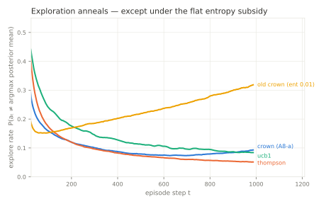
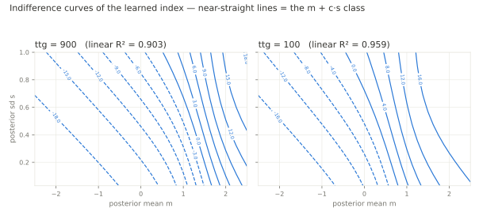
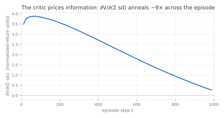
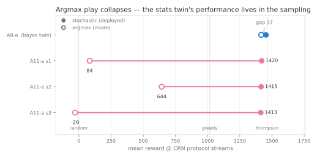
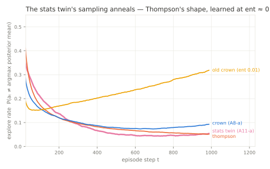
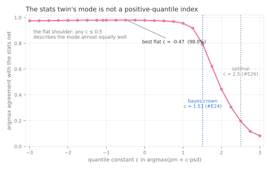
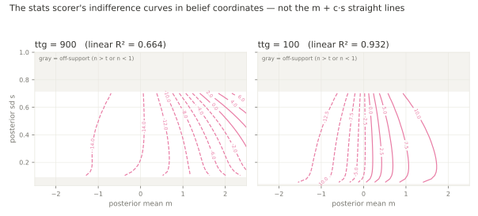

# What did the crown learn? — interpretation round (A8-a, #E23/#E24)

*(Artifacts — GIFs, per-policy metric JSONs, index-surface dumps — regenerate
into `results/gauss_K10_T1000/interpret/` via `mab_interpret.py` and
`mab_policy_probe.py`; committed figures in `figs/`; `results/` is
gitignored, this findings document is not.)*

Subject: **A8-a** (plain equivariant index policy @ A3-#6 HP; committed
3-seed mean 1453.57 ± 4.80, #E23). Deep dives on **a-s3** (1462.39, the ship
candidate); every structural claim was checked on all three seeds. Tools:
`mab_interpret.py` (battery / replay / tail), `mab_policy_probe.py`
(spec-§14 anchored readback), `mab_plot_policy.py` (figures). Probe
validated on known answers before discovery (§14.1): recovered UCB1's
analytic bonus to 0.12% median error; reproduced Thompson's #E17 anneal and
the old crown's inversion. Battery numbers are 8192-seed, CRN across
policies (shared latents ⇒ paired per-seed deltas are valid); replayed
policies carry fresh action draws, so replay means sit within draw noise of
the committed TSVs (crown_s3 1461.32 vs 1462.39; thompson 1463.19 vs
1462.38).

---

## The one-paragraph answer

The crown learned a **deterministic index in Thompson's clothing**: rank
arms by `posterior_mean + c·posterior_sd` with **c ≈ 1.5, nearly flat in
time** (c(ttg) = 1.51·(ttg/T)^0.079 — trajectory fit 1.60 → 1.16) — right at
Thompson's average bonus (E[max of 10 N(0,1)] = 1.54) and nowhere near
UCB1's growing σ√(2 ln t) ≈ 3.7. Its exploration *anneals* behaviorally
(0.26 → 0.09) because the bonus rides the shrinking posterior sd, exactly
Thompson's mechanism — but executed deterministically: the softmax
contributes nothing (a **12-number fitted table scores 1459.56 ± 6.33,
level with the 11k-parameter network it was read from**, 98% action
agreement — the §14.2 branch-1 claim, and the shippable artifact). Against
Thompson it is a different *risk profile*, not a different level: **+5.1
per seed on 98.8% of episodes** (cheaper exploration: explore-regret 49.7
vs 57.1) traded against a **1.2% wrong-lock tail at −569 per episode**
(final-ID 7% on those seeds where Thompson gets 100%) — netting to a
statistical tie (paired −1.9). UCB1 buys the opposite trade — the best
identification (95.6%) at an exploration premium (80.6) the prior doesn't
repay — and loses to the crown by 20. The critic knows all of this: V
correlates 0.97 with realized return-to-go *within* phases, and its
information price ∂V/∂(Σsd) anneals +3.8 → +0.4 across the episode — the
gradient that taught the actor everything above, with `ent_coef` ≈ 0.

---

## Rung 1 — measure (the metric battery, 8192 seeds, CRN)

| policy | reward | explore e→l | regret expl/expl’t | final-ID | lock t | alloc β | Δ vs thompson (paired) |
|---|---|---|---|---|---|---|---|
| thompson | 1463.19 | 0.325 → 0.052 | 57.1 / 11.0 | 0.945 | 28 | 1.09 | — |
| **crown a-s3** | **1461.32** | 0.264 → 0.089 | **49.7** / 20.2 | 0.923 | **24** | **0.98** | **−1.9** |
| crown a-s2 | 1450.96 | 0.216 → 0.061 | 40.8 / 39.5 | 0.878 | 23 | 0.69 | −12.2 |
| crown a-s1 | 1443.52 | 0.238 → 0.058 | 51.1 / 36.7 | 0.881 | 22 | 0.49 | −19.7 |
| ucb1 | 1440.79 | 0.380 → 0.085 | 80.6 / **9.8** | **0.956** | 25 | 1.28 | −22.4 |
| old crown (ent 0.01) | 1385.68 | 0.198 → **0.310** | 111.5 / 33.8 | 0.930 | 48 | 1.78 | −77.5 |
| greedy | 1015.69 | 0 → 0 | 0 / 515.1 | 0.353 | never | 0.56 | −447.5 |

Readings (structure measured during life, per the 2048 rule):

- **The anneal is real and general to the ent≈0 family** — all three crown
  seeds fall 0.22–0.26 → 0.06–0.09; the old crown (same network, flat
  entropy subsidy) *rises* to 0.31. The subsidy, not the architecture, set
  the shape.
- **Allocation is Thompson-shaped, not UCB-shaped**: alloc β (LS exponent of
  pulls vs 1/Δ) — crown 0.98 ≈ thompson 1.09, ucb1 1.28. Mechanism-level
  agreement says the same: the crown's action law sits close to Thompson's
  (TV 0.17 → 0.07 across phases) and far from UCB1's (act-match 14% → 6%).
- **The regret ledgers differ in kind**: thompson pays 57 to explore and 11
  to exploit; ucb1 pays 81 to explore for a 9.8 exploit bill and the best
  final-ID; the crown pays the *least* to explore (49.7) and eats the
  difference in exploit-regret (20.2) — see rung 3 for where.
- Seed robustness: s1/s2 share every qualitative pattern but are weaker
  levels (#E21's per-run spread, visible here as −12/−20 paired).

## Rung 2 — the anchored index readback (spec §14)

The actor *is* φ(m, s, ttg) per arm — so we read it directly:

- **Sane index**: strictly monotone in m at 100% of grid points, every slice.
- **Nearly the m + c·s class**: linear R² 0.90 (ttg=900) → 0.96 (ttg=10);
  the residual curvature concentrates at high-m/low-s (exploit corner).
- **The bonus**: c(ttg) = 1.51·(ttg/T)^0.079 on visited states — flat-ish,
  Thompson-sized (E[max z₁₀] = 1.54), annealing mildly 1.60 → 1.16. UCB1's
  multiplier *grows* 2.6 → 3.7 over the same episode. The behavioral anneal
  comes through s itself — the bonus is pegged to the posterior, learned.
- **§14.2 scored fit** (the trio, 8192 CRN): net-stochastic **1462.39** /
  **fitted 12-knot table 1459.56 ± 6.33** / fitted 2-param power law
  1451.12 ± 6.27; agreement with the net's argmax 98.0%. Branch 1 fires
  (|fitted − net| ≪ 1% of bar): **the crown implements
  argmax(m + c(ttg)·s), and the 12 numbers are the deployable artifact** —
  deterministic, no torch. The deterministic fit matching the *stochastic*
  net also shows the softmax adds nothing the c·s bonus doesn't provide.

## Rung 2b — the critic

- **Calibration without the Simpson split**: Pearson(V, realized
  return-to-go) = 0.97 overall and 0.85/0.98/0.89 within early/mid/late —
  unlike 2048's progress-tracking critic, this one forecasts fortune (the
  belief state is a sufficient statistic, so it can).
- **The price of information**: ∂V/∂(Σ sd) = +3.77 early → +0.40 late, a ~9×
  anneal. At ent≈0 this gradient is the only exploration teacher; #E22's
  mechanism, measured. (Normalized-return units; shape meaningful, scale not.)

## Rung 0 — watch (side-by-side replays, shared latents)

`replay_{win,loss,median}_seed{4891,73,3310}.gif` — crown (top) vs thompson
(bottom) on the same latent draw: posterior bars ± sd, true means as stars,
chosen arm colored explore/exploit, cumulative-regret race below. Seeds are
the paired extremes of the battery. Caveat recorded: stochastic policies
don't replay their recorded episode (fresh action draws) — the loss seed
re-lands negative but not at its recorded −1406, which is itself a
demonstration of within-seed draw variance.

## Rung 3 — the tail is the whole story of the Thompson gap

| | worst 100 paired seeds | other 8092 |
|---|---|---|
| paired Δ vs thompson | **−568.8** | **+5.1** |
| crown final-ID | **0.07** | 0.93 |
| thompson final-ID, same seeds | **1.00** | 0.94 |
| regret exploit / explore | 577 / 47 | 13 / 50 |
| top-two gap (hardness) | 0.54 | 0.41 |

Identity: 0.988·(+5.1) + 0.012·(−568.8) ≈ −1.9 = the overall paired delta.
The gap is not diffuse under-performance; it is a **rare premature-commit
failure**: ~1.2% of episodes where an early unlucky draw writes off the true
best arm and c ≈ 1.5·s never grows enough to force a revisit — the log-t
term UCB carries is precisely the insurance against this, and its 80.6-point
premium is why it loses everywhere else. Not instance hardness (corr with
top-two gap 0.08; Thompson solves all 100). **Candidate next lever** (not
run): a floor or late log-term in c(ttg) targeted at wrong-lock escape —
worth ~17 points of mean if bought without UCB's full premium; cheap to
test on the fitted rule *before* any training.

## Process note — a false alarm, caught by the round's own hygiene

During the battery I briefly concluded the recorded benchmark bars were
stale (pre-F1). Wrong: I had read `metrics_summary.json` written by a
**96-seed smoke run** as the full-battery result, and small-block means
(thompson 1490.2@96) diverge wildly from 8192 means. Official scalar
re-runs reproduce every recorded bar bit-exactly (thompson 1462.3796, ucb1
1440.7932, greedy 1015.6932, random −2.5113); the mtime-vs-commit forensics
had conflated commit time with code-change time (the 07-29 re-run used the
already-fixed working tree, committed 07-30). No ledger number was ever
wrong. Lessons, kept: **smoke artifacts must not share paths with record
artifacts** (fixed obligation for `mab_interpret.py`), and a summary file's
`n_seeds` field exists to be checked.

---

# Part II — what did the stats twin learn? (A11-a, #E29/#E30)

Subject: **A11-a** (the identical recipe — index class, A3-#6 HP, 20M —
with `obs=stats` through the share/avg feature map; committed 3-seed mean
1408.55 ± 8.66, #E29). Deep dives on **a-s2** (1417.69, the best seed);
direction checks on s1/s3. Tool: `mab_stats_probe.py`, which probes the
scorer in *belief* coordinates by running the (pm, psd) → (share, avg)
bijection inside torch and autograding through it, and — new instrument —
fits c **in action space** (the c whose rule argmax best matches the net's
argmax), because on visited states share and psd are deterministically tied
and a value-space regression can load the share-dependence with either
sign. Probe validated on a known answer first (§14.1): a synthetic
pm + 1.7·psd scorer written in stats coordinates is recovered to 2e-7
median autograd error, linear R² 1.0, behavioral fit c = 1.69 at 99.9%
agreement.

## The one-paragraph answer

The stats twin is **not an index policy — it is a learned Thompson**. Its
deterministic mode is a near-greedy, mildly *pessimistic* rule (best flat
c = −0.47; agreement ≈ 98% for any c ∈ [−3, +0.5], collapsing to 79% at
the bayes crown's c = 1.51 and 20% at the optimal 2.5 — the flat left
shoulder is itself the finding: late in the episode c is unidentified
because the sd's are tiny, and nowhere does a *positive* quantile describe
the mode), and that mode is worthless played straight: argmax evaluation
scores **643.60** on s2 (below greedy's 1015.69, final-ID 0.267), 83.85 on
s1, **−28.99 ≈ random** on s3 — stoch−argmax gaps of **772–1442** against
A8-a's 37. The performance lives entirely in the **sampling channel**: the
explore-rate anneals **0.31 → 0.05** across the episode — Thompson's shape
(0.35 → 0.05), the exact opposite of the old subsidized crown's inversion
(0.22 → 0.31, #E17) — carried by policy entropy falling 0.95 → 0.13 nats,
and learned at `ent_coef` ≈ 0, so no subsidy pays for it. The same
architecture, HP, budget, and objective therefore produce **two
qualitatively different solutions, selected by the encoding alone**:
handed the posterior, PPO writes exploration into the index surface (a
deterministic quantile rule, Part I); handed raw counts, it leaves the
index near-greedy and writes exploration into a posterior-calibrated
randomization schedule. #E29's reading of the 45.02 deficit sharpens
accordingly: the net did **not** "construct sd but slightly worse" — it
never built an uncertainty *bonus* at all; the 45 points are the measured
premium of randomized (Thompson-style) exploration over index
(quantile-style) exploration, the same trade Part I measured from the
other side (+5.1/seed on 98.8% of episodes for the deterministic index,
against its wrong-lock tail).

## Instruments and numbers (all on the standard CRN streams)

*(Figures regenerate via `mab_stats_plot.py` from the probe artifacts; the
contour figure's off-support band is the region no realizable state reaches
— n > t or n < 1 — which the free (m, s) grid of Part I's `fig_index`
does not mark.)*

**Why these come from probes and not from the eval runs.** A spec-§9 eval
TSV is a single aggregate row (`reward_mean`, `regret_mean`, oracle, the
semivariances) and these runs carry `gym_log: 0`, so no per-step or
per-episode trajectory was ever written. Two of the four figures are not
behavior at all — the c-agreement curve and the contour map probe the
*scorer's decision surface*, including belief states no episode reaches, so
no trajectory log of any resolution could contain them. The explore-rate
curve and the GIFs do need trajectories, and those must be rolled out from
the artifact: training-time logs would be trajectories of a *changing*
policy, not of the shipped one. The gap number is the exception that the
pipeline can produce, and it was checked there rather than assumed:
`mab_ppo_eval.py --no-stochastic` on the same checkpoint returns
**643.5999 ± 7.80**, matching the probe's 643.60 exactly (deterministic leg
⇒ both paths compute the same quantity). The probe substrate itself
(`VecSim`) is bit-identical to `MabEnv` on forced action sequences —
payouts and observations agree to 0.0 over six episodes.

**Watch it (rung 0)** — `mab_stats_probe.py --part gif` renders the #E30
story as Part-I-style replays, but the pair is the **same net, sampled vs
argmax** on shared latents (gitignored, under
`results/gauss_K10_T1000/interpret/`, cases in `stats_replay_cases.json`;
Part I's acceptance discipline — a case must reproduce its claimed
pseudo-regret effect on replay):

| case | seed | sampled | argmax | what it shows |
|---|---|---|---|---|
| `collapse` | 25 | 1060 | **−683** | the mode wrong-locks on a wrong arm while the true best sits unexplored; pseudo-regret climbs linearly. The sampled leg anneals its exploration (H → 0.01 nats) and flattens |
| `median` | 34 | 1559 | 843 | the typical seed: the mode finds *a* good arm, not the best; sampling buys ~700 |
| `survive` | 85 | 2205 | 2201 | the honesty case: when the empirical leader is the true best early, the mode is fine — the two legs coincide |

**The three-way race (`--part race`)** — the ablation above answers *which
channel carries the behavior*; this answers *who wins and why*. Thompson,
the bayes twin and the stats twin on one seed's latents, each played the
way it is deployed (Thompson samples its posterior, both nets sample their
softmax). Selection and acceptance are both on **pseudo-regret**, the
plotted and means-based quantity — Part I's argument that realized payout
is a random walk once a policy locks, so a payout-spread scan selects luck.
The gate earned its keep immediately: an early `spread` candidate selected
on payout spread (1569) replayed to a three-way tie and was discarded —
which is what moved both the scan statistic and the gate onto pseudo-regret.

| case | seed | thompson | bayes twin | stats twin | what it shows |
|---|---|---|---|---|---|
| `spread` | 194 | 18 | 20 | **1495** | thompson and the bayes twin both lock the best arm within noise of each other; the stats twin wrong-locks and bleeds linear regret for the whole episode |
| `typical` | 90 | 48 | 18 | 33 | the everyday picture: three routes to the same place, all inside 30 regret, differing only in how much each pays early |

(Final pseudo-regret, one draw each. Single episodes of stochastic
policies are illustrations, not evidence — the quantitative claims live in
the battery and the committed evals.)

**The same race on Part I's three seeds** (`--part race --seeds
7003,3310,4891` — no scan, no gate: the episodes are named in advance, so
the two rounds can be watched on identical latents). The #E24 labels
describe the crown-vs-thompson delta that *selected* those seeds in Part I;
they are provenance, not predictions about this draw:

The bayes leg is given Part I's exact action-draw stream, so these renders
**reproduce that round's crown episode bit-for-bit** — the thompson−bayes
pseudo-regret delta comes out at −1143.39 / −3.91 / +127.71, matching
`replay_cases.json` to the digit. The two rounds are therefore the same
episodes with a third policy added, not two similar-looking draws:

| #E24 role | seed | thompson | bayes twin | stats twin | this episode |
|---|---|---|---|---|---|
| `loss` | 7003 | 34.7 | **1178.1** | **1186.8** | the wrong-lock case, and **both twins fall into it** — thompson locks arm 5 (μ = 3.4) while the two nets settle on ~2.2-arms and bleed in parallel for the whole episode |
| `median` | 3310 | 81.0 | 84.9 | 62.2 | the everyday picture: all three inside 23 regret of each other, the stats twin marginally ahead on this draw |
| `win` | 4891 | 144.4 | **16.6** | **5.6** | the crown's win case, and the stats twin wins it too: both nets commit early and cheaply where thompson keeps paying for exploration it does not need |

Across all five race cases the pattern is the one #E29/#E30 quantify: the
twins agree with each other far more than either agrees with thompson —
they share both the cheap-exploration edge (4891) and the wrong-lock tail
(7003, and the stats twin alone at 194). The encoding changes *where the
exploration lives*, not the risk profile it buys.

> **Harness note, recorded because it cost a wrong claim.** The first
> version of this race gave all legs one shared generator, so the bayes and
> stats legs *interleaved* their draws and the bayes leg no longer saw Part
> I's stream. On seed 7003 that flipped its outcome — same artifact, same
> latents, same wrapper, regret **37.8 instead of 1178.1** — and the first
> write-up of this table read that as "the bayes twin locks correctly here."
> The defect: a leg's trajectory must not depend on which other legs share
> the render. Fixed with per-leg streams. The accidental perturbation is
> worth keeping as evidence, though, since it is a clean one: two draws of
> one policy on one instance, opposite outcomes — the behavioral form of
> #E24's finding that wrong-lock does not track instance hardness (corr
> 0.08). What a replay shows is a *(policy, latents, draw)* triple, and the
> draw is not optional.

| instrument | a11-s2 | bayes crown (Part I) |
|---|---|---|
| grid linear R² in belief coords, by ttg | 0.66 → 0.94 | 0.90 → 0.96 |
| … in the net's raw coords | 0.68 → 0.91 | — (native) |
| monotone-in-pm fraction | 0.58 → 0.99 | ~1.0 |
| behavioral c (flat) | **−0.47** @ 97.96% | ≈ +1.5 @ 98% |
| agreement at c = 1.51 / 2.5 | 79.2% / 19.7% | 98% / — |
| regression c on visited states | −2.99 → −0.73 (R² 0.65–0.92) | +1.60 → +1.16 |
| mode as a deterministic rule | knots 1187.83, powerlaw 1297.32 | 1459.56 ≈ net |
| stoch / argmax / gap | 1415.50 / 643.60 / **771.90** | ≈1462 / — / 37 |
| ↳ argmax via the eval pipeline (`--no-stochastic`) | **643.5999 ± 7.80** | — |
| final-ID stoch / argmax | 0.856 / 0.267 | 0.923 / — |
| explore-rate early → late | **0.309 → 0.051** (anneals) | 0.26 → 0.09 (in-index) |
| policy entropy early → late | 0.95 → 0.13 nats | ~0 contribution |
| mode agreement with the bayes crown | 81.8% | — |

s1/s3 robustness: the surface shape replicates (R² 0.61–0.90 / 0.70–0.85);
the gap direction replicates and is *stronger* (s1 argmax 83.85, s3 argmax
−28.99 — a seed whose deterministic mode is literally random).

## What this settles

1. **"Did it recover 1/√(1+n)?" — as a bonus, no.** The index surface is
   not affine in belief coordinates off the manifold, belief coordinates
   beat the net's own raw coordinates only marginally, and on visited
   states every description of the mode puts the uncertainty coefficient
   at ≤ 0. The conjugate transform the bayes obs hands over was not
   reconstructed as machinery; what was learned instead is a *schedule*.
2. **Where the 45.02 goes.** Not "worse index" — *different mechanism*.
   Annealed randomization is a good exploration scheme (Thompson itself is
   one, and this policy sits 96.3% of Thompson); the deficit is the
   premium of that mechanism against the tuned deterministic index the
   bayes twin found, consistent with Part I's tail anatomy.
3. **The self-annealing schedule, third sighting.** A8-a's bonus rides the
   shrinking psd (index channel); A8-b's β pegged itself to the posterior
   through ẑ's shape (shape channel); the stats twin anneals through its
   softmax temperature (sampling channel). In all three the anneal is
   *learned from the objective at ent ≈ 0* — the finite-horizon return
   itself teaches the schedule once the mis-priced subsidy is gone (#E22).
4. **D5/D7 is load-bearing again.** A8-a made the stochastic-eval
   convention look moot (gap 37); the stats twin makes it existential
   (gap 772–1442). Any argmax-scored eval of this artifact would have
   read it as a catastrophic failure and pruned the encoding a second
   time — O1's lesson, now at the artifact level.
5. **Findability, sixth instance, and the sharpest.** The index solution
   is representable in the stats class — the transform is a smooth map a
   64×64 scorer approximates easily, and the probe's synthetic-scorer
   validation *is* that construction — but PPO does not find it from raw
   counts; it finds the randomized optimum instead. The belief features
   do not add capacity; they make the index solution *findable*.

Deliverable note: nothing here changes the branch's ship candidate — the
#E26 formula stands. The stats branch needs no artifact; its value was the
answer above.

---

# Part III — what did the generalist learn? (#E36 / #E37)

Subject: the three **#E36 generalists** — one net trained across a §5.6
`ScenarioGrid` of 40 log-spaced cells, T ∈ [500, 10000], `obs=bayes_h`,
`policy=index_h`. Tool: `mab_generalist_readback.py`.

This is the only net in the campaign handed **`ttg` and `T` raw and
separately**. `_IndexHExtractor._split` scales both by the *constant* `t_max`
and never divides them, deliberately: their ratio is what #E26 fitted, so
manufacturing it would beg the question the round exists to ask.

**The probe's gate is two-sided, and that is the methodological point.** A
one-sided validation — "does it recover a known c?" — cannot show the probe is
able to *detect* T-dependence, which is the whole question. So the same
extraction runs on two analytic indices with known, opposite answers: #E26's
own rule (ratio-only by construction) must read q=0, and UCB1 (bonus depends on
elapsed t) must read q>0. Results: rule **q = 0.0000**, within-r spread 0.0000,
linear R² 1.000, recovering `2.5·r^0.15` to three digits; UCB1 **q = +0.0756**.
The control needed one repair first — with `n = 1/s²−1` floored at 1e-9 the
untouched-arm corner diverges and the fitted c reached ~1.6e4, so the gate
"passed" on a singularity; floored at n ≥ 1 it reads 3.33 → 5.06.

## The one-paragraph answer

The generalist is a **fixed-quantile index**: `argmax_i(pm_i + c·psd_i)` with
**c ≈ 0.85, constant**. Not a function of `ttg/T` (exponent 0.003, against the
#E26 rule's 0.15) and not of `T` (0.003, against #E32's 0.286) — given both
arguments raw, across a 20× range of horizons, it learned *one number*. That
number is about **⅓** of the fitted optimum `c*(n) = 1.204 + 0.286·ln(T/K)`,
and the shortfall widens (0.37 of it at T=500 → 0.28 at T=10000) because `c*`
grows with the horizon and `c` does not. Everything else follows from #E34,
which had already proved that class inconsistent: regret near-linear in T
(R² 0.9999 vs 0.9653 for log, while Thompson on the same cells fits log at
0.9978), and starvation that becomes total — at T=10000 only ~6 of 10 arms are
ever pulled and the runner-up gets a median of **2 pulls out of 10,000**.

| index | exponent in `r = ttg/T` | exponent in `T` | c |
|---|---|---|---|
| #E26 rule | **0.15** | 0 | 1.77 – 2.46 |
| A8-a specialist (Part I) | **0.079** | n/a — one horizon | 1.16 – 1.60 |
| **generalist, 3 seeds** | **+0.003** | **+0.003** | **0.75 – 0.99** |
| thompson (scale) | — | — | 1.54 = E[max z₁₀] |
| ucb1 | — | +0.076 | 3.33 – 5.06 |

## What this settles, and what it does not

1. **More freedom bought less structure.** A8-a, a specialist at one horizon
   handed `ttg/T` pre-divided, learned an exponent of 0.079. The generalist,
   free to do anything with both arguments, learned 0.003. The capacity went
   somewhere, but not into the time dependence it was given in order to find.
2. **All three pre-registered outcomes were wrong.** H-ratio, H-scale and
   H-neither each assumed *some* dependence. The answer was neither argument.
   H-ratio is technically satisfied (q≈0) but recording it as confirmed would
   be false — there is no ratio structure either.
3. **It corrected #E36's own verdict.** That entry attributed the long-horizon
   deficit to `gae_lambda` coverage. The proximate cause is the index class.
   Coverage survives only as a candidate for *why* a constant was learned — and
   it does not fit the shape, since coverage varies 20× across the grid while
   `c` does not vary at all. **Why the net collapsed to a constant is
   unresolved**, and it is the most interesting question this campaign leaves.
4. **Two claims died in the making, both recorded.** The trajectory-weighted
   fit is unusable here — the visited cloud is bimodal, >50% of arm-states at
   n ≤ 1, so a least-squares slope is a chord between clusters rather than a
   local exchange rate, and it disagreed with the grid fit by ~2×. And a
   behavioural reading ("one arm, 10,000/10,000, zero exploration") came from
   three rollouts with `deterministic=False` and the torch RNG unseeded; seeded
   at 32–64 episodes it is the phase change in the table above. Right in
   direction, false in its numbers.

Deliverable note: nothing here changes the ship candidate — the #E26 formula
stands, now with Part III as the clearest statement of what the *learned*
alternative actually is, and why #E34 stopped the search.
