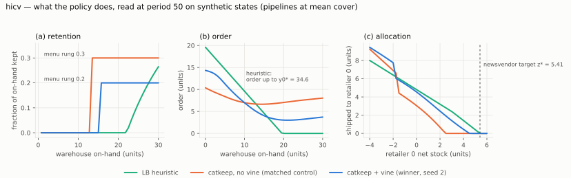

# INTERPRET.md — owmr policy readback (spec §14)

**Status: first readback done on `hicv` (2026-10-08, #E33 addendum 1); the
fitted rule (addenda 3–4: order up to y0* + 2.4, ship up to 0.75–0.8 z*, keep the rest)
scores 2,676.4, at or below the network — the stance holds in full on this cell;
`hipen_hicv` is owed.** The tight cell `base` carries the
instrument's negative control (#E36): the sweep recovers the heuristic as the
family's optimum there.

## The declared stance

**Discover** (`research_questions.tier2`, declared at Phase A 2026-09-22): in
the loose-bound cells (`hicv`, `hipen_hicv`) RL finds an ordering /
allocation structure the LB heuristic lacks — retaining stock at the
warehouse, allocating non-myopically — and a rule fitted to the trained
policy scores between the heuristic and the bound. The tight cells (`base`,
`hipen`) validate the readback instrument first.

## The instrument

`owmr_policy_probe.py` (spec §14.1): sweeps the trained network, loaded
exactly as the evaluator loads it, over synthetic states at mid-horizon
(period 50) and reports the order against warehouse on-hand, the allocation
to one retailer against its stock, the retained fraction against warehouse
on-hand, and the order against time to go; validated on a planted
order-up-to + target rule
(`owmr_test.py::test_probe_recovers_a_planted_order_up_to_rule`). Its loader
was fixed for artifacts trained with observation normalization off (the h4 /
h5 / h8 recipes carry no observation statistics) in #E33's readback; the
planted-rule test still passes.

`owmr_swap_probe.py` (#E6, #E30): closed-loop decomposition of the gap to the
heuristic by decision, five arms on one CRN block, paired per seed.

Fallback rate: under `order_catkeep` and `order_dirichlet` the decode makes
shipments sum to on-hand minus the kept share by construction, so the MDP's
feasibility scale-down cannot fire
(`owmr_test.py::test_catkeep_decode_and_no_fallback`,
`::test_dirichlet_decode_and_no_fallback`). It is 0 on every explicit arm.

## `hicv` — the #E33 winner (catkeep vine, seed 2, checkpoint 10M; 2,677.78 vs the bar 2,769.76)

**Swap decomposition** (8192 seeds, paired; G = −91.98 ± 0.81):

| part | arm contrast | Δ |
|---|---|---|
| allocation (RL allocation under the heuristic's order) | h_order − h_h | −73.95 ± 0.63 |
| of which split (heuristic's myopic split of RL's shipped amount) | rl_rl − h_split | −6.38 ± 0.30 |
| of which retention | allocation − split | −67.6 |
| order (RL order under the heuristic's allocation) | h_alloc − h_h | −46.24 ± 0.70 |
| interaction | G − allocation − order | +28.2 |

The two parts overlap: each decision alone buys more than the pair buys
together, so they are substitutes — retention at the warehouse and a lower
order both reduce the same retailer holding.

*Figure: the three decisions read off the probe's synthetic states at period 50 (`owmr_interpret_figures.py`; the heuristic computed on the same states). (a) the categorical head keeps nothing until the warehouse holds ~13–15 units, then a fixed rung — 0.2 for the winner, 0.3 for the control; the heuristic keeps only what its targets leave behind, from ~22 units. (b) the winner orders far more than the heuristic at an empty warehouse and far less once stocked; the heuristic is an order-up-to line. (c) the winner stops shipping to a retailer at ~4.75, the control at ~2.5, the heuristic at the newsvendor target 5.41.*

**What the probe reads** (period 50; the control = the same recipe without the vine, 2,744.42):

| reading | vine (winner) | control | heuristic |
|---|---|---|---|
| retention rule | keeps **0** below ≈ 15.4 units on-hand, **20%** above — a step | 0 below ≈ 13.1, 30% above | ships everything (wh share 0.017) |
| menu levels used | {0, 0.2} of (0, .1, .2, .3, .5, .8) | {0, 0.3} | — |
| allocation to retailer 0 | ships 0 once its stock ≥ 4.75; target flatness 1.48 | ships 0 once its stock ≥ 2.5; flatness 2.68 | newsvendor target z* ≈ 5.41 per retailer (Σ z* = 27.06) |
| order vs warehouse on-hand | 14.3 at an empty warehouse, falling to 3.0 at 21 units, rising slightly after; order-up-to flatness 19.4 — **not** an order-up-to rule | 10.4 falling to 6.6 at 14, rising to 8.0 at 30; flatness 27.7 | order-up-to y0* = 34.59 (echelon) |
| order vs time to go | flat (range 1.2 over the horizon) | declining toward the end (9.1 → 7.7) | stationary |

Reading: the structure the stance named is there and it is simple — a
**threshold retention rule** (keep a fixed fifth of warehouse stock once the
warehouse holds more than ≈ 15 units, else ship everything), **tighter
allocation targets** than the newsvendor's, and an order that responds to
warehouse stock far more steeply than an order-up-to rule does. The vine's
policy keeps less than its control (20% vs 30%, and only above a higher
threshold) and scores 67 better, so the retention level is not "more is
better": it has to match the order. The non-order-up-to shape of the order
is the reading to treat with care — the sweep moves warehouse on-hand with
the rest of the state fixed at mid-horizon mean cover, and a policy that
reads the echelon position through several features can look non-flat on a
one-dimensional slice.

**First fitted form, scored (#E33 addendum 2).** The LB heuristic's order
and split with a step retention rule, keep k of on-hand above θ, swept over
k ∈ {0.05 … 0.5} × θ ∈ {0, 5, 10, 15, 20} at 8192 seeds paired
(`owmr_keep_rule_probe.py`; k = 0 reproduces the heuristic seed for seed):
**every point is worse than the heuristic**, monotonically in k at every
threshold (θ = 15, k = 0.2: +7.4 ± 0.2; θ = 0, k = 0.2: +70.2; k = 0.05 at
θ = 20: +0.3). Each buys retailer holding and loses more in shortage. Since
RL's own allocation under the same heuristic order gains −74 (the h_order
swap arm), the kept amount in the winner is not a share of the warehouse: it
is what remains after shipping to tighter per-retailer targets (≈ 4.75
against the newsvendor's 5.41). The one-dimensional retention curve above is
a slice of that rule, not the rule.

**Second form, scored (#E33 addendum 3) — the stance's second clause holds.**
The heuristic's order with each retailer shipped up to α · z*_i and the
leftover kept (the heuristic's own split when short; `--alpha`; α = 1 is the
heuristic seed for seed), α swept 0.5–0.95 at 8192 seeds paired:

| α | 0.55 | 0.60 | 0.65 | **0.70** | **0.75** | 0.80 | 0.90 |
|---|---|---|---|---|---|---|---|
| Δ vs bar | −4.6 | −43.9 | −68.4 | **−80.0 ± 0.8** | **−80.6 ± 0.7** | −72.4 | −39.0 |

**2,689.2 at α ≈ 0.72, inside the bracket** (7.6% above the bound against
the heuristic's 10.8%), 88% of the winner's −92.0, keeping the same amount
at the warehouse (share 0.140 vs 0.134, warehouse holding +114 vs +113).
The rule: *ship each retailer up to about 0.72 of its newsvendor target and
keep the rest at the warehouse; order and shortage split as the heuristic
does.* The winner's remaining 11 is its order (the −46 order part and the
+28 interaction say the order and the targets substitute).

**Order clause, scored (#E33 addendum 4) — the stance holds in full.** The
same rule with the order-up-to level y swept beside α: a plateau at
y = 36–37, α = 0.75–0.80 scores **2,676.4 (−93.3 ± 0.9 vs the bar)**, and
paired seed for seed against the RL winner it is **−1.4 ± 0.6**: the fitted
rule is at least as good as the network it was read from. The whole policy
in two scalars on top of the LB heuristic:

> order up to y0* + 2.4 (37 instead of 34.6); ship each retailer only up to
> 0.75–0.8 of its newsvendor target and keep the rest at the warehouse; split
> as the heuristic does when on-hand is short.

Once stock is held back, the relaxed system's echelon level is too low, and
that raised level is the "order part" the swap probe measured (−46) and the
"non-order-up-to" shape the one-dimensional probe drew. The cost surface is
flat across trades near the optimum (the rule saves more shortage and less
retailer holding than the winner at the same total), so the network's own
point is not special.

**Owed.** The same two-parameter fit on `hipen_hicv`, the second discover
cell, once it is opened (left closed by the human's instruction).

Evidence: each run's probe JSON (in its checkpoints' probe folder), the swap
records beside the winner (one per arm, with per-seed files), the fitted-rule
records in the cell's benchmark folder; `ESCALATION.md` #E33 and its addenda
1–5 (addendum 5 is the control's +10M extension: the vine's edge is the lever,
not budget).

## `base` — the instrument's negative control (#E36)

The same two-parameter sweep on the tight cell, where the heuristic is within
0.63 of the optimum (#E26): the minimum over α ∈ {0.7 … 1} × y0 ∈ {y0* − 2 …
+3} is the heuristic itself (α = 1, y0 = y0*, Δ 0.00), the nearest other point
is +2.1 (α = 0.95), and y0* ± 1 costs +11 to +14. The instrument finds nothing
where there is nothing to find, and the −93 rule on `hicv` is not an artifact
of the family. `base`'s RL residual (+3.8 at the vine's floor) is not a missed
rule in this class.

## Why this file existed at Stage 1

At this folder's pin, `mdp_conformance research.deliverables` required this
file and the probe to exist whenever a confirm/discover stance was declared,
with no "owed" state, and `mdp_stage --for solve` blocked on it — so a stance
declared at Phase A as the formalize skill instructed would have stopped the
pipeline between build and solve. A placeholder kept the declared stance in
the IR and the gate open; the sequencing defect was filed upstream as
https://github.com/tong-wang/auto-mdp-solver/issues/92 (recorded on
`ESCALATION.md` #E1) and fixed in v0.11.4. This folder's readback replaced
the placeholder at Stage 5.
