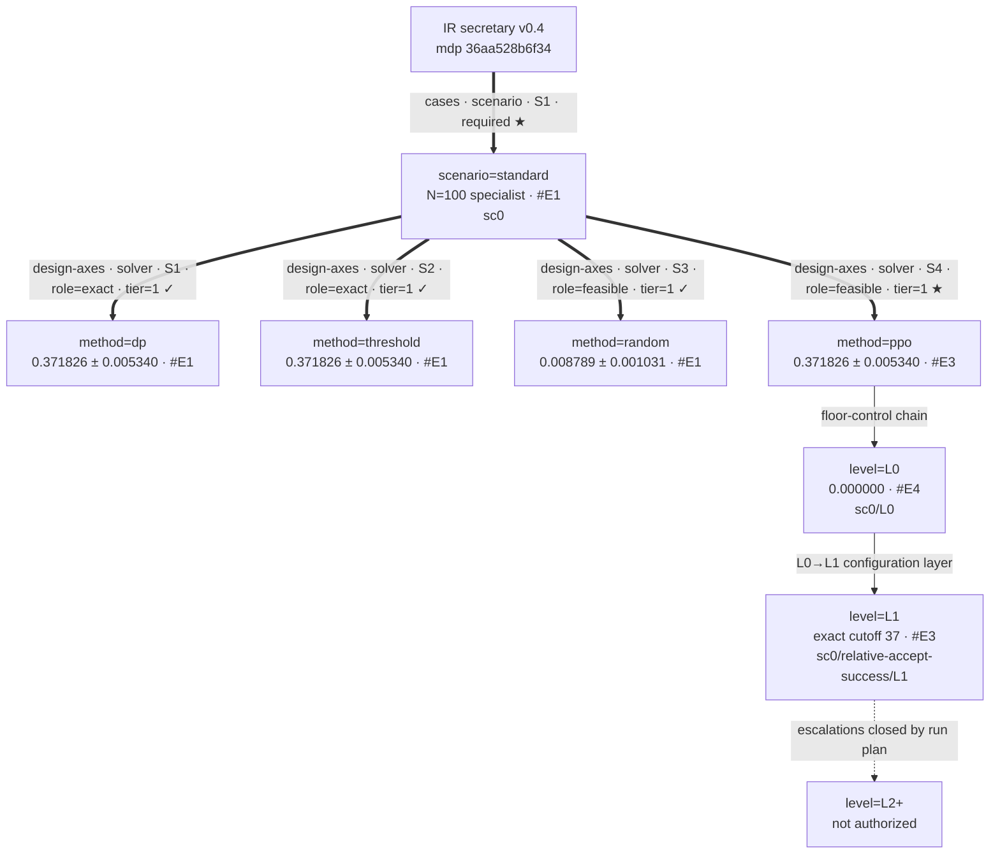

# secretary — escalation log

This file is the campaign map and append-only evidence ledger. The confirmed
run plan permits no L2+ search: if the L1 gate shows a healthy-build gap, the
campaign stops and asks for new authorization.

## MAP (as of 2026-09-22)

### Design tree

### Layers and node readings

| node | kind · attributes · tier | reading | entry |
|---|---|---|---|
| `scenario=standard` | cases · required · tier=1 | One specialist target; protocol seeds `0..8191` | [#E1](#E1) |
| `method=dp` | design-axes · exact · tier=1 | Backward induction: skip 37; analytic value `0.371042778713` | [#E1](#E1) |
| `method=threshold` | design-axes · exact · tier=1/2 | Gilbert–Mosteller finite-`N` rule; episode-identical to DP | [#E1](#E1) |
| `method=random` | design-axes · feasible · tier=1 | Independent fair-action floor | [#E1](#E1) |
| `method=ppo` | design-axes · feasible · tier=1/2 | Selected L1 is protocol-identical to DP and recovers cutoff 37 exactly | [#E3](#E3) |
| `level=L2+` | escalations · tier=3 | Closed: escalation budget is `none` | [#E2](#E2) |

### Frontier

Frontier as of [#E2](#E2).

1. **A1 — complete L0/L1 at `standard/method=ppo`** ✓ — both declared 2M-step runs reached budget ([#E3](#E3), [#E4](#E4)).
2. **A2 — select L1 checkpoint** ✓ — 1.8M checkpoint won the protocol confirmation shortlist.
3. **A3 — protocol evaluation and gate** ✓ — L1 passes; L0 reporting row complete.
4. **A4 — structural readback** ✓ — cutoff 37, 100% action agreement, paired fitted/net/DP equality ([#E3](#E3)).

- parked: **L2+** — tripwire: a healthy L1 build misses the gate *and* the user grants a new escalation budget.

### Off-tree register

- Post-hoc checkpoint selection is a protocol obligation, not a solver branch.
- The DP/threshold equality check calibrates the exact reference and is complete ([#E1](#E1)).

### Current best bundle

The crowned learned bundle is `sc0/g0/a0/h0`, selected at 1.8M steps. It
implements cutoff 37 exactly and is episode-identical to DP at the standard
protocol. The theoretical success probability is `0.371042778713`.

## FRAME-CHANGELOG

- 2026-09-22 INTRODUCED the single-scenario specialist tree, exact-reference siblings, L0→L1 floor-control chain, and explicitly parked L2+ ([#E1](#E1), [#E2](#E2)).

## IR-CHANGELOG

### F1 2026-09-22 — moved the realized permutation from scenario to episode state

decision: Ownership and initialization of the random candidate order.

initial: The first formalization treated a seed-indexed permutation as a
concrete scenario, because the v0.11.4 interpreter expresses reset randomness
through its world-sampler mechanism and the generated code mirrored that
mechanism too literally.

signal: Human veto during Phase A; the user stated that a scenario contains
setting hyperparameters such as `n_candidates`, while every reset creates a new
problem instance.

symptom: `SecretaryScenario` contained `arrival_order`, and a callable
`SecretaryScenarioSource` manufactured one concrete scenario per episode.

fix: The IR copies `initial_arrival_order` into latent state at initialization;
generated `init_state` performs the seeded draw and stores it in
`SecretaryState.arrival_order`. `SecretaryScenarioSource` was removed and
`SecretaryScenario` is settings-only. The MDP fingerprint moved from
`fa8de02d146e` to `36aa528b6f34`; conformance, laws, and the 40-episode
bit-exact differential all pass.

deviation: auto-mdp-solver v0.11.4 has no sanctioned generated-code shape for
an IR world sampler whose realization is episode state while the scenario
remains settings-only. The generated domain therefore performs this draw at
`init_state`; `secretary_uncertainty.RankingUncertainty` describes the uniform
ranking distribution, owns its canonical v2 seed stream, and implements
`sample()`. `init_state` invokes that source once per reset and stores the
realization in state. This is intentional and documented rather than hidden.
No upstream proposal was filed while work was restricted to this project.

rule: If randomness is redrawn for every reset while the setting remains
fixed, classify the realization as episode state even when the IR interpreter
uses a world-sampler primitive to initialize it; never copy that interpreter
mechanism into scenario ownership in generated code.

## CONFIG-REGISTRY

The campaign has only the L1 origins; no promoted L2 configuration exists.
Origin values are read from `secretary_ppo_train.py`'s parser and
`_L1_DERIVED`, not duplicated here.

### scenario

| id | key in `SCENARIOS` | note |
|---|---|---|
| `sc0` | `standard` | `N=100`, specialist target |

### gym · `g`

| id | parent | delta | why it exists / what promoted it | cell tuned in |
|---|---|---|---|---|
| `g0` | — (L1 origin) | `relative` / `accept` / `success`; observation and reward normalization on | §8.6 derivation; reserved | — |

### arch · `a`

| id | parent | delta | why it exists / what promoted it | cell tuned in |
|---|---|---|---|---|
| `a0` | — (L1 origin) | `MlpPolicy` | two-dimensional vector observation; reserved | — |

### hp · `h`

| id | parent | delta | why it exists / what promoted it | cell tuned in |
|---|---|---|---|---|
| `h0` | — (L1 origin) | complete values in `_L1_DERIVED`; `gamma=1`, rollout `512×4`, `gae_lambda=0.99` | §8.6 derivation; reserved | — |

### Constraints

| id | requires |
|---|---|
| `sc0` | `h.gamma = 1.0` — the objective is undiscounted |

### Current bases

| axis | current | since |
|---|---|---|
| `sc` / `g` / `a` / `h` | `sc0` / `g0` / `a0` / `h0` | [#E2](#E2) |

## LEDGER

### #E1 2026-09-22 — two independent constructions recover the literature optimum

address: `standard / solver={dp,threshold,random}` / A0
↑ [design tree](#MAP) — explains `method=dp`, `method=threshold`, and `method=random`.

hypothesis: Backward induction and exact maximization of the finite-`N`
threshold formula both produce the optimal skip count 37 and identical actions.

runs: `secretary_benchmark_dp.py`, `secretary_benchmark_dp_eval.py`,
`secretary_benchmark_threshold_eval.py`, and
`secretary_benchmark_random_eval.py`; shared seeds `0..8191`.

verdict:

| arm | role | success mean | SE | expected selected rank |
|---|---|---:|---:|---:|
| DP | exact | 0.371826 | 0.005340 | 20.0392 |
| threshold, skip 37 | exact | 0.371826 | 0.005340 | 20.0392 |
| fair random action | feasible | 0.008789 | 0.001031 | 50.4430 |

DP and threshold sidecars are byte-identical over all episodes. Their
empirical mean is consistent with the analytic value `0.371042778713`.
Status: ✓

### #E2 2026-09-22 — L0 and L1 measure the value of the derived configuration

address: `standard / method=ppo / L0→L1` / A1
↑ [design tree](#MAP) — explains `method=ppo`, `level=L0`, and `level=L1`.

hypothesis: The derived L1 configuration learns a competitive record-based
stopping rule, while L0 provides the faithful-default floor. The arbiter is the
post-hoc checkpoint selection plus the 8,192-seed protocol evaluation—not the
training curve.

runs:

- `PPO_20260922_161352_L0_obsrelative_actaccept_rewsuccess_learning_rate0.0003_lr_final0.0003_clip_final0.2_n_envs1_n_steps2048_batch_size64_target_kl0_gae_lambda0.95_ent_coef0_norm_obsFalse_norm_rewardFalse_control`
- `PPO_20260922_161352_L1_obsrelative_actaccept_rewsuccess_backbone`

verdict: Both arms reached the declared 2M-transition budget (`2,000,896`
transitions actually run) and were evaluated on protocol seeds `0..8191`.

| level | artifact scored | success mean | SE | gap from DP | expected selected rank | gate role |
|---|---|---:|---:|---:|---:|---|
| L0 | terminal control | 0.000000 | 0.000000 | −0.371826 | 76.9453 | reporting-only floor |
| L1 | selected 1.8M checkpoint | 0.371826 | 0.005340 | 0 | 20.0392 | PASS; 100% of reference |

L1 beat the random baseline by `+0.363037` (`z=66.75`) and was
episode-identical to exact DP. L0 failed as a candidate but completed its role
as the faithful-default floor. Detailed L1 selection and structural evidence
are recorded in [#E3](#E3); the L0 diagnosis is recorded in [#E4](#E4). No
L2+ run was needed or authorized. Status: ✓

### #E3 2026-09-22 — L1 reaches the exact bar and recovers its structure

address: `standard / method=ppo / L1 / policy readback` / A2–A4
↑ [design tree](#MAP) — explains `method=ppo` and `level=L1`.

hypothesis: A competitive L1 artifact should implement the predicted
skip-then-accept-record rule; a fitted cutoff whose score differs from the net
by at most 1% of the exact bar confirms the structure.

runs: `secretary_select.py` over all 20 L1 checkpoints on selection seeds
`1_000_000..1_002_047`, with the top five confirmed on protocol seeds
`0..8191`; `secretary_policy_probe.py`; fitted-rule protocol evaluation.

verdict:

| arm | success mean | SE | gap from DP | structure |
|---|---:|---:|---:|---|
| exact DP | 0.371826 | 0.005340 | 0 | cutoff 37 |
| selected PPO, 1.8M | 0.371826 | 0.005340 | 0 | cutoff 37 exactly |
| fitted PPO rule | 0.371826 | 0.005340 | 0 | cutoff 37 |

PPO beats the random baseline by 66.75 SE and passes `mdp_gates`. The three
per-seed outcome files are identical. On all 4,950 valid nonterminal states,
action agreement with DP is 100%, with zero non-record acceptance. Status: ✓

### #E4 2026-09-22 — faithful defaults do not learn a deployable stopping rule

address: `standard / method=ppo / L0` / A1–A3
↑ [design tree](#MAP) — explains `level=L0` and the L0→L1 edge.

hypothesis: L0 is the reporting-only ruler for the configuration layer; it is
not required to pass the baseline gate.

runs: `PPO_20260922_161352_L0_obsrelative_actaccept_rewsuccess_learning_rate0.0003_lr_final0.0003_clip_final0.2_n_envs1_n_steps2048_batch_size64_target_kl0_gae_lambda0.95_ent_coef0_norm_obsFalse_norm_rewardFalse_control`, 2M transitions, protocol seeds `0..8191`.

verdict: deterministic L0 scored `0.000000 ± 0.000000` success with expected
selected rank `76.9453`, a `−0.371826` gap from DP (`z=−69.63`). L1’s exact
recovery is therefore a configuration-layer result, not inherited library
behavior. Status: ✗ as a candidate; ✓ as the required floor measurement.
