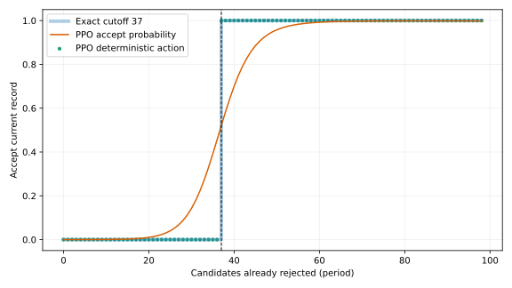

# Secretary PPO policy interpretation

## Verdict

The declared `confirm` stance is confirmed cleanly. The selected PPO artifact
implements the classical finite-`N` secretary rule exactly on the complete
valid nonterminal observation grid:

- reject the first 37 candidates;
- thereafter accept a candidate exactly when their relative rank is 1;
- never accept a non-record candidate.

The fitted skip/record rule, raw PPO network, exact backward-induction policy,
and Gilbert–Mosteller threshold policy produce identical per-episode outcomes
on all 8,192 protocol seeds.

## Artifact and protocol

The probed artifact is the selected 1.8M-step checkpoint promoted to
`standard_ppo.zip` in
`PPO_20260922_161352_L1_obsrelative_actaccept_rewsuccess_backbone`. It uses the
saved `vecnormalize.pkl` and deterministic actions, exactly as the protocol
evaluator does. The reporting block is episode seeds `0..8191`.

The probe writes its raw sweep to the run’s `probe/action_surface.tsv` and its
machine-readable conclusions to `interpret/summary.json` and
`interpret/fitted_rule.json`.

## Known-answer validation

The instrument was validated against two known answers before interpreting the
network:

1. Backward induction and exact maximization of the literature threshold
   formula independently recover skip count 37 and theoretical success
   `0.371042778713`.
2. The selected network’s protocol sidecar is byte-identical to the DP
   sidecar across 8,192 episodes.

Thus the action-surface sweep is anchored to both a known structural solution
and the already-scored protocol behavior.

## Action-surface findings

The sweep covers every valid pair `(period, relative_rank)`—5,050 states in
total, of which 4,950 nonterminal states have a meaningful action comparison.

| statistic | result |
|---|---:|
| recovered skip count | 37 |
| exact single-threshold form | yes |
| agreement on all valid nonterminal states | 100% |
| agreement on record states | 100% |
| non-record acceptance rate | 0% |
| transitions in the record-state action | 1, at period 37 |

The feature-sensitivity sweeps show the intended mechanism: changing time to
go crosses one decision boundary for a record candidate, while increasing
relative rank away from 1 always switches or keeps the action at reject.

## Paired scoring of the fitted rule

The verdict branches were fixed before scoring:

1. fitted-versus-net gap at most 1% of the exact bar: claim structural recovery;
2. larger gap: diagnose a non-threshold mechanism;
3. no fitted structure: inspect the action interface first.

The first branch fired with zero gap:

| arm | success mean ± SE | absolute gap from DP | expected selected rank |
|---|---:|---:|---:|
| exact DP | 0.371826 ± 0.005340 | 0 | 20.0392 |
| fitted cutoff-37 rule | 0.371826 ± 0.005340 | 0 | 20.0392 |
| selected PPO network | 0.371826 ± 0.005340 | 0 | 20.0392 |

The three per-seed outcome files are identical. Fitting neither improves nor
degrades the network because the deterministic network already implements the
rule without any action-level raggedness.

## Overlay



The orange curve is PPO’s probability of accepting a current record; green
points are its deterministic actions; the broad reference step marks the exact
cutoff-37 rule. The interactive render is generated beside results and is not
tracked.

Regenerate the probe and both figure renders from `secretary/`:

```bash
python secretary_policy_probe.py --model-path results/standard/PPO_20260922_161352_L1_obsrelative_actaccept_rewsuccess_backbone/standard_ppo.zip
MPLCONFIGDIR=/tmp/secretary-mpl python secretary_plot_policy.py --model-path results/standard/PPO_20260922_161352_L1_obsrelative_actaccept_rewsuccess_backbone/standard_ppo.zip
python secretary_benchmark_fitted_eval.py -s standard --fit-path results/standard/PPO_20260922_161352_L1_obsrelative_actaccept_rewsuccess_backbone/interpret/fitted_rule.json --n-seeds 8192 --first-seed 0
```
