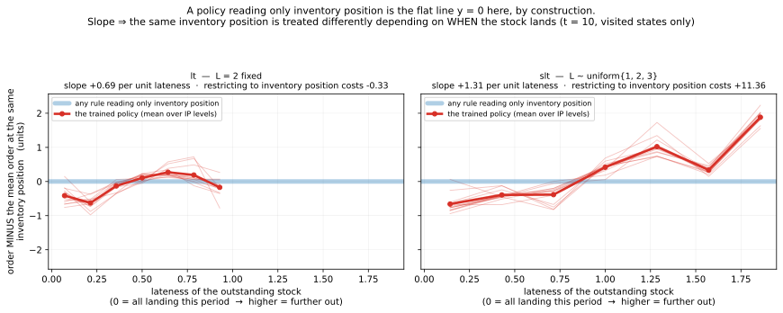
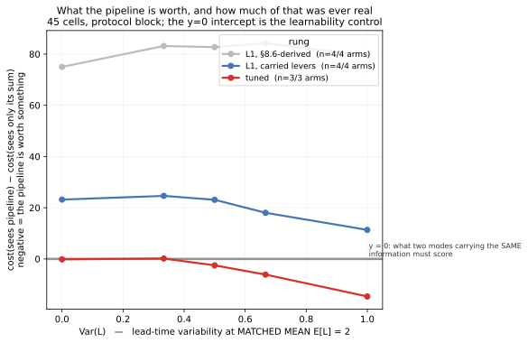

# inv_single — escalation log (campaign 2, the restart)

Born 2026-08-27 with the campaign restart, at the **v0.9.31** solver pin.
The first campaign's log — 156 `#E` references, §MAP scores, verdicts — was
produced under the discarded 256-seed live-selection protocol and is retired
with its results: read it at `git show 27e0546:inv_single/ESCALATION.md`.
Its two changelog sections are **not** results and are transplanted below
(§FRAME-CHANGELOG, §IR-CHANGELOG) so the formalization lineage stays in the
live log. `#E` ids restart at #E1; pre-restart ids are cited as `c1#E4` etc.

## Campaign question

Six declared tier-2 research questions (`inv_single_schema.json`
`research_questions.tier2` — authoritative; one line each here):

| RQ | stance | question |
|---|---|---|
| RQ-1 | confirm (primary) | does PPO recover order-up-to at K=0 / (s,S) at K>0, thresholds and not just cost? |
| RQ-2 | bypass | is handing the policy inventory position worth anything when the net can rebuild it (`lt`) — and does the answer flip where IP stops being sufficient (`slt`)? |
| RQ-3 | discover | under lost sales with lead time (no exact DP), does RL beat tuned base-stock, deviating the direction theory predicts? |
| RQ-4 | discover | what structure does the policy use under stochastic lead time with order crossover, where IP-measured rules are all suboptimal? |
| ~~RQ-5~~ | — | **withdrawn 2026-08-27**, downgraded to `README.md`'s `3-methodology` section Q-B: action encoding is a rendering question, not a policy-structure one. Answered first (#E4), reclassified same day; the id is retired, never reused |
| RQ-6 | confirm | does one context-observing policy carry the (s,S) map across the 16-cell (b, K, LT) grid? |

Experiment layout: the restart plan's 12 L1 arms × 4 seeds + 7 L0 controls.
That plan was untracked to `scratch/` on 2026-09-07 (round plans are never
tracked); every arm it scheduled is recorded in this ledger and in `README.md`.

## Standard eval protocol

Spec §9.7 three-layer, every arm, every benchmark:

- **screen** — `inv_single_select.py <run_dir>`: ~20 checkpoints ranked on
  2048 CRN seeds at `SELECT_SEED_OFFSET`; scores never quoted; top-3 forward.
- **confirm/report** — `inv_single_ppo_eval.py --model-path <ckpt>
  --first-seed 0 --n-seeds 8192`: the protocol block, shared across arms and
  benchmarks, so per-seed differences are paired. 65536 seeds only for the
  final shipped artifact.
- **gate** — `python -m mdp_gates --candidate <tsv> --baseline <random>
  --baseline <myopic> [--reference <dp>] --ir inv_single/inv_single_schema.json
  --n-seeds 8192`. The DP is `--reference` **only** where its `exact` role
  holds (backlog + deterministic LT — includes every grid16 cell); at `slt`
  the DP table is a *feasible* arm; at lost-sales targets the bar is
  optimized base-stock.
- **launch** — every L1+ run cites a §CONFIG-REGISTRY tuple
  (`--config sc2/g1/a0/h0`) and its comparator (`--comparator <run>`);
  `assert_launch` refuses undeclared deviations, design-axis overwrites,
  and budget-confounded comparators at launch time.

<a id="MAP"></a>

## MAP  (as of 2026-09-12)

### Design tree

Ten scenario cells, one `cases · scenario` split: **three crowned** (`simple`,
`simple_k`, and `lt_lost_sales` — 99.95% of its exact bar, #E18, crowned by #E22
clearing its last deliverable) and **six covered** — `lt`, `slt`, `lost_sales`
(**by collapse**, #E14, not by an arm), `grid16` (#E23: 96.5% median of each
cell's exact DP), `lt_variance_k0` (#E19) and `cost_leadtime` (#E24: scored, not
trained). **No coverage debt remains.** `lt_variance_k20` was `required` until
2026-09-14, when the root was re-framed to the `K=0` family and the cell became
an `optional` **open extension** (§FRAME-CHANGELOG) — which an `optional` child
may be at close, and which is not a prune: `cases` children are postponable,
never prunable, and this one keeps its tripwire.

Marks ride on edges. Nodes carry three rows — `axis=option` / `score · #E` /
config address (§3.1, §13). The scenario layer names **which kind of object the
sibling is** (§3.1) — a `{Domain}Scenario` or a `{Domain}ScenarioGrid` — so
every sibling reads `scenario=`, grids included.

**The §8.6 level ladders draw as chains** (§3.2), `L0 → L1 → L2`, never as
sibling sets: L0 is reporting-only and never crown-eligible, so a reader must
not be able to mistake "we started here and escalated" for "we compared these
and one lost". A chain rung therefore reports the measurement **at its own
level**, and the best-in-subtree convention resumes at the node above the
ladder.

```mermaid
graph TD
    ROOT["IR inv_single v0.4<br/>mdp 84a22814f666 · structural 40f9149f9a0e · F6"]


    ROOT ==>|"cases · scenario · S1 · required ★"| SC0["scenario=simple<br/>176.11 best in subtree · #E9<br/>sc0/g4/a1/h2"]
    ROOT ==>|"cases · scenario · S2 · required ★"| SC1["scenario=simple_k<br/>618.96 best in subtree · #E9<br/>sc1/g4/a1/h3"]
    ROOT ==>|"cases · scenario · S3 · required ✓ covered"| SC2["scenario=lt<br/>550.63 best in subtree · #E10<br/>unregistered cell"]
    ROOT ==>|"cases · scenario · S4 · required ✓ covered"| SC3["scenario=slt<br/>723.83 best in subtree · #E11<br/>unregistered cell"]
    ROOT ==>|"cases · scenario · S5 · required ✓ covered BY COLLAPSE"| SC4["scenario=lost_sales<br/>176.09 best in subtree · #E14<br/>sc0/g4/a1/h2 transferred, not retrained"]
    ROOT ==>|"cases · scenario · S6 · required ★"| SC5["scenario=lt_lost_sales<br/>416.01 best in subtree · 99.95% of exact · #E18/#E22<br/>unregistered cell"]
    ROOT ==>|"cases · scenario · S7 · required ✓ covered"| SC6["scenario=grid16<br/>534.7 mean-over-cells · 96.5% median of exact · #E23<br/>unregistered cell"]
    SC6 -->|"design-axes · solver · role=exact · tier=1 · per cell"| M6DP["method=dp<br/>511.2 mean over 16 cells · #E1 · exact at EVERY cell"]
    SC6 ==>|"design-axes · solver · role=feasible · tier=1 ★"| M6["method=ppo<br/>534.7 best in subtree · #E23<br/>unregistered cell"]
    M6 ==>|"design-axes · gym.observation_modes · tier=2 ★ context"| O6C["observation_mode=vec_ctx<br/>534.7 · 96.5% median · #E23<br/>unregistered cell"]
    M6 -->|"design-axes · gym.observation_modes · tier=2 ✓ blind control"| O6B["observation_mode=vec<br/>650.8 · 78.5% median · #E23<br/>unregistered cell"]
    O6C -->|"chain · level · L0 floor, §8.6 reporting-only ✓"| L0G["level=L0<br/>1877.6 · #E23<br/>sc6/L0"]
    L0G -->|"chain · level · L1 carried recipe · tier=3 ✓"| L1G["hp=derived-carried<br/>564.4 · 92.6% median · #E23<br/>sc6/g2/a1/h1 + norm_obs, ent_coef"]
    L1G ==>|"chain · level · L2(hp) · tier=3 ★ 179 trials"| L2G["hp=tuned @4M<br/>534.7 · 96.5% median · #E23<br/>unregistered cell"]
    ROOT ==>|"cases · scenario · S8 · required ✓ covered"| SC7["scenario=lt_variance_k0<br/>475.76 best in subtree · #E19<br/>sc7, unregistered cells"]
    ROOT -->|"cases · scenario · S9 · optional ⏸ scope cut 2026-09-14"| SC8["scenario=lt_variance_k20<br/>open extension · K&gt;0 asks a trigger question, not a statistic one<br/>sc8"]
    ROOT ==>|"cases · scenario · S10 · required ✓ covered"| SC9["scenario=cost_leadtime<br/>54 cells · b-interp 96.5% / LT-interp 55.1% · #E24<br/>evaluation grid, no training"]
    SC9 -->|"design-axes · solver · role=exact · tier=1 · per cell"| M9DP["method=dp<br/>exact at all 54 cells · #E24"]
    SC9 ==>|"design-axes · solver · role=feasible · tier=1 ★ scored, not trained"| M9["method=ppo (grid16 generalist)<br/>seen 95.8% · b-interp 96.5% · LT-interp 55.1% · #E24<br/>grid16 ctx_b, not retrained"]

    SC7 -->|"design-axes · solver · role=exact · tier=1 · p=0 slice only"| M7DP["method=dp<br/>373.61 · #E16 · exact where L is deterministic"]
    SC7 ==>|"design-axes · solver · role=feasible · tier=1 ★"| M7["method=ppo<br/>475.76 best in subtree · #E19<br/>unregistered cell"]
    M7 ==>|"design-axes · gym.observation_modes · tier=2 ★"| O7V["observation_mode=vec_ctx_slt<br/>475.76 best in subtree · #E19<br/>unregistered cell"]
    M7 -->|"design-axes · gym.observation_modes · tier=2 ✓ covered"| O7P["observation_mode=vec_ip_ctx_slt<br/>478.54 best in subtree · #E19<br/>unregistered cell"]
    O7V -->|"chain · level · L0 floor, §8.6 reporting-only ✓"| L0KV["level=L0<br/>1313.69 · #E16<br/>sc7/L0"]
    L0KV -->|"chain · level · L1 table-faithful · P2 · tier=3 ✗ superseded"| TFV["L1 table-faithful<br/>856.11 · 47.0% of exact @p=0 · #E16<br/>unregistered cell"]
    L0KV ==>|"chain · level · L1 carried · P1 · tier=3 ✓"| CRV["L1 · dev hp+gym+arch<br/>506.07 · 92.1% @p=0 · #E16<br/>unregistered cell"]
    CRV ==>|"chain · level · L2(hp) · tier=3 ★ 120 trials"| TUV["L2(hp) · dev hp+gym+arch<br/>475.76 · 98.9% @p=0 · #E19<br/>unregistered cell"]
    O7P -->|"chain · level · L0 floor, §8.6 reporting-only ✓"| L0KP["level=L0<br/>1782.04 · #E16<br/>sc7/L0"]
    L0KP -->|"chain · level · L1 table-faithful · P2 · tier=3 ✗ superseded"| TFP["L1 table-faithful<br/>775.21 · 51.9% of exact @p=0 · #E16<br/>unregistered cell"]
    L0KP ==>|"chain · level · L1 carried · P1 · tier=3 ✓"| CRP["L1 · dev hp+gym+arch<br/>485.82 · 97.7% @p=0 · #E16<br/>unregistered cell"]
    CRP ==>|"chain · level · L2(hp) · tier=3 ★ 120 trials"| TUP["L2(hp) · dev hp+gym+arch<br/>478.54 · 99.1% @p=0 · #E19<br/>unregistered cell"]

    SC0 -->|"design-axes · solver · role=exact · tier=1"| M0DP["method=dp<br/>175.97 · #E1"]
    SC0 ==>|"design-axes · solver · role=feasible · tier=1 ★"| M0["method=ppo<br/>176.11 best in subtree · #E9<br/>sc0/g4/a1/h2"]
    M0 -->|"chain · level · L0 floor, §8.6 reporting-only ✓"| L0A["level=L0<br/>209.83 · #E2 · PRE-F5 FRAME<br/>sc0/L0"]
    M0 -->|"design-axes · gym.action_modes · tier=2 ⏸ pre-F5 frame"| X0C["action_mode=continuous<br/>not in the current frame; return: re-run on time-to-go<br/>unregistered cell"]
    M0 -->|"design-axes · gym.action_modes · tier=2 ✓ covered"| X0H["action_mode=hurdle<br/>180.81 · #E7<br/>unregistered cell"]
    M0 ==>|"design-axes · gym.action_modes · tier=2 ★"| D0["action_mode=discrete<br/>176.11 best in subtree · #E9<br/>sc0/g4/a1/h2"]
    D0 -->|"escalations · hp.net_arch · P4 · tier=3 ✗"| A1["net_arch=[64,64] flat head<br/>179.13 · #E7<br/>sc0/g4/a0/h1"]
    D0 -->|"escalations · hp.net_arch · P3 · tier=3 ✓"| A2["net_arch=64x4 flat head<br/>177.89 · #E7<br/>sc0/g4/a0/h1 + net_arch"]
    D0 -->|"escalations · arch.policy + hp.ent_coef · P2 · tier=3 ✓"| A3["policy=ordinal, ent 5e-4<br/>176.49 · #E8<br/>unregistered cell"]
    D0 ==>|"escalations · hp.rung · P1 · tier=3 ★ 160 trials"| A4["hp=tuned<br/>L2(hp) · dev hp+gym+arch · 176.11 · #E9<br/>sc0/g4/a1/h2"]

    SC1 -->|"design-axes · solver · role=exact · tier=1"| M1DP["method=dp<br/>618.71 · #E2"]
    SC1 ==>|"design-axes · solver · role=feasible · tier=1 ★"| M1["method=ppo<br/>618.96 best in subtree · #E9<br/>sc1/g4/a1/h3"]
    M1 -->|"chain · level · L0 floor, §8.6 reporting-only ✓"| L0B["level=L0<br/>664.92 · #E2 · PRE-F5 FRAME<br/>sc1/L0"]
    M1 -->|"design-axes · gym.action_modes · tier=2 ⏸ pre-F5 frame"| X1C["action_mode=continuous<br/>not in the current frame; return: re-run on time-to-go<br/>unregistered cell"]
    M1 -->|"design-axes · gym.action_modes · tier=2 ✓ covered"| X1H["action_mode=hurdle<br/>626.44 · #E7<br/>unregistered cell"]
    M1 ==>|"design-axes · gym.action_modes · tier=2 ★"| D1["action_mode=discrete<br/>618.96 best in subtree · #E9<br/>sc1/g4/a1/h3"]
    D1 -->|"escalations · hp.net_arch · P4 · tier=3 ✗"| B1["net_arch=[64,64] flat head<br/>624.44 · #E7<br/>sc1/g4/a0/h1"]
    D1 -->|"escalations · hp.net_arch · P3 · tier=3 ✓"| B2["net_arch=64x4 flat head<br/>623.69 · #E7<br/>sc1/g4/a0/h1 + net_arch"]
    D1 -->|"escalations · arch.policy + hp.ent_coef · P2 · tier=3 ✓"| B3["policy=ordinal, ent 5e-3<br/>621.31 · #E8<br/>unregistered cell"]
    D1 ==>|"escalations · hp.rung · P1 · tier=3 ★ 148 trials"| B4["hp=tuned<br/>L2(hp) · dev hp+gym+arch · 618.96 · #E9<br/>sc1/g4/a1/h3"]

    SC2 -->|"design-axes · solver · role=exact · tier=1"| M2DP["method=dp<br/>549.88 · #E10"]
    SC2 ==>|"design-axes · solver · role=feasible · tier=1 ★"| M2["method=ppo<br/>550.63 best in subtree · #E10<br/>unregistered cell"]
    M2 -->|"design-axes · gym.observation_modes · tier=2 ✓ covered"| O2V["observation_mode=vec<br/>551.57 best in subtree · #E10<br/>unregistered cell"]
    M2 ==>|"design-axes · gym.observation_modes · tier=2 ★"| O2P["observation_mode=vec_ip<br/>550.63 best in subtree · #E10<br/>unregistered cell"]
    O2V -->|"chain · level · L0 floor, §8.6 reporting-only ✓"| L0V["level=L0<br/>1107.92 · #E10<br/>sc2/L0"]
    L0V -->|"chain · level · L1 carried recipe · tier=3 ✓"| L1V["hp=derived-carried<br/>L1 · dev hp+gym+arch · 656.47 · #E10<br/>sc2/g4/a1/h1 + ent_coef"]
    L1V ==>|"chain · level · L2(hp) · tier=3 ★ 76 trials"| TV["hp=tuned<br/>L2(hp) · dev hp+gym+arch · 551.57 · #E10<br/>unregistered cell"]
    O2P -->|"chain · level · L0 floor, §8.6 reporting-only ✓"| L0P["level=L0<br/>1338.55 · #E10<br/>sc2/L0"]
    L0P -->|"chain · level · L1 carried recipe · tier=3 ✓"| L1P["hp=derived-carried<br/>L1 · dev hp+gym+arch · 558.97 · #E10<br/>sc2/g1/a1/h1 + norm_obs, ent_coef"]
    L1P ==>|"chain · level · L2(hp) · tier=3 ★ 75 trials"| TP["hp=tuned<br/>L2(hp) · dev hp+gym+arch · 550.63 · #E10<br/>unregistered cell"]

    SC3 -->|"design-axes · solver · role=feasible · tier=1 ✓ the old bar"| M3BS["method=basestock on IP<br/>737.96 · #E1 · = weighted at w=(1,1,1)"]
    SC3 -->|"design-axes · solver · role=feasible · tier=1 ✓ best RULE"| M3WBS["method=weighted_basestock<br/>730.93 · #E13<br/>w=(1,1,0.70) S=40"]
    SC3 -->|"design-axes · solver · role=feasible · tier=1 ✓ mis-specified"| M3DP["method=dp<br/>808.78 · #E1 · IP table, no-crossing assumption slt violates"]
    SC3 ==>|"design-axes · solver · role=feasible · tier=1 ★"| M3["method=ppo<br/>723.83 best in subtree · #E11<br/>unregistered cell"]
    M3 ==>|"design-axes · gym.observation_modes · tier=2 ★"| O3V["observation_mode=vec<br/>723.83 best in subtree · #E11<br/>unregistered cell"]
    M3 -->|"design-axes · gym.observation_modes · tier=2 ✓ covered"| O3P["observation_mode=vec_ip<br/>730.48 best in subtree · #E11<br/>unregistered cell"]
    O3V -->|"chain · level · L0 floor, §8.6 reporting-only ✓"| L0SV["level=L0<br/>1927.85 · #E11<br/>sc3/L0"]
    L0SV -->|"chain · level · L1 carried recipe · tier=3 ✓"| L1SV["hp=derived-carried<br/>L1 · dev hp+gym+arch · 804.19 · #E11<br/>sc3/g4/a1/h1 + ent_coef"]
    L1SV ==>|"chain · level · L2(hp) · tier=3 ★ 87 trials"| TSV["hp=tuned<br/>L2(hp) · dev hp+gym+arch · 723.83 · #E11<br/>unregistered cell"]
    O3P -->|"chain · level · L0 floor, §8.6 reporting-only ✓"| L0SP["level=L0<br/>2462.82 · #E11<br/>sc3/L0"]
    L0SP -->|"chain · level · L1 carried recipe · tier=3 ✓"| L1SP["hp=derived-carried<br/>L1 · dev hp+gym+arch · 739.31 · #E11<br/>sc3/g1/a1/h1 + norm_obs, ent_coef"]
    L1SP ==>|"chain · level · L2(hp) · tier=3 ★ 74 trials"| TSP["hp=tuned<br/>L2(hp) · dev hp+gym+arch · 730.48 · #E11<br/>unregistered cell"]

    SC4 -->|"design-axes · solver · role=exact · tier=1 ✓ optimal at L=0"| M4BS["method=basestock<br/>175.97 · #E1 · equals the L=0 backlog DP value"]
    SC4 ==>|"design-axes · solver · role=feasible · tier=1 ★ collapsed from sc0"| M4["method=ppo<br/>176.09 · #E14<br/>sc0/g4/a1/h2, zero retraining"]

    SC5 -->|"design-axes · solver · role=exact · tier=1"| M5DP["method=dp_lostsales<br/>415.79 · #E17 · 2-D in (u,p1), verified 2 ways"]
    SC5 -->|"design-axes · solver · role=feasible · tier=1 ✓ best RULE"| M5CBS["method=capped_basestock<br/>418.78 · #E18 · Xin 2021, S=35 cap=12"]
    SC5 -->|"design-axes · solver · role=feasible · tier=1 ✓ the OLD bar"| M5BS["method=basestock on IP<br/>451.82 · #E1 · S=35, 8.66% above optimal"]
    SC5 ==>|"design-axes · solver · role=feasible · tier=1 ★"| M5["method=ppo<br/>416.01 best in subtree · 99.95% of exact · #E18<br/>unregistered cell"]
    M5 ==>|"design-axes · gym.observation_modes · tier=2 ★"| O5P["observation_mode=vec_ip<br/>416.01 best in subtree · #E18<br/>unregistered cell"]
    M5 -->|"design-axes · gym.observation_modes · tier=2 ✓ covered"| O5V["observation_mode=vec<br/>416.12 best in subtree · #E18<br/>unregistered cell"]
    O5V -->|"chain · level · L0 floor, §8.6 reporting-only ✓"| L0LS["level=L0<br/>443.46 · #E17 · 4 seeds<br/>sc5/L0"]
    L0LS -->|"chain · level · L1 budget=2M · P3 · tier=3 ✗ spread"| BU2["budget=2M carried<br/>420.59 best / 487.43 median · #E15<br/>sc5/g4/a1/h1 + ent_coef"]
    L0LS ==>|"chain · level · L1 budget=4M · P1 · tier=3 ✓ adopted"| BU4["budget=4M carried<br/>419.44 best / 420.89 median · #E15<br/>sc5/g4/a1/h1 + ent_coef"]
    L0LS -->|"chain · level · L1 budget=6M · P2 · tier=3 ✗ no gain at 1.5x cost"| BU6["budget=6M carried<br/>419.12 best / 420.46 median · #E15<br/>sc5/g4/a1/h1 + ent_coef"]
    BU4 ==>|"chain · level · L2(hp) · tier=3 ★ 86 trials"| TLV["hp=tuned @4M · ordinal head<br/>L4(hp+gym+arch) · 416.12 · #E18<br/>unregistered cell"]
    O5P ==>|"escalations · hp.rung · P1 · tier=3 ★ 107 trials"| TLP["hp=tuned @4M · ordinal head<br/>L4(hp+gym+arch) · 416.01 · #E18<br/>unregistered cell"]
    BU4 -->|"escalations · arch.policy · P2 · tier=3 ✗ 93 trials"| FLV["policy=flat, tuned @4M<br/>416.68 · median 418.09 · #E21<br/>unregistered cell"]
    O5P -->|"escalations · arch.policy · P2 · tier=3 ✗ 120 trials"| FLP["policy=flat, tuned @4M<br/>416.42 · median 416.99 · #E21<br/>unregistered cell"]

    %% method=dp carries no third row: an analytic reference holds no g/a/h (§3.1).
    %% It is also excluded from "a parent's score is the best in its subtree":
    %% a bar is not a candidate for crowning, so a scenario node reports the best
    %% SOLUTION under it, not the reference it is measured against.
    %%
    %% The `chain · level` rungs are excluded for the same reason. §8.6 makes L0
    %% reporting-only and never crown-eligible, and §3.2 draws a ladder as a chain
    %% rather than a sibling set precisely so a reader cannot mistake "we started
    %% here and escalated" for "we compared these and one lost". A rung therefore
    %% reports the measurement AT ITS OWN LEVEL, not the best beneath it; the
    %% best-in-subtree convention resumes at the obs/action node above the ladder.
```



### Layers and node readings

| node | kind · attributes · tier | reading | entry |
|---|---|---|---|
| `method=dp` | design-axes · solver · role=exact · tier=1 | the verified bar. At `simple` a fitted base-stock **equals** it, so that cell measures reaching a known optimum; at `simple_k` the best base-stock costs 775.94, so 157 units of the gap need `(s,S)` | [#E1](#E1) |
| `level=L1` | escalations · tier=3 | the §8.6 derivation. Beats L0 by 20.9 / 31.7, so the derivation is doing real work — L1 > L0 means it did not misfire | [#E2](#E2) |
| `norm_obs=off` | escalations · gym · tier=3 | worth −5.98 / −7.27, and the **variance** is the finding: seed spread 19.06 → 1.33. It was preventing runs from training at all, not costing a uniform few percent | [#E3](#E3) |
| `normalize_advantage=off` | escalations · hp · tier=3 | −4.06 at `simple`, −0.23 at `simple_k`. Adopted because it never loses across the 2×2×2, not because it is large. `norm_reward` ON is the load-bearing one (+28164 if off) | [#E5](#E5) |
| `policy=ordinal` | escalations · arch · tier=3 | the mixture-at-zero head. First arm in the campaign to move the **terminal** term (4.24 → 3.17), and with depth it cuts it 71%. Costs precision at K=0 unless `ent_coef` drops — a shape-constrained head buys entropy with width. **Re-contested at a TUNED centre (#E21) and held**, which #E7/#E8's L1 evidence could not establish: paired against the flat head at `lt_lost_sales`, +0.560 (t=4.9) at `vec` and +0.407 (t=3.7) at `vec_ip`. **The value is VARIANCE, not peak** — at `vec` the flat head's median is 1.70 worse against a best-vs-best gap of 0.56 | [#E7](#E7) · [#E8](#E8) · [#E21](#E21) |
| `level=L2(hp)` · dev hp+gym+arch | escalations · hp · tier=3 | 308 trials, 4 independent studies. **99.92% / 99.96% of exact.** Top-3 confirmation mattered: at `simple_k` the study's rank-1 scored 0.31 worse on protocol than its rank-2 | [#E9](#E9) |
| `action_mode=hurdle` | design-axes · gym · tier=2 | worse on both targets (+1.62 / +2.03 vs the flat head at the same recipe). Reported, **not pruned** — the `gym.action_modes` axis is `discover`, so every encoding drawn owes a number permanently. **It was scaffolding, and the right idea on the wrong space** (2026-09-07): a binary gate buys nothing over a DISCRETE space, where index 0 already *is* "do not order" and a categorical can put any mass there — F4 conceded as much up front (*"near-equivalent by construction"*). Its purpose was to isolate the magnitude head so a better magnitude distribution could be dropped in later; `a1` then obtained the same zero atom for **one parameter instead of a second head**, and the purpose lapsed. The atom at zero is only genuinely hard on the CONTINUOUS side, where `P(order=0)=0` under a density — that is where a hurdle would earn its keep, and it has never been drawn there | [#E7](#E7) |
| `observation_mode` @ `slt` | design-axes · gym · tier=2 | **RQ-2's second half.** Tuned per mode, `vec` 723.83 vs `vec_ip` 730.48 — paired **−6.65 (t=−15.1)**, the SIGN FLIP against `lt`'s +0.94. `vec_ip` is dim 2 and cannot tell `[10,0,0,0]` from `[0,0,0,10]`, so this is information, not capacity. All 12 artifacts beat the base-stock bar; **723.83 is the best known policy for `slt`** | [#E11](#E11) |
| `pipeline composition` @ `slt` | probe reading · off-tree | **RQ-4's discovered structure.** At fixed IP the order spread is median **29** at `slt` vs **3** at `lt`, and the lateness gradient is **+1.27** (14/14 bands) vs **+0.54**: the net orders MORE when the same IP is backloaded. Priced by projecting the net onto IP — worth **+11.36 (t=+21.9)** at `slt`, **−0.33** at `lt`. The gradient alone would have mis-called `lt`; the cost test separates | [#E12](#E12) |
| `sufficient statistic` @ `slt` | probe reading · off-tree | **RQ-4's structure as a statistic (#E13).** Distilling through a linear bottleneck: plain IP 733.46, one **learned** weighted position 724.58, **two numbers 722.55** — below the 723.02 full-information ceiling. One number buys **85%**; the `lt` control recovers all-ones where Karlin-Scarf demands it. The pair is a **level + tilt**, not dual-index. The implied rule `w=(1,1,0.70) S=40` scores **730.93**, beating `basestock_opt` by −7.03 | [#E13](#E13) |
| `L1 rung` @ `lt_variance_k0` | escalations · hp+gym+arch · tier=3 | **The derivation is not the recipe.** The §8.6 table-faithful L1 reaches **47.0% / 51.9%** of the exact DP on the `p=0` slice; carrying this campaign's own levers (#E3, #E5, #E7/#E8) reaches **92.1% / 97.7%** — worth −350.04 / −289.39 on the 45-cell mean. At the `slt` specialist's own cell the generalist lands **1.03×** a tuned single-cell artifact | [#E16](#E16) |
| `p=0` zero-gap control | instrument · off-tree | At `p=0` both obs modes carry IDENTICAL information, so their gap must be zero. It is **+75.01** table-faithful, **+23.30** carried — ~69% of it was the flat categorical head. Netting it out, the pipeline's value grows with variance (net gap 0 → **−11.91** at Var(L)=1), the sign RQ-4 predicts and the first from-scratch sighting of it | [#E16](#E16) |
| `hp.rung` @ `lt_variance_k0` | escalations · hp · tier=3 | **Tuning closes the confound the control was built to detect.** The `p=0` gap runs +75.01 → +23.30 → **+0.54**, and both modes reach **98.9% / 99.1%** of the exact DP there. So the variance trend below it is information: the gap crosses zero at Var(L)=1/2 and reaches **−10.16** at Var(L)=1. `vec` overtakes `vec_ip` (475.76 vs 478.54) — the **third** target where tuning flips this sign (#E10 +97.35→+0.94, #E11 +64.42→−6.65) | [#E19](#E19) |
| `price of generality` | reading · off-tree | Paired on identical seeds at the two cells that ARE `lt` and `slt`: one policy covering 45 cells costs **+1.67 (0.30%)** at `lt` and **+8.61 (1.19%)** at `slt` against specialists tuned for that one cell. Higher where there is more structure to specialise on, and lower for `vec` than `vec_ip` at both. At `p=0,b=9`: exact DP 549.83 → specialist 551.52 → generalist **553.19**, 0.61% off optimal | [#E19](#E19) |
| `one rule for the family` | probe reading · off-tree | **The question sc7 was built for (#E20).** A context-aware bottleneck reproduces the crowned generalist with **three numbers** — `inv + 1.010·p₀ + 0.988·p₁ + 0.818·p₂`, 475.24 against its 475.76 — beating even the full-rank ceiling, whose lower MAE fits raggedness not policy. Per-law weights (15 params, containing the shared 3) buy **+0.07**: the cell enters through the order-up-to LEVEL, not the statistic. `w(pipe₂)` is **unidentifiable** at Var(L)=0 (sd exactly 0) — the fitted 1.000 there is the init, and a ridge toward (1,1,1) would have manufactured the expected decline | [#E20](#E20) |
| `observation_mode=vec` / `vec_ip` | design-axes · gym · tier=2 | **RQ-2's bypass answer.** Tuned per mode, `vec` 551.57 vs `vec_ip` 550.63 — paired +0.94 (0.17% of bar), against +97.35 at the carried recipe. The net rebuilds `IP`: spread 0–1 across ~300 pipeline compositions per IP level on visited states. Both children are `✓ covered` — a design axis is never pruned | [#E10](#E10) |
| `scenario=lost_sales` | cases · tier=1 · covered by collapse | **sc4 has no arm and owes none.** At L=0 an order-up-to policy restores stock before demand lands, so a backlog is charged `b` once — exactly as a lost sale. The crowned `simple` artifact transfers with Δ **−0.021** while dropping 5.61 units/episode, so the branch fires and the cost does not move. `cases` children are postponable-never-prunable; a **collapse** is the third door | [#E14](#E14) |
| `hp.budget` @ `lt_lost_sales` | escalations · hp · tier=3 | **The crown is distributional, and the tree's best-in-subtree convention hides why.** By *best* score the three budgets are within 1.5 (420.59 / 419.44 / 419.12) — the 2M rung looks fine. The finding is in the spread: 2M's seeds split {420.6, 431.1} vs {543.8, 549.1}, range 128.6, collapsing to 16.1 at 4M. 4M is adopted on median + spread; 6M is pruned for buying 0.4 at 1.5× cost | [#E15](#E15) |
| `method=dp_lostsales` @ `lt_lost_sales` | design-axes · solver · role=exact · tier=1 | **The cell had no bar because the shipped DP is backlog-only — not because the problem is unsolvable.** At L=2 under `O-R-D` the receipt precedes demand, so `inv+p0` merge; the truncation `(u−d)⁺` then blocks the further collapse to IP that backlog gets, leaving a **2-D** recursion — which is exactly the standard lost-sales state (on-hand after receipt plus the `L-1` outstanding orders = dimension `L`, here 2), NOT a reduction below it. Cheap because L=2, not because anything was saved. Optimum **415.79**, verified against the un-reduced 3-D DP (6e-14) and by simulating its own policy (+0.19 SE). Base-stock is **8.66%** above it | [#E17](#E17) |
| `observation_mode` @ `lt_lost_sales` | design-axes · gym · tier=2 | **RQ-2's THIRD scenario, and it is a tie.** Tuned per mode, `vec` 416.12 vs `vec_ip` 416.01 — paired **+0.109 ± 0.089 (t=+1.2), not significant**, against `lt`'s +0.94 and `slt`'s −6.65. The exact DP explains why: the best IP-only rule already reaches 99.29%, so the full pipeline is worth at most ~0.7% here and both modes have taken nearly all of it. IP is not sufficient (slope +0.10..+0.19 where the cap binds) but is sufficient FOR A NEAR-OPTIMAL POLICY. Caveat: `vec` got 86 trials to `vec_ip`'s 107 | [#E18](#E18) |
| `learned structure` @ `lt_lost_sales` | probe reading · off-tree | **RQ-3's readback.** The tuned net recovers the exact DP nearly point-for-point — mean **\|net − DP\| = 0.24**, exact at 17 of 21 sweep points, `S_hat` 36–37 vs the DP's 36. The cap is present (orders flat at 12–13 for IP ≤ 18); deviation from base-stock is **−15.2 at low IP** vs **+0.9 at high IP** — the direction RQ-3.4 pre-registered, the reverse of the declared claim. Closer to the DP (0.24) than to the fitted capped rule (0.71), so PPO did not merely rediscover Xin (2021). `p1=0` slice only | [#E22](#E22) |
| `observation_mode` @ `grid16` | design-axes · gym · tier=2 | **RQ-6's control half.** Context beats blind at **15 of 16 cells** at the carried recipe, median 93.6% vs 78.7% of each cell's exact DP. The one reversal (`b19_K20_lt0`) has both at ~95–97%. Observing `b/(b+h)`, `K`, `LT` is worth ~15 points of median %-of-optimal | [#E23](#E23) |
| `hp.rung` @ `grid16` | escalations · hp · tier=3 | Tuning closed **56%** of what the carried recipe left above the DP cell-mean (564.4 → 534.7 against 511.2), and it fixed the cells that were broken rather than the ones that dominate the mean: `b1_K0_lt0`, the cheapest cell, went 169.6 → 85.2 — **44.3% → 88% of optimal**. Four independent studies agree to **0.2** | [#E23](#E23) |
| `thresholds` @ `grid16` | probe reading · off-tree | **Confirmed where the instrument is valid, struck where it is not.** On the 8 **LT=0** cells the generalist recovers each cell's DP thresholds: `S_hat − S_dp` = +0, +0, +2, +3, +2, agreement 0.82–0.89. On the 8 LT=2 cells the probe reads −20…−24 — an artefact of holding the pipeline at **zero**, a state the policy never occupies there; at a realistic pipeline the same policy orders to IP ≈ 37–40, where the DP puts it, and those cells score 96–98% of optimal on cost. Reading them needs an on-policy composition sweep, not built | §FRAME-CHANGELOG 2026-09-11 |
| `interpolation` @ `cost_leadtime` | cases · tier=1 · RQ-7 | **The axes answer oppositely, and the strata are what show it.** Held-out cost regimes `b ∈ {2,3,5,6,7,8}` reach **96.5%** of each cell's exact DP — *above* the 12 trained cells' 95.8%, so the map was learned rather than the samples. The unseen **`LT=1`** collapses to **55.1%**, and the both-axes stratum is 54.4% — within 0.7, so the damage is entirely lead time. `b` and `K` are **observed values** the net interpolates over a monotone surface; lead time is **structure** — which pipeline slots are occupied — and `LT=1` occupancy appears in no training cell, so it is extrapolation, not interpolation. Pooling the 42 held-out cells reads 84.5% and hides a total failure on 18 | [#E24](#E24) |
| `action_mode=continuous` | design-axes · gym · tier=2 | loses heavily (#E4), but every number was measured **before F5** changed the observation, so it is not comparable to the current frame. ⏸ until re-run | [#E4](#E4) |

### Frontier

1. **`lt_variance_k20`** (sc8) ⏸ **open extension — cut from scope 2026-09-14**,
   not queued. The same 45-cell family at K=20, untouched and **unanchored**: no
   stochastic-lead-time cell with a fixed cost has ever been trained here.
   **Tripwire — run this before, not after, any of these:** citing #E20's single
   weight vector for a `K>0` problem; claiming the lead-time-variance result
   holds under a fixed cost; or opening an `(s,S)`-under-crossing question in
   another domain. #E19's recipe transfers as the L1 guess, but `gae_lambda`
   0.834 must NOT travel — v0.10.4's carve-out makes it per-instance, and K>0
   adds a trigger to discover (#E8).


2. **RQ-3 @ `lt_lost_sales` — CLOSED on both halves** (#E15 → #E17 → #E18 →
   #E21 → #E22). Tuned per mode at 4M, PPO reaches **99.95%** of the verified
   optimum (416.01 vs 415.79) and beats Xin (2021)'s capped base-stock by −2.77
   (t=−17.0). The readback (#E22) found mean |net − DP| = **0.24**, the cap
   present below IP=18, and the deviation at **LOW** IP — the direction RQ-3.4
   pre-registered, and the reverse of what the declared claim states. `sc4`
   closed by collapse (#E14), so the control cost nothing and a9 was dropped.
   RQ-2 gained a third scenario here and it is a **tie** (+0.109 ± 0.089),
   which the DP predicts. **`sc5` has no open deliverable.** Not yet run: a
   composition probe at fixed IP with the pipeline split varied — #E22's sweep
   is the `p1 = 0` slice only.
3. **RQ-6 @ `grid16` — ANSWERED, after narrowing** (#E23 + §FRAME-CHANGELOG
   2026-09-11): 96.5% median of each cell's exact DP, context worth ~15 points;
   the threshold and interpolation clauses were struck.
   **RQ-7 @ `cost_leadtime` — ANSWERED** (#E24), and it picked up RQ-6's struck
   interpolation clause: `b` interpolates with **no** degradation (96.5% held
   out vs 95.8% seen), `LT=1` collapses to **55.1%**. Declared before it was
   run (`a6b29cd`). Open if anyone wants it: whether training on
   `LT ∈ {0,1,2}` fixes the structural axis — that is a new training round, not
   a re-read.
4. **RQ-2 — CLOSED** on both halves (#E10, #E11).
   **RQ-4 — CLOSED** (#E12, extended by #E13); probes and readback committed.
5. **`PLAYBOOK.md`** — the guide-§10 digest, owed at case close.

- parked: `action_mode=continuous` — tripwire: any claim about action encoding in the current frame requires re-running it on the time-to-go observation.
- parked: latent-demand rungs, event-order rungs — carried by the IR, in no arm.

### Off-tree register   (budget-consuming, not solution-touching)

- Benchmark bars for all 22 targets, 56 jobs (#E1) — bar calibration.
- The 2×2×2 normalization study, 48 runs (#E5) — recipe calibration, not a cell.
- Six eliminated mechanisms on the end-of-horizon blind spot (#E6) — diagnosis.
- Four tuning studies, 308 trials, 60 h × 4 cores (#E9).
- The `lt`/`slt` composition probe and its two fitted IP-only rules (#E12)
  — a fitted rule is a measurement of an arm, never an arm.
- The `lt_lost_sales` budget sweep: 40 runs across 2M/4M/6M (#E15) — a recipe
  calibration that answered a design question, not a cell.
- **An OOM cascade, 2026-09-02 16:11** — 8 concurrent 6M runs were sized on
  cores (24) on a box with 31 GB of RAM already 22 GB used. The kernel killed
  **every** `inv_single` process on the machine: all 8 runs at ~1M/6M, and a
  concurrent session's 6 in-flight tuning trials, leaving 4 dangling `RUNNING`
  rows across its 4 studies. The 6M round was relaunched 4-way in two waves,
  gated on `free` with a watchdog that kills its own wave rather than letting
  the kernel choose. **Size concurrency on memory, and treat another session's
  footprint as a competing claim on one shared budget.**
- The exact lost-sales DP and its two verifications (#E17) — a reference, and
  it sits ON the tree under `sc5` as a `role=exact` node, not here; the
  *verification* runs (3-D brute force, policy simulation) are the off-tree part.
- The `a1` head contest: 4 studies, 213 trials, 48 h × 2 cores (#E21) — recipe
  calibration for an ADOPTED base, not a new cell. It is on the tree as a pruned
  `arch.policy` sibling under both obs modes at `sc5`.
- The `grid16` L2 sweep: 4 studies, 179 trials, 48 h × 4 cores (#E23).
- The block-transfer controls that refuted four wrong hypotheses (#E23): L1 and
  the L2 winners re-scored on the trial block, and all four `lt_variance_k0`
  winners on a disjoint block — the last of which is what cleared #E19/#E20.
- The bottleneck ladder: 20 distillations, 5 cells × 4 seeds (#E13). Students
  are measurements of a teacher, not arms — but the RULE they imply
  (`weighted_basestock`) IS an arm and sits on the tree under `slt`.

### Current best bundle

★ path: `scenario` → `method=ppo` → `L1` → `norm_obs=off` → `normalize_advantage=off`
→ `policy=ordinal` → tuned hp. Jointly validated end to end on both crowned cells.

- `simple` — **`sc0/g4/a1/h2`** → 176.11, **99.92%** of the exact 175.97
- `simple_k` — **`sc1/g4/a1/h3`** → 618.96, **99.96%** of the exact 618.71
- `lt_lost_sales` — *unregistered cell* → 416.01, **99.95%** of the exact 415.79
  (#E18). Same bundle shape, tuned per observation mode at a 4M budget.
  **Crowned by #E22**, which cleared its last deliverable. No `h` id is minted
  for its tuned set — see the note below.

The `policy=ordinal` leg of that path is the only one **re-measured at a tuned
centre** (#E21); the rest were priced at L1 and carried. That is a standing
weakness of the bundle, not a claim against it.

**No registry id is minted for `lt_lost_sales`'s tuned hyperparameters**, and
that is deliberate. Guide §13.2 mints a row for a base that is crowned, shipped
or parented; this one is none of the three yet, and ids are **append-only and
never reused**, so minting early is the expensive mistake. `lt`'s and `slt`'s
tuned sets (#E10, #E11) are unregistered for the same reason. Mint `h4`/`h5`
when the cell is crowned, not before.

The two cells share `g4`/`a1` and differ only in `h`: `simple` wants
`ent_coef` 5.78e-6, `simple_k` 4.57e-8 — opposite exploration, because one
optimum is a single sharp level and the other has a trigger to discover (#E8).

## FRAME-CHANGELOG

### 2026-09-18 — the ordinal head's `params` argument violates the naming rule; rename owed on the author's clock

**No fingerprint moved; nothing was edited.** A readback during the
hurdle-naming correction (PR #90) found `expand_order_logits` in
`inv_single_ordinal_head.py` naming its first argument `params` — the name
the spec forbids ("never `param`, `params`, or `param_*` anywhere in the
codebase"). The port introduced it: the `adi_flex` original names the same
argument `raw`. Identifier-only (the docstring's prose "parameter" is fine),
and no gate catches it — conformance checks structure, not identifier names.

This folder — the shipped exemplar — is frozen: code edits land through the
entry's author with a plugin version bump, not as research edits. **Owed:**
rename `params` → `raw` in both copies (this folder and the author's
campaign copy) — a pure argument rename; saved models reference the policy
class by module path, never this function's signature — re-run pytest, ship
at the author's next pass. Recorded so the debt has an address; not done in
this entry.

### 2026-09-14 — REPARENTED/RETYPED: the root is the `K=0` variance family; `lt_variance_k20` is an open extension

**A deliberate scope cut, which guide §3.5 makes a re-framing of the root and
not a prune** — `cases` children are postponable, never prunable, so the cell
keeps its node, its `sc8` id and its tripwire. What changed is the **`coverage`
attribute on its edge: `required` → `optional`**, which is the guide's own
instrument for this (§3.1: an `optional` child "may stay open at close as an
*open extension*, but is never `✗` refuted"). `required` blocks case close;
`optional` does not. Nothing else about the cell moved.

**Why here and not after one more study.** The question `sc7` was opened to ask
is *does one statistic serve a whole lead-time-variance family?* — and at `K=0`
it is answered three independent ways: the from-scratch obs-mode contrast
(#E16), the tuned family result (#E19), and #E20's three-number rule that
reproduces the crowned generalist across all 45 cells and beats it. `K=20` does
not extend that answer; it asks a **different** question. A fixed cost adds a
*trigger* — when to order — on top of the statistic — what to count — and #E8
already showed the trigger is its own discovery problem with its own
exploration setting. Running it would open a second question under a root
framed for the first, and the campaign would close on neither.

**What the reader must not conclude.** Not that the K=0 result transfers: no
stochastic-lead-time cell with a fixed cost has ever been trained here, so
`lt_variance_k20` remains **unanchored**, and #E20's weight vector is measured
only where ordering is frictionless. The frontier carries the tripwire: run the
cell before citing that vector for a `K>0` problem, before claiming the
variance result holds under a fixed cost, and before opening an
`(s,S)`-under-crossing question elsewhere.

**The IR is untouched.** `grids` still declares `lt_variance_k20` and
`inv_single_grids.py` still builds it — the cut is to *campaign scope*, not to
what the model can express, and the grid stays expressible and gated so the
extension costs a training budget and no formalization. `grids` sits outside all
three fingerprints, so none moved.

**Consequence:** the `cases` layer now reads three crowned and six covered with
**no required child outstanding**, which is the condition the guide makes for
case close.

### 2026-09-14 — pin v0.10.7 → v0.10.9, documentation only; the README lead moves above the TL;DR

**Moved by the `adi_flex` session at 13:04 (+0800), found by `describe --tags`
before this entry was written** — the check `CLAUDE.md` mandates, and the
first time it caught a move before the stamp went stale. `v0.10.7..v0.10.9`
touches no harness file: v0.10.8 gives `examples/game2048` its TL;DR block
(#82), v0.10.9 corrects the v0.10.6 rule this campaign proposed (#81) — the
README now opens with a **lead** of one or two sentences saying what the
case is (problem in a phrase, source, generated from the IR), and *then* the
TL;DR, because "a TL;DR the reader meets before knowing what case it belongs
to is bullets about nothing". The tag message names this folder as taking the
lead "at its next Stage-6 pass"; it took it now, in the same pass as the
pin, since the block it reorders is the one #81 landed two hours earlier.

**README lead rewritten to the v0.10.9 order:** the provenance paragraph that
sat *below* the TL;DR since 5546a7d is now the lead above it — Scarf's (s, S)
setting and its variants, generated from `inv_single_schema.json` by
auto-mdp-solver, and the correctness-fixture sentence. The four bullets are
unchanged.

**Re-gated at v0.10.9 (2026-09-14):** validator OK, conformance **31/31**,
laws **9/9**, differential **MATCH 13/13**, pytest **61**. Fingerprints
`mdp 84a22814f666` / `model 17606699e437` / `structural 40f9149f9a0e`, all
unmoved. Nothing in the diff touches `examples/inv_single/`.

### 2026-09-14 — pin v0.10.4 → v0.10.7, re-gated the same day it moved

**Moved deliberately, this time, and stamped in the same commit.** The two
proposals this campaign still had open both landed upstream on 2026-09-14 —
#81 as v0.10.6 (documentation: the README TL;DR block) and #77 as v0.10.7
(harness: `slot.probs`/`slot.support` derive from the family registry and
feature `expr`s fold their slot reads at load) — and the pin was moved to take
them. v0.10.5 between them is the spec's §5.0 enumeration examples re-pointed
at the shipped `adi_flex` record; no harness change.

**No number moved.** `v0.10.4..v0.10.7` touches nothing under
`examples/inv_single/`, so the upstream-diff rule has nothing to reconcile:
`inv_single_mdp.py`, `inv_single_ir_adapter.py` and `inv_single_uncertainty.py`
are still byte-identical to the shipped example. The harness change is
additive — a seven-name read-API where five resolved before, and a fold that
fires only on `slot.attr` reads inside observation features, of which this IR
has none yet. The conformance denominator is still 31.

**Full re-gate at v0.10.7 (2026-09-14):** validator OK, conformance **31/31**,
laws **9/9**, differential **MATCH 13/13**, pytest **60**. Fingerprints
`mdp 84a22814f666` / `model 17606699e437` / `structural 40f9149f9a0e`, all
unmoved. `python -m mdp_stage .` reports every op BLOCKED on
`signoff.readable` / `runplan.readable` — the pre-split state this folder has
always been in (no `inv_single.signoff.json` / `.runplan.json` exist), not a
regression; it is not part of the stamp and never has been.

**What v0.10.7 makes owed here.** The `vec_ctx_slt` / `vec_ip_ctx_slt`
modes (#E16) carry the lead-time law by hand, narrowed to the stochastic
candidate by an assertion in `inv_single_gym.py` that the IR cannot express.
Under v0.10.7 the general form is one `vec_ctx` mode with a derived feature
reading `leadtime.probs` (`dim: 3`), defined under every candidate because the
deterministic one answers with a point mass. That is a gym-block change: the
three fingerprints do not move and no re-signoff is owed, but the modes
registered in `SCENARIOS`/the gym and every eval that names `-o vec_ctx_slt`
would. The measured results stand and run dirs are not renamed. Not done in
this pass — a pin move is a measurement, and the fold is a design change that
gets its own entry.

**Sibling domains are not re-gated by this entry.** The pin is one shared
worktree; every other domain owes its own battery on its own branch, and
`adi_flex` additionally owes the upstream diff, since v0.10.5 re-contributed
it whole (`cases/adi_flex`, 46 files).

### 2026-09-12 — pin v0.10.2 → v0.10.4, re-gated; the same drift, a second time

**The pin moved on 2026-09-03 and `CLAUDE.md` was never updated** — it read
"built at v0.10.2 / maintained through v0.10.2" while
the pinned solver worktree had been at **v0.10.4** (`e2efeea`) since
`700fdeb`. So #E19–#E24 were produced and gated under v0.10.4 and attributed to
v0.10.2. This is the **second** occurrence of the failure the 2026-09-02 entry
below diagnosed, which settles a question that entry left open: reading
`describe --tags` *at upgrade time* is not enough, because the worktree moves
between upgrades. The check belongs on every version quote.

**No number moved.** `v0.10.2..v0.10.4` is three commits — a crashed-trial
scoring fix, a `read_api` escape hatch, and the §8.6 solve-level redefinition
this campaign itself proposed and the 2026-09-03 entry records. None adds a
conformance check (the denominator is still 31) and none touches
`examples/inv_single/`, so the upstream-diff rule has nothing to reconcile:
`inv_single_mdp.py`, `inv_single_ir_adapter.py` and `inv_single_uncertainty.py`
are byte-identical to the shipped example, and the files that differ are the
ones this campaign has been actively developing.

**Full re-gate at v0.10.4 (2026-09-12):** validator OK, conformance **31/31**,
laws **9/9**, differential **MATCH 13/13**, pytest **60**. Fingerprints
`mdp 84a22814f666` / `model 17606699e437` / `structural 40f9149f9a0e`, all
unmoved.

**Also corrected in `CLAUDE.md` in the same pass**: the pytest count was stamped
at 59 against an actual 60; the doc table named `SKILL.md` where the template
names `CONTRACTS.md` + the step skills; the template paragraph forbidding a
filesystem search for the skill docs — the one that guards against reading the
dev checkout — was missing entirely; the differential gate command omitted
`--episodes 40`, so the documented gate ran at half the standard episode count;
and `UPSTREAM_PROPOSAL_*.md` was still listed as a tracked campaign document,
which the template and this campaign's own 2026-09-07 cleanup both contradict.

### 2026-09-12 — REPARENTED: the level ladders were drawn as sibling sets

**No fingerprint moved, no number changed.** A guide-§3 audit of the tree; the
measurements were re-derived from `results/` and all of them stand.

**What was wrong.** Guide §3.2 — *"contrastive controls are siblings; floor
controls are chain parents"* — makes an §8.6 ladder draw as a chain,
`L0 → L1 → L2`, because L0 is reporting-only and never crown-eligible, and a
sibling set "asserts a selection that never happened". Eight ladders here hung
L0 beside the very rungs it precedes, so the diagram read as a contest L0 had
lost. `cases/fnv` ships the correct shape and was used as the model.

**The surgery.** 21 edges reparented across `lt`, `slt`, `lt_lost_sales`,
`grid16` and `lt_variance_k0` (both observation modes each), retyped
`escalations · hp.rung` → `chain · level`. `simple`/`simple_k` were already
clear: their L0 floors hang off `method=ppo` while the rungs hang off
`action_mode=discrete`, so L0 was never a sibling of its own ladder. P-ranks
survive only where siblings genuinely compete at one rung — `lt_variance_k0`'s
table-faithful-vs-carried L1, and `lt_lost_sales`'s three budget rungs. **No Δ
was put on the new edges**: the rung statistics differ (L0 best-of, L1 median of
4 seeds, L2 tuned winner), and guide §3.1 forbids a Δ whose endpoints were not
measured the same way.

**Consequence for reading the tree.** A chain rung now has its own successors
in its subtree, so *"a parent's score is the best in its subtree"* cannot apply
to it — it reports the measurement at its own level, exactly as a bar reports
its own. Both exemptions are stated in the diagram's trailing comment.

**Also corrected in the same pass.** The four grid siblings read `grid=` inside
a `cases · scenario` split whose other six read `scenario=` — one split, one
axis name (§3.1's mis-attachment check). `lost_sales`'s base-stock was
`role=feasible` while the node's own text called it the optimum; it is
`role=exact`, which is also what made that cell violate best-in-subtree.
`method=dp` at `simple_k`/`lt` cited #E1 for bars #E1 does not state (they are
in #E2 and #E10); `capped_basestock`, the `lt_lost_sales` L0 floor and
`simple_k`'s ordinal rung were each off by one entry. §CONFIG-REGISTRY moved
below §IR-CHANGELOG to the §2 spine order, the §FRAME-CHANGELOG was re-sorted
newest-first, and `<a id="E{n}">` anchors were added: binding rule 2 requires
them and without them all 24 `(#E…)` links resolved to nothing. The 23
ledger→tree back-links are new in this pass for the same reason.

**Six node scores were stated by no ledger entry, and are now.** The four L0
floors at `lt`/`slt` and the two carried-L1 medians at `slt` were correct on
disk but appeared nowhere in the entries the tree cites, so those nodes indexed
a target that did not hold the value. #E10 gains a stage-0 row and #E11 the
ladder behind its verdict. (A seventh was a false alarm: `lost_sales`'s collapse
score is in #E14 as `176.088989`, which a two-decimal string search missed —
the check is numeric now, with a rounding tolerance.)

### 2026-09-11 — RQ-6 narrowed to cost: the threshold clause could not be measured

**No fingerprint moved** — `mdp 84a22814f666` / `structural 40f9149f9a0e`
unchanged. `research_questions` sits outside all three, so this is an edit, not
an F-entry.

**What changed.** RQ-6's `claim` asserted four things; two are now struck:

| clause | disposition |
|---|---|
| tracks each cell's exact-DP **cost** | kept — answered #E23, 96.5% median |
| a context-blind arm prices the regime | kept — answered #E23, 15/16 cells |
| tracks each cell's exact-DP **thresholds** | **struck** |
| **interior fractiles it must interpolate** | **struck** |

`instrument` loses "per-cell probe (thresholds vs the cell's DP)" and keeps the
per-cell paired scoring.

**Why thresholds went, and the evidence that exists anyway.** The probe was run
(2026-09-11, `inv_single_policy_probe.py -g grid16`, tuned `ctx_b`, t=10). On
the **8 LT=0 cells it confirms the clause**: `S_hat − S_dp` of +0, +0, +2, +3,
+2 with `b9_K0_lt0` and `b19_K0_lt0` **exact**, action agreement 0.82–0.89.

On the 8 LT=2 cells it reads `S_hat − S_dp ≈ −20…−24`, and that is the
**instrument**, not the policy. The probe holds the pipeline at zero — its own
docstring says so, and calls it *"the* state at L = 0" — which at LT=2 is a
state the policy never occupies. Measured at a realistic pipeline the same
policy orders up to IP ≈ 37–40, exactly where the DP puts it:

| IP | `pipe=[0,0,0]` | `pipe=[10,10,0]` | `pipe=[12,12,0]` |
|---:|---:|---:|---:|
| 15 | 3 | 17 | 13 |
| 25 | **0** | 12 | 12 |
| 35 | **0** | 5 | 5 |

The cost result corroborates: those LT=2 cells score **96–98% of optimal**,
which a policy ordering 23 units short could not do. Reading the clause would
need an on-policy composition sweep (as `--composition` does at `slt`); that
was **not built**, and the clause was struck rather than left with evidence
that contradicts the cost result for instrumental reasons.

**Why interpolation went.** `grid16` trains and evaluates on the *same* four
`b` values, so there are no interior fractiles. The clause was never testable
by this design. RQ-7 was drafted to test it — train `{1,4,9,19}`, evaluate
`{1..9}` over a 54-cell `cost_leadtime` grid with the held-out cells stratified
so `b` and `LT` interpolation are separable — and is **not declared**.

**This is RQ-6's second narrowing, and the cell is now close to a `bypass` in
substance**: an outcome comparison against a reference, with no structural
readback. Recorded plainly so a reader is not told the campaign confirmed more
than it did.
### 2026-09-07 — the three upstream proposals, and where their record lives

The `UPSTREAM_PROPOSAL_*.md` drafts were removed from the folder on 2026-09-07.
The `mdp-propose` rule is that **the issue IS the proposal**: a tracked local
copy is a second source of truth that cannot follow the issue's edits, its
disposition, or its rejection. Recorded here so the drafts' deletion loses
nothing.

| issue | slug | state | where the disposition lands |
|---|---|---|---|
| [#75](https://github.com/tong-wang/auto-mdp-solver/issues/75) | `grid_base_instance` | **CLOSED** | shipped as v0.10.2, `d793b88` — `grids.base_instance` was checked *after* selection-pruning, so a grid based on an instance selecting a non-default candidate (`slt`) could never validate. Cited in `CLAUDE.md` and `README.md` |
| [#78](https://github.com/tong-wang/auto-mdp-solver/issues/78) | `l1_semantics` | **CLOSED** | §8.6 defined the solve level twice and the two definitions disagreed; adopted downstream — see the §FRAME-CHANGELOG entry above |
| [#77](https://github.com/tong-wang/auto-mdp-solver/issues/77) | `observable_law` | **CLOSED** | **accepted, shipped as v0.10.7, `9c7d133`** (2026-09-14; the v0.10.3 hatch fix was the partial). Upstream took *reading one* — the latent guard is about the realization, not the slot: `support`/`probs` derive from the family registry for finite-support families, feature `expr`s fold their `slot.attr` reads at load under the selection and each mixture component, a hidden draw's own name still raises, and `ObservationFeature.dim` / `ObservationMode.desc` ride along. Regression `harness/tests/test_observation_law.py`. **Adopted downstream as F7 (2026-09-14):** the `leadtime_law` feature reads `leadtime.probs` with `dim: 3` and the gym narrows by width, not family; fingerprints unmoved, crowned `vec_ctx_slt` artifact bit-exact. The maintainer's "one `vec_ctx` mode under both grids" sketch does not hold as written — under a deterministic candidate the law folds to `[1.0]` — so the mode names stay and the shared-support unification is deferred with a tripwire (F7). Original gap: an observation feature cannot name the **law** of the uncertainty source in force. `READ_API` is scalar-only (`max/mean/min/sd/is_discrete`) so a distribution cannot be named; and feature exprs resolve against the constant pool, which does not know the selection — so naming a candidate's constant is *silently wrong* under a different selection, with nothing crashing. It bore directly on `vec_ctx`: a generalist over a grid of laws must condition on which law is in force |
| [#81](https://github.com/tong-wang/auto-mdp-solver/issues/81) | `readme_tldr` | **CLOSED** | **accepted, shipped as v0.10.6, `3a49036`** (same day): TL;DR block in the template and spec §1.3, checklist question 7, Stage-1 seed in mdp-build, write-last step in mdp-package, §2a line in mdp-contribute; documentation only, no forced migration. This README's rewrite is named on the issue as landing as-is; `cases/adi_flex` is owed a shortening at the author's next pass. Filed 2026-09-14, not a campaign wall but a documentation-process gap this README audit hit (`5546a7d`): the template's four-section README has no place for the reader who reads nothing else, and the lead block this README and `cases/adi_flex` each grew was argued from a sibling's precedent, not from the template. Proposes a `**TL;DR**` lead block (2–5 bullets, 1–2 sentences, tier-1/tier-2 insights only, every number recomputing from a board below) plus a seventh Stage-6 checklist question. This README's lead block was rewritten to the rule the same day, ahead of the disposition — the worked example on the issue is that rewrite; the old "What the campaign found" form is at `ec60a01` |

All four are closed; nothing is open upstream from this campaign as of
2026-09-14. The two pin-move items (#77's `vec_ctx` fold, #81's block already
landed here) are owed when the stable worktree moves past v0.10.4.

### 2026-09-03 — L1 means the best guess without search, not distance from a table

**The spec defines the solve level twice and the two disagree here.** §8.6's
stated invariant is search-based — *"level ≥ L2 ⟺ more than one training
configuration was tried"* — while the bullet below it and `derive_level` are
distance-based, counting layers moved off a fixed `_L1_DERIVED`. They agree only
while the best configuration a campaign can state equals the table, so they
diverge the moment a campaign learns anything.

`lt_variance_k0`'s carried arms are the case: ONE configuration, no search on
this target, assembled from this campaign's own findings — ordinal head
(#E7/#E8), `norm_obs` off (#E3), `normalize_advantage` off (#E5), `ent_coef`
carried from `simple`/`slt`. The invariant says **L1**; `derive_level` says
**L4(hp+gym+arch)**.

**This campaign's semantics, and what the runs are labelled:** L0 is default PPO,
period. **L1 is the best educated guess for the problem at hand with no tuning
effort** — drawing on the literature, on §8.6's distilled rules, and/or on the
project's own recent findings, including a tuned value transferred from a
similar scenario. L2+ is tuning and further escalations. The `lt_variance_k0`
arms are therefore **L1**, and every one of them logs
`--level says 'L1', the knobs say 'L4(hp+gym+arch)'` — the launch check doing
its job against a definition that cannot be satisfied both ways.

**ADOPTED upstream, `e2efeea` (v0.10.4).** Definition A is the definition:
`level ≥ L2 ⟺ a search ran on this target`. The derivation table is demoted to
L1's *fallback* source. The sweep found Definition B in four more places than
the two the proposal named — §8.4, §8.6's tuning paragraph, guide §13.7 and
§13.4, and `mdp-solve/SKILL.md`, which carried both definitions three lines
apart. One addition beyond the proposal: **source 3 is a source, not a licence**
— a carried tuned value is admissible only where the knob's own row permits it,
and `gae_lambda`'s row does not. This campaign is clear of that: it carries
`ent_coef` only, with `gae_lambda` at the derived 0.95.

**Relabelled here, per §8.6's adoption note.** Run dirs are immutable and are
NOT renamed; the record is relabelled and the mapping is this entry. Carried
arms (#E10 sc2, #E11 sc3) were `L4(hp+gym+arch)` and are **L1 · dev
hp+gym+arch** — one configuration, no search. Tuned arms (#E9, #E10, #E11) were
`L4(hp+gym+arch)` and are **L2(hp) · dev hp+gym+arch** — a study ran, and hp is
the layer it opened. Every number is unchanged; only what the label claims is.

`derive_level` in the train script implemented Definition B and was the last
place it survived — the maintainer noted the `--level says … the knobs say …`
conflict was downstream code, since nothing upstream assigns a level. It is now
`derive_deviation_tags`, returning `hp+gym+arch` rather than a level token, and
the launch line reports the authored level beside the distance instead of
contradicting it.

Filed upstream as **issue #78**. Two consequences recorded there and worth
repeating: under the distance reading the level *inverts* what it communicates
(better prior knowledge ⇒ higher level for a run that spent no search), and
Δ(L1−L0) — which §8.6 calls the ruler for the configuration layer — becomes
undefined for any mature domain, since its informed guess is called L4.

If the proposal lands, `slt`'s carried arms (recorded `L4(hp+gym+arch)`, #E11)
are L1 under the new reading. Run dirs are immutable and are not renamed; the
mapping is recorded here.


### 2026-09-02 — pin v0.9.35 → v0.10.2, and the drift it exposed

**The pin had already moved and this campaign did not notice.** `CLAUDE.md`
read "built at v0.9.33 / maintained through v0.9.35" while
the pinned solver worktree was at **v0.10.1**. So #E10–#E13 were gated under
v0.10.1 and attributed to v0.9.35.

**No number moved, and that is checkable rather than hopeful.** The three
harness commits in `v0.9.35..v0.10.1` (`rl.current`, `mdp_stage`, an examples
reshuffle) add no conformance check — the check list is still the same 31, which
is why the denominator never shifted — and the fingerprints are identical. The
attribution was wrong; the measurements were not.

The lesson is about the *shape* of the mistake, not the version: **the pin is a
shared worktree every domain installs from, so it can move without any file in
this folder changing.** Nothing here would have caught it. `git describe
--tags` on the pinned solver worktree now has to be read against `CLAUDE.md`
before a version is quoted, not only when upgrading.

**Moved to v0.10.2**, which is this campaign's own fix (issue #75, `d793b88`),
one harness commit past v0.10.1: `layering.py` +6, `schema.py` +21/−4,
`test_layering.py` +51. `grids.base_instance` was checked *after*
selection-pruning, so a grid based on an instance that selects a non-default
candidate could never validate. Verified on the live pin: the `slt`-based grid
now validates, an undeclared base still errors, and `pruned_instances` reports
`['discrete_lost_sales', 'poisson_lost_sales', 'slt']` — exactly the three found
empirically before the fix existed.

Full re-gate at v0.10.2: validator OK, conformance **31/31**, laws **9/9**,
differential **MATCH 13/13**, pytest **47**. `mdp b17fce75f34d` /
`structural 5228e6de79fb` unmoved.

**What it unblocks:** the matched-mean lead-time-variance grid
(`leadtime_probs = [p, 1−2p, p]` on {1,2,3}, `E[L] = 2` throughout) is now
expressible as a grid, which is **fingerprint-free**. The instances+mixture
workaround — 40 hand-written instances for the crossed design and an `mdp`
fingerprint move to `1c12dea2bbe7` — is no longer needed and should not be used.

### 2026-09-01 — conformance carried to v0.9.35: the two campaign documents get a shape

Not a finding and not a re-measurement: **nothing was re-run and no number
moved.** `git diff v0.9.33 v0.9.35 -- harness/` is empty, so no result here
*can* have moved; both intervening tags are documentation-only.

v0.9.34 scopes v0.9.32's time-feature recommendation to
`gym.termination.horizon_end` — `terminated` means the horizon is the problem's
boundary, so time is state and the feature is declared. This IR declares
`terminated`, and F5 already leads every observation mode with
`time_to_go = T - period`, so the scoping is satisfied with no edit.

v0.9.35 (issue #72) is the one that costs work. Spec **§1.3** now fixes the
shapes of the two campaign documents and the direction that separates them:
**`CLAUDE.md` points up** — only at what is authoritative *over* the folder —
while **`README.md` points across**, inventorying everything the campaign
produced. A campaign document is inventoried in exactly one of the two, and the
pointer rule is now positive and checkable: *a pointer file may name a
destination; it may never describe, summarise or score what is inside it.*

Both files were rebuilt to it:

- `CLAUDE.md` → five sections. The **`Where the answers are` doc table was
  removed** (an inventory, so it belongs to the README) and the **Traps section
  was removed entirely** — §1.3 abolishes it, on the grounds that every entry
  already has an owner. Checked before deleting: each of the 21 traps resolves
  to a gate, a test, `ESCALATION.md`, `INTERPRET.md`, the README, the repo-root
  `CLAUDE.md`, or a code comment. The only one with no second home —
  "a run-dir name is a PATH" — is already the docstring-level comment inside
  `build_run_name` (`inv_single_ppo_train.py`), which is where a code invariant
  belongs; it is also restated in the README's results-folder section.
- `README.md` → four sections (problem → layout → results by RQ tier →
  technical appendix), each readable having read only those above it. The
  leaderboards are now grouped under `1-comparative` and the declared stances
  under `2-structural`, one block each, RQ-1 answered and RQ-2/3/4/6 marked owed.

Running §1.3's six-question checklist over the rebuilt README caught three
defects that had survived in the old one, none of them gate-visible:

1. **The stated observation default was wrong.** The README said `-o` defaults
   to `vec_d` in two places; the train, select, eval, probe and plot scripts all
   default to `vec`. The old text also dated the alignment to 2026-08-24 rather
   than 2026-08-27.
2. **A stale blockquote claimed the L1 derivation did not exist** — "there is no
   `_L1_DERIVED`/`_L1_BASIS` and no `assert_l1_current` call yet". Both dicts
   have existed since the 2026-08-27 re-derivation.
3. **The file table was both over- and under-inclusive** — it listed
   `inv_single_exceptions.py`, which this domain does not have, and omitted
   `inv_single_configs.py`, `inv_single_grids.py` and
   `inv_single_ordinal_head.py`. `inv_single_policy.py` is now listed **owed**
   rather than silently absent.

Three tracked files left the folder in the same pass, because §1.3's hygiene
rule enumerates the campaign documents — `README`, `ESCALATION`, `INTERPRET`,
`PLAYBOOK`, `UPSTREAM_PROPOSAL_*` — and everything else belongs in `scratch/`:

| file | why it moved | retrieve with |
|---|---|---|
| `SYNC_v0.9.5.md` | a solver-version audit, not a campaign document. Every finding it raised is closed — the folder gates 31/31 with zero FAILs | `git show 27e0546:inv_single/SYNC_v0.9.5.md` |
| `SYNC_v0.9.25.md` | same; the restart it proposed was executed 2026-08-27 and its outcomes are F2–F4 and the §FRAME-CHANGELOG entries below | `git show 18fdf9d:inv_single/SYNC_v0.9.25.md` |
| `UPSTREAM_PROPOSAL_time_encoding.md` | `UPSTREAM_PROPOSAL_*` *is* a campaign document while a proposal is open. This one closed: #71 was accepted and shipped as v0.9.32–v0.9.34, so spec §7 now carries the content and the draft is spent | `git show 7aaa213:inv_single/UPSTREAM_PROPOSAL_time_encoding.md` |

**The sync audit's own successor is this entry.** A version sync is a frame
change, so it is logged here rather than as a standalone `SYNC_v0.9.35.md` —
which is what makes the two older files anomalies rather than precedent. The
hygiene rule keeping `UPSTREAM_PROPOSAL_*` in the folder stays as written: a
*live* proposal belongs beside the campaign that is arguing it.

Provenance lines now read **built and gated at v0.9.33** (unchanged — that line
never moves without a re-run) and **conformance maintained through v0.9.35**.

### 2026-08-28 — every arm's observation changed: `period` → time-to-go

A frame change, not a finding: the leading observation feature now counts down
to the horizon instead of up from zero (F5). The information is identical for a
fixed horizon and no fingerprint moved, but **every trained arm saw a different
input**, so the PPO rows of #E2–#E6 are historical and the current table is
re-measured from scratch. Bars are unaffected — benchmarks do not read the
observation.

Also landed: the `a` axis gained its first CLI knob. `policy` selects the policy
*class* (guide §13.1's own test for that axis), so `--config … --policy ordinal`
is now a **declared deviation** rather than an unexpressible change — which is
the escalation grammar working on an axis that is not a design axis.

### 2026-08-27 — `action_mode='auto'` removed: a rule where a value belonged

`auto` called `_derive_action_mode`, which returned
`"discrete" if scenario.demand.is_discrete else "continuous"`. Every demand
family this domain ships is discrete, so **it derived `discrete` for all 13
scenarios and the grid — it never once produced `continuous`.** The continuous
arms (#E4) came from an explicit `-a continuous` / `g3` / `g5`, never from the
derivation.

So `auto` was a second name for a value, not a third mode, and it cost
something real: `g0` recorded `act=auto` where every other cell records the
space it builds, so the design-axis registry stored a *rule* in a slot the
write-once discipline assumes holds a *value*. Two cells could be spelled
differently and be identical.

Removed from the gym (default is now `discrete`), from all six script CLIs,
and from the registry's action-mode self-check, which no longer special-cases
it against the IR's declared types. `demand.is_discrete` stays — it is still
asserted by `inv_single_benchmark_dp.py`.

**Behaviour-neutral, and proven so**: every one of the 13 scenarios plus
`grid16` builds a byte-identical action *and* observation space before and
after, checked by snapshot-and-diff and now locked by
`test_action_mode_is_a_value_not_a_rule`. No fingerprint moved (`auto` never
appeared in the IR — it was a gym-layer convenience, and the IR declares only
`order_discrete` and `order`). Existing run directories keep their `actauto`
names; they are archive, and they built `Discrete(46)` exactly as a
`actdiscrete` run would.

### 2026-08-27 — RQ-5 withdrawn: action encoding is a rendering question

`research_questions.tier2` had six entries; it now has five. The withdrawn one
asked whether the discrete action head beats the continuous box — which is a
question about how the decision is *presented to the algorithm*, not about the
policy structure this domain poses. Every other tier-2 entry names a structure
in the problem (a threshold, a sufficient statistic, a crossover, an (s,S) map);
this one named a knob.

It was answered before it was reclassified (#E4: continuous loses on every seed
at every level, paired median +234 / +376), so nothing is lost — the content
moved to `README.md`'s `3-methodology` section Q-B, where the remaining
encoding candidates (gamma-parameterized, zero-inflated ordinal) already sit.

Consequences:

- **a1/a2 now serve RQ-1 alone.** The primary question no longer shares arms
  with a secondary one — the arm table's `1,5` becomes `1`.
- **The `gym.action_modes` design axis is Q-B's, not an RQ's** (§MAP retyped).
- **`a3`, `a4` are parked; `g3` and `g5` are WITHDRAWN** (2026-08-27, second
  correction). Both ids were minted before anything was adopted, which guide
  §13.2 forbids — a row is a promotion, not a record that something ran. Their
  slots stay occupied so the numbers are never reused, and the resolver refuses
  them. Q-B's arms, if they ever run again, cite an adopted base and declare
  the encoding as a deviation.
- **The RQ-5 number is retired, never reused.** RQ-6 keeps its id; renumbering
  would silently invalidate every `#E` entry that cites one.
- **No fingerprint moved** — verified by removing the entry and re-hashing;
  `research_questions` is outside all three. No §IR-CHANGELOG entry is owed.

Transplanted from campaign 1 (`git show 27e0546:inv_single/ESCALATION.md`),
verbatim through 2026-08-17; campaign-2 entries follow.

```
2026-07-29  INTRODUCED  campaign frame: five-rung difficulty ladder as an S-partition
                        (simple / simple_k / simple_lt / simple_slt / ls_lt), each rung
                        owning its own bar and leaderboard; two rungs (slt, ls_lt) have
                        no known optimal policy and are scored vs a heuristic ladder
2026-07-29  INTRODUCED  second layer = ONE lever axis, not per-node improvisation: the
                        obs axis (full pipeline vs IP compression) × (info.demand on/off),
                        tested at three difficulty points so the claim can carry a scope
                        condition instead of a single-cell result
2026-07-29  SPLIT       the user's S4 headline (vec vs vec_d_ip) into a 2x2: vec_d_ip
                        changes TWO things at once (compression + demand feature), so the
                        controls vec_ip / vec_d enter as siblings (guide §3.2)
2026-07-29  INTRODUCED  simple_lt gets the same P-split as a CONTROL: IP is provably
                        sufficient under deterministic lead time + backlog, so any Δ there
                        is learnability — the yardstick S4's numbers are read against
2026-07-29  NARROWED    lost-sales rung fixed at deterministic L=2 (not the shipped LT=0
                        instance, which is exactly solvable and would be a gap-to-optimal
                        node, and not slt+lost-sales, which compounds two difficulties so
                        a weak result could not be attributed)
2026-07-29  NARROWED    slt candidate retuned for the campaign: {1,2,3} equal (E[L]=2)
                        instead of the shipped {2,3,4,5} weights (1,3,3,1) (E[L]=3.5), so
                        S3 -> S4 varies lead-time VARIABILITY at constant mean instead of
                        mean and variability at once (user call). Buys two things: S3's
                        DP-on-IP becomes a comparable heuristic bar at S4, and the
                        S3-optimum -> S4-best gap becomes a named claim (price of lead-time
                        uncertainty). Per-instance override, so the parked latent rungs
                        keep the shipped support
2026-07-29  PARKED      latent-demand rungs (discrete/poisson/mix_demand) — keeping demand
                        iid and known is what makes the demand-feature verdict clean;
                        tripwire: they become the contrast case if vec_d wins at S1
2026-07-31  REPRIORITIZED  frontier re-ordered #E0 → #E12: coverage debt (S4/S5 carry no
                        arm) ahead of L2(hp) polish, and tuning demoted to a background
                        item — a run costs ~16 min at 8-way, a study 5.5 h serial (#E11)
2026-07-31  NARROWED    "L2(hp) is the lever the covered nodes need" — the pass-1 optimum
                        is boundary-pinned at ent_coef 0.1 / n_steps 4096 on both lt arms,
                        so the box was binding, not the knob; corroborates #E9's
                        under-stocking mechanism from an independent direction (#E11)
2026-08-17  RETYPED     §MAP retyped to guide §3.1 at the v0.9.5 pin — RECORD ONLY, no
                        number or verdict moved (see the retired log for the full entry)
2026-08-17  DECLARED    mdp.model adopted (v0.9.0 theory layer); freeze token moves once
                        by design (d9d51f3b6ddd -> cb8f86681342); rendering hash unchanged.
                        See §IR-CHANGELOG F1
2026-08-17  DECLARED    research_questions.tier2 — stance `confirm` on the order-up-to/(s,S)
                        structure. This deliberately turns research.deliverables RED:
                        `confirm` owes INTERPRET.md. The gate is right; the artifact is owed
2026-08-17  DEVIATED    two §3.1 defaults waived with the cost stated (see retired log)
--- campaign 2 ---------------------------------------------------------------
2026-08-27  RESTARTED   campaign restart at the v0.9.31 pin (operator, 2026-08-24): code
                        kept, all campaign-1 results and the live-selection protocol
                        discarded. CRNSelectionCallback removed; §9.7 post-hoc three-layer
                        selection is the only selection path. #E ids restart at #E1
2026-08-27  RETYPED     this log born on the v0.9.26/27 vocabulary: `cases`/`design-axes`/
                        `escalations` kinds, config-address rows, §CONFIG-REGISTRY as a
                        first-class section with the data half in inv_single_configs.py
2026-08-27  INTRODUCED  six declared research questions (RQ-1 carried over; RQ-2..6 new,
                        operator-selected 2026-08-27); the arms are in this ledger
2026-08-27  INTRODUCED  grid16 (IR `grids` + inv_single_grids.py): b x K x LT crossed on
                        `lt`, pipelines padded to the family maximum; the first generalist
                        target this domain has carried
2026-08-27  REVERSED    (partially) campaign 1's "per-instance override, so the parked
                        latent rungs keep the shipped support": the {1,2,3}-uniform support
                        is PROMOTED to the base leadtime_values/probs and the parked latent
                        rungs move onto it (pipeline_len 6 -> 4). What is preserved is the
                        entry's actual point — slt stays E[L]=2, lt -> slt still varies
                        variability at matched mean. What changes is the parked rungs'
                        support, which no arm and no result depends on. Why: the override
                        was the one schema.no_enumeration finding (a re-baked vector an
                        instance restates, verified by nothing), and upstream's own check
                        docstring says the only clean form is not restating it. See F2
```

## IR-CHANGELOG

F1 is transplanted from campaign 1 in summary (full entry in the retired
log); F2 is the restart batch.

### F1  2026-08-17 — the theory layer declared (`mdp.model`, v0.9.0)

- `mdp_fingerprint` **d9d51f3b6ddd → cb8f86681342**; `model_fingerprint`
  (none) → **17606699e437**; `structural_fingerprint` **0fe4493be7d9
  unchanged**. Not a reversal: the freeze token moves once by design when the
  theory layer is first declared (spec §5.0). 9 quantities, 6 out_of_scope
  exclusions, 6 quantified dynamics rules; `narrowed` citations on
  inventory/pipeline/order. Left open then: `unconfirmed (2)` on
  `decisions[0].type/.bounds` — resolved in F2.

### F2  2026-08-27 — the restart batch: one fingerprint move before run 1

- **what moved** — `mdp_fingerprint` **cb8f86681342 → d805c2fe698b**;
  `structural_fingerprint` **0fe4493be7d9 → 52834753558e**;
  `model_fingerprint` **17606699e437 unchanged** (the theory did not move).
  Verified harness-neutral: the committed schema hashes to the old pair under
  v0.9.31, so the moves are entirely this batch's edits.
- **free by construction**: no results exist (campaign-1 artifacts discarded),
  so nothing cites the old tokens. This window closes at run 1, which is why
  every IR edit below rides this one entry.
- **the edits**:
  1. `unconfirmed (2)` resolved (operator, carried from the 2026-08-24
     restatement round): `decisions[0].type` and `.bounds` →
     `source: human_confirmed`; the falsified "continuous is easier for PPO"
     rationale replaced with the theory/rendering split (the integer lattice
     is a rendering choice recorded in `narrowed`).
  2. dead pointer in the discrete action mode's desc updated to cite the
     retired log (`git show 27e0546:...`).
  3. `slt` de-enumeration: {1,2,3}-uniform promoted to the base
     `leadtime_values`/`leadtime_probs`; the `slt` instance now restates no
     vector; the four latent rungs follow the base support
     (`pipeline_len` 6 → 4). Clears the `schema.no_enumeration` WARN.
     See FRAME-CHANGELOG's REVERSED entry for what this partially reverses.
  4. `vec_ctx` observation mode added (gym layer): `vec` + critical fractile
     b/(b+h) + K — the context a cross-regime generalist conditions on (RQ-6).
  5. root `grids` block added: `grid16`, axes b × K × leadtime_value crossed
     on `lt` (`base_instance` pins `pipeline_len` 3 — the §5.6 obs-dim
     padding).
  6. `research_questions.tier2` extended with RQ-2..6 (root level).
- **gates after the batch**: validator OK, conformance 27/31 (the deliberate
  `research.deliverables` FAIL + 2 script WARNs cleared by the same-day train
  script work), laws 9/9, differential **13/13 MATCH bit-exact**, 29 domain
  tests pass. The restatement was re-rendered against the new model
  (`docs.restatement_current` re-verifies it from here on).

### F3  2026-08-27 — the literal audit: three design numbers get names

- **what moved** — `mdp_fingerprint` **d805c2fe698b → b17fce75f34d**;
  `structural_fingerprint` **52834753558e → 5228e6de79fb**;
  `model_fingerprint` **17606699e437 unchanged**. Values identical — every
  instance still differentials bit-exact (13/13) — so no bar, no table and
  no verdict moves; still inside the pre-run-1 free window.
- **why** — an operator-requested literal audit (upstream #68's principle:
  the IR holds no bare design value, because a value with no name cannot be
  overridden by an instance). `mdp.model` audited clean — its only literals
  are domain statements (`[0, inf)`, `integer >= 1`), and 30 correctly does
  not appear in the theory. The rendering carried three:
  1. `horizon.T = 30`, restated unlinked as `period`'s upper bound — the
     horizon was immobile. Now `horizon_T` (axis `horizon`), referenced at
     both sites. A longer-T instance is now *expressible*; launching one
     re-opens the L1 derivation (based at T~=30), which `assert_launch`
     will say.
  2. `20` in `"20 * demand.mean"`, four unlinked copies (decision bounds
     value+suggested, both action modes) → `order_cap_mult`.
  3. `40` in the inventory/pipeline envelopes, three copies →
     `inv_bound_mult`.

Tripwires armed for campaign 2:

1. **Post-run-1 fingerprint freeze** — from the first recorded run onward, any
   edit that moves either hash owes an F entry *and* orphans the archive; the
   free window is over.
2. **Inherited human_override** — `rl.requires_memory` true → false is
   inherited from campaign 1 and scoped to the parked latent rungs. No entry
   owed unless an arm un-parks them.
3. **Design axes are write-once** (v0.9.26) — an arm overwriting
   observation/action mode against its citation is refused at launch; if one
   ever must move, it is a new cell with a new id, never an edit.

### F4  2026-08-27 — `order_hurdle` enters `gym.action_modes` as a probe encoding

**No fingerprint moved** — `mdp b17fce75f34d`, `model 17606699e437`,
`structural 5228e6de79fb`, all three verified before and after. The entry is
owed anyway: guide §3.1 says a campaign escalating by **minting a new point on
a design axis** does so with *"probe encodings, which enter the IR by a logged
F-entry and are prunable"*. This is that entry.

**What it is.** `order_hurdle`, `type: discrete`, bounds unchanged
(`order_cap_mult * demand.mean`). The gym renders it `MultiDiscrete([2,
q_high])`: head 0 decides *whether* to order, head 1 *how many* units in
`[1, q_high]`. It reaches exactly the same order set as `order_discrete` —
gated by `test_hurdle_reaches_the_same_orders_as_discrete` — so on a
categorical head it should be near-equivalent by construction. Its purpose is
to **isolate the quantity head**, so an ordinal or zero-inflated
parameterization can replace it later without also moving the order /
do-not-order decision.

**Kind: `design-axes`** — settled the same day, after two wrong turns recorded
here so the reasoning is not re-run. First it was written as a design-axis
value by default; then retyped `escalations` on the argument that a prunable
probe encoding is what guide §3.1 permits *on* a design axis; then settled back
to `design-axes` by an operator call that is the stronger reading: **the
campaign wants to discover the best action encoding, and a discovery owes a
report on every encoding it draws.** That is the "never prunable" property, and
it is what makes the split `design-axes` rather than `escalations` —
independent of whether a tier-2 RQ names it. The axis cites its IR declaration
(`gym.action_modes`), which is the derivable test §3.1 asks for.

Consequence: `hurdle` is a **cell**, not a treatment. It is not prunable — if a
later encoding wins, `hurdle`'s number is still owed in the table.

**Consequence for addressing — unchanged by the retyping.** `--config
sc1/g4/a0/h1 -a hurdle` is refused because `g4` fixes `action_mode=discrete`
and a design axis is write-once. The arm therefore runs **unaddressed** — an
**unregistered cell** (guide's own address vocabulary, eighth revision),
ledger-only — with the operating point's knobs given explicitly and *verified*
equal to `sc1/g4/a0/h1` on every owned knob but the axis itself. It mints no
id: §13.2 mints on adoption, and nothing is adopted yet. If `hurdle` is
adopted, it earns a `g` row then.

### F5  2026-08-28 — the observation leads with **time-to-go**, and the IR finally says so

**No fingerprint moved** (`mdp b17fce75f34d`, `model 17606699e437`,
`structural 5228e6de79fb`) — the `gym` block is outside all three.

**Two things landed together.** First a divergence repair: the gym has always
prepended a time feature to *every* observation mode, and the IR declared **no
such feature on any of them**. Same class as the `narrowed` defect fixed the
day before — the rendering did something the IR did not describe. All five
modes now declare `{derived: time_to_go, expr: horizon_T - period}` as their
leading feature.

Second, the feature itself changed: `period` (counting up, 0…29) →
`horizon - period` (counting down, 30…1). Identical information for a fixed
horizon — the two are affinely related, so no MDP property moves and the
observation space bounds are unchanged, both living in `[0, horizon]`. What
changes is the convention: it now matches `adi_flex`'s `N - period`, and it
counts down to the terminal boundary that #E5/#E6 showed the policy fails to
notice. (`clark_scarf` uses a third convention, `period / horizon`; the three
domains were mutually inconsistent and one of them is now aligned.)

**This orphans every RL number measured before it.** Every arm in #E2–#E6 was
trained and scored on `period`; their leaderboard rows are historical from this
entry onward and are marked as such in `README.md`. The benchmarks are
untouched — no heuristic or DP arm reads the observation — so the bars stand
and only the PPO rows are re-measured.

**Filed upstream** as `UPSTREAM_PROPOSAL_time_encoding.md` (the draft is spent now the proposal has landed — moved to `scratch/` 2026-09-01, retrievable at `git show 7aaa213:inv_single/UPSTREAM_PROPOSAL_time_encoding.md`) →
[issue #71](https://github.com/tong-wang/auto-mdp-solver/issues/71): the time
feature must be declared for a finite-horizon MDP, enforced by a proposed
`gym.observation_declared` check, plus a *recommendation* (not a rule) to
default to absolute backward. `MDP_IR_SAMPLE.md`'s canonical example is this
very domain and omits the feature, which is the root cause the issue reports.

Gated by `test_observation_leads_with_time_to_go`: obs[0] starts at the horizon,
decreases monotonically, ends at 1, in all five modes. A silent swap of this
feature would orphan a leaderboard without saying so, which is exactly what the
test exists to prevent.

### F6  2026-09-07 — `vec_d` / `vec_d_ip` retired, and a prose field moves the hash

**Fingerprints MOVED** — `mdp b17fce75f34d → 84a22814f666`,
`structural 5228e6de79fb → 40f9149f9a0e`. `model 17606699e437` **unmoved**: the
theory did not change. First deliberate move since F5.

**What changed.** Two observation modes removed from `gym.observation_modes`
(`vec` + last demand, and `vec_ip` + last demand) and the
branches that served them dropped from the gym, train, eval, select, probe,
heuristic, dp_eval and test scripts, plus the README mode table and the §12
policy wrapper's observation contract. The `demand` info-field `rationale` and
the root `assumptions_log` entry now say only that `demand` is
**diagnostic-only** — they name no retired mode, because a schema shipped
upstream should not reference observations it does not define.

**Why.** Operator call: *"putting demand in obs does not help."* The
comparison was run in the **pre-restart** campaign and found no effect; the
restarted campaign never drew either mode — **zero runs**, verified against
`results/`. They were dead options carried forward, and a case shipped upstream
should not advertise an observation it never used.

**What actually moved the hash, and it is worth knowing.** Removing the two
modes moves **nothing** — `gym` is outside all three fingerprints, measured
before and after. Both hashes moved because of the **prose**: `rationale` is a
declared field on the info-variable model, so `mdp_fingerprint` — which hashes
`json.dumps(prune_absent(mdp.model_dump()), sort_keys=True)` — includes it, and
`structural_fingerprint` deep-copies the same core and pops only `model`,
`scenario` and the candidate pools. So **correcting a justification voids the
stamp on measurements the justification does not affect**.

That is arguably an upstream defect, and the same class as #77/#78. It was
**considered and not filed**: excluding prose from the hash changes the hash
*function*, so every domain's recorded fingerprints would move at the pin bump
— a cross-project migration to buy a documentation convenience. The local cost
is three re-stamped lines and this entry; the upstream cost is everyone's.
Recorded so the trade is not re-derived.

**Re-gated on v0.10.2, all green:** validator OK, conformance **31/31**, laws
**9/9**, differential **MATCH 13/13**, pytest **59**. No number in the folder
changed — the removed modes were in no arm, and the `--all-instances`
differential is bit-exact against the pre-edit build.

**Re-stamped:** `CLAUDE.md`'s provenance block, this MAP's ROOT node, and
`inv_single.restatement.md`'s fingerprint table. Historical entries keep their
original values: a ledger entry records what was true when it was written.

### F7  2026-09-14 — the lead-time law feature reads the law, not the constant (v0.10.7, upstream #77)

**Fingerprints UNMOVED** — `mdp 84a22814f666` / `model 17606699e437` /
`structural 40f9149f9a0e`, measured before and after. The edit is inside
`gym.observation_modes`, which F6 established is outside all three hashes.

**What changed.** The `leadtime_law` feature of `vec_ctx_slt` and
`vec_ip_ctx_slt` read the **constant** `leadtime_probs` — route 2 of #77: the
constant parameterises the `slt` candidate, keeps its base value under the
deterministic candidate, and would have rendered a law that is not in force
with nothing crashing. #E16 closed that hole with a *family* assertion in the
gym (`hasattr(leadtime, "probabilities")`), which the IR could not express and
a reader of the schema could not see. Under v0.10.7 the feature reads
`leadtime.probs`, folded at load from the **selected** candidate: the
categorical law under `slt` and its grids, the one-point pmf `[1.0]` under
`lt`/`base` (verified: `load_ir(..., instance=)` renders `([0.333…, 0.333…,
0.333…])` and `([1.0])`). The feature declares `dim: 3` — the categorical
support {1,2,3} — and the three context modes carry a `desc`. The constant
stays: the `slt` candidate's `probabilities` setting and the `lt_variance_*`
grid axis read it; no observation feature does any more, and
`test_the_law_feature_reads_the_law_not_the_constant` holds that.

**The narrowing is now a width, not a family.** The gym renders the law from
the episode's generator under *every* candidate (`leadtime_law()`: a
deterministic source is the one-point law, exactly `families.law()`'s
rendering) and refuses the `_slt` modes when that law is not
`LEADTIME_LAW_DIM = 3` wide, the constant mirroring the IR's `dim`. This is
strictly tighter than the family check it replaces: `grid16`'s padded
short-lead-time cells are two-point `DiscreteLeadtime([lt, lt_max], [1, 0])`
generators, which the family check *admitted* — a 2-wide law into a mode
declared 3-wide — and the width check refuses. `lt` (one point) is refused as
before, by width now.

**What #77's closing note assumed, and this campaign found does not hold.**
The maintainer's sketch — one `vec_ctx` mode carrying the 3-wide law "under
both the stochastic grid and `grid16`" — is not expressible as written: under
`grid16`'s deterministic candidate the law folds to `[1.0]`, width 1, carrying
no information (the support point *is* the information, and `probs` does not
carry it). One law feature across both grids needs a shared support declared
in the IR — `leadtime_values` on {0,1,2,3}, `grid16` cells as one-hot
categoricals, `dim: 4` — which moves `leadtime_values`/`leadtime_probs` base
values and therefore the **mdp fingerprint**, and changes every crowned
`vec_ctx`/`vec_ctx_slt` artifact's input width. That is a design entry of its
own, **deferred** with a tripwire: if RQ-7 is reopened to ask whether a
generalist that *sees* the law survives an unseen lead time (#E24's 55.1%),
the shared-support mode is the instrument. Not filed upstream as a defect:
the harness does what its test says; the sketch on the issue is one sentence
of guidance, and this entry is where the correction lives.

**One question left open, deliberately.** The fold runs at load under an
instance's selection. Whether the harness re-folds per grid cell when the cell
overrides the `leadtime_probs` axis decides what the *interpreter* sees for a
`lt_variance_k0` cell; the gym is unaffected either way, since it renders from
the scenario object. Not measured here — nothing in this folder consumes the
folded literal per cell.

**Regression, the one that matters — bit-exact.** The crowned `lt_variance_k0`
artifact (`k0_vec_a` trial 19, `vec_ctx_slt`) re-evaluated through the edited
gym on the protocol block, 45 cells × 2048 seeds, from a scratch copy of the
artifact (the grid eval writes per-cell records into the model dir):
**45/45 cells bit-exact** against `confirm2048_perseed.npy`, aggregate
**475.755816 = 475.755816**, max |Δ| 0.0. The rendered vector did not change;
only where its definition lives did.

**Re-gated on v0.10.7, all green:** validator OK, conformance **31/31**, laws
**9/9**, differential **MATCH 13/13**, pytest **61** (60 + the new test).
`CLAUDE.md`'s stamp re-counted. Also touched: the README mode table gains the
two `_slt` rows and a paragraph on the fold; the §12 policy wrapper's
observation contract names the law feature.

## CONFIG-REGISTRY

Data half: `inv_single_configs.py` (authoritative for *what* an id resolves
to; asserted against this table in both directions at launch). This table is
authoritative for *why*. Ids are append-only; a retired id is never reused.

| id | kind | resolves to | why it exists |
|---|---|---|---|
| <a id="sc0"></a>`sc0` | scenario | `simple` | the `_L1_BASIS` scenario; grid16 cell (b=9,K=0,LT=0) |
| <a id="sc1"></a>`sc1` | scenario | `simple_k` | K=20 — the (s,S) regime (RQ-1) |
| <a id="sc2"></a>`sc2` | scenario | `lt` | deterministic L=2 (RQ-2) |
| <a id="sc3"></a>`sc3` | scenario | `slt` | stochastic L~uniform{1,2,3}, E[L]=2 = lt's mean (RQ-2/RQ-4) |
| <a id="sc4"></a>`sc4` | scenario | `lost_sales` | lost sales at L=0 — RQ-3's near-newsvendor control |
| <a id="sc5"></a>`sc5` | scenario | `lt_lost_sales` | lost sales at L=2 — RQ-3's discover target |
| <a id="sc6"></a>`sc6` | grid | `grid16` | RQ-6 generality target, 16 cells, exact DP bar per cell |
| <a id="sc7"></a>`sc7` | grid | `lt_variance_k0` | RQ-4 generality target, 45 cells = 5 lead-time laws × b 1…9 at K=0. `p=0` slice has an exact DP; the rest has none (crossover) |
| <a id="sc8"></a>`sc8` | grid | `lt_variance_k20` | the same family at K=20, the (s,S) regime. **Open extension** — cut from scope 2026-09-14, id retained. **No measured anchor** — no stochastic-lead-time cell with a fixed cost has ever been trained |
| <a id="g0"></a>`g0` | g origin | obs=vec, act=discrete, norm_obs/rew on, clip_obs 10 | computed from parser defaults + `_L1_DERIVED`, never written |
| <a id="g1"></a>`g1` | g | g0 + obs=vec_ip | RQ-2's sufficient-statistic arm |
| <a id="g2"></a>`g2` | g | g0 + obs=vec_ctx | RQ-6's context generalist |
| <a id="g3"></a>~~`g3`~~ | **withdrawn** | — | minted for the continuous head before it was adopted; guide §13.2 mints a row for a base that is crowned, shipped or parented, never for a probe. Withdrawn 2026-08-27 with RQ-5. **The slot stays occupied so it is never reused**; `resolve`/`parse_tuple` refuse it |
| <a id="g4"></a>`g4` | g | g0 + norm_obs=False | #E3: obs-norm is the suspect for #E2's 93.1% at `simple` — VecNormalize rescales `period` and `inventory` by running moments, moving the lattice a threshold sits on |
| <a id="g5"></a>~~`g5`~~ | **withdrawn** | — | `g3` + norm_obs=False; same withdrawal |
| <a id="a0"></a>`a0` | a origin | PPO / MlpPolicy | the only policy family; provenance-checked, not a CLI dest |
| <a id="a1"></a>`a1` | a | a0 + policy=ordinal | **adopted #E9, re-confirmed #E21** — the mixture-at-zero ordinal head (`inv_single_ordinal_head.py`): 3 parameters induce every logit, so the location gradient pools across samples. Wins on both targets; what the crowned artifacts run. **The adoption evidence is now #E21**, a head-vs-head contest at a tuned centre (213 trials, 2 obs modes × 2 sampler seeds), not #E7/#E8's L1 measurement — every one of the 20 tuning studies before it had *pinned* the head rather than searched it. Retained for **robustness across hyperparameter draws** (median 1.70 better at `vec`), not for peak cost (0.56) |
| <a id="h0"></a>`h0` | h origin | the §8.6 derivation (`_L1_DERIVED`) + SB3's vf_coef/max_grad_norm | read from the train script by ast, never hand-copied |
| <a id="h1"></a>`h1` | h | h0 + normalize_advantage=False | **adopted #E5** — with `g4` this is the campaign operating point (`{sc}/g4/a0/h1`). Never loses across the 2x2x2 (8/8 holdings, both targets), but the effect is small: -4.01 at `simple` (t=-23), -0.05 at `simple_k`. Adopted for consistency, not size |
| <a id="h2"></a>`h2` | h | h1 + the tuned set (lr 1.62e-5, ent 5.78e-6, gae 0.972, n_steps 2048, ep 20, bs 32, vf 0.478, arch 128×3) | **adopted #E9**, crowned on `simple`. Read off trial 65 of `tune_simple_b`'s own args log |
| <a id="h3"></a>`h3` | h | h1 + the tuned set (lr 1.64e-5, ent 4.57e-8, gae 0.814, n_steps 4096, ep 20, bs 128, vf 0.611, arch 256×4) | **adopted #E9**, crowned on `simple_k`. Read off trial 42 of `tune_simple_k_a`. Differs from h2 because the two targets want opposite exploration (#E8) |

## LEDGER

<a id="E1"></a>

### #E1  2026-08-27 — the reference bars land, and three of them move the plan

- **address** — every drawn `cases` node at once (sc0–sc6, all 16 grid16
  cells); no `g`/`a`/`h` — these are analytic references, which hold no config
  address (guide §3.1). Not a performance claim about any policy.

↑ [design tree](#MAP) — explains `method=dp`, `method=basestock on IP`, `method=basestock`
- **hypothesis** — the five heuristics and the DP can be scored on the
  protocol block for all 22 targets, and the resulting bars are internally
  consistent (`dp ≤ every heuristic ≤ the naive floors`) everywhere the DP's
  basis says it is exact — so any later RL row can be read against them
  without re-litigating the bar.
- **runs** — 56 jobs, 8-way, all `EXIT 0`; protocol block `--n-seeds 8192
  --first-seed 0` throughout. 5 specialist DP arms (including `slt` scored
  twice: its own table, and `--dp-from lt` replayed at `slt`), 30 specialist
  heuristic arms, a 16-cell grid16 DP sweep, 4 grid16 heuristic sweeps, and 16
  per-cell base-stock `S` searches. Every `S` was optimized on the *selection*
  block (`--opt-n-seeds 512` per cell, 2048 for the three specialists where
  base-stock is the bar) and never on the seeds it is quoted at. Grid arms ran
  against the **de-padded twins** (`cells_depadded`, commit `0274761`) so an
  LT=0 cell was solved at L=0, not at the family-maximum L=2. 131 records +
  131 per-seed dumps under `results/{target}/benchmark/`.
- **verdict** — **✓ bars recorded, orderings sane across all 22 targets.**
  Tables in `README.md`. Three readings change what later arms mean:
  1. **`K=0` has no structure left to find.** Base-stock equals the exact DP
     to the last cent in all eight zero-fixed-cost cells (and at `simple`,
     `lt`), myopic with it. Those cells measure *reaching* a known bar; only
     the `K=20` cells carry the `(s,S)` gap RQ-1 is about, and that gap is
     widest where shortage is cheap (63.1% of bar at `b=1`, 85.8% at `b=19`).
  2. **`lost_sales` at L=0 is not a distinct optimum from `simple`** —
     175.97 for base-stock and myopic in both, although the problems differ
     off-policy (`zero`: 2,704 vs 41,913). At zero lead time an order-up-to
     policy restores stock before demand lands, so backlog never persists and
     the two recursions agree *on-policy*. RQ-3's discoverable content is
     therefore at `lt_lost_sales` (base-stock 451.82 separates from myopic
     462.76, no exact bar); sc4 is the control it was registered as, and an
     RL arm matching `simple`'s bar there is **not** evidence of lost-sales
     structure. Trap added.
  3. **At `slt` a fitted base-stock beats the DP** — 737.96 vs 808.78
     (slt-native table) and 798.13 (`lt` table replayed at `slt`). Inventory
     position stops being a sufficient statistic once orders cross, so the
     DP's own state is misspecified there. That is real headroom for RQ-4,
     and it is the executable form of the standing rule that `mdp_gates --ir`
     must not read `slt`'s `dp` as `exact`.
- **status** ✓ (reference layer complete; RL rows owed on all 22 targets)

<a id="E2"></a>

### #E2  2026-08-27 — batch 1 (RQ-1): PPO beats base-stock where structure exists, and loses to it where none does

- **address** — `simple` (sc0) and `simple_k` (sc1), L1 address `{sc}/g0/a0/h0`,
  obs `vec`, act `auto`→discrete `Discrete(46)`; 4 training seeds each, plus one
  L0 control per target (`{sc}/L0`, cites nothing).

↑ [design tree](#MAP) — explains `level=L0`, `method=dp`, `level=L1`
- **hypothesis** — RQ-1: at K=20 the learned policy recovers `(s,S)`-like
  batching, which a fitted order-up-to rule structurally cannot express, so it
  beats base-stock and approaches the exact DP. At K=0 (#E1: base-stock *is*
  optimal there) the same arm has nothing to find and should simply reach the
  bar — which makes it the competence gate on the §8.6 derivation.
- **runs** — 10 runs, 2M steps, all `EXIT 0`, ~35 min at 4-way (the box was
  already carrying 8 foreign jobs, so concurrency was held at 4). ~20
  checkpoints each, screened on the selection block (2048 seeds at
  `SELECT_SEED_OFFSET`), winners confirmed on the protocol block (8192 seeds,
  `--first-seed 0`). Five of ten runs needed a widened top-k — their screen
  leaders sat within one screen-SE. Paired deltas computed CRN seed-by-seed
  against #E1's per-seed dumps.
- **verdict** — **✓ RQ-1's separation is real and large; the competence gate
  reads amber, not green.**
  1. **`simple_k`: PPO beats the best fitted base-stock by 142-146 cost on
     three of four seeds (|t| > 250), and sits +11 to +15 above the exact DP**
     — 97.7% of optimal at the median (633.22 vs 618.71), against base-stock's
     79.7%. Base-stock cannot batch orders; the learned policy evidently does.
     This is the RQ-1 claim, and it is a *scoring* result — the probe still owes
     the *structural* half (that the policy is actually `(s,S)`-shaped, with
     recoverable `s` and `S`).
  2. **`simple`: PPO reaches only 93.1% of a bar base-stock attains exactly**,
     +11.07 to +30.13 paired, every seed worse, |t| > 43. Nothing is hidden at
     K=0, so this is the residual cost of approximating a threshold rule rather
     than a failure to find one. It bounds how much of any *other* arm's gap is
     attributable to the question rather than to the recipe.
  3. **The §8.6 derivation earns its place**: L0 209.83 vs L1 median 188.92 at
     `simple` (-10%), 664.92 vs 633.22 at `simple_k` (-5%). L0 is reporting-only
     and is not a leaderboard row.
  4. **Seed spread is one-sided.** a1s1 (206.10) and a2s1 (661.48) are outliers;
     the other three seeds cluster within 3 cost units on both targets. a1s1
     lands essentially at its L0 control's score, so seed 1 is a training
     failure rather than a different solution. Four seeds is enough to see it
     and not enough to characterize it — noted, not chased.
- **status** ✓ (RQ-1 scoring half confirmed; probe owed before the claim is
  stated as structure. Batch 2 ran next and is now Q-B, not an RQ — see #E4.)

<a id="E3"></a>

### #E3  2026-08-27 — obs normalization was the seed instability, and #E2's residual

- **address** — `simple` (sc0) and `simple_k` (sc1) again, at `g4` — `g0` with
  `norm_obs` off, registered this round in both halves. Level derives to
  **L2(gym)** off the moved knob; `--level` agrees. 4 seeds each, the same
  training seeds as #E2's L1 arms, so every read below is CRN-paired at both
  the training seed and the eval seed.

↑ [design tree](#MAP) — explains `norm_obs=off`
- **hypothesis** — #E2 left one number unexplained: at `simple`, where #E1
  showed base-stock is *exactly* optimal and nothing is hidden, PPO reached
  only 93.1% of the bar and one seed of four failed outright. `VecNormalize`
  rescales `period` and `inventory` by running moments, so the lattice a
  threshold sits on keeps moving while the policy is still learning where the
  threshold is — which should cost most on precisely the targets whose optimum
  *is* a threshold rule. Turning obs-norm off should recover part of the
  residual and, if the mechanism is right, should also kill the seed spread.
- **runs** — 8 runs, 2M steps, `EXIT 0`, ~12 min at 8-way (box had cleared).
  Screened on the selection block, confirmed on the protocol block, then
  differenced seed-by-seed against #E2's L1 arms and #E1's benchmark dumps.
- **verdict** — **✓ both halves of the hypothesis hold, and the second one
  more strongly than the first.**
  1. **Every one of 8 seeds improves, all significant** — Δ(L2−L1) from −4.20
     to −23.54 at `simple` (|t| 15–33) and −5.05 to −34.69 at `simple_k`
     (|t| 9–56). Medians: 93.1% → **96.2%** of bar at `simple`, 97.7% →
     **98.8%** at `simple_k`.
  2. **The seed spread collapses**: 19.06 → **1.33** at `simple`, 31.61 →
     **1.97** at `simple_k`. #E2's a1s1 and a2s1 outliers — the two runs that
     scored at their own L0 control's level — are the biggest gainers (−23.54,
     −34.69). So obs-norm was not costing a uniform few percent; it was
     occasionally preventing the run from training at all, and #E2's "seed 1
     failed to train" reading was right about the fact and had the cause
     available.
  3. **RQ-1's margin is now seed-independent**: L2 beats the best fitted
     base-stock at `simple_k` by **150.0 cost**, and the four seeds span
     −149.2 to −151.1. The claim no longer rests on which seed you drew.
  4. **The residual against the exact DP is +6.98 (`simple`) and +7.24
     (`simple_k`)** — near-identical in absolute cost on two targets whose
     optima differ in kind. That looks like a common approximation floor
     rather than problem-specific difficulty, and it is the number any later
     arm's gap should be read against.
- **consequence for the plan** — `g4` is the better operating point on both
  targets tested, but both are zero-lead-time. A lead-time target carries
  pipeline features on a different scale, which is where obs-norm has the most
  plausible case. **Do not adopt `g4` campaign-wide on this evidence**; test it
  once at `lt` (batch 3) before switching the base.
- **status** ✓ (L2(gym) is the quotable arm at sc0/sc1; README rows updated)

<a id="E4"></a>

### #E4  2026-08-27 — batch 2 (RQ-5): the continuous head loses badly, and obs-norm reverses sign with the encoding

- **address** — `simple` (sc0) / `simple_k` (sc1), unregistered cells: base
  `{sc}/L1` with `action_mode->continuous` (L1) and additionally
  `norm_obs->False` (L2(gym)) as declared deviations. *(Originally cited
  `g3`/`g5`; both ids were withdrawn 2026-08-27 as never-adopted — guide
  §13.2 — and this address is restated in the deviation form it should
  have used. No number moved.)*
  plus one continuous L0 control per target. 18 runs, the same three levels and
  the same four training seeds as #E2/#E3's discrete arms, so every contrast
  below is paired at the training seed and the eval seed.

↑ [design tree](#MAP) — explains `action_mode=continuous`
- **hypothesis** — RQ-5, stance `confirm`: campaign 1's #E4 claimed the
  continuous head accounted for the whole `simple` gap, and that claim is
  load-bearing (the IR's `order_discrete` cites it as the reason it is the
  default). Re-establish it on clean footing.
- **runs** — 18 train + 18 screen + 18 protocol evals, all `EXIT 0`. **Two
  rounds of screen+eval were discarded first — see the defect below.**
- **verdict** — **✓ confirmed, and larger than the inherited claim.**
  1. **Continuous loses at every level, on every seed.** Paired median Δ
     (continuous − discrete): **+234** at `simple` L1, **+376** at `simple_k`
     L1, every seed |t| > 120. At L0 the ratios are 5.6x and 2.6x. Nothing
     here is marginal.
  2. **The obs-norm finding REVERSES with the action encoding.** #E3's `g4`
     (obs-norm off) bought the discrete head −5.44 / −7.27. The same change on
     the continuous head costs **+1491 / +1458** — a ~200x swing in the
     opposite direction, and it blows the seed spread out to [739, 3114].
     Mechanism: the Gaussian head's output scale is untied to the observation
     scale, so with raw observations the policy's initial orders sit far from
     any useful range and the state runs away (deep backlog → larger raw
     observations → worse actions). The softmax over a bounded `Discrete(46)`
     cannot run away like that, which is why the same knob helps it.
  3. **So "should `norm_obs` be on?" has no domain-level answer** — it is
     conditional on the action encoding. This is direct evidence on
     `README.md`'s `3-methodology` section Q-A, and it is the shape of the confusion that
     question was raised to explain: the right mix is not a property of
     "inventory problems", it is a property of the *rendering*.
- **defect found, and it was the tooling's, not the arm's** — the first pass
  produced continuous numbers so bad they were checked before reporting.
  `inv_single_select.py` printed its confirm command with `-o` but **without
  `-a`**, so every non-default-action-mode arm was screened AND evaluated in
  the discrete space it never trained in. Silently mis-scored, never an error.
  Measured on a 1024-seed probe: 409.82 mis-evaluated vs 390.37 correct on the
  same checkpoint — real, but far too small to explain the gap, so the finding
  survives. Fixed in the script (with the cost named in a comment); the screen
  driver now reads both modes off the run name. **The `-o` half of this trap
  was already in `CLAUDE.md`; only half of it had been applied to the code.**
- **status** ✓ (confirmed; `order_discrete` keeps the default with a measured
  margin, and Q-A gains a conditional it did not have).
  **Reclassified the same day** — RQ-5 was withdrawn from
  `research_questions.tier2` and its content moved to `README.md`'s `3-methodology` section
  Q-B. This entry keeps its original wording, because a ledger entry records
  what was asked at the time; the FRAME-CHANGELOG owns the move. The arms
  (a3, a4) are parked; `g3`/`g5` are withdrawn ids, not bases.

<a id="E5"></a>

### #E5  2026-08-27 — Q-A's 2×2×2: two knobs are load-bearing, one is a rounding effect, and the mechanism I proposed is wrong

- **address** — `simple` (sc0) / `simple_k` (sc1), **unregistered cells**: base
  `{sc}/L1` with the normalization flags as declared deviations (guide §13.2 —
  a row is a promotion, not a record that something ran). 6 new corners × 2
  targets × 4 seeds = 48 runs; the other 2 corners are #E2/#E3's arms on the
  same training seeds, so all 8 are CRN-paired.

↑ [design tree](#MAP) — explains `normalize_advantage=off`
- **hypothesis** — `norm_obs` off was established (#E3) but `norm_reward` and
  `normalize_advantage` had never moved alone: L0→L1 shifts eight knobs at
  once. Predicted mechanism: with `K>0` the reward has a jump — you pay `K` or
  you do not — so both untested flags should bite at `simple_k` and do little
  at `simple`.
- **verdict** — **✓ on the ranking, ✗ on the mechanism.**
  1. **The recommended corner is `010`** — obs OFF, reward ON, advantage OFF —
     on both targets. Each knob wins in **8/8** holdings.
  2. **The effect sizes are three orders of magnitude apart.** `norm_reward`
     off costs up to **+28164**; `norm_obs` off-vs-on is worth ~**6**;
     `normalize_advantage` is worth ~**4** at `simple` and **0.05** at
     `simple_k`. Calling this "the normalization triple" flatters it: one knob
     decides whether the run works at all, and one is a rounding effect.
  3. **The `K>0` mechanism is FALSIFIED.** The predicted signature was an
     effect at `simple_k` and none at `simple`. Observed: +28164 vs +27653 —
     near-identical, and `simple` has no fixed cost at all. It is a generic
     **scale** problem, not a fixed-cost one.
  4. **A large interaction nobody predicted**: `norm_reward` off with
     `normalize_advantage` **on** is catastrophic (28k); with advantage
     **off** it is merely bad (217 / 698). With raw returns spanning −176 to
     −42000, batch-std advantage normalization is dominated by outliers and
     collapses the typical advantage toward zero. The two knobs are partial
     substitutes and reward-level is much the better place to normalize.
  5. **Tier-1**: `simple` 182.94 → **178.88** (96.2% → 98.4% of bar);
     `simple_k` 625.95 → **625.72** (98.8% → 98.9%). The recipe closes 4 of
     `simple`'s ~7 residual and **none** of `simple_k`'s. Whatever `simple_k`
     is short by, it is not the normalization triple.
- **adoption** — `h1` minted (`normalize_advantage=False`); `g4` already
  carried the g half, so the operating point is **`{sc}/g4/a0/h1`**. Adopted
  because it never loses, not because it is large.
- **open, and it belongs to §9 Q-A** — **`clark_scarf` disagrees on two of the
  three.** Its log records `norm_obs=off` costing +6.99/+8.68 `sel` (re-tuned
  +3.10/+3.31) and `normalize_advantage=off` costing +45.97/+78.97 — both
  *prefer on*, where `inv_single` prefers off. Only `norm_reward` agrees, and
  it agrees emphatically (3420.28 vs 1012.40 there; 28361 vs 188 here). **The
  two campaigns did not measure the same way**: `clark_scarf` flipped knobs at
  a *tuned* centre and says so explicitly (the flip prices the lever and the
  centre-fit together, PLAYBOOK LV2), while this 2×2×2 sits at the L1 derived
  centre with nothing re-tuned. That is the leading explanation for the
  disagreement and it is testable, not a paradox — and note `clark_scarf`'s own
  `h8` adopted `normalize_advantage OFF` on `sc3`, so it is not uniform there
  either.
- **addendum, same day** — **`adi_flex` also ran this 2×2×2, and also at L1**
  (its F37/#E7). It agrees on `norm_obs` OFF (+25.33) and disagrees on
  `normalize_advantage`, which it found worth **+108.05 ON** — its largest
  single effect — against this campaign's ~4 OFF. So the centre-difference
  story does **not** explain the conflict: only `clark_scarf` used a tuned
  centre. `inv_single` is the outlier on that knob and holds the weakest
  evidence for it. What keeps `h1` adopted here is that the **variance** agrees
  with the mean locally — advantage-norm OFF shrinks the seed spread in 8/8
  holdings (sd ratios 0.00–0.40×) — where in `adi_flex` OFF *inflated* it 6–10×.
  Two domains, opposite on mean and variance, each internally consistent. Full
  table in `README.md`'s `3-methodology` section Q-A.
- **status** ✓ (ranking settled **for this domain** at the L1 centre; `h1` is
  adopted locally and explicitly does not travel — the cross-domain split is
  Q-A's next question, not this entry's)


<a id="E6"></a>

### #E6  2026-08-28 — six suspects eliminated on the horizon blind spot; depth fixes the *other* 28 periods

- **address** — `simple` (sc0) / `simple_k` (sc1). P1/P2/P3 cite
  `{sc}/g4/a0/h1` with one declared deviation each; `hurdle` runs as an
  **unregistered cell** on the `gym.action_modes` design axis (F4), knobs given
  explicitly and verified equal to `{sc}/g4/a0/h1` on every owned knob but the
  axis. 32 runs, 4 seeds, all CRN-paired against the baseline.
- **hypothesis** — #E5 left `simple_k` +7.01 short, ~70% of it in the last two
  periods, with representation / bootstrapping / critic / entropy already
  eliminated. Remaining story: a converged policy whose LR has annealed to 1e-5
  under a 0.02 KL cap cannot move for 2/30 transitions. P1 (no anneal), P3
  (looser cap) test it directly; P2 (depth) tests capacity.
- **verdict** — **the story is wrong, and the one arm that helps helps
  elsewhere.**

  | arm | `simple` Δ (t) | `simple_k` Δ (t) |
  |---|---:|---:|
  | P1 no LR anneal | −0.36 (−3.4) | +0.10 (ns) |
  | **P2 net 64×4** | **−0.62 (−5.8)** | **−1.22 (−2.9)** |
  | P3 target_kl 0.05 | **bit-identical** | **bit-identical** |
  | hurdle | **+2.38 (+13.8) worse** | **+2.31 (+4.7) worse** |

  1. **P3 was a no-op, and that is the finding.** Its per-seed arrays are
     *literally identical* to the baseline's, because observed `approx_kl` is
     **~1e-4 — 200× below the 0.02 cap**, which therefore never binds. "The
     update cap freezes the policy" is refuted: the policy is not being capped,
     it is taking tiny steps because the signal is small.
  2. **Depth helps, but not where the gap is.** Handing the tail to the DP
     recovers **4.21** from P2 versus **4.23** from the baseline — unchanged.
     P2's whole gain is in the first 28 periods, whose residual falls
     **+1.78 → +0.62**. After P2 *and* a correct tail, PPO is **0.1% from
     exact**.

     > **CORRECTED 2026-08-28 by #E7's four-seed decomposition — this claim was
     > n=1 and is backwards.** Across four seeds depth's tail recovery is
     > **3.17 vs the baseline's 4.24**: depth moves the *terminal* part
     > substantially, and its *non-terminal* residual is slightly **worse**
     > (+1.25 vs +0.86). The single seed probed here (`p2B3`) has a
     > non-terminal of 2.43 against 1.21–1.29 for its three siblings — a 2×
     > outlier, and the one I measured. The lesson is the entry's own: a
     > decomposition needs the same replication as the score it decomposes.
  3. **Six suspects now eliminated** on the terminal blind spot: representation
     (supervised fit 100% at t≥27), bootstrapping (`terminated`, not
     `truncated`), critic (V tracks the DP's shape), entropy (*lower* at t=29),
     LR schedule (P1), update cap (P3), and capacity (P2). What survives is
     that 2/30 transitions with a modest advantage cannot move a converged
     policy — no standard PPO knob addresses it.
  4. **`hurdle` is worse on both targets**, against the prediction that an
     identical reachable order set would make it near-neutral. Hypothesis, not
     yet tested: the factored policy's entropy is `H(order) + H(qty)` and the
     order head is nearly deterministic, so almost the whole `ent_coef` budget
     lands on the quantity head — more blur on exactly the level we measured as
     ±1 jittery. It is a **design-axis cell**, so its number is owed in the
     table whether or not it wins (§9 Q-B, stance `discover`).
- **status** ✓ (P2 is the best arm on both targets and a candidate for
  adoption — not minted; the horizon blind spot stays open with six mechanisms
  ruled out, which is the transferable half for `adi_flex`)


<a id="E7"></a>

### #E7  2026-08-28 — re-measured on time-to-go: the ordinal head is the first thing to move the terminal number

- **address** — `simple` (sc0) / `simple_k` (sc1), 32 runs, 4 seeds. `t2b`/`t2d`/`t2o`
  cite `{sc}/g4/a0/h1` with one declared deviation each (none / `net_arch` /
  `policy`); `t2h` is an unregistered cell on the `gym.action_modes` design axis.
  All trained on the **time-to-go** observation (F5), so this table replaces
  #E2–#E6's PPO rows rather than extending them.

↑ [design tree](#MAP) — explains `action_mode=hurdle`, `net_arch=[64,64] flat head`, `net_arch=64x4 flat head`, `policy=ordinal`
- **verdict** —

  | arm | `simple` | vs bar | Δ vs baseline (t) | `simple_k` | vs bar | Δ vs baseline (t) |
  |---|---:|---:|---:|---:|---:|---:|
  | baseline `g4/h1` | 179.13 | +3.16 | — | 624.44 | +5.73 | — |
  | **deep 64×4** | **177.89** | **+1.92** | −1.10 (−8.9) | 623.69 | +4.99 | −0.88 (−2.1) |
  | **ordinal head** | 179.94 | +3.98 | **+0.75 (+5.6)** | **622.76** | **+4.05** | **−1.81 (−4.5)** |
  | hurdle | 180.81 | +4.85 | +1.62 (+10.3) | 626.44 | +7.74 | +2.03 (+4.2) |

  1. **Time-to-go on its own changed nothing** — `t2b` vs its old-observation
     counterpart: **+0.25** at `simple`, **−1.28** at `simple_k`, both inside
     the seed spread (0.81 / 0.92). **The prediction held**, and it is the
     third independent confirmation that representation is not the RL
     bottleneck (#E6 eliminated it twice over). The re-encoding was worth
     doing for portability and for the upstream rule it produced, not for
     performance.
  2. **The ordinal head is the first arm in the campaign to move the terminal
     number.** Handing the tail to the DP recovers **3.27** from it, against
     **4.23** (baseline) and **4.21** (depth) — six mechanisms had been
     eliminated on that blind spot and none of them had touched it. Mechanism
     that fits: the terminal optimum is a large *location* move (`y`: 24 → 14
     at t=29), which is one parameter's shift for a head whose location
     gradient pools across samples, and 46 independent logits to relearn for a
     flat categorical — in a region holding 2/30 of the data.
  3. **It helps at K=20 and HURTS at K=0** — −1.81 at `simple_k`, **+0.75** at
     `simple`, both significant. This contradicts the prediction that it would
     fix `simple`'s ±1 jitter. Mechanism, untested: `TAU_MIN = 0.25` floors the
     width so the head can never be a point mass, while a flat categorical can
     put ~all mass on one logit. Where the target is a single sharp value on a
     razor-sharp cost surface (`simple`: one unit of `S` is 2.7–6.3%), the
     residual spread costs more than the pooling gains; where there is a
     genuine trigger and batching, the explicit zero atom and the pooled
     location both pay. **Testable by lowering `TAU_MIN`.**
  4. **Ordinal beats hurdle decisively** — −0.96 (t=−6) and −3.64 (t=−8) —
     which is the prediction that did hold. Same zero atom, one parameter
     instead of a second head, no entropy budget split across two heads.
     Hurdle remains worst on both targets; its number is owed and recorded
     under Q-B's `discover` stance, not pruned.
  5. **No single arm wins both targets**: depth at `simple` (+1.92), ordinal at
     `simple_k` (+4.05). Both are campaign bests for their target.
- **status** ✓ (two candidates for adoption, neither minted — and the ordinal
  head is the first lead on the horizon blind spot in seven attempts)


<a id="E8"></a>

### #E8  2026-08-28 — a shape-constrained head pays for entropy in precision, and that closes `simple`

- **address** — `simple` (sc0) / `simple_k` (sc1), 16 runs completing a 2×2 of
  **head × entropy**; the `ent_coef 0.005` half is #E7's `t2b` and `do`. All
  cite `{sc}/g4/a0/h1`; `e2` carries three declared deviations (`ent_coef`,
  `net_arch`, `policy`), none on a design axis, so nothing was minted.

↑ [design tree](#MAP) — explains `policy=ordinal, ent 5e-4`, `policy=ordinal, ent 5e-3`, `policy=ordinal`
- **hypothesis** — #E7 left the ordinal head *worse* at `simple` and better at
  `simple_k`, unexplained. Two mechanisms were proposed and **both killed by
  measurement before any compute was spent**: `TAU_MIN` floors the width (dead
  — trained `tau` is 1.89 / 4.13 against a floor of 0.25, 7–20× clear), and the
  terminal effect explains it (dead — `simple` has no terminal effect at all).
  Third: both heads sit at the same entropy because `ent_coef` pushes on both
  equally, but a flat categorical buys entropy with **tail mass** while staying
  sharp, whereas the ordinal head's Gaussian shape makes width *be* entropy. It
  pays in precision; the flat head does not. Prediction: lowering `ent_coef`
  helps the ordinal arm far more than the flat one, and most at `simple`.
- **verdict** — **✓ confirmed, and the interaction is the largest in the
  campaign.**

  | head | `ent_coef` | `simple` | vs bar | `simple_k` | vs bar |
  |---|---|---:|---:|---:|---:|
  | flat | 0.005 | 179.13 | +3.16 | 624.44 | +5.73 |
  | flat | 0.0005 | 179.73 | +3.76 | 623.95 | +5.25 |
  | deep+ordinal | 0.005 | 180.12 | +4.15 | **621.31** | **+2.61** |
  | **deep+ordinal** | **0.0005** | **176.49** | **+0.53** | 622.56 | +3.85 |

  Paired effect of lowering `ent_coef`:

  | head | `simple` Δ (t) | `simple_k` Δ (t) |
  |---|---:|---:|
  | flat | +0.74 (+4.7) | −0.51 (−1.1) |
  | **deep+ordinal** | **−3.69 (−22.6)** | +1.25 (+3.0) |

  1. **The same knob moves one head by −3.69 and the other by +0.74.** That is
     the mechanism, isolated: entropy is nearly free for an unconstrained
     categorical and is bought with precision by a shape-constrained one.
  2. **`simple` is essentially closed** — 176.49 against a bar of 175.97 is
     **99.7%**, from +3.16 at the #E7 baseline. An 83% cut, and the seed spread
     falls to **0.24** (against 1.35 for the deep flat arm).
  3. **The right entropy is opposite on the two targets.** `simple` wants it
     low: the optimum is a single sharp order-up-to level and precision is the
     whole game. `simple_k` wants it high: there is a discrete order/don't
     trigger to discover, and exploration is worth more than sharpness. Same
     architecture, opposite setting — so `ent_coef` is not a domain constant
     here, it is a per-instance one.
  4. **One architecture now wins both targets** for the first time: deep +
     ordinal, at 99.7% (`simple`, ent 5e-4) and 99.6% (`simple_k`, ent 5e-3).
- **status** ✓ (`simple` closed; `simple_k` at +2.61 with the terminal term
  still ~54% of it. Nothing minted — adoption needs a decision on whether an
  instance-dependent `ent_coef` is one config or two)


<a id="E9"></a>

### #E9  2026-08-31 — tuning crowns both targets, and the probe closes RQ-1's structural half

- **address** — `simple` (sc0) / `simple_k` (sc1). Four independent
  `mdp_tuning` studies, 2 per target with different sampler seeds, one pinned
  core each, 60 h budget: **308 trials, zero tracebacks**. Searched 8 knobs at
  `--knobs breadth`; `policy=ordinal`, `norm_obs=false`,
  `normalize_advantage=false` pinned, `gamma` locked at β=1.0.

↑ [design tree](#MAP) — explains `scenario=simple`, `scenario=simple_k`, `method=ppo`, `action_mode=discrete`, `hp=tuned`, `level=L2(hp)` · dev hp+gym+arch
- **verdict — CROWNED on both targets, and PPO reaches 99.9%+ of the exact DP.**

  | target | exact DP | crowned artifact | **% of optimal** | best heuristic |
  |---|---:|---:|---:|---:|
  | `simple` | 175.97 | **176.11** (`sc0/g4/a1/h2`) | **99.92%** | 175.97 |
  | `simple_k` | 618.71 | **618.96** (`sc1/g4/a1/h3`) | **99.96%** | 775.94 |

  Both crowns are the **tuned artifact itself**, re-scored on the 8192-seed
  protocol block — never a retrain, and never a trial score (spec §8.6's
  selection-bias rule). The campaign started RQ-1 at 93.1% / 97.7% (#E2).

  1. **Top-3 forward changed the answer.** The trial layer is a screen, so all
     12 top-3 artifacts were confirmed, not just the 4 argmaxes. At `simple_k`
     the study's **rank-1 is not the best artifact**: `artC1` won at 618.00@512
     but scores 619.27 on protocol, while **rank-2 `artC2` scores 618.96**.
     Trusting the trial argmax would have crowned something 0.31 worse — and
     `artD2` beats its own study's rank-1 too, so it is not a one-off. Same
     failure §9.7's three layers exist to prevent, one level up.
  2. **The selection drop is uniform and positive** — +0.34 to +2.06 across all
     twelve. Exactly what the rule predicts; anyone quoting 174.27 would have
     overstated by ~1.9.
  3. **Replication paid for itself.** The two `simple_k` studies picked wildly
     different winners (4×256 vs 64×64) yet land within 0.9 on protocol, so the
     512-seed disagreement was instrument noise, not a real difference. A single
     study would have reported its winner as *the* answer.
  4. **`n_epochs = 20` in every top trial of all four studies** — the search
     range's ceiling, hit unanimously across 308 trials and two samplers. The
     derivation uses 10. The range itself may be binding; worth widening if the
     domain is tuned again.
  5. **RQ-1's structural half is CONFIRMED** by
     `inv_single_policy_probe.py` on the crowned artifacts:

     | target | recovered | DP | match |
     |---|---|---|---|
     | `simple` | `S_hat` **14.0** | `S_dp` 14.0 | **exact**, all periods |
     | `simple_k` | `s_hat` **8.0**, `S_hat` 25.0 | `s_dp` 8.0, `S_dp` 24.0 | **reorder point exact**, level +1 |

     The learned policy **is** `(s,S)`-shaped with recoverable thresholds:
     order-up-to flatness 0–1 at `simple_k` (0 = exactly order-up-to), and the
     trigger `s = 8` is dead on. That is the confirm-stance deliverable RQ-1
     declared, and it is anchored against a verified-optimal reference.
  6. **Level mis-tag fixed.** `policy` selects a policy *class*, which spec §8.6
     puts at the **arch** layer, but `derive_level` bucketed anything outside
     `_GYM_KNOBS` as hp — so every ordinal run read `L3(hp+gym)` when it moved
     three layers. The crowned configs are **`L4(hp+gym+arch)`**.
- **status** ★ (both targets crowned; `a1`/`h2`/`h3` minted as adopted bases.
  RQ-1 complete on scoring *and* structure — `INTERPRET.md` is the remaining
  §14 deliverable)


<a id="E10"></a>

### #E10  2026-09-01 — RQ-2 (bypass) at `lt`: the transform is worth 0.17%, and the net really does rebuild it

- **address** — `lt` (sc2). Stage 1: `sc2/g4/a1/h1` (vec) and `sc2/g1/a1/h1`
  + `norm_obs` deviation (vec_ip), both + `ent_coef` — verified to resolve
  identically except `observation_mode`, the axis under test. Stage 2: four
  tuning studies, one per (mode × sampler seed), 1 core each, stopped at
  ~20 h by choice; 151 trials total.

↑ [design tree](#MAP) — explains `scenario=lt`, `method=dp`, `method=ppo`, `observation_mode=vec`, `observation_mode=vec_ip`, `level=L0`, `hp=derived-carried`, `hp=tuned`, `observation_mode=vec` / `vec_ip`
- **hypothesis** — RQ-2's declared bypass claim: *at `lt`, PPO on the raw state
  matches PPO on inventory position — the net rebuilds the statistic, so the
  transform need not be handed over.*
- **verdict — ✓ supported on both halves, and the first read was wrong.**

  | stage | `vec` | `vec_ip` | paired Δ |
  |---|---:|---:|---:|
  | 0 — L0 floor, faithful defaults | 1107.92 (49.6%) | 1338.55 (41.1%) | — |
  | 1 — recipe carried from `simple` | 656.47 (83.8%) | 558.97 (98.4%) | **+97.35** (t=+192.5) |
  | 2 — each mode tuned at its own best | **551.57 (99.69%)** | **550.63 (99.86%)** | **+0.94** (t=+7.3) |

  Stage 0 is **reporting-only** (§8.6) and single-seed, so it carries no paired
  Δ and never gates anything; it is here because the tree's two L0 nodes cite
  this entry for their numbers. `%` is bar/arm against the exact DP, 549.88.

  1. **99% of the apparent gap was a TUNING artifact, not an information one.**
     The carried recipe was fitted at obs dim 3; it starved `vec` (dim 5) and
     suited `vec_ip` (dim 2). Tuning each mode separately — the design the
     operator called for — is what separated the two explanations. Reporting
     stage 1 alone would have refuted a true claim.
  2. **The residual is 0.94 = 0.17% of the bar.** Statistically real (8192 CRN
     seeds resolve it) but the honest phrasing is *matches to within 0.17%*,
     not *identical*.
  3. **The mechanism half holds too.** Sweeping pipeline *compositions* at
     fixed `IP = inv + Σpipeline`, restricted to states the policy actually
     visits (~300 distinct compositions per IP level): **spread 0–1 units
     across the whole high-traffic band, IP 20–32.** The net is reading the sum,
     not the slots. That is the declared instrument's second half, and it
     distinguishes *rebuilt the statistic* from *scored the same by another
     route*.
  4. **My first sensitivity probe was measured off-distribution and I reported
     it as a failure.** Synthesising compositions greedily produced
     `inv=0, pipe=[12,12,6]` at IP=30, which occurs **49 times in 5380** visits
     (<1%), and it ordered 16 where the optimum is 7. On visited states IP=30
     has spread 1. **A sufficiency probe must be restricted to the visited
     distribution**; off it, any net is arbitrary and the probe measures the
     extrapolation, not the statistic.
  5. **Rank-1 lost to rank-2 in BOTH modes** on the protocol block (vec
     552.22 → 551.57; vec_ip 551.20 → 550.63). With #E9 that is four occurrences
     in two rounds — confirming top-3 is load-bearing, not ceremony.
  6. **The 512→8192 change was NEGATIVE here (−2.10) and that is not selection
     bias vanishing.** The first-512 block is **2.82 harder** than the 8192
     average at `lt` (DP 552.70 vs 549.88). Decomposed: −2.82 block + **0.72
     selection bias**. Reading the raw −2.10 as "no selection bias" would have
     been wrong, and the block effect is a property of the *seed block*, not of
     any policy.
  7. **A systematic one-unit undershoot.** The net orders `36 − IP` where the
     optimum is `37 − IP`, consistently — the same ±1 level bias as
     `simple`/`simple_k`, and worth about the 1.69 that separates the arm from
     the bar. The one genuine composition break is IP=33 (spread 5), the
     order/don't threshold region.
- **status** ✓ (RQ-2's `lt` half answered; **no `INTERPRET.md` owed** — §14.0
  gives the bypass stance the outcome comparison alone. The `slt` half, where
  the claim predicts `vec_ip` to *stop* being sufficient, is next)


<a id="E11"></a>

### #E11  2026-09-02 — RQ-2 at `slt`: the sign flips, and RL passes the best IP policy

- **address** — `slt` (sc3). Stage 1: `sc3/g4/a1/h1` (vec) and `sc3/g1/a1/h1`
  + `norm_obs` deviation (vec_ip), both + `ent_coef`, verified to resolve
  identically except `observation_mode`. Stage 2: four tuning studies, one per
  (mode × sampler seed), 1 core each, stopped at 26 h; **161 trials**. Top-3 of
  each re-scored on the 8192-seed protocol block.

↑ [design tree](#MAP) — explains `scenario=slt`, `method=ppo`, `observation_mode=vec`, `observation_mode=vec_ip`, `level=L0`, `hp=derived-carried`, `hp=tuned`, `observation_mode` @ `slt`
- **hypothesis** — RQ-2's second half: *at `slt`, where order crossing breaks
  sufficiency, `vec_ip` stops being enough and `vec` matches or beats it.*
- **verdict — ✓ confirmed, and the pair of scenarios is the argument.**

  | | best `vec` | best `vec_ip` | bar (basestock on IP) |
  |---|---:|---:|---:|
  | @8192 protocol | **723.83** | 730.48 | 737.96 |
  | vs bar | **−14.13** | −7.48 | — |

  | contrast | Δ ± SE | t |
  |---|---:|---:|
  | best `vec` − best `vec_ip` | **−6.65 ± 0.44** | **−15.1** |
  | best `vec` − basestock | −14.12 ± 0.58 | −24.3 |
  | best `vec_ip` − basestock | −7.47 ± 0.36 | −20.7 |

  The ladder behind those rows, on the same protocol block — L0 is
  reporting-only (§8.6) and single-seed; the L1 figures are **medians of 4
  seeds**, the convention #E10 uses at `lt`:

  | rung | `vec` | `vec_ip` |
  |---|---:|---:|
  | L0 floor, faithful defaults | 1927.85 | 2462.82 |
  | L1, recipe carried from `simple` | 804.19 | 739.31 |
  | L2, each mode tuned at its own best | **723.83** | 730.48 |

  The L1 row is the rung at which point 3's **+64.42** paired contrast was
  measured. The difference of the two medians is +64.88 and is *not* that
  contrast — a paired Δ is taken per seed, not between summary statistics — so
  the two must not be quoted for each other.

  1. **The sign flips across exactly the condition theory says should flip it.**
     Tuned `vec` − `vec_ip` is **+0.94** at `lt` (deterministic lead time, IP
     sufficient) and **−6.65** at `slt` (crossing, IP not sufficient). One
     measurement, two scenarios, opposite signs — which is a stronger statement
     than either cell alone could make.
  2. **`vec_ip` cannot represent the difference, so this is information, not
     capacity.** At `slt` `vec` is dim 6 — `[time_to_go, inventory, pipe₀..₃]`,
     one slot per arrival offset because `pipeline_len = leadtime.max()+1 = 4`.
     `vec_ip` is dim 2 and collapses those to a sum, so it cannot tell
     `[10,0,0,0]` (ten units landing now) from `[0,0,0,10]` (ten units three
     periods out). No amount of tuning recovers a distinction the observation
     does not carry.
  3. **Stage 1 again pointed the wrong way**: `vec` − `vec_ip` = **+64.42**
     (t=+69.5) at the carried recipe, reversed to −6.65 once each mode was
     tuned for. Second scenario in a row where the untuned contrast would have
     produced a confident wrong answer, and here it would have *refuted* a
     claim the tuned data support.
  4. **All 12 artifacts beat the base-stock bar**, by 5.06 to 14.13. `slt` had
     no correct reference before this — #E1 showed the shipped DP is
     mis-specified there (808.78, beaten by a fitted base-stock) — so
     **723.83 is now the best known policy for `slt`**, and RL is the thing
     that produced it.
  5. **Selection drop negative again (−4.99), and again it is the block.** The
     first-512 seeds at `slt` run **6.09 harder** than the 8192 average
     (744.05 vs 737.96). Decomposed: −6.09 block + **+1.11 selection bias**.
     Same shape as #E10; the block effect is a property of the seed block and
     must be subtracted before reading a drop.
- **status** ✓ (**RQ-2 closed on both halves.** No `INTERPRET.md` owed — §14.0
  gives `bypass` the outcome comparison alone. RQ-4 reads these same `slt` arms
  against the crossover question with no new runs)

<a id="E12"></a>

### #E12  2026-09-02 — RQ-4 (discover) at `slt`: what the net does with the pipeline, and what it is worth

- **address** — no new training. Reads #E11's crowned `slt` arms
  (`vec` 723.83, `vec_ip` 730.48) plus `lt`'s crowned `vec` arm (551.57) as the
  control, through `inv_single_policy_probe.py --composition`. The probe's
  visited-state roll is seeded (`--comp-seed`, default 0); two reps reproduce
  every figure below to the digit.

↑ [design tree](#MAP) — explains `pipeline composition` @ `slt`
- **hypothesis** — RQ-4 as declared: at `slt` the learned policy on the full
  pipeline beats every rule measured on inventory position alone, **and** its
  action depends on pipeline composition at fixed IP — the crossover signature.
- **verdict — ✓ confirmed on both halves, and the second half now has a price.**

  **(a) It beats every IP-only rule.** All three references collapse the
  pipeline to its sum; all three lose, paired on the 8192-seed block:

  | policy | statistic | cost | vs `vec` net | t |
  |---|---|---:|---:|---:|
  | **PPO on `vec`** | full pipeline | **723.83** | — | — |
  | basestock_opt (S=41) | IP only | 737.96 | +14.12 ± 0.58 | +24.3 |
  | DP table as heuristic | IP only | 808.78 | +84.94 ± 1.14 | +74.2 |
  | myopic | IP only | 819.36 | +95.53 ± 1.15 | +82.7 |

  **(b) The action depends on composition at fixed IP — and the `lt` control is
  what makes that a finding.** Same probe, same code path, period held at 10,
  60 visited compositions per IP level. The two scenarios share a **mean lead
  time of 2.0** (`lt` fixed at 2, `slt` uniform on {1,2,3}) and differ only in
  its variance, so nothing here is a lead-time-length effect:

  | | IP band | spread in `q` at fixed IP | lateness gradient | bands positive |
  |---|---|---:|---:|---:|
  | `lt` (deterministic L=2) | 20…31 | median **3**, max 3 | **+0.54** | 12/12 |
  | `slt` (stochastic L∈{1,2,3}) | 24…37 | median **29**, max 36 | **+1.27** | 14/14 |

  

  Plotted as the deviation from the mean order at the *same* inventory
  position, against how late the stock lands. An IP-only rule must emit one
  number per IP, so in these coordinates it is the flat line y = 0 **by
  construction, with no fitting** — every departure from it is behaviour no such
  rule can reproduce. Slope per unit lateness: **+0.69** at `lt`, **+1.31** at
  `slt`.

  **(c) The structure, stated as a rule.** `lateness = Σ k·pipe[k] / Σ pipe` is
  how far out the outstanding stock sits. The gradient is the mean order at high
  lateness minus low, at the *same* inventory position, and it is **positive in
  every band at both scenarios**: the net orders MORE when the same IP is
  backloaded. That is the crossover-aware response — IP overstates coverage when
  the stock is far out, because under L∈{1,2,3} a later order can land first and
  the early periods are exposed regardless of the total.

  **(d) What it is worth: the strongest available control is the net's own
  policy projected onto IP.** Not a rule from theory — the modal action the net
  itself took in every (period, IP) cell it visited. Whatever that loses is
  information the net used and no function of IP can express:

  | scenario | net (`vec`) | best IP-only rule fitted to it | Δ ± SE | t | median Δ |
  |---|---:|---:|---:|---:|---:|
  | `lt` | 551.57 | 551.24 | **−0.33 ± 0.07** | −4.4 | −1 |
  | `slt` | 723.83 | 735.19 | **+11.36 ± 0.52** | +21.9 | +16 |

  1. **The two tests disagree at `lt`, and the cost test is the one to believe.**
     The gradient is +0.54 at `lt` — not zero, where sufficiency theory says it
     should be, and the figure shows a clear hump rather than a flat line. But
     projecting that net onto IP costs **−0.33**: the projection is, if anything,
     marginally *better*. So `lt`'s composition-dependence is a cost-irrelevant
     wiggle the projection denoises away, while `slt`'s is worth 11.36. On the
     surface reading alone the two cells differ by only ~2× (+0.54 vs +1.27,
     slope +0.69 vs +1.31); on cost they differ in kind. **The existence test is
     noisy; the value test separates cleanly.** A campaign reading only the
     gradient would have called `lt` crossover-aware.
  2. **This corroborates RQ-2's bypass answer from the other side.** #E10 showed
     the net rebuilds IP by matching `vec_ip`'s cost. Here the same net's entire
     deviation from an IP-only rule prices at −0.33 — not merely equalled, but
     shown to carry no usable extra information.
  3. **At `slt` the loss is systematic, not tail-driven.** Median Δ +16 against
     mean +11.36; zero seeds worse by >500. The IP projection is beaten across
     the distribution, which is what "IP is not a sufficient statistic" predicts.
  4. **A probe artifact nearly produced the opposite answer, and the tail found
     it.** The first fallback answered "order nothing" at an unvisited IP. But an
     unvisited IP is one the net's policy *avoids*, so ordering nothing there
     drives the episode further out and it runs away: at `lt` that put 41,671
     cost on **7 of 8192 seeds** and flipped the mean to **+15.43** while the
     median moved −1, with the worst 1% carrying 103.5% of the gap. Extrapolating
     from the nearest visited IP — still a pure function of IP, so still a valid
     control — removed all seven blow-ups and gave −0.33. **The mean of a
     fitted-rule replay is not safe to read without its tail.**
  5. **CORRECTION 2026-09-02, found by drawing the figure.** The gradients first
     recorded here were **+2.79 / +0.84**; they are **+1.27 / +0.54**. The probe
     capped each inventory position at `comps[:60]` — but the composition list is
     sorted by `(inventory, pipeline)`, so a prefix is the *low-inventory,
     heavy-pipeline* states, exactly the ones with the largest lateness effect.
     Every IP level had 390–1106 visited compositions, so the cap bound
     everywhere and the reported number was a biased subsample throughout.
     Measured three ways at `slt`: prefix-60 **+2.78**, random-60 **+1.12**, all
     compositions **+1.21**. The cap now defaults to off and subsamples at random
     when set. **Nothing else moves** — the cost test used every visited
     transition with no cap, so ±11.36 / −0.33 stand, and the direction is
     unchanged (still positive in 14/14 and 12/12 bands). The figure is what
     caught it: drawn over all compositions it showed a fan half the width the
     table claimed, and the two could not both be right.
- **status** ✓ (**RQ-4 closed.** `discover` stance discharged: the probe is
  committed as `inv_single_policy_probe.py --composition`, the readback is
  `INTERPRET.md` → RQ-4, the figure `figures/composition_lateness.svg` from
  `inv_single_plot_composition.py`. No design-tree node moves — RQ-4 scored no new arm; the
  fitted IP-only rules are probe artifacts and go to the off-tree register)

<a id="E13"></a>

### #E13  2026-09-02 — the sufficient statistic, measured: two numbers suffice at `slt`, and the first one beats the literature's bar

- **address** — no training. #E11's crowned `slt` arm (`vec`, 723.83) and `lt`'s
  (551.57) distilled through a linear information bottleneck,
  `inv_single_distill_bottleneck.py`; the rule it implies scored as a benchmark
  arm by `inv_single_benchmark_weighted.py`. 4 distillation seeds per cell, every
  cost on the 8192-seed protocol block.

↑ [design tree](#MAP) — explains `method=weighted_basestock`, `sufficient statistic` @ `slt`
- **hypothesis** — RQ-4 left open whether the crossover structure is a *rule*.
  Ask it as a compression question instead of a functional-form one: can
  `(inv, pipe)` be squeezed to `d` numbers, with time-to-go, and the policy
  rebuilt on top? Constrain only the **information**; leave the policy shape free.
- **verdict — ✓ two numbers suffice, one number buys 85% of it, and the
  weighting is worth more than the literature's entire correction.**

  **(a) The instrument, and why its two controls come first.** The student is
  `e_i = inv + Σ_k w_ik·pipe_k` (inventory coefficient fixed at 1, no bias — both
  degeneracies removed, so `w` is identified), then a free ReLU MLP(64,64) on
  `[time_to_go, e]`. Above the bottleneck nothing is constrained, so a failure is
  attributable to compression and not to rule shape. Distillation, not retraining
  — which makes **success conclusive and failure only suggestive**, since a
  from-scratch policy could find a different d-dim solution. Every conclusion
  below rests on a success.

  | control | prediction | measured |
  |---|---|---|
  | `lt` d=1 | Karlin-Scarf: IP is sufficient, weights all 1 | **551.14**, beats its teacher by −0.43; `w = (1.045, 0.988)` |
  | `slt` d=4 (full rank) | no compression ⇒ reproduces the teacher | **723.02**, beats its teacher by −0.82 |

  Inventory position is *recovered* at `lt`, not assumed. And `pipe_0` comes back
  at ≈1.0 in both scenarios unprompted, which theory demands: under `O→R→D` it is
  received before this period's demand, so it is on-hand stock.

  **(b) The ladder.**

  | what the policy may read | cost | vs d=4 ceiling |
  |---|---:|---:|
  | d=1, weights **frozen at all-ones** = plain inventory position | 733.46 | +10.44 ± 0.50 (t=+20.8) |
  | d=1, **learned** `w = (1.018, 0.996, 0.862)` | 724.58 | +1.56 ± 0.23 (t=+6.8) |
  | **d=2, learned** | **722.55** | **−0.47 ± 0.12** (t=−3.8) |
  | d=4 — ceiling | 723.02 | — |

  Freeing three weights is worth **−8.88 ± 0.45 (t=19.8)** with architecture,
  data, optimiser and seeds all identical — the weights alone, function class
  held fixed. That is the comparison #E12's +11.36 could not make, since it put
  an MLP against a lookup table. **d=2 lands below the ceiling** (t=−3.8): a
  bottleneck at the true dimension regularises, the same effect that made RQ-1's
  fitted `(s,S)` beat its net.

  **(c) A new rule-based bar, and `basestock_opt` is a special case of it.**
  `order up to S on inv + Σ w_k·pipe_k`, searched on the selection block exactly
  as `optimize_S` does. At `w = (1,1,1)` it returns `S*=41` and **737.96** — the
  recorded `basestock_opt` to the cent, so the family *contains* the standing bar
  and the contrast is like-for-like.

  | arm | cost | vs `basestock_opt` |
  |---|---:|---:|
  | `basestock_opt` `w=(1,1,1)` S=41 | 737.96 | — |
  | weighted, **net's** weights `(1.02,1.00,0.86)` S=41 | 732.61 | **−5.35 ± 0.24** (t=−21.8) |
  | weighted, **cost-fitted** `w=(1,1,0.70)` S=40 | **730.93** | **−7.03 ± 0.46** (t=−15.4) |

  The net's weights transfer out of a network into a rule and beat the bar. But
  the cost-optimal discount is **deeper** (0.70 vs 0.862) — the net is not
  order-up-to, so its internal weighting is not the right weighting for a rule
  that is. `α` is loosely identified: selection cost is nearly flat over
  0.65–0.80.

  **(d) Where the whole gap lives.** The chain runs 737.96 → 730.93 → 724.58 →
  **722.55** — it ends at d=2, the best point measured, not at the d=4 ceiling
  (723.02), which d=2 beats. That span is **15.41**, and it splits three ways,
  separable only because (b) measured compression without imposing rule shape:

  | component | from → to | worth | share | t |
  |---|---|---:|---:|---:|
  | weighting the pipeline `(1,1,1) → (1,1,0.70)` | 737.96 → 730.93 | 7.03 | 46% | +15.4 |
  | dropping order-up-to form on that same scalar | 730.93 → 724.58 | 6.36 | 41% | +23.4 |
  | information beyond one number (d=1 → d=2) | 724.58 → 722.55 | 2.02 | 13% | +9.9 |

  *(Corrected 2026-09-12: this table divided by 14.94, the span to the d=4
  ceiling, while its own third row ends at d=2. The shares summed to 104%. The
  components and the ordering are unchanged.)*

  **(e) What the two numbers are — a level and a tilt, NOT dual-index.**
  Individual rows of a d=2 bottleneck are not identified (any invertible mixing
  gives the same policy), so the question is asked of the **subspace**. The
  Veeraraghavan–Scheller-Wolf shape would be two *prefix sums*; that plane is
  exactly `{(a,a,a,b)}` — `inv`, `pipe_0`, `pipe_1` weighted equally, `pipe_2`
  free. Result, stable across all four seeds:

  - the learned plane **contains a weighted inventory position almost exactly**:
    `inv + 1.001·p0 + 1.001·p1 + 0.923·p2`, smallest principal angle **0.025°**
    against **P(random 2-plane in R⁴ this aligned) = 0.074%**;
  - its second direction is `(−0.293, +0.967, −1.000, +0.354)` on
    `(inv, p0, p1, p2)` — it does **not** weight them equally. It is a *contrast*
    between near and far pipeline contents, not a cumulative sum.

  So the second statistic is not another prefix sum: **level + tilt**, where the
  tilt reports how the same stock is distributed in time. Dual-index is a policy
  for dual *sourcing* and its structure does not reappear here.

  Three estimates of the far-slot coefficient answer three different questions
  and should not be averaged: **0.862** (best scalar for imitating the net),
  **0.70** (best scalar for an order-up-to rule scored by cost), **0.923** (the
  weighted-IP direction inside the d=2 plane).
- **defects found and fixed** — the composition cap bug (#E12) has a sibling
  here: two runs were lost to `tag` being used before assignment while
  `2>/dev/null` swallowed the `NameError`, and the d=2 weight matrices were
  truncated because `np.array2string` wraps rows and `grep '^RESULT'` kept the
  first line only. **The weights are the finding; they now go to `.npy`, never
  only to a log line.**
- **IR** — one edit, `benchmarks` gains a `weighted` entry (role `feasible`),
  because `benchmarks.declared` FAILs a benchmark that exists on disk and is not
  declared. That block sits **outside** all three fingerprints: `mdp
  b17fce75f34d` / `structural 5228e6de79fb` are unchanged and the schema diff is
  confined to `benchmarks`, so **no §IR-CHANGELOG entry is due** (guide §5
  tripwire 2 fires on a moved fingerprint, and none moved).
- **status** ✓ (RQ-4's open item from `INTERPRET.md` RQ-4.4 — "the campaign has
  not fitted a parametric crossover-aware policy" — is now closed. Next: the
  same distillation on a **generalist** over varying costs and lead times, where
  a linear rule would have to hold across cells)

<a id="E14"></a>

### #E14  2026-09-02 — `sc4` closes without an arm: at L=0 the two stockout modes are the same problem

- **address** — `lost_sales` (sc4). **No training.** The crowned `simple`
  artifact `sc0/g4/a1/h2` (#E9) re-scored on `lost_sales`, `-o vec -a discrete`,
  8192-seed protocol block. Guide §3.1 permits a `cases` split to be **collapsed**
  where the axis allows it; this records that collapse.

↑ [design tree](#MAP) — explains `scenario=lost_sales`, `method=ppo`
- **hypothesis** — at zero lead time an order-up-to policy restores stock before
  demand lands, so a backlog is cleared by the next order and charged `b` exactly
  once — the same as a lost sale. If that holds, `lost_sales` is not a distinct
  optimization problem from `simple` (#E1 reading 2) and owes no arm of its own.
- **runs** — 2 evals. First the crowned artifact was re-scored on its **own**
  scenario to prove the command reproduces the record before transferring it:
  **176.110229**, digit-identical to #E9's crown. Then the same artifact,
  unchanged, on `lost_sales`.
- **verdict — ✓ covered by collapse; a9 is dropped as a training arm.**

  | eval | scenario | cost | lost sales/ep |
  |---|---|---:|---:|
  | crowned artifact, as recorded (#E9) | `simple` (backlog) | 176.110229 | 0 |
  | **same artifact, zero retraining** | `lost_sales` (L=0, lost) | **176.088989** | **5.61** |

  1. **Δ = −0.021 on shared seeds**, with components moving as little: holding
     125.596 → 125.587, shortage 50.514 → 50.502.
  2. **The lost-sales branch genuinely fires** — 5.61 units dropped per episode.
     That is what makes this evidence rather than a tautology: demand really is
     being lost and the cost still does not move.
  3. **Paired against the cell's own bar**: basestock 175.9658, arm 176.0890,
     Δ **+0.1232 ± 0.0214** (t=+5.74), **99.93% of bar** — statistically the
     same margin the crown holds on its native scenario (99.92%).
  4. **The DP was NOT used as the reference.** Its `exact` basis is backlog +
     deterministic LT, which does not hold at sc4. The bar is the independently
     fitted base-stock, which #E1 had already shown coincides with the backlog
     DP's 175.97 here — so the "% of optimal" claim rests on that fit plus the
     equivalence, not on borrowing the DP's role.
  5. **What it saves and what it buys.** 4 L1 + 1 L0 runs not spent, and a
     stronger reading than training would have produced: a 4-seed arm landing
     near 176 would only have shown the recipe trains, whereas the transfer
     shows the two scenarios *are* one problem on-policy.
- **status** ✓ (sc4 covered; the node carries a transferred artifact, not an arm)

<a id="E15"></a>

### #E15  2026-09-02 — RQ-3 (discover) at `lt_lost_sales`: PPO beats base-stock by 7%, and a budget sweep dissolves the instability

- **address** — `lt_lost_sales` (sc5). L1 `sc5/g4/a1/h1` + `ent_coef
  0.005→5.78e-06` (carried from `simple`'s h2), L0 the faithful-SB3 floor.
  **Three budgets × 2 arms × 4 seeds**, everything else held: 2M, 4M, 6M.
  Unregistered cell. Screens on the SELECT block, top-3 of each re-scored on
  the 8192-seed protocol block.

↑ [design tree](#MAP) — explains `budget=2M carried`, `budget=4M carried`, `budget=6M carried`, `hp.budget` @ `lt_lost_sales`
- **hypothesis** — RQ-3's discover claim: *at `lt_lost_sales` the learned policy
  beats the tuned base-stock heuristic.* Base-stock is provably not optimal for
  lost sales with L ≥ 1 (Karlin & Scarf 1958) and no exact DP exists here, so
  this is the one cell where the bar is beatable rather than merely reachable.
- **runs** — 2M: 4 L1 + 4 L0 (L0 seeds 2–4 added on operator challenge, see
  reading 4). 4M: 8. 6M: 8, after a first 6M attempt was destroyed by an OOM
  cascade (off-tree register). 40 runs, 20 screens, 72 protocol evals.
- **verdict — ✓ confirmed, and the budget is the second finding.**

  Best-checkpoint cost per seed; bar = `basestock_opt(S=35)` **451.82**.

  | arm | seed | 2M | 4M | 6M | 6M paired Δ |
  |---|---|---:|---:|---:|---:|
  | L1 | 1 | 543.75 | 419.44 | **419.40** | −32.42 ± 0.27 |
  | L1 | 2 | 431.11 | 421.69 | **419.12** | −32.69 ± 0.26 |
  | L1 | 3 | 549.14 | 435.53 | **437.00** | −14.81 ± 0.39 |
  | L1 | 4 | 420.59 | 420.09 | **421.52** | −30.29 ± 0.29 |
  | L1 | *median* | 487.43 | 420.89 | **420.46** | −31.36 |
  | L0 | *median* | 461.86 | 458.84 | **458.47** | +6.66 |

  1. **RQ-3 confirmed, and budget-robust.** 4 of 4 L1 seeds beat the tuned
     base-stock at both 4M and 6M — best **−32.69 (−7.24% of bar)**, median
     −31.36, every seed at paired t > 37. **This is the only cell in the
     campaign where PPO beats its bar rather than approaching it**: at `simple`,
     `simple_k` and `lt` a fitted base-stock or the DP was the ceiling. Lost
     sales with L=2 costs base-stock ~7%, and RL collects it.
  2. **The 2M "bimodality" was under-training, not a failure mode.** At 2M the
     L1 seeds split {420.6, 431.1} vs {543.8, 549.1} with nothing between — the
     #E3 signature. Doubling the budget moved seeds 1 and 3 by **−124.31** and
     **−113.61**; the range collapsed 128.6 → 16.1. They were on the same
     trajectory, further back. **A mechanism was proposed (the carried
     `ent_coef`, tuned at `simple` for a single sharp level) and never tested —
     correctly, because the budget lever falsified it first.**
  3. **4M is sufficient; 6M buys nothing.** Median 420.89 → 420.46, and seed by
     seed 4M→6M gives −0.04, −2.57, **+1.47**, **+1.43** — two better, two
     worse. This also settles a confound worth naming: the L1 recipe anneals
     `learning_rate` and `clip` **over** the budget, so a 6M run is a slower
     anneal as well as a longer one, and *neither* lever moved the floor.
     **Tune at 4M; do not pay for 6M.**
  4. **A one-seed control nearly produced a false claim.** The 2M round ran 4 L1
     seeds against **1** L0 seed (plan §3: L0 is 1 seed, reporting-only) and the
     first read asserted "even the L0 floor beats the bar." Running L0 seeds 2–4
     showed only **1 of 4** beats it, and seed 1 was the best of the four; the L0
     median *loses* by ~10. The moment a floor is used as a **comparator** rather
     than as a floor, one seed stops being enough.
  5. **A residual seed effect survives the budget.** Seed 3 sits at 435.53 (4M)
     and 437.00 (6M) while the other three land 419–422 — it converged worse, it
     is not slow, and the 4M-round guess that it was "the slow-seed story one
     budget further out" is **falsified**. Related signature: under the 6M anneal
     seed 4 peaks at **1.5M** and then degrades, while seed 2 peaks at 5.1M.
  6. **L0 has converged and L1 had not**, which is why the 2M comparison read
     backwards (L0 median ahead by 25.6; at 4M L1 is ahead by 38.0). L0's best
     checkpoints scatter across 2.4M–5.1M — a converged run wandering.
- **upstream** — the 4M per-mode tuning sweep this entry hands off to surfaced a
  defect in `mdp_tuning._penalty`: a trial that crashes **before any trial has
  completed** is scored `0.0`, and in a MINIMIZE study that is better than any
  attainable cost, so the crashed trial becomes `study.best_trial` and can never
  be displaced. `done` is empty exactly on trial 0 — the warm-start L1 centre —
  and a trial-0 crash needs no divergence, only an OOM or an init error. Filed
  as **auto-mdp-solver#76** (proposal: tuning-penalty-baseline); disposition
  lands there. Our reproduction was operator-induced (a trial killed while
  reshaping the worker fleet), so this is a code-reading finding, not lost work.
  Mitigation while it stands: the `inv:3` watcher carries a `FAIL` column and
  refuses to present `BEST@512` as trustworthy when it is non-zero.
- **superseded in framing by [#E17](#E17), not in fact.** Every number above
  stands. What changed the day after is that the cell acquired a **verified
  optimum, 415.79**, so "beats the tuned base-stock by 7.24%" can be restated as
  **99.21% of optimal, closing 90.8% of the 36.02 that base-stock leaves**. The
  claim was true and unquantified; it is now sized. Reading 1's "the only cell
  where PPO beats its bar" holds for the *heuristic* bar and must not be read as
  beating the exact one.
- **status** ▶ (RQ-3's scoring half confirmed at a carried recipe. Owed, per its
  `discover` stance: per-mode tuning at 4M — **running**, 2+2 studies, deadline
  2026-09-04 21:30 — the action-surface probe against the fitted base-stock, and
  an `INTERPRET.md` section)

<a id="E16"></a>

### #E16  2026-09-03 — `lt_variance_k0` opens: the derivation is not the recipe, and a zero-gap control makes the obs contrast readable

- **address** — `lt_variance_k0` (sc7), 45 cells = 5 lead-time laws × b 1…9, K=0.
  Two observation modes, both new: `vec_ctx_slt` (full pipeline + law + costs)
  and `vec_ip_ctx_slt` (the same context, pipeline collapsed to its sum). Three
  rungs: **L0** 1 seed/mode, **L1 table-faithful** 4 seeds/mode, **L1 carried**
  4 seeds/mode. Screened on the grid's own sampler, then top-3 per run confirmed
  **per cell** on the 8192-block's first 2048 seeds. 26 runs, 54 confirmations.

↑ [design tree](#MAP) — explains `method=dp`, `level=L0`, `L1 table-faithful`, `L1 · dev hp+gym+arch`, `L1 rung` @ `lt_variance_k0`, `p=0` zero-gap control
- **hypothesis** — open the generality target, and find out whether the
  pipeline's value grows with lead-time variance once every cell is trained by
  one policy.
- **verdict — ✓ the rung opens, ✗ the structural question is not yet answered,
  and the reason is measurable rather than guessed.**

  **(a) The exact DP anchors the `p=0` slice.** Those nine cells are
  deterministic L=2 with backlog, exactly where the IR gives `dp` the `exact`
  role, so the slice has a true optimum: **373.61** mean over b.

  | rung | `vec` | % of opt @ p=0 | `vec_ip` | % of opt @ p=0 |
  |---|---:|---:|---:|---:|
  | L0 (floor) | 1313.69 | — | 1782.04 | — |
  | L1, table-faithful | 856.11 | **47.0%** | 775.21 | **51.9%** |
  | **L1, carried** | **506.07** | **92.1%** | **485.82** | **97.7%** |

  **(b) The §8.6 derivation is not this domain's recipe, and the gap is 2×.**
  The table-faithful L1 runs `MlpPolicy` with both normalisations on — three
  levers set opposite to what this campaign already measured (#E3, #E5,
  #E7/#E8). Carrying them is worth **−350.04** (`vec`) and **−289.39**
  (`vec_ip`) on the 45-cell mean, and takes the `p=0` slice from half of optimal
  to nearly all of it. At the anchored cell `p33_b9_K0` — the `slt` specialist's
  own cell, tuned to 723.83 — the carried generalist scores **769.51** (`vec`,
  1.06×) and **745.57** (`vec_ip`, 1.03×). A single policy spanning 45 cells
  landing 3% off a tuned single-cell specialist is the rung's real result.

  **(c) `p=0` is a zero-gap instrument, and it is what makes (d) readable.** At
  `p=0` the lead time is deterministic, so inventory position is a sufficient
  statistic (Karlin–Scarf; #E13's own d=1 distillation confirmed it) and the two
  modes carry **identical information**. Their gap there must be zero. It is not:

  | rung | `vec` − `vec_ip` at `p=0` |
  |---|---:|
  | L1, table-faithful | **+75.01** |
  | L1, carried | **+23.30** |

  So ~69% of that gap was the flat categorical head — 136 logits with no notion
  of adjacency (#E7's mechanism) punishing an 11-dim observation more than a
  7-dim one. The residual +23.30 is still learnability, not information: `vec`
  is simply harder to fit at a fixed budget.

  **(d) Net of that baseline, the pipeline's value does grow with variance —
  and `vec` still loses everywhere.**

  | Var(L) | 0 | 1/3 | 1/2 | 2/3 | 1 |
  |---|---:|---:|---:|---:|---:|
  | raw gap `vec` − `vec_ip` | +23.30 | +25.53 | +22.26 | +18.78 | +11.38 |
  | **net of `p=0`** | 0.00 | +2.23 | −1.04 | **−4.51** | **−11.91** |

  The net gap turns negative from `Var(L) = 1/2` and reaches **−11.91** at the
  maximum-variance endpoint — the sign RQ-4 predicts, and the first time this
  campaign has seen it from a **from-scratch** contrast rather than post-hoc
  distillation (#E13). But the raw gap is positive at every cell: the
  learnability penalty still exceeds the information benefit at this rung.
- **not claimed** — one configuration, untuned. The untuned obs-mode contrast
  has pointed the wrong way twice already (#E10 +97.35 → +0.94; #E11 +64.42 →
  −6.65), which is precisely why the `p=0` control was built rather than
  trusted. `vec`'s seed spread is **48.9** against `vec_ip`'s **4.5**, so a
  −11.91 net gap at one endpoint is suggestive, not established. And
  `lt_variance_k20` has no measured anchor at all.
- **what it cost to be able to score this at all** — spec §9.6's per-cell
  evaluation had never been exercised, because `grid16` was declared and never
  run. Building it exposed four hand-off defects, all of the same shape — an
  artifact or command passed between stages that is wrong in a way no gate
  checks: `select`'s `-o` menu offered four modes where the IR declared five (so
  a `vec_ctx` run could never have been screened); its printed confirm command
  emitted `-s` for a grid target, which `KeyError`s; `screen.tsv` is written in
  **checkpoint order, not ranked**, so slicing its head confirms the earliest
  checkpoints (on one L0 run that would have taken a 3319 over the true
  third-best 1554); and `write_record` **overwrites**, so three checkpoints of
  one run sharing `checkpoints/` left only whichever finished last — costing a
  full 30-eval round. All four are now gated.
- **status** ✓ (rung open, RQ-4's generality question **not** answered. Tuning
  per observation mode is running — the protocol that reversed the sign at both
  `lt` and `slt`. Levels here follow the search-based reading adopted upstream
  as issue #78: these are **L1 · dev hp+gym+arch**, one configuration, no search)

<a id="E17"></a>

### #E17  2026-09-03 — `lt_lost_sales` gets a verified-optimal bar: the lost-sales DP is 2-D at L=2, not L-dimensional

- **address** — `lt_lost_sales` (sc5), reference layer. **No training.** A new
  implementation, `inv_single_benchmark_dp_lostsales.py`, plus one
  `benchmarks` entry in the IR. Scored on the 8192-seed protocol block.

↑ [design tree](#MAP) — explains `method=dp_lostsales`, `level=L0`, `method=dp_lostsales` @ `lt_lost_sales`
- **hypothesis** — the campaign had been saying "no exact DP exists at this
  cell". That is true of the **shipped** `dp` — its recursion is backlog-only,
  as its own `basis` field says — but it had been over-generalized to the
  *problem*. Lost sales with positive lead time is the canonical hard case
  **asymptotically in L**; at this domain's L=2 it should be small enough to
  solve exactly.
- **runs** — 2 verifications + 1 protocol-block simulation. No RL, no tuning.
- **verdict — ✓ EXACT OPTIMUM 415.79. The cell now has a bar, and it is verified.**

  Under `O-R-D` the receipt lands **before** demand, so `inv` and `p0` enter
  only through `u = inv + p0` — the same first step the backlog case takes
  (`inv_single_dp_exactness.py`). The second step is where lost sales diverges:

  | | next state | collapses to |
  |---|---|---|
  | backlog | `u' = u − d + p1` — **linear** in `u` | `u + p1` = inventory position |
  | lost sales | `u' = (u−d)⁺ + p1` — **not** linear in `u` | nothing further: `V_t(u, p1)` |

  So IP is not sufficient, exactly as Karlin & Scarf (1958) require.

  **Correction, 2026-09-03 (operator challenge: "lead time is two, how come your
  DP has only two-dimensional state?").** This entry first framed `(u, p1)` as
  "one dimension, not L" — as though the reduction beat the literature's state.
  It does not. The classical lost-sales state is (on-hand *after* receipt, plus
  the `L-1` still-outstanding orders) = dimension **L**, which at L=2 is two.
  `(u, p1)` IS that state. The only genuine reduction is `inv + p0 -> u`, which
  merely restates the simulator's 3-slot pipeline in the convention the
  literature already uses. **The DP is cheap because this domain's L is 2**, and
  for no other reason; the curse of dimensionality is real and bites as L grows
  (Zipkin 2008 solves numerically to L ~ 4). What the entry got right is that
  the cell had no bar only because the SHIPPED dp is backlog-only. ~10⁴ states;
  seconds.

  1. **Verified two independent ways**, because a derivation is not a result.
     Against the un-reduced 3-D DP over `(inv, p0, p1)`: max gap **5.7e-14**.
     End-to-end, simulating the DP's own policy through `InvSingleEnv`:
     **415.793 vs analytic V₀ 415.655, +0.19 SE**. The second check is the one
     that matters — the first cannot see a mismatch between this file's
     dynamics and the simulator's, because both halves of it share this file's
     assumptions. Caps nowhere near binding: max `u` 32/200, max `q*` 14/80.
  2. **The first verification attempt FAILED, and the harness was wrong, not the
     reduction.** It reported a 5.01 gap at exactly `(inv=24, p0=12)` — the
     corner where `u` hits the cap — because the 3-D grid clipped `inv'` to a
     smaller bound than the 2-D grid clipped `u`. Two DPs that truncate
     differently disagree at the boundary for reasons that have nothing to do
     with the question. Recorded because the failure looked like a refutation.
  3. **The leaderboard finally has a denominator.**

     | arm | cost | % of optimal | closes of base-stock's gap |
     |---|---:|---:|---:|
     | **dp_lostsales (exact)** | **415.79** | 100% | — |
     | PPO best, 6M (#E15) | 419.12 | **99.21%** | **90.8%** |
     | PPO best, 4M | 419.44 | 99.13% | 89.9% |
     | PPO median, 4M | 420.89 | 98.79% | 85.9% |
     | L0 floor, best | 443.46 | 93.76% | 23.2% |
     | `basestock_opt(S=35)` | 451.82 | 92.03% | 0% |
     | `myopic` | 462.76 | 89.85% | −30.4% |

  4. **What it does to #E15.** "PPO beats the tuned base-stock by 7.24%" was
     true and unquantified — it could have been 7.24% of a 7.3% prize or of a
     40% one. It was **90.8% of a 8.66% prize**: base-stock leaves **36.02** on
     the table under lost sales, and the carried recipe already took 32.7 of it.
     Stage 2 is fighting for the last ~3.3, not for the 36. The `discover`
     claim is unchanged; its size is now known.
  5. **It immediately caught a live misread.** The tuning sweep's `BEST@512`
     read **417.53** and **417.61** on two studies — *below* the exact optimum's
     417.92 on that same block. No policy beats the optimum: `BEST@512` is the
     minimum over ~24 estimates of SE ≈ 2.9 and is selection-biased downward by
     1–2 SE. This is precisely what §9.7 means by never quoting the screen
     layer, and without the bar it would have read as tuning having beaten
     something. The `inv:3` watcher now carries the bar on both blocks and the
     warning.
- **IR** — one `benchmarks` entry (`dp_lostsales`, role `exact`), and the `dp`
  entry's `basis` corrected: its lost-sales exclusion is a statement about that
  implementation, not about the problem. `benchmarks` sits **outside** all three
  fingerprints — `mdp b17fce75f34d` / `structural 5228e6de79fb` unmoved — so
  **no §IR-CHANGELOG entry is due** (guide §5 tripwire 2 fires on a moved
  fingerprint, and none moved). Full battery re-run on the v0.10.2 pin:
  validator OK, conformance **31/31**, laws **9/9**, differential MATCH,
  pytest **58**.
- **status** ✓ (sc5 has an `exact` reference; `mdp_gates --reference` may now be
  pointed at `dp_lostsales` there, and must still never be pointed at `dp`)

<a id="E18"></a>

### #E18  2026-09-04 — stage 2 at `lt_lost_sales`: 99.95% of exact, the rule is beaten, and RQ-2's third scenario is a tie

- **address** — `lt_lost_sales` (sc5). Four `mdp_tuning` studies, 2 observation
  modes × 2 sampler seeds, **one worker per study** so no study can suffer TPE
  parallel collapse. `--knobs breadth` (9 knobs), `gamma` fixed, `policy=ordinal`
  / `norm_obs=False` / `normalize_advantage=False` pinned, **4M steps per trial**
  — the budget #E15 settled. Stopped at the 2-day wall. **193 trials, zero
  failures.** Top-3 of each re-scored on the 8192-seed protocol block, paired
  against the exact DP. Unregistered cell.

↑ [design tree](#MAP) — explains `scenario=lt_lost_sales`, `method=capped_basestock`, `method=ppo`, `observation_mode=vec_ip`, `observation_mode=vec`, `hp=tuned @4M · ordinal head`, `observation_mode` @ `lt_lost_sales`
- **hypothesis** — per-mode tuning closes the gap the carried recipe left (#E15),
  and gives RQ-2 a third scenario after `lt` (+0.94) and `slt` (−6.65).
- **verdict — ✓ 99.95% of a verified optimum, and three separate readings.**

  | arm | cost | % of optimal | paired vs exact | t |
  |---|---:|---:|---:|---:|
  | `dp_lostsales` (exact) | 415.79 | 100% | — | — |
  | **best `vec_ip`** (`vec_ip_b` t18) | **416.01** | **99.95%** | +0.216 ± 0.070 | +3.1 |
  | best `vec` (`vec_a` t33) | 416.12 | 99.92% | +0.325 ± 0.087 | +3.7 |
  | `capped_basestock(35,12)` | 418.78 | 99.29% | +2.99 ± 0.154 | +19.4 |
  | carried recipe, 6M (#E15) | 419.12 | 99.21% | +3.33 ± 0.162 | +20.6 |
  | `plain_basestock(S=35)` | 451.82 | 92.03% | +36.02 ± 0.220 | +164.0 |

  1. **Tuning closed 93.5% of what the carried recipe left** — +3.33 → +0.22
     above the optimum. Same shape as `lt` (+105) and `slt` (+80): a recipe
     carried from another cell is a floor, never an estimate.
  2. **The capped-base-stock tie is BROKEN.** #E17 found Xin (2021)'s
     two-parameter rule tying the best carried-recipe artifact (−0.34 ± 0.24,
     t=−1.4). Tuned, PPO beats it by **−2.77 ± 0.163 (t=−17.0)**. RQ-3.5's
     stated fourth outcome — "PPO found capped base-stock and stopped there" —
     is **ruled out**: it finds something materially better and lands within
     0.22 of the true optimum.
  3. **RQ-2's third scenario is a TIE, and the DP says why.** `vec` − `vec_ip`
     = **+0.109 ± 0.089 (t=+1.2)**, not significant, against +0.94 at `lt` and
     −6.65 at `slt`. This is a third pattern, not a repeat of either. The exact
     DP bounds it in advance: the best IP-only rule already reaches 99.29%, so
     the full pipeline is worth **at most ~0.7%** here, and both modes have
     taken nearly all of it. IP is **not** sufficient — the slope at fixed IP is
     +0.10..+0.19 where the cap binds — but it is sufficient **for a
     near-optimal policy**, which is the weaker and correct statement.
     *Prompted by the operator reading the live panel: "vec and vec_ip are
     performing pretty much the same."*
  4. **Top-3 forward changed the answer in 3 of 4 studies** — third time in this
     campaign (#E9, #E10/#E11, here). `vec_b`'s screen rank-1 scored **0.95
     worse** on protocol than its rank-3; trusting the trial argmax would have
     reported 417.37 as the best `vec` number instead of 416.42.
  5. **The block effect is now MEASURED, not inferred.** Scoring the *same*
     exact policy on both blocks gives **+2.125** — the 512-seed block genuinely
     runs 2.1 harder. Decomposing the winner: drop −1.52 = block +2.13 +
     selection −3.65. #E10/#E11 had to estimate this term; an exact reference
     makes it a measurement.
  6. **The two modes were NOT searched equally.** `vec` got 86 trials to
     `vec_ip`'s 107, because TPE drove `vec_a` onto `arch=256×4, ep=20,
     bs=128` at **~2 h 11 m per trial** against `vec_ip_a`'s ~33 m. Reading 3's
     tie is therefore conservative for `vec_ip` and generous to nothing; it is
     stated as a caveat, not corrected for.
  7. `n_epochs=20` and `net_depth=4` are the search-range ceilings again
     (#E9 reading 4). Still not on the `mdp_tuning` CLI.
- **operational** — the fleet was stopped by hand. Capturing worker PIDs with
  `pgrep -f -- "--study-name ..."` matched **this session's own shell**, whose
  command line contained the pattern, so the subsequent `kill` took the shell
  out mid-sequence (exit 144) before it could reap the trial children. The
  parents did die; the orphans were then killed by explicit PID after confirming
  each one's `--outdir`. Also worth knowing: `mdp_tuning`'s default storage is
  **one shared `results/tuning/optuna.db`** for the whole domain, not a `.db`
  per study — a stray `tune_lt_lost_sales_vec_a.db` file exists and is empty.
- **status** ✓ (sc5 **covered**, not crowned. RQ-3's scoring half is complete;
  the `discover` stance still owes the learned-policy probe against the DP's
  structure — RQ-3.5 states the three conditions in advance — and the
  `INTERPRET.md` readback. No `h` id minted: guide §13.2 mints for a base that
  is crowned, shipped or parented, and ids are append-only)

<a id="E19"></a>

### #E19  2026-09-04 — tuning closes the learnability confound, and the variance trend reads as information

- **address** — 4 studies on `lt_variance_k0` (sc7): 2 observation modes × 2
  sampler seeds, `core` tier, **240 trials**, 2M steps each. Ranked on the
  **disjoint selection block** (`first_seed 1000000`), unlike every prior study
  here. Top 3 per *mode* confirmed per cell on the protocol block at 2048
  seeds/cell — matching #E16 so the rungs are comparable; top 3 *overall* would
  have been all-`vec` and would have dissolved the comparison the grid exists for.

↑ [design tree](#MAP) — explains `scenario=lt_variance_k0`, `method=ppo`, `observation_mode=vec_ctx_slt`, `observation_mode=vec_ip_ctx_slt`, `L2(hp) · dev hp+gym+arch`, `hp.rung` @ `lt_variance_k0`, `price of generality`
- **hypothesis** — #E16 left RQ-4's generality question unanswered for a
  measurable reason: `vec` lost everywhere on a **learnability** penalty of
  +23.30, measured where the two modes are informationally identical. Tuning is
  the rung that reversed this contrast at both `lt` (#E10) and `slt` (#E11).
- **verdict — ✓ the confound closes, and the trend underneath is the one RQ-4
  predicts.**

  **(a) The zero-gap control goes to zero.** At `p=0` the lead time is
  deterministic, IP is provably sufficient, and the two modes carry *identical*
  information — so their gap must be 0:

  | rung | gap, **rung mean** | gap, best-vs-best | `vec` % of exact DP | `vec_ip` % |
  |---|---:|---:|---:|---:|
  | L1 table-faithful (#E16) | +75.01 | +205.11 | 47.0% | 51.9% |
  | L1 carried (#E16) | +23.19 | +4.46 | 92.1% | 97.7% |
  | **tuned** | **−0.14** | **+0.54** | **98.9%** | **99.1%** |

  The instrument built in #E16 to *detect* the confound now reports its removal.

  **CORRECTION 2026-09-04, caught by drawing the figure.** This entry first read
  "+75.01 → +23.30 → +0.54", which **mixed two aggregations**: the first two
  are means over a rung's four arms, the third was best-arm-vs-best-arm. Both
  columns are now shown. They differ because best-vs-best is a maximum over
  replicates on *both* sides and inherits whichever mode got luckier — at the
  derived rung one `vec_ip` seed landed at 601.5 against its siblings' 750–906
  and inflates the gap to +205, while at the carried rung a lucky `vec` seed
  shrinks it to +4.5. **The rung mean is the honest statistic for a rung**; a
  crowned artifact is a different object. The conclusion is unchanged under
  either column — the gap closes to ≈0 only at the tuned rung — but the middle
  number, and therefore the claim about *where* it closed, is aggregation-
  dependent and was stated as though it were not.

  **(b) So the variance trend is information, not artifact.**

  | Var(L) | 0 | 1/3 | 1/2 | 2/3 | 1 |
  |---|---:|---:|---:|---:|---:|
  | crowned arm | +0.54 | +1.41 | −1.21 | −4.50 | **−10.16** |
  | **rung mean (3 arms/mode)** | −0.14 | +0.17 | −2.51 | −6.12 | **−14.65** |

  

  **The trend is robust to that aggregation choice and is stronger under the
  consistent one**: slope −10.70 for the crowned arm, **−14.51** for the rung
  mean. Both start at the control and descend monotonically past Var(L)=1/3. **The pipeline is
  worth nothing under a deterministic lead time and ~10 at maximum variance**,
  measured from scratch across 45 cells — the third independent line of evidence
  for RQ-4 after #E12's cost test and #E13's bottleneck, and the first from a
  from-scratch contrast rather than a post-hoc reading.

  **(c) `vec` overtakes `vec_ip` — the third time tuning flips this sign.**
  Best-to-best on the protocol block (#E16's 506.07/485.82 are seed *means*; the
  best single carried arms were 485.76 / 483.97):

  | mode | carried best | tuned best | gain |
  |---|---:|---:|---:|
  | `vec_ctx_slt` | 485.76 | **475.76** | **−10.00** |
  | `vec_ip_ctx_slt` | 483.97 | 478.54 | −5.43 |

  `lt` went +97.35 → +0.94 (#E10) and `slt` +64.42 → −6.65 (#E11) on the same
  move. Three targets, same lesson: **the untuned obs-mode contrast points the
  wrong way**, which is why the `p=0` control was built rather than trusted.

  **(d) The price of generality, paired on identical seeds.** The cells
  `p00_b9_K0` and `p33_b9_K0` *are* the `lt` and `slt` scenarios, so the
  comparison is exact rather than indicative:

  | cell | obs | specialist | generalist | paired Δ ± SE | t | % |
  |---|---|---:|---:|---:|---:|---:|
  | `lt` | `vec` | 551.52 | 553.19 | **+1.67 ± 0.45** | +3.7 | 0.30% |
  | `lt` | `vec_ip` | 550.49 | 553.87 | +3.38 ± 0.50 | +6.8 | 0.61% |
  | `slt` | `vec` | 721.83 | 730.43 | **+8.61 ± 0.95** | +9.0 | 1.19% |
  | `slt` | `vec_ip` | 729.35 | 741.88 | +12.52 ± 1.10 | +11.4 | 1.72% |

  **One policy covering 45 cells costs 0.3–1.2% against a specialist tuned for
  that one cell.** Every Δ is solid, so generality is not free — but two shapes
  are informative: the price is **higher at `slt` than `lt`** (more structure to
  specialise on), and **`vec` gives up less than `vec_ip` at both**, consistent
  with the full pipeline carrying what a generalist needs to adapt.

  **(e) Where truth is computable, a three-way.** At `p=0, b=9`, all on the same
  2048 seeds: exact DP **549.83** → `lt` specialist **551.52** (99.69%) →
  generalist **553.19** (99.39%). A policy spanning 45 cells lands **0.61% off
  the exact optimum**, and 0.30% behind a policy that saw nothing else.
- **crowned** — `k0_vec_a` trial 19, `vec_ctx_slt`: lr 5.43e-4 → 5.43e-5,
  `n_steps` 256, `net_arch` [256,256], `gae_lambda` 0.834, `ent_coef` 3.21e-3,
  on the carried levers (ordinal head, `norm_obs` off, `normalize_advantage`
  off). **45-cell mean 475.76.** Unregistered cell: `vec_ctx_slt` is a design
  axis and a deviation may never spell one, so no `g` id is minted.
- **two protocol notes** — the selection→protocol drops are uniformly **+2.3 to
  +2.9** and all positive: a clean *block* effect with no selection bias mixed
  in, because these studies ranked on a disjoint block. #E10/#E11 had to
  decompose the two apart (+1.11 of bias at `slt`). And `k0_ip_b` **never beat
  its own warm start** in 60 trials while `k0_ip_a` found −5.79 — search luck,
  and the reason two sampler seeds per mode is the protocol.
- **not claimed** — `gae_lambda` 0.834 is well below the derived 0.95 and was
  searched, not carried, which v0.10.4's carve-out requires; it is per-instance
  and must not travel. The generalist-vs-specialist rows are 2048-seed against
  8192-seed *specialist* artifacts only in their headline means — the paired Δs
  above use the specialist's own first 2048 seeds, so they are exact. `sc8`
  (`lt_variance_k20`) remains untouched and unanchored.
- **status** ✓ (**RQ-4's generality half answered at K=0.** The pipeline's value
  grows with lead-time variance, from 0 to ~10 across the admissible range, in a
  from-scratch contrast with the learnability confound measured and removed)

<a id="E20"></a>

### #E20  2026-09-04 — one weight vector serves 45 cells, and the cell where theory is sharpest cannot be measured at all

- **address** — the crowned `lt_variance_k0` generalist (`k0_vec_a` trial 19,
  #E19) distilled through a **context-aware** bottleneck: only `(inventory,
  pipeline)` is compressed, while the lead-time law and cost fractile pass
  through to a free MLP. So a student may order differently in every cell while
  being forced to read the *same* linear statistic of stock. 12 students, each
  scored per cell on the protocol block at 2048 seeds.

↑ [design tree](#MAP) — explains `one rule for the family`
- **hypothesis** — the grid was built for this. #E13 found one weighted
  inventory position suffices at a single cell (`slt`). Does **one weight
  vector** serve a family spanning five lead-time laws and nine shortage costs,
  or must the weights move with the cell?
- **verdict — ✓ one vector serves all 45, and the weights move with neither
  `b` nor the lead-time law over the range where they can be measured.**

  **(a) Three numbers reproduce the teacher, and beat it.**

  | student | params | 45-cell mean | vs teacher (475.76) |
  |---|---:|---:|---:|
  | **d=1, one shared weight vector** | 3 | **475.24 ± 0.03** | **−0.52** |
  | d=4, full rank (ceiling) | 12 | 475.58 | −0.18 |
  | d=1, frozen all-ones (plain IP) | 0 | 478.55 | +2.79 |

  The shared scalar beats the **full-rank ceiling** despite a much worse
  imitation error (MAE 0.629 vs 0.294): the extra freedom fits the teacher's
  raggedness, not its policy — the same denoising that made RQ-1's fitted
  `(s,S)` beat its own net. Plain inventory position costs **+2.79**, the same
  sign as #E13's single-cell +8.88 and smaller because most cells here have low
  variance, where IP is nearly sufficient by construction.

  **(b) The weights replicate #E13's single-cell reading.**

  | | `pipe₀` | `pipe₁` | `pipe₂` |
  |---|---:|---:|---:|
  | #E13 — distilled from the `slt` **specialist** (1 cell) | 1.018 | 0.996 | 0.862 |
  | here — shared across the **45-cell family** | 1.010 | 0.988 | 0.818 |

  Two independent routes onto the same rule: **count on-hand and near-pipeline
  stock in full, discount the far slot to ≈0.82.** Seed agreement to the third
  decimal.

  **(c) The cost test, which is the claim.** Allowing the weights to differ per
  lead-time law (15 params, strictly containing the shared model):

  | model | params | cost | MAE |
  |---|---:|---:|---:|
  | shared | 3 | **475.24 ± 0.03** | 0.629 |
  | per lead-time law | 15 | 475.31 ± 0.02 | 0.628 |

  Five times the weight parameters buys **+0.07 in cost and −0.001 in MAE** —
  nothing, in the direction of slightly worse. Since per-law contains shared,
  that is as clean a null as the design admits: **the weights do not need to
  move.**

  **(d) But the cell where theory is sharpest cannot be measured — in any
  basis.** `sd(pipe₂)` on-policy runs **0.000** / 5.248 / 5.929 / 6.563 / 7.261
  across `Var(L)` 0→1. At `Var(L)=0` the order enters slot 2 and shifts out
  before the next decision, so the coordinate is **identically zero** and its
  weight is unidentifiable — no estimator can recover it, and the prefix-sum
  reparameterisation fails identically (`a₂ = a₁` there).

  | p | Var(L) | sd(pipe₂) | `w(pipe₂)` | identified? |
  |---|---:|---:|---:|---|
  | 0 | 0.000 | **0.000** | **1.000** | **no — this is the initialisation** |
  | 1/6 | 0.333 | 5.248 | 0.802 | yes |
  | 1/4 | 0.500 | 5.929 | 0.810 | yes |
  | 1/3 | 0.667 | 6.563 | 0.821 | yes |
  | 1/2 | 1.000 | 7.261 | 0.824 | yes |

  **The 1.000 at `p=0` is the init value, untouched, because the gradient there
  is exactly zero.** Reported without the check it would have read as "the
  weight is 1 under a deterministic lead time, exactly as Karlin-Scarf says" —
  a fabrication that happens to agree with theory. Across the four identified
  laws the spread is **0.023**, drifting mildly *upward* with variance, which is
  the opposite of the theoretical direction: no credible dependence.

  **A regulariser toward (1,1,1) would have manufactured the result.** Simulated
  with a weight held CONSTANT at 0.82 and only `sd(pipe₂)` varying as measured,
  a ridge returns `1.000` at `Var=0` and `≈0.82` elsewhere — a clean-looking
  decline from 1 out of no variation at all, because the shrinkage and the
  hypothesis both track `sd(pipe₂)`. It is benign at `p ≥ 1/6` (≤0.015 shift),
  and disqualifying exactly where it would be most persuasive.

  **(e) Independence of the penalty cost is measured, not assumed.** The
  teacher's own local weights, read per cell at `b = 1, 5, 9`, are flat in `b`
  (`pipe₀` spans 1.014–1.040 with no ordering). That is what theory expects —
  `b` sets the order-up-to *level*, not which statistic is read — and it is now
  checked.
  **(f) Against the specialist's own rule, at the identical cell.** Both
  estimates are seed-stable to the third decimal, so the difference is real:

  | | `pipe₀` | `pipe₁` | `pipe₂` |
  |---|---:|---:|---:|
  | specialist — `slt`, one cell (#E13, 4 seeds) | 1.018 | 0.996 | **0.862** |
  | generalist — per-law at `p=1/3`, same cell (3 seeds) | 1.009 | 0.989 | **0.821** |
  | generalist — one shared vector, all 45 cells | 1.010 | 0.988 | 0.818 |

  The near slots agree to under 1%; only the far slot moves, and **the
  generalist discounts it more**. Two readings, not separable here: transfer
  pressure from the higher-variance cells it must also serve (even the per-law
  variant shares one MLP), or the two teachers genuinely differing — the +8.61
  price of generality at this cell (#E19) has to show up in behaviour somewhere.
  **Calibration bound:** at `lt`, where theory demands exactly `(1, 1)`, this
  estimator returns `(1.045, 0.988)` — ~4.5% systematic error, which puts the
  0.041 far-slot gap (4.8%) at the edge of what it can resolve. Near-slot
  agreement is solid; the far-slot difference is suggestive, not established.
- **open, and not resolved here** — the two instruments **disagree about the
  level**. The local finite-difference readout puts `pipe₂` at ≈0.99; the fit
  puts it at ≈0.82. The same 17% gap sat in #E13 (0.952 vs 0.862) and was
  waved off as readout noise. They measure different things — a pointwise first
  derivative versus the best single scalar over the visited distribution — and
  those coincide only if the policy really is a function of a weighted sum. That
  is an unclosed question about the rule's *form*, not its existence.
- **not claimed** — this is about reproducing *this* teacher, itself trained
  across all 45 cells and possibly settled on a compromise weighting. It does
  not establish that a per-cell *optimal* policy uses constant weights; the
  specialist gap (#E19: +1.67 at `lt`, +8.61 at `slt`) is where genuinely
  cell-specific behaviour would still be hiding. `K = 0` only.
- **status** ✓ (**the question the grid was built for.** RQ-4's rule generalises:
  `inv + 1.01·pipe₀ + 0.99·pipe₁ + 0.82·pipe₂`, one vector, 45 cells, with the
  cell entering through the order-up-to level and not through the statistic)

<a id="E21"></a>

### #E21  2026-09-06 — `a1` contested at a tuned centre and held: the ordinal head's real value is variance, not peak

- **address** — `lt_lost_sales` (sc5), the `arch.policy` axis. Four
  `mdp_tuning` studies with `policy=MlpPolicy` (the flat head), **2 observation
  modes × 2 sampler seeds**, everything else matched to #E18's ordinal studies
  exactly: 4M/trial, `--knobs breadth`, `gamma` fixed, `norm_obs=False`,
  `normalize_advantage=False`, seeds 42/1234, 48 h wall. **213 trials, zero
  failures.** Top-3 of each on the 8192-seed protocol block. `policy` is the
  only thing that moves, so the contrast runs against numbers already on the
  board and the ordinal side needed no re-run.

↑ [design tree](#MAP) — explains `policy=flat, tuned @4M`, `policy=ordinal`
- **hypothesis** — `a1` was adopted in #E9 on #E7/#E8 evidence, both measured at
  the **L1 derived centre**. Every tuning study since — **all 20, across every
  cell and both sessions** — has *pinned* it. So the head was priced before a
  tuned centre existed and never re-priced at one, while three covered cells and
  **both crowns** came to rest on it. #E8's own finding made that risky: the
  ordinal head "costs precision at K=0 unless `ent_coef` drops" — an interaction
  with a knob these studies *search*. Three outcomes were written down in
  advance (on the `inv:3` panel) before any number arrived.
- **verdict — ✓ ADOPTION HELD. Outcome 2: confirmed at a tuned centre.**

  | arm | cost | % of optimal | vs exact | t |
  |---|---:|---:|---:|---:|
  | `dp_lostsales` (exact) | 415.79 | 100% | — | — |
  | **ordinal `vec_ip`** | **416.01** | **99.95%** | +0.216 | 3.1 |
  | **ordinal `vec`** | **416.12** | **99.92%** | +0.325 | 3.7 |
  | flat `vec_ip` | 416.42 | 99.85% | +0.623 | 5.7 |
  | flat `vec` | 416.68 | 99.79% | +0.885 | 8.1 |

  | contrast (paired, obs mode held fixed) | Δ ± SE | t |
  |---|---:|---:|
  | flat `vec` − ordinal `vec` | **+0.560 ± 0.113** | **+4.9** |
  | flat `vec_ip` − ordinal `vec_ip` | **+0.407 ± 0.109** | **+3.7** |

  1. **Both modes agree, and they are independent searches.** Ordinal wins at
     t≈4–5 on each. One study going wrong cannot produce that.
  2. **The finding is the VARIANCE, not the peak** — the third time this
     campaign has landed there (#E3 `norm_obs`, #E15 the budget).

     | mode | flat best / median / worst | ordinal best / median / worst |
     |---|---|---|
     | `vec` | 416.68 / **418.09** / 419.63 | 416.12 / **416.40** / 417.38 |
     | `vec_ip` | 416.42 / **416.99** / 417.92 | 416.01 / **416.80** / 417.20 |

     At `vec` the flat head's **median is 1.70 worse** and its worst 2.26 worse,
     against a best-vs-best gap of only 0.56. The ordinal head is not mainly
     *better*; it is markedly more **robust across hyperparameter draws**. On a
     416 bar the peak difference is half a cost unit and would not on its own
     justify a custom head.
  3. **The crowns are safe, and safest exactly where it matters.** Both run
     `vec` + ordinal (`sc0/g4/a1/h2`, `sc1/g4/a1/h3`), and `vec` is the mode
     where the head's advantage is largest.
  4. **The obs half was nearly mis-designed.** The contest first ran `vec_ip`
     only, chosen because it held the best ordinal number (416.01). That is the
     wrong criterion — **both crowns are on `vec`** — so `vec_ip` alone could not
     have settled the question it was raised to settle. Caught on operator
     challenge ("why isn't there tuning for vec for mlp head?") and the `vec`
     half was added the same day. It became the deciding half.
  5. **Trial counts came out fair**, unlike #E18's: flat 213 vs ordinal 193,
     per mode flat `vec` 93 / ordinal 86 and flat `vec_ip` 120 / ordinal 107.
     The `vec_flat` studies started ~5 h late against a shared deadline and
     still out-sampled their counterparts, because the timeout overruns by
     whatever trial is in flight when it fires.
  6. **Screen would have called it a coin flip.** At @512 ordinal led in only
     3 of 4 pairings and `vec_flat_b` (417.85) beat `vec_b` (417.94). The
     protocol block separates them at t≈5. Fourth cell in a row where the
     screen layer alone would have produced a different answer.
- **scope — one cell.** The head is now contested at `simple`/`simple_k`
  (untuned, #E7/#E8) and at `lt_lost_sales` (tuned, here). `lt`, `slt` and
  `lt_variance_k0` still **assume** it. The transferable claim is about
  robustness across hyperparameters, not peak cost, and `PLAYBOOK.md` must say
  it that way or it will export a rule the numbers do not support.
- **status** ✓ (`a1` retained. Its readings row and registry row now cite this
  contest rather than #E7/#E8's L1 measurement)

<a id="E22"></a>

### #E22  2026-09-07 — RQ-3's readback: the net recovered the DP, not the rule, and the pre-registered direction was the right one

- **address** — `lt_lost_sales` (sc5), probe layer. **No training.**
  `inv_single_policy_probe.py` on the tuned `vec_ip` artifact
  (`tune_lt_lost_sales_vec_ip_b` trial 18, 416.01 = 99.95% of exact, #E18),
  swept over `x` 0..45 at t ∈ {0,10,20,27}, pipeline held at 0 so `x == IP`.
  Read against the exact DP (#E17), the fitted `capped_basestock(35,12)` and
  `basestock_opt(S=35)`.

↑ [design tree](#MAP) — explains `scenario=lt_lost_sales`
- **hypothesis** — RQ-3's `discover` stance owes a readback of the LEARNED
  policy, not of the optimum. `INTERPRET.md` RQ-3.5 wrote down three
  falsifiable conditions **before** the probe ran, and RQ-3.4 had already
  established that the declared claim pointed at the wrong end of the state
  space.
- **verdict — ✓ all three conditions hold, and the net is closer to the DP
  than the fitted rule is.**

  | IP | net `q` | DP `q*` | capped | basestock | net−bs | net−DP |
  |---:|---:|---:|---:|---:|---:|---:|
  | 0 | **13** | 13 | 12 | 35 | **−22** | 0 |
  | 8 | **13** | 13 | 12 | 27 | **−14** | 0 |
  | 20 | 12 | 12 | 12 | 15 | −3 | 0 |
  | 24 | 11 | 11 | 11 | 11 | 0 | 0 |
  | 28 | 8 | 8 | 7 | 7 | +1 | 0 |
  | 32 | 4 | 4 | 3 | 3 | +1 | 0 |
  | 36 | 0 | 0 | 0 | 0 | 0 | 0 |

  1. **Mean |net − DP| = 0.24**, exact at 17 of 21 sweep points, `S_hat` 36–37
     against the DP's 36. The policy has recovered the optimum nearly
     point-for-point.
  2. **The cap is present**: orders flatten to 12–13 for every IP ≤ 18 rather
     than rising as `35 − IP`. The probe's `flat = 24.00` is the cap being read
     correctly by a base-stock metric — under cap 12 at S=36 the post-order
     position is `IP + 12` at low IP, so `|y − 36| = 24` at IP=0.
  3. **The deviation is at LOW IP** — mean **−15.2** for IP ≤ 14 against
     **+0.9** for IP ≥ 28. **This is the pre-registered direction (RQ-3.4),
     the OPPOSITE of the declared claim.** Run at the location RQ-3's own
     `instrument` field names — high-stock states — the probe would have
     measured ±1 and read as a refutation. Writing the corrected direction down
     in advance is what made the measurement interpretable.
  4. **The net is NOT a better-fitted capped base-stock.** Mean |net − DP|
     **0.24** vs |net − capped| **0.71**; at IP 28–34 it orders 8/6/4/4 where
     the rule orders 7/5/3/1, tracking the DP's curvature through the
     transition. That is what earns the −2.77 (t=−17.0) over
     `capped_basestock` in #E21, and it closes the question #E17 opened: PPO
     did not rediscover Xin (2021)'s rule and stop.
- **scope** — the sweep is the **`p1 = 0` slice**. It does not test whether the
  net tracks the genuine 2-D structure (the `dQ*/du` slope of +0.10..+0.19
  where the cap binds, #E17). That needs a composition probe like RQ-4's, at
  fixed IP with the split varied, and is not run.
- **status** ✓ (**RQ-3 CLOSED on both halves.** `INTERPRET.md` §RQ-3.6 written;
  §RQ-3.7 records the slice limitation. `sc5`'s last open deliverable is
  cleared — see the MAP)

<a id="E23"></a>

### #E23  2026-09-09 — RQ-6 at `grid16`: the generalist works, and an analysis bug nearly buried it

- **address** — `grid16` (sc6). L0 + L1 (batch 7: a11 `vec_ctx`, a12 `vec`
  blind, 4 seeds each + 2 floors, 4M) and L2 (**four `mdp_tuning` studies, one
  worker each**, sampler seeds 42/1234/7/2026, `--knobs breadth`, `gamma`
  fixed, ordinal head, 4M/trial, 48 h → **179 trials, zero failures**). Every
  arm evaluated by enumerating all 16 cells at **2048 seeds each**, protocol
  block, against each cell's exact DP. Unregistered cell.

↑ [design tree](#MAP) — explains `scenario=grid16`, `method=ppo`, `observation_mode=vec_ctx`, `observation_mode=vec`, `level=L0`, `hp=derived-carried`, `hp=tuned @4M`, `observation_mode` @ `grid16`, `hp.rung` @ `grid16`
- **hypothesis** — RQ-6: one policy over the sampler tracks each cell's exact-DP
  cost, and a context-blind arm prices what observing the regime is worth.
- **verdict — ✓ both halves. Context is worth ~15 points of median %-of-optimal,
  and tuning closes 56% of what the carried recipe left.**

  | arm | mean over cells | median %opt | worst cell |
  |---|---:|---:|---|
  | exact DP | 511.2 | 100% | — |
  | **L2 tuned** (`ctx_b`) | **534.7** | **96.5%** | `b1_K0_lt0` 83.1% |
  | L1 carried, ctx | 564.4 | 92.6% | `b1_K0_lt0` **44.3%** |
  | L1 carried, blind | 650.8 | 78.5% | — |

  1. **Context beats blind at 15 of 16 cells** (L1, like for like), median 93.6%
     vs 78.7%. RQ-6's control half is answered: observing the cost regime
     matters, and the one reversal is `b19_K20_lt0` where both are ~95–97%.
  2. **Tuning fixed the cheap cells, which is where L1 was broken.**
     `b1_K0_lt0` — the cheapest cell, exact DP 75.05 — went **169.6 → 85.2**,
     i.e. 44.3% → 88% of optimal. The worst cell across all four tuned studies
     is 78–84%, against L1's 44.3%.
  3. **The four studies agree to 0.2** on the confirm block (534.7 / 534.7 /
     534.9 / 534.7) from four independent sampler seeds, and to 0.9 on the
     trial block. Trial and confirm blocks agree to ~0.8. No overfitting, no
     block effect worth naming.
- **the analysis bug, recorded because it produced a confident wrong answer.**
  The first reading of this batch reported L2 as WORSE than L1 — median 87.8%
  vs 93.6%, "losing at 13 of 16 cells", with the four studies spread over 162
  on the confirm block. **All of that was an aggregation error, not a result.**
  Every tuning trial writes per-cell records into its own model dir, so the
  glob `results/tuning/grid16_ctx_*/trial_*/.../ppo_eval_grid16__*.tsv` matched
  **34 trials** of study `a`, not its winner; keying on study name alone mixed
  arbitrary trials' cells into one "arm". `b1_K0_lt0` had 34 candidate values
  spanning 90.7–159.8, and `ctx_a = 742.70` was never any policy's score.

  Four hypotheses were built on it before the join was checked — trials sample
  vs eval enumerates (refuted by the trial record itself); the aggregate
  objective is the wrong shape (refuted: L2 wins on the mean *and* per cell);
  512 seeds too few per cell (refuted: L1 agrees across blocks to 0.34); tuning
  overfits its fixed seed block (refuted by the `lt_variance_k0` control, which
  reproduces exactly on its own block and shifts a uniform +4.2…+5.5 on a
  disjoint one with ranking preserved — **#E19/#E20 are unaffected**).

  **The rule this earns: verify the join before theorising about the numbers.**
  A per-cell record is keyed `(grid, cell, model_stem)`, so any aggregation
  over a glob must pin the TRIAL, not just the study.
- **a real defect found on the way.** `--outfile` redirects only the aggregate
  row; per-cell records always land in `model_dir` under a fixed name, so **any
  two grid evals of the same artifact collide silently** — different seed
  block, different seed count, it does not matter, and each surviving file
  still looks complete. It cost a full confirm round here, and the concurrent
  session had already lost one to the same shape in the checkpoint case. The
  confirmed numbers above are read from `scratch/CONF_<arm>__<cell>.tsv`
  snapshots taken as each eval landed, not from the live files.
- **status** ▶ (RQ-6's scoring half answered. Owed by the `confirm` stance:
  the per-cell threshold probe against each cell's DP — the instrument RQ-6
  declares is thresholds, and only cost is measured here)

<a id="E24"></a>

### #E24  2026-09-12 — RQ-7: the cost map interpolates, the lead-time structure does not

- **address** — `cost_leadtime` (54 cells, declared `d457f81`). **No training.**
  #E23's tuned `grid16` generalist (`ctx_b`, `vec_ctx`) and the blind `a12s1`
  control, each scored per cell at 2048 seeds against that cell's exact DP.
  Bars built first: 54 cells × 6 arms = 324 records.

↑ [design tree](#MAP) — explains `scenario=cost_leadtime`, `method=dp`, `method=ppo (grid16 generalist)`, `interpolation` @ `cost_leadtime`
- **hypothesis** — RQ-7, **declared before the evaluation existed** (`a6b29cd`,
  one commit earlier — the ordering is the pre-registration). Falsifier as
  written: *"%-of-optimal on held-out cells is not materially worse than on
  seen cells; a sharp drop means the policy fitted the 16 trained cells rather
  than the map."*
- **verdict — ✗/✓ SPLIT, and the two single-axis strata are what make it
  readable.**

  | stratum | cells | ctx median %opt | ctx worst | blind median |
  |---|---:|---:|---:|---:|
  | seen | 12 | 95.8% | 83.0% | 73.8% |
  | **b-interpolation** | 24 | **96.5%** | 81.9% | 82.4% |
  | **LT-interpolation** | 6 | **55.1%** | 41.3% | 43.3% |
  | both | 12 | 54.4% | 43.1% | 46.9% |

  1. **`b` interpolation: confirmed, with no degradation at all.** Held-out
     fractiles `b ∈ {2,3,5,6,7,8}` score **96.5%** median — *above* the 12
     cells the policy trained on (95.8%). The generalist learned the
     cost-regime map, not the four sampled values. This is the clause RQ-6 had
     to strike as untestable, now tested and passing.
  2. **`LT` interpolation: fails outright.** The 6 cells at the unseen `LT=1`
     collapse to **55.1%**; the 12 doing both are at 54.4%. Those two are
     within 0.7 of each other while `b`-only sits at 96.5 — so the damage is
     **entirely the lead time**, and `b` contributes nothing to it. Across the
     whole grid the split is by lead time and nothing else: `LT=0` 91.4%,
     `LT=2` 96.5%, **`LT=1` 54.7%**.
  3. **The blind control attributes it from the other side.** On
     `b`-interpolation, observing the regime is worth +14 points (96.5 vs
     82.4). At `LT=1` it is worth almost nothing (55.1 vs 43.3): seeing
     `b/(b+h)` and `K` stops helping once the lead time is one the policy never
     saw.
  4. **Pooling would have hidden it.** All 42 held-out cells together read
     84.5% against the seen 95.8% — an 11-point drop that reads as mild
     degradation, and conceals a total failure on 18 of them.
- **the mechanism, and a correction to the question's own framing.** `b` and
  `K` reach the policy as **values** it reads — `b/(b+h)`, `K/20` — so
  interpolating them is function approximation over a smooth scalar input, and
  the DP surface is monotone in `b` with zero violations. **Lead time is not an
  observed value.** It changes the *structure* of the state: which pipeline
  slots are occupied. `grid16` trains only `LT ∈ {0,2}`, so `LT=1` occupancy
  appears in no training cell; the padding keeps the vector the same width but
  the pattern is novel and there is no scalar to interpolate along. So this is
  better described as **extrapolation in a structural variable** than as failed
  interpolation, and the entry says so rather than claiming the policy "cannot
  interpolate lead time".
- **status** ✓ (RQ-7 answered on both axes. It owes no `INTERPRET.md` section
  by §14.0 — the instrument is an outcome comparison, and the claim declares no
  structural readback, deliberately: see `a6b29cd` on why no threshold clause
  was declared for a grid with 36 LT≥1 cells)
