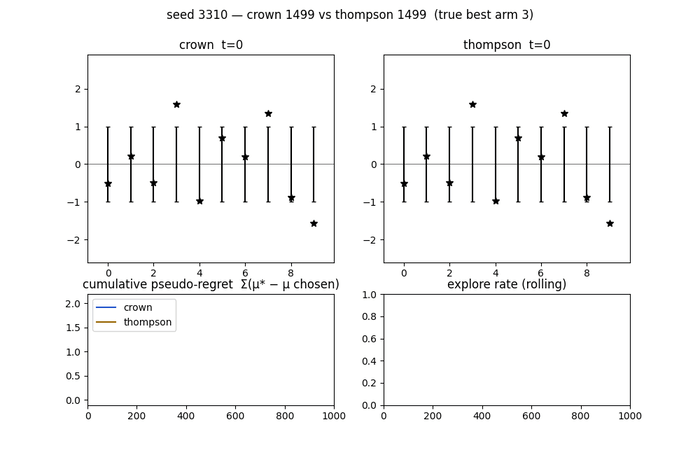
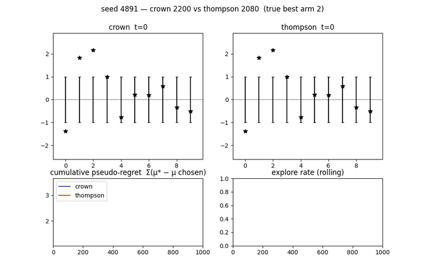
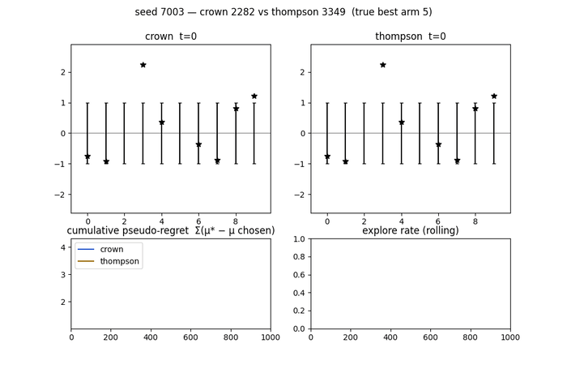
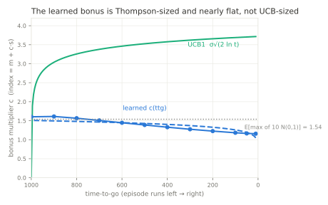

# What did the crown learn? — interpretation round (A8-a, #E23/#E24)

**What this document is owed by.** Spec §14.0 makes a readback owed by the
*stance*, not by the problem. `mab_schema.json` declares **two** tier-2
stances, both fixed at Phase A, and both owe a probe plus this file:

| # | stance | structure | verdict | where |
|---|---|---|---|---|
| RQ1 | `confirm` | index policy (posterior mean + coefficient × posterior sd) | **confirmed** | **Part I**, Rung 2 — 98% action agreement, 12-knot fit 1459.56 |
| RQ2 | `discover` | time-varying quantile coefficient `c(ttg/T)` | **confirmed** | **Part I**, Rungs 2–3 and the c-sweep; scored at protocol as `mab_benchmark_rule_eval.py` (#E26) |

**Part III answers no declared stance**, and **Part II has been reduced to a
reproduction note**. Both are by-products of chasing RQ1 and RQ2 — structural
in kind, but never pre-registered, so they owe no §14 deliverable. Part III is
kept in full because it reads directly against RQ2: the grid-trained net was
handed both `ttg/T` and `T` and recovered a *constant* coefficient anyway.
Part II's record lives in `ESCALATION.md` #E29/#E30. `README.md`'s
`2-structural` section carries the one-line verdict on each declared stance and
keeps the same separation.

*(**Every part opens with its rung-0 visualization** — watch the policy before
reading a statistic about it. The inlined figures are committed under
`figures/` so this document renders in a fresh clone; the full artifact set —
GIFs, per-policy metric JSONs, index-surface dumps — regenerates into
`results/gauss_K10_T1000/interpret/` via `mab_interpret.py`,
`mab_stats_probe.py` and `mab_policy_probe.py`. `results/` is gitignored; the
regenerating command is given in each rung-0 section, never a link into it.)*

Subject: **A8-a** (plain equivariant index policy @ A3-#6 HP; committed
3-seed mean 1453.57 ± 4.80, #E23). Deep dives on **a-s3** (1462.39, the ship
candidate); every structural claim was checked on all three seeds. Tools:
`mab_interpret.py` (battery / replay / tail), `mab_policy_probe.py`
(spec-§14 anchored readback), `mab_plot_policy.py` (figures). Probe
validated on known answers before discovery (§14.1): recovered UCB1's
analytic bonus to 0.12% median error; reproduced Thompson's #E17 anneal and
the old crown's inversion. Battery numbers are 8192-seed, CRN across
policies (shared latents ⇒ paired per-seed deltas are valid); replayed
policies carry fresh action draws, so replay means sit within draw noise of
the committed TSVs (crown_s3 1461.32 vs 1462.39; thompson 1463.19 vs
1462.38).

---

## The one-paragraph answer

The crown learned a **deterministic index in Thompson's clothing**: rank
arms by `posterior_mean + c·posterior_sd` with **c ≈ 1.5, nearly flat in
time** (c(ttg) = 1.51·(ttg/T)^0.079 — trajectory fit 1.60 → 1.16) — right at
Thompson's average bonus (E[max of 10 N(0,1)] = 1.54) and nowhere near
UCB1's growing σ√(2 ln t) ≈ 3.7. Its exploration *anneals* behaviorally
(0.26 → 0.09) because the bonus rides the shrinking posterior sd, exactly
Thompson's mechanism — but executed deterministically: the softmax
contributes nothing (a **12-number fitted table scores 1459.56 ± 6.33,
level with the 11k-parameter network it was read from**, 98% action
agreement — the §14.2 branch-1 claim, and the shippable artifact). Against
Thompson it is a different *risk profile*, not a different level: **+5.1
per seed on 98.8% of episodes** (cheaper exploration: explore-regret 49.7
vs 57.1) traded against a **1.2% wrong-lock tail at −569 per episode**
(final-ID 7% on those seeds where Thompson gets 100%) — netting to a
statistical tie (paired −1.9). UCB1 buys the opposite trade — the best
identification (95.6%) at an exploration premium (80.6) the prior doesn't
repay — and loses to the crown by 20. The critic knows all of this: V
correlates 0.97 with realized return-to-go *within* phases, and its
information price ∂V/∂(Σsd) anneals +3.8 → +0.4 across the episode — the
gradient that taught the actor everything above, with `ent_coef` ≈ 0.

---

## Rung 0 — watch first (side-by-side replays, shared latents)

**Start here.** Before any statistic, watch the policy play: the crown (top)
against thompson (bottom) on the *same* latent draw, so every visible
difference is the policy and not the world. Posterior bars ± sd, true means as
stars, the chosen arm coloured explore/exploit, and a cumulative-regret race
below. Seeds are the battery's **paired extremes**, not curated — the win, the
median, and the loss.

**median — seed 3310, the typical episode.** Both lock onto the same arm; the
crown's posterior bars stop moving earlier, which is the whole
deterministic-index story the rungs below formalise.



**win — seed 4891.** The crown identifies early and stops paying for
information; thompson keeps sampling its posterior and keeps paying. Watch the
regret race flatten for one and not the other.



**loss — seed 7003.** The failure mode Rung 3 anatomises: the crown locks onto
a runner-up and *never revisits*, so the regret race diverges linearly. This is
the starvation tail, visible in a single episode.



The loss replay is the single most useful frame of this document: it is the
same mechanism the whole campaign eventually formalised — a fixed quantile
never grows, so an abandoned arm is never reopened (#E31, #E34).

**Caveat, recorded.** Stochastic policies do not replay their recorded episode
(fresh action draws), so the loss seed re-lands negative but not at its
recorded −1406 — itself a demonstration of within-seed draw variance. The
render gate therefore demands the replay reproduce a *material* effect in
pseudo-regret rather than merely the recorded sign, and walks down the ranked
seed list until one does.

**Regenerating them.** The GIFs above are committed under `figures/` so this
document renders in a fresh clone. **The committed copies are downscaled**
to 700×455 from the renderer's 1000×650, re-encoded with `ffmpeg`'s
palettegen/paletteuse at `dither=none` — frame count, 80 ms timing and loop are
preserved exactly and only the pixel grid changes, which holds `figures/` at
~2.5 MB against ~5 MB for these three at full size. 700px is chosen to sit just
under a typical rendered content column, so the inlined `width="100%"` barely
upscales. Render full-size copies from the run artifacts, which are not
committed:

```bash
# needs the metrics battery first — it writes the per-seed npz files the
# replay picks its extreme seeds from
OMP_NUM_THREADS=1 python mab_interpret.py --part metrics
OMP_NUM_THREADS=1 python mab_interpret.py --part replay
# writes results/gauss_K10_T1000/interpret/replay_{win,median,loss}_seed*.gif
# plus replay_cases.json recording each seed's recorded and replayed delta

# refresh what this document inlines (downscale, 201 frames @ 80ms preserved):
ffmpeg -y -i results/gauss_K10_T1000/interpret/replay_win_seed4891.gif \
  -vf "fps=12.5,scale=700:-1:flags=lanczos,split[s0][s1];\
       [s0]palettegen=stats_mode=diff[p];[s1][p]paletteuse=dither=none" \
  figures/replay_win_seed4891.gif
```

Because the seeds are chosen from the battery's paired deltas, a re-run after
the model changes may select **different** seeds — that is intended, and the
filename carries the seed so a stale figure is self-identifying.

## Rung 1 — measure (the metric battery, 8192 seeds, CRN)


| policy | reward | explore e→l | regret expl/expl’t | final-ID | lock t | alloc β | Δ vs thompson (paired) |
|---|---|---|---|---|---|---|---|
| thompson | 1463.19 | 0.325 → 0.052 | 57.1 / 11.0 | 0.945 | 28 | 1.09 | — |
| **crown a-s3** | **1461.32** | 0.264 → 0.089 | **49.7** / 20.2 | 0.923 | **24** | **0.98** | **−1.9** |
| crown a-s2 | 1450.96 | 0.216 → 0.061 | 40.8 / 39.5 | 0.878 | 23 | 0.69 | −12.2 |
| crown a-s1 | 1443.52 | 0.238 → 0.058 | 51.1 / 36.7 | 0.881 | 22 | 0.49 | −19.7 |
| ucb1 | 1440.79 | 0.380 → 0.085 | 80.6 / **9.8** | **0.956** | 25 | 1.28 | −22.4 |
| old crown (ent 0.01) | 1385.68 | 0.198 → **0.310** | 111.5 / 33.8 | 0.930 | 48 | 1.78 | −77.5 |
| greedy | 1015.69 | 0 → 0 | 0 / 515.1 | 0.353 | never | 0.56 | −447.5 |

Readings (structure measured during life, per the 2048 rule):

- **The anneal is real and general to the ent≈0 family** — all three crown
  seeds fall 0.22–0.26 → 0.06–0.09; the old crown (same network, flat
  entropy subsidy) *rises* to 0.31. The subsidy, not the architecture, set
  the shape.
- **Allocation is Thompson-shaped, not UCB-shaped**: alloc β (LS exponent of
  pulls vs 1/Δ) — crown 0.98 ≈ thompson 1.09, ucb1 1.28. Mechanism-level
  agreement says the same: the crown's action law sits close to Thompson's
  (TV 0.17 → 0.07 across phases) and far from UCB1's (act-match 14% → 6%).
- **The regret ledgers differ in kind**: thompson pays 57 to explore and 11
  to exploit; ucb1 pays 81 to explore for a 9.8 exploit bill and the best
  final-ID; the crown pays the *least* to explore (49.7) and eats the
  difference in exploit-regret (20.2) — see rung 3 for where.
- Seed robustness: s1/s2 share every qualitative pattern but are weaker
  levels (#E21's per-run spread, visible here as −12/−20 paired).

## Rung 2 — the anchored index readback (spec §14)




The actor *is* φ(m, s, ttg) per arm — so we read it directly:

- **Sane index**: strictly monotone in m at 100% of grid points, every slice.
- **Nearly the m + c·s class**: linear R² 0.90 (ttg=900) → 0.96 (ttg=10);
  the residual curvature concentrates at high-m/low-s (exploit corner).
- **The bonus**: c(ttg) = 1.51·(ttg/T)^0.079 on visited states — flat-ish,
  Thompson-sized (E[max z₁₀] = 1.54), annealing mildly 1.60 → 1.16. UCB1's
  multiplier *grows* 2.6 → 3.7 over the same episode. The behavioral anneal
  comes through s itself — the bonus is pegged to the posterior, learned.
- **§14.2 scored fit** (the trio, 8192 CRN): net-stochastic **1462.39** /
  **fitted 12-knot table 1459.56 ± 6.33** / fitted 2-param power law
  1451.12 ± 6.27; agreement with the net's argmax 98.0%. Branch 1 fires
  (|fitted − net| ≪ 1% of bar): **the crown implements
  argmax(m + c(ttg)·s), and the 12 numbers are the deployable artifact** —
  deterministic, no torch. The deterministic fit matching the *stochastic*
  net also shows the softmax adds nothing the c·s bonus doesn't provide.

**Where this readback went, because this document alone understates it.**
Everything above reports the fitted rule *matching* the net — which reads as a
tie with Thompson, and stops short of the result the readback made possible.
Re-tuning the fit's single constant (#E26, `--part csweep`) gives
`argmax(pm + 2.5·(ttg/T)^0.15·psd)` scoring **1486.14 — +22.95 over Thompson,
z = 36.8**, and that two-constant formula, not the network, is the campaign's
shipped deliverable. Two bounds ship with it: it is Gaussian-only, and #E34
measured where the form stops — a fixed quantile is inconsistent, so its regret
is linear in T against Thompson's log and it **crosses back at T ≈ 14,000**
total rounds. See `README.md` for the leaderboard and `PLAYBOOK.md` LV8/LV9.

## Rung 2b — the critic


- **Calibration without the Simpson split**: Pearson(V, realized
  return-to-go) = 0.97 overall and 0.85/0.98/0.89 within early/mid/late —
  unlike 2048's progress-tracking critic, this one forecasts fortune (the
  belief state is a sufficient statistic, so it can).
- **The price of information**: ∂V/∂(Σ sd) = +3.77 early → +0.40 late, a ~9×
  anneal. At ent≈0 this gradient is the only exploration teacher; #E22's
  mechanism, measured. (Normalized-return units; shape meaningful, scale not.)

## Rung 3 — the tail is the whole story of the Thompson gap

| | worst 100 paired seeds | other 8092 |
|---|---|---|
| paired Δ vs thompson | **−568.8** | **+5.1** |
| crown final-ID | **0.07** | 0.93 |
| thompson final-ID, same seeds | **1.00** | 0.94 |
| regret exploit / explore | 577 / 47 | 13 / 50 |
| top-two gap (hardness) | 0.54 | 0.41 |

Identity: 0.988·(+5.1) + 0.012·(−568.8) ≈ −1.9 = the overall paired delta.
The gap is not diffuse under-performance; it is a **rare premature-commit
failure**: ~1.2% of episodes where an early unlucky draw writes off the true
best arm and c ≈ 1.5·s never grows enough to force a revisit — the log-t
term UCB carries is precisely the insurance against this, and its 80.6-point
premium is why it loses everywhere else. Not instance hardness (corr with
top-two gap 0.08; Thompson solves all 100). **Candidate next lever** (not
run): a floor or late log-term in c(ttg) targeted at wrong-lock escape —
worth ~17 points of mean if bought without UCB's full premium; cheap to
test on the fitted rule *before* any training.

## Process note — a false alarm, caught by the round's own hygiene

During the battery I briefly concluded the recorded benchmark bars were
stale (pre-F1). Wrong: I had read `metrics_summary.json` written by a
**96-seed smoke run** as the full-battery result, and small-block means
(thompson 1490.2@96) diverge wildly from 8192 means. Official scalar
re-runs reproduce every recorded bar bit-exactly (thompson 1462.3796, ucb1
1440.7932, greedy 1015.6932, random −2.5113); the mtime-vs-commit forensics
had conflated commit time with code-change time (the 07-29 re-run used the
already-fixed working tree, committed 07-30). No ledger number was ever
wrong. Lessons, kept: **smoke artifacts must not share paths with record
artifacts** (fixed obligation for `mab_interpret.py`), and a summary file's
`n_seeds` field exists to be checked.

---

# Part II — the stats-encoding twin (#E29/#E30): not reproduced here

**Removed from this document on purpose.** The stats twin readback answers no
declared stance — it is a by-product, like Part III — and at ~220 lines it was
the longest section here while being the one least likely to be read. Its
findings are not lost: **`ESCALATION.md` #E29 and #E30 are the record**, and
the one-line verdict rides on the leaderboard row in `README.md`
(`PPO obs=stats index @ tuned HP`, 1408.55).

What it established, in three sentences. The stats twin is **not an index
policy — it is a learned Thompson**: its deterministic mode is a near-greedy,
mildly *pessimistic* rule (best flat c = −0.47), worthless played straight
(argmax 643.60), and essentially all of its performance lives in a
posterior-calibrated sampling anneal (0.31 → 0.05). Its stochastic−argmax gap
is **772–1442** against the bayes crown's **37** — same architecture, different
observation encoding. The conclusion that survives into the campaign's summary
is that **the encoding decides *where* exploration lives**, not how much of it
there is.

**To regenerate the full analysis and its figures** (nothing is committed for
it, so this is the only route):

```bash
# the readback itself — belief-coordinate index fit, ablations, the anneal
OMP_NUM_THREADS=1 python mab_stats_probe.py --part all

# its figures -> figures/fig_stats_{gap,explore,mode,index}.svg
python mab_stats_plot.py

# its rung-0 replays: the SAME net sampled vs argmax on shared latents,
# cases in results/gauss_K10_T1000/interpret/stats_replay_cases.json
OMP_NUM_THREADS=1 python mab_stats_probe.py --part gif

# the three-way race (thompson vs bayes twin vs stats twin, one seed)
OMP_NUM_THREADS=1 python mab_stats_probe.py --part race
```

The `collapse` seed (25) is the one worth watching: the argmax leg wrong-locks
on a wrong arm while the true best sits unexplored, and pseudo-regret climbs
linearly, while the sampled leg anneals and flattens.

# Part III — what did the generalist learn? (#E36 / #E37)

Subject: the three **#E36 generalists** — one net trained across a §5.6
`ScenarioGrid` of 40 log-spaced cells, T ∈ [500, 10000], `obs=bayes_h`,
`policy=index_h`. Tool: `mab_generalist_readback.py`.

This is the only net in the campaign handed **`ttg` and `T` raw and
separately**. `_IndexHExtractor._split` scales both by the *constant* `t_max`
and never divides them, deliberately: their ratio is what #E26 fitted, so
manufacturing it would beg the question the round exists to ask.

**The probe's gate is two-sided, and that is the methodological point.** A
one-sided validation — "does it recover a known c?" — cannot show the probe is
able to *detect* T-dependence, which is the whole question. So the same
extraction runs on two analytic indices with known, opposite answers: #E26's
own rule (ratio-only by construction) must read q=0, and UCB1 (bonus depends on
elapsed t) must read q>0. Results: rule **q = 0.0000**, within-r spread 0.0000,
linear R² 1.000, recovering `2.5·r^0.15` to three digits; UCB1 **q = +0.0756**.
The control needed one repair first — with `n = 1/s²−1` floored at 1e-9 the
untouched-arm corner diverges and the fitted c reached ~1.6e4, so the gate
"passed" on a singularity; floored at n ≥ 1 it reads 3.33 → 5.06.

## Rung 0 — no replay exists for this part, and that is a gap

Part I opens by watching an episode. **This one cannot**: the
generalist readback (`mab_generalist_readback.py`) fits a coefficient across
grid cells and accounts for arm coverage — it renders no trajectory, so there
is no GIF to inline and none is committed. The finding below is therefore
carried entirely by fitted numbers, which is weaker evidence of the same kind
of claim.

What it would take, if someone wants it: the replay machinery in
`mab_interpret.py` is hard-wired to `VecSim` at the base cell (K=10, T=1000),
so a generalist replay needs a renderer that accepts the episode's own `T` —
the same widening `bayes_h` / `index_h` already did for the observation and
policy. The most informative frame would be a long cell (T=10000) showing the
runner-up arm receiving its median of 2 pulls, which is #E34's mechanism made
visible rather than inferred.

## The one-paragraph answer

The generalist is a **fixed-quantile index**: `argmax_i(pm_i + c·psd_i)` with
**c ≈ 0.85, constant**. Not a function of `ttg/T` (exponent 0.003, against the
#E26 rule's 0.15) and not of `T` (0.003, against #E32's 0.286) — given both
arguments raw, across a 20× range of horizons, it learned *one number*. That
number is about **⅓** of the fitted optimum `c*(n) = 1.204 + 0.286·ln(T/K)`,
and the shortfall widens (0.37 of it at T=500 → 0.28 at T=10000) because `c*`
grows with the horizon and `c` does not. Everything else follows from #E34,
which had already proved that class inconsistent: regret near-linear in T
(R² 0.9999 vs 0.9653 for log, while Thompson on the same cells fits log at
0.9978), and starvation that becomes total — at T=10000 only ~6 of 10 arms are
ever pulled and the runner-up gets a median of **2 pulls out of 10,000**.

| index | exponent in `r = ttg/T` | exponent in `T` | c |
|---|---|---|---|
| #E26 rule | **0.15** | 0 | 1.77 – 2.46 |
| A8-a specialist (Part I) | **0.079** | n/a — one horizon | 1.16 – 1.60 |
| **generalist, 3 seeds** | **+0.003** | **+0.003** | **0.75 – 0.99** |
| thompson (scale) | — | — | 1.54 = E[max z₁₀] |
| ucb1 | — | +0.076 | 3.33 – 5.06 |

## What this settles, and what it does not

1. **More freedom bought less structure.** A8-a, a specialist at one horizon
   handed `ttg/T` pre-divided, learned an exponent of 0.079. The generalist,
   free to do anything with both arguments, learned 0.003. The capacity went
   somewhere, but not into the time dependence it was given in order to find.
2. **All three pre-registered outcomes were wrong.** H-ratio, H-scale and
   H-neither each assumed *some* dependence. The answer was neither argument.
   H-ratio is technically satisfied (q≈0) but recording it as confirmed would
   be false — there is no ratio structure either.
3. **It corrected #E36's own verdict.** That entry attributed the long-horizon
   deficit to `gae_lambda` coverage. The proximate cause is the index class.
   Coverage survives only as a candidate for *why* a constant was learned — and
   it does not fit the shape, since coverage varies 20× across the grid while
   `c` does not vary at all. **Why the net collapsed to a constant is
   unresolved**, and it is the most interesting question this campaign leaves.
4. **Two claims died in the making, both recorded.** The trajectory-weighted
   fit is unusable here — the visited cloud is bimodal, >50% of arm-states at
   n ≤ 1, so a least-squares slope is a chord between clusters rather than a
   local exchange rate, and it disagreed with the grid fit by ~2×. And a
   behavioural reading ("one arm, 10,000/10,000, zero exploration") came from
   three rollouts with `deterministic=False` and the torch RNG unseeded; seeded
   at 32–64 episodes it is the phase change in the table above. Right in
   direction, false in its numbers.

Deliverable note: nothing here changes the ship candidate — the #E26 formula
stands, now with Part III as the clearest statement of what the *learned*
alternative actually is, and why #E34 stopped the search.
